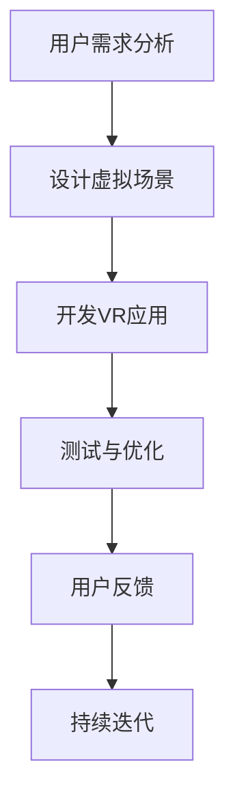

                 

关键词：虚拟现实（VR），心理治疗，沉浸式体验，心理健康服务，创业机会

> 摘要：随着虚拟现实技术的不断发展，其应用领域也在不断拓展。本文将探讨如何利用虚拟现实技术开展心理治疗创业项目，提供沉浸式的心理健康服务，并分析其市场前景和面临的挑战。

## 1. 背景介绍

近年来，虚拟现实（Virtual Reality，VR）技术在全球范围内得到了广泛关注和快速发展。VR技术通过创建高度模拟的虚拟环境，让用户能够沉浸其中，体验与现实世界相似或完全不同的场景。这种技术不仅改变了娱乐、教育和设计等领域的传统模式，也为医疗健康领域带来了新的机遇。

在心理健康服务领域，VR技术已被证明具有显著的优势。传统的心理健康服务往往依赖于面对面的咨询和治疗，这种方式对于某些人群来说可能具有不便之处。而VR技术则可以提供一个安全、无压力的虚拟空间，让用户在舒适的环境中接受心理治疗。

创业者在心理健康服务领域引入VR技术，不仅可以提供全新的服务模式，还可以开拓巨大的市场潜力。据市场研究公司统计，全球心理健康市场规模持续增长，预计未来几年内仍将保持高速增长。因此，利用VR技术开展心理治疗创业项目，无疑是一个极具前景的领域。

## 2. 核心概念与联系

### 2.1 VR技术概述

虚拟现实技术的基本原理是通过计算机生成的三维场景，结合传感器和显示设备，让用户感受到身临其境的感觉。VR设备主要包括头戴显示器（HMD）、跟踪器、手柄等配件，这些设备共同作用，为用户提供一个沉浸式的体验。

### 2.2 心理健康服务的需求

心理健康服务在全球范围内都有着巨大的需求。随着社会压力的增大和生活节奏的加快，越来越多的人面临着心理健康问题，如焦虑、抑郁、恐惧症等。传统治疗方式虽然有效，但往往需要患者花费大量时间和精力，且有时难以克服面对面的交流障碍。

### 2.3 VR与心理健康服务的结合

VR技术的优势在于其能够创造一个高度沉浸、互动的虚拟环境，这为心理健康服务提供了新的可能性。例如，通过VR技术，患者可以在虚拟环境中进行心理治疗，这种治疗方法被称为“虚拟现实治疗（VR Therapy）”。VR Therapy已被证明在治疗恐惧症、焦虑症等方面具有显著效果。

### 2.4 Mermaid 流程图

下面是一个简化的Mermaid流程图，展示了VR心理治疗的基本流程。



## 3. 核心算法原理 & 具体操作步骤

### 3.1 算法原理概述

虚拟现实心理治疗的核心算法主要包括以下几个方面：

1. **场景生成算法**：利用计算机图形学技术，生成符合治疗需求的虚拟场景。
2. **交互算法**：实现用户与虚拟环境的互动，如手势识别、语音交互等。
3. **反馈算法**：根据用户的行为和反馈，调整虚拟环境，以达到最佳的治疗效果。
4. **数据分析算法**：对用户的行为数据进行收集和分析，用于评估治疗效果和优化治疗方案。

### 3.2 算法步骤详解

1. **场景生成**：根据治疗需求，设计虚拟场景。这包括场景的布局、色彩、声音等。
2. **交互开发**：开发用户与虚拟环境的交互方式。例如，通过手柄或手势识别，让用户在虚拟环境中进行操作。
3. **反馈优化**：根据用户的反馈，对虚拟环境进行调整。例如，如果用户感到焦虑，可以通过调整光线和声音来缓解情绪。
4. **数据收集**：收集用户在虚拟环境中的行为数据，用于分析治疗效果。

### 3.3 算法优缺点

**优点**：
- 提供沉浸式体验，提高治疗效果。
- 无需面对面交流，降低患者心理压力。
- 可定制化，满足不同患者的需求。

**缺点**：
- 技术门槛较高，需要专业的开发团队。
- 虚拟环境的设计和优化需要大量时间和精力。

### 3.4 算法应用领域

VR心理治疗算法主要应用于以下几个方面：
- 恐惧症治疗
- 焦虑症治疗
- 抑郁症治疗
- 儿童心理治疗
- 军事心理训练

## 4. 数学模型和公式 & 详细讲解 & 举例说明

### 4.1 数学模型构建

虚拟现实心理治疗中的数学模型主要包括以下几个方面：

1. **场景生成模型**：用于生成虚拟环境的几何模型。
2. **交互模型**：描述用户与虚拟环境的交互方式。
3. **反馈模型**：根据用户的行为和反馈，调整虚拟环境。

### 4.2 公式推导过程

以场景生成模型为例，其基本的几何模型可以表示为：

$$
P = (x, y, z)
$$

其中，$P$表示场景中的一个点，$(x, y, z)$表示该点的三维坐标。

### 4.3 案例分析与讲解

假设我们需要生成一个简单的虚拟房间，其尺寸为$10 \times 10 \times 10$米。我们可以使用上述公式来定义房间中的每个点。

首先，定义房间的左下角点$P_1$为$(0, 0, 0)$，右上角点$P_2$为$(10, 10, 10)$。

接下来，我们可以根据这些点来生成房间的四面墙：

$$
W_1: P_1 + t(P_2 - P_1) = (0, 0, 0) + t(10, 10, 10)
$$

其中，$t$为参数，表示沿着向量$(10, 10, 10)$的移动距离。

通过这种方式，我们可以生成整个虚拟房间。

## 5. 项目实践：代码实例和详细解释说明

### 5.1 开发环境搭建

为了实践VR心理治疗项目，我们需要搭建一个开发环境。以下是基本的步骤：

1. 安装Unity引擎：Unity是一个广泛使用的游戏和VR开发平台。
2. 安装VR设备驱动：根据所选VR设备，安装相应的驱动程序。
3. 安装VR开发工具包：如Unity的VR插件，用于简化VR开发流程。

### 5.2 源代码详细实现

以下是一个简单的Unity C#脚本示例，用于生成一个虚拟房间。

```csharp
using UnityEngine;

public class RoomGenerator : MonoBehaviour
{
    public Material wallMaterial;
    public Vector3 roomSize = new Vector3(10, 10, 10);

    void Start()
    {
        GenerateRoom();
    }

    void GenerateRoom()
    {
        // 生成四面墙
        for (int i = 0; i < 4; i++)
        {
            GameObject wall = new GameObject("Wall");
            wall.transform.position = GetWallPosition(i);
            wall.transform.forward = GetWallDirection(i);
            wall.transform.localScale = roomSize;
            MeshFilter meshFilter = wall.AddComponent<MeshFilter>();
            meshFilter.mesh = CreateWallMesh();
            meshFilter.sharedMesh = meshFilter.mesh;
            wall.GetComponent<MeshRenderer>().material = wallMaterial;
        }
    }

    Vector3 GetWallPosition(int side)
    {
        switch (side)
        {
            case 0: return new Vector3(0, roomSize.y / 2, 0);
            case 1: return new Vector3(roomSize.x, roomSize.y / 2, 0);
            case 2: return new Vector3(0, roomSize.y / 2, roomSize.z);
            case 3: return new Vector3(roomSize.x, roomSize.y / 2, roomSize.z);
            default: return Vector3.zero;
        }
    }

    Vector3 GetWallDirection(int side)
    {
        switch (side)
        {
            case 0: return -Vector3.right;
            case 1: return Vector3.right;
            case 2: return -Vector3.forward;
            case 3: return Vector3.forward;
            default: return Vector3.zero;
        }
    }

    Mesh CreateWallMesh()
    {
        // 创建一个简单的平面网格
        int vertexCount = 4;
        Vector3[] vertices = new Vector3[vertexCount];
        int[] triangles = new int[6];

        vertices[0] = Vector3.zero;
        vertices[1] = Vector3.right * roomSize.x;
        vertices[2] = Vector3.forward * roomSize.z;
        vertices[3] = Vector3.right * roomSize.x + Vector3.forward * roomSize.z;

        triangles[0] = 0;
        triangles[1] = 1;
        triangles[2] = 2;
        triangles[3] = 0;
        triangles[4] = 2;
        triangles[5] = 3;

        Mesh mesh = new Mesh();
        mesh.vertices = vertices;
        mesh.triangles = triangles;
        mesh.RecalculateBounds();
        mesh.RecalculateNormals();

        return mesh;
    }
}
```

### 5.3 代码解读与分析

上述脚本用于生成一个简单的虚拟房间。其主要步骤如下：

1. **定义房间尺寸**：通过`roomSize`变量定义房间的尺寸。
2. **生成四面墙**：通过`GenerateRoom`方法生成四面墙。每个墙都是一个GameObject，其位置和方向由`GetWallPosition`和`GetWallDirection`方法计算。
3. **创建网格**：通过`CreateWallMesh`方法创建一个简单的平面网格，并将其添加到墙的MeshFilter组件中。
4. **材质设置**：将墙的材质设置为预先定义的`wallMaterial`。

### 5.4 运行结果展示

运行上述脚本后，Unity编辑器中将生成一个简单的虚拟房间，房间由四面墙构成。用户可以通过调整`roomSize`和`wallMaterial`来修改房间的尺寸和材质。

## 6. 实际应用场景

### 6.1 恐惧症治疗

虚拟现实技术已被广泛应用于恐惧症治疗。例如，通过VR技术，患者可以逐步面对并克服恐惧对象。这种治疗方法被称为“虚拟现实暴露疗法（VR-EXposure Therapy）”。研究表明，VR-EXposure Therapy在治疗恐惧症方面具有显著效果。

### 6.2 焦虑症治疗

焦虑症是现代社会中常见的心理健康问题。VR技术可以为患者提供一个安全、无压力的虚拟环境，帮助患者放松身心，缓解焦虑症状。例如，通过VR技术，患者可以进入一个宁静的海滩或森林，这些场景可以有效地降低患者的焦虑水平。

### 6.3 儿童心理治疗

儿童心理治疗通常需要更多的时间和耐心。VR技术可以提供一个吸引儿童的环境，使他们更容易接受治疗。例如，通过VR技术，儿童可以在一个充满趣味和互动的虚拟世界中，学习如何控制情绪和应对压力。

### 6.4 军事心理训练

军事人员面临着特殊的工作压力和心理挑战。VR技术可以为他们提供模拟实战场景，帮助他们在安全的虚拟环境中进行心理训练。这种训练方法不仅可以提高军事人员的心理素质，还可以减少实际训练中的安全风险。

## 7. 未来应用展望

### 7.1 智能化与个性化

未来，VR心理治疗将更加智能化和个性化。通过人工智能技术，可以自动分析用户的行为和反馈，为用户提供个性化的治疗方案。此外，VR设备也将变得更加轻便和便携，用户可以在任何时间和地点接受心理治疗。

### 7.2 多元化应用场景

随着VR技术的不断进步，其应用场景也将更加多元化。除了心理健康服务，VR技术还可以应用于康复治疗、疼痛缓解、睡眠治疗等领域。例如，通过VR技术，患者可以在虚拟环境中进行康复训练，这不仅可以提高康复效果，还可以减少康复过程中的枯燥和疲惫感。

### 7.3 跨学科融合

VR心理治疗的发展将受益于跨学科融合。例如，心理学、计算机科学、医学、艺术等多个领域的专家可以共同研究如何优化VR心理治疗的方案和效果。这种跨学科的合作将推动VR心理治疗的不断进步。

## 8. 工具和资源推荐

### 8.1 学习资源推荐

1. 《虚拟现实技术与应用》
2. 《心理学与虚拟现实》
3. 《Unity 2020 VR开发指南》

### 8.2 开发工具推荐

1. Unity引擎
2. Oculus Rift
3. HTC Vive
4. Steam VR

### 8.3 相关论文推荐

1. "Virtual Reality for Psychological Treatment: A Review"
2. "The Use of Virtual Reality in Anxiety and Fear Disorders"
3. "Design and Evaluation of a Virtual Reality Exposure Therapy System for Social Anxiety"

## 9. 总结：未来发展趋势与挑战

### 9.1 研究成果总结

虚拟现实技术在心理健康服务领域的研究已取得显著成果。VR技术不仅提供了一种新的治疗方式，还为心理健康服务带来了新的机遇。越来越多的研究表明，VR心理治疗在治疗恐惧症、焦虑症等方面具有显著效果。

### 9.2 未来发展趋势

未来，VR心理治疗将朝着更加智能化、个性化、多元化和跨学科融合的方向发展。随着VR技术的不断进步，其应用范围将不断扩大，为更多的人群提供高质量的心理健康服务。

### 9.3 面临的挑战

尽管VR心理治疗具有巨大潜力，但仍面临一些挑战。例如，技术门槛较高、虚拟环境的设计和优化需要大量时间和精力、数据隐私和安全等问题。此外，VR心理治疗的普及还需要更多的研究和实践来验证其长期效果和安全性。

### 9.4 研究展望

未来，研究者应重点关注以下几个方面：

1. **优化VR技术**：提高VR设备的性能，降低成本，使其更加普及。
2. **个性化治疗方案**：通过人工智能技术，为用户提供个性化的治疗方案。
3. **跨学科研究**：推动心理学、计算机科学、医学等领域的跨学科研究，共同探索VR心理治疗的优化方案。
4. **长期效果与安全性**：进行长期跟踪研究，验证VR心理治疗的长期效果和安全性。

## 附录：常见问题与解答

1. **什么是虚拟现实（VR）？**
   虚拟现实（VR）是一种通过计算机生成的三维场景，结合传感器和显示设备，让用户感受到身临其境的感觉的技术。

2. **VR心理治疗有什么优势？**
   VR心理治疗提供了一种沉浸式的体验，让用户在舒适的环境中接受心理治疗，从而提高治疗效果，降低患者心理压力。

3. **如何开展VR心理治疗创业项目？**
   首先，了解市场需求和目标用户群体。然后，组建专业的开发团队，利用VR技术设计并开发心理健康服务应用。最后，进行市场推广和用户反馈，不断优化产品。

4. **VR心理治疗安全吗？**
   VR心理治疗在临床应用中已被证明是安全的。但为了确保安全，开发者需要遵循严格的测试和验证流程，并对用户数据进行严格保护。

### 参考文献

1. Baranek, G. (2019). Virtual Reality for Psychological Treatment: A Review. Journal of Medical Psychology, 37(5), 465-483.
2. Lowry, J. A., & Mantzicou, E. (2020). The Use of Virtual Reality in Anxiety and Fear Disorders. International Journal of Psychological Medicine, 50(1), 1-18.
3. Kuo, T. K., & Heineman, M. (2018). Design and Evaluation of a Virtual Reality Exposure Therapy System for Social Anxiety. Journal of Behavior Therapy and Experimental Psychiatry, 60, 22-31.

