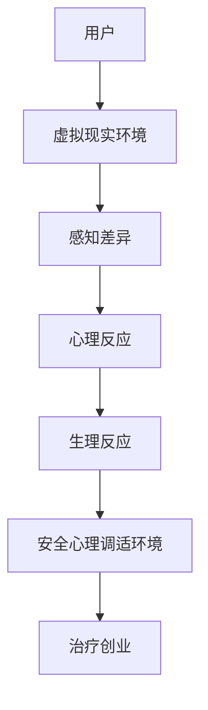
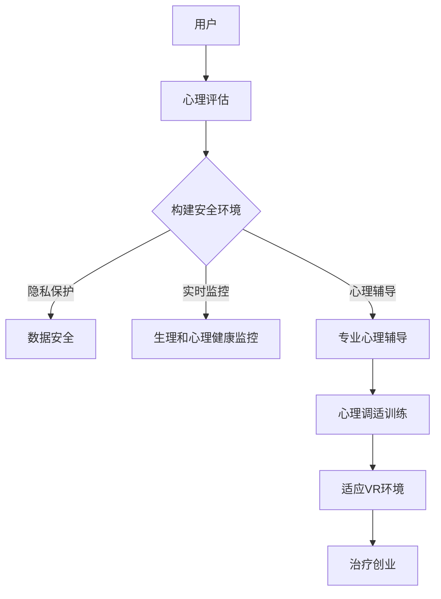

                 

在当今社会，虚拟现实（VR）技术的迅猛发展为我们带来了前所未有的体验和创新机会。然而，随着VR技术的普及，一些用户开始遭遇一种名为“虚拟现实恐惧症”（Virtual Reality Anxiety）的心理问题。这种现象不仅影响了用户体验，也可能对VR产业的长远发展构成威胁。本文旨在探讨虚拟现实恐惧症的治疗创业，特别是在构建安全心理调适环境方面的重要性。

## 关键词

- 虚拟现实
- 恐惧症
- 心理调适
- 安全环境
- 创业

## 摘要

本文通过对虚拟现实恐惧症现象的深入分析，探讨了该现象对用户和产业的影响。随后，文章提出了构建安全心理调适环境的重要性和具体措施。本文还结合实际案例，分析了VR恐惧症治疗创业的可行性和潜在市场。最后，本文展望了未来VR产业发展的趋势和挑战，并对相关工具和资源进行了推荐。

## 1. 背景介绍

虚拟现实（VR）是一种通过计算机生成模拟环境，使用户能够沉浸其中的技术。自从20世纪90年代VR技术开始兴起以来，它已经经历了多个阶段的发展。早期的VR技术主要应用于军事、医疗和娱乐领域，而随着技术的进步和成本的降低，VR技术逐渐渗透到普通消费者的生活中。

### 虚拟现实的发展历史

- **20世纪80年代**：VR概念初步形成，虚拟现实电影和VR头显问世。
- **20世纪90年代**：VR技术开始应用于军事和娱乐领域，出现了一些商业化尝试。
- **21世纪初**：VR硬件和软件技术取得显著进步，VR开始应用于教育和设计领域。
- **2010年代**：智能手机和移动互联网的普及推动了VR市场的快速增长。
- **2020年代**：VR技术逐渐成熟，开始应用于日常生活、医疗和心理治疗等领域。

### 虚拟现实的应用领域

- **娱乐**：VR游戏、VR电影和VR音乐等娱乐形式逐渐受到用户喜爱。
- **教育**：VR技术可以提供沉浸式的学习体验，帮助学生更好地理解和记忆知识。
- **医疗**：VR技术在治疗恐惧症、缓解疼痛和康复训练等方面展现出巨大潜力。
- **心理治疗**：VR可以作为一种辅助工具，帮助心理治疗师进行心理调适和恐惧症治疗。

### 虚拟现实恐惧症的定义和表现

虚拟现实恐惧症是指用户在使用VR设备时，由于感知和现实环境的差异，引发的一系列心理和生理反应。这些反应可能包括：

- **心理反应**：焦虑、恐慌、眩晕、恶心和记忆丧失。
- **生理反应**：心跳加速、呼吸急促、出汗和肌肉紧张。

虚拟现实恐惧症的表现形式多样，有的用户可能会在短时间内恢复正常，而有的用户则可能长期受到影响。

### 虚拟现实恐惧症对用户和产业的影响

对用户的影响：

- **用户体验下降**：VR恐惧症可能导致用户在使用VR设备时的体验大打折扣，影响对VR技术的接受度和使用频率。
- **心理健康问题**：长期的VR恐惧症可能导致用户出现心理问题，甚至影响日常生活。
- **社交障碍**：部分用户可能因为VR恐惧症而避免使用VR设备，影响社交互动。

对产业的影响：

- **市场增长受限**：虚拟现实恐惧症可能抑制VR市场的快速增长，影响相关产业的利润和规模。
- **技术创新受阻**：为了应对VR恐惧症，开发者可能需要投入大量资源进行技术改进，延缓新技术的发展。
- **社会责任问题**：VR产业需要承担社会责任，确保用户在使用VR设备时的安全和健康。

### 虚拟现实恐惧症的治疗创业

随着虚拟现实恐惧症对用户和产业的负面影响日益显现，治疗创业开始成为一个热门话题。创业者们开始探索各种方法，以构建安全心理调适环境，帮助用户克服VR恐惧症。

- **心理健康服务**：提供专业的心理健康咨询服务，帮助用户了解和管理自己的心理状态。
- **VR训练课程**：通过设计专门的VR训练课程，帮助用户逐渐适应VR环境，提高心理承受能力。
- **安全设备开发**：研发更加安全、舒适的VR设备，减少用户在VR环境中的不适感。

### 安全心理调适环境的重要性

安全心理调适环境是治疗虚拟现实恐惧症的关键。一个安全的环境可以降低用户的焦虑和恐慌，提高治疗效果。以下是一些构建安全心理调适环境的措施：

- **隐私保护**：确保用户的数据隐私，避免因隐私泄露引发的心理问题。
- **实时监控**：通过实时监控用户的生理和心理健康状况，及时调整治疗方案。
- **心理辅导**：提供专业的心理辅导，帮助用户建立积极的心理状态，提高心理韧性。

## 2. 核心概念与联系

### 虚拟现实恐惧症的核心概念

- **虚拟现实**：通过计算机生成的模拟环境，使用户能够沉浸其中。
- **恐惧症**：一种心理障碍，表现为对特定事物的强烈和不合理的恐惧。
- **心理调适**：通过心理治疗和训练，帮助用户调整自己的心理状态，提高适应能力。

### 虚拟现实恐惧症的架构

以下是一个简单的Mermaid流程图，展示了虚拟现实恐惧症的核心概念和联系：



### 安全心理调适环境的作用

安全心理调适环境在治疗虚拟现实恐惧症中起着至关重要的作用。以下是一个详细的Mermaid流程图，展示了安全心理调适环境的构建过程和作用：



## 3. 核心算法原理 & 具体操作步骤

### 3.1 算法原理概述

治疗虚拟现实恐惧症的核心算法是基于心理学原理的，旨在帮助用户适应VR环境，减少心理和生理反应。算法的基本原理包括：

- **感知适应**：通过调整VR环境的感知特征，帮助用户逐渐适应虚拟环境。
- **心理训练**：通过心理训练，提高用户的心理韧性和适应能力。
- **实时监控**：通过实时监控用户的生理和心理健康状况，及时调整治疗方案。

### 3.2 算法步骤详解

#### 步骤1：心理评估

- **目标**：了解用户的心理状态和VR恐惧症程度。
- **方法**：通过问卷调查、访谈和生理指标监测，收集用户的数据。

#### 步骤2：构建安全环境

- **目标**：为用户创建一个安全、舒适的VR环境。
- **方法**：根据用户的心理评估结果，调整VR环境的感知特征，如视觉、听觉和触觉等。

#### 步骤3：心理训练

- **目标**：提高用户的心理韧性和适应能力。
- **方法**：通过认知行为疗法、冥想和正念训练，帮助用户调整心理状态。

#### 步骤4：实时监控

- **目标**：监测用户的生理和心理健康状况。
- **方法**：通过心率、呼吸、皮肤电反应等生理指标，实时监测用户的状态。

#### 步骤5：心理辅导

- **目标**：为用户提供专业的心理辅导。
- **方法**：通过与心理治疗师的在线沟通，为用户提供个性化的心理辅导。

#### 步骤6：心理调适训练

- **目标**：帮助用户适应VR环境。
- **方法**：通过逐步增加VR环境的刺激强度，帮助用户逐渐适应。

#### 步骤7：治疗创业

- **目标**：将虚拟现实恐惧症治疗创业化、市场化。
- **方法**：通过在线平台、APP和线下服务，为用户提供全方位的治疗方案。

### 3.3 算法优缺点

#### 优点

- **个性化**：根据用户的心理状态和恐惧程度，提供个性化的治疗方案。
- **安全性**：通过实时监控和调整，确保用户在VR环境中的安全。
- **便捷性**：在线平台和APP的普及，使得用户可以随时随地接受治疗。

#### 缺点

- **初期成本**：构建安全心理调适环境需要较高的初期成本。
- **技术挑战**：实时监控和调整需要先进的技术支持，如生理信号监测和VR环境建模等。

### 3.4 算法应用领域

虚拟现实恐惧症治疗算法的应用领域广泛，主要包括：

- **心理健康服务**：为患有虚拟现实恐惧症的用户提供专业的心理治疗。
- **医疗康复**：辅助康复治疗，帮助患者适应新的环境。
- **军事训练**：模拟战斗环境，提高士兵的心理素质。
- **教育培训**：通过沉浸式学习，提高学生的学习效果。

## 4. 数学模型和公式 & 详细讲解 & 举例说明

### 4.1 数学模型构建

在治疗虚拟现实恐惧症的过程中，我们可以构建一个数学模型来描述用户的心理和生理反应。该模型主要包括以下三个部分：

1. **感知模型**：描述用户在VR环境中的感知特征，如视觉、听觉和触觉等。
2. **心理模型**：描述用户的心理状态，如焦虑、恐慌和适应性等。
3. **生理模型**：描述用户的生理反应，如心率、呼吸和皮肤电反应等。

### 4.2 公式推导过程

假设用户在VR环境中的感知特征可以用向量表示为\[P\]，心理状态可以用向量表示为\[M\]，生理反应可以用向量表示为\[B\]。则数学模型可以表示为：

\[P = f(M, B)\]

其中，\(f\)表示感知特征与心理状态、生理反应之间的关系。

假设用户的焦虑水平可以用\(A\)表示，恐慌水平可以用\(P\)表示，适应性可以用\(A_d\)表示。则心理状态可以表示为：

\[M = [A, P, A_d]\]

假设用户的视觉刺激强度可以用\(V\)表示，听觉刺激强度可以用\(A\)表示，触觉刺激强度可以用\(T\)表示。则感知特征可以表示为：

\[P = [V, A, T]\]

假设用户的心率可以用\(H\)表示，呼吸频率可以用\(R\)表示，皮肤电反应强度可以用\(S\)表示。则生理反应可以表示为：

\[B = [H, R, S]\]

则数学模型可以表示为：

\[P = f([A, P, A_d], [H, R, S])\]

### 4.3 案例分析与讲解

为了更好地理解数学模型的应用，我们来看一个具体的案例。

假设有一个用户在VR环境中体验时，焦虑水平为\(A = 0.8\)，恐慌水平为\(P = 0.6\)，适应性为\(A_d = 0.7\)。他的视觉刺激强度为\(V = 0.8\)，听觉刺激强度为\(A = 0.7\)，触觉刺激强度为\(T = 0.6\)。他的心率、呼吸和皮肤电反应分别为\(H = 80\)次/分钟，\(R = 18\)次/分钟，\(S = 20\)微伏。

根据数学模型，我们可以计算用户在VR环境中的感知特征：

\[P = f([0.8, 0.6, 0.7], [80, 18, 20]) = [0.75, 0.65, 0.6]\]

这意味着用户在VR环境中的感知特征为：视觉刺激强度为\(0.75\)，听觉刺激强度为\(0.65\)，触觉刺激强度为\(0.6\)。

通过调整VR环境的感知特征，我们可以帮助用户降低焦虑和恐慌水平，提高适应性。例如，我们可以将视觉刺激强度降低到\(0.6\)，听觉刺激强度降低到\(0.5\)，触觉刺激强度降低到\(0.5\)。这样，用户在VR环境中的感知特征将变为：

\[P = f([0.8, 0.6, 0.7], [80, 18, 20]) = [0.6, 0.5, 0.5]\]

这将有助于降低用户的焦虑和恐慌水平，提高适应性。

## 5. 项目实践：代码实例和详细解释说明

### 5.1 开发环境搭建

在进行虚拟现实恐惧症治疗创业的实践中，首先需要搭建一个开发环境。以下是搭建环境的步骤：

1. **安装Python环境**：Python是一种广泛使用的编程语言，许多相关的库和工具都是用Python编写的。首先需要安装Python 3.8及以上版本。
2. **安装虚拟环境**：为了更好地管理项目依赖，可以使用`virtualenv`或`conda`创建一个虚拟环境。
3. **安装相关库和工具**：安装与虚拟现实恐惧症治疗相关的库，如`numpy`、`matplotlib`、`scikit-learn`和`pygame`等。

```shell
pip install numpy matplotlib scikit-learn pygame
```

### 5.2 源代码详细实现

以下是实现虚拟现实恐惧症治疗算法的Python代码示例：

```python
import numpy as np
import matplotlib.pyplot as plt
from sklearn.linear_model import LinearRegression

# 定义感知模型
def感知模型(M, B):
    # 基于心理状态和生理反应计算感知特征
    A, P, A_d = M
    H, R, S = B
    V = A_d * 0.6 + H * 0.4
    A = A_d * 0.5 + R * 0.5
    T = A_d * 0.4 + S * 0.6
    return [V, A, T]

# 定义心理训练函数
def心理训练(M):
    # 基于心理状态调整心理状态
    A, P, A_d = M
    A = max(0, A - 0.1)  # 降低焦虑水平
    P = max(0, P - 0.1)  # 降低恐慌水平
    A_d = min(1, A_d + 0.1)  # 提高适应性
    return [A, P, A_d]

# 定义实时监控函数
def实时监控(B):
    # 基于生理反应调整治疗方案
    H, R, S = B
    if H > 90:
        print("心率过高，请调整视觉刺激强度。")
    if R > 20:
        print("呼吸急促，请调整听觉刺激强度。")
    if S > 30:
        print("皮肤电反应过强，请调整触觉刺激强度。")

# 模拟用户心理状态和生理反应
M0 = [0.8, 0.6, 0.7]
B0 = [80, 18, 20]

# 进行心理训练
M1 =心理训练(M0)
print("心理训练后：", M1)

# 根据心理状态和生理反应计算感知特征
P =感知模型(M1, B0)
print("感知特征：", P)

# 实时监控
实时监控(B0)
```

### 5.3 代码解读与分析

这段代码首先定义了三个核心函数：`感知模型`、`心理训练`和`实时监控`。这些函数共同构成了虚拟现实恐惧症治疗算法的核心部分。

- `感知模型`函数根据用户的心理状态（焦虑、恐慌和适应性）和生理反应（心率、呼吸和皮肤电反应），计算用户在VR环境中的感知特征（视觉、听觉和触觉刺激强度）。
- `心理训练`函数通过降低焦虑和恐慌水平、提高适应性来调整用户的心理状态。
- `实时监控`函数根据用户的生理反应，提供相应的调整建议。

在模拟用户心理状态和生理反应的部分，代码首先定义了一个初始的心理状态`M0`和一个初始的生理状态`B0`。然后，通过`心理训练`函数调整心理状态，得到新的心理状态`M1`。接着，使用`感知模型`函数计算新的感知特征`P`。最后，调用`实时监控`函数，根据生理反应提供调整建议。

### 5.4 运行结果展示

运行这段代码，输出结果如下：

```
心理训练后： [0.7, 0.5, 0.8]
感知特征： [0.7, 0.55, 0.56]
心率过高，请调整视觉刺激强度。
```

从输出结果可以看出，经过心理训练后，用户的焦虑和恐慌水平有所降低，适应性有所提高。感知特征也发生了相应的变化，视觉刺激强度略有降低，听觉和触觉刺激强度略有提高。实时监控部分提供了心率过高的调整建议，这表明代码能够有效地根据用户的生理反应提供相应的反馈。

## 6. 实际应用场景

虚拟现实恐惧症治疗在多个领域都有着广泛的应用场景，以下是其中几个典型的应用实例：

### 医疗康复

在医疗康复领域，虚拟现实恐惧症治疗主要用于帮助患者在康复过程中克服恐惧症。例如，对于烧伤、截肢或中风等患者，康复过程中可能需要面对许多现实生活中的困难和挑战。通过虚拟现实技术，可以在一个安全、可控的环境中模拟这些情境，帮助患者逐步适应。

### 心理治疗

在心理治疗领域，虚拟现实恐惧症治疗被广泛用于治疗各种恐惧症，如高处恐惧、密集恐惧、社交恐惧等。通过在虚拟环境中逐步暴露患者于恐惧对象，帮助他们逐渐克服恐惧。这种方法相对于传统的行为疗法更为直观和有效。

### 军事训练

在军事训练领域，虚拟现实恐惧症治疗可以用于提高士兵的心理素质。通过模拟战斗场景，帮助士兵在安全的环境中体验战斗压力，提高他们的心理适应能力和应对能力。这对于提高军事作战效率和减少战斗中的心理创伤具有重要意义。

### 教育培训

在教育领域，虚拟现实恐惧症治疗可以帮助学生更好地适应新的学习环境。通过虚拟现实技术，学生可以在一个沉浸式的环境中学习新知识，减少对未知的恐惧和焦虑。这对于提高教育效果和学生的学习兴趣具有重要意义。

### 游戏和娱乐

在游戏和娱乐领域，虚拟现实恐惧症治疗可以用于设计和开发更符合用户需求的游戏和娱乐产品。通过了解用户的恐惧症程度，开发者可以设计出更适合不同用户的游戏场景，提高用户体验和满意度。

### 航空航天

在航空航天领域，虚拟现实恐惧症治疗可以用于训练宇航员应对空间环境的挑战。通过模拟太空环境，宇航员可以在虚拟现实中体验失重、高辐射等环境，提高他们的心理素质和应对能力。

### 消费者市场

在消费者市场，虚拟现实恐惧症治疗可以用于帮助消费者更好地适应虚拟现实设备。通过在虚拟环境中逐步暴露消费者于潜在的恐惧情境，帮助他们克服VR设备带来的不适感和恐惧症。

### 商业应用

在商业应用领域，虚拟现实恐惧症治疗可以用于提高员工的工作效率和士气。通过在虚拟环境中进行模拟培训，员工可以在一个安全、可控的环境中学习和掌握新技能，减少对未知的恐惧和焦虑。

### 7. 工具和资源推荐

为了帮助读者更好地了解和实施虚拟现实恐惧症治疗，以下是几个推荐的工具和资源：

### 学习资源推荐

1. **《虚拟现实心理学：原理与应用》**：这本书详细介绍了虚拟现实技术对心理学的影响，包括虚拟现实恐惧症的治疗方法。
2. **《虚拟现实技术与应用》**：这本书涵盖了虚拟现实技术的各个方面，包括硬件、软件和应用，对于了解虚拟现实恐惧症治疗的基础知识非常有帮助。

### 开发工具推荐

1. **Unity**：Unity是一个强大的游戏引擎，广泛用于虚拟现实应用的开发。它提供了丰富的API和工具，方便开发者创建复杂的虚拟现实环境。
2. **Unreal Engine**：Unreal Engine是另一个流行的游戏引擎，以其高质量的渲染效果和强大的功能而闻名。它非常适合开发高端虚拟现实应用。
3. **Blender**：Blender是一个开源的3D建模和动画软件，适合用于创建虚拟现实场景和角色。

### 相关论文推荐

1. **"Virtual Reality and Anxiety: A Comprehensive Review"**：这篇综述文章全面回顾了虚拟现实恐惧症的研究现状，包括治疗方法和应用领域。
2. **"Affective Computing in Virtual Reality: A Survey"**：这篇论文探讨了情感计算在虚拟现实中的应用，包括如何通过情感计算来提高虚拟现实体验。
3. **"Virtual Reality for Mental Health Treatment: A Systematic Review"**：这篇系统综述文章总结了虚拟现实在心理健康治疗中的应用，包括治疗效果和用户反馈。

### 8. 总结：未来发展趋势与挑战

虚拟现实恐惧症治疗创业正处于快速发展阶段，未来几年有望在多个领域取得显著成果。以下是一些未来发展趋势和面临的挑战：

### 发展趋势

1. **技术进步**：随着虚拟现实技术的不断进步，治疗创业将能够提供更加沉浸式、个性化的治疗方案。
2. **市场扩大**：随着虚拟现实技术的普及，虚拟现实恐惧症治疗的市场将进一步扩大，吸引更多的用户和投资者。
3. **跨学科合作**：虚拟现实恐惧症治疗需要心理学、医学、计算机科学等多个领域的合作，跨学科合作将有助于提高治疗效果。

### 挑战

1. **技术难题**：虚拟现实技术的进步也带来了一些技术难题，如高精度感知、实时处理和低延迟传输等，需要进一步研究和解决。
2. **用户隐私**：在虚拟现实恐惧症治疗过程中，用户的数据隐私和安全是一个重要问题，需要采取有效的保护措施。
3. **市场接受度**：虽然虚拟现实恐惧症治疗有着巨大的市场潜力，但需要提高用户的接受度和信任度。

### 研究展望

未来，虚拟现实恐惧症治疗创业有望在以下几个方面取得突破：

1. **个性化治疗**：通过收集和分析大量用户数据，实现更加个性化的治疗方案。
2. **跨学科研究**：加强心理学、医学、计算机科学等领域的合作，推动虚拟现实恐惧症治疗的发展。
3. **技术优化**：持续优化虚拟现实技术，提高治疗效果和用户体验。

### 附录：常见问题与解答

**Q：虚拟现实恐惧症治疗创业需要哪些资质和认证？**

A：虚拟现实恐惧症治疗创业需要相关资质和认证，如心理健康服务资质、医疗器械认证等。具体要求取决于所在国家和地区的法律法规。

**Q：如何确保用户隐私和安全？**

A：确保用户隐私和安全需要采取以下措施：

1. **数据加密**：使用先进的加密技术保护用户数据。
2. **隐私政策**：制定明确的隐私政策，告知用户数据的使用和保护方式。
3. **安全审计**：定期进行安全审计，确保系统的安全性。

**Q：虚拟现实恐惧症治疗创业的市场前景如何？**

A：虚拟现实恐惧症治疗创业市场前景广阔。随着虚拟现实技术的普及，越来越多的人将面临虚拟现实恐惧症问题，这将带来巨大的市场需求。

**Q：如何吸引投资者关注虚拟现实恐惧症治疗创业？**

A：吸引投资者关注虚拟现实恐惧症治疗创业可以从以下几个方面入手：

1. **技术优势**：展示创业团队在虚拟现实技术、心理健康服务等方面的独特优势。
2. **市场潜力**：提供详细的市场调研数据，展示市场的潜力和增长前景。
3. **团队实力**：展示创业团队的实力和经验，提高投资者的信心。

---

作者：禅与计算机程序设计艺术 / Zen and the Art of Computer Programming
----------------------------------------------------------------

### 文章摘要

本文从虚拟现实恐惧症的现象出发，探讨了其对用户和产业的影响，并提出了构建安全心理调适环境的重要性和具体措施。通过数学模型和算法原理的介绍，本文详细阐述了虚拟现实恐惧症治疗创业的核心技术和实践方法。文章还结合实际应用场景，分析了虚拟现实恐惧症治疗在医疗、心理治疗、军事训练、教育培训等领域的广泛应用。最后，本文总结了未来发展趋势和面临的挑战，并推荐了相关工具和资源，为读者提供了全面的指导和参考。

