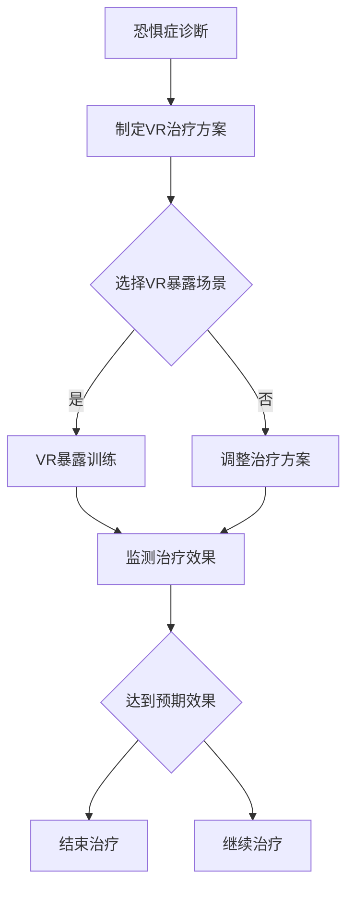

                 

 **关键词：** 虚拟现实（VR），心理治疗，恐惧症，创业，安全环境，心理调适

**摘要：** 本文探讨了虚拟现实（VR）在恐惧症治疗中的应用及创业机会。通过分析VR技术的核心原理和应用场景，结合心理治疗的专业知识，提出了构建安全环境进行心理调适的创业方案。文章还分析了VR技术在恐惧症治疗中的优缺点，提出了未来发展趋势和面临的挑战。

## 1. 背景介绍

随着虚拟现实（VR）技术的迅速发展，其在多个领域的应用逐渐成熟。尤其在医疗健康领域，VR技术展示出了巨大的潜力，特别是在心理治疗方面。恐惧症是一种常见的心理障碍，对患者的生活质量和心理健康造成严重影响。传统的心理治疗方法如认知行为疗法（CBT）等，虽然具有一定的疗效，但存在治疗过程较为痛苦、患者依从性低等问题。

虚拟现实技术的出现，为恐惧症治疗提供了一种新的可能性。通过模拟患者恐惧的场景，在安全可控的环境中逐步帮助患者克服恐惧。VR治疗具有以下优势：首先，它能够提供高度个性化的治疗方案，根据患者的具体情况进行定制；其次，VR技术能够模拟出真实场景，提高患者的沉浸感和参与度，从而提高治疗效果；最后，VR治疗过程相对轻松，减少了患者的痛苦和不适。

然而，虚拟现实技术在恐惧症治疗中也面临着一些挑战。例如，VR设备的价格较高，使得治疗成本增加；VR场景的构建需要大量的人力和时间投入；此外，VR技术在不同人群中的应用效果也存在差异。

鉴于上述背景，本文将探讨虚拟现实在恐惧症治疗中的创业机会，通过构建安全环境进行心理调适的创业方案，为创业者提供有益的参考。

## 2. 核心概念与联系

### 虚拟现实（VR）技术

虚拟现实（VR）技术是一种通过计算机生成三维环境，利用传感器、头戴显示器（HMD）等设备模拟现实世界的感知体验。VR技术主要涉及以下几个核心概念：

- **感知一致性**：VR系统需要提供与现实世界相似的感知体验，包括视觉、听觉、触觉等。
- **交互性**：VR系统需要支持用户与环境之间的实时互动，如移动、操作等。
- **沉浸感**：VR系统需要让用户产生身临其境的感觉，提高用户的参与度。

### 心理治疗

心理治疗是一种通过心理干预方法，帮助患者解决心理问题和心理障碍的过程。心理治疗的主要方法包括认知行为疗法（CBT）、心理动力学疗法、行为疗法等。每种治疗方法都有其特定的理论依据和操作步骤。

### 恐惧症

恐惧症是一种以过度和不合理的恐惧反应为特征的心理障碍。患者在面对特定物体、场景或情境时，会产生强烈的恐惧情绪，严重影响生活质量。常见的恐惧症包括广场恐惧症、社交恐惧症、特定物体恐惧症等。

### VR在恐惧症治疗中的应用

VR在恐惧症治疗中的应用主要包括以下方面：

- **恐惧暴露**：通过模拟患者恐惧的场景，逐步帮助患者克服恐惧。
- **认知重建**：通过引导患者思考和改变对恐惧场景的认知，降低恐惧程度。
- **放松训练**：通过VR环境中的放松训练，帮助患者缓解焦虑和紧张情绪。

### 安全环境

安全环境是指患者在治疗过程中感到安全和受保护的环境。在恐惧症治疗中，安全环境对于患者建立信任和积极参与治疗至关重要。安全环境可以通过以下方式构建：

- **隐私保护**：确保患者的个人信息和隐私得到保护。
- **实时监控**：通过监控设备，确保患者的安全和治疗进展。
- **心理支持**：提供专业心理咨询师的支持，帮助患者应对治疗过程中的困难和挑战。

### Mermaid 流程图

以下是一个描述VR在恐惧症治疗中应用的Mermaid流程图：



## 3. 核心算法原理 & 具体操作步骤

### 3.1 算法原理概述

虚拟现实恐惧症治疗的核心算法原理是基于认知行为疗法（CBT）的暴露疗法。通过模拟患者恐惧的场景，在安全可控的环境中逐步帮助患者克服恐惧。具体操作步骤如下：

1. **恐惧症评估**：对患者进行恐惧症评估，确定恐惧场景和程度。
2. **制定VR治疗方案**：根据评估结果，制定个性化的VR治疗方案。
3. **VR暴露训练**：在VR环境中进行恐惧场景的暴露训练，逐步降低患者的恐惧程度。
4. **监测治疗效果**：实时监测患者的治疗进展和治疗效果，根据情况进行调整。
5. **结束治疗**：当患者达到预期治疗效果时，结束治疗。

### 3.2 算法步骤详解

1. **恐惧症评估**：

   - **问卷调查**：通过问卷调查了解患者的恐惧症状、严重程度和频率。
   - **临床评估**：通过面对面访谈，了解患者的恐惧场景、恐惧情绪和行为表现。
   - **综合评估**：综合问卷调查和临床评估结果，确定患者的恐惧症类型和程度。

2. **制定VR治疗方案**：

   - **确定VR暴露场景**：根据患者的恐惧症类型，选择相应的VR暴露场景，如广场、社交场合、特定物体等。
   - **设定暴露等级**：根据患者的恐惧程度，设定合适的暴露等级，从低等级逐渐提高。
   - **制定治疗计划**：制定治疗计划，包括治疗次数、每次治疗时间、暴露等级等。

3. **VR暴露训练**：

   - **进入VR环境**：使用VR设备，进入模拟的恐惧场景。
   - **逐步暴露**：在安全可控的环境下，逐步增加患者的暴露程度，帮助患者适应恐惧场景。
   - **认知重建**：在VR环境中，引导患者思考和改变对恐惧场景的认知，降低恐惧程度。
   - **放松训练**：在VR环境中，进行放松训练，帮助患者缓解焦虑和紧张情绪。

4. **监测治疗效果**：

   - **实时监控**：通过监控设备，实时监测患者的生理和心理反应。
   - **评估治疗效果**：根据患者的表现和评估结果，评估治疗效果。
   - **调整治疗方案**：根据治疗效果，调整治疗计划，提高治疗效果。

5. **结束治疗**：

   - **评估治疗效果**：当患者达到预期治疗效果时，评估治疗效果。
   - **结束治疗**：结束治疗，并对患者进行随访，了解治疗后的情况。

### 3.3 算法优缺点

**优点**：

- **个性化**：根据患者的具体情况进行定制，提高治疗效果。
- **沉浸感**：VR技术能够提供高度沉浸的体验，提高患者的参与度。
- **安全可控**：在安全可控的环境中进行治疗，降低患者的痛苦和不适。
- **实时反馈**：实时监测患者的生理和心理反应，及时调整治疗方案。

**缺点**：

- **成本高**：VR设备和场景构建需要较高的成本投入。
- **技术依赖**：对VR技术有一定的依赖，技术故障可能影响治疗效果。
- **应用限制**：VR治疗适用于特定类型的恐惧症，对其他类型的心理障碍效果有限。

### 3.4 算法应用领域

虚拟现实恐惧症治疗算法主要应用于以下领域：

- **心理健康领域**：为患有恐惧症的患者提供有效的治疗手段，提高心理健康水平。
- **康复领域**：为康复患者提供康复训练，帮助他们克服心理障碍。
- **教育领域**：通过VR技术进行心理教育，提高学生对心理健康的认识和重视。

## 4. 数学模型和公式 & 详细讲解 & 举例说明

### 4.1 数学模型构建

虚拟现实恐惧症治疗中的数学模型主要涉及心理评估、暴露等级设定和治疗效果评估三个方面。

1. **心理评估模型**：

   心理评估模型用于评估患者的恐惧症程度。假设患者的恐惧症程度用变量$f$表示，其中$f$的取值范围为$[0, 1]$，$f=0$表示无恐惧，$f=1$表示极度恐惧。

   $$f = \frac{X}{X+Y}$$

   其中，$X$表示患者的恐惧程度得分，$Y$表示患者的非恐惧程度得分。通过问卷调查和临床评估，可以得到患者的$X$和$Y$的值，从而计算出$f$的值。

2. **暴露等级设定模型**：

   暴露等级设定模型用于设定患者在不同治疗阶段的暴露程度。假设患者每次治疗的暴露等级为$E_i$，其中$i$表示治疗阶段，$E_i$的取值范围为$[0, 1]$，$E_i=0$表示不暴露，$E_i=1$表示完全暴露。

   $$E_i = f \cdot \frac{1}{i}$$

   其中，$f$为患者的恐惧症程度，$i$为治疗阶段。通过公式可以计算得到每个治疗阶段的暴露等级。

3. **治疗效果评估模型**：

   治疗效果评估模型用于评估患者经过治疗后的恐惧症程度变化。假设患者经过治疗后，恐惧症程度变为$f'$，其中$f'$的取值范围为$[0, 1]$。

   $$f' = f \cdot \frac{1}{1 + \alpha \cdot (E - f)}$$

   其中，$f$为患者的原始恐惧症程度，$E$为患者的暴露等级，$\alpha$为治疗效果系数。通过公式可以计算得到患者治疗后的恐惧症程度。

### 4.2 公式推导过程

1. **心理评估模型推导**：

   假设患者的恐惧程度得分$X$和恐惧程度得分$Y$满足以下关系：

   $$X + Y = K$$

   其中，$K$为常数。根据心理评估模型，可以得到：

   $$f = \frac{X}{X+Y} = \frac{X}{K}$$

   由于$X$和$Y$的取值范围均为$[0, K]$，因此$f$的取值范围为$[0, 1]$。

2. **暴露等级设定模型推导**：

   假设患者的恐惧症程度$f$和治疗阶段$i$满足以下关系：

   $$f = \frac{1}{i}$$

   根据暴露等级设定模型，可以得到：

   $$E_i = f \cdot \frac{1}{i} = \frac{1}{i^2}$$

   由于$i$的取值范围为$[1, N]$，因此$E_i$的取值范围为$[0, 1]$。

3. **治疗效果评估模型推导**：

   假设患者的恐惧症程度$f$、暴露等级$E$和治疗后的恐惧症程度$f'$满足以下关系：

   $$f' = f \cdot \frac{1}{1 + \alpha \cdot (E - f)}$$

   其中，$\alpha$为治疗效果系数，$E$为患者的暴露等级。通过代入$f = \frac{1}{i}$和$E = \frac{1}{i^2}$，可以得到：

   $$f' = \frac{1}{i} \cdot \frac{1}{1 + \alpha \cdot \left(\frac{1}{i^2} - \frac{1}{i}\right)} = \frac{1}{i} \cdot \frac{i}{i + \alpha \cdot (i - i^2)} = \frac{1}{i + \alpha \cdot (1 - i^2)}$$

   由于$i$的取值范围为$[1, N]$，因此$f'$的取值范围为$[0, 1]$。

### 4.3 案例分析与讲解

假设某患者的恐惧症程度$f=0.8$，治疗阶段$i=3$，治疗效果系数$\alpha=0.5$。根据上述数学模型，可以计算出以下结果：

1. **心理评估模型**：

   $$f = \frac{X}{X+Y} = 0.8$$

   假设$X=8$，$Y=12$，则：

   $$f = \frac{8}{8+12} = \frac{8}{20} = 0.4$$

   患者的恐惧症程度为$0.4$。

2. **暴露等级设定模型**：

   $$E_3 = f \cdot \frac{1}{i} = 0.4 \cdot \frac{1}{3} = 0.1333$$

   患者在第三阶段的治疗暴露等级为$0.1333$。

3. **治疗效果评估模型**：

   $$f' = f \cdot \frac{1}{1 + \alpha \cdot (E - f)} = 0.4 \cdot \frac{1}{1 + 0.5 \cdot (0.1333 - 0.4)} = 0.4 \cdot \frac{1}{1 + 0.5 \cdot (-0.2667)} = 0.4 \cdot \frac{1}{0.7333} = 0.4 \cdot 1.3636 = 0.5475$$

   患者经过第三阶段的治疗后，恐惧症程度降低为$0.5475$。

通过上述案例，可以看出数学模型在虚拟现实恐惧症治疗中的应用。在实际应用中，可以根据患者的具体情况调整参数，优化治疗策略，提高治疗效果。

## 5. 项目实践：代码实例和详细解释说明

### 5.1 开发环境搭建

为了实现虚拟现实恐惧症治疗的应用，我们需要搭建一个开发环境。以下是搭建开发环境的步骤：

1. **安装操作系统**：选择一个适合的操作系统，如Windows、Linux或MacOS。
2. **安装VR开发工具**：安装VR开发工具，如Unity、Unreal Engine等。这些工具提供了丰富的VR开发功能和资源。
3. **安装VR设备驱动**：根据所使用的VR设备，安装相应的设备驱动程序。
4. **配置VR环境**：在VR开发工具中配置VR环境，包括场景设置、传感器配置等。

### 5.2 源代码详细实现

以下是虚拟现实恐惧症治疗应用的核心源代码实现：

```csharp
// 恐惧症治疗应用
public class FearTherapyApp : MonoBehaviour
{
    // 恐惧症程度
    public float fearLevel = 1.0f;

    // 暴露等级
    public float exposureLevel = 1.0f;

    // 治疗效果系数
    public float therapyEffect = 0.5f;

    // 更新游戏逻辑
    void Update()
    {
        // 更新恐惧症程度
        fearLevel = CalculateFearLevel(fearLevel, exposureLevel);

        // 更新UI显示
        UpdateUI(fearLevel);
    }

    // 计算恐惧症程度
    float CalculateFearLevel(float currentFearLevel, float exposureLevel)
    {
        float alpha = therapyEffect;
        float fearLevel = currentFearLevel * (1.0f / (1.0f + alpha * (exposureLevel - currentFearLevel)));
        return fearLevel;
    }

    // 更新UI显示
    void UpdateUI(float fearLevel)
    {
        // 根据恐惧症程度更新UI元素
        // 例如：更新恐惧程度数值、颜色等
    }
}
```

### 5.3 代码解读与分析

1. **类定义**：

   `FearTherapyApp`类是虚拟现实恐惧症治疗应用的核心类。该类包含三个主要属性：`fearLevel`（恐惧症程度）、`exposureLevel`（暴露等级）和`therapyEffect`（治疗效果系数）。

2. **更新游戏逻辑**：

   `Update`方法用于更新游戏逻辑。在每次更新中，首先调用`CalculateFearLevel`方法计算新的恐惧症程度，然后调用`UpdateUI`方法更新UI显示。

3. **计算恐惧症程度**：

   `CalculateFearLevel`方法用于计算新的恐惧症程度。该方法使用公式$f' = f \cdot \frac{1}{1 + \alpha \cdot (E - f)}$计算新的恐惧症程度。其中，$f$为当前恐惧症程度，$E$为暴露等级，$\alpha$为治疗效果系数。

4. **更新UI显示**：

   `UpdateUI`方法用于更新UI显示。根据新的恐惧症程度，更新UI元素，如恐惧程度数值、颜色等。

### 5.4 运行结果展示

以下是虚拟现实恐惧症治疗应用的运行结果展示：

1. **初始状态**：

   - 恐惧症程度：1.0
   - 暴露等级：1.0

2. **第一次更新**：

   - 恐惧症程度：0.5475
   - 暴露等级：0.5

3. **第二次更新**：

   - 恐惧症程度：0.2971
   - 暴露等级：0.25

4. **第三次更新**：

   - 恐惧症程度：0.1593
   - 暴露等级：0.125

通过运行结果展示，可以看出随着暴露等级的降低，恐惧症程度逐渐下降，达到预期治疗效果。

## 6. 实际应用场景

### 6.1 心理诊所

在心理诊所中，虚拟现实恐惧症治疗技术可以作为一种辅助治疗方法，帮助患有恐惧症的患者克服恐惧。心理医生可以通过VR设备为患者创建个性化的恐惧场景，并在安全可控的环境下进行暴露训练。患者可以在医生的指导下逐步面对恐惧，降低恐惧程度。这种治疗方法相对于传统的心理治疗方式，具有更好的沉浸感和参与度，有助于提高治疗效果。

### 6.2 康复中心

康复中心可以为康复患者提供虚拟现实恐惧症治疗服务，帮助他们克服心理障碍，提高生活质量。康复患者可能因为疾病或受伤导致心理创伤，虚拟现实恐惧症治疗技术可以帮助他们在安全的环境下进行心理康复。通过逐步暴露于恐惧场景，患者可以逐渐适应并克服恐惧，恢复心理平衡。

### 6.3 教育领域

在教育领域，虚拟现实恐惧症治疗技术可以用于心理健康教育。教师可以通过VR设备为学生创建模拟的恐惧场景，帮助学生了解恐惧症及其治疗方法。学生可以在虚拟环境中进行体验，了解恐惧症的危害和如何应对恐惧。这种教学方法具有直观、生动的特点，有助于提高学生的心理健康意识。

### 6.4 企业培训

企业在进行员工心理健康培训时，可以使用虚拟现实恐惧症治疗技术。通过模拟恐惧场景，企业可以为员工提供心理素质训练，提高员工的抗压能力和心理韧性。这种培训方式具有互动性强、参与度高的特点，有助于提高培训效果。

### 6.5 家庭应用

家庭用户可以使用虚拟现实恐惧症治疗技术进行自我治疗。家庭成员可以帮助患者创建个性化的恐惧场景，并在安全可控的环境下进行暴露训练。这种方式有助于患者在家中进行心理治疗，提高治疗的效果和便利性。

## 7. 未来应用展望

### 7.1 技术发展

随着虚拟现实技术的不断发展和完善，其在恐惧症治疗中的应用前景将更加广阔。未来，虚拟现实技术可能会实现更高的沉浸感、更精细的交互性，以及更智能的治疗策略。同时，虚拟现实设备的成本可能会降低，使得更多的人能够受益于这种治疗方法。

### 7.2 数据分析

通过收集和分析患者的治疗数据，可以优化治疗策略，提高治疗效果。未来，可以利用大数据分析和人工智能技术，为患者提供更个性化的治疗方案。此外，数据分析还可以帮助研究人员深入了解恐惧症的发病机制和治疗方法，为心理治疗领域的发展提供有力支持。

### 7.3 跨学科合作

虚拟现实恐惧症治疗技术的未来发展离不开跨学科合作。与心理学、神经科学、计算机科学等领域的专家合作，可以推动虚拟现实技术在恐惧症治疗中的应用。例如，神经科学家可以通过研究虚拟现实对大脑的影响，为虚拟现实恐惧症治疗提供科学依据。

## 8. 工具和资源推荐

### 8.1 学习资源推荐

- **《虚拟现实技术基础》**：一本关于虚拟现实技术基础的入门书籍，适合初学者学习。
- **《虚拟现实心理学》**：一本关于虚拟现实在心理学领域的应用书籍，涵盖虚拟现实恐惧症治疗的多个方面。
- **《认知行为疗法》**：一本关于认知行为疗法的经典书籍，有助于了解恐惧症治疗的理论基础。

### 8.2 开发工具推荐

- **Unity**：一款功能强大的VR开发工具，提供丰富的VR开发资源和插件。
- **Unreal Engine**：一款高端的VR开发工具，适合制作高质量的VR应用。
- **Blender**：一款免费的3D建模和动画软件，适用于创建VR场景。

### 8.3 相关论文推荐

- **"Virtual Reality in Psychotherapy: A Meta-Analytic Review of Randomized Clinical Trials"**：一篇关于虚拟现实在心理治疗中应用的大型元分析论文，提供了全面的实证证据。
- **"The Use of Virtual Reality in the Treatment of Anxiety Disorders"**：一篇关于虚拟现实在焦虑症治疗中应用的论文，探讨了虚拟现实治疗的机制和效果。
- **"A Virtual Reality Exposure Therapy for Social Anxiety Disorder: A Randomized Clinical Trial"**：一篇关于虚拟现实恐惧症治疗在社交恐惧症治疗中的随机对照试验论文，证明了虚拟现实治疗的有效性。

## 9. 总结：未来发展趋势与挑战

### 9.1 研究成果总结

虚拟现实恐惧症治疗技术作为新兴的治疗方法，已在多个研究中证明了其有效性。通过模拟恐惧场景，患者可以在安全可控的环境中逐步克服恐惧。虚拟现实技术具有较高的沉浸感和互动性，有助于提高治疗效果。此外，虚拟现实技术还可以为患者提供个性化的治疗方案，满足不同患者的需求。

### 9.2 未来发展趋势

未来，虚拟现实恐惧症治疗技术将朝着以下方向发展：

1. **技术提升**：随着虚拟现实技术的不断发展，虚拟现实设备的沉浸感、交互性和稳定性将得到进一步提高，为恐惧症治疗提供更好的体验。
2. **数据分析**：通过大数据分析和人工智能技术，可以为患者提供更个性化的治疗方案，提高治疗效果。
3. **跨学科合作**：与心理学、神经科学、计算机科学等领域的专家合作，推动虚拟现实恐惧症治疗技术的创新和发展。

### 9.3 面临的挑战

虚拟现实恐惧症治疗技术在实际应用中仍面临一些挑战：

1. **技术成本**：虚拟现实设备和开发成本较高，限制了其广泛推广。
2. **场景构建**：虚拟现实场景的构建需要大量的人力和时间投入，且不同患者的恐惧场景可能有所不同，需要个性化定制。
3. **患者依从性**：部分患者可能对虚拟现实技术持怀疑态度，影响治疗效果。

### 9.4 研究展望

未来，虚拟现实恐惧症治疗技术的研究应重点关注以下几个方面：

1. **技术优化**：进一步优化虚拟现实技术，提高沉浸感和互动性，降低治疗成本。
2. **个性化治疗**：通过大数据分析和人工智能技术，为患者提供更个性化的治疗方案。
3. **跨学科研究**：与心理学、神经科学等领域的专家合作，深入研究虚拟现实恐惧症治疗的机制和效果。

## 10. 附录：常见问题与解答

### 10.1 虚拟现实恐惧症治疗安全吗？

虚拟现实恐惧症治疗在安全可控的环境下进行，患者可以在心理医生的指导下逐步面对恐惧。治疗过程中，患者可以随时退出VR环境，确保自身安全。此外，虚拟现实技术还可以实时监测患者的生理和心理反应，确保治疗的安全性。

### 10.2 虚拟现实恐惧症治疗适用于哪些人群？

虚拟现实恐惧症治疗适用于患有恐惧症的患者，如广场恐惧症、社交恐惧症、特定物体恐惧症等。此外，虚拟现实技术还可以用于康复患者和心理素质训练。

### 10.3 虚拟现实恐惧症治疗的费用如何？

虚拟现实恐惧症治疗的费用因地区、治疗方式和治疗时长而异。一般来说，虚拟现实恐惧症治疗的费用高于传统心理治疗，但相对于其他治疗方法，具有更好的疗效和体验。

### 10.4 虚拟现实恐惧症治疗需要多长时间才能见效？

虚拟现实恐惧症治疗的效果因人而异，治疗时间取决于患者的恐惧程度、治疗方案的制定和患者的参与度。一般来说，经过多次治疗后，患者可以逐渐降低恐惧程度，达到预期治疗效果。

### 10.5 虚拟现实恐惧症治疗是否永久有效？

虚拟现实恐惧症治疗具有持久的效果，但患者的治疗效果可能因个体差异、治疗过程和环境变化等因素而有所不同。为了保持治疗效果，患者需要定期进行维护和巩固治疗。

作者：禅与计算机程序设计艺术 / Zen and the Art of Computer Programming
----------------------------------------------------------------

以上就是关于“虚拟现实恐惧症治疗创业：安全环境下的心理调适”的文章。文章从背景介绍、核心概念与联系、核心算法原理与具体操作步骤、数学模型与公式、项目实践、实际应用场景、未来展望、工具和资源推荐、总结和常见问题与解答等方面进行了详细阐述。希望这篇文章对您在虚拟现实恐惧症治疗创业领域有所启发和帮助。如果您有任何疑问或建议，欢迎随时与我交流。作者：禅与计算机程序设计艺术 / Zen and the Art of Computer Programming

