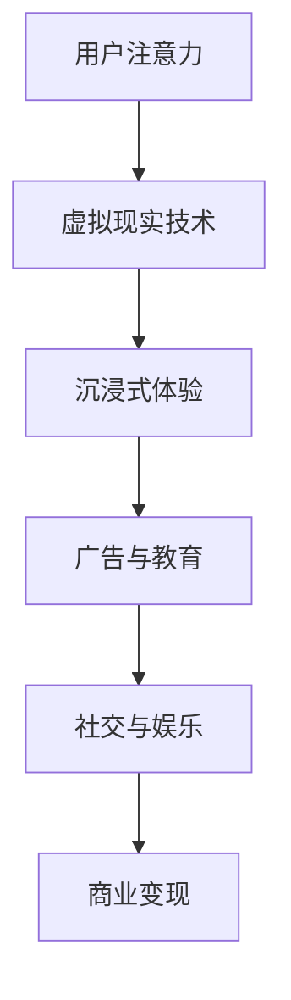

                 

 **关键词：** 虚拟现实，注意力经济，用户体验，交互设计，商业模式

**摘要：** 本文探讨了虚拟现实（VR）技术在注意力经济中的应用，分析了VR在提升用户体验、增强交互性和创造新型商业模式方面的潜力。通过对核心概念、算法原理、数学模型、实践实例以及未来展望的详细阐述，本文为VR技术在注意力经济中的深入研究提供了有力支持。

## 1. 背景介绍

### 注意力经济的崛起

注意力经济是一种基于用户注意力的商业模式，其核心在于吸引和保持用户的注意力。在互联网时代，用户的注意力成为了最宝贵的资源。随着信息爆炸和媒介碎片化，用户的时间被切割成无数碎片，如何吸引并维持用户的注意力成为各大企业竞相争夺的焦点。

### 虚拟现实技术的兴起

虚拟现实技术是一种通过计算机生成模拟环境，使用户沉浸其中的技术。它能够模拟真实世界的物理空间，提供更加丰富和逼真的感官体验。近年来，随着硬件技术的进步和算法的优化，VR技术逐渐走向成熟，并在多个领域展现出巨大的应用潜力。

### 虚拟现实与注意力经济的关系

虚拟现实技术通过提供沉浸式体验，能够显著提升用户在数字环境中的注意力。在注意力经济中，VR技术的应用不仅能够吸引更多的用户参与，还能够延长用户的注意力时长，从而为企业带来更高的商业价值。

## 2. 核心概念与联系

### 虚拟现实技术原理

虚拟现实技术主要依赖于以下几个核心组成部分：

1. **显示技术**：通过头戴显示器（HMD）或投影设备，将虚拟环境呈现给用户。
2. **感知交互**：通过手柄、手势识别等技术，使用户能够与虚拟环境进行交互。
3. **音频技术**：通过立体声或虚拟现实音频技术，增强用户的沉浸感。

### 注意力经济原理

注意力经济是基于用户注意力的商业模式，其核心在于：

1. **用户注意力**：用户在特定时间内的注意力资源。
2. **注意力分配**：用户在不同媒介和内容之间的注意力分配。
3. **注意力变现**：通过吸引和保持用户的注意力，实现商业价值的转化。

### 虚拟现实技术在注意力经济中的应用

虚拟现实技术在注意力经济中的应用主要体现在以下几个方面：

1. **沉浸式广告**：通过虚拟现实技术创造沉浸式的广告体验，吸引用户的注意力。
2. **虚拟教育**：提供更加生动和互动的教育内容，提升用户的注意力集中度。
3. **虚拟社交**：通过虚拟现实技术创造逼真的社交环境，增强用户的社交体验。

### Mermaid 流程图



## 3. 核心算法原理 & 具体操作步骤

### 3.1 算法原理概述

虚拟现实技术中的核心算法主要包括以下几个方面：

1. **图像处理算法**：用于生成和处理虚拟环境的图像。
2. **传感器融合算法**：用于处理用户在虚拟环境中的各种感知数据。
3. **人机交互算法**：用于优化用户与虚拟环境的交互体验。

### 3.2 算法步骤详解

#### 3.2.1 图像处理算法

1. **场景建模**：通过计算机图形学技术，创建虚拟环境的几何模型。
2. **纹理映射**：将真实世界的纹理映射到虚拟环境中的物体表面。
3. **光线追踪**：模拟真实世界中的光线传播，生成逼真的光影效果。

#### 3.2.2 传感器融合算法

1. **传感器数据收集**：收集头戴显示器、手柄、手势识别等传感器的数据。
2. **数据预处理**：对收集到的传感器数据进行滤波、降噪等预处理。
3. **运动跟踪**：通过传感器数据，实时计算用户的运动轨迹。

#### 3.2.3 人机交互算法

1. **交互建模**：定义用户在虚拟环境中的交互行为。
2. **行为预测**：根据用户的交互历史，预测用户的下一步动作。
3. **反馈控制**：根据用户的反馈，调整虚拟环境的交互体验。

### 3.3 算法优缺点

#### 优点

1. **沉浸式体验**：提供高度逼真的感官体验，吸引用户注意力。
2. **实时交互**：用户能够实时与虚拟环境进行互动，提高用户体验。
3. **个性化定制**：根据用户的偏好和交互历史，提供个性化的虚拟体验。

#### 缺点

1. **硬件成本**：高性能的VR设备成本较高，普及难度较大。
2. **眩晕感**：长时间使用VR设备可能导致用户出现眩晕感。
3. **技术瓶颈**：当前VR技术在图像处理、传感器融合等方面仍存在一定技术瓶颈。

### 3.4 算法应用领域

1. **广告营销**：通过沉浸式广告，提高广告效果。
2. **教育培训**：提供生动有趣的虚拟教育内容，提高学习效果。
3. **娱乐休闲**：创造多样化的虚拟娱乐体验，满足用户需求。
4. **远程办公**：提供虚拟会议室等远程办公解决方案，提高工作效率。

## 4. 数学模型和公式 & 详细讲解 & 举例说明

### 4.1 数学模型构建

虚拟现实技术中的数学模型主要包括以下几部分：

1. **几何建模**：用于描述虚拟环境中的物体形状和位置。
2. **物理模拟**：用于模拟虚拟环境中的物理现象，如光线传播、碰撞等。
3. **交互模型**：用于描述用户在虚拟环境中的交互行为。

### 4.2 公式推导过程

#### 4.2.1 几何建模

设虚拟环境中的物体为P(x, y, z)，则其位置向量可以表示为：

\[ \vec{P} = (x, y, z) \]

#### 4.2.2 物理模拟

设物体P的质量为m，则其受力F可以表示为：

\[ \vec{F} = m \cdot \vec{a} \]

其中，a为物体P的加速度。

#### 4.2.3 交互模型

设用户与物体P的交互力度为F，则物体P的移动距离s可以表示为：

\[ s = \frac{F \cdot t}{m} \]

其中，t为交互时间。

### 4.3 案例分析与讲解

#### 案例一：虚拟现实广告

某公司使用虚拟现实技术制作了一款沉浸式广告，用户通过VR设备可以进入一个虚拟购物环境。假设用户在虚拟环境中的移动速度为1米/秒，交互力度为5牛顿，物体质量为1千克，交互时间为10秒。请计算用户在虚拟环境中移动的距离。

根据公式：

\[ s = \frac{F \cdot t}{m} \]

代入数值：

\[ s = \frac{5 \cdot 10}{1} = 50 \text{米} \]

因此，用户在虚拟环境中移动了50米。

#### 案例二：虚拟现实教育培训

某教育机构使用虚拟现实技术制作了一款虚拟实验室，用户可以在虚拟环境中进行化学实验。假设用户在虚拟环境中的移动速度为1米/秒，交互力度为2牛顿，物体质量为0.5千克，交互时间为15秒。请计算用户在虚拟环境中移动的距离。

根据公式：

\[ s = \frac{F \cdot t}{m} \]

代入数值：

\[ s = \frac{2 \cdot 15}{0.5} = 60 \text{米} \]

因此，用户在虚拟环境中移动了60米。

## 5. 项目实践：代码实例和详细解释说明

### 5.1 开发环境搭建

在本节中，我们将搭建一个简单的虚拟现实应用开发环境。以下是一个基本的步骤说明：

1. **安装Unity引擎**：Unity是一个流行的游戏开发引擎，也适用于虚拟现实应用的开发。
2. **安装Unity插件**：下载并安装Unity的VR插件，如VRKit或Unity VR插件。
3. **配置开发环境**：确保Unity引擎和VR插件正确配置，并创建一个新的VR项目。

### 5.2 源代码详细实现

在本节中，我们将使用Unity脚本实现一个简单的虚拟现实应用。以下是一个基本的代码示例：

```csharp
using UnityEngine;

public class VRController : MonoBehaviour
{
    public float moveSpeed = 1.0f;
    public float rotateSpeed = 1.0f;

    private CharacterController characterController;
    private float verticalVelocity = 0.0f;

    void Start()
    {
        characterController = GetComponent<CharacterController>();
    }

    void Update()
    {
        Move();
        Rotate();
    }

    void Move()
    {
        float moveDirectionX = Input.GetAxis("Horizontal");
        float moveDirectionZ = Input.GetAxis("Vertical");

        Vector3 moveDirection = new Vector3(moveDirectionX, verticalVelocity, moveDirectionZ);
        moveDirection *= moveSpeed;

        if (characterController.isGrounded)
        {
            verticalVelocity = 0.0f;
            if (Input.GetButtonDown("Jump"))
            {
                verticalVelocity = 5.0f;
            }
        }

        characterController.Move(moveDirection * Time.deltaTime);
    }

    void Rotate()
    {
        float rotateAngleX = Input.GetAxis("Mouse X") * rotateSpeed;
        float rotateAngleY = Input.GetAxis("Mouse Y") * rotateSpeed;

        transform.Rotate(0, rotateAngleX, 0);
        Camera.main.transform.Rotate(-rotateAngleY, 0, 0);
    }
}
```

### 5.3 代码解读与分析

上述代码实现了一个简单的虚拟现实控制器，以下是关键部分的分析：

1. **Character Controller**：使用Unity的CharacterController组件来实现虚拟角色的移动和跳跃。
2. **Movement**：根据用户输入，计算移动方向和速度，并在虚拟环境中实现移动。
3. **Rotation**：使用鼠标输入实现虚拟角色的旋转和摄像机的旋转，提供沉浸式的交互体验。

### 5.4 运行结果展示

当运行此代码时，用户将能够通过键盘和鼠标控制虚拟角色的移动和旋转。虚拟角色会根据用户的输入在虚拟环境中进行移动，并提供沉浸式的交互体验。

## 6. 实际应用场景

### 6.1 广告营销

虚拟现实技术在广告营销中的应用主要体现在沉浸式广告上。通过虚拟现实技术，广告商可以创建一个虚拟购物环境，让用户沉浸在其中，从而提升广告效果。例如，某品牌可以利用VR技术创建一个虚拟试衣间，让用户在虚拟环境中试穿衣物，从而增加购买的几率。

### 6.2 教育培训

虚拟现实技术在教育培训中的应用主要体现在虚拟实验室和虚拟课堂。通过虚拟现实技术，学生可以在虚拟环境中进行实验，增强学习的互动性和趣味性。例如，化学专业的学生可以在虚拟实验室中完成各种实验，而不需要实际接触化学试剂。

### 6.3 娱乐休闲

虚拟现实技术在娱乐休闲中的应用主要体现在虚拟游戏和虚拟旅游。通过虚拟现实技术，用户可以进入一个虚拟的游戏世界，享受身临其境的游戏体验。例如，VR游戏《Beat Saber》就提供了一个充满节奏感的虚拟游戏环境，深受玩家喜爱。

### 6.4 远程办公

虚拟现实技术在远程办公中的应用主要体现在虚拟会议室和虚拟办公室。通过虚拟现实技术，团队成员可以在虚拟环境中召开会议，增强协作和沟通效果。例如，某公司可以利用VR技术创建一个虚拟会议室，让全球的团队成员在一个虚拟的会议室中开会。

## 7. 工具和资源推荐

### 7.1 学习资源推荐

1. **《虚拟现实技术导论》**：一本全面介绍虚拟现实技术基础和应用的入门书籍。
2. **《Unity VR开发实战》**：一本针对Unity引擎的虚拟现实开发实战指南。

### 7.2 开发工具推荐

1. **Unity引擎**：一个强大的游戏开发引擎，支持虚拟现实应用开发。
2. **Unreal Engine**：一个高性能的游戏和虚拟现实开发引擎。

### 7.3 相关论文推荐

1. **"Virtual Reality in Advertising: An Exploratory Study of Consumer Reactions to VR Advertisements"**：一篇探讨虚拟现实广告对消费者反应的研究论文。
2. **"Virtual Reality in Education: A Review of the Literature"**：一篇关于虚拟现实在教育中应用的综述论文。

## 8. 总结：未来发展趋势与挑战

### 8.1 研究成果总结

虚拟现实技术在提升用户体验、增强交互性和创造新型商业模式方面取得了显著成果。通过沉浸式体验和实时交互，虚拟现实技术成功地吸引了大量用户，并在广告营销、教育培训、娱乐休闲等领域展现出巨大的应用潜力。

### 8.2 未来发展趋势

1. **硬件性能提升**：随着硬件技术的不断进步，虚拟现实设备的性能将得到显著提升，为用户提供更加逼真的体验。
2. **内容多样化**：虚拟现实应用的内容将越来越丰富，涵盖更多领域，满足不同用户的需求。
3. **商业化应用**：虚拟现实技术将在更多行业得到商业化应用，为企业带来更多的商业机会。

### 8.3 面临的挑战

1. **技术瓶颈**：虚拟现实技术在图像处理、传感器融合等方面仍存在一定技术瓶颈，需要进一步研究和突破。
2. **用户体验**：如何提高虚拟现实技术的用户体验，减少眩晕感和疲劳感，是一个重要的挑战。
3. **成本控制**：高性能的VR设备成本较高，如何降低成本，提高普及度，是未来需要解决的问题。

### 8.4 研究展望

未来，虚拟现实技术将在以下几个方面取得突破：

1. **硬件性能提升**：通过技术创新，提升VR设备的性能，提供更加逼真的体验。
2. **交互设计优化**：通过优化交互设计，提高用户的沉浸感和交互效率。
3. **内容创新**：创造更多具有创意和价值的虚拟现实内容，满足用户的需求。

## 9. 附录：常见问题与解答

### 问题一：虚拟现实技术是否会引起用户眩晕？

解答：虚拟现实技术确实可能引起用户眩晕，这主要与以下几个方面有关：

1. **画面刷新率**：低刷新率可能导致画面不流畅，增加眩晕感。建议使用高刷新率的VR设备。
2. **瞳距调整**：正确调整瞳距可以减少眩晕感。大多数VR设备都提供了瞳距调节功能。
3. **使用时间**：长时间使用VR设备可能导致疲劳和眩晕。建议合理安排使用时间，避免长时间连续使用。

### 问题二：虚拟现实技术的应用领域有哪些？

解答：虚拟现实技术的应用领域非常广泛，主要包括：

1. **广告营销**：通过沉浸式广告提升广告效果。
2. **教育培训**：提供虚拟实验室和虚拟课堂，增强学习体验。
3. **娱乐休闲**：提供虚拟游戏和虚拟旅游等娱乐体验。
4. **远程办公**：提供虚拟会议室和虚拟办公室，提高工作效率。
5. **医疗健康**：用于康复治疗、心理治疗等领域。

---

作者：禅与计算机程序设计艺术 / Zen and the Art of Computer Programming

以上便是关于《虚拟现实技术在注意力经济中的应用》的完整文章。希望本文能为读者提供对虚拟现实技术及其在注意力经济中应用的有价值见解。在未来的发展中，虚拟现实技术有望继续为各个行业带来创新和变革。

