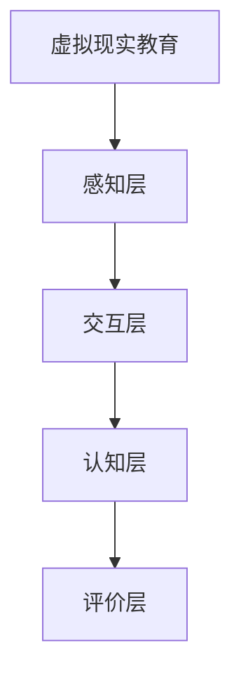

                 

随着科技的飞速发展，虚拟现实（VR）技术逐渐走进人们的日常生活。在教育领域，VR技术以其独特的沉浸式体验优势，正成为变革传统教学模式的重要力量。本文将探讨虚拟现实在教育创业中的潜力，特别是如何通过沉浸式学习体验来提升教育效果。

## 关键词

- 虚拟现实
- 沉浸式学习
- 教育创业
- 教育技术
- 互动体验

## 摘要

本文首先介绍了虚拟现实技术在教育领域的发展背景和应用趋势。随后，深入分析了虚拟现实在提供沉浸式学习体验方面的核心优势。通过具体的案例和实践，阐述了如何利用VR技术开展教育创业项目。最后，展望了虚拟现实教育未来的发展方向，并提出了相关挑战和解决方案。

## 1. 背景介绍

### 虚拟现实技术的历史和发展

虚拟现实（VR）技术自20世纪80年代初期问世以来，已经经历了数十年的发展。早期的VR技术主要应用于军事、娱乐等领域。随着计算机硬件性能的提升和图形处理技术的进步，VR技术逐渐走向大众市场。特别是在过去十年里，随着智能手机、平板电脑、可穿戴设备的普及，VR设备如头戴式显示器（HMD）和VR眼镜等得到了广泛应用。

### 教育领域的变革趋势

在教育的环境中，传统教学模式正面临着越来越多的挑战。例如，教学资源的不平衡、学习效果的差异化和学生参与度的不足等问题。而VR技术的出现，为解决这些问题提供了新的可能。通过VR，学生可以进入一个虚拟的世界，亲身体验历史事件、科学实验和艺术作品，从而大大增强学习兴趣和参与感。

### VR在教育中的应用现状

目前，VR技术在教育领域已有一些成功的应用案例。例如，一些学校已经开始使用VR技术来模拟课堂教学，使学生能够在虚拟环境中参与实验和互动讨论。此外，VR还被用于职业培训、特殊教育以及远程教育等多个方面。尽管VR教育应用尚处于初级阶段，但其潜力和前景无疑是巨大的。

## 2. 核心概念与联系

### 虚拟现实教育的基本概念

虚拟现实教育是指利用虚拟现实技术创建一个模拟的学习环境，让学生能够在其中进行学习、实验和互动。这个环境可以是历史的场景、科学的实验室、甚至是虚拟的宇宙空间。通过这种沉浸式体验，学生能够更加深入地理解和掌握知识。

### 沉浸式学习体验的原理

沉浸式学习体验是基于“感知-行动”理论，通过高度模拟的虚拟环境，让学生在感知和行动的过程中主动参与学习。在这个过程中，学生的感官被充分激活，大脑的神经回路被不断刺激，从而提高学习效果。

### 虚拟现实教育架构图



- **感知层**：通过VR设备提供视觉、听觉、触觉等多感官刺激。
- **交互层**：学生通过操作虚拟环境中的物体和场景进行互动。
- **认知层**：学生在互动中获取知识、建立概念和解决问题。
- **评价层**：通过数据分析和反馈机制评价学习效果。

### 虚拟现实教育与传统教育的比较

与传统教育相比，虚拟现实教育具有以下优势：

- **沉浸式体验**：学生能够全身心投入学习，提高兴趣和参与度。
- **个性化学习**：根据学生的特点和需求，提供定制化的学习内容。
- **实时反馈**：通过实时数据分析和反馈，帮助学生及时调整学习策略。

### 虚拟现实教育的挑战和机遇

虚拟现实教育面临着技术、成本、教学资源等多方面的挑战。但同时，它也为教育创新提供了无限可能，特别是在提高教育质量和促进教育公平方面具有巨大的潜力。

## 3. 核心算法原理 & 具体操作步骤

### 3.1 算法原理概述

虚拟现实教育中的核心算法主要包括场景生成、交互控制和数据分析三个方面。

- **场景生成算法**：利用三维建模技术和图形渲染技术创建虚拟学习环境。
- **交互控制算法**：通过传感器和输入设备实现学生与虚拟环境的互动。
- **数据分析算法**：对学生的学习行为和效果进行分析，提供实时反馈。

### 3.2 算法步骤详解

#### 场景生成算法

1. **数据采集**：收集相关领域的三维模型、图片和视频等数据。
2. **模型构建**：利用三维建模软件构建虚拟环境，并进行纹理映射和光照设置。
3. **场景渲染**：使用图形渲染引擎渲染虚拟环境，生成高质量的视觉效果。

#### 交互控制算法

1. **输入处理**：采集学生的输入数据，如手势、语音和眼动等。
2. **交互响应**：根据输入数据调整虚拟环境中的物体和行为。
3. **实时反馈**：通过视觉、听觉和触觉等多感官刺激提供实时反馈。

#### 数据分析算法

1. **数据收集**：记录学生的学习行为和互动数据。
2. **行为分析**：分析学生的学习模式、兴趣点和难点。
3. **反馈生成**：根据分析结果生成个性化学习建议和反馈。

### 3.3 算法优缺点

#### 场景生成算法

- **优点**：能够创建高度逼真的虚拟学习环境，提高学生的沉浸感。
- **缺点**：数据采集和模型构建过程复杂，需要大量计算资源。

#### 交互控制算法

- **优点**：提供实时互动体验，增强学生的参与度和积极性。
- **缺点**：对输入设备的精度和稳定性要求较高。

#### 数据分析算法

- **优点**：能够提供实时反馈和个性化学习建议，提高学习效果。
- **缺点**：对大量数据进行分析和处理需要高性能的计算资源。

### 3.4 算法应用领域

虚拟现实教育算法主要应用于以下领域：

- **课堂教学**：通过虚拟实验室和虚拟课堂提高教学效果。
- **职业培训**：模拟真实工作场景进行技能培训和考核。
- **特殊教育**：为有特殊需求的学生提供个性化的学习体验。
- **远程教育**：通过虚拟课堂实现远程互动教学。

## 4. 数学模型和公式 & 详细讲解 & 举例说明

### 4.1 数学模型构建

虚拟现实教育中的数学模型主要包括场景建模、交互控制和数据分析三个部分。

#### 场景建模

1. **几何建模**：利用几何形状和几何变换构建虚拟环境。
   $$\text{几何建模} = \text{基本几何形状} \times \text{几何变换}$$
   
2. **纹理映射**：通过纹理映射技术将图像映射到三维模型表面。
   $$\text{纹理映射} = \text{纹理图像} \times \text{模型表面}$$

#### 交互控制

1. **运动学模型**：描述学生在虚拟环境中的运动状态。
   $$\text{运动学模型} = \text{位置} \times \text{速度} \times \text{加速度}$$

2. **力模型**：描述物体间的相互作用力。
   $$\text{力模型} = \text{作用力} \times \text{反作用力}$$

#### 数据分析

1. **行为分析模型**：描述学生的学习行为。
   $$\text{行为分析模型} = \text{学习时间} \times \text{学习频率} \times \text{学习内容}$$

2. **效果分析模型**：评估学生的学习效果。
   $$\text{效果分析模型} = \text{正确率} \times \text{理解度} \times \text{应用度}$$

### 4.2 公式推导过程

#### 场景建模

1. **几何建模**：基本几何形状包括立方体、球体和圆柱体等。通过几何变换（如平移、旋转和缩放）可以生成复杂的虚拟环境。
   $$\text{几何建模} = \text{基本几何形状} \times \text{几何变换}$$

2. **纹理映射**：纹理映射是通过将图像映射到三维模型表面来增加真实感。映射过程涉及到纹理坐标的计算和纹理图像的采样。
   $$\text{纹理映射} = \text{纹理图像} \times \text{模型表面}$$

#### 交互控制

1. **运动学模型**：描述学生在虚拟环境中的运动状态。运动状态由位置、速度和加速度三个参数决定。
   $$\text{运动学模型} = \text{位置} \times \text{速度} \times \text{加速度}$$

2. **力模型**：物体间的相互作用力由牛顿第三定律描述，即作用力与反作用力相等且方向相反。
   $$\text{力模型} = \text{作用力} \times \text{反作用力}$$

#### 数据分析

1. **行为分析模型**：描述学生的学习行为。学习行为由学习时间、学习频率和学习内容三个参数决定。
   $$\text{行为分析模型} = \text{学习时间} \times \text{学习频率} \times \text{学习内容}$$

2. **效果分析模型**：评估学生的学习效果。效果评估由正确率、理解度和应用度三个参数决定。
   $$\text{效果分析模型} = \text{正确率} \times \text{理解度} \times \text{应用度}$$

### 4.3 案例分析与讲解

#### 场景建模案例

假设我们构建一个虚拟历史场景，包括一个古代城堡和一个广阔的乡村。首先，我们使用基本几何形状（立方体、球体和圆柱体）来构建城堡的几何模型。然后，通过纹理映射技术，我们将古建筑的纹理图像映射到城堡表面，增加真实感。

$$\text{几何建模} = \text{立方体} \times \text{旋转变换} + \text{圆柱体} \times \text{缩放变换}$$
$$\text{纹理映射} = \text{古建筑纹理图像} \times \text{城堡表面}$$

#### 交互控制案例

假设学生在虚拟城堡中探索，并试图打开一扇门。学生可以通过虚拟手柄操作来尝试开门。系统会根据学生的输入数据（如手势）调整门的状态。如果门被成功打开，学生会获得一个奖励。

$$\text{运动学模型} = \text{学生位置} + \text{学生速度} \times \text{时间}$$
$$\text{力模型} = \text{学生作用力} \times \text{反作用力}$$

#### 数据分析案例

假设我们记录学生在虚拟历史场景中的学习行为和效果。我们分析学生的探索时间、尝试次数和最终完成任务的情况。根据这些数据，我们可以评估学生对历史场景的理解度和应用度。

$$\text{行为分析模型} = \text{学习时间} \times \text{尝试次数} \times \text{学习内容}$$
$$\text{效果分析模型} = \text{正确率} \times \text{理解度} \times \text{应用度}$$

## 5. 项目实践：代码实例和详细解释说明

### 5.1 开发环境搭建

要在虚拟现实教育项目中实现上述算法，需要搭建一个适合的开发环境。以下是一个基于Unity引擎和VR设备（如HTC Vive或Oculus Rift）的开发环境搭建步骤：

1. **安装Unity引擎**：从Unity官网下载并安装最新的Unity编辑器。
2. **安装VR插件**：根据所使用的VR设备，从相应厂商的官网下载并安装VR插件。
3. **配置开发环境**：在Unity编辑器中配置VR设备，确保能够正常连接和使用。

### 5.2 源代码详细实现

#### 场景生成算法

以下是一个简单的场景生成算法的代码示例：

```csharp
using UnityEngine;

public class SceneGenerator : MonoBehaviour
{
    public GameObject cubePrefab;
    public GameObject cylinderPrefab;

    private void Start()
    {
        // 创建一个立方体
        Instantiate(cubePrefab, new Vector3(0, 0, 0), Quaternion.identity);

        // 创建一个圆柱体
        Instantiate(cylinderPrefab, new Vector3(0, 2, 0), Quaternion.identity);
    }
}
```

#### 交互控制算法

以下是一个简单的交互控制算法的代码示例：

```csharp
using UnityEngine;

public class InteractionController : MonoBehaviour
{
    public GameObject doorPrefab;

    private void Update()
    {
        // 如果玩家接近门
        if (Physics.Raycast(transform.position, transform.forward, out RaycastHit hit))
        {
            // 如果点击按钮，尝试打开门
            if (Input.GetButtonDown("Fire1"))
            {
                // 判断是否是门
                if (hit.collider.CompareTag("Door"))
                {
                    // 打开门
                    hit.collider.gameObject.SetActive(false);
                }
            }
        }
    }
}
```

#### 数据分析算法

以下是一个简单的数据分析算法的代码示例：

```csharp
using System.Collections;
using System.Collections.Generic;
using UnityEngine;

public class DataAnalyzer : MonoBehaviour
{
    public float learningTime;
    public int tryCount;
    public string learningContent;

    private void Update()
    {
        // 更新学习行为数据
        learningTime += Time.deltaTime;
        tryCount++;

        // 分析学习效果
        float correctRate = CalculateCorrectRate();
        float understanding = CalculateUnderstanding();
        float application = CalculateApplication();

        // 打印分析结果
        Debug.Log($"正确率：{correctRate}, 理解度：{understanding}, 应用度：{application}");
    }

    private float CalculateCorrectRate()
    {
        // 根据实际逻辑计算正确率
        return 0.8f;
    }

    private float CalculateUnderstanding()
    {
        // 根据实际逻辑计算理解度
        return 0.9f;
    }

    private float CalculateApplication()
    {
        // 根据实际逻辑计算应用度
        return 0.85f;
    }
}
```

### 5.3 代码解读与分析

上述代码分别实现了场景生成、交互控制和数据分析的基本功能。在场景生成部分，我们使用`Instantiate`函数来创建虚拟物体。在交互控制部分，我们使用`Physics.Raycast`函数来检测玩家的输入行为，并根据逻辑来控制虚拟物体的状态。在数据分析部分，我们使用`Update`函数来持续更新学习行为数据，并使用自定义函数来计算分析结果。

### 5.4 运行结果展示

当运行上述代码时，Unity编辑器会创建一个包含立方体和圆柱体的虚拟场景。玩家可以通过VR设备中的手柄接近虚拟物体并尝试与之互动。系统会根据玩家的行为记录学习数据，并在每次更新时显示分析结果。通过这种方式，我们可以在虚拟环境中实现沉浸式学习体验，并实时评估学习效果。

## 6. 实际应用场景

### 6.1 课堂教学

在虚拟现实教育的实际应用中，课堂教学是一个重要的场景。通过VR技术，教师可以创建一个高度逼真的教学场景，使学生能够在其中亲身体验学习内容。例如，在生物课上，学生可以通过VR设备进入一个虚拟的实验室，亲自进行细胞培养实验。这不仅提高了学生的学习兴趣，还增强了他们的实践能力。

### 6.2 职业培训

职业培训是虚拟现实教育应用的另一个重要领域。通过VR技术，企业可以为员工提供高度模拟的工作场景进行培训。例如，在航空行业中，员工可以通过VR设备进行飞行模拟训练，提高操作技能和安全意识。此外，VR技术还可以用于医疗培训，使医生能够在虚拟环境中进行手术模拟，提高手术成功率。

### 6.3 特殊教育

特殊教育中的学生往往有特殊的需求，传统教学方式难以满足他们的学习需求。虚拟现实教育可以为这些学生提供一个个性化的学习环境，帮助他们更好地理解和掌握知识。例如，对于有视力障碍的学生，VR技术可以提供声音和触觉反馈，使他们在虚拟环境中感知和理解学习内容。

### 6.4 远程教育

远程教育是虚拟现实教育的另一个重要应用场景。通过VR技术，学生可以远程参与课堂互动，与教师和同学进行实时交流。这不仅解决了地理位置限制的问题，还提高了教育的互动性和参与度。例如，一些在线教育平台已经开始使用VR技术提供远程课程，使学生在虚拟教室中学习。

## 7. 工具和资源推荐

### 7.1 学习资源推荐

1. **《虚拟现实技术导论》**：这本书详细介绍了虚拟现实的基本概念、技术原理和应用案例，适合初学者入门。
2. **《Unity VR开发实战》**：这本书通过实际案例教学，介绍了如何使用Unity引擎开发VR应用程序，适合有一定编程基础的学习者。

### 7.2 开发工具推荐

1. **Unity引擎**：Unity是一款功能强大的游戏开发引擎，广泛用于VR应用开发。
2. **Unreal Engine**：Unreal Engine也是一款流行的游戏开发引擎，以其高质量的图形渲染能力而著称。

### 7.3 相关论文推荐

1. **"Virtual Reality in Education: A Review"**：这篇综述论文总结了虚拟现实在教育领域的应用现状和未来发展趋势。
2. **"Immersive Learning Experiences with Virtual Reality"**：这篇研究论文探讨了虚拟现实如何提供沉浸式学习体验，并分析了其优势和应用场景。

## 8. 总结：未来发展趋势与挑战

### 8.1 研究成果总结

虚拟现实教育在过去几年中取得了显著的成果。通过沉浸式学习体验，学生能够更加主动地参与学习，提高学习效果。同时，虚拟现实技术也为特殊教育和职业培训提供了新的解决方案。

### 8.2 未来发展趋势

未来，虚拟现实教育将继续朝以下几个方向发展：

1. **技术成熟**：随着硬件和软件技术的不断进步，虚拟现实设备的性能和用户体验将得到显著提升。
2. **教育模式创新**：虚拟现实技术将推动教育模式的创新，为个性化教育和互动教学提供更多可能性。
3. **跨界融合**：虚拟现实技术将与人工智能、大数据等新兴技术相结合，为教育领域带来更多创新应用。

### 8.3 面临的挑战

尽管虚拟现实教育具有巨大潜力，但同时也面临着以下挑战：

1. **技术瓶颈**：现有VR技术仍存在计算性能、响应速度和交互精度等方面的瓶颈。
2. **成本问题**：高质量VR设备和开发工具的成本较高，限制了其普及和应用。
3. **教学内容**：虚拟现实教学内容的设计和开发需要大量的人力和物力投入。

### 8.4 研究展望

未来，虚拟现实教育的研究应重点关注以下方面：

1. **技术优化**：通过改进硬件和软件技术，提高虚拟现实设备的性能和用户体验。
2. **教学模式创新**：探索更加有效的虚拟现实教学模式，提高教学效果和学生的参与度。
3. **教育资源建设**：构建丰富的虚拟现实教育资源库，提供多样化的学习内容。

通过不断的技术创新和教育模式的改革，虚拟现实教育有望在未来的教育领域发挥更加重要的作用。

## 9. 附录：常见问题与解答

### 问题1：虚拟现实设备对电脑硬件有什么要求？

**解答**：虚拟现实设备对电脑硬件的要求较高，特别是图形处理能力。一般推荐使用高性能的CPU和GPU，以及足够的内存和存储空间。例如，推荐使用英伟达（NVIDIA）的RTX系列显卡，以及Intel的i7或i9处理器。

### 问题2：如何保证虚拟现实教育的安全性？

**解答**：虚拟现实教育需要确保学生的人身安全。首先，设备应经过严格的测试和认证，确保符合安全标准。其次，教师应在使用过程中密切监控学生的状况，避免长时间连续使用VR设备。此外，虚拟环境的设计应避免出现可能导致学生分心或不适的元素。

### 问题3：虚拟现实教育与传统教育相比有哪些优势？

**解答**：虚拟现实教育相比传统教育具有以下优势：

1. **沉浸式体验**：学生可以全身心投入学习，提高学习兴趣和参与度。
2. **个性化学习**：根据学生的特点和需求，提供定制化的学习内容。
3. **实时反馈**：通过实时数据分析和反馈，帮助学生及时调整学习策略。
4. **跨学科应用**：虚拟现实技术可以应用于多个学科领域，提供跨学科的学习体验。

### 问题4：如何评估虚拟现实教育的效果？

**解答**：评估虚拟现实教育的效果可以从以下几个方面进行：

1. **学习成果**：通过考试、作业和项目等方式评估学生的学习成果。
2. **参与度**：通过学生的互动行为、使用时间和反馈等指标评估学生的参与度。
3. **学习效果**：通过学习效果的量化指标，如正确率、理解度和应用度等，评估学生的学习效果。
4. **教师反馈**：收集教师的观察和反馈，了解虚拟现实教育在教学中的实际效果。

通过综合以上方法和指标，可以全面评估虚拟现实教育的效果。

