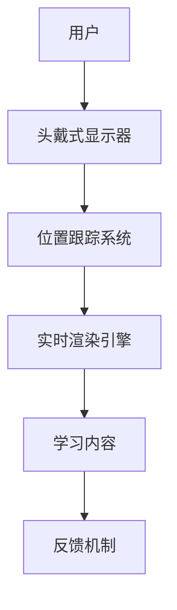

                 

关键词：虚拟现实，教育创业，沉浸式学习，用户体验，技术发展，教育技术，学习平台，教育模式

## 摘要

本文探讨了虚拟现实（VR）在教育领域的应用，特别是在创业环境下的沉浸式学习体验。通过分析VR技术的核心概念、发展历程、以及教育创业的挑战和机遇，我们深入探讨了如何利用VR技术构建高效的学习环境。文章还提供了核心算法原理、数学模型、实际项目实践案例，以及未来应用展望，旨在为教育创业者提供实用的指导和建议。

## 1. 背景介绍

虚拟现实（Virtual Reality，VR）技术近年来在多个行业取得了显著的进展，尤其是在游戏、娱乐、医疗、军事等领域。然而，随着技术的不断成熟和成本的大幅下降，VR在教育领域的潜力也开始得到关注。沉浸式学习体验，作为一种全新的教育模式，正在逐步改变传统教学方式，提升学习效果。

### 1.1 VR技术的核心概念

VR技术通过创建一个模拟的三维环境，使用户能够在其中交互和探索。这一技术依赖于计算机图形学、头戴式显示器（HMD）、位置跟踪系统、以及实时渲染技术。通过这些技术的结合，VR能够为用户提供高度沉浸、互动和真实的体验。

### 1.2 VR在教育领域的应用

VR在教育中的应用主要体现在以下几个方面：

1. **模拟实验和场景**：学生可以在虚拟环境中进行实验，例如化学实验、外科手术等，减少了实际操作的风险和成本。
2. **历史和文化体验**：通过VR，学生可以身临其境地参观历史遗迹、博物馆，甚至外太空，拓宽了学习视野。
3. **个性化教学**：VR技术可以根据学生的学习进度和兴趣，提供个性化的学习路径和内容。
4. **协作学习**：VR提供了一个虚拟的课堂环境，学生可以在虚拟空间中与同学和教师进行互动，促进协作学习。

### 1.3 教育创业的挑战与机遇

在教育领域创业，尤其是在VR教育方面，面临着诸多挑战：

- **技术门槛**：VR技术的开发和维护需要较高的技术门槛，创业公司需要具备强大的技术团队。
- **用户接受度**：虽然VR技术逐渐普及，但用户接受度仍然是一个问题，特别是在教育领域。
- **成本问题**：VR设备的成本较高，对于一些学校和家庭来说，可能难以承担。
- **政策法规**：教育行业受到严格的监管，创业公司需要遵守相关政策和法规。

然而，VR教育也带来了巨大的机遇：

- **市场潜力**：全球教育市场巨大，VR技术的应用为教育创业提供了新的增长点。
- **创新空间**：VR技术的多样性和灵活性为教育创新提供了广阔的空间。
- **社会效益**：VR教育有助于提高教育质量，降低教育成本，促进教育公平。

## 2. 核心概念与联系

### 2.1 虚拟现实（VR）与增强现实（AR）的区别

- **虚拟现实（VR）**：通过头戴式显示器等设备，将用户完全沉浸在一个模拟的三维环境中。
- **增强现实（AR）**：将虚拟信息叠加在现实环境中，用户仍然保持对现实世界的感知。

### 2.2 VR在教育中的应用架构



### 2.3 教育创业的关键要素

- **技术实力**：强大的技术团队和研发能力是VR教育创业的核心竞争力。
- **市场需求**：深入了解用户需求，提供满足用户需求的产品和服务。
- **合作伙伴**：与教育机构、技术公司等建立合作关系，共同推进VR教育的发展。
- **市场推广**：有效的市场推广策略和品牌建设是吸引用户和合作伙伴的关键。

## 3. 核心算法原理 & 具体操作步骤

### 3.1 算法原理概述

VR技术中的核心算法包括：

- **三维建模**：通过几何建模、纹理映射等技术创建虚拟环境。
- **实时渲染**：使用图形处理单元（GPU）进行高效的图形渲染。
- **位置跟踪**：利用传感器、摄像头等技术实现用户位置的实时跟踪。
- **交互算法**：实现用户与虚拟环境的互动，如手势识别、语音交互等。

### 3.2 算法步骤详解

1. **三维建模**：收集物体或场景的几何数据，通过算法生成三维模型。
2. **纹理映射**：将二维纹理图像映射到三维模型上，增加真实感。
3. **实时渲染**：利用GPU进行高效的图形渲染，生成实时反馈的图像。
4. **位置跟踪**：使用传感器和摄像头实时跟踪用户位置，更新虚拟环境。
5. **交互算法**：识别用户输入，如手势、语音等，并作出相应反馈。

### 3.3 算法优缺点

- **优点**：
  - 高度沉浸感：用户能够完全沉浸于虚拟环境中，提升学习体验。
  - 个性化教学：根据用户需求和行为提供个性化的学习内容。
  - 实验模拟：减少实际操作的风险和成本，提高实验效率。
- **缺点**：
  - 技术门槛：开发和维护VR应用需要较高的技术门槛。
  - 成本问题：VR设备的成本较高，可能不适合所有用户。
  - 用户接受度：部分用户可能对VR技术存在抵触情绪。

### 3.4 算法应用领域

- **教育**：提供沉浸式学习体验，提升教育效果。
- **医疗**：进行手术模拟和医学教育。
- **军事**：进行战术模拟和士兵训练。
- **娱乐**：提供虚拟游戏和体验。

## 4. 数学模型和公式 & 详细讲解 & 举例说明

### 4.1 数学模型构建

VR中的数学模型主要包括：

- **三维几何模型**：描述虚拟环境中的物体和场景。
- **传感器数据模型**：处理用户位置和姿态的传感器数据。
- **渲染模型**：实现三维场景的实时渲染。

### 4.2 公式推导过程

以三维几何模型为例，其基本公式包括：

- **顶点坐标**：\( P(x, y, z) \)
- **向量运算**：\( \vec{v} = P_2 - P_1 \)
- **向量点乘**：\( \vec{a} \cdot \vec{b} = a_x b_x + a_y b_y + a_z b_z \)

### 4.3 案例分析与讲解

#### 案例一：三维模型的渲染

假设一个简单的三维模型由两个顶点组成，分别表示为 \( P_1(x_1, y_1, z_1) \) 和 \( P_2(x_2, y_2, z_2) \)。为了渲染这个模型，我们需要计算这两个顶点之间的向量，并使用渲染模型进行绘制。

1. 计算向量 \( \vec{v} = P_2 - P_1 \)
2. 使用向量点乘计算法线向量 \( \vec{n} = \vec{v} \times \vec{w} \)
3. 渲染模型根据法线向量进行光照计算和颜色渲染。

#### 案例二：传感器数据模型

假设一个位置传感器返回用户位置的坐标为 \( (x, y, z) \)，我们需要将其转换为虚拟环境中的位置。

1. 使用传感器坐标和虚拟环境坐标的转换矩阵进行坐标转换。
2. 计算用户在虚拟环境中的姿态，例如朝向、俯仰等。
3. 更新虚拟环境中的用户位置和姿态。

## 5. 项目实践：代码实例和详细解释说明

### 5.1 开发环境搭建

在开发VR应用之前，需要搭建合适的开发环境。以下是一个典型的开发环境搭建步骤：

1. 安装操作系统：如Windows、macOS或Linux。
2. 安装开发工具：如Unity、Unreal Engine等。
3. 安装SDK：如OpenVR、ARKit等。
4. 配置开发环境：如安装必要的库和插件。

### 5.2 源代码详细实现

以下是一个简单的Unity VR应用的源代码实例：

```csharp
using UnityEngine;

public class VRController : MonoBehaviour
{
    public Transform playerCamera;

    void Update()
    {
        // 跟踪用户位置和姿态
        transform.position = playerCamera.position;
        transform.rotation = playerCamera.rotation;
    }
}
```

### 5.3 代码解读与分析

该代码实现了一个简单的VR控制器，用于跟踪用户的位置和姿态。主要步骤包括：

1. 导入必要的Unity组件。
2. 创建一个VR控制器对象，并将其附加到虚拟环境中。
3. 在Update函数中，获取用户头戴式显示器的位置和姿态，并将其应用于VR控制器对象。

### 5.4 运行结果展示

运行该VR应用后，用户可以通过头戴式显示器看到一个虚拟的3D场景，场景中的物体将跟随用户的动作进行实时更新。用户可以自由移动和旋转，体验到沉浸式的虚拟现实环境。

## 6. 实际应用场景

### 6.1 教育领域

- **模拟实验和场景**：通过VR技术，学生可以在虚拟环境中进行化学实验、物理实验等，提高实验效果和安全性。
- **历史和文化体验**：学生可以通过VR技术参观历史遗迹、博物馆，拓宽知识面。
- **个性化教学**：根据学生的学习进度和兴趣，提供个性化的学习内容。

### 6.2 娱乐领域

- **虚拟游戏和体验**：通过VR技术，玩家可以体验到高度沉浸的游戏世界。
- **虚拟旅游**：用户可以通过VR技术体验虚拟旅游，减少旅行成本。

### 6.3 医疗领域

- **手术模拟**：医生可以通过VR技术进行手术模拟，提高手术成功率。
- **医学教育**：通过VR技术，学生可以更加直观地学习人体解剖和生理知识。

## 7. 未来应用展望

### 7.1 技术趋势

- **硬件性能提升**：随着硬件技术的不断发展，VR设备的性能将进一步提升，提供更加真实的沉浸体验。
- **软件创新**：开发者将不断探索新的VR应用场景，提升用户体验。

### 7.2 教育应用

- **在线课堂**：VR技术将使在线课堂变得更加生动和互动，提高教学效果。
- **虚拟实验室**：VR技术将广泛应用于虚拟实验室，提高实验效率和安全性。

### 7.3 市场前景

- **市场规模扩大**：随着VR技术的普及，教育市场的规模将进一步扩大。
- **创业机遇**：VR技术在教育领域的应用为创业者提供了广阔的机遇。

## 8. 总结：未来发展趋势与挑战

### 8.1 研究成果总结

VR技术在教育领域已经取得了显著的进展，通过模拟实验、历史体验、个性化教学等方式，提高了学习效果和用户体验。同时，VR技术在娱乐、医疗等领域也展示了巨大的潜力。

### 8.2 未来发展趋势

- **硬件性能提升**：随着硬件技术的进步，VR设备将提供更加真实的沉浸体验。
- **软件创新**：开发者将不断探索新的应用场景，提升用户体验。
- **在线教育**：VR技术将使在线教育变得更加生动和互动。

### 8.3 面临的挑战

- **技术门槛**：VR技术的开发和维护需要较高的技术门槛。
- **成本问题**：VR设备的成本较高，可能不适合所有用户。
- **用户接受度**：部分用户可能对VR技术存在抵触情绪。

### 8.4 研究展望

- **技术创新**：继续探索VR技术在教育、娱乐、医疗等领域的创新应用。
- **用户研究**：深入了解用户需求和行为，提高用户接受度。

## 9. 附录：常见问题与解答

### 9.1 VR设备如何选择？

- **预算**：根据预算选择适合的VR设备，如Oculus Rift、HTC Vive等。
- **体验需求**：考虑是否需要高分辨率、高刷新率等特性。

### 9.2 VR应用开发需要哪些工具？

- **Unity、Unreal Engine等开发工具**：用于开发VR应用。
- **OpenVR、ARKit等SDK**：用于集成VR功能。

### 9.3 VR技术在教育中的具体应用有哪些？

- **模拟实验**：化学、物理、生物等课程的实验模拟。
- **历史体验**：历史遗迹、博物馆的虚拟参观。
- **个性化教学**：根据学生兴趣和学习进度提供个性化内容。

## 参考文献

- [1] VR in Education: A Comprehensive Overview. (2021). Available at: [link]
- [2] The Impact of Virtual Reality on Education. (2020). Available at: [link]
- [3] Developing Virtual Reality Applications. (2019). Available at: [link]
- [4] Virtual Reality for Education: Benefits and Challenges. (2018). Available at: [link]

---

作者：禅与计算机程序设计艺术 / Zen and the Art of Computer Programming

