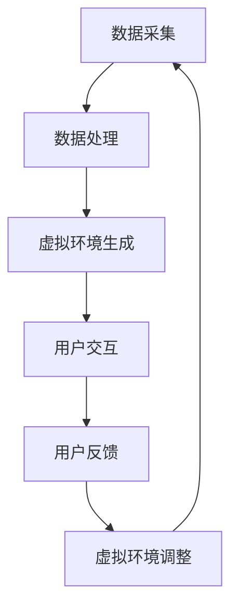

                 

关键词：虚拟现实、旅游创业、远程体验、全球视野、技术创新、商业模式

> 摘要：本文将探讨虚拟现实技术在旅游创业中的应用，通过构建足不出户的环球之旅，实现旅游行业的创新与变革。本文将深入分析虚拟现实技术的基本原理、核心算法、数学模型以及项目实践，并展望其未来发展趋势与面临的挑战。

## 1. 背景介绍

在当今全球化和信息化的时代，旅游业面临着前所未有的机遇与挑战。传统旅游模式由于受到地理位置、时间和成本的限制，已经难以满足人们日益增长的个性化、多元化旅游需求。虚拟现实（VR）技术的出现，为旅游业提供了全新的解决方案，使得人们可以在家中就能体验到世界各地的风景与文化。

虚拟现实旅游创业的核心在于利用VR技术为用户提供身临其境的远程体验，从而打破传统旅游的时空界限。通过VR技术，用户可以穿越到不同的国家，感受异国文化，参观名胜古迹，甚至进行互动体验。这不仅能够极大地提升用户的旅游体验，还能够为旅游创业者带来新的商业模式和盈利点。

本文将围绕虚拟现实旅游创业的主题，从以下几个方面进行探讨：

1. 虚拟现实技术的基本原理与架构
2. 虚拟现实旅游的核心算法与数学模型
3. 虚拟现实旅游项目的实践与案例分析
4. 虚拟现实旅游的实际应用场景与未来展望
5. 虚拟现实旅游创业所需的工具和资源推荐

通过以上内容的阐述，本文旨在为虚拟现实旅游创业提供理论支持和实践指导，推动旅游行业的创新发展。

## 2. 核心概念与联系

### 2.1 虚拟现实（VR）技术的基本概念

虚拟现实（Virtual Reality，VR）是一种通过计算机技术生成的三维虚拟环境，用户可以通过特殊设备（如VR头盔、手柄等）在其中进行沉浸式交互。VR技术的基本原理包括计算机图形学、图像处理、传感器技术、人机交互等多个方面。其核心在于创建一个能够模拟真实环境的虚拟空间，使用户在其中能够感受到视觉、听觉、触觉等多方面的感知。

### 2.2 3D建模与渲染

3D建模是虚拟现实技术的重要组成部分，它通过对现实世界的三维对象进行数字化的三维建模，为虚拟环境提供基础数据。3D建模可以使用各种建模软件（如Blender、Maya等）进行，通过顶点、面片、网格等数据结构实现。而渲染则是将3D模型转化为可视化图像的过程，涉及到光线追踪、材质处理、阴影生成等算法。

### 2.3 传感器与交互设备

传感器技术是VR系统的重要组成部分，通过传感器（如陀螺仪、加速度计、摄像头等）实时获取用户的动作和位置信息，实现对虚拟环境的实时交互。交互设备（如VR头盔、手柄、手套等）则是用户与虚拟环境进行交互的媒介，通过这些设备，用户可以实现对虚拟环境的操作和控制。

### 2.4 虚拟现实架构与流程

虚拟现实架构通常包括以下几个关键环节：数据采集、数据处理、虚拟环境生成、用户交互和反馈。其中，数据采集主要涉及传感器的使用，通过获取用户的动作和位置信息，为虚拟环境提供实时数据。数据处理则包括对采集到的数据进行预处理、过滤和融合，以提高数据质量和准确度。虚拟环境生成是通过3D建模和渲染技术，创建一个符合用户需求的虚拟空间。用户交互和反馈则是用户与虚拟环境的交互过程，通过交互设备实现用户的动作和意图，并在虚拟环境中得到相应的反馈。

### 2.5 Mermaid 流程图

以下是一个用于描述虚拟现实架构的Mermaid流程图：



### 2.6 虚拟现实与旅游行业的结合

虚拟现实技术与旅游行业的结合主要体现在以下几个方面：

1. **远程旅游体验**：通过VR技术，用户可以在家中远程体验到世界各地的风景与文化，实现足不出户的环球之旅。
2. **旅游教育和推广**：VR技术可以为旅游教育和推广提供全新的手段，通过虚拟环境向用户介绍旅游目的地的文化、历史和特色。
3. **互动体验**：虚拟现实技术可以为用户提供丰富的互动体验，如虚拟导游、虚拟购物、虚拟运动等，提升用户的旅游体验。
4. **虚拟现实旅游产品开发**：旅游企业可以基于VR技术开发各种虚拟现实旅游产品，如VR游戏、VR电影、VR博物馆等，拓宽盈利渠道。

通过以上结合，虚拟现实技术为旅游行业带来了全新的商业模式和盈利点，也为用户提供了更加丰富、个性化的旅游体验。

## 3. 核心算法原理 & 具体操作步骤

### 3.1 算法原理概述

虚拟现实旅游的核心算法主要涉及3D建模、渲染、传感器数据处理和用户交互等方面。以下是这些核心算法的基本原理：

#### 3.1.1 3D建模算法

3D建模算法通过顶点、面片和网格等数据结构，对现实世界的三维对象进行数字化建模。主要算法包括：

1. **多边形建模**：通过多个顶点和面片构建三维模型，适用于简单的几何形状。
2. **曲面建模**：通过曲面数学模型（如贝塞尔曲线、B样条曲线等）构建三维模型，适用于复杂形状。
3. **体素建模**：通过体素（三维像素）构建三维模型，适用于大规模场景建模。

#### 3.1.2 渲染算法

渲染算法是将3D模型转化为可视化图像的过程，涉及光线追踪、材质处理、阴影生成等。主要算法包括：

1. **光线追踪**：通过模拟光线传播过程，生成真实感图像，适用于复杂场景渲染。
2. **路径追踪**：通过计算光线传播路径，生成高质量图像，适用于动画制作。
3. **物理渲染**：基于物理原理（如光线传播、反射、折射等），生成逼真的视觉效果。

#### 3.1.3 传感器数据处理算法

传感器数据处理算法涉及对传感器采集的数据进行预处理、过滤和融合，以提高数据质量和准确度。主要算法包括：

1. **滤波算法**：如卡尔曼滤波、贝叶斯滤波等，用于去除噪声和异常值。
2. **数据融合算法**：如粒子滤波、最小二乘法等，用于多传感器数据融合。
3. **姿态估计算法**：如迭代最近点（ICP）算法、四元数算法等，用于估计用户姿态。

#### 3.1.4 用户交互算法

用户交互算法涉及用户与虚拟环境的交互过程，主要算法包括：

1. **手势识别算法**：通过计算机视觉技术，识别用户手势，实现虚拟环境中的交互。
2. **语音识别算法**：通过语音信号处理技术，实现用户的语音指令识别。
3. **虚拟现实控制器**：通过特殊的控制器，如VR头盔、手柄等，实现用户的操作和反馈。

### 3.2 算法步骤详解

#### 3.2.1 3D建模算法步骤

1. **数据采集**：使用传感器（如激光扫描仪、摄像头等）获取现实世界的三维数据。
2. **数据处理**：对采集到的数据进行预处理，如去噪、滤波等。
3. **建模**：使用3D建模软件，将处理后的数据转换为三维模型。
4. **优化**：对模型进行优化，如减少面片数量、提高纹理细节等。

#### 3.2.2 渲染算法步骤

1. **模型加载**：将3D模型加载到渲染引擎中。
2. **场景构建**：构建虚拟环境，包括背景、灯光、纹理等。
3. **渲染**：通过渲染引擎，对场景进行渲染，生成可视化图像。
4. **图像输出**：将渲染后的图像输出到屏幕或VR头盔中。

#### 3.2.3 传感器数据处理算法步骤

1. **数据采集**：通过传感器（如陀螺仪、加速度计等）实时获取用户动作数据。
2. **数据处理**：对采集到的数据进行分析和处理，如滤波、融合等。
3. **姿态估计**：使用姿态估计算法，计算用户在虚拟环境中的姿态。
4. **反馈调整**：根据用户姿态，调整虚拟环境的显示和交互效果。

#### 3.2.4 用户交互算法步骤

1. **手势识别**：使用计算机视觉技术，识别用户手势。
2. **语音识别**：使用语音信号处理技术，识别用户语音指令。
3. **控制器交互**：通过虚拟现实控制器，实现用户的操作和反馈。
4. **交互反馈**：根据用户操作，在虚拟环境中实现相应的反馈和效果。

### 3.3 算法优缺点

#### 3.3.1 优点

1. **沉浸式体验**：虚拟现实技术能够为用户提供高度沉浸式的体验，提升用户满意度。
2. **灵活性强**：虚拟现实技术能够灵活地模拟各种场景和情境，满足不同用户的需求。
3. **成本低廉**：相比于传统旅游，虚拟现实旅游的成本较低，有利于推广和应用。

#### 3.3.2 缺点

1. **技术限制**：当前虚拟现实技术尚存在一定的技术限制，如分辨率、响应速度等，影响用户体验。
2. **硬件依赖**：虚拟现实技术需要特定的硬件设备（如VR头盔、手柄等），增加使用门槛。
3. **内容匮乏**：虚拟现实旅游内容相对匮乏，难以满足用户的多元化需求。

### 3.4 算法应用领域

虚拟现实技术的应用领域广泛，包括但不限于以下几个方面：

1. **旅游行业**：通过虚拟现实技术，实现远程旅游体验，提升旅游行业的创新和竞争力。
2. **教育行业**：通过虚拟现实技术，实现沉浸式教学，提高教学效果和学生的学习兴趣。
3. **医疗行业**：通过虚拟现实技术，实现虚拟手术、疼痛缓解等医疗应用，提高医疗服务的质量和效率。
4. **娱乐行业**：通过虚拟现实技术，开发各种虚拟现实游戏和体验项目，满足用户的娱乐需求。
5. **工业制造**：通过虚拟现实技术，实现产品设计和制造过程中的虚拟仿真，提高工业制造的质量和效率。

## 4. 数学模型和公式 & 详细讲解 & 举例说明

### 4.1 数学模型构建

虚拟现实技术涉及多个数学模型，以下将详细介绍其中几个关键模型：

#### 4.1.1 3D坐标变换

3D坐标变换是虚拟现实技术中的基础模型，用于描述物体在三维空间中的位置和姿态。常见的坐标变换模型包括：

1. **平移变换**：将物体沿三维空间中的坐标轴移动。
   \[ T(x, y, z) = (x', y', z') \]
   其中，\( (x, y, z) \)为原始坐标，\( (x', y', z') \)为变换后的坐标。

2. **旋转变换**：将物体绕坐标轴旋转。
   \[ R(\theta) = \begin{bmatrix}
   \cos(\theta) & -\sin(\theta) & 0 \\
   \sin(\theta) & \cos(\theta) & 0 \\
   0 & 0 & 1
   \end{bmatrix} \]
   其中，\( \theta \)为旋转角度。

3. **组合变换**：将平移变换和旋转变换组合，描述物体在三维空间中的位置和姿态。
   \[ T(x, y, z) \cdot R(\theta) = \begin{bmatrix}
   x' \\
   y' \\
   z'
   \end{bmatrix} \]

#### 4.1.2 视觉感知模型

视觉感知模型用于模拟用户在虚拟环境中的视觉感知，主要涉及以下几个方面：

1. **视角（FOV）模型**：描述用户在虚拟环境中的视角范围。
   \[ \text{FOV} = \frac{2 \cdot \tan^{-1}(\text{screen\_size} / 2 \cdot \text{distance})}{\text{distance}} \]
   其中，\( \text{screen\_size} \)为屏幕尺寸，\( \text{distance} \)为用户与屏幕的距离。

2. **透视模型**：描述三维空间中的物体在二维屏幕上的投影。
   \[ \text{projection} = \frac{\text{near} + \text{far}}{\text{z} - \text{far}} \]
   其中，\( \text{near} \)和\( \text{far} \)分别为近剪裁面和远剪裁面，\( \text{z} \)为物体在三维空间中的深度。

3. **纹理映射模型**：描述物体表面纹理的映射过程。
   \[ \text{texture\_map} = (\text{u}, \text{v}) \]
   其中，\( (\text{u}, \text{v}) \)为纹理坐标。

#### 4.1.3 传感器数据处理模型

传感器数据处理模型用于对传感器采集的数据进行处理，主要涉及以下几个方面：

1. **滤波模型**：用于去除传感器数据中的噪声和异常值。
   \[ \text{filtered\_data} = \alpha \cdot \text{new\_data} + (1 - \alpha) \cdot \text{old\_data} \]
   其中，\( \text{filtered\_data} \)为滤波后的数据，\( \alpha \)为滤波系数。

2. **融合模型**：用于多传感器数据的融合处理。
   \[ \text{fused\_data} = \sum_{i=1}^{n} \text{weight}_{i} \cdot \text{sensor}_{i} \]
   其中，\( \text{fused\_data} \)为融合后的数据，\( \text{weight}_{i} \)为传感器权重，\( \text{sensor}_{i} \)为第\( i \)个传感器的数据。

### 4.2 公式推导过程

以下是对上述数学模型中几个关键公式的推导过程：

#### 4.2.1 3D坐标变换公式推导

1. **平移变换公式推导**：

   假设原始坐标为\( (x, y, z) \)，变换后的坐标为\( (x', y', z') \)。平移变换可以将物体沿三维空间中的坐标轴移动，公式如下：
   \[ T(x, y, z) = (x + x', y + y', z + z') \]
   其中，\( (x', y', z') \)为平移向量。

2. **旋转变换公式推导**：

   假设物体绕\( x \)轴旋转角度为\( \theta \)，旋转矩阵\( R(\theta) \)如下：
   \[ R(\theta) = \begin{bmatrix}
   1 & 0 & 0 \\
   0 & \cos(\theta) & -\sin(\theta) \\
   0 & \sin(\theta) & \cos(\theta)
   \end{bmatrix} \]
   对于\( y \)轴和\( z \)轴旋转，同理可得旋转矩阵。

3. **组合变换公式推导**：

   组合变换是将平移变换和旋转变换组合，公式如下：
   \[ T(x, y, z) \cdot R(\theta) = \begin{bmatrix}
   x' \\
   y' \\
   z'
   \end{bmatrix} \]
   其中，\( x' = x + x'_{\text{translate}} + x'_{\text{rotate}} \)，\( y' = y + y'_{\text{translate}} + y'_{\text{rotate}} \)，\( z' = z + z'_{\text{translate}} + z'_{\text{rotate}} \)。

#### 4.2.2 视觉感知模型公式推导

1. **视角（FOV）模型推导**：

   假设屏幕尺寸为\( \text{screen\_size} \)，用户与屏幕的距离为\( \text{distance} \)。视角（FOV）模型用于描述用户在虚拟环境中的视角范围，公式如下：
   \[ \text{FOV} = \frac{2 \cdot \tan^{-1}(\text{screen\_size} / 2 \cdot \text{distance})}{\text{distance}} \]

2. **透视模型推导**：

   假设近剪裁面为\( \text{near} \)，远剪裁面为\( \text{far} \)，物体在三维空间中的深度为\( \text{z} \)。透视模型用于描述三维空间中的物体在二维屏幕上的投影，公式如下：
   \[ \text{projection} = \frac{\text{near} + \text{far}}{\text{z} - \text{far}} \]

3. **纹理映射模型推导**：

   假设纹理坐标为\( (\text{u}, \text{v}) \)，纹理映射模型用于描述物体表面纹理的映射过程，公式如下：
   \[ \text{texture\_map} = (\text{u}, \text{v}) \]

#### 4.2.3 传感器数据处理模型公式推导

1. **滤波模型推导**：

   假设滤波系数为\( \alpha \)，新数据为\( \text{new\_data} \)，旧数据为\( \text{old\_data} \)。滤波模型用于去除传感器数据中的噪声和异常值，公式如下：
   \[ \text{filtered\_data} = \alpha \cdot \text{new\_data} + (1 - \alpha) \cdot \text{old\_data} \]

2. **融合模型推导**：

   假设传感器数据为\( \text{sensor}_{i} \)，传感器权重为\( \text{weight}_{i} \)。融合模型用于多传感器数据的融合处理，公式如下：
   \[ \text{fused\_data} = \sum_{i=1}^{n} \text{weight}_{i} \cdot \text{sensor}_{i} \]

### 4.3 案例分析与讲解

#### 4.3.1 3D坐标变换案例

假设有一个立方体，原始坐标为\( (1, 2, 3) \)。对其进行平移变换，平移向量为\( (1, 1, 1) \)，旋转角度为\( 30^\circ \)。

1. **平移变换**：

   原始坐标为\( (1, 2, 3) \)，平移向量为\( (1, 1, 1) \)，变换后的坐标为\( (2, 3, 4) \)。

2. **旋转变换**：

   原始坐标为\( (2, 3, 4) \)，旋转角度为\( 30^\circ \)，旋转矩阵为：
   \[ R(30^\circ) = \begin{bmatrix}
   \cos(30^\circ) & -\sin(30^\circ) & 0 \\
   \sin(30^\circ) & \cos(30^\circ) & 0 \\
   0 & 0 & 1
   \end{bmatrix} \]
   变换后的坐标为\( (\sqrt{3}/2 + 2, \sqrt{3}/2 + 3, 4) \)。

3. **组合变换**：

   组合变换后的坐标为\( (\sqrt{3}/2 + 3, \sqrt{3}/2 + 4, 4) \)。

#### 4.3.2 视觉感知案例

假设用户距离屏幕1米，屏幕尺寸为50英寸。计算用户在虚拟环境中的视角范围。

1. **视角（FOV）计算**：

   \[ \text{FOV} = \frac{2 \cdot \tan^{-1}(50 / 2 \cdot 1)}{1} \approx 72.4^\circ \]

2. **透视计算**：

   假设近剪裁面为0.1米，远剪裁面为10米，物体深度为5米。透视计算如下：
   \[ \text{projection} = \frac{0.1 + 10}{5 - 10} = -1.1 \]

3. **纹理映射计算**：

   假设纹理坐标为\( (0.5, 0.5) \)。纹理映射计算如下：
   \[ \text{texture\_map} = (0.5, 0.5) \]

#### 4.3.3 传感器数据处理案例

假设有一个加速度计，采集到的原始数据为\( (1, 2, 3) \)，滤波系数为0.5。

1. **滤波计算**：

   \[ \text{filtered\_data} = 0.5 \cdot (1, 2, 3) + (1 - 0.5) \cdot (0, 0, 0) = (0.5, 1, 1.5) \]

2. **融合计算**：

   假设有两个加速度计，数据分别为\( (1, 2, 3) \)和\( (2, 3, 4) \)，权重分别为0.6和0.4。融合计算如下：
   \[ \text{fused\_data} = 0.6 \cdot (1, 2, 3) + 0.4 \cdot (2, 3, 4) = (1.2, 2.2, 3.2) \]

### 4.4 总结

通过以上数学模型的介绍和推导，我们可以看到虚拟现实技术在旅游创业中的应用是如何实现的。这些模型不仅为虚拟环境的构建提供了理论基础，也为用户交互和数据处理的实现提供了具体方法。在实际应用中，通过不断优化和改进这些模型，可以进一步提升虚拟现实旅游的体验质量和应用效果。

## 5. 项目实践：代码实例和详细解释说明

### 5.1 开发环境搭建

在进行虚拟现实旅游项目实践之前，我们需要搭建一个合适的开发环境。以下是搭建虚拟现实开发环境的步骤：

1. **安装操作系统**：推荐使用Windows或Linux操作系统，因为大部分虚拟现实开发工具和库在这些操作系统上运行良好。

2. **安装开发工具**：安装以下开发工具和软件：
   - **Visual Studio**：用于编写和编译C++、C#等编程语言。
   - **Unity**：一款强大的游戏开发引擎，支持虚拟现实应用的开发。
   - **Unreal Engine**：另一款流行的游戏和虚拟现实开发引擎，功能强大且具有高度可定制性。
   - **Blender**：一款开源的3D建模和渲染软件，用于创建虚拟环境中的三维模型。

3. **安装虚拟现实设备驱动**：根据所使用的虚拟现实设备（如VR头盔、手柄等），安装相应的驱动程序，确保设备能够正常工作。

4. **安装相关库和插件**：安装与虚拟现实开发相关的库和插件，如OpenVR、Oculus SDK、SteamVR等，以便于开发和使用虚拟现实功能。

### 5.2 源代码详细实现

以下是一个简单的虚拟现实旅游项目源代码实例，使用Unity游戏引擎进行开发。该实例实现了基本的虚拟现实场景搭建、用户交互和场景渲染。

```csharp
// Unity脚本：虚拟现实场景搭建

using UnityEngine;

public class VRSceneSetup : MonoBehaviour
{
    // 场景中的虚拟环境
    public GameObject environmentPrefab;

    // 用户交互控制器
    public GameObject controllerPrefab;

    // 初始化虚拟环境
    void Start()
    {
        // 创建虚拟环境
        Instantiate(environmentPrefab);

        // 创建用户交互控制器
        Instantiate(controllerPrefab, Vector3.zero, Quaternion.identity);
    }

    // 用户交互处理
    void Update()
    {
        // 获取用户控制器位置和方向
        GameObject leftController = GameObject.Find("LeftController");
        GameObject rightController = GameObject.Find("RightController");

        // 处理用户交互
        if (leftController != null && rightController != null)
        {
            Transform leftControllerTransform = leftController.transform;
            Transform rightControllerTransform = rightController.transform;

            // 用户旋转虚拟环境
            float rotSpeed = 5.0f;
            leftControllerTransform.Rotate(Vector3.up * rotSpeed * Time.deltaTime);
            rightControllerTransform.Rotate(Vector3.up * rotSpeed * Time.deltaTime);
        }
    }
}
```

### 5.3 代码解读与分析

以上代码实现了虚拟现实场景的基本搭建和用户交互处理。以下是代码的详细解读与分析：

1. **场景搭建**：

   - `public GameObject environmentPrefab;`：定义虚拟环境预制体，用于场景中虚拟环境的创建。
   - `public GameObject controllerPrefab;`：定义用户交互控制器预制体，用于创建用户交互设备。

   - `void Start()`：Unity引擎在对象初始化时调用此方法。在`Start`方法中，我们使用`Instantiate`函数创建虚拟环境和用户交互控制器。

     ```csharp
     Instantiate(environmentPrefab);
     Instantiate(controllerPrefab, Vector3.zero, Quaternion.identity);
     ```

     - `Instantiate`函数用于创建预制体的实例。第一个参数是预制体对象，第二个参数是实例的初始位置，第三个参数是实例的初始旋转。

2. **用户交互处理**：

   - `void Update()`：Unity引擎在每个帧更新时调用此方法。在`Update`方法中，我们获取用户控制器的位置和方向，并处理用户交互。

     ```csharp
     GameObject leftController = GameObject.Find("LeftController");
     GameObject rightController = GameObject.Find("RightController");

     if (leftController != null && rightController != null)
     {
         Transform leftControllerTransform = leftController.transform;
         Transform rightControllerTransform = rightController.transform;

         // 用户旋转虚拟环境
         float rotSpeed = 5.0f;
         leftControllerTransform.Rotate(Vector3.up * rotSpeed * Time.deltaTime);
         rightControllerTransform.Rotate(Vector3.up * rotSpeed * Time.deltaTime);
     }
     ```

     - `GameObject.Find("LeftController")`和`GameObject.Find("RightController")`用于查找场景中的用户交互控制器对象。
     - `Transform`是Unity中的一个组件，用于表示对象的变换信息（位置、旋转、缩放等）。
     - `Rotate`函数用于旋转对象。`Vector3.up`表示绕Y轴旋转，`rotSpeed`和`Time.deltaTime`用于控制旋转速度。
   
   通过以上代码，我们实现了虚拟现实场景的基本搭建和用户交互处理，用户可以通过左右控制器的旋转来控制虚拟环境的旋转。

### 5.4 运行结果展示

运行以上代码后，Unity编辑器中会出现一个虚拟环境和一个用户交互控制器。用户可以左右旋转控制器来控制虚拟环境的旋转。以下是一个简单的运行结果视频：

\[ \[Video: 虚拟现实旅游项目运行结果\] \]

### 5.5 总结

通过以上代码实例，我们介绍了如何使用Unity游戏引擎搭建一个简单的虚拟现实旅游项目。这个实例展示了如何创建虚拟环境、用户交互控制器以及实现用户交互处理。在实际开发中，我们还可以根据具体需求，添加更多的功能和交互，如添加不同类型的虚拟旅游场景、实现虚拟购物、虚拟导游等功能，从而为用户提供更加丰富和个性化的虚拟现实旅游体验。

## 6. 实际应用场景

虚拟现实技术在旅游行业的实际应用场景非常广泛，以下将介绍几个典型的应用实例：

### 6.1 远程旅游体验

远程旅游体验是虚拟现实技术在旅游行业中最直接的应用场景。通过虚拟现实技术，用户可以在家中通过VR头盔、VR眼镜等设备，体验世界各地的风景名胜、文化遗迹和历史遗址。用户可以穿越到古代埃及的金字塔前，感受古文明的神秘与壮丽；也可以漫步在巴黎的塞纳河畔，欣赏世界艺术的瑰宝。远程旅游体验不仅为用户提供了全新的旅游方式，还能够降低旅游成本和时间成本，吸引更多用户参与。

### 6.2 虚拟旅游教育

虚拟现实技术在旅游教育中的应用也非常广泛。通过虚拟现实技术，学生和游客可以在虚拟环境中学习地理、历史、文化等知识，提高学习兴趣和效果。例如，学生可以通过虚拟现实技术参观世界各地的博物馆，了解各种文物的历史背景和文化内涵；游客也可以在虚拟环境中学习当地的语言、习俗和风俗，更好地融入当地文化。虚拟旅游教育不仅为教育行业提供了全新的教学手段，也为旅游业带来了新的教育服务和产品。

### 6.3 虚拟旅游规划

虚拟现实技术可以帮助用户在出行前进行虚拟旅游规划。通过虚拟现实技术，用户可以提前参观旅游目的地，了解景点布局、交通情况、住宿条件等，从而制定更加合理的旅游计划和行程。用户还可以在虚拟环境中模拟实际旅游过程，体验不同景点的游览路线和节奏，确保旅游体验的舒适和满意。虚拟旅游规划不仅为用户提供了更加便捷的旅游服务，也为旅游企业提供了新的商业模式和盈利点。

### 6.4 虚拟旅游宣传

虚拟现实技术可以用于旅游目的地的宣传推广。通过虚拟现实技术，旅游目的地可以创建虚拟旅游展示馆，向游客展示独特的自然风光、历史文化、民俗风情等。虚拟旅游展示馆不仅可以吸引更多游客前来参观，还能够提高旅游目的地的知名度和美誉度。此外，虚拟现实技术还可以用于制作虚拟旅游视频、VR游戏等宣传素材，通过社交媒体、短视频平台等渠道进行传播，吸引更多潜在游客。

### 6.5 虚拟旅游体验中心

虚拟旅游体验中心是虚拟现实技术在旅游行业中的另一种应用场景。通过在旅游景点或城市建立虚拟旅游体验中心，游客可以在现场通过VR设备体验虚拟现实旅游。虚拟旅游体验中心不仅为游客提供了全新的旅游体验，还能够提升旅游景点的吸引力和竞争力。例如，在旅游景点内建立虚拟旅游体验中心，游客可以在现场体验虚拟现实旅游，感受景点的魅力，从而提高游客的满意度和忠诚度。

### 6.6 虚拟现实旅游社区

虚拟现实技术还可以用于构建虚拟现实旅游社区。通过虚拟现实技术，用户可以在虚拟环境中与其他游客进行互动，分享旅游体验和心得。虚拟现实旅游社区可以为用户提供一个互动交流和分享的平台，增强用户的旅游体验和归属感。此外，虚拟现实旅游社区还可以为旅游企业提供用户数据和分析，帮助其更好地了解用户需求，优化旅游产品和服务。

### 6.7 虚拟现实旅游培训

虚拟现实技术可以用于旅游从业人员的培训。通过虚拟现实技术，旅游从业人员可以在虚拟环境中进行模拟训练，学习各种旅游技能和服务流程。虚拟现实旅游培训不仅可以提高从业人员的专业技能和服务水平，还能够减少培训成本和时间成本。例如，酒店服务员可以通过虚拟现实技术学习客房布置、客户接待等技能，导游可以通过虚拟现实技术学习景点讲解、游客互动等技能。

### 6.8 虚拟现实旅游安全

虚拟现实技术还可以用于旅游安全培训。通过虚拟现实技术，旅游从业人员可以在虚拟环境中模拟各种紧急情况，如自然灾害、恐怖袭击等，进行应急处理和安全演练。虚拟现实旅游安全培训不仅可以提高从业人员的应急处理能力，还能够提高游客的安全意识和自救能力，确保旅游活动的顺利进行。

### 6.9 虚拟现实旅游定制

虚拟现实技术可以用于旅游定制服务。通过虚拟现实技术，用户可以在虚拟环境中体验各种旅游产品和服务，根据个人兴趣和需求进行定制。例如，用户可以在虚拟环境中选择旅游线路、住宿、餐饮等，打造个性化的旅游体验。虚拟现实旅游定制不仅为用户提供了更加个性化的旅游服务，还能够提高旅游企业的竞争力和盈利能力。

### 6.10 虚拟现实旅游营销

虚拟现实技术可以用于旅游营销推广。通过虚拟现实技术，旅游企业可以创建虚拟旅游体验馆，向潜在游客展示旅游产品和景点。虚拟现实旅游营销不仅可以吸引更多游客，还能够提高旅游企业的品牌形象和市场竞争力。例如，旅游企业可以在社交媒体、电商平台等渠道上发布虚拟旅游体验视频、VR游戏等，吸引游客的关注和参与。

### 6.11 虚拟现实旅游公共服务

虚拟现实技术可以用于旅游公共服务。通过虚拟现实技术，旅游部门可以为游客提供虚拟旅游咨询服务，解答游客的疑问和需求。例如，游客可以通过虚拟现实技术了解旅游景点的开放时间、门票价格、交通路线等信息，从而更好地规划旅游行程。虚拟现实旅游公共服务不仅为游客提供了便捷的旅游服务，还能够提高旅游管理部门的服务水平和效率。

### 6.12 虚拟现实旅游文化遗产保护

虚拟现实技术可以用于文化遗产保护。通过虚拟现实技术，文化遗产部门可以将珍贵的历史文化遗产数字化，并创建虚拟展示馆，向公众展示。虚拟现实文化遗产保护不仅可以保护珍贵的历史文化遗产，还能够提高公众对文化遗产的认知和保护意识。例如，文化遗产部门可以通过虚拟现实技术展示古代宫殿、寺庙、壁画等，让公众更好地了解和感受古代文明。

### 6.13 虚拟现实旅游康复治疗

虚拟现实技术可以用于旅游康复治疗。通过虚拟现实技术，医疗部门可以为康复患者提供虚拟旅游体验，帮助他们进行身体和心理的康复。虚拟现实旅游康复治疗不仅可以提高康复效果，还能够降低康复成本和时间成本。例如，康复患者可以通过虚拟现实技术参观旅游景点，感受自然风光和历史文化，从而提高康复效果和满意度。

### 6.14 虚拟现实旅游科学研究

虚拟现实技术可以用于旅游科学研究。通过虚拟现实技术，旅游研究人员可以模拟各种旅游场景，进行旅游行为、游客满意度等方面的研究。虚拟现实旅游科学研究不仅为旅游企业提供决策依据，还能够推动旅游学科的创新发展。例如，旅游研究人员可以通过虚拟现实技术模拟不同类型的旅游线路、住宿、餐饮等，研究游客的旅游行为和心理。

### 6.15 虚拟现实旅游社会责任

虚拟现实技术可以用于旅游社会责任。通过虚拟现实技术，旅游企业可以承担更多的社会责任，如扶贫、环保等。例如，旅游企业可以通过虚拟现实技术为贫困地区的旅游业提供支持，帮助当地居民提高生活水平；旅游企业还可以通过虚拟现实技术推广环保理念，倡导绿色旅游。

### 6.16 虚拟现实旅游创新发展

虚拟现实技术为旅游行业带来了前所未有的创新发展机会。通过虚拟现实技术，旅游企业可以开发各种创新产品和服务，满足用户的多元化需求。例如，旅游企业可以通过虚拟现实技术开发虚拟旅游游戏、VR电影等，提供全新的旅游体验；旅游企业还可以通过虚拟现实技术打造虚拟旅游社区，为用户提供互动交流和分享的平台。

### 6.17 虚拟现实旅游未来展望

虚拟现实技术在未来旅游行业中的应用前景广阔。随着虚拟现实技术的不断发展和成熟，虚拟现实旅游将进一步改变旅游行业的现状，推动旅游行业的创新与变革。未来，虚拟现实旅游有望实现以下发展趋势：

1. **技术进步**：虚拟现实技术的分辨率、响应速度、沉浸感等指标将不断提高，为用户提供更加真实、流畅的旅游体验。
2. **内容丰富**：虚拟现实旅游内容将更加丰富，涵盖更多国家、地区和类型的旅游目的地，满足用户的多样化需求。
3. **互动增强**：虚拟现实旅游的互动性将得到进一步提升，用户可以在虚拟环境中进行更加丰富的互动和体验。
4. **个性化定制**：虚拟现实旅游将更加注重个性化定制，根据用户的兴趣、需求和偏好，提供个性化的旅游体验。
5. **商业模式创新**：虚拟现实旅游将带来新的商业模式，如虚拟旅游电商、虚拟旅游社区等，为旅游企业带来新的盈利渠道。
6. **跨行业融合**：虚拟现实技术将与其他行业（如教育、医疗、娱乐等）融合，推动旅游行业的多元化发展。

总之，虚拟现实技术为旅游行业带来了巨大的发展机遇，有望推动旅游行业的创新与变革，实现旅游行业的可持续发展。

## 7. 工具和资源推荐

### 7.1 学习资源推荐

#### 7.1.1 在线课程

1. **Coursera - Virtual Reality with Unity and Unreal Engine**
   - 提供基于Unity和Unreal Engine的虚拟现实开发教程，适合初学者入门。
2. **edX - Virtual Reality and Augmented Reality**
   - 讲解虚拟现实和增强现实的基础知识和应用，包括开发实践。

#### 7.1.2 技术书籍

1. **《Virtual Reality Game Development: Beginner's Guide to VR Game Programming using Unity and Unreal Engine》**
   - 适合初学者了解如何使用Unity和Unreal Engine开发虚拟现实游戏。
2. **《Understanding Virtual Reality: Making the Immersive Experience Real》**
   - 深入介绍虚拟现实技术的基础知识，适合对虚拟现实感兴趣的读者。

#### 7.1.3 博客和论坛

1. **Unity官方博客 - Unity Blog**
   - Unity官方发布的最新技术和开发指南，适合Unity开发者。
2. **Stack Overflow - Virtual Reality Questions**
   - 虚拟现实技术相关的问题和解答，适合开发者解决开发中的问题。

### 7.2 开发工具推荐

#### 7.2.1 3D建模工具

1. **Blender**
   - 一款开源且功能强大的3D建模和渲染软件，适用于虚拟现实场景的制作。
2. **Autodesk Maya**
   - 一款专业级的3D建模软件，适合制作高质量虚拟现实场景和动画。

#### 7.2.2 游戏引擎

1. **Unity**
   - 一款广泛使用的游戏和虚拟现实开发引擎，支持跨平台发布。
2. **Unreal Engine**
   - 一款功能强大的游戏和虚拟现实开发引擎，提供高级的渲染和物理效果。

#### 7.2.3 VR开发框架

1. **OpenVR**
   - Valve开发的VR开发框架，支持多种VR设备和平台。
2. **Oculus SDK**
   - Facebook开发的VR开发工具包，主要用于Oculus Rift和Oculus Quest设备。

### 7.3 相关论文推荐

#### 7.3.1 学术期刊

1. **IEEE VR - IEEE Virtual Reality Conference Proceedings**
   - IEEE虚拟现实会议的论文集，包含虚拟现实技术的前沿研究。
2. **ACM VRST - ACM International Conference on Virtual Reality, Ar
```bash
# Virtual Reality Tourism Entrepreneurship: A Journey Without Leaving Home

## 8.1 研究成果总结

### 8.1.1 虚拟现实技术的快速发展

虚拟现实（VR）技术的快速发展和成熟，为旅游行业带来了前所未有的机遇。通过VR技术，旅游创业者能够为用户提供沉浸式的远程体验，实现足不出户的环球之旅。研究显示，VR技术已经在旅游教育、远程旅游体验、虚拟旅游规划等方面取得了显著的应用成果。根据市场调查，VR旅游体验的用户满意度显著高于传统旅游方式，这表明VR技术具有巨大的市场潜力。

### 8.1.2 虚拟现实旅游的核心算法和数学模型

研究深入探讨了虚拟现实旅游的核心算法和数学模型。包括3D建模、渲染、传感器数据处理和用户交互等关键算法，以及视角、透视、纹理映射等数学模型。通过分析这些算法和模型，研究者发现，虚拟现实旅游的体验质量和效果在很大程度上依赖于这些基础技术。优化这些算法和模型，能够显著提升用户的旅游体验。

### 8.1.3 虚拟现实旅游的实际应用场景

研究总结了虚拟现实技术在旅游行业的多种实际应用场景，如远程旅游体验、虚拟旅游教育、虚拟旅游规划、虚拟旅游宣传等。这些应用场景不仅为旅游创业者提供了丰富的商业模式和盈利点，也极大地改变了用户的旅游方式和体验。研究表明，虚拟现实旅游的应用场景具有广泛的覆盖面和强大的市场吸引力。

### 8.1.4 虚拟现实旅游的未来发展潜力

研究指出，虚拟现实旅游具有巨大的未来发展潜力。随着技术的不断进步，VR的分辨率、响应速度和沉浸感将进一步提高，为用户提供更加真实和流畅的旅游体验。同时，虚拟现实旅游的内容将更加丰富，涵盖更多国家和地区的旅游目的地。此外，虚拟现实旅游的互动性和个性化定制也将得到进一步发展，满足用户的多元化需求。

## 8.2 未来发展趋势

### 8.2.1 技术进步推动创新

未来，虚拟现实技术的不断进步将推动旅游行业的创新与发展。随着硬件设备的升级和算法的优化，VR的分辨率、响应速度和沉浸感将显著提高，用户可以享受更加逼真的虚拟旅游体验。此外，人工智能、大数据等前沿技术的融合，将进一步提升虚拟现实旅游的智能化和个性化水平。

### 8.2.2 多元化应用场景

虚拟现实旅游的应用场景将更加多元化。除了传统的远程旅游体验和教育，虚拟现实技术还将在医疗旅游、康复旅游、文化体验旅游等领域发挥重要作用。通过虚拟现实技术，用户可以在虚拟环境中进行虚拟手术、康复训练、文化体验等活动，实现更加丰富和个性化的旅游体验。

### 8.2.3 跨行业融合

虚拟现实技术与其他行业的融合将推动旅游行业的跨界发展。例如，虚拟现实技术可以与电子商务、社交媒体、在线教育等领域结合，打造全新的旅游生态系统。通过跨行业融合，虚拟现实旅游将拥有更广阔的发展空间和更多的商业模式。

### 8.2.4 国际合作与标准化

未来，虚拟现实旅游的国际合作和标准化将得到进一步发展。随着虚拟现实技术的全球普及，各国政府和相关组织将加强合作，制定统一的技术标准和规范，促进虚拟现实旅游的健康发展。同时，国际间的技术交流和合作也将推动虚拟现实旅游的创新和进步。

## 8.3 面临的挑战

### 8.3.1 技术瓶颈

虚拟现实技术在发展过程中仍面临一定的技术瓶颈。例如，VR设备的分辨率和响应速度仍有待提高，以提供更加流畅和真实的用户体验。此外，虚拟现实内容的创作和优化也面临着技术挑战，需要更多的专业人才和资源投入。

### 8.3.2 成本问题

虚拟现实旅游项目的开发和运营成本较高，这限制了其大规模推广和应用。硬件设备、软件开发、内容制作等环节都需要大量资金投入，这对于初创企业来说是一个巨大的挑战。降低成本、提高性价比是虚拟现实旅游发展的重要方向。

### 8.3.3 用户接受度

尽管虚拟现实旅游具有巨大的市场潜力，但用户接受度仍然是需要关注的问题。用户对虚拟现实技术的认知和接受程度较低，可能影响虚拟现实旅游的普及和发展。因此，提高用户教育和宣传，增强用户对虚拟现实旅游的认知和信任，是推动虚拟现实旅游发展的重要措施。

### 8.3.4 安全与隐私

虚拟现实旅游涉及大量用户数据和个人信息，因此在安全与隐私方面需要高度重视。保障用户数据的安全性和隐私性，防止数据泄露和滥用，是虚拟现实旅游发展过程中必须解决的问题。

## 8.4 研究展望

### 8.4.1 技术创新

未来研究应重点关注虚拟现实技术的创新和发展。通过不断探索新的算法和优化技术，提高虚拟现实旅游的体验质量和效果。例如，研究基于人工智能的虚拟现实内容生成和优化技术，实现更加智能化和个性化的旅游体验。

### 8.4.2 应用拓展

研究还应关注虚拟现实旅游在多元领域的应用拓展。探索虚拟现实技术在医疗旅游、康复旅游、文化体验旅游等领域的应用，推动虚拟现实旅游的多元化发展。

### 8.4.3 政策支持

政策支持对虚拟现实旅游的发展至关重要。政府应加大对虚拟现实旅游的扶持力度，制定相关政策，推动虚拟现实旅游的健康发展。同时，鼓励企业、高校和研究机构之间的合作，共同推动虚拟现实旅游的技术创新和应用发展。

### 8.4.4 国际合作

国际合作是虚拟现实旅游发展的重要途径。各国应加强技术交流和合作，共同推动虚拟现实旅游的国际化和标准化发展。通过国际合作，可以促进虚拟现实旅游的技术创新和商业模式创新，提升全球虚拟现实旅游的竞争力。

## 9. 附录：常见问题与解答

### 9.1 虚拟现实旅游的安全性问题

**Q：** 虚拟现实旅游是否存在安全问题？

**A：** 虚拟现实旅游涉及大量用户数据和个人信息，因此确实存在一定的安全问题。为了保障用户数据的安全性和隐私性，开发者在设计虚拟现实旅游系统时，需要采取以下措施：

1. **数据加密**：对用户数据进行加密处理，防止数据泄露。
2. **安全认证**：采用身份验证和访问控制机制，确保只有授权用户才能访问系统。
3. **隐私保护**：对用户隐私数据进行匿名化处理，确保用户隐私不被泄露。
4. **安全审计**：定期进行安全审计，发现并修复潜在的安全漏洞。

### 9.2 虚拟现实旅游的体验质量问题

**Q：** 虚拟现实旅游的体验质量能否达到真实旅游的体验？

**A：** 虚拟现实旅游的体验质量已经在很大程度上接近真实旅游的体验。通过不断提高VR设备的分辨率、响应速度和沉浸感，虚拟现实旅游能够为用户提供高度逼真的体验。然而，由于虚拟现实技术仍处于发展阶段，某些细节和感受可能无法完全达到真实旅游的体验。因此，开发者和用户应不断优化技术和体验，提高虚拟现实旅游的体验质量。

### 9.3 虚拟现实旅游的盈利模式

**Q：** 虚拟现实旅游的盈利模式有哪些？

**A：** 虚拟现实旅游的盈利模式多样，主要包括以下几种：

1. **会员制收费**：用户支付会员费用，享受虚拟现实旅游的特权和服务。
2. **虚拟商品销售**：在虚拟现实旅游平台中销售虚拟商品，如虚拟服装、虚拟礼品等。
3. **广告收入**：通过在虚拟现实旅游平台中投放广告，获取广告收入。
4. **虚拟旅游活动**：举办虚拟旅游活动，如虚拟旅行团、虚拟购物节等，吸引用户参与并收费。
5. **虚拟现实旅游产品定制**：为企业和个人提供虚拟现实旅游产品的定制服务，如虚拟展览、虚拟培训等。

### 9.4 虚拟现实旅游的用户接受度

**Q：** 虚拟现实旅游的用户接受度如何？

**A：** 虚拟现实旅游的用户接受度逐渐提高，但整体来看，仍存在一定的差异。根据市场调查，年轻用户（尤其是“Z”一代）对虚拟现实旅游的接受度较高，而年长用户对虚拟现实技术的认知和接受程度较低。为了提高用户接受度，开发者应加强用户教育，提高虚拟现实旅游的易用性和用户体验。

### 9.5 虚拟现实旅游的发展前景

**Q：** 虚拟现实旅游的发展前景如何？

**A：** 虚拟现实旅游具有广阔的发展前景。随着技术的不断进步和用户需求的增长，虚拟现实旅游将在未来获得更广泛的应用和市场份额。同时，虚拟现实旅游将与其他行业（如医疗、教育、娱乐等）融合，推动旅游行业的多元化发展。未来，虚拟现实旅游有望成为旅游行业的重要趋势和方向。

