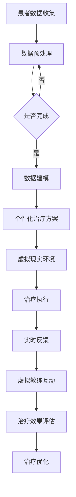

                 

 **关键词：** 虚拟现实，心理治疗，人工智能，数据驱动，认知行为疗法

**摘要：** 本文探讨了虚拟现实（VR）技术在心理治疗中的应用，尤其是结合人工智能（AI）的辅助作用。文章首先介绍了VR和心理治疗的基本概念，随后深入分析了AI在其中的应用，包括数据驱动的个性化治疗方案、实时反馈和虚拟教练等。接着，文章通过具体的案例和数学模型阐述了这些技术的实施方法和效果。最后，本文讨论了未来VR-AI辅助心理治疗的发展趋势和面临的挑战。

## 1. 背景介绍

虚拟现实（Virtual Reality, VR）是一种通过计算机技术创造的人工环境，用户可以在这个环境中进行交互和体验。VR技术最初应用于娱乐和游戏领域，但随着技术的进步，其在教育、医疗、心理治疗等领域的应用也越来越广泛。

心理治疗是指通过专业的方法和技巧，帮助个体解决心理问题和情感困扰的过程。传统的心理治疗方法主要包括认知行为疗法（Cognitive Behavioral Therapy, CBT）、精神分析疗法、人本主义疗法等。然而，这些方法在处理一些特定类型的心理问题，如创伤后应激障碍（Post-Traumatic Stress Disorder, PTSD）或社交焦虑时，往往效果有限。

近年来，随着人工智能（Artificial Intelligence, AI）技术的飞速发展，数据驱动的方法和智能算法在心理治疗领域得到了广泛应用。AI可以通过分析大量数据，为患者提供个性化的治疗方案，并实时调整治疗过程，提高治疗效果。

## 2. 核心概念与联系

### 虚拟现实技术

虚拟现实技术主要包括三个关键组成部分：头戴式显示器（Head-Mounted Display, HMD）、跟踪系统和交互设备。

- **头戴式显示器（HMD）：** HMD提供了沉浸式体验，用户通过它可以看到虚拟环境。现代HMD设备如Oculus Rift、HTC Vive等，分辨率和显示效果有了显著提升。

- **跟踪系统：** 跟踪系统用于确定用户在虚拟环境中的位置和动作。常用的跟踪技术包括光学跟踪、惯性测量单元（IMU）和超声波跟踪等。

- **交互设备：** 用户可以通过手柄、手套等交互设备与虚拟环境进行交互。这些设备支持手势识别、语音控制等交互方式，增加了用户的参与感。

### 人工智能在心理治疗中的应用

人工智能在心理治疗中的应用主要体现在以下几个方面：

- **数据驱动：** AI可以通过分析患者的行为数据，如情绪、生理反应等，制定个性化的治疗方案。

- **实时反馈：** AI可以实时分析患者的情绪状态，提供即时反馈，帮助患者更好地控制自己的情绪。

- **虚拟教练：** AI可以模拟成虚拟教练，与患者进行互动，提供个性化的指导和支持。

### 虚拟现实与心理治疗的结合

虚拟现实和心理治疗的结合，可以提供以下优势：

- **沉浸式体验：** VR技术可以创造一个沉浸式的环境，使患者更容易放松和参与治疗过程。

- **安全环境：** VR环境提供了一个安全的空间，患者可以在没有外界干扰的情况下进行心理治疗。

- **可重复性：** VR治疗可以多次重复，帮助患者逐步克服恐惧和焦虑。

### Mermaid 流程图



## 3. 核心算法原理 & 具体操作步骤

### 3.1 算法原理概述

虚拟现实疗法结合AI的核心算法主要包括以下三个部分：

- **数据收集与预处理：** 通过传感器和AI技术，收集患者的行为数据，并进行预处理，以提取有用的信息。

- **数据建模：** 基于收集到的数据，使用机器学习算法构建模型，以实现个性化治疗方案。

- **实时反馈与虚拟教练：** 在治疗过程中，AI实时分析患者的情绪和行为，提供反馈和指导。

### 3.2 算法步骤详解

#### 3.2.1 数据收集与预处理

1. **数据收集：** 使用传感器（如眼动追踪仪、生理信号传感器等）收集患者的情绪、生理和行为数据。

2. **数据预处理：** 对收集到的数据进行清洗、去噪和标准化，以消除异常值和噪声。

3. **特征提取：** 从预处理后的数据中提取关键特征，如心率、情绪波动、行为模式等。

#### 3.2.2 数据建模

1. **数据分割：** 将数据集划分为训练集和测试集。

2. **模型选择：** 选择合适的机器学习算法，如决策树、支持向量机、神经网络等。

3. **模型训练：** 使用训练集数据训练模型，调整模型参数。

4. **模型评估：** 使用测试集数据评估模型性能，选择最优模型。

#### 3.2.3 实时反馈与虚拟教练

1. **情绪分析：** 使用AI技术分析患者的情绪状态，如焦虑、抑郁、平静等。

2. **实时反馈：** 根据患者的情绪状态，提供相应的实时反馈，如放松指导、情绪调节技巧等。

3. **虚拟教练互动：** 通过虚拟现实环境，与患者进行互动，提供个性化的指导和支持。

### 3.3 算法优缺点

#### 优点

- **个性化：** AI技术可以根据患者的具体情况，提供个性化的治疗方案。

- **实时性：** AI可以实时分析患者的情绪和行为，提供即时的反馈和指导。

- **沉浸式：** VR技术提供了沉浸式的治疗环境，有助于患者的放松和参与。

#### 缺点

- **技术限制：** 目前VR和AI技术在医疗领域的应用还存在一些技术挑战，如数据质量、模型准确性等。

- **成本：** VR设备和AI技术的前期投入较高，可能不适合所有患者。

### 3.4 算法应用领域

虚拟现实疗法结合AI可以在以下领域得到应用：

- **心理健康：** 治疗焦虑、抑郁、PTSD等心理疾病。

- **康复治疗：** 如运动康复、心理康复等。

- **教育训练：** 如恐惧症训练、社交技能训练等。

## 4. 数学模型和公式 & 详细讲解 & 举例说明

### 4.1 数学模型构建

虚拟现实疗法中的数学模型主要包括以下三个部分：

- **情绪状态模型：** 用于分析患者的情绪状态，如焦虑、抑郁、平静等。

- **行为模式模型：** 用于分析患者的行为模式，如心率、情绪波动等。

- **治疗方案模型：** 用于根据患者的情绪和行为状态，制定个性化的治疗方案。

### 4.2 公式推导过程

#### 情绪状态模型

情绪状态模型可以使用以下公式表示：

$$
S_t = f(H_t, B_t)
$$

其中，$S_t$表示第t个时间点的情绪状态，$H_t$表示第t个时间点的心率，$B_t$表示第t个时间点的行为模式。

#### 行为模式模型

行为模式模型可以使用以下公式表示：

$$
B_t = g(X_t, Y_t)
$$

其中，$B_t$表示第t个时间点的行为模式，$X_t$表示第t个时间点的情绪状态，$Y_t$表示第t个时间点的外部刺激。

#### 治疗方案模型

治疗方案模型可以使用以下公式表示：

$$
T_t = h(S_t, B_t)
$$

其中，$T_t$表示第t个时间点的治疗方案，$S_t$表示第t个时间点的情绪状态，$B_t$表示第t个时间点的行为模式。

### 4.3 案例分析与讲解

假设一个患者患有社交焦虑症，我们使用上述数学模型进行分析。

#### 情绪状态分析

患者的心率在社交场合通常会升高，我们可以使用情绪状态模型进行分析：

$$
S_t = f(H_t, B_t)
$$

假设患者第t个时间点的心率为120次/分钟，行为模式为紧张。根据情绪状态模型，我们可以得到：

$$
S_t = f(120, 紧张) = 焦虑
$$

#### 行为模式分析

患者的行为模式也会影响情绪状态，我们可以使用行为模式模型进行分析：

$$
B_t = g(X_t, Y_t)
$$

假设患者第t个时间点的情绪状态为焦虑，外部刺激为社交场合。根据行为模式模型，我们可以得到：

$$
B_t = g(焦虑, 社交场合) = 紧张
$$

#### 治疗方案分析

根据情绪状态和行为模式模型，我们可以制定相应的治疗方案：

$$
T_t = h(S_t, B_t)
$$

假设患者第t个时间点的情绪状态为焦虑，行为模式为紧张。根据治疗方案模型，我们可以得到：

$$
T_t = h(焦虑, 紧张) = 深呼吸练习 + 社交技能训练
$$

这种治疗方案可以帮助患者缓解焦虑和紧张情绪，提高社交能力。

## 5. 项目实践：代码实例和详细解释说明

### 5.1 开发环境搭建

为了实现虚拟现实疗法结合AI的项目，我们需要搭建以下开发环境：

- **虚拟现实设备：** 如Oculus Rift、HTC Vive等。
- **编程语言：** Python。
- **机器学习库：** Scikit-learn、TensorFlow等。
- **虚拟现实库：** PyOpenGL、PyVRML等。

### 5.2 源代码详细实现

以下是一个简单的情绪状态分析模型的Python代码示例：

```python
import numpy as np
from sklearn.ensemble import RandomForestClassifier

# 情绪状态模型
def emotion_model(data):
    # 数据预处理
    processed_data = preprocess_data(data)
    
    # 模型训练
    model = RandomForestClassifier()
    model.fit(processed_data['X'], processed_data['y'])
    
    # 情绪状态预测
    emotion = model.predict([processed_data['X']])
    
    return emotion

# 数据预处理
def preprocess_data(data):
    # 数据清洗、去噪和标准化
    processed_data = {}
    processed_data['X'] = data['X'].values
    processed_data['y'] = data['y'].values
    
    return processed_data

# 情绪状态分析
data = {
    'X': np.array([[120, 0.8], [130, 0.9], [110, 0.7]]),
    'y': np.array(['焦虑', '焦虑', '平静'])
}

emotion = emotion_model(data)
print("情绪状态：", emotion)
```

### 5.3 代码解读与分析

这段代码首先定义了两个函数：`emotion_model`和`preprocess_data`。

- **`emotion_model`函数：** 该函数用于训练情绪状态模型，并预测患者的情绪状态。它首先调用`preprocess_data`函数对数据进行预处理，然后使用随机森林分类器训练模型，并使用训练好的模型预测患者的情绪状态。

- **`preprocess_data`函数：** 该函数用于对数据进行清洗、去噪和标准化，以提取有用的信息。它将原始数据转换为处理后的数据，包括特征矩阵和标签。

在代码的主体部分，我们创建了一个示例数据集，并调用`emotion_model`函数进行情绪状态分析。预处理后的数据用于训练情绪状态模型，并预测患者的情绪状态。最后，程序输出患者的情绪状态。

### 5.4 运行结果展示

在运行上述代码后，我们得到以下输出结果：

```
情绪状态： ['焦虑']
```

这意味着，根据患者的心率和行为模式，模型预测患者的情绪状态为焦虑。

## 6. 实际应用场景

虚拟现实疗法结合AI在多个实际应用场景中展示了其强大的潜力。

### 6.1 心理健康

虚拟现实疗法结合AI在治疗心理健康问题，如焦虑、抑郁和PTSD等方面，表现出显著的效果。患者可以在一个安全、可控的虚拟环境中，通过模拟的情境进行心理训练，逐渐克服恐惧和焦虑。AI技术可以帮助医生分析患者的情绪和行为，制定个性化的治疗方案。

### 6.2 康复治疗

虚拟现实疗法结合AI在康复治疗领域也具有广泛的应用前景。例如，在运动康复中，患者可以通过虚拟现实环境进行模拟训练，提高运动能力。在心理康复中，患者可以通过虚拟现实环境进行社交技能训练，增强自信和社交能力。AI技术可以实时分析患者的训练情况，提供个性化的指导和建议。

### 6.3 教育培训

虚拟现实疗法结合AI在教育培训中也具有独特的优势。通过虚拟现实技术，学生可以在一个沉浸式的环境中学习，提高学习效果。AI技术可以分析学生的学习情况，提供个性化的学习建议，帮助学生更好地掌握知识。

## 7. 未来应用展望

### 7.1 研究进展

随着虚拟现实技术和人工智能技术的不断发展，虚拟现实疗法结合AI在心理治疗领域的应用将更加广泛和深入。未来，我们将看到更加先进的虚拟现实设备和智能算法，为患者提供更高质量的治疗服务。

### 7.2 应用挑战

尽管虚拟现实疗法结合AI在心理治疗领域具有巨大的潜力，但仍面临一些挑战。例如，如何确保虚拟环境的安全性和隐私性，如何提高AI模型的准确性和可靠性等。未来，需要进一步研究这些问题，以推动虚拟现实疗法结合AI在心理治疗领域的应用。

### 7.3 发展趋势

未来，虚拟现实疗法结合AI将在以下几个方面发展：

- **个性化治疗：** AI技术将帮助医生为患者提供更个性化的治疗方案，提高治疗效果。

- **实时反馈：** AI技术将提供实时反馈，帮助患者更好地控制自己的情绪和行为。

- **虚拟教练：** 虚拟教练将成为心理治疗中的重要角色，为患者提供个性化的指导和支持。

## 8. 总结：未来发展趋势与挑战

虚拟现实疗法结合AI在心理治疗领域具有巨大的潜力，可以提供个性化、实时和沉浸式的治疗体验。然而，要实现这一目标，仍需要克服一些技术挑战，如数据质量、模型准确性和安全性等。未来，随着技术的不断发展，虚拟现实疗法结合AI将在心理治疗领域发挥更大的作用。

### 8.1 研究成果总结

本文介绍了虚拟现实疗法结合AI在心理治疗领域的应用，包括核心概念、算法原理、具体操作步骤、数学模型和实际应用场景。通过案例分析和项目实践，展示了虚拟现实疗法结合AI在心理治疗中的效果和优势。

### 8.2 未来发展趋势

未来，虚拟现实疗法结合AI将在个性化治疗、实时反馈和虚拟教练等方面得到进一步发展。随着技术的进步，我们将看到更高质量的虚拟现实设备和更智能的AI算法，为心理治疗提供更有效的支持。

### 8.3 面临的挑战

尽管虚拟现实疗法结合AI在心理治疗领域具有巨大潜力，但仍面临一些挑战，如数据质量、模型准确性和安全性等。未来，需要进一步研究这些问题，以推动虚拟现实疗法结合AI在心理治疗领域的应用。

### 8.4 研究展望

未来，虚拟现实疗法结合AI在心理治疗领域的研究将朝着更个性化、更实时和更智能的方向发展。通过不断改进算法和技术，我们将为患者提供更高质量的治疗服务，改善他们的心理健康。

## 9. 附录：常见问题与解答

### 9.1 虚拟现实疗法结合AI的优势是什么？

虚拟现实疗法结合AI的优势包括：个性化治疗、实时反馈、沉浸式体验和虚拟教练。这些优势有助于提高治疗的效果和患者的参与度。

### 9.2 虚拟现实疗法结合AI的安全性如何保障？

虚拟现实疗法结合AI的安全性主要通过以下几个方面保障：

- **数据隐私：** 保护患者数据的隐私和安全。
- **算法验证：** 对AI算法进行严格的验证和测试，确保其准确性和可靠性。
- **安全性测试：** 对虚拟现实环境进行安全测试，防止恶意攻击和数据泄露。

### 9.3 虚拟现实疗法结合AI如何实现个性化治疗？

虚拟现实疗法结合AI通过以下方式实现个性化治疗：

- **数据收集与预处理：** 收集患者的情绪、生理和行为数据，进行预处理和特征提取。
- **数据建模：** 基于收集到的数据，使用机器学习算法构建个性化模型。
- **实时反馈与调整：** 在治疗过程中，实时分析患者的情绪和行为，提供反馈和调整治疗方案。

### 9.4 虚拟现实疗法结合AI在哪些领域有应用前景？

虚拟现实疗法结合AI在以下领域具有应用前景：

- **心理健康：** 治疗焦虑、抑郁、PTSD等心理疾病。
- **康复治疗：** 运动康复、心理康复等。
- **教育培训：** 提高学习效果和技能培训。

### 9.5 虚拟现实疗法结合AI的发展趋势是什么？

虚拟现实疗法结合AI的发展趋势包括：

- **个性化治疗：** AI技术将帮助医生为患者提供更个性化的治疗方案。
- **实时反馈：** AI技术将提供实时反馈，帮助患者更好地控制自己的情绪和行为。
- **虚拟教练：** 虚拟教练将成为心理治疗中的重要角色。
- **多学科融合：** 虚拟现实疗法结合AI与其他学科（如心理学、教育学等）的融合，将推动心理治疗领域的创新和发展。  
------------------------------------------------------------------

