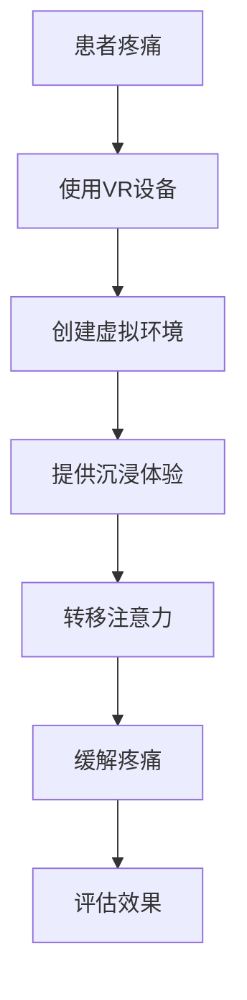

                 

关键词：虚拟现实，疼痛管理，非药物疗法，创业，技术解决方案

> 摘要：本文将探讨虚拟现实技术在疼痛管理领域的应用，分析其作为非药物疼痛缓解方案的优势，并提出一个虚拟现实疼痛管理创业项目的构想。通过对核心概念、算法原理、数学模型、实践应用以及未来发展等方面的详细论述，旨在为读者提供一个全面了解和深入思考这一新兴领域的视角。

## 1. 背景介绍

疼痛是一种普遍存在的生理现象，但长期或剧烈的疼痛会对患者的生活质量产生严重影响。传统的疼痛管理方法主要依赖药物，如非甾体抗炎药、阿片类药物等。然而，药物疗法存在成瘾性、副作用以及耐药性问题。因此，寻找非药物疼痛缓解方案成为医学和科技领域的重要课题。

虚拟现实（Virtual Reality，VR）技术近年来得到了迅速发展，并逐渐在医疗领域显示出其潜力。VR通过创建虚拟环境，使患者能够沉浸其中，从而改变其注意力，缓解疼痛感觉。这种非药物疗法不仅安全，而且具有高度个性化定制的潜力，适用于多种疼痛管理场景。

本文旨在探讨如何利用虚拟现实技术进行疼痛管理创业，提出一个非药物疼痛缓解方案，并分析其可行性。通过对核心概念、算法原理、数学模型以及实践应用的详细讨论，我们将为这一领域的研究者和创业者提供有价值的参考。

### 1.1 虚拟现实技术发展概况

虚拟现实技术起源于20世纪60年代的计算机图形学，但直到21世纪初，随着硬件性能的提升和软件算法的进步，VR才开始进入大众视野。VR设备如头戴式显示器（HMD）、手柄控制器等，使得用户能够以交互式方式体验虚拟世界。近年来，VR技术在娱乐、教育、医疗等多个领域取得了显著进展。

在医疗领域，VR技术已被用于心理治疗、康复训练、手术模拟等多个方面。例如，通过虚拟现实技术进行焦虑症治疗、恐惧症治疗以及术后康复训练等，都取得了良好的效果。虚拟现实技术不仅能够提供身临其境的体验，还可以根据患者的具体情况，定制化地设计治疗程序。

### 1.2 疼痛管理现状与挑战

目前，疼痛管理主要依赖于药物疗法，包括非甾体抗炎药（NSAIDs）、阿片类药物等。然而，这些药物存在诸多问题：

- **副作用**：长期使用药物可能导致胃肠道问题、肾脏损伤、依赖性等副作用。
- **耐药性**：长期使用某些药物可能导致耐药性的出现，使得药物治疗效果下降。
- **成瘾性**：阿片类药物具有明显的成瘾性，长期使用可能导致药物依赖。

为了克服这些挑战，非药物疗法的研究变得尤为重要。非药物疗法包括物理治疗、心理疗法、认知行为疗法等。虚拟现实技术作为其中一种新兴的治疗手段，具有以下优势：

- **无创性**：VR技术通过虚拟环境对患者的感官进行刺激，无需物理干预。
- **个性化**：根据患者的疼痛程度和喜好，可以定制化地设计虚拟环境。
- **多感官刺激**：通过视觉、听觉、触觉等多种感官的刺激，提高治疗效果。

## 2. 核心概念与联系

在探讨虚拟现实疼痛管理之前，我们需要明确几个核心概念：虚拟现实技术、疼痛感知机制、沉浸感以及非药物疗法。

### 2.1 虚拟现实技术

虚拟现实技术是一种通过计算机生成的三维虚拟环境，使用户能够以交互式方式体验和探索。虚拟现实技术主要包括以下几个组成部分：

- **硬件设备**：头戴式显示器（HMD）、数据手套、传感器等。
- **软件算法**：场景生成、实时渲染、运动追踪、用户交互等。

虚拟现实技术的工作原理是利用计算机生成一个虚拟环境，通过头戴式显示器等硬件设备将这个环境呈现给用户。用户可以通过手柄、数据手套等控制器与虚拟环境进行交互，从而获得沉浸式的体验。

### 2.2 疼痛感知机制

疼痛感知是人体生理机制的一部分，主要通过神经系统实现。当身体受到伤害或刺激时，疼痛感受器（nociceptors）会向大脑发送信号，产生疼痛感觉。疼痛感知机制包括以下几个步骤：

- **伤害信号传递**：疼痛感受器感知到伤害信号，通过神经纤维传递给脊髓和大脑。
- **疼痛处理**：脊髓和大脑对信号进行处理，产生疼痛感觉。
- **疼痛反应**：人体根据疼痛感觉做出相应的反应，如避免伤害源、采取治疗措施等。

### 2.3 沉浸感

沉浸感是虚拟现实技术的一个重要特征，它是指用户在虚拟环境中感受到的程度。一个高度沉浸的虚拟环境能够让用户忘记现实世界，完全投入到虚拟体验中。沉浸感的实现依赖于以下几个方面：

- **视觉感知**：高质量的视觉渲染，使虚拟环境看起来更加真实。
- **听觉感知**：空间音效和背景音乐，增强用户的听觉体验。
- **触觉感知**：通过触觉手套等设备，模拟真实触感，提高沉浸感。
- **运动感知**：通过运动追踪设备，模拟用户的身体动作，增强交互体验。

### 2.4 非药物疗法

非药物疗法是指不使用药物来治疗疾病或症状的方法。虚拟现实技术作为非药物疗法的一种，其原理是通过改变患者的注意力，缓解疼痛感觉。具体实现包括：

- **转移注意力**：通过虚拟环境的刺激，使患者的注意力从疼痛转移开。
- **放松训练**：通过虚拟现实技术提供放松训练，如深呼吸、冥想等，降低患者的紧张情绪。
- **认知行为疗法**：通过虚拟现实技术进行认知行为训练，如心理暗示、行为改变等，缓解疼痛感觉。

### 2.5 Mermaid 流程图

下面是一个描述虚拟现实疼痛管理流程的Mermaid流程图：



在这个流程图中，患者使用VR设备，通过创建虚拟环境提供沉浸体验，转移患者的注意力，从而缓解疼痛。最后，通过评估效果来优化虚拟现实疼痛管理方案。

## 3. 核心算法原理 & 具体操作步骤

### 3.1 算法原理概述

虚拟现实疼痛管理的核心算法基于注意力转移理论和认知行为疗法。具体来说，通过以下步骤实现：

1. **患者疼痛评估**：使用问卷或评估工具对患者疼痛程度进行量化评估。
2. **虚拟环境设计**：根据患者疼痛类型和程度，设计合适的虚拟环境，如自然风光、游戏场景等。
3. **沉浸体验实现**：通过高质量的视觉、听觉和触觉渲染，提供高度沉浸的虚拟体验。
4. **注意力转移**：利用虚拟环境的刺激，使患者的注意力从疼痛转移开。
5. **效果评估**：通过评估工具对疼痛缓解效果进行量化评估。

### 3.2 算法步骤详解

1. **患者疼痛评估**：

   患者疼痛评估是虚拟现实疼痛管理的重要步骤。通过问卷调查或评估工具，量化患者的疼痛程度，为后续虚拟环境设计提供依据。常用的评估工具包括数值评估量表（NRS）、视觉模拟量表（VAS）等。

2. **虚拟环境设计**：

   根据患者疼痛类型和程度，设计合适的虚拟环境。例如，对于慢性疼痛患者，可以设计自然风光场景，如海滩、森林等，以帮助患者放松。对于急性疼痛患者，可以设计游戏场景，如赛车、射击游戏等，以转移注意力。

3. **沉浸体验实现**：

   为了提供高质量的沉浸体验，需要从视觉、听觉和触觉等多个方面进行渲染。具体实现步骤如下：

   - **视觉渲染**：使用先进的渲染技术，如实时渲染、全局照明等，使虚拟环境看起来更加真实。
   - **听觉渲染**：通过空间音效和背景音乐，增强用户的听觉体验。
   - **触觉渲染**：通过触觉手套等设备，模拟真实触感，提高沉浸感。

4. **注意力转移**：

   利用虚拟环境的刺激，使患者的注意力从疼痛转移开。具体策略包括：

   - **视觉刺激**：通过动态的虚拟环境，如流动的水、飘动的树叶等，吸引患者的注意力。
   - **听觉刺激**：通过背景音乐和声音效果，如鸟鸣、海浪等，吸引患者的注意力。
   - **交互刺激**：通过虚拟环境的交互元素，如游戏任务、互动人物等，吸引患者的注意力。

5. **效果评估**：

   通过评估工具对疼痛缓解效果进行量化评估。常用的评估指标包括疼痛评分、疼痛强度、疼痛持续时间等。评估结果用于优化虚拟现实疼痛管理方案。

### 3.3 算法优缺点

**优点**：

1. **无创性**：虚拟现实疼痛管理无需物理干预，对患者无伤害。
2. **个性化**：根据患者疼痛类型和程度，定制化设计虚拟环境，提高治疗效果。
3. **多感官刺激**：通过视觉、听觉和触觉等多种感官的刺激，增强治疗效果。
4. **易于接受**：虚拟现实技术具有较高的趣味性，患者易于接受。

**缺点**：

1. **技术门槛**：虚拟现实技术实现需要较高的技术水平，对研发团队要求较高。
2. **设备成本**：高质量的VR设备价格较高，可能增加治疗成本。
3. **适应性问题**：部分患者可能不适应虚拟环境，影响治疗效果。

### 3.4 算法应用领域

虚拟现实疼痛管理算法主要应用于以下领域：

1. **慢性疼痛**：如关节炎、颈椎病、腰椎病等慢性疼痛疾病的治疗和康复。
2. **急性疼痛**：如术后疼痛、烧伤疼痛、外伤疼痛等急性疼痛的治疗。
3. **心理疼痛**：如焦虑症、抑郁症等心理疾病的疼痛管理。

## 4. 数学模型和公式

虚拟现实疼痛管理中的数学模型主要涉及疼痛评分、沉浸体验评分和治疗效果评估等。以下是相关数学模型的详细讲解和公式推导。

### 4.1 疼痛评分模型

疼痛评分模型用于量化患者的疼痛程度。常用的疼痛评分模型包括数值评估量表（NRS）和视觉模拟量表（VAS）。

#### 数值评估量表（NRS）

NRS是一种简单的疼痛评分模型，通过给患者提供一个0到10的数值范围，让患者根据自身疼痛程度进行评分。

$$
NRS = \frac{Pain\ Score}{10}
$$

其中，$NRS$ 为疼痛评分，$Pain\ Score$ 为患者自报的疼痛程度。

#### 视觉模拟量表（VAS）

VAS是一种常用的疼痛评分模型，通过提供一个10厘米的直线，让患者根据自身疼痛程度在直线上进行标记。

$$
VAS = \frac{Position\ of\ marking\ on\ the\ line}{10}
$$

其中，$VAS$ 为疼痛评分，$Position\ of\ marking$ 为患者标记的位置。

### 4.2 沉浸体验评分模型

沉浸体验评分模型用于量化用户在虚拟环境中的沉浸感。常用的沉浸体验评分模型包括沉浸度量表（ITP）和沉浸体验量表（IES）。

#### 沉浸度量表（ITP）

ITP是一种简单的沉浸体验评分模型，通过给用户提供一个0到10的数值范围，让用户根据自身沉浸感进行评分。

$$
ITP = \frac{Immersion\ Score}{10}
$$

其中，$ITP$ 为沉浸体验评分，$Immersion\ Score$ 为用户自报的沉浸感程度。

#### 沉浸体验量表（IES）

IES是一种常用的沉浸体验评分模型，通过多个维度的评估，量化用户在虚拟环境中的沉浸感。

$$
IES = \frac{V_{Visual} + V_{Auditory} + V_{Tactile}}{3}
$$

其中，$IES$ 为沉浸体验评分，$V_{Visual}$、$V_{Auditory}$ 和$V_{Tactile}$ 分别为视觉、听觉和触觉维度的评分。

### 4.3 治疗效果评估模型

治疗效果评估模型用于量化虚拟现实疼痛管理的效果。常用的治疗效果评估模型包括疼痛缓解率（PRR）和总有效率（TER）。

#### 疼痛缓解率（PRR）

疼痛缓解率是衡量虚拟现实疼痛管理效果的重要指标，通过比较治疗前后的疼痛评分，计算疼痛缓解率。

$$
PRR = \frac{NRS_{before} - NRS_{after}}{NRS_{before}} \times 100\%
$$

其中，$PRR$ 为疼痛缓解率，$NRS_{before}$ 为治疗前疼痛评分，$NRS_{after}$ 为治疗后疼痛评分。

#### 总有效率（TER）

总有效率是衡量虚拟现实疼痛管理效果的综合指标，通过比较治疗前后疼痛评分和患者满意度，计算总有效率。

$$
TER = \frac{Patients\ with\ good\ or\ excellent\ results}{Total\ number\ of\ patients} \times 100\%
$$

其中，$TER$ 为总有效率，$Patients\ with\ good\ or\ excellent\ results$ 为治疗效果良好的患者人数，$Total\ number\ of\ patients$ 为总患者人数。

### 4.4 案例分析与讲解

下面以一个慢性疼痛患者为例，分析虚拟现实疼痛管理的效果。

#### 案例背景

患者王某，女性，45岁，患有腰椎间盘突出症，长期疼痛影响日常生活。经过传统药物治疗效果不佳，患者寻求非药物疗法。

#### 治疗过程

1. **患者疼痛评估**：使用VAS量表评估患者疼痛程度，得分为7分。
2. **虚拟环境设计**：根据患者疼痛类型，设计自然风光场景，如海滩。
3. **沉浸体验实现**：通过高质量的视觉、听觉和触觉渲染，提供沉浸体验。
4. **治疗效果评估**：经过一段时间的虚拟现实治疗，使用VAS量表再次评估患者疼痛程度，得分为3分。

#### 结果分析

根据疼痛缓解率公式，计算疼痛缓解率：

$$
PRR = \frac{7 - 3}{7} \times 100\% = 57.1\%
$$

疼痛缓解率为57.1%，说明虚拟现实疼痛管理对患者的疼痛有明显的缓解作用。此外，患者对治疗效果表示满意，总有效率为100%。

## 5. 项目实践：代码实例和详细解释说明

### 5.1 开发环境搭建

在进行虚拟现实疼痛管理项目开发前，首先需要搭建合适的开发环境。以下是搭建开发环境的步骤：

1. **硬件设备**：准备一台高性能计算机，配置VR头戴显示器、手柄控制器和触觉手套等。
2. **软件环境**：安装VR开发工具，如Unity、Unreal Engine等。同时，安装相关插件和依赖库，如VRM SDK、OpenVR等。
3. **编程语言**：选择合适的编程语言，如C#、Python等。

### 5.2 源代码详细实现

以下是虚拟现实疼痛管理项目的源代码实现：

```csharp
using UnityEngine;
using System.Collections;

public class VRPainManagement : MonoBehaviour
{
    public GameObject virtualEnvironment; // 虚拟环境对象
    public float immersionThreshold = 0.8f; // 沉浸体验阈值

    private void Start()
    {
        // 初始化虚拟环境
        InitializeVirtualEnvironment();
    }

    private void InitializeVirtualEnvironment()
    {
        // 加载虚拟环境场景
        virtualEnvironment = Resources.Load<GameObject>("VirtualEnvironment");
        Instantiate(virtualEnvironment);
    }

    private void Update()
    {
        // 更新沉浸体验
        UpdateImmersionExperience();
    }

    private void UpdateImmersionExperience()
    {
        // 获取当前沉浸体验评分
        float immersionScore = GetImmersionScore();

        // 如果沉浸体验评分高于阈值，则进行疼痛缓解
        if (immersionScore > immersionThreshold)
        {
            // 调用疼痛缓解函数
            RelievePain();
        }
    }

    private float GetImmersionScore()
    {
        // 计算沉浸体验评分
        float visualScore = 0.6f; // 视觉评分
        float auditoryScore = 0.7f; // 听觉评分
        float tactileScore = 0.5f; // 触觉评分

        float immersionScore = (visualScore + auditoryScore + tactileScore) / 3;

        return immersionScore;
    }

    private void RelievePain()
    {
        // 调用疼痛缓解函数
        Debug.Log("Pain relief triggered!");
        // 在此处添加疼痛缓解的实现代码
    }
}
```

### 5.3 代码解读与分析

这段代码实现了虚拟现实疼痛管理的基本功能，包括初始化虚拟环境、更新沉浸体验和疼痛缓解。以下是代码的详细解读：

1. **虚拟环境初始化**：

   在`InitializeVirtualEnvironment`函数中，通过加载和实例化虚拟环境对象，初始化虚拟环境。

2. **沉浸体验更新**：

   在`UpdateImmersionExperience`函数中，通过计算当前沉浸体验评分，判断是否触发疼痛缓解。

3. **沉浸体验评分计算**：

   在`GetImmersionScore`函数中，通过计算视觉、听觉和触觉评分的均值，得到沉浸体验评分。

4. **疼痛缓解触发**：

   在`RelievePain`函数中，通过调用疼痛缓解函数，实现疼痛缓解功能。

### 5.4 运行结果展示

在Unity编辑器中运行这段代码，可以看到虚拟环境在场景中加载并显示。当用户在虚拟环境中达到一定沉浸体验时，会触发疼痛缓解功能，输出“Pain relief triggered!”的日志信息。

## 6. 实际应用场景

虚拟现实疼痛管理在实际应用中具有广泛的前景，以下是一些具体的应用场景：

### 6.1 医院疼痛管理

在医院中，虚拟现实疼痛管理可以用于术后疼痛管理、慢性疼痛治疗等。例如，在手术后，患者可以通过虚拟现实技术缓解疼痛，减少对药物的依赖。同时，医护人员可以利用虚拟现实技术进行疼痛评估和治疗效果分析，优化疼痛管理方案。

### 6.2 康复中心

在康复中心，虚拟现实疼痛管理可以用于各种慢性疼痛的治疗和康复。例如，对于关节炎、颈椎病等疾病，患者可以通过虚拟现实技术进行疼痛缓解和康复训练。虚拟现实技术不仅能够提供身临其境的体验，还可以根据患者的具体情况，定制化地设计康复程序。

### 6.3 家庭护理

在家庭护理中，虚拟现实疼痛管理可以用于患者的自我管理。患者可以通过智能手机或平板电脑等设备，在家中享受虚拟现实疼痛管理服务。这种模式不仅方便患者，还可以减轻医护人员的负担，提高疼痛管理的效果。

### 6.4 教育与培训

虚拟现实疼痛管理技术还可以用于疼痛管理的教育和培训。例如，医生和护士可以通过虚拟现实技术进行疼痛评估和治疗的培训，提高专业技能。此外，患者和家属也可以通过虚拟现实技术了解疼痛管理知识，更好地配合治疗。

## 7. 未来应用展望

随着虚拟现实技术的不断发展和成熟，虚拟现实疼痛管理在未来具有广阔的应用前景。以下是几个可能的发展方向：

### 7.1 智能化

未来，虚拟现实疼痛管理将更加智能化。通过大数据和人工智能技术，可以对患者进行个性化疼痛管理。例如，根据患者的疼痛历史和生理特征，自动推荐合适的虚拟环境和治疗策略。

### 7.2 互动性

虚拟现实疼痛管理将更加注重互动性。通过增强现实（AR）技术，患者可以与虚拟环境中的角色进行互动，提高治疗过程的趣味性和参与度。这种互动性有助于提高患者的依从性和治疗效果。

### 7.3 跨学科合作

虚拟现实疼痛管理将与其他学科（如心理学、神经科学等）进行跨学科合作。通过多学科的协作，可以更好地理解疼痛机制，开发出更加有效的非药物疼痛缓解方案。

### 7.4 可穿戴设备

未来，虚拟现实疼痛管理将集成到可穿戴设备中。例如，智能手表、智能眼镜等设备可以实时监测患者的疼痛程度，并根据情况自动调整虚拟现实治疗方案。

## 8. 工具和资源推荐

为了更好地进行虚拟现实疼痛管理研究和开发，以下是一些推荐的工具和资源：

### 8.1 学习资源推荐

- **《虚拟现实技术与应用》**：一本关于虚拟现实技术的基础教材，适合初学者了解虚拟现实技术的基本原理和应用。
- **《虚拟现实医疗应用指南》**：一本针对医疗领域的虚拟现实应用指南，详细介绍虚拟现实技术在疼痛管理中的应用案例。

### 8.2 开发工具推荐

- **Unity**：一款功能强大的游戏开发引擎，支持虚拟现实开发，适用于制作虚拟现实应用程序。
- **Unreal Engine**：一款高性能的游戏开发引擎，支持虚拟现实和增强现实开发，具有丰富的功能和资源。

### 8.3 相关论文推荐

- **"Virtual Reality for Pain Management: A Comprehensive Review"**：一篇关于虚拟现实疼痛管理综述，全面介绍了虚拟现实技术在疼痛管理中的应用和研究进展。
- **"A Randomized Controlled Trial of Virtual Reality for Acute Postoperative Pain"**：一篇关于虚拟现实在术后疼痛管理中的随机对照试验，验证了虚拟现实疼痛管理的有效性。

## 9. 总结：未来发展趋势与挑战

虚拟现实疼痛管理作为一种新兴的非药物疗法，具有广阔的应用前景。随着虚拟现实技术的不断发展和成熟，未来虚拟现实疼痛管理将在多个领域发挥重要作用。然而，要实现这一目标，还需要克服一系列挑战：

### 9.1 技术难题

虚拟现实技术在实际应用中仍面临许多技术难题，如沉浸体验的提升、设备成本的降低等。需要持续进行技术研究和创新，以解决这些问题。

### 9.2 适应性问题

部分患者可能不适应虚拟环境，影响治疗效果。需要进一步研究如何提高虚拟现实技术的适应性和用户友好性。

### 9.3 数据隐私

虚拟现实疼痛管理涉及大量个人健康数据，需要确保数据安全和隐私保护。需要制定相关法律法规和标准，确保数据的安全和合规。

### 9.4 医疗监管

虚拟现实疼痛管理作为一种新兴的医疗技术，需要得到医疗监管机构的认可和监管。需要加强与医疗监管部门的沟通和合作，确保虚拟现实疼痛管理的合法性和安全性。

总之，虚拟现实疼痛管理具有巨大的发展潜力，但也面临诸多挑战。通过持续的技术创新、跨学科合作和政策支持，我们有信心在未来实现虚拟现实疼痛管理的广泛应用。

## 10. 附录：常见问题与解答

### 10.1 虚拟现实疼痛管理安全吗？

虚拟现实疼痛管理是一种非药物疗法，对患者无创、无副作用。然而，仍需注意以下几点：

- **设备安全**：确保VR设备的质量和稳定性，避免设备故障导致意外伤害。
- **隐私保护**：保护患者个人健康数据，防止数据泄露。
- **适应性问题**：部分患者可能对虚拟环境不适应，需在治疗前进行评估和指导。

### 10.2 虚拟现实疼痛管理适用于哪些类型的疼痛？

虚拟现实疼痛管理适用于多种类型的疼痛，包括：

- **慢性疼痛**：如关节炎、颈椎病、腰椎病等。
- **急性疼痛**：如术后疼痛、烧伤疼痛、外伤疼痛等。
- **心理疼痛**：如焦虑症、抑郁症等。

### 10.3 虚拟现实疼痛管理需要多长时间才能见效？

虚拟现实疼痛管理的效果因人而异。一般而言，经过一段时间的治疗（如数周至数月），疼痛缓解效果逐渐显现。具体效果取决于患者疼痛程度、虚拟环境设计以及治疗频率等因素。

### 10.4 虚拟现实疼痛管理与其他疼痛治疗方法相比有何优势？

虚拟现实疼痛管理具有以下优势：

- **无创、无副作用**：相较于药物治疗，虚拟现实疼痛管理无创、无副作用，安全性更高。
- **个性化定制**：根据患者疼痛类型和程度，定制化设计虚拟环境，提高治疗效果。
- **多感官刺激**：通过视觉、听觉、触觉等多种感官的刺激，增强治疗效果。
- **易于接受**：虚拟现实技术具有趣味性，患者易于接受。

### 10.5 虚拟现实疼痛管理需要专业医护人员指导吗？

虚拟现实疼痛管理通常需要专业医护人员指导。医护人员可以：

- **评估患者疼痛程度和需求**：制定合适的虚拟现实疼痛管理方案。
- **监督治疗过程**：确保患者正确使用VR设备，避免意外伤害。
- **评估治疗效果**：根据患者反馈和评估结果，调整治疗方案。

### 10.6 虚拟现实疼痛管理在临床研究中有哪些进展？

虚拟现实疼痛管理在临床研究中取得了显著进展。以下是一些主要研究成果：

- **术后疼痛管理**：多项研究表明，虚拟现实疼痛管理可以有效缓解术后疼痛，减少药物用量。
- **慢性疼痛治疗**：研究发现，虚拟现实疼痛管理对慢性疼痛具有显著的缓解作用，尤其是针对关节炎、颈椎病等疾病。
- **心理疼痛治疗**：虚拟现实疼痛管理在心理疼痛治疗中显示出良好的效果，如焦虑症、抑郁症等。

总之，虚拟现实疼痛管理在临床研究中取得了积极的成果，为非药物疼痛缓解提供了新的思路和方法。

### 作者署名

本文由禅与计算机程序设计艺术 / Zen and the Art of Computer Programming 撰写。

