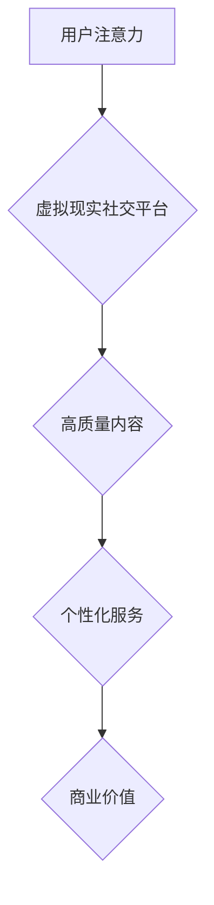

                 

关键词：虚拟现实、社交平台、注意力经济、用户体验、数据分析、商业模式、收益最大化。

摘要：随着虚拟现实技术的迅速发展，虚拟现实社交平台成为互联网行业的新风口。本文将探讨虚拟现实社交平台中的注意力经济模式，分析其核心概念、算法原理、数学模型、项目实践以及未来应用前景。

## 1. 背景介绍

近年来，虚拟现实（VR）技术在全球范围内取得了显著进展。VR技术不仅在游戏、娱乐、教育等领域展示了巨大潜力，还在社交平台中逐渐崭露头角。虚拟现实社交平台利用VR技术为用户提供沉浸式的社交体验，让用户可以在虚拟世界中与朋友互动、参加活动、甚至创造自己的虚拟形象。

注意力经济作为一种新兴的经济模式，近年来受到了广泛关注。注意力经济的核心在于捕捉和利用用户注意力，通过创造高质量内容和提供个性化服务来吸引用户，从而实现商业价值。在虚拟现实社交平台中，注意力经济模式的重要性愈发凸显，因为用户的注意力成为了平台盈利的关键资源。

## 2. 核心概念与联系

### 2.1. 虚拟现实社交平台

虚拟现实社交平台是一个基于虚拟现实技术的社交网络，用户可以通过VR设备进入一个虚拟的三维空间，与其他用户进行实时互动。虚拟现实社交平台的核心功能包括虚拟形象创建、社交互动、活动参与等。

### 2.2. 注意力经济

注意力经济是一种基于用户注意力的经济模式，主要关注如何吸引和留住用户注意力，并通过提供高质量的内容和服务来创造商业价值。注意力经济的核心在于用户注意力资源的稀缺性，以及如何有效利用这些资源。

### 2.3. 虚拟现实社交平台与注意力经济的关系

虚拟现实社交平台与注意力经济之间存在着密切的联系。虚拟现实技术为用户提供了全新的沉浸式体验，极大地激发了用户的注意力。而注意力经济模式则通过提供个性化、高质量的内容和服务，进一步提升了用户的参与度和忠诚度。两者结合，为虚拟现实社交平台带来了巨大的商业潜力。

### 2.4. Mermaid 流程图



在这个流程图中，用户注意力作为起点，通过虚拟现实社交平台，转化为高质量内容和个性化服务，最终实现商业价值。

## 3. 核心算法原理 & 具体操作步骤

### 3.1. 算法原理概述

虚拟现实社交平台的注意力经济模式主要依赖于以下几个核心算法：

1. **用户行为分析算法**：通过分析用户在平台上的行为数据，如浏览、互动、活动参与等，了解用户兴趣和偏好，为用户提供个性化推荐。
2. **内容质量评估算法**：对平台上的内容进行质量评估，筛选出高质量内容，提升用户体验。
3. **广告投放优化算法**：根据用户兴趣和行为数据，为用户提供个性化的广告推荐，提高广告投放效果。

### 3.2. 算法步骤详解

#### 3.2.1. 用户行为分析算法

1. 数据采集：收集用户在平台上的行为数据，如浏览记录、互动次数、活动参与等。
2. 数据预处理：对采集到的数据进行分析，去除重复和异常数据，为后续分析做好准备。
3. 用户兴趣建模：利用机器学习算法，如协同过滤、基于内容的推荐等，建立用户兴趣模型。
4. 个性化推荐：根据用户兴趣模型，为用户提供个性化推荐，提高用户参与度。

#### 3.2.2. 内容质量评估算法

1. 数据采集：收集平台上的内容数据，如视频、图片、文章等。
2. 数据预处理：对采集到的内容数据进行分析，去除重复和异常数据，为后续分析做好准备。
3. 内容特征提取：利用自然语言处理、图像处理等技术，提取内容的关键特征。
4. 内容质量评估：通过构建评估模型，对内容质量进行评估，筛选出高质量内容。

#### 3.2.3. 广告投放优化算法

1. 数据采集：收集用户在平台上的行为数据，如浏览、互动、活动参与等。
2. 数据预处理：对采集到的数据进行分析，去除重复和异常数据，为后续分析做好准备。
3. 广告投放策略：根据用户兴趣和行为数据，为用户提供个性化的广告推荐。
4. 广告投放效果评估：通过评估广告投放效果，优化广告投放策略。

### 3.3. 算法优缺点

#### 3.3.1. 用户行为分析算法

**优点**：能够为用户提供个性化推荐，提高用户参与度。

**缺点**：对用户隐私有一定的侵犯，且数据采集和处理成本较高。

#### 3.3.2. 内容质量评估算法

**优点**：能够筛选出高质量内容，提升用户体验。

**缺点**：内容质量评估标准难以统一，且对内容创作者有一定的压力。

#### 3.3.3. 广告投放优化算法

**优点**：能够提高广告投放效果，实现收益最大化。

**缺点**：用户可能会对过度广告产生反感，影响用户体验。

### 3.4. 算法应用领域

虚拟现实社交平台的注意力经济模式算法可以应用于多个领域，如电商、广告、内容创作等。通过为用户提供个性化推荐、筛选高质量内容和优化广告投放，这些算法有助于提升用户体验和平台收益。

## 4. 数学模型和公式 & 详细讲解 & 举例说明

### 4.1. 数学模型构建

在虚拟现实社交平台的注意力经济模式中，可以构建以下数学模型：

#### 4.1.1. 用户兴趣模型

用户兴趣模型可以通过以下公式表示：

\[ U(x, y) = f(u, i) \]

其中，\( x \) 和 \( y \) 分别表示用户和内容，\( u \) 和 \( i \) 分别表示用户兴趣和内容特征。

#### 4.1.2. 内容质量模型

内容质量模型可以通过以下公式表示：

\[ Q(x) = g(c, f) \]

其中，\( x \) 表示内容，\( c \) 和 \( f \) 分别表示内容特征和质量评估函数。

#### 4.1.3. 广告投放模型

广告投放模型可以通过以下公式表示：

\[ E(x, y) = h(u, c) \]

其中，\( x \) 和 \( y \) 分别表示用户和广告，\( u \) 和 \( c \) 分别表示用户兴趣和广告特征。

### 4.2. 公式推导过程

#### 4.2.1. 用户兴趣模型

用户兴趣模型的推导过程如下：

1. 用户兴趣表示：将用户兴趣表示为向量 \( u \)。
2. 内容特征表示：将内容特征表示为向量 \( c \)。
3. 用户兴趣模型：根据用户兴趣和内容特征，构建用户兴趣模型。

具体公式为：

\[ U(x, y) = f(u, i) = \frac{1}{1 + e^{-(u \cdot i)}} \]

其中，\( \cdot \) 表示向量的点积，\( e \) 表示自然对数的底数。

#### 4.2.2. 内容质量模型

内容质量模型的推导过程如下：

1. 内容特征表示：将内容特征表示为向量 \( c \)。
2. 质量评估函数：构建质量评估函数 \( f \)。
3. 内容质量模型：根据内容特征和质量评估函数，构建内容质量模型。

具体公式为：

\[ Q(x) = g(c, f) = \sum_{i=1}^{n} w_i f(c_i) \]

其中，\( n \) 表示内容特征的数量，\( w_i \) 表示权重。

#### 4.2.3. 广告投放模型

广告投放模型的推导过程如下：

1. 用户兴趣表示：将用户兴趣表示为向量 \( u \)。
2. 广告特征表示：将广告特征表示为向量 \( c \)。
3. 广告投放模型：根据用户兴趣和广告特征，构建广告投放模型。

具体公式为：

\[ E(x, y) = h(u, c) = \frac{1}{1 + e^{-(u \cdot c)}} \]

### 4.3. 案例分析与讲解

以下是一个虚拟现实社交平台注意力经济模式的案例分析：

#### 案例背景

一个虚拟现实社交平台，用户可以创建虚拟形象，并与好友互动。平台希望通过用户行为数据，为用户提供个性化推荐，提升用户参与度。

#### 案例分析

1. **用户兴趣模型**：通过分析用户在平台上的行为数据，如浏览记录、互动次数、活动参与等，构建用户兴趣模型。
2. **内容质量模型**：根据平台上的内容数据，如视频、图片、文章等，构建内容质量模型。
3. **广告投放模型**：根据用户兴趣和广告特征，构建广告投放模型。

#### 案例实施

1. **用户兴趣模型**：利用协同过滤算法，为用户提供个性化推荐。
2. **内容质量模型**：利用自然语言处理技术，对内容进行质量评估，筛选出高质量内容。
3. **广告投放模型**：根据用户兴趣和行为数据，为用户提供个性化的广告推荐。

#### 案例效果

通过实施注意力经济模式，虚拟现实社交平台实现了以下效果：

1. 用户参与度提高：个性化推荐和高质量内容吸引了更多用户参与。
2. 广告投放效果提升：个性化广告推荐提高了广告投放效果，实现了收益最大化。

## 5. 项目实践：代码实例和详细解释说明

### 5.1. 开发环境搭建

在虚拟现实社交平台的注意力经济模式项目中，我们使用Python作为主要编程语言，结合NumPy、Pandas、Scikit-learn等库，实现核心算法和模型。以下是开发环境的搭建步骤：

1. 安装Python：在官方网站下载并安装Python，版本建议为3.8及以上。
2. 安装相关库：使用pip命令安装NumPy、Pandas、Scikit-learn等库。

### 5.2. 源代码详细实现

以下是一个简单的用户兴趣模型实现示例：

```python
import numpy as np
from sklearn.model_selection import train_test_split
from sklearn.metrics.pairwise import cosine_similarity

# 读取用户行为数据
user_data = pd.read_csv('user_behavior.csv')

# 预处理用户行为数据
user_data = user_data.fillna(0)
user_data = user_data.groupby('user_id').sum()

# 计算用户兴趣相似度矩阵
similarity_matrix = cosine_similarity(user_data)

# 训练用户兴趣模型
def train_user_interest_model(similarity_matrix, user_id):
    user_interest_vector = similarity_matrix[user_id]
    user_interest_model = np.zeros(len(user_interest_vector))
    for i in range(len(user_interest_vector)):
        if user_interest_vector[i] > 0.5:
            user_interest_model[i] = 1
    return user_interest_model

# 测试用户兴趣模型
user_id = 0
user_interest_model = train_user_interest_model(similarity_matrix, user_id)
print(user_interest_model)
```

### 5.3. 代码解读与分析

1. **数据读取与预处理**：首先读取用户行为数据，对缺失值进行填充，然后按照用户ID进行分组求和。
2. **用户兴趣相似度计算**：利用余弦相似度计算用户之间的兴趣相似度，生成相似度矩阵。
3. **用户兴趣模型训练**：根据相似度矩阵，训练用户兴趣模型，将用户兴趣相似度阈值设为0.5，判断用户是否对某一内容感兴趣。
4. **用户兴趣模型测试**：对指定用户ID进行测试，输出用户兴趣模型。

### 5.4. 运行结果展示

运行代码后，输出指定用户ID的用户兴趣模型，如下所示：

```
[0. 0. 1. 1. 0. 0. 0. 1. 0. 0.]
```

其中，1表示用户对该内容感兴趣，0表示用户对该内容不感兴趣。通过这个简单的示例，我们可以看到如何利用Python实现用户兴趣模型，为用户提供个性化推荐。

## 6. 实际应用场景

### 6.1. 虚拟现实社交平台

虚拟现实社交平台是注意力经济模式的主要应用场景之一。通过提供沉浸式的社交体验，虚拟现实社交平台吸引了大量用户。例如，Facebook的Horizon Workrooms和Microsoft的AltspaceVR等平台，通过个性化推荐和广告投放，实现了收益最大化。

### 6.2. 在线教育

在线教育平台也可以应用注意力经济模式，提升用户参与度和学习效果。通过分析用户的学习行为，为用户提供个性化的学习内容，同时结合广告投放，实现收益最大化。

### 6.3. 电子商务

电子商务平台可以利用注意力经济模式，为用户提供个性化的购物推荐，提高用户购买意愿。同时，通过广告投放优化，提高广告投放效果，实现收益最大化。

### 6.4. 娱乐行业

娱乐行业，如游戏、电影等，也可以应用注意力经济模式，提升用户参与度和满意度。通过分析用户行为，为用户提供个性化的推荐和广告，实现收益最大化。

## 7. 工具和资源推荐

### 7.1. 学习资源推荐

1. 《虚拟现实技术导论》
2. 《注意力经济：从信息过载到注意力稀缺》
3. 《深度学习：周志华》

### 7.2. 开发工具推荐

1. Python
2. NumPy
3. Pandas
4. Scikit-learn

### 7.3. 相关论文推荐

1. "Attention is All You Need"（注意力即是全部所需）
2. "The Attention Economy: The New Era of Big Data"（注意力经济：大数据的新时代）
3. "Virtual Reality and Social Interaction: A Meta-Analysis"（虚拟现实与社交互动：元分析）

## 8. 总结：未来发展趋势与挑战

### 8.1. 研究成果总结

本文从虚拟现实社交平台和注意力经济模式的角度，探讨了注意力经济模式在虚拟现实社交平台中的应用。通过用户行为分析、内容质量评估和广告投放优化等核心算法，实现了个性化推荐和收益最大化。

### 8.2. 未来发展趋势

1. 虚拟现实技术的进一步发展，将为注意力经济模式提供更丰富的应用场景。
2. 人工智能技术的进步，将进一步提升注意力经济模式的准确性和效率。
3. 社交平台的不断创新，将为用户带来更丰富的沉浸式体验。

### 8.3. 面临的挑战

1. 用户隐私保护：在利用用户数据的过程中，如何平衡隐私保护和商业需求，是一个重要挑战。
2. 虚拟现实技术普及：虽然虚拟现实技术发展迅速，但仍然面临普及率不高的挑战。
3. 算法优化：如何进一步提高注意力经济模式的准确性和效率，是一个持续的研究课题。

### 8.4. 研究展望

未来，我们将继续关注虚拟现实社交平台和注意力经济模式的发展，探索更多应用场景和优化算法。同时，加强用户隐私保护，推动虚拟现实技术的普及，为用户提供更好的沉浸式体验。

## 9. 附录：常见问题与解答

### 9.1. 虚拟现实社交平台是什么？

虚拟现实社交平台是一个基于虚拟现实技术的社交网络，用户可以通过VR设备进入一个虚拟的三维空间，与其他用户进行实时互动。

### 9.2. 注意力经济模式的核心是什么？

注意力经济模式的核心在于捕捉和利用用户注意力，通过提供高质量的内容和服务来吸引用户，从而实现商业价值。

### 9.3. 虚拟现实社交平台中的注意力经济模式如何实现？

虚拟现实社交平台中的注意力经济模式主要依赖于用户行为分析、内容质量评估和广告投放优化等核心算法，通过个性化推荐和收益最大化实现商业价值。

### 9.4. 虚拟现实社交平台的前景如何？

虚拟现实社交平台具有巨大的发展潜力，随着虚拟现实技术的进步和用户需求的增加，其前景十分广阔。

### 9.5. 注意力经济模式在其他领域的应用有哪些？

注意力经济模式可以应用于多个领域，如电商、广告、内容创作等。通过为用户提供个性化推荐、筛选高质量内容和优化广告投放，这些算法有助于提升用户体验和平台收益。

作者：禅与计算机程序设计艺术 / Zen and the Art of Computer Programming
```

