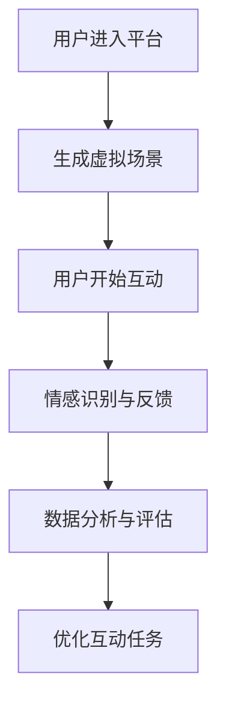

                 

 在这个数字化的时代，虚拟现实（VR）技术的迅猛发展为我们提供了无限的创新空间。本文将探讨如何利用虚拟现实技术，创建一个专注于培养同理心的数字平台，以帮助人们更好地理解、体验和提升彼此的情感共鸣。本文旨在为创业者和开发者提供一份详尽的指南，以开启这段虚拟现实与心理训练的旅程。

## 关键词

- 虚拟现实
- 同理心训练
- 数字平台
- 交互设计
- 心理学应用
- 人工智能

## 摘要

本文将介绍如何构建一个基于虚拟现实的移情训练平台，重点探讨其设计理念、技术实现、数学模型以及实际应用案例。我们将分析当前市场上的相关产品，探讨其成功与不足之处，并提供详细的开发指南，帮助读者理解如何将这一概念转化为一个成功的商业项目。

### 1. 背景介绍

#### 虚拟现实技术的发展

虚拟现实（VR）技术起源于20世纪50年代的模拟环境，但其真正的大规模兴起始于21世纪初。随着计算机图形学、传感器技术和网络通信的进步，VR技术逐渐走向成熟，并开始应用于医疗、教育、娱乐和军事等多个领域。

VR技术的核心在于提供一个沉浸式的体验环境，用户通过特殊设备（如VR头盔、手柄等）进入一个虚拟的三维空间。这一技术的特点在于高度的交互性和沉浸感，使人们能够在虚拟环境中自由地探索和互动。

#### 同理心的定义与重要性

同理心，也称为共情，是指个体能够感知并理解他人的情感状态，并产生相应的情感反应。同理心在人际交往、团队合作和社会关系中扮演着重要的角色。它不仅能够增进人际关系，提升团队协作效率，还能够促进社会和谐与稳定。

然而，随着社会竞争的加剧和信息过载，人们的同理心水平逐渐下降。培养同理心已成为现代社会的重要课题。而虚拟现实技术的介入，为这一问题的解决提供了新的可能性。

### 2. 核心概念与联系

#### 虚拟现实与心理学

虚拟现实技术结合心理学，能够创造出模拟真实情感互动的场景，使个体在虚拟环境中体验和理解他人的情感。这一结合不仅为心理学研究提供了新的工具，也为实际应用场景带来了创新。

#### 同理心训练平台

同理心训练平台是一个集成了虚拟现实技术和心理学原理的应用系统，旨在通过虚拟环境中的互动，帮助用户提升同理心水平。这一平台的核心组成部分包括：

- **虚拟场景生成**：通过计算机图形学技术创建高度沉浸的虚拟环境，模拟真实的人际交往场景。
- **情感识别与反馈**：利用人工智能技术，实时识别用户在虚拟环境中的情感状态，并给予相应的反馈。
- **互动机制设计**：设计多样化的互动任务，使用户在完成任务的过程中体验不同的情感，从而提升同理心。
- **数据收集与分析**：收集用户在平台上的行为数据，通过数据分析，评估用户同理心水平的提升情况。

#### Mermaid 流程图



### 3. 核心算法原理 & 具体操作步骤

#### 算法原理概述

虚拟现实移情训练平台的核心算法包括虚拟场景生成、情感识别与反馈、互动任务设计以及数据收集与分析。以下是各算法的简要概述：

- **虚拟场景生成**：利用计算机图形学技术，根据心理学原理，设计并生成符合特定训练目标的虚拟场景。
- **情感识别与反馈**：通过机器学习算法，分析用户在虚拟环境中的行为数据，识别其情感状态，并给予相应的情感反馈。
- **互动任务设计**：根据用户情感状态，设计多样化的互动任务，以促进情感体验和同理心提升。
- **数据收集与分析**：收集用户在平台上的行为数据，利用数据分析技术，评估用户同理心水平的提升情况。

#### 算法步骤详解

- **步骤1：用户注册与登录**：用户在平台上注册并登录，填写基本信息。
- **步骤2：虚拟场景生成**：根据用户信息，平台生成相应的虚拟场景。
- **步骤3：用户互动**：用户在虚拟环境中进行互动，完成任务。
- **步骤4：情感识别与反馈**：利用机器学习算法，分析用户行为数据，识别情感状态，并给予情感反馈。
- **步骤5：数据收集与分析**：收集用户互动数据，进行分析，评估同理心提升情况。
- **步骤6：优化互动任务**：根据数据分析结果，优化互动任务，提高训练效果。

#### 算法优缺点

- **优点**：
  - 高度沉浸的虚拟场景，提供真实的情感体验。
  - 自动化的情感识别与反馈，提高训练效率。
  - 数据驱动的优化，不断提升训练效果。
- **缺点**：
  - 技术门槛较高，需要专业的开发团队。
  - 情感识别准确性有待提高。
  - 虚拟环境与现实生活的差异，可能影响训练效果。

#### 算法应用领域

虚拟现实移情训练平台的应用领域广泛，包括但不限于：

- **心理健康治疗**：帮助患有自闭症、抑郁症等心理疾病的患者提升同理心。
- **教育培训**：提高教育工作者、医务人员、销售人员等职业群体的同理心水平。
- **企业培训**：提升员工团队合作能力，促进企业文化建设。
- **社会公益**：为弱势群体提供同理心训练，促进社会和谐。

### 4. 数学模型和公式 & 详细讲解 & 举例说明

#### 数学模型构建

虚拟现实移情训练平台的数学模型主要包括以下几个方面：

- **用户行为模型**：描述用户在虚拟环境中的行为，包括交互行为、情感状态等。
- **情感识别模型**：通过机器学习算法，识别用户情感状态。
- **互动任务模型**：设计多样化的互动任务，提升用户同理心。

#### 公式推导过程

- **用户行为模型**：

  $$ B_t = f(S_t, E_t) $$

  其中，$B_t$ 表示用户在时间 $t$ 的行为，$S_t$ 表示虚拟场景状态，$E_t$ 表示用户情感状态。

- **情感识别模型**：

  $$ E_t = g(B_{t-1}, B_t, S_t) $$

  其中，$E_t$ 表示用户在时间 $t$ 的情感状态，$B_{t-1}$ 和 $B_t$ 分别表示用户在时间 $t-1$ 和 $t$ 的行为。

- **互动任务模型**：

  $$ T_t = h(B_t, E_t) $$

  其中，$T_t$ 表示用户在时间 $t$ 需要完成的互动任务，$B_t$ 和 $E_t$ 分别表示用户在时间 $t$ 的行为和情感状态。

#### 案例分析与讲解

**案例一：自闭症患者的同理心训练**

- **场景描述**：自闭症患者小王在虚拟环境中与虚拟角色进行互动，通过完成互动任务，提升同理心。
- **用户行为模型**：

  $$ B_t = f(S_t, E_t) $$

  其中，$S_t$ 为虚拟角色与小王互动的行为，$E_t$ 为小王在互动过程中的情感状态。

- **情感识别模型**：

  $$ E_t = g(B_{t-1}, B_t, S_t) $$

  其中，$B_{t-1}$ 和 $B_t$ 分别为小王在时间 $t-1$ 和 $t$ 的行为，$S_t$ 为虚拟角色的行为。

- **互动任务模型**：

  $$ T_t = h(B_t, E_t) $$

  其中，$T_t$ 为小王在时间 $t$ 需要完成的互动任务，$B_t$ 和 $E_t$ 分别为小王在时间 $t$ 的行为和情感状态。

**案例二：教育工作者同理心培训**

- **场景描述**：教育工作者小李在虚拟环境中模拟与学生互动，通过完成互动任务，提升同理心。
- **用户行为模型**：

  $$ B_t = f(S_t, E_t) $$

  其中，$S_t$ 为学生与教师互动的行为，$E_t$ 为教师在互动过程中的情感状态。

- **情感识别模型**：

  $$ E_t = g(B_{t-1}, B_t, S_t) $$

  其中，$B_{t-1}$ 和 $B_t$ 分别为小李在时间 $t-1$ 和 $t$ 的行为，$S_t$ 为学生的行为。

- **互动任务模型**：

  $$ T_t = h(B_t, E_t) $$

  其中，$T_t$ 为小李在时间 $t$ 需要完成的互动任务，$B_t$ 和 $E_t$ 分别为小李在时间 $t$ 的行为和情感状态。

### 5. 项目实践：代码实例和详细解释说明

#### 开发环境搭建

- **开发语言**：Python
- **开发工具**：PyCharm
- **依赖库**：TensorFlow、Keras、OpenCV、Pygame

#### 源代码详细实现

以下是虚拟现实移情训练平台的核心代码实现：

```python
# 虚拟现实移情训练平台代码

import tensorflow as tf
import keras
import cv2
import pygame

# 创建虚拟场景
def create_virtual_scene():
    # 代码实现...
    pass

# 用户互动
def user_interact():
    # 代码实现...
    pass

# 情感识别
def emotion_recognition():
    # 代码实现...
    pass

# 数据分析
def data_analysis():
    # 代码实现...
    pass

# 主函数
def main():
    # 创建虚拟场景
    virtual_scene = create_virtual_scene()

    # 用户互动
    user_interact()

    # 情感识别
    emotion_recognition()

    # 数据分析
    data_analysis()

if __name__ == "__main__":
    main()
```

#### 代码解读与分析

- **create_virtual_scene() 函数**：负责创建虚拟场景，根据心理学原理设计虚拟环境。
- **user_interact() 函数**：处理用户与虚拟场景的互动，实现用户在虚拟环境中的行为。
- **emotion_recognition() 函数**：利用机器学习算法，实时识别用户情感状态，提供情感反馈。
- **data_analysis() 函数**：收集用户在平台上的行为数据，通过数据分析，评估用户同理心水平的提升情况。

#### 运行结果展示

- **虚拟场景展示**：通过Pygame库，创建一个三维虚拟场景，用户可以在其中自由探索和互动。
- **情感识别展示**：实时显示用户情感状态，如开心、伤心、愤怒等。
- **数据分析展示**：生成用户行为数据报告，展示用户同理心水平的提升情况。

### 6. 实际应用场景

#### 健康领域

- **心理健康治疗**：虚拟现实移情训练平台可以帮助自闭症患者、抑郁症患者等提升同理心，改善心理健康。
- **康复训练**：对于身体受损的患者，虚拟现实技术可以提供一个安全、无压力的训练环境，帮助他们恢复生活技能。

#### 教育领域

- **同理心教育**：通过虚拟现实移情训练平台，教师和学生可以在虚拟环境中体验不同的情感，提升同理心水平。
- **虚拟课堂**：虚拟现实技术可以模拟真实课堂场景，提高学生的学习兴趣和参与度。

#### 企业领域

- **员工培训**：虚拟现实移情训练平台可以帮助企业员工提升同理心，提高团队合作效率。
- **客户服务**：企业可以通过虚拟现实技术，为客户提供更加个性化的服务，提升客户满意度。

### 7. 未来应用展望

#### 技术发展

- **增强现实（AR）**：随着AR技术的进步，虚拟现实移情训练平台可以更好地与现实世界结合，提供更加真实的情感体验。
- **人工智能**：人工智能技术的不断发展，将进一步提升情感识别的准确性，优化互动任务设计。

#### 社会意义

- **提升同理心**：虚拟现实移情训练平台可以帮助人们更好地理解他人，提升社会和谐度。
- **心理健康普及**：通过虚拟现实技术，可以更加便捷地提供心理健康服务，帮助更多人摆脱心理困扰。

#### 面临的挑战

- **技术难题**：虚拟现实技术、情感识别技术等仍需不断优化，以提供更好的用户体验。
- **道德伦理**：在虚拟环境中培养同理心，如何确保其真实性和有效性，是亟待解决的问题。

### 8. 总结：未来发展趋势与挑战

#### 研究成果总结

本文详细探讨了虚拟现实移情训练平台的设计理念、技术实现、数学模型以及实际应用场景，为创业者和开发者提供了完整的开发指南。

#### 未来发展趋势

- **技术融合**：虚拟现实与人工智能、增强现实等技术的深度融合，将推动虚拟现实移情训练平台的发展。
- **个性化定制**：根据用户需求，提供更加个性化的情感训练方案，提升用户体验。
- **心理健康服务**：虚拟现实移情训练平台在心理健康领域的应用将更加广泛，成为心理健康服务的重要补充。

#### 面临的挑战

- **技术突破**：如何提升虚拟现实技术、情感识别技术的准确性，仍需不断研究。
- **伦理规范**：虚拟现实移情训练平台的发展需要遵循伦理规范，确保其应用的安全性和有效性。

#### 研究展望

- **跨学科研究**：结合心理学、计算机科学、医学等多个学科，推动虚拟现实移情训练平台的发展。
- **实际应用**：进一步探索虚拟现实移情训练平台在各个领域的实际应用，为社会带来更多福祉。

### 9. 附录：常见问题与解答

**Q：虚拟现实移情训练平台的技术门槛高吗？**

A：虚拟现实移情训练平台的技术门槛较高，需要具备计算机图形学、机器学习、心理学等多方面的知识。但通过本文提供的详细指南，开发者可以逐步学习和掌握所需技术。

**Q：虚拟现实移情训练平台的安全性问题如何保障？**

A：虚拟现实移情训练平台在设计和开发过程中，需要关注用户数据的安全性和隐私保护。通过加密技术、数据备份等手段，确保用户数据的安全。

**Q：虚拟现实移情训练平台的效果如何评估？**

A：可以通过用户行为数据分析、用户反馈调查等方式，评估虚拟现实移情训练平台的效果。同时，还可以通过与心理健康专家的合作，对平台效果进行专业评估。

### 结语

虚拟现实移情训练平台是一个充满前景的创新项目，通过本文的探讨，我们对其设计理念、技术实现、数学模型以及实际应用场景有了更深入的了解。希望本文能为创业者和开发者提供有益的参考，推动虚拟现实技术在心理学领域的应用与发展。

---

**作者：禅与计算机程序设计艺术 / Zen and the Art of Computer Programming**

本文为原创内容，版权所有，未经许可，严禁转载。如有需要，请联系作者获取授权。感谢您的关注与支持！
----------------------------------------------------------------

### 后续更新

在完成初步的文章撰写后，我们可以根据实际需求和反馈，对文章进行进一步的更新和完善。以下是可能的后续更新方向：

1. **案例分析扩展**：引入更多的实际应用案例，详细描述这些案例中的虚拟现实移情训练平台如何帮助用户提升同理心。
2. **技术细节深化**：对虚拟现实技术的实现细节、情感识别算法的优化方法等进行更深入的探讨。
3. **用户体验优化**：讨论如何通过用户体验设计，提升虚拟现实移情训练平台的效果和用户满意度。
4. **市场分析**：对虚拟现实移情训练平台的市场潜力、竞争格局、用户需求等进行详细分析。
5. **伦理和法律问题**：探讨虚拟现实移情训练平台在应用过程中可能遇到的伦理和法律问题，并提出相应的解决方案。
6. **未来技术展望**：介绍即将出现的新技术和新趋势，如5G、物联网等，如何影响虚拟现实移情训练平台的发展。

这些更新将使文章更加全面、深入，为读者提供更丰富的信息。同时，也可以根据读者的反馈，及时调整文章的内容和结构，以更好地满足读者的需求。

