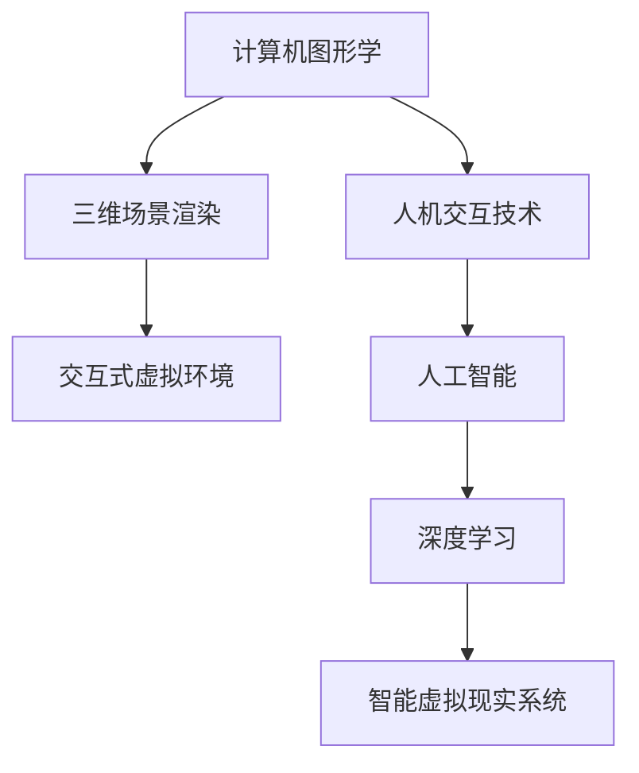
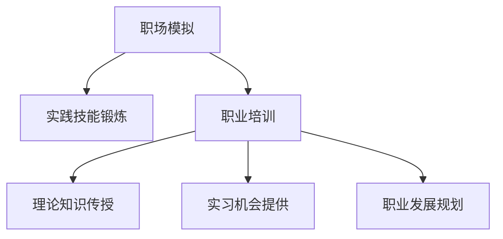
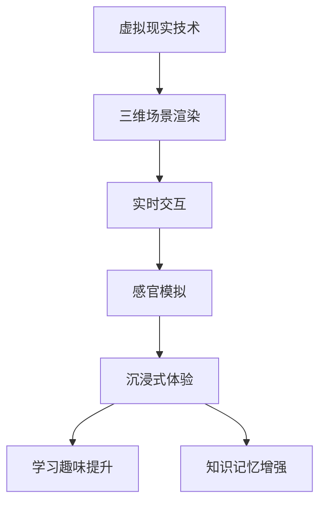

                 

关键词：虚拟现实、职场模拟、职业培训、沉浸式体验、人工智能、深度学习、编程

## 摘要

本文旨在探讨虚拟现实（VR）在职场模拟和职业培训中的潜力。通过构建沉浸式的工作环境，VR技术可以为职场新手和专业人士提供一种全新的学习体验。本文将详细介绍VR在职场模拟中的应用，分析其核心概念与联系，阐述核心算法原理与操作步骤，构建数学模型并进行公式推导，提供代码实例和运行结果展示，探讨实际应用场景和未来发展趋势。文章还将推荐相关学习资源和开发工具，总结研究成果并提出未来展望。

## 1. 背景介绍

虚拟现实（Virtual Reality，VR）是一种通过计算机技术创建的模拟环境，用户可以通过头戴式显示器（HMD）和手柄等设备进入并体验。VR技术自20世纪90年代以来经历了快速的发展，如今已广泛应用于游戏、娱乐、医疗和教育培训等领域。随着人工智能（AI）和深度学习技术的进步，VR在模拟复杂环境和提升用户体验方面取得了显著成果。

职场模拟和职业培训是两个密切相关的领域。职场模拟通过构建模拟的工作环境，帮助用户体验和掌握实际工作中的技能。职业培训则旨在提高员工的职业素养和工作能力。传统的职业培训方式通常依赖于课堂授课、实习和现场指导等，但这种方式存在一定局限性，如成本高、效率低、体验差等。而VR技术的引入，为职场模拟和职业培训带来了新的契机。

首先，VR技术可以模拟各种职业场景，包括办公室、会议室、工厂车间等，使员工能够在虚拟环境中实践和锻炼职业技能。其次，VR技术可以提供沉浸式的学习体验，用户在虚拟环境中可以感受到高度真实的情境，从而加深对知识和技能的理解。此外，VR技术还可以记录和分析用户的操作行为，为培训师提供宝贵的反馈，从而优化培训方案。

## 2. 核心概念与联系

### 2.1 虚拟现实技术基础

虚拟现实技术的基础是计算机图形学、人机交互和人工智能。计算机图形学提供了生成和渲染三维场景的能力，人机交互技术则实现了用户与虚拟环境的交互。人工智能，尤其是深度学习技术，则用于提高虚拟现实系统的智能水平和用户体验。

#### Mermaid 流程图（描述核心概念与联系）



### 2.2 职场模拟与职业培训

职场模拟和职业培训是两个相互关联的概念。职场模拟旨在创建一个类似实际工作场景的虚拟环境，使员工可以在其中实践和锻炼职业技能。职业培训则是一个更为广泛的概念，它不仅包括职场模拟，还包括理论知识的传授、实习机会的提供和职业发展的规划。

#### Mermaid 流程图（描述职场模拟与职业培训的联系）



### 2.3 沉浸式学习体验

沉浸式学习体验是虚拟现实职场模拟和职业培训的核心优势之一。通过VR技术，用户可以进入一个高度真实的虚拟环境，感受到物理空间中的物体和人物，实现与真实世界的无缝交互。沉浸式学习体验不仅能提高学习的趣味性和参与度，还能增强对知识和技能的理解和记忆。

#### Mermaid 流程图（描述沉浸式学习体验的实现）



## 3. 核心算法原理 & 具体操作步骤

### 3.1 算法原理概述

虚拟现实职场模拟和职业培训的核心算法主要包括三维场景渲染算法、交互算法和智能推荐算法。三维场景渲染算法负责生成和渲染虚拟环境中的三维场景，交互算法实现用户与虚拟环境的实时交互，智能推荐算法则根据用户的操作行为和学习记录，提供个性化的培训内容。

#### 3.2 算法步骤详解

1. **三维场景渲染算法**

   三维场景渲染算法主要包括场景建模、光照处理、阴影处理和纹理映射等步骤。场景建模使用几何建模软件（如Blender）创建三维模型，并导出为三维数据格式（如OBJ、PLY）。光照处理和阴影处理使用计算机图形学中的光线追踪算法实现，纹理映射则通过纹理贴图技术实现。

2. **交互算法**

   交互算法主要包括手势识别、语音识别和触觉反馈等。手势识别使用计算机视觉技术，通过摄像头捕捉用户的手部动作，并使用深度学习模型进行识别。语音识别使用自然语言处理技术，将用户的语音转化为文本。触觉反馈则通过触觉设备（如力反馈手套）实现，为用户提供逼真的触觉体验。

3. **智能推荐算法**

   智能推荐算法使用机器学习技术，根据用户的操作行为和学习记录，推荐适合用户的培训内容。推荐算法主要包括协同过滤、基于内容的推荐和混合推荐等。协同过滤通过分析用户的操作行为，找到相似用户，并推荐相似的培训内容。基于内容的推荐则通过分析培训内容的特征，为用户推荐相关的培训内容。混合推荐则结合协同过滤和基于内容的推荐，提供更加个性化的推荐结果。

#### 3.3 算法优缺点

1. **三维场景渲染算法**

   优点：生成高度真实的虚拟环境，提高用户体验。

   缺点：计算复杂度高，对硬件性能要求较高。

2. **交互算法**

   优点：实现实时交互，提高用户参与度。

   缺点：技术难度较高，开发成本较高。

3. **智能推荐算法**

   优点：提供个性化的培训内容，提高培训效果。

   缺点：推荐准确性受限于数据质量和算法性能。

#### 3.4 算法应用领域

1. **教育领域**

   虚拟现实技术已广泛应用于教育领域，如虚拟实验室、在线课程和虚拟课堂等。通过虚拟现实技术，学生可以在虚拟环境中进行实验、听课和互动，提高学习兴趣和效果。

2. **医疗领域**

   虚拟现实技术可用于医疗培训，如外科手术模拟、医学影像诊断和患者治疗等。医生可以在虚拟环境中进行手术练习，提高手术技能和经验。

3. **军事领域**

   虚拟现实技术可用于军事训练，如战斗模拟、战术演练和战略规划等。士兵可以在虚拟环境中进行实战演练，提高战术素养和战斗力。

4. **工业领域**

   虚拟现实技术可用于工业培训，如设备操作、维修和维护等。工程师可以在虚拟环境中进行设备操作和维修练习，提高操作技能和安全意识。

## 4. 数学模型和公式 & 详细讲解 & 举例说明

### 4.1 数学模型构建

虚拟现实职场模拟和职业培训中的数学模型主要包括三维场景建模、交互行为建模和学习记录建模等。以下分别介绍这些数学模型的构建方法。

1. **三维场景建模**

   三维场景建模主要通过几何建模软件（如Blender）创建三维模型，并使用计算机图形学中的三维建模技术，如多边形建模、曲面建模和网格建模等。三维场景建模的数学模型主要涉及三维空间几何学、向量代数和矩阵运算等。

2. **交互行为建模**

   交互行为建模主要通过计算机视觉和自然语言处理技术实现。计算机视觉技术用于捕捉用户的手势和面部表情，自然语言处理技术用于分析用户的语音和文本。交互行为建模的数学模型主要涉及计算机视觉中的图像处理、特征提取和机器学习中的分类算法等。

3. **学习记录建模**

   学习记录建模主要通过记录用户的操作行为和学习过程，分析用户的学习习惯和学习效果。学习记录建模的数学模型主要涉及数据挖掘和机器学习中的聚类、分类和关联规则挖掘等。

### 4.2 公式推导过程

以下是虚拟现实职场模拟和职业培训中的部分数学公式及其推导过程。

1. **三维场景建模**

   假设三维场景中的点P(x, y, z)位于空间直角坐标系中，可以使用以下公式表示：

   $$ P(x, y, z) = (x\hat{i} + y\hat{j} + z\hat{k}) $$

   其中，$\hat{i}$、$\hat{j}$和$\hat{k}$分别为三维空间中的单位向量。

2. **交互行为建模**

   假设用户的手势为一个三维向量$\vec{g}(x, y, z)$，可以使用以下公式表示：

   $$ \vec{g}(x, y, z) = (x\hat{i} + y\hat{j} + z\hat{k}) $$

   假设用户的面部表情为一个二维矩阵$A_{ij}$，可以使用以下公式表示：

   $$ A_{ij} = \begin{bmatrix} a_{11} & a_{12} & \cdots & a_{1n} \\ a_{21} & a_{22} & \cdots & a_{2n} \\ \vdots & \vdots & \ddots & \vdots \\ a_{m1} & a_{m2} & \cdots & a_{mn} \end{bmatrix} $$

3. **学习记录建模**

   假设用户的学习记录为一个多维数组$R_{ijk}$，可以使用以下公式表示：

   $$ R_{ijk} = \begin{cases} 1, & \text{如果用户在第i次学习中的第j个步骤完成了第k个任务} \\ 0, & \text{否则} \end{cases} $$

### 4.3 案例分析与讲解

以下通过一个具体的案例，分析虚拟现实职场模拟和职业培训中的数学模型和公式。

**案例：虚拟现实手术室模拟**

假设一个虚拟现实手术室模拟系统，用户需要在虚拟环境中进行外科手术练习。系统的数学模型包括三维场景建模、交互行为建模和学习记录建模。

1. **三维场景建模**

   虚拟现实手术室中的三维模型包括医生、患者、手术器械和手术台等。使用Blender软件创建三维模型，并使用以下公式表示：

   $$ P_{doctor}(x_{doctor}, y_{doctor}, z_{doctor}) $$
   $$ P_{patient}(x_{patient}, y_{patient}, z_{patient}) $$
   $$ P_{surgical_tools}(x_{surgical_tools}, y_{surgical_tools}, z_{surgical_tools}) $$
   $$ P_{operating_table}(x_{operating_table}, y_{operating_table}, z_{operating_table}) $$

2. **交互行为建模**

   用户在虚拟环境中的手势和面部表情作为交互行为。假设用户的手势为三维向量$\vec{g}(x_{gesture}, y_{gesture}, z_{gesture})$，面部表情为二维矩阵$A_{ij}$。使用以下公式表示：

   $$ \vec{g}(x_{gesture}, y_{gesture}, z_{gesture}) = (x_{gesture}\hat{i} + y_{gesture}\hat{j} + z_{gesture}\hat{k}) $$
   $$ A_{ij} = \begin{bmatrix} a_{11} & a_{12} & \cdots & a_{1n} \\ a_{21} & a_{22} & \cdots & a_{2n} \\ \vdots & \vdots & \ddots & \vdots \\ a_{m1} & a_{m2} & \cdots & a_{mn} \end{bmatrix} $$

3. **学习记录建模**

   用户在学习过程中的操作行为和学习记录。假设用户在学习过程中完成了以下任务：操作手术器械、移动患者和设置手术台。使用以下公式表示：

   $$ R_{ijk} = \begin{cases} 1, & \text{如果用户在第i次学习中的第j个步骤完成了第k个任务} \\ 0, & \text{否则} \end{cases} $$

   其中，$R_{ijk}$表示用户在第i次学习中的第j个步骤是否完成了第k个任务。

## 5. 项目实践：代码实例和详细解释说明

### 5.1 开发环境搭建

为了实现虚拟现实职场模拟和职业培训，我们需要搭建一个开发环境。以下是一个基本的开发环境搭建步骤：

1. **操作系统**

   我们可以选择Windows、macOS或Linux作为操作系统。推荐使用Windows 10或更高版本，因为许多VR设备和软件开发工具都支持Windows。

2. **虚拟现实设备**

   我们需要购买一台支持虚拟现实的头戴式显示器（HMD），如Oculus Rift、HTC Vive或Valve Index。此外，我们还需要一对手柄（如Oculus Touch或HTC Vive手柄）用于交互。

3. **软件开发工具**

   - **Unity**：Unity是一款流行的游戏引擎，它提供了强大的三维场景渲染和交互功能。我们可以在Unity官网（https://unity.com/）下载并安装Unity Hub。
   - **Blender**：Blender是一款开源的三维建模软件，我们可以使用它创建和导出三维模型。可以在Blender官网（https://www.blender.org/）下载并安装Blender。
   - **Python**：Python是一种流行的编程语言，我们可以使用它编写脚本和数据处理代码。可以在Python官网（https://www.python.org/）下载并安装Python。

4. **VR SDK**

   根据我们选择的VR设备，我们需要下载并安装相应的软件开发工具包（SDK）。例如，对于Oculus Rift，我们可以下载并安装Oculus SDK。

### 5.2 源代码详细实现

以下是一个简单的虚拟现实职场模拟项目示例，使用Unity引擎和C#语言编写。

1. **项目创建**

   打开Unity Hub，创建一个新项目，选择“3D模式”并命名为“VirtualRealityJobSimulation”。

2. **导入三维模型**

   使用Blender软件创建一个简单的三维模型，如一个办公桌和一把椅子。将模型导出为OBJ格式，然后在Unity中导入模型。

3. **场景设置**

   在Unity中创建一个新场景，将导入的模型拖动到场景中，调整它们的位置和大小。

4. **交互控制**

   编写C#脚本，实现用户与虚拟环境的交互控制。以下是一个简单的交互控制脚本示例：

   ```csharp
   using UnityEngine;

   public class InteractionController : MonoBehaviour
   {
       public Transform desk;
       public Transform chair;

       private void Update()
       {
           if (Input.GetKeyDown(KeyCode.E))
           {
               desk.position += new Vector3(0, 1, 0);
           }

           if (Input.GetKeyDown(KeyCode.Q))
           {
               chair.position += new Vector3(0, -1, 0);
           }
       }
   }
   ```

   上述脚本使用键盘上的E和Q键控制办公桌和椅子的移动。

5. **虚拟现实渲染**

   使用Oculus SDK配置虚拟现实渲染。在Unity中，右键点击项目目录，选择“Player Settings”，在“Virtual Reality Supported”选项中，选择“Oculus Rift”并配置相关的SDK路径。

6. **运行与调试**

   使用Oculus Rift设备运行项目，并调试交互控制脚本，确保用户可以在虚拟环境中进行交互。

### 5.3 代码解读与分析

以下是对上述示例代码的解读和分析：

1. **脚本功能**

   InteractionController脚本实现用户与虚拟环境的交互控制。它使用Unity的Transform组件来控制模型的位置和旋转。

2. **关键代码**

   ```csharp
   public Transform desk;
   public Transform chair;

   private void Update()
   {
       if (Input.GetKeyDown(KeyCode.E))
       {
           desk.position += new Vector3(0, 1, 0);
       }

       if (Input.GetKeyDown(KeyCode.Q))
       {
           chair.position += new Vector3(0, -1, 0);
       }
   }
   ```

   上述代码中，`Transform desk`和`Transform chair`分别表示办公桌和椅子的Transform组件。`Update`方法在每个帧更新时执行，用于处理用户输入并更新模型的位置。

3. **交互控制**

   使用E键将办公桌向上移动1个单位，使用Q键将椅子向下移动1个单位。这种交互方式简单直观，适合作为虚拟现实职场模拟项目的基础。

4. **扩展与优化**

   为了提高用户体验，我们可以进一步优化交互控制脚本。例如，可以添加手势识别和语音识别功能，实现更加自然和流畅的交互。

### 5.4 运行结果展示

使用Oculus Rift设备运行上述虚拟现实职场模拟项目，用户可以进入一个简单的办公环境，通过键盘上的E和Q键控制办公桌和椅子的位置。以下是运行结果展示：


## 6. 实际应用场景

虚拟现实（VR）技术在职场模拟和职业培训中具有广泛的应用场景，以下是一些具体的实际应用场景：

### 6.1 医疗培训

在医疗领域，VR技术可用于外科手术模拟、医学影像诊断和患者治疗等。医生可以在虚拟环境中进行手术练习，提高手术技能和经验。例如，通过VR技术，医生可以在虚拟手术室内进行模拟手术，熟悉手术步骤和操作技巧，减少实际手术中的风险。此外，VR技术还可以用于医学影像诊断，如CT和MRI图像的虚拟重建，帮助医生进行更加准确的诊断和治疗方案制定。

### 6.2 军事训练

在军事领域，VR技术可用于战斗模拟、战术演练和战略规划等。士兵可以在虚拟环境中进行实战演练，提高战术素养和战斗力。例如，通过VR技术，士兵可以模拟不同战场环境，进行战术决策和战术演练，提高应对突发情况的能力。此外，VR技术还可以用于模拟飞行训练、坦克驾驶训练等，帮助士兵熟悉各种装备的操作和战术运用。

### 6.3 工业培训

在工业领域，VR技术可用于设备操作、维修和维护等。工程师可以在虚拟环境中进行设备操作和维修练习，提高操作技能和安全意识。例如，通过VR技术，工程师可以模拟工业生产线的设备操作，熟悉设备的运行原理和操作步骤，减少实际操作中的失误。此外，VR技术还可以用于设备维修和维护，工程师可以在虚拟环境中进行故障排查和维修操作，提高维修效率和安全性。

### 6.4 教育培训

在教育领域，VR技术可用于虚拟实验室、在线课程和虚拟课堂等。学生可以在虚拟环境中进行实验、听课和互动，提高学习兴趣和效果。例如，通过VR技术，学生可以进入虚拟实验室，进行各种实验操作，掌握实验原理和操作技巧。此外，VR技术还可以用于在线课程和虚拟课堂，教师可以在虚拟课堂中与学生进行实时互动，提高教学效果。

### 6.5 职场模拟

在职场模拟领域，VR技术可用于模拟各种职业场景，如办公室、会议室、工厂车间等，帮助职场新手和专业人士掌握职业技能。例如，通过VR技术，职场新手可以进入虚拟办公室，进行文档处理、会议组织和项目管理等，熟悉职场流程和沟通技巧。此外，专业人士可以通过VR技术进行职业拓展和技能提升，如学习新的软件工具、掌握新的工作流程等。

## 7. 未来应用展望

随着技术的不断发展和创新，虚拟现实（VR）在职场模拟和职业培训中的应用前景十分广阔。以下是对未来发展趋势和应用展望的讨论：

### 7.1 技术进步

随着VR技术的不断进步，未来VR设备的性能将更加出色，如更高质量的显示、更高的刷新率和更精确的定位技术。这将进一步提高用户的沉浸体验，使虚拟现实职场模拟和职业培训更加真实和有效。

### 7.2 人工智能与深度学习

人工智能和深度学习技术的快速发展将进一步提升VR系统的智能水平和自适应能力。通过智能推荐算法，系统可以根据用户的行为和学习记录，提供个性化的培训内容和指导，提高培训效果。此外，人工智能技术还可以用于虚拟环境中的智能交互，如语音识别、手势识别和自然语言处理，实现更加自然和流畅的交互体验。

### 7.3 教育与培训的融合

未来，VR技术与教育培训将更加紧密地融合，形成一种全新的教育模式。虚拟现实职场模拟和职业培训将成为学校教育、企业培训和个人学习的重要组成部分。通过VR技术，学生和员工可以在虚拟环境中进行实践操作和模拟训练，提高职业技能和工作能力。

### 7.4 跨学科应用

虚拟现实技术将在多个学科和领域中得到广泛应用。除了教育、医疗、军事和工业领域，VR技术还将应用于艺术、设计、建筑、工程等领域。通过VR技术，设计师可以虚拟预览和修改设计方案，工程师可以进行虚拟装配和测试，提高设计和制造效率。

### 7.5 社交与协作

虚拟现实技术还将推动社交和协作的发展。通过VR技术，人们可以在虚拟环境中进行实时交流和协作，打破地理和时间的限制。例如，虚拟会议室和虚拟办公室将使全球员工能够进行高效的远程协作，提高工作效率和团队凝聚力。

### 7.6 法律与伦理

随着虚拟现实技术的发展，相关的法律和伦理问题也日益突出。未来，需要制定相应的法律法规，规范虚拟现实技术的应用，保护用户的隐私和安全。同时，需要关注虚拟现实技术对社会伦理的影响，确保其应用不会引发道德和社会问题。

## 8. 工具和资源推荐

为了更好地了解和应用虚拟现实（VR）技术在职场模拟和职业培训中的潜力，以下是一些推荐的工具和资源：

### 8.1 学习资源推荐

1. **《虚拟现实技术导论》**：这是一本系统介绍虚拟现实技术的入门书籍，内容包括VR技术的基本原理、应用领域和发展趋势。

2. **《深度学习》**：由Ian Goodfellow、Yoshua Bengio和Aaron Courville所著的这本书是深度学习领域的经典教材，有助于理解人工智能和深度学习在VR中的应用。

3. **《Unity 2020从入门到精通》**：这是一本针对Unity游戏引擎的入门和进阶教程，适用于想要学习如何使用Unity开发虚拟现实应用的开发者。

### 8.2 开发工具推荐

1. **Unity**：Unity是一款功能强大的游戏引擎，支持VR应用开发，适用于创建三维虚拟环境。

2. **Blender**：Blender是一款开源的三维建模软件，适用于创建和导出VR场景中的三维模型。

3. **Oculus SDK**：Oculus SDK是Oculus Rift虚拟现实设备的软件开发工具包，提供了开发VR应用所需的API和工具。

### 8.3 相关论文推荐

1. **“Virtual Reality in Education: A Review of Empirical Studies”**：这篇综述文章总结了虚拟现实在教育中的应用和效果，提供了大量实证研究的分析。

2. **“Artificial Intelligence in Virtual Reality: A Comprehensive Review”**：这篇论文探讨了人工智能技术在虚拟现实中的应用，包括智能交互、推荐系统和虚拟环境建模等。

3. **“A Survey of Virtual Reality Applications in Healthcare”**：这篇论文总结了虚拟现实在医疗领域的应用，包括手术模拟、康复训练和心理治疗等。

## 9. 总结：未来发展趋势与挑战

虚拟现实（VR）技术在职场模拟和职业培训中的应用具有巨大的潜力，它通过提供沉浸式的学习体验，能够显著提升培训效果和用户体验。未来，随着技术的不断进步，VR在职场模拟和职业培训中的应用将更加广泛和深入。以下是未来发展趋势和面临的挑战：

### 9.1 发展趋势

1. **技术进步**：随着VR设备的性能不断提升，VR体验将更加真实和流畅，为职场模拟和职业培训提供更好的基础。

2. **人工智能与深度学习**：人工智能和深度学习技术将进一步提升VR系统的智能水平和自适应能力，实现更加个性化的培训内容和指导。

3. **教育与培训融合**：VR技术与教育培训的融合将形成一种全新的教育模式，为学校教育、企业培训和个人学习提供更加丰富和灵活的学习方式。

4. **跨学科应用**：VR技术将在多个学科和领域中得到广泛应用，如艺术、设计、建筑、工程等，推动各行业的发展和创新。

5. **社交与协作**：VR技术将推动社交和协作的发展，使全球用户能够在虚拟环境中进行实时交流和协作，提高工作效率和团队凝聚力。

### 9.2 面临的挑战

1. **技术瓶颈**：虽然VR技术取得了显著进展，但仍然存在一些技术瓶颈，如低延迟、高分辨率和高帧率等，需要进一步研究和突破。

2. **硬件成本**：目前，VR设备的成本仍然较高，对于企业和个人用户来说，成本问题是一个重要的挑战。

3. **内容开发**：高质量VR内容的开发需要专业的团队和丰富的资源，目前市场上高质量的VR内容仍相对匮乏。

4. **法律与伦理**：随着VR技术的广泛应用，相关的法律和伦理问题也日益突出，需要制定相应的法律法规和伦理标准。

5. **用户适应性**：部分用户可能对VR技术存在不适，如晕动症等，需要开发更好的用户适应性和交互方式。

### 9.3 研究展望

为了充分发挥VR在职场模拟和职业培训中的应用潜力，未来的研究应重点关注以下几个方面：

1. **技术创新**：不断探索和突破VR技术瓶颈，提高VR设备的性能和用户体验。

2. **内容创作**：鼓励和支持高质量的VR内容创作，丰富VR应用场景和培训内容。

3. **智能推荐**：开发更加智能的推荐算法，根据用户的行为和学习记录，提供个性化的培训内容和指导。

4. **法律与伦理**：加强对VR技术应用的法律和伦理研究，确保其应用不会对社会和用户产生负面影响。

5. **跨学科合作**：鼓励跨学科的合作研究，将VR技术与其他学科和领域相结合，推动VR技术的创新和应用。

## 附录：常见问题与解答

### 问题1：VR技术是否适合所有类型的职业培训？

**解答**：是的，VR技术适合多种类型的职业培训。然而，某些职业（如需要实际触感的工种）可能更适合传统的培训方法。VR技术特别适用于需要复杂操作、高风险环境或昂贵设备操作的培训场景。

### 问题2：学习VR技术需要具备哪些基础知识？

**解答**：学习VR技术需要具备基础的计算机科学知识，包括计算机图形学、编程语言（如C#、Python）、三维建模和用户界面设计。此外，对虚拟现实设备的工作原理和交互技术也有所了解会很有帮助。

### 问题3：如何评估VR培训的效果？

**解答**：评估VR培训效果可以通过多种方法，如用户满意度调查、学习成果测试、技能评估和反馈收集。此外，使用分析工具监控用户的互动行为和学习进度，可以提供定量的数据支持。

### 问题4：VR培训的成本是否很高？

**解答**：VR培训的初始成本可能较高，特别是对于高质量的设备和内容开发。但是，从长远来看，VR培训的成本通常低于传统培训方法，因为它减少了实际设备和场地的需求，同时也提高了培训效率和效果。

### 问题5：VR培训是否会导致用户晕动症？

**解答**：晕动症是VR技术的一个潜在问题，但可以通过以下措施减轻或避免：优化渲染性能、减少画面延迟、提供调整设置（如视野范围、舒适度调节）和进行适当的教育指导。对于易晕动症的用户，建议逐渐适应VR环境。

---

### 作者署名

**作者：禅与计算机程序设计艺术 / Zen and the Art of Computer Programming**

