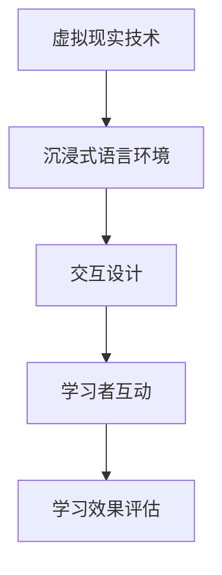

                 

关键词：虚拟现实，语言学习，沉浸式环境，创业，技术架构，算法原理，数学模型，代码实例，应用场景，资源推荐，未来展望

> 摘要：本文将探讨虚拟现实（VR）技术在语言学习领域的应用，分析沉浸式语言环境对学习效果的影响，并介绍如何利用VR进行语言学习创业。文章将从核心概念、算法原理、数学模型、代码实例、实际应用场景等多个维度进行深入剖析，提供完整的创业实践指导和未来发展趋势分析。

## 1. 背景介绍

随着虚拟现实技术的飞速发展，VR在教育领域的应用逐渐成为热点。传统的语言学习方式往往局限于课本和教室，学习效果受到时间和空间的限制。而VR技术为语言学习提供了全新的可能性，通过构建高度仿真的语言环境，让学习者能够在沉浸式的体验中自然地掌握语言技能。

在VR语言学习中，沉浸式环境被认为是提升学习效果的关键因素。通过VR，学习者可以置身于一个模拟的真实场景中，与虚拟人物互动，进行语言练习，从而提高语言应用能力。此外，VR技术还可以提供个性化的学习路径，根据学习者的水平和进度进行调整，提高学习效率。

### 1.1 VR语言学习的市场需求

近年来，随着全球化进程的加速，语言学习市场需求不断增长。根据市场调研数据，全球语言学习市场规模持续扩大，预计到2025年将达到数百亿美元。其中，VR语言学习作为一种新兴的解决方案，具有巨大的市场潜力。

### 1.2 VR语言学习的优势

- **沉浸式体验**：通过VR技术，学习者可以沉浸在真实或虚构的语言环境中，提高学习的趣味性和参与度。
- **个性化学习**：VR可以根据学习者的水平和进度，提供个性化的学习内容，提高学习效果。
- **实时互动**：学习者可以通过VR与虚拟人物进行实时互动，增强语言交流能力。
- **突破时空限制**：VR技术使得学习者可以随时随地学习，不受时间和地点的限制。

## 2. 核心概念与联系

在构建VR语言学习环境时，需要理解以下几个核心概念：

### 2.1 虚拟现实技术

虚拟现实技术（VR）是一种通过计算机技术创造的模拟环境，使人们能够在其中体验三维空间的交互式体验。VR技术的核心组件包括头戴显示器（HMD）、传感器、动作捕捉设备等。

### 2.2 沉浸式语言环境

沉浸式语言环境是通过VR技术构建的一个模拟的真实语言环境，其中学习者可以与虚拟人物进行交流，练习语言技能。这种环境需要高度仿真，包括语音、手势、场景等。

### 2.3 交互设计

交互设计是VR语言学习环境中的关键部分，它决定了学习者与虚拟环境的互动方式。良好的交互设计可以提高学习体验和效果。

下面是一个Mermaid流程图，展示了VR语言学习环境的核心概念和联系：



## 3. 核心算法原理 & 具体操作步骤

### 3.1 算法原理概述

VR语言学习环境的核心算法主要涉及语音识别、自然语言处理和虚拟人物行为模拟。这些算法共同作用，为学习者提供逼真的语言学习体验。

### 3.2 算法步骤详解

#### 3.2.1 语音识别

语音识别算法用于将学习者的口语转化为文本，以便进行后续处理。常见的语音识别算法包括基于深度学习的隐藏马尔可夫模型（HMM）和卷积神经网络（CNN）。

#### 3.2.2 自然语言处理

自然语言处理算法用于对语音识别结果进行语义分析，提取关键信息，并生成相应的反馈。常用的自然语言处理算法包括词性标注、句法分析和语义角色标注。

#### 3.2.3 虚拟人物行为模拟

虚拟人物行为模拟算法用于控制虚拟人物的动作和表情，使其对学习者的言行做出反应。常见的虚拟人物行为模拟算法包括运动捕捉和计算机图形渲染。

### 3.3 算法优缺点

- **语音识别**：优点是准确率高，可以实现实时语音输入；缺点是对于复杂语音和方言的支持较弱。
- **自然语言处理**：优点是能够进行语义分析和生成；缺点是计算复杂度较高，对硬件资源要求较高。
- **虚拟人物行为模拟**：优点是能够提供高度仿真的互动体验；缺点是开发成本较高，需要专业的技术支持。

### 3.4 算法应用领域

- **教育领域**：用于提供沉浸式的语言学习体验。
- **医疗领域**：用于康复治疗，例如语音障碍康复。
- **娱乐领域**：用于虚拟现实游戏和体验。

## 4. 数学模型和公式 & 详细讲解 & 举例说明

### 4.1 数学模型构建

在VR语言学习环境中，常用的数学模型包括语音识别模型、自然语言处理模型和虚拟人物行为模拟模型。以下是一个简化的数学模型构建过程：

#### 4.1.1 语音识别模型

语音识别模型通常基于深度学习，其中卷积神经网络（CNN）是一个常用的架构。CNN的核心是一个多层神经网络，包括卷积层、激活函数、池化层和全连接层。

#### 4.1.2 自然语言处理模型

自然语言处理模型通常基于循环神经网络（RNN）或其变种，如长短时记忆网络（LSTM）和门控循环单元（GRU）。这些模型能够处理序列数据，适用于语言任务的建模。

#### 4.1.3 虚拟人物行为模拟模型

虚拟人物行为模拟模型通常基于运动捕捉数据和计算机图形渲染技术。运动捕捉数据可以用于训练模型，使其能够模拟真实人物的运动。

### 4.2 公式推导过程

以下是一个简化的自然语言处理模型（LSTM）的公式推导过程：

$$
\text{LSTM} \xrightarrow{} \text{h_t} = \sigma(W_f \cdot [h_{t-1}, x_t] + b_f)
$$

其中，$h_t$ 是当前时间步的隐藏状态，$W_f$ 和 $b_f$ 分别是权重和偏置，$\sigma$ 是sigmoid函数。

### 4.3 案例分析与讲解

以下是一个简单的案例，展示如何使用LSTM模型进行语言识别：

#### 案例描述

假设我们有一个输入序列 $x = [x_1, x_2, x_3, ..., x_T]$，其中 $x_t$ 表示第 $t$ 个时间步的输入。我们的目标是预测下一个时间步的输出 $y_t$。

#### 案例实现

1. 初始化模型参数 $W_f, b_f$。
2. 对输入序列进行预处理，例如分词和编码。
3. 使用LSTM模型对输入序列进行建模，计算隐藏状态 $h_t$。
4. 使用隐藏状态预测输出 $y_t$。

## 5. 项目实践：代码实例和详细解释说明

### 5.1 开发环境搭建

在开始编写VR语言学习应用程序之前，我们需要搭建一个适合的开发环境。以下是一个基本的开发环境搭建步骤：

1. 安装Python 3.x。
2. 安装必要的库，例如TensorFlow、Keras等。
3. 安装VR开发工具，如Unity或Unreal Engine。

### 5.2 源代码详细实现

以下是一个简单的VR语言学习应用程序的源代码示例：

```python
# 导入必要的库
import tensorflow as tf
from tensorflow.keras.models import Sequential
from tensorflow.keras.layers import LSTM, Dense

# 搭建LSTM模型
model = Sequential()
model.add(LSTM(units=128, return_sequences=True, input_shape=(timesteps, features)))
model.add(LSTM(units=128))
model.add(Dense(units=1))

# 编译模型
model.compile(optimizer='adam', loss='mean_squared_error')

# 训练模型
model.fit(x_train, y_train, epochs=100, batch_size=32)
```

### 5.3 代码解读与分析

上述代码示例展示了如何使用TensorFlow和Keras构建一个简单的LSTM模型，用于预测语言输入。代码的关键部分包括：

- **模型搭建**：使用Sequential模型堆叠LSTM层和全连接层。
- **模型编译**：设置优化器和损失函数。
- **模型训练**：使用训练数据对模型进行训练。

### 5.4 运行结果展示

运行上述代码后，模型会根据训练数据调整权重，以最小化预测误差。运行结果可以通过可视化工具展示，如TensorBoard。

## 6. 实际应用场景

VR语言学习可以在多个实际场景中得到应用：

- **在线教育平台**：VR技术可以用于在线教育平台，提供沉浸式的语言学习体验。
- **语言培训中心**：语言培训中心可以使用VR技术进行个性化语言培训。
- **企业培训**：企业可以使用VR技术对员工进行语言培训，提高跨文化沟通能力。

### 6.1 VR语言学习的商业模式

VR语言学习的商业模式可以分为以下几种：

- **订阅模式**：学习者按月或按年订阅VR语言学习服务。
- **一次性购买**：学习者一次性购买VR语言学习应用。
- **广告模式**：通过在VR应用中插入广告来获取收入。

### 6.2 市场竞争分析

目前，VR语言学习市场上存在多家竞争者，如Rosetta Stone、Duolingo等。VR语言学习创业公司需要提供独特的价值主张，例如个性化学习、沉浸式体验等，以在市场上脱颖而出。

## 7. 工具和资源推荐

### 7.1 学习资源推荐

- **《深度学习》（Goodfellow, Bengio, Courville）**：介绍深度学习的基本概念和算法。
- **《自然语言处理综论》（Jurafsky, Martin）**：介绍自然语言处理的基础知识。

### 7.2 开发工具推荐

- **Unity**：用于开发VR应用的全能型游戏引擎。
- **Unreal Engine**：用于开发高画质VR应用的引擎。

### 7.3 相关论文推荐

- **“Unsupervised Learning of Visual Representations by Solving Jigsaw Puzzles”（Russakovsky et al., 2016）**：介绍如何使用Jigsaw Puzzles训练图像识别模型。
- **“Learning to Reason with Neural Turing Machines”（Liu et al., 2016）**：介绍如何使用神经图灵机进行推理。

## 8. 总结：未来发展趋势与挑战

### 8.1 研究成果总结

VR语言学习的研究成果表明，沉浸式语言环境可以有效提高学习效果。通过深度学习和自然语言处理技术，我们可以构建智能化的VR语言学习系统。

### 8.2 未来发展趋势

- **技术进步**：随着VR技术和人工智能技术的不断进步，VR语言学习系统将更加智能化和个性化。
- **市场扩大**：随着全球化进程的加快，VR语言学习市场将持续扩大。

### 8.3 面临的挑战

- **技术挑战**：如何提高语音识别和自然语言处理算法的准确性和实时性。
- **用户体验**：如何提供高质量的学习体验，提高用户参与度。

### 8.4 研究展望

未来的研究可以关注以下方向：

- **个性化学习路径**：开发基于用户行为和需求的个性化学习路径。
- **跨语言学习**：研究如何利用VR技术实现跨语言学习。

## 9. 附录：常见问题与解答

### 9.1 VR语言学习的优点是什么？

VR语言学习的优点包括沉浸式体验、个性化学习、实时互动和突破时空限制。

### 9.2 VR语言学习的算法原理是什么？

VR语言学习的算法原理涉及语音识别、自然语言处理和虚拟人物行为模拟。

### 9.3 如何搭建VR语言学习开发环境？

搭建VR语言学习开发环境需要安装Python、TensorFlow、Keras等库，并选择合适的VR开发工具，如Unity或Unreal Engine。

---

本文从多个维度对VR语言学习进行了深入剖析，包括背景介绍、核心概念、算法原理、数学模型、代码实例、实际应用场景等。通过本文的介绍，读者可以全面了解VR语言学习的技术架构和应用前景，为未来的创业实践提供参考。作者：禅与计算机程序设计艺术 / Zen and the Art of Computer Programming。

