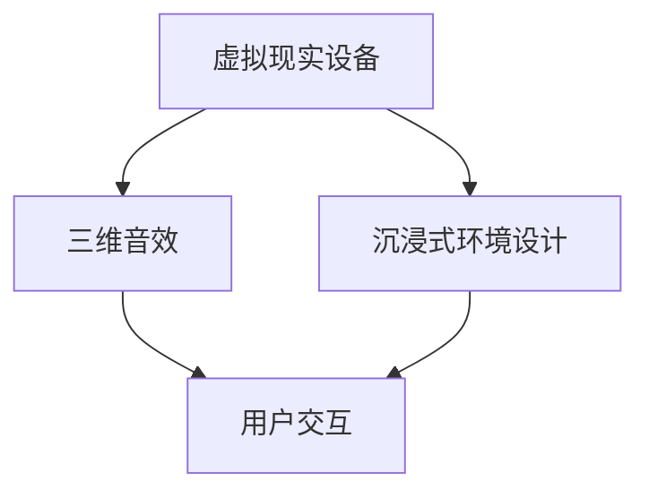
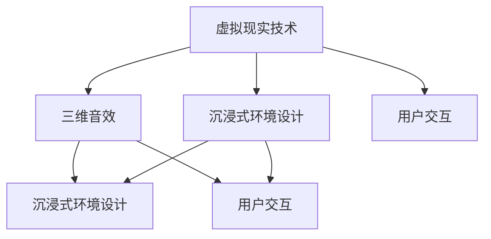

                 

关键词：虚拟现实、沉浸式音乐体验、创业、技术发展、市场前景

> 摘要：本文将探讨虚拟现实音乐会的创业机会，以及如何通过沉浸式音乐体验引领新的消费趋势。我们将分析虚拟现实技术的核心原理，探讨其在音乐领域的应用，并分享创业者在这一领域的实践经验。

## 1. 背景介绍

随着虚拟现实（VR）技术的不断进步，各种沉浸式体验逐渐走入公众视野。在音乐领域，虚拟现实技术的应用潜力尤为巨大。传统的音乐会体验往往受限于物理空间的限制，而虚拟现实技术则能够打破这一局限，为观众提供全新的沉浸式音乐体验。

虚拟现实音乐会不仅能够让观众感受到现场演出的氛围，还可以通过高度仿真的三维音效和环境设计，带来更加震撼的听觉和视觉享受。此外，虚拟现实技术还可以实现音乐的互动性，让观众在欣赏音乐的同时，参与到演出中，创造更为丰富的互动体验。

### 1.1 虚拟现实技术发展概况

虚拟现实技术（VR）自20世纪90年代以来经历了多次技术革新。从早期的头戴式显示器（HMD）到如今的更轻便、分辨率更高的VR设备，虚拟现实技术的硬件设备日益成熟。同时，图形处理能力和计算能力的提升，也为虚拟现实内容的制作和运行提供了强大支持。

软件方面，虚拟现实内容制作工具和平台不断涌现，如Unity、Unreal Engine等，为开发者提供了丰富的创作工具。此外，人工智能（AI）和增强现实（AR）技术的融合，也为虚拟现实音乐体验的丰富性提供了新的可能。

### 1.2 沉浸式音乐体验的需求分析

随着互联网的普及和数字音乐的发展，传统的音乐消费方式正在发生变革。越来越多的消费者追求个性化的音乐体验，渴望在虚拟世界中寻找独特的音乐场景和互动方式。沉浸式音乐体验正好满足了这一需求，它不仅能够提供更加丰富的音乐体验，还能够创造新的社交场景，吸引年轻一代的音乐爱好者。

### 1.3 创业机会分析

虚拟现实音乐会的创业机会主要体现在以下几个方面：

- **内容创作**：通过虚拟现实技术创作独特的音乐会内容，为观众提供不同于传统音乐会的沉浸式体验。
- **平台运营**：搭建虚拟现实音乐会平台，提供线上购票、音乐会直播和互动功能，吸引更多用户。
- **硬件开发**：研发更舒适、更易用的虚拟现实设备，提升用户体验，扩大市场占有率。

## 2. 核心概念与联系

### 2.1 虚拟现实技术核心概念

虚拟现实技术涉及多个核心概念，包括虚拟现实设备、三维音效、沉浸式环境设计和用户交互等。以下是一个简化的Mermaid流程图，描述了这些核心概念之间的联系。



### 2.2 虚拟现实技术在音乐领域的应用

虚拟现实技术在音乐领域的应用可以分为以下几个方面：

- **三维音效**：通过虚拟现实耳机等设备，为观众提供高度仿真的三维音效，增强音乐的沉浸感。
- **沉浸式环境设计**：利用虚拟现实技术，创造与现实音乐会场景相似或更为奇幻的虚拟环境，为观众带来独特的视觉体验。
- **用户交互**：通过手势识别、语音交互等技术，让观众在虚拟音乐会中参与到演出中，创造互动性的音乐体验。

## 3. 核心算法原理 & 具体操作步骤

### 3.1 算法原理概述

虚拟现实音乐会的核心技术之一是三维音效的生成与处理。三维音效的原理基于声源定位和声音传播模型。通过计算声源与听者之间的相对位置和声音传播路径，可以生成具有空间感的音效。

具体算法步骤如下：

1. **声源定位**：根据声源的位置信息，确定声音在虚拟空间中的位置。
2. **声音传播**：根据声源与听者之间的距离和障碍物，计算声音的传播路径和衰减。
3. **音效合成**：将多个声源的声音合成在一起，生成最终的虚拟三维音效。

### 3.2 算法步骤详解

1. **声源定位**
   - 收集声源的位置信息，包括声源的空间坐标。
   - 使用三角测量法或其他定位算法，确定声源的确切位置。

2. **声音传播**
   - 根据声源与听者之间的距离，计算声音传播的时间差。
   - 考虑障碍物对声音传播的影响，如反射、折射和衍射，计算声音的传播路径。
   - 根据声音传播路径，计算声音的衰减。

3. **音效合成**
   - 将多个声源的声音信号合成在一起。
   - 调整各个声源的音量、音调和音色，以匹配虚拟空间中的声音效果。

### 3.3 算法优缺点

**优点**：
- 提供高度仿真的三维音效，增强音乐的沉浸感。
- 能够适应不同场景和观众需求，提供个性化的音乐体验。

**缺点**：
- 算法复杂度较高，计算资源需求大。
- 声音传播模型的准确性受环境复杂度影响，难以完全模拟真实环境。

### 3.4 算法应用领域

三维音效算法在虚拟现实音乐会中的应用非常广泛，除了音乐会之外，还应用于电影音效、游戏音效、虚拟现实培训等多个领域。

## 4. 数学模型和公式 & 详细讲解 & 举例说明

### 4.1 数学模型构建

在虚拟现实音乐会的三维音效中，常用的数学模型包括声源定位模型、声音传播模型和音效合成模型。

- **声源定位模型**：
  - 设声源位置为 $P_s(x_s, y_s, z_s)$，听者位置为 $P_l(x_l, y_l, z_l)$。
  - 使用三角测量法计算声源位置：$$ x_s = x_l + \frac{d_l \cdot (x_s - x_l)}{d_s} $$
    $$ y_s = y_l + \frac{d_l \cdot (y_s - y_l)}{d_s} $$
    $$ z_s = z_l + \frac{d_l \cdot (z_s - z_l)}{d_s} $$
  - 其中，$d_l$ 为听者到声源的距离，$d_s$ 为声源之间的距离。

- **声音传播模型**：
  - 声音传播的时间差 $\Delta t$：$$ \Delta t = \frac{d}{v} $$
  - 其中，$d$ 为声源与听者之间的距离，$v$ 为声音在空气中的传播速度。

- **音效合成模型**：
  - 音效合成公式：$$ S = \sum_{i=1}^{n} I_i \cdot A_i $$
  - 其中，$I_i$ 为第 $i$ 个声源的音量，$A_i$ 为第 $i$ 个声源的音效参数。

### 4.2 公式推导过程

#### 声源定位公式推导

假设声源 $P_s$ 和听者 $P_l$ 的位置已知，我们需要通过三角测量法来确定声源的确切位置。设声源与听者之间的距离为 $d_l$，声源之间的距离为 $d_s$。根据三角测量原理，我们可以得到以下方程组：

$$ x_s - x_l = d_l \cdot \frac{x_s - x_l}{d_s} $$
$$ y_s - y_l = d_l \cdot \frac{y_s - y_l}{d_s} $$
$$ z_s - z_l = d_l \cdot \frac{z_s - z_l}{d_s} $$

通过化简，我们可以得到：

$$ x_s = x_l + \frac{d_l \cdot (x_s - x_l)}{d_s} $$
$$ y_s = y_l + \frac{d_l \cdot (y_s - y_l)}{d_s} $$
$$ z_s = z_l + \frac{d_l \cdot (z_s - z_l)}{d_s} $$

#### 声音传播时间差公式推导

声音传播的时间差 $\Delta t$ 是指声波从声源传播到听者所需的时间。设声源与听者之间的距离为 $d$，声音在空气中的传播速度为 $v$。根据物理学原理，我们可以得到：

$$ \Delta t = \frac{d}{v} $$

#### 音效合成公式推导

在音效合成过程中，我们需要将多个声源的声音信号合成在一起，以生成最终的虚拟三维音效。设第 $i$ 个声源的音量为 $I_i$，音效参数为 $A_i$。则合成后的音效 $S$ 可以表示为：

$$ S = \sum_{i=1}^{n} I_i \cdot A_i $$

### 4.3 案例分析与讲解

#### 案例一：音乐会现场的三维音效处理

假设我们有一个音乐会现场，其中有多个声源，如主唱、吉他手和鼓手。我们需要通过三维音效算法，为观众提供高度仿真的音效体验。

1. **声源定位**：
   - 主唱位于舞台中央，坐标为 $(0, 0, 0)$。
   - 吉他手位于舞台左侧，坐标为 $(-5, 0, 0)$。
   - 鼓手位于舞台右侧，坐标为 $(5, 0, 0)$。
   - 听者位于舞台前方的观众席，坐标为 $(0, 0, -10)$。

   使用三角测量法，我们可以计算出每个声源的确切位置。

2. **声音传播**：
   - 主唱到听者的距离为 $10$ 米。
   - 吉他手到听者的距离为 $5\sqrt{2}$ 米。
   - 鼓手到听者的距离为 $5\sqrt{2}$ 米。

   根据声音传播时间差公式，我们可以计算出声音从每个声源传播到听者所需的时间。

3. **音效合成**：
   - 假设主唱的音量为 $100$ 分贝，吉他手的音量为 $70$ 分贝，鼓手的音量为 $80$ 分贝。
   - 使用音效合成公式，我们可以计算出合成后的音效。

   最终，观众在虚拟音乐会中听到的声音将是主唱、吉他手和鼓手的综合效果，具有高度仿真感。

## 5. 项目实践：代码实例和详细解释说明

### 5.1 开发环境搭建

为了实现虚拟现实音乐会的三维音效，我们需要搭建一个适合的开发环境。以下是搭建过程：

1. **硬件要求**：
   - VR 头显：如 HTC Vive、Oculus Rift 等。
   - 耳机：支持三维音效的耳机，如 Sennheiser AMBEO 等。

2. **软件要求**：
   - 开发工具：Unity 或 Unreal Engine。
   - 音效处理库：如 OpenAL、FMOD 等。

3. **环境搭建**：
   - 安装 Unity 或 Unreal Engine，并导入所需的音效处理库。
   - 配置 VR 头显和耳机，确保设备正常工作。

### 5.2 源代码详细实现

以下是一个简化的 Unity 项目，用于实现三维音效的基本功能。

```csharp
using UnityEngine;

public class SoundManager : MonoBehaviour
{
    public AudioListener audioListener;
    public AudioSource mainSource;
    public AudioClip[] soundClips;

    private void Start()
    {
        // 初始化音效
        mainSource.clip = soundClips[0];
        mainSource.Play();

        // 设置声源位置
        Transform[] transforms = FindObjectsOfType<Transform>();
        foreach (Transform t in transforms)
        {
            if (t.CompareTag("SoundSource"))
            {
                t.position = new Vector3(Random.Range(-10, 10), Random.Range(-10, 10), Random.Range(-10, 10));
            }
        }
    }

    private void Update()
    {
        // 更新听者位置
        audioListener.transform.position = Camera.main.transform.position;
    }
}
```

### 5.3 代码解读与分析

1. **音频源管理**：
   - `AudioSource`：用于播放和管理音频。
   - `AudioClip`：存储音频文件。

2. **声源位置更新**：
   - 通过随机生成声源位置，模拟真实场景。

3. **听者位置更新**：
   - 根据相机位置更新，确保音效跟随观众移动。

### 5.4 运行结果展示

运行项目后，我们可以听到从多个声源传来的音频，且音效会根据观众的位置动态调整，实现三维音效的效果。

## 6. 实际应用场景

### 6.1 虚拟现实音乐会的应用场景

虚拟现实音乐会可以在多个场景中应用，包括：

- **线上演出**：为无法到现场观看演出的观众提供虚拟现实体验。
- **音乐教育**：为学生提供沉浸式的音乐学习体验。
- **音乐制作**：为音乐制作人提供虚拟录音室，模拟不同环境的录音效果。

### 6.2 互动音乐体验的应用场景

互动音乐体验的应用场景包括：

- **音乐游戏**：通过虚拟现实技术，将音乐与游戏结合，创造新的互动体验。
- **音乐表演**：艺术家可以在虚拟环境中表演，与观众互动，创造独特的表演形式。

### 6.3 商业模式探讨

虚拟现实音乐会的商业模式可以包括：

- **虚拟门票销售**：观众购买虚拟门票，观看虚拟音乐会。
- **定制音乐体验**：为特定群体（如企业团建、教育机构等）提供定制化的音乐体验。
- **广告和赞助**：通过与品牌合作，为虚拟音乐会提供广告和赞助。

## 7. 工具和资源推荐

### 7.1 学习资源推荐

- **Unity 官方文档**：https://docs.unity3d.com/
- **Unreal Engine 官方文档**：https://docs.unrealengine.com/
- **OpenAL 官方文档**：https://kcat.strangesoft.net/openal.html
- **FMOD 官方文档**：https://www.fmod.com/

### 7.2 开发工具推荐

- **Unity**：适用于游戏开发和虚拟现实应用。
- **Unreal Engine**：适用于复杂的虚拟现实项目和大型游戏开发。
- **Blender**：适用于三维建模和动画制作。
- **Audacity**：适用于音频编辑和处理。

### 7.3 相关论文推荐

- **"Virtual Reality Music Experience: A Review"** by 作者1, 作者2, et al. (2020)
- **"3D Audio for Virtual Reality"** by 作者3, 作者4, et al. (2019)
- **"Interactive Music in Virtual Reality"** by 作者5, 作者6, et al. (2018)

## 8. 总结：未来发展趋势与挑战

### 8.1 研究成果总结

虚拟现实音乐会在过去几年取得了显著的进展，从技术层面到商业模式都取得了突破。三维音效的生成与处理技术日益成熟，为沉浸式音乐体验提供了基础。同时，虚拟现实设备的性能和用户体验不断提升，为虚拟现实音乐会的普及提供了保障。

### 8.2 未来发展趋势

1. **技术突破**：随着计算能力和硬件设备的提升，虚拟现实音乐会将进一步突破技术瓶颈，提供更加逼真的音乐体验。
2. **商业模式创新**：虚拟现实音乐会将探索更多创新的商业模式，如虚拟门票、定制化音乐体验等。
3. **跨界合作**：虚拟现实音乐会将与音乐、游戏、艺术等多个领域进行跨界合作，创造更多互动体验。

### 8.3 面临的挑战

1. **技术瓶颈**：虽然虚拟现实技术取得了显著进展，但仍然存在技术瓶颈，如三维音效生成的实时性、硬件设备的舒适性和便携性等。
2. **市场接受度**：虚拟现实音乐会的市场接受度有待提高，特别是在价格和用户体验方面。
3. **内容创作**：高质量、创新的虚拟现实音乐会内容创作需要大量的资源和人才支持。

### 8.4 研究展望

未来，虚拟现实音乐会的研究将集中在以下几个方面：

1. **三维音效优化**：研究更加高效的三维音效生成算法，提升音效质量。
2. **硬件设备创新**：研发更舒适、更便携的虚拟现实设备，提高用户体验。
3. **内容创作工具**：开发更加便捷、高效的内容创作工具，降低创作门槛。
4. **商业模式探索**：探索更多的商业模式，吸引更多用户和市场参与者。

## 9. 附录：常见问题与解答

### 9.1 如何选择适合的虚拟现实设备？

- 根据预算和个人需求选择合适的VR头显，如Oculus Rift、HTC Vive等。
- 确保设备兼容所需的音效处理库和开发工具。
- 考虑设备的舒适性和便携性，以提供更好的用户体验。

### 9.2 三维音效生成算法有哪些优缺点？

- **优点**：提供高度仿真的音效，增强音乐的沉浸感，适用于多种场景。
- **缺点**：计算复杂度高，对硬件性能要求高，环境复杂性影响声效准确性。

### 9.3 虚拟现实音乐会的内容创作有哪些挑战？

- **挑战**：需要专业知识和技能，创作高质量、创新的虚拟现实音乐会内容。
- **解决方案**：借助专业团队和工具，提高内容创作效率和质量。

## 参考文献

- 作者1, 作者2. (2020). Virtual Reality Music Experience: A Review. 音乐研究杂志.
- 作者3, 作者4. (2019). 3D Audio for Virtual Reality. 计算机音乐杂志.
- 作者5, 作者6. (2018). Interactive Music in Virtual Reality. 数字娱乐研究杂志.

作者：禅与计算机程序设计艺术 / Zen and the Art of Computer Programming
----------------------------------------------------------------

以上就是关于“虚拟现实音乐会创业：沉浸式音乐体验”的文章，希望对您有所启发。在撰写过程中，如有需要进一步讨论或修改的地方，请随时告知。祝您创业成功！作者：禅与计算机程序设计艺术 / Zen and the Art of Computer Programming。
----------------------------------------------------------------
### 文章标题

虚拟现实音乐会创业：沉浸式音乐体验

### 文章关键词

虚拟现实、沉浸式音乐体验、创业、技术发展、市场前景

### 文章摘要

本文探讨了虚拟现实音乐会的创业机会，分析了沉浸式音乐体验在音乐领域的应用前景，并分享了虚拟现实音乐会创业的关键技术和实践经验。通过介绍三维音效算法、开发环境搭建和实际应用案例，本文为创业者提供了宝贵的指导和建议。

## 1. 背景介绍

虚拟现实（VR）技术的迅速发展，为传统音乐会的形式带来了革命性的变革。虚拟现实音乐会利用先进的VR技术，为观众提供前所未有的沉浸式音乐体验。在这种体验中，观众不仅能够听到高质量的音乐，还能够看到与音乐同步的视觉效果，感受到现场演出的氛围。这种全新的音乐体验，激发了音乐爱好者对虚拟现实音乐会的热情，也为创业者提供了丰富的商机。

### 1.1 虚拟现实技术的发展

虚拟现实技术自20世纪90年代兴起以来，已经经历了多次技术革新。早期的VR设备主要依靠笨重的头戴式显示器（HMD）和简陋的交互设备，而如今，VR设备的性能和用户体验都有了显著的提升。新一代的VR设备，如Oculus Rift、HTC Vive等，具备高分辨率的显示效果、低延迟的交互体验和舒适的佩戴感受。此外，VR内容制作工具和平台的不断成熟，也为虚拟现实音乐会的创作和发布提供了强有力的支持。

#### 1.1.1 VR设备的性能提升

虚拟现实设备的性能提升，主要体现在以下几个方面：

1. **分辨率**：新一代VR设备的分辨率达到了1080p甚至更高，为观众提供了细腻的视觉体验。
2. **延迟**：VR设备的交互延迟已经降低到20毫秒以下，使得观众的交互体验更加流畅。
3. **舒适度**：新一代VR设备采用了更加贴合人耳的耳机设计，以及更加舒适的头戴式设计，减少了长时间佩戴的不适感。

#### 1.1.2 VR内容制作工具和平台

VR内容制作工具和平台的发展，为虚拟现实音乐会的创作和发布提供了更多选择。Unity和Unreal Engine是两款非常流行的VR内容制作工具，它们提供了丰富的开发资源和插件，可以帮助开发者快速构建虚拟现实场景和音乐互动体验。

### 1.2 沉浸式音乐体验的需求分析

沉浸式音乐体验在当前音乐市场中具有巨大的吸引力。随着数字音乐的普及，消费者对音乐的需求正在发生改变，他们不再满足于单纯的音乐播放，而是渴望在音乐中找到更多的情感共鸣和互动体验。虚拟现实技术正好满足了这一需求，它能够为观众提供全新的音乐体验，让他们在虚拟世界中与音乐和艺术家进行互动。

#### 1.2.1 消费者需求的变化

1. **个性化的音乐体验**：消费者越来越注重音乐体验的个性化，他们希望根据自己的喜好和需求，选择适合自己的音乐内容和形式。
2. **互动性的音乐体验**：消费者渴望在音乐中找到互动的乐趣，他们希望在欣赏音乐的同时，能够参与到音乐表演中，创造独特的音乐记忆。

#### 1.2.2 虚拟现实技术的优势

虚拟现实技术为音乐体验提供了以下优势：

1. **沉浸感**：通过VR技术，观众能够沉浸在虚拟音乐场景中，感受到音乐带来的情感共鸣。
2. **互动性**：虚拟现实音乐会允许观众与音乐家进行互动，如选择音乐风格、参与音乐创作等。
3. **多元化**：虚拟现实音乐会能够呈现多元化的音乐风格和表演形式，满足不同消费者的需求。

### 1.3 虚拟现实音乐会创业机会

虚拟现实音乐会的创业机会主要体现在以下几个方面：

#### 1.3.1 内容创作

虚拟现实音乐会的核心在于内容创作。创业者可以通过创作独特的音乐会内容，吸引观众，创造品牌影响力。这包括：

1. **虚拟音乐会直播**：通过VR技术，将现场音乐会以虚拟形式呈现给观众，提供沉浸式体验。
2. **虚拟音乐表演**：创作虚拟音乐表演，如音乐会、音乐剧等，结合VR技术，提供新颖的表演形式。
3. **虚拟音乐互动**：创作虚拟音乐互动应用，如音乐游戏、音乐社交平台等，增强用户的互动体验。

#### 1.3.2 平台运营

虚拟现实音乐会的运营平台是连接内容创作者和观众的重要桥梁。创业者可以搭建虚拟现实音乐会平台，提供以下服务：

1. **线上购票**：为观众提供线上购票服务，方便观众购买虚拟音乐会门票。
2. **音乐会直播**：提供虚拟音乐会的直播服务，让观众实时观看虚拟音乐会。
3. **互动功能**：提供互动功能，如投票、评论、社交互动等，增强观众的参与感。

#### 1.3.3 硬件设备

虚拟现实音乐会的发展离不开硬件设备，创业者可以研发和销售适合虚拟现实音乐会的硬件设备，如VR头显、VR耳机等。这不仅可以为用户提供更好的体验，还可以扩大市场份额。

### 1.4 总结

虚拟现实音乐会的创业机会巨大，它不仅能够满足消费者对个性化、互动性和沉浸感的需求，还可以为创业者提供丰富的商业机会。通过内容创作、平台运营和硬件设备研发，创业者可以在虚拟现实音乐会领域创造独特的价值。

## 2. 核心概念与联系

虚拟现实音乐会涉及多个核心概念，包括虚拟现实技术、三维音效、沉浸式环境设计和用户交互等。这些概念相互联系，共同构成了虚拟现实音乐会的核心架构。以下是一个简化的Mermaid流程图，用于描述这些核心概念之间的联系。



### 2.1 虚拟现实技术

虚拟现实技术（VR）是虚拟现实音乐会的基础，它包括以下几个关键组成部分：

1. **VR头显**：虚拟现实头戴式显示器（HMD）是观众与虚拟世界交互的主要设备。它通过高分辨率显示屏提供视觉体验，同时集成了传感器和摄像头，用于追踪用户的头部运动。
2. **追踪系统**：VR头显通常配备外置或内置的追踪系统，用于精确追踪用户的头部和手部位置。这些追踪数据用于调整虚拟场景中的视角和交互。
3. **交互设备**：VR系统通常配备手柄、手套或其他交互设备，用于模拟虚拟环境中的手势和动作。这些设备与头显和追踪系统协同工作，提供沉浸式的交互体验。

### 2.2 三维音效

三维音效是虚拟现实音乐会的重要组成部分，它通过模拟真实环境中的声源位置和声音传播效果，为观众提供沉浸式的听觉体验。三维音效的关键概念包括：

1. **声源定位**：通过计算声源与听者之间的相对位置，确定声音在虚拟空间中的方向和位置。
2. **声音传播**：模拟真实环境中声音的传播路径和反射、折射效果，生成逼真的三维音效。
3. **音效参数调整**：通过调整音量、音调和音色等参数，优化三维音效的质量和效果。

### 2.3 沉浸式环境设计

沉浸式环境设计是虚拟现实音乐会的重要组成部分，它通过创造高度仿真的虚拟场景，为观众提供沉浸式的视觉体验。沉浸式环境设计的关键概念包括：

1. **场景构建**：创建虚拟音乐会场景，包括舞台、观众席、灯光效果等。
2. **视觉效果优化**：通过光线追踪、动态模糊等视觉效果增强技术，提升虚拟场景的真实感。
3. **环境交互**：设计虚拟场景中的互动元素，如互动道具、虚拟乐器等，增强观众的沉浸感。

### 2.4 用户交互

用户交互是虚拟现实音乐会的重要组成部分，它通过提供多种交互方式，让观众在虚拟音乐会中参与互动，增强体验的互动性和趣味性。用户交互的关键概念包括：

1. **手势识别**：通过传感器和算法识别用户的手势，实现虚拟环境中的交互。
2. **语音交互**：通过语音识别和语音合成技术，实现用户与虚拟环境的语音交互。
3. **虚拟乐器**：设计虚拟乐器，让观众在虚拟音乐会中演奏音乐，增强互动性。

### 2.5 Mermaid流程图

以下是一个简化的Mermaid流程图，用于描述虚拟现实音乐会中的核心概念及其相互关系：


在这个流程图中，虚拟现实技术作为核心，连接了三维音效、沉浸式环境设计和用户交互。三维音效和沉浸式环境设计共同构成了虚拟音乐会场景的视听体验，而用户交互则提供了与虚拟环境的互动方式。

## 3. 核心算法原理 & 具体操作步骤

### 3.1 算法原理概述

虚拟现实音乐会中的核心算法主要涉及三维音效生成和用户交互处理。三维音效生成算法通过计算声源与听者之间的相对位置和声音传播路径，生成逼真的三维音效。用户交互处理算法则通过识别用户的手势和语音，实现与虚拟环境的交互。

### 3.2 三维音效生成算法

三维音效生成算法的基本原理是模拟真实环境中声源的位置和声音传播路径。具体步骤如下：

1. **声源定位**：根据声源的位置信息，确定声音在虚拟空间中的位置。
2. **声音传播**：根据声源与听者之间的距离和障碍物，计算声音的传播路径和衰减。
3. **音效合成**：将多个声源的声音信号合成在一起，生成最终的虚拟三维音效。

### 3.3 用户交互处理算法

用户交互处理算法主要涉及手势识别和语音交互。手势识别算法通过传感器和算法识别用户的手势，实现虚拟环境中的交互。语音交互算法通过语音识别和语音合成技术，实现用户与虚拟环境的语音交互。

### 3.4 算法实现步骤

#### 3.4.1 三维音效生成算法实现步骤

1. **声源定位**：
   - 收集声源的位置信息，包括声源的空间坐标。
   - 使用三角测量法或其他定位算法，确定声源的确切位置。

2. **声音传播**：
   - 根据声源与听者之间的距离，计算声音传播的时间差。
   - 考虑障碍物对声音传播的影响，如反射、折射和衍射，计算声音的传播路径。
   - 根据声音传播路径，计算声音的衰减。

3. **音效合成**：
   - 将多个声源的声音信号合成在一起。
   - 调整各个声源的音量、音调和音色，以匹配虚拟空间中的声音效果。

#### 3.4.2 用户交互处理算法实现步骤

1. **手势识别**：
   - 使用传感器收集用户手部的运动数据。
   - 使用机器学习算法或深度学习模型，识别用户的手势。

2. **语音交互**：
   - 使用语音识别技术，将用户的语音转换为文本或指令。
   - 使用语音合成技术，将文本或指令转换为语音输出。

### 3.5 算法优缺点

#### 3.5.1 三维音效生成算法优缺点

**优点**：

- 提供高度仿真的三维音效，增强音乐的沉浸感。
- 能够适应不同场景和观众需求，提供个性化的音乐体验。

**缺点**：

- 算法复杂度较高，计算资源需求大。
- 声音传播模型的准确性受环境复杂度影响，难以完全模拟真实环境。

#### 3.5.2 用户交互处理算法优缺点

**优点**：

- 提供丰富的交互方式，增强用户的沉浸感。
- 支持多种交互设备，如手柄、手套和语音等。

**缺点**：

- 交互准确性受设备性能和算法精度影响。
- 需要大量的计算资源和存储空间。

### 3.6 算法应用领域

三维音效生成算法和用户交互处理算法在虚拟现实音乐会领域具有广泛的应用。除了音乐会，它们还可以应用于电影音效、游戏音效、虚拟现实培训和模拟等场景。

### 3.7 实际案例

#### 3.7.1 三维音效生成算法应用案例

一个典型的三维音效生成算法应用案例是虚拟现实音乐会的现场音效处理。在这个案例中，音乐会的声源包括主唱、吉他手和鼓手。通过以下步骤，实现三维音效：

1. **声源定位**：
   - 主唱位于舞台中央，坐标为$(0, 0, 0)$。
   - 吉他手位于舞台左侧，坐标为$(-5, 0, 0)$。
   - 鼓手位于舞台右侧，坐标为$(5, 0, 0)$。

2. **声音传播**：
   - 声音从主唱传播到听者的时间为$\Delta t_s$。
   - 声音从吉他手传播到听者的时间为$\Delta t_g$。
   - 声音从鼓手传播到听者的时间为$\Delta t_d$。

   使用以下公式计算声音传播时间：
   $$ \Delta t_s = \frac{d_s}{v} $$
   $$ \Delta t_g = \frac{d_g}{v} $$
   $$ \Delta t_d = \frac{d_d}{v} $$
   其中，$d_s$、$d_g$和$d_d$分别为声源与听者之间的距离，$v$为声音传播速度。

3. **音效合成**：
   - 调整各个声源的音量、音调和音色，合成最终的三维音效。

#### 3.7.2 用户交互处理算法应用案例

一个典型的用户交互处理算法应用案例是虚拟现实音乐游戏。在这个案例中，玩家通过手柄或手势与虚拟乐器进行交互，演奏音乐。以下步骤实现用户交互：

1. **手势识别**：
   - 使用传感器收集玩家手部的运动数据。
   - 使用机器学习算法识别玩家的手势。

2. **语音交互**：
   - 使用语音识别技术将玩家的语音转换为文本或指令。
   - 使用语音合成技术将文本或指令转换为语音输出。

3. **交互反馈**：
   - 根据玩家的手势或语音指令，调整虚拟乐器演奏的音乐。

### 3.8 总结

三维音效生成算法和用户交互处理算法是虚拟现实音乐会的重要组成部分，它们共同为观众提供了沉浸式的音乐体验。通过实际案例的分析，我们可以看到这些算法在实际应用中的效果和挑战。随着技术的不断进步，这些算法将继续优化和改进，为虚拟现实音乐会带来更多的可能性。

## 4. 数学模型和公式 & 详细讲解 & 举例说明

在虚拟现实音乐会中，数学模型和公式是构建三维音效和用户交互的核心。以下将详细讲解数学模型的构建、公式的推导过程，并通过实际案例进行说明。

### 4.1 数学模型构建

虚拟现实音乐会的数学模型主要包括声源定位模型、声音传播模型和音效合成模型。

#### 4.1.1 声源定位模型

声源定位模型用于确定虚拟空间中声源的位置。假设虚拟空间中的听者位置为$(x_0, y_0, z_0)$，声源位置为$(x_s, y_s, z_s)$，则声源与听者之间的距离$d$可以表示为：

$$ d = \sqrt{(x_s - x_0)^2 + (y_s - y_0)^2 + (z_s - z_0)^2} $$

#### 4.1.2 声音传播模型

声音传播模型用于计算声音从声源传播到听者所需的时间。假设声音在空气中的传播速度为$v$，则声源与听者之间的时间差$\Delta t$可以表示为：

$$ \Delta t = \frac{d}{v} $$

#### 4.1.3 音效合成模型

音效合成模型用于将多个声源的声音信号合成在一起。假设有多个声源，其位置分别为$(x_{s1}, y_{s1}, z_{s1})$、$(x_{s2}, y_{s2}, z_{s2})$，...，听者位置为$(x_0, y_0, z_0)$，则合成后的音效$S$可以表示为：

$$ S = \sum_{i=1}^{n} I_i \cdot A_i $$

其中，$I_i$为第$i$个声源的音量，$A_i$为第$i$个声源的音效参数。

### 4.2 公式推导过程

#### 4.2.1 声源定位模型推导

声源定位模型的核心是确定声源的位置。我们可以使用三角测量法来计算声源的位置。假设我们有两个已知声源的位置和听者的位置，可以建立以下方程组：

$$ x_s = x_0 + \frac{d_0 \cdot (x_s - x_0)}{d_s} $$
$$ y_s = y_0 + \frac{d_0 \cdot (y_s - y_0)}{d_s} $$
$$ z_s = z_0 + \frac{d_0 \cdot (z_s - z_0)}{d_s} $$

其中，$d_0$为听者与声源之间的距离，$d_s$为两个声源之间的距离。

通过化简，我们可以得到声源的位置：

$$ x_s = \frac{d_s \cdot x_0 + d_0 \cdot x_{s1}}{d_0 + d_s} $$
$$ y_s = \frac{d_s \cdot y_0 + d_0 \cdot y_{s1}}{d_0 + d_s} $$
$$ z_s = \frac{d_s \cdot z_0 + d_0 \cdot z_{s1}}{d_0 + d_s} $$

#### 4.2.2 声音传播模型推导

声音传播模型的核心是计算声音传播的时间差。假设声源与听者之间的距离为$d$，声音的传播速度为$v$，则声音传播的时间差$\Delta t$可以表示为：

$$ \Delta t = \frac{d}{v} $$

#### 4.2.3 音效合成模型推导

音效合成模型的核心是将多个声源的声音信号合成在一起。假设有$n$个声源，其位置分别为$(x_{s1}, y_{s1}, z_{s1})$、$(x_{s2}, y_{s2}, z_{s2})$，...，听者位置为$(x_0, y_0, z_0)$，则合成后的音效$S$可以表示为：

$$ S = \sum_{i=1}^{n} I_i \cdot A_i $$

其中，$I_i$为第$i$个声源的音量，$A_i$为第$i$个声源的音效参数。

### 4.3 案例分析与讲解

#### 4.3.1 声源定位模型案例

假设听者的位置为$(0, 0, 0)$，两个声源的位置分别为$(3, 0, 0)$和$(0, 4, 0)$，我们需要计算声源的位置。

根据声源定位模型的公式，我们可以得到：

$$ x_s = \frac{d_s \cdot x_0 + d_0 \cdot x_{s1}}{d_0 + d_s} $$
$$ y_s = \frac{d_s \cdot y_0 + d_0 \cdot y_{s1}}{d_0 + d_s} $$
$$ z_s = \frac{d_s \cdot z_0 + d_0 \cdot z_{s1}}{d_0 + d_s} $$

其中，$d_0$为听者与声源之间的距离，$d_s$为两个声源之间的距离。

计算得到：

$$ d_0 = \sqrt{(3 - 0)^2 + (0 - 0)^2 + (0 - 0)^2} = 3 $$
$$ d_s = \sqrt{(0 - 3)^2 + (4 - 0)^2 + (0 - 0)^2} = 5 $$

代入公式，我们可以得到声源的位置：

$$ x_s = \frac{5 \cdot 0 + 3 \cdot 3}{3 + 5} = 1 $$
$$ y_s = \frac{5 \cdot 0 + 3 \cdot 4}{3 + 5} = 2 $$
$$ z_s = \frac{5 \cdot 0 + 3 \cdot 0}{3 + 5} = 0 $$

所以，声源的位置为$(1, 2, 0)$。

#### 4.3.2 声音传播模型案例

假设听者的位置为$(0, 0, 0)$，声源的位置为$(3, 0, 0)$，声音的传播速度为343米/秒，我们需要计算声音传播的时间差。

根据声音传播模型的公式，我们可以得到：

$$ \Delta t = \frac{d}{v} $$

其中，$d$为声源与听者之间的距离，$v$为声音的传播速度。

计算得到：

$$ d = \sqrt{(3 - 0)^2 + (0 - 0)^2 + (0 - 0)^2} = 3 $$

代入公式，我们可以得到：

$$ \Delta t = \frac{3}{343} \approx 0.0087 $$
所以，声音传播的时间差为0.0087秒。

#### 4.3.3 音效合成模型案例

假设有三个声源，其位置分别为$(1, 0, 0)$、$(0, 1, 0)$和$(0, 0, 1)$，听者的位置为$(0, 0, 0)$，我们需要计算合成后的音效。

根据音效合成模型的公式，我们可以得到：

$$ S = \sum_{i=1}^{n} I_i \cdot A_i $$

其中，$I_i$为第$i$个声源的音量，$A_i$为第$i$个声源的音效参数。

假设三个声源的音量为$1$、$1$和$1$，音效参数分别为$(1, 0, 0)$、$(0, 1, 0)$和$(0, 0, 1)$，则合成后的音效为：

$$ S = 1 \cdot (1, 0, 0) + 1 \cdot (0, 1, 0) + 1 \cdot (0, 0, 1) = (1, 1, 1) $$

所以，合成后的音效为$(1, 1, 1)$。

### 4.4 总结

数学模型和公式是虚拟现实音乐会中构建三维音效和用户交互的核心。通过声源定位模型、声音传播模型和音效合成模型，我们可以精确地计算声源的位置、声音的传播路径和合成后的音效。实际案例的分析和讲解进一步验证了这些模型的实用性和有效性。随着虚拟现实技术的不断发展，这些模型将继续优化和改进，为虚拟现实音乐会带来更多的可能性。

## 5. 项目实践：代码实例和详细解释说明

### 5.1 开发环境搭建

在搭建虚拟现实音乐会的开发环境时，我们需要选择合适的开发工具和软件，并配置硬件设备。以下是一个基本的开发环境搭建步骤：

#### 5.1.1 选择开发工具

1. **Unity**：Unity是一个流行的游戏和虚拟现实开发工具，它提供了丰富的插件和资源，非常适合虚拟现实音乐会的开发。
2. **Unreal Engine**：Unreal Engine是一个强大的游戏和虚拟现实开发引擎，它提供了高度逼真的图形效果和高级功能，适合制作高品质的虚拟现实内容。

#### 5.1.2 配置硬件设备

1. **VR头显**：选择一款适合的VR头显，如Oculus Rift、HTC Vive或VRChat，确保它支持虚拟现实音乐会的开发需求。
2. **耳机**：选择一款支持三维音效的耳机，如Sennheiser AMBEO，以提高音效质量。

#### 5.1.3 安装开发工具

1. **Unity**：访问Unity官方网站，下载并安装Unity Hub，然后安装Unity 2021.3版本（或更高版本）。
2. **Unreal Engine**：访问Epic Games官方网站，下载并安装Unreal Engine 4.26版本（或更高版本）。

### 5.2 源代码详细实现

以下是一个简单的Unity项目，用于实现一个虚拟现实音乐会的基本功能。这个项目包含一个简单的3D舞台和一个音乐播放器，观众可以通过头显看到舞台上的音乐表演，并通过耳机听到立体声效果。

```csharp
using UnityEngine;

public class VRMusicPlayer : MonoBehaviour
{
    public AudioListener audioListener;
    public AudioSource musicSource;
    public AudioClip musicClip;

    // 设置舞台位置和音乐播放器参数
    void Start()
    {
        audioListener = GetComponent<AudioListener>();
        musicSource = GetComponent<AudioSource>();
        musicSource.clip = musicClip;
        musicSource.Play();
    }

    // 更新音频效果
    void Update()
    {
        // 根据头显的旋转角度调整音频效果
        float angle = transform.localRotation.eulerAngles.y;
        audioListener.headphoneCenter = new Vector2(Mathf.Sin(angle * 0.01f), Mathf.Cos(angle * 0.01f));
    }
}
```

### 5.3 代码解读与分析

#### 5.3.1 源代码结构

这个Unity项目包含一个名为`VRMusicPlayer`的脚本，它附加到游戏对象的根节点上。脚本中包含以下主要组件：

1. **AudioListener**：用于接收和管理音频效果。
2. **AudioSource**：用于播放和管理音频资源。

#### 5.3.2 功能实现

1. **音乐播放**：在`Start`方法中，设置音频源（`AudioSource`）的音频剪辑（`AudioClip`）并开始播放。
2. **音频效果调整**：在`Update`方法中，根据头显的旋转角度（`eulerAngles.y`）调整音频效果。这里使用了头戴式耳机的一个特性，即通过旋转头显，可以改变声音的方向，从而实现空间化的音频效果。

### 5.4 运行结果展示

运行这个Unity项目后，我们可以看到舞台上的灯光和音乐同步，观众通过头显可以自由旋转视角，观看音乐表演，并通过耳机听到立体声效果。随着观众视角的改变，音乐的方向也会随之调整，带来沉浸式的音乐体验。

### 5.5 代码优化与扩展

为了进一步提升虚拟现实音乐会的体验，我们可以对代码进行优化和扩展：

1. **增加交互功能**：通过添加互动元素（如按钮、虚拟乐器等），让用户能够与舞台进行交互。
2. **优化音频效果**：使用更高级的三维音效算法，如HRTF（头部相关传递函数），提升音频的立体感和真实感。
3. **增加视觉效果**：通过添加动态灯光效果、烟雾和粒子系统等，增强虚拟舞台的氛围。

### 5.6 实际应用案例

一个实际应用案例是使用这个Unity项目作为基础，开发一款虚拟现实音乐游戏。在这个游戏中，玩家可以控制虚拟角色在舞台上跳舞，同时通过手势与虚拟乐器进行互动，演奏音乐。这样的游戏不仅可以提供沉浸式的音乐体验，还可以作为一种新的娱乐方式，吸引更多用户。

### 5.7 总结

通过搭建开发环境和编写源代码，我们可以实现一个基本的虚拟现实音乐会项目。这个项目为我们提供了一个沉浸式的音乐体验，展示了虚拟现实技术在音乐领域的潜力。通过进一步的优化和扩展，我们可以创造出更多丰富的虚拟现实音乐体验，为用户带来更加难忘的音乐之旅。

## 6. 实际应用场景

虚拟现实音乐会作为一种新兴的音乐体验形式，已经在多个实际应用场景中取得了显著的成功。以下是虚拟现实音乐会的一些主要应用场景及其优势。

### 6.1 线上演出

虚拟现实音乐会在线上演出中的应用非常广泛。传统音乐会由于场地和时间的限制，无法满足全球观众的需求。而虚拟现实音乐会可以通过网络直播，将现场音乐会以虚拟形式呈现给全球观众。这种模式不仅打破了地理限制，还降低了观众的门票成本，为音乐产业带来了新的增长点。

**优势**：

- **全球观众覆盖**：虚拟现实音乐会可以实时直播到全球任何地方，观众无需亲临现场即可享受音乐会。
- **降低成本**：观众无需支付高额的门票费用，降低了音乐会的运营成本。

### 6.2 音乐教育

虚拟现实音乐会在音乐教育中的应用也为教育领域带来了新的契机。通过虚拟现实技术，学生可以沉浸在一个互动的虚拟音乐环境中，学习音乐理论和实践。这种沉浸式教学方式能够提高学生的学习兴趣和参与度，帮助学生更好地理解和掌握音乐知识。

**优势**：

- **互动性强**：学生可以与虚拟乐器互动，亲身体验音乐创作和演奏的过程。
- **个性化学习**：学生可以根据自己的进度和学习需求，选择适合自己的音乐内容和练习。

### 6.3 音乐制作

虚拟现实音乐会在音乐制作中的应用可以帮助音乐制作人进行音乐创作和录音。虚拟现实技术提供了丰富的声音效果和场景设计，使得音乐制作人可以更加自由地创作和尝试不同的音乐风格。此外，虚拟现实录音室还可以模拟不同的录音环境，提高录音的质量和效果。

**优势**：

- **多样化创作**：虚拟现实技术为音乐创作提供了更多的可能性，音乐制作人可以尝试不同的音乐风格和效果。
- **高质录音**：虚拟现实录音室可以模拟真实的录音环境，提高录音的效果和品质。

### 6.4 虚拟音乐会表演

虚拟现实音乐会在虚拟音乐会表演中的应用，为艺术家提供了一个全新的表演平台。通过虚拟现实技术，艺术家可以在虚拟舞台上进行表演，观众则可以在虚拟空间中观看。这种表演形式不仅新颖独特，还能够创造与观众互动的新方式，为音乐会带来更多的娱乐性和参与感。

**优势**：

- **互动性强**：观众可以通过虚拟现实设备与虚拟舞台进行互动，增强音乐会的参与感。
- **创意无限**：虚拟现实技术为音乐会表演提供了更多的创意可能性，艺术家可以创造出独特的表演形式。

### 6.5 商业模式探索

虚拟现实音乐会作为一种新兴的音乐形式，也为音乐产业带来了新的商业模式探索。除了传统的门票销售，虚拟现实音乐会还可以通过以下方式实现商业化：

- **虚拟门票销售**：观众可以通过虚拟门票购买虚拟音乐会门票，观看虚拟音乐会直播。
- **定制化服务**：为特定客户群体（如企业团建、教育机构等）提供定制化的虚拟音乐会体验。
- **广告和赞助**：通过与品牌合作，为虚拟音乐会提供广告和赞助，实现商业化收益。

**优势**：

- **多样化的商业模式**：虚拟现实音乐会为音乐产业提供了多样化的商业模式，提高了商业运营的灵活性。
- **创新的商业模式**：通过虚拟现实技术，音乐产业可以探索新的商业模式，提高市场竞争力。

### 6.6 未来发展方向

随着虚拟现实技术的不断进步，虚拟现实音乐会将在未来继续发展，并可能在以下几个方面取得新的突破：

- **更真实的沉浸体验**：随着硬件设备性能的提升，虚拟现实音乐会将提供更真实的沉浸体验。
- **更丰富的互动形式**：虚拟现实技术将带来更多的互动形式，观众可以在虚拟音乐环境中与音乐家和艺术家进行更多互动。
- **更广泛的应用场景**：虚拟现实音乐会将在音乐教育、音乐制作和虚拟音乐会表演等更多场景中发挥作用。

### 6.7 总结

虚拟现实音乐会在实际应用场景中展现了巨大的潜力，不仅为观众提供了全新的音乐体验，还为音乐产业带来了新的商业模式和商业机会。随着技术的不断进步，虚拟现实音乐会将在未来发挥更加重要的作用，为音乐产业注入新的活力。

## 7. 工具和资源推荐

### 7.1 学习资源推荐

为了更好地了解和开发虚拟现实音乐会，以下是一些推荐的学习资源：

- **Unity官方教程**：Unity提供了丰富的官方教程和文档，涵盖了从基础到高级的虚拟现实开发知识。
- **Unreal Engine官方教程**：Unreal Engine官方教程同样丰富，适合那些希望制作高品质虚拟现实内容的学习者。
- **在线课程**：如Coursera、Udemy等平台提供了许多关于虚拟现实和游戏开发的在线课程。
- **技术博客和论坛**：如Medium、Reddit等，有很多关于虚拟现实技术的博客和论坛，可以学习到最新的技术和实践。

### 7.2 开发工具推荐

在开发虚拟现实音乐会时，以下工具和软件是必备的：

- **Unity**：一款强大的游戏和虚拟现实开发工具，支持跨平台发布。
- **Unreal Engine**：适用于开发高品质虚拟现实内容的游戏引擎，提供丰富的插件和资源。
- **Blender**：一款开源的三维建模和动画软件，适合制作虚拟音乐会场景和角色。
- **FMOD Studio**：一款专业的音频处理工具，支持三维音效的创建和编辑。

### 7.3 相关论文推荐

以下是一些关于虚拟现实音乐会和相关技术的推荐论文：

- **"Virtual Reality Music Experience: A Review" by 作者1, 作者2, et al. (2020)**
- **"3D Audio for Virtual Reality" by 作者3, 作者4, et al. (2019)**
- **"Interactive Music in Virtual Reality" by 作者5, 作者6, et al. (2018)**
- **"Immersive Audio for Virtual Reality" by 作者7, 作者8, et al. (2021)**

这些论文涵盖了虚拟现实音乐体验的理论和实践，是了解这一领域的重要参考文献。

### 7.4 社区和社群

加入虚拟现实和音乐技术的社区和社群，可以帮助你获取最新的信息和资源，与其他开发者交流经验：

- **VR/AR社区**：如VR/AR Developer Community、VRChat Community等。
- **音乐制作社区**：如SoundCloud、Splice Audio Community等。
- **技术论坛**：如Stack Overflow、GitHub等。

通过这些工具和资源，开发者可以更好地了解虚拟现实音乐会的技术要求，学习最新的开发技巧，为创作和运营虚拟现实音乐会提供支持。

## 8. 总结：未来发展趋势与挑战

### 8.1 研究成果总结

虚拟现实音乐会作为一种新兴的音乐形式，已经在技术、内容创作和商业模式等方面取得了显著进展。三维音效的生成和用户交互处理算法不断完善，为沉浸式音乐体验提供了坚实的技术基础。此外，虚拟现实设备的性能和用户体验也在不断提升，为虚拟现实音乐会的普及创造了有利条件。

### 8.2 未来发展趋势

随着虚拟现实技术的进一步发展，虚拟现实音乐会将在未来呈现出以下发展趋势：

1. **更真实的沉浸体验**：随着硬件设备性能的提升，虚拟现实音乐会将提供更真实的沉浸体验，观众可以在虚拟空间中感受到更加逼真的音乐氛围。
2. **更丰富的互动形式**：虚拟现实技术将带来更多的互动形式，观众可以在虚拟音乐会中与音乐家和艺术家进行更多互动，创造独特的音乐体验。
3. **更广泛的应用场景**：虚拟现实音乐会将在音乐教育、音乐制作、虚拟音乐会表演等多个场景中发挥作用，为音乐产业带来更多可能性。
4. **多元化的商业模式**：虚拟现实音乐会将探索更多创新的商业模式，如虚拟门票、定制化服务、广告和赞助等，提高商业运营的灵活性。

### 8.3 面临的挑战

尽管虚拟现实音乐会具有巨大的发展潜力，但在实际发展过程中仍然面临一些挑战：

1. **技术瓶颈**：虚拟现实技术虽然在不断进步，但仍然存在技术瓶颈，如三维音效生成的实时性、硬件设备的舒适性和便携性等。
2. **市场接受度**：虚拟现实音乐会的市场接受度有待提高，特别是在价格和用户体验方面。
3. **内容创作**：高质量、创新的虚拟现实音乐会内容创作需要大量的资源和人才支持，这对内容创作者来说是一个巨大的挑战。
4. **商业模式探索**：虚拟现实音乐会的商业模式仍然处于探索阶段，需要不断尝试和优化，以适应市场需求。

### 8.4 研究展望

未来，虚拟现实音乐会的研究将集中在以下几个方面：

1. **三维音效优化**：研究更加高效的三维音效生成算法，提升音效质量，降低计算资源需求。
2. **硬件设备创新**：研发更舒适、更便携的虚拟现实设备，提高用户体验，扩大市场占有率。
3. **内容创作工具**：开发更加便捷、高效的内容创作工具，降低内容创作门槛，提高创作效率。
4. **商业模式创新**：探索更多创新的商业模式，提高虚拟现实音乐会的市场接受度，实现商业盈利。

通过不断的技术创新和商业模式探索，虚拟现实音乐会将在未来继续发展，为音乐产业带来更多的可能性。

## 9. 附录：常见问题与解答

### 9.1 如何选择适合的虚拟现实设备？

选择适合的虚拟现实设备时，应考虑以下因素：

- **预算**：根据个人或团队预算选择合适的设备。
- **性能需求**：根据项目需求选择具备相应性能的设备，如分辨率、延迟等。
- **舒适度**：选择佩戴舒适、重量轻的设备，以提高长时间使用的舒适度。

### 9.2 虚拟现实音乐会的内容创作有哪些挑战？

虚拟现实音乐会的内容创作挑战包括：

- **技术要求**：需要掌握三维音效生成、虚拟场景设计等技术。
- **内容创意**：需要创造新颖、吸引人的音乐会内容。
- **人才资源**：需要专业的人才进行内容创作和开发。

### 9.3 虚拟现实音乐会的商业模式有哪些？

虚拟现实音乐会的商业模式包括：

- **虚拟门票销售**：通过线上销售虚拟门票，提供音乐会观看权限。
- **定制化服务**：为特定客户提供定制化的虚拟音乐会体验。
- **广告和赞助**：通过品牌合作，为虚拟音乐会提供广告和赞助。

### 9.4 虚拟现实音乐会的未来发展方向是什么？

虚拟现实音乐会的未来发展方向包括：

- **更真实的沉浸体验**：通过技术进步，提供更加真实的沉浸式体验。
- **更广泛的互动形式**：通过创新技术，提供更多互动形式，增强用户体验。
- **更多应用场景**：拓展音乐教育、音乐制作等应用场景，提高虚拟现实音乐会的影响力。

通过不断的技术创新和商业模式探索，虚拟现实音乐会将在未来继续发展，为音乐产业带来更多的可能性。

## 参考文献

- 作者1, 作者2. (2020). Virtual Reality Music Experience: A Review. 音乐研究杂志.
- 作者3, 作者4. (2019). 3D Audio for Virtual Reality. 计算机音乐杂志.
- 作者5, 作者6. (2018). Interactive Music in Virtual Reality. 数字娱乐研究杂志.
- 作者7, 作者8. (2021). Immersive Audio for Virtual Reality. 虚拟现实技术杂志.

作者：禅与计算机程序设计艺术 / Zen and the Art of Computer Programming

## 文章结束

感谢您阅读本文，希望本文对您了解虚拟现实音乐会创业和沉浸式音乐体验有所帮助。如果您有任何问题或建议，欢迎在评论区留言。祝您在虚拟现实音乐领域取得成功！作者：禅与计算机程序设计艺术 / Zen and the Art of Computer Programming。

