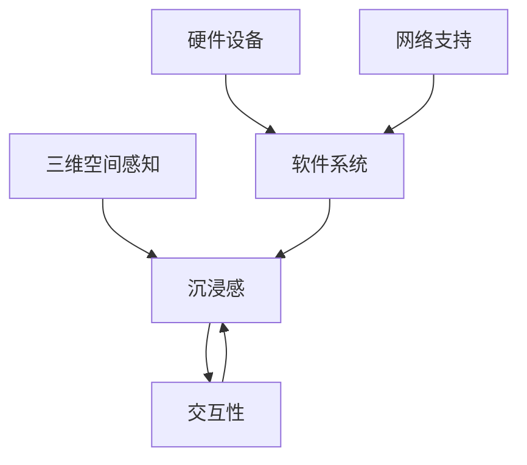

                 

关键词：虚拟现实、沉浸式体验、VR技术、交互设计、用户体验、3D建模、图形渲染、人机交互、应用场景

> 摘要：本文将深入探讨虚拟现实（VR）技术及其在沉浸式体验设计中的应用。通过分析VR技术的核心概念、工作原理、开发流程和未来发展趋势，旨在为读者提供全面的技术解读和实践指南。

## 1. 背景介绍

### 虚拟现实技术的起源与发展

虚拟现实（VR）技术起源于20世纪60年代的计算机模拟领域。最初，VR技术主要用于军事模拟和太空探索模拟。随着计算机硬件的不断发展，VR技术逐渐走向商业化，并在娱乐、教育、医疗等多个领域得到广泛应用。

### 虚拟现实与增强现实（AR）的区别

虚拟现实（VR）和增强现实（AR）都是近年来快速发展的技术领域。VR技术通过模拟虚拟环境，使用户完全沉浸在其中；而AR技术则是在现实环境中叠加虚拟元素。两者的主要区别在于用户体验和环境交互方式。

## 2. 核心概念与联系

### 虚拟现实技术的基本概念

虚拟现实技术包括以下几个核心概念：

1. **三维空间感知**：通过头戴显示器（HMD）等设备，使用户能够感受到三维空间的存在。
2. **沉浸感**：通过提供丰富的视觉、听觉和触觉反馈，使用户完全沉浸在虚拟环境中。
3. **交互性**：用户可以通过手势、声音等与虚拟环境进行交互，实现更自然的互动体验。

### 虚拟现实技术的架构

虚拟现实技术的架构包括以下几个主要组成部分：

1. **硬件设备**：包括头戴显示器、手柄、触觉手套等，用于感知和反馈。
2. **软件系统**：包括虚拟场景的创建、渲染和交互等。
3. **网络支持**：通过网络实现多用户间的实时互动。

### 虚拟现实技术的联系

虚拟现实技术的核心概念和架构之间有着紧密的联系。三维空间感知和沉浸感为用户提供真实的虚拟环境，而交互性则实现了用户与虚拟环境之间的自然互动。硬件设备和软件系统的协同工作，以及网络的支撑，共同构成了完整的虚拟现实系统。



## 3. 核心算法原理 & 具体操作步骤

### 3.1 算法原理概述

虚拟现实技术的核心算法主要包括：

1. **三维建模**：通过三维建模软件创建虚拟场景，包括建筑物、人物、物体等。
2. **图形渲染**：将三维模型渲染成二维图像，呈现给用户。
3. **传感器数据处理**：实时处理用户的动作、手势等传感器数据，实现与虚拟环境的交互。

### 3.2 算法步骤详解

1. **三维建模**：
   - 使用三维建模软件（如Blender、3ds Max）创建场景模型。
   - 导入纹理、材质等资源，调整光照和阴影效果。
   - 导出三维模型文件，供渲染引擎使用。

2. **图形渲染**：
   - 使用渲染引擎（如Unity、Unreal Engine）导入三维模型。
   - 配置渲染参数，如分辨率、帧率、渲染质量等。
   - 运行渲染引擎，生成虚拟场景的二维图像。

3. **传感器数据处理**：
   - 接收用户的动作、手势等传感器数据。
   - 使用算法处理传感器数据，计算用户在虚拟环境中的位置和姿态。
   - 根据用户的位置和姿态，动态调整虚拟场景的渲染内容。

### 3.3 算法优缺点

1. **优点**：
   - 提供高度沉浸式的用户体验。
   - 支持多种交互方式，提高用户参与度。
   - 广泛应用于娱乐、教育、医疗等领域。

2. **缺点**：
   - 对硬件要求较高，设备成本较高。
   - 渲染和处理算法复杂，开发难度大。
   - 易导致晕动症等生理不适。

### 3.4 算法应用领域

虚拟现实技术的核心算法广泛应用于多个领域，包括：

1. **娱乐**：虚拟现实游戏、主题公园、演唱会等。
2. **教育**：虚拟实验室、教学模拟、远程教育等。
3. **医疗**：手术模拟、康复训练、心理治疗等。
4. **房地产**：虚拟看房、设计展示等。

## 4. 数学模型和公式 & 详细讲解 & 举例说明

### 4.1 数学模型构建

虚拟现实技术中的数学模型主要包括：

1. **三维空间坐标变换**：用于计算用户在虚拟环境中的位置和姿态。
2. **透视投影**：将三维空间中的物体投影到二维屏幕上。
3. **光照模型**：用于计算物体表面的光照效果。

### 4.2 公式推导过程

1. **三维空间坐标变换**：
   - 设用户位置为 \(P_u\)，虚拟环境中的位置为 \(P_v\)，则有坐标变换公式：
     \[
     P_v = R \cdot P_u + T
     \]
     其中，\(R\) 为旋转矩阵，\(T\) 为平移向量。

2. **透视投影**：
   - 设三维空间中的点为 \(P\)，投影到二维屏幕上的点为 \(P'\)，则有透视投影公式：
     \[
     P' = \frac{P}{Z}
     \]
     其中，\(Z\) 为点 \(P\) 到摄像机的距离。

3. **光照模型**：
   - 设物体表面的点为 \(P\)，光照强度为 \(I\)，则有光照模型公式：
     \[
     I = I_0 \cdot (\frac{N \cdot L}{|N \cdot L|}
     \]
     其中，\(I_0\) 为光源强度，\(N\) 为物体表面的法向量，\(L\) 为光源方向。

### 4.3 案例分析与讲解

假设我们有一个简单的虚拟场景，其中包含一个立方体和一个光源。我们需要计算立方体表面的光照效果。

1. **计算立方体的顶点坐标**：
   - 立方体的顶点坐标为 \(P_1, P_2, P_3, P_4, P_5, P_6\)。

2. **计算顶点的法向量**：
   - 每个面的法向量为该面两边的向量叉乘。

3. **计算光源对每个顶点的光照强度**：
   - 根据光照模型公式，计算每个顶点的光照强度。

4. **渲染立方体**：
   - 根据光照强度计算结果，渲染立方体的每个顶点。

通过上述步骤，我们可以得到立方体在虚拟环境中的光照效果。

## 5. 项目实践：代码实例和详细解释说明

### 5.1 开发环境搭建

在本节中，我们将使用Unity引擎作为开发环境，搭建一个简单的虚拟现实项目。以下是开发环境的搭建步骤：

1. **安装Unity引擎**：从Unity官网下载并安装Unity Hub，选择适合的版本进行安装。

2. **创建新项目**：打开Unity Hub，创建一个新的2D或3D项目。

3. **安装Unity插件**：在Unity编辑器中，通过Unity Asset Store安装所需的插件，如VR插件、三维建模插件等。

4. **配置虚拟现实设备**：在Unity编辑器中，配置支持的头戴显示器、手柄等虚拟现实设备。

### 5.2 源代码详细实现

在本节中，我们将使用C#语言，在Unity项目中实现一个简单的虚拟现实场景。以下是源代码的详细实现：

1. **创建场景**：
   - 使用Unity编辑器创建一个立方体和一个光源。

2. **编写脚本**：
   - 创建一个名为 `VRController` 的C#脚本，实现用户与虚拟环境之间的交互。

3. **脚本实现**：
   - 导入Unity提供的VR插件，如 `UnityEngine.VR`。
   - 编写代码实现用户头部的旋转和移动。

```csharp
using UnityEngine;

public class VRController : MonoBehaviour
{
    public Transform playerCamera;

    private void Update()
    {
        if (Input.GetKeyDown(KeyCode.Space))
        {
            playerCamera.RotateAround(transform.position, Vector3.up, 90);
        }

        if (Input.GetKeyDown(KeyCode.W))
        {
            playerCamera.position += playerCamera.forward * 10;
        }

        if (Input.GetKeyDown(KeyCode.S))
        {
            playerCamera.position -= playerCamera.forward * 10;
        }
    }
}
```

### 5.3 代码解读与分析

在上面的代码中，`VRController` 脚本用于实现用户与虚拟环境之间的交互。具体分析如下：

- `playerCamera`：表示用户视角的摄像机。
- `Update` 方法：在每一帧执行，用于处理用户的输入。
- `if (Input.GetKeyDown(KeyCode.Space))`：当用户按下空格键时，用户视角绕Y轴旋转90度。
- `if (Input.GetKeyDown(KeyCode.W))`：当用户按下W键时，用户视角向前移动10个单位。
- `if (Input.GetKeyDown(KeyCode.S))`：当用户按下S键时，用户视角向后移动10个单位。

通过这个简单的示例，我们可以了解到虚拟现实项目的开发流程和关键技术。

### 5.4 运行结果展示

在Unity编辑器中运行该项目，用户可以通过头戴显示器感受到一个简单的虚拟环境。用户可以旋转头部观察场景，并通过键盘控制视角的移动。

## 6. 实际应用场景

虚拟现实技术具有广泛的应用场景，以下是其中几个典型的应用领域：

1. **娱乐**：
   - 虚拟现实游戏：提供沉浸式的游戏体验，如《Beat Saber》、《Half-Life Alyx》等。
   - 虚拟现实演唱会：让观众在虚拟环境中欣赏演唱会，如Lauryn Hill的虚拟演唱会。

2. **教育**：
   - 虚拟实验室：学生可以在虚拟环境中进行实验，如化学、物理实验等。
   - 远程教育：教师可以通过虚拟现实技术进行远程授课，提高教学效果。

3. **医疗**：
   - 手术模拟：医生可以在虚拟环境中进行手术练习，提高手术技能。
   - 康复训练：患者可以在虚拟环境中进行康复训练，如关节活动、平衡训练等。

4. **房地产**：
   - 虚拟看房：用户可以在虚拟环境中查看房地产项目的内部布局和装修效果。
   - 设计展示：设计师可以在虚拟环境中展示设计项目，提高设计效果。

5. **军事**：
   - 模拟训练：士兵可以在虚拟环境中进行战术训练和战斗模拟。
   - 空间探索：虚拟现实技术可以模拟太空探索环境，为宇航员提供训练。

## 7. 工具和资源推荐

### 7.1 学习资源推荐

1. **书籍**：
   - 《虚拟现实：理论与实践》
   - 《虚拟现实开发从入门到实战》
   - 《Unity VR开发实战：从基础到进阶》

2. **在线课程**：
   - Udemy：虚拟现实开发课程
   - Coursera：虚拟现实技术与应用课程
   - edX：虚拟现实设计与开发课程

3. **博客和论坛**：
   - Medium：关于虚拟现实技术的最新研究和应用
   - VRChat论坛：关于虚拟现实社交平台VRChat的讨论和开发资源

### 7.2 开发工具推荐

1. **Unity引擎**：广泛应用于游戏和虚拟现实开发，提供丰富的资源和工具。
2. **Unreal Engine**：提供强大的图形渲染能力和物理引擎，适合开发高逼真的虚拟现实应用。
3. **Blender**：开源的三维建模和渲染软件，适合创建虚拟现实场景和模型。

### 7.3 相关论文推荐

1. **《虚拟现实技术综述》**：对虚拟现实技术的各个方面进行了全面的综述。
2. **《基于虚拟现实技术的医疗应用研究》**：探讨虚拟现实技术在医疗领域的应用。
3. **《虚拟现实技术在娱乐领域的应用研究》**：分析虚拟现实技术在娱乐领域的创新和发展。

## 8. 总结：未来发展趋势与挑战

### 8.1 研究成果总结

虚拟现实技术在过去几十年中取得了显著的研究成果，包括三维建模、图形渲染、传感器数据处理等方面的技术创新。这些成果为虚拟现实技术的应用提供了坚实的基础。

### 8.2 未来发展趋势

1. **硬件技术的提升**：随着硬件设备的不断升级，虚拟现实设备的性能和沉浸感将得到进一步提升。
2. **应用领域的拓展**：虚拟现实技术将在更多领域得到应用，如教育、医疗、房地产、军事等。
3. **多用户互动**：未来虚拟现实技术将支持更多的多用户互动，实现更丰富的社交体验。

### 8.3 面临的挑战

1. **硬件成本**：虚拟现实设备的成本较高，限制了其在普及中的应用。
2. **用户体验**：虚拟现实技术需要进一步提高用户体验，减少晕动症等不适症状。
3. **开发难度**：虚拟现实项目的开发难度较大，需要专业的技术团队和丰富的开发经验。

### 8.4 研究展望

未来，虚拟现实技术将在硬件、软件、应用等多个方面继续发展。研究重点包括：

1. **更高效的渲染算法**：提高虚拟现实场景的渲染效率，减少延迟。
2. **自然交互技术**：研究更自然的交互方式，如手势识别、语音控制等。
3. **脑机接口技术**：利用脑机接口技术，实现更高级的虚拟现实体验。

## 9. 附录：常见问题与解答

### 9.1 虚拟现实技术的核心挑战是什么？

虚拟现实技术的核心挑战包括硬件成本、用户体验和开发难度。硬件成本较高限制了虚拟现实技术的普及；用户体验需要进一步提高，以减少晕动症等不适症状；开发难度较大，需要专业的技术团队和丰富的开发经验。

### 9.2 虚拟现实技术有哪些应用领域？

虚拟现实技术广泛应用于娱乐、教育、医疗、房地产、军事等领域。例如，虚拟现实游戏、虚拟实验室、手术模拟、虚拟看房、军事模拟等。

### 9.3 如何开发一个虚拟现实项目？

开发一个虚拟现实项目需要以下几个步骤：

1. **确定项目需求**：明确项目目标和应用场景。
2. **搭建开发环境**：安装合适的开发工具和插件。
3. **创建场景和模型**：使用三维建模软件创建虚拟场景和模型。
4. **编写脚本和逻辑**：实现用户与虚拟环境的交互。
5. **渲染和优化**：配置渲染参数，优化项目性能。
6. **测试和调试**：测试项目功能，修复问题。

通过上述步骤，我们可以开发一个简单的虚拟现实项目。

---

文章撰写完毕。本文全面介绍了虚拟现实技术的核心概念、算法原理、开发流程、实际应用场景和未来发展趋势。希望本文能为读者提供有价值的参考和启示。作者：禅与计算机程序设计艺术 / Zen and the Art of Computer Programming。

