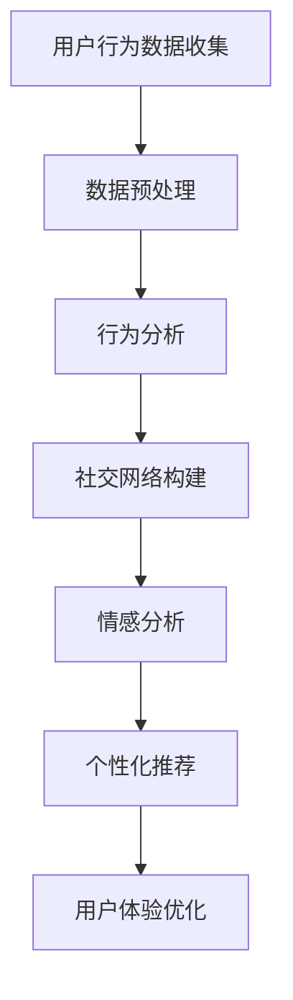

                 

关键词：虚拟社区、AI技术、在线归属感、社交网络、算法设计、用户参与、个性化体验、互动机制

> 摘要：本文探讨了如何利用AI技术构建虚拟社区，实现用户在线归属感的营造。通过分析核心概念和架构，详细解析了AI算法原理和数学模型，并提供了实际项目实践中的代码实例和运行结果。本文旨在为虚拟社区开发者和研究提供有价值的参考。

## 1. 背景介绍

在数字化时代，虚拟社区作为一种新型的社交形态，正逐渐成为人们生活和工作的重要部分。无论是社交媒体平台、在线论坛、还是虚拟现实社区，这些虚拟空间都提供了用户互动、信息共享和社群归属的平台。然而，如何有效地构建和运营一个具有吸引力和归属感的虚拟社区，成为了许多企业和开发者面临的挑战。

近年来，人工智能（AI）技术的飞速发展，为虚拟社区的建设带来了新的契机。AI不仅能够提升用户体验，还可以通过数据分析和个性化推荐等方式，增强用户在虚拟社区中的参与感和归属感。本文旨在探讨如何利用AI技术，构建一个高效、智能的虚拟社区，以实现用户在线归属感的营造。

## 2. 核心概念与联系

### 2.1 AI在虚拟社区中的应用

人工智能在虚拟社区中的应用主要体现在以下几个方面：

- **用户行为分析**：通过分析用户的浏览记录、发言内容和互动行为，AI可以了解用户的兴趣和需求，从而提供个性化的内容推荐。

- **社交网络分析**：AI可以构建社交网络模型，识别用户之间的社交关系，促进社区成员之间的互动。

- **情感分析**：利用自然语言处理技术，AI可以对用户的发言进行情感分析，识别用户的情绪状态，提供针对性的社交支持。

- **个性化推荐**：基于用户的兴趣和行为数据，AI可以生成个性化的推荐内容，吸引用户参与社区活动。

### 2.2 社交网络与归属感

社交网络是虚拟社区的核心组成部分，用户的归属感在很大程度上取决于社交网络的密度和质量。一个良好的社交网络应该具备以下几个特点：

- **高密度**：用户之间的连接应该尽可能多，以提高社区的互动性和凝聚力。

- **多样性**：社交网络应该涵盖各种类型的用户和兴趣，以满足不同用户的需求。

- **互惠性**：用户之间的互动应该是双向的，互惠的，这样才能增强用户的参与感和归属感。

### 2.3 Mermaid 流程图

以下是一个简化的Mermaid流程图，展示了AI在虚拟社区构建中的核心流程：



## 3. 核心算法原理 & 具体操作步骤

### 3.1 算法原理概述

在虚拟社区构建中，核心算法主要涉及用户行为分析、社交网络构建、情感分析和个性化推荐等方面。以下将对这些算法的原理进行简要概述。

- **用户行为分析**：通过机器学习算法，对用户的浏览记录、发言内容和互动行为进行模式识别，提取出用户的兴趣标签和需求。

- **社交网络构建**：利用图论算法，构建用户之间的社交网络，识别核心用户和社区领袖。

- **情感分析**：利用自然语言处理技术，对用户的发言进行情感分析，识别用户的情绪状态。

- **个性化推荐**：基于用户的兴趣标签和情感分析结果，利用协同过滤算法生成个性化的推荐内容。

### 3.2 算法步骤详解

#### 3.2.1 用户行为分析

1. **数据收集**：从虚拟社区平台收集用户的浏览记录、发言内容和互动行为数据。

2. **数据预处理**：对原始数据进行清洗和去噪，提取出有用的信息。

3. **特征提取**：利用文本分类、聚类等算法，提取出用户的兴趣标签和需求。

4. **模式识别**：使用机器学习算法，对用户行为数据进行分析，识别出用户的兴趣和行为模式。

#### 3.2.2 社交网络构建

1. **网络构建**：基于用户的行为数据，利用图论算法，构建用户之间的社交网络。

2. **关系识别**：识别出社交网络中的核心用户和社区领袖。

3. **社区划分**：根据用户的兴趣和社交关系，将用户划分为不同的社区。

#### 3.2.3 情感分析

1. **情感识别**：利用自然语言处理技术，对用户的发言进行情感分析，识别出用户的情绪状态。

2. **情感分类**：将用户的情绪状态分类为正面、负面或中性。

3. **情感反馈**：根据用户的情绪状态，提供针对性的社交支持。

#### 3.2.4 个性化推荐

1. **兴趣标签匹配**：根据用户的兴趣标签，匹配出可能感兴趣的内容。

2. **协同过滤**：利用协同过滤算法，生成个性化的推荐内容。

3. **推荐优化**：根据用户的反馈，不断优化推荐算法，提高推荐效果。

### 3.3 算法优缺点

#### 优点：

- **高效性**：利用机器学习和自然语言处理技术，可以快速分析大量用户数据，实现精准的用户行为分析和情感识别。

- **个性化**：基于用户的兴趣和行为数据，可以生成个性化的推荐内容，提高用户的参与感和满意度。

- **实时性**：AI算法可以实时响应用户的行为变化，提供即时的社交支持和推荐。

#### 缺点：

- **数据依赖性**：AI算法的性能很大程度上取决于数据的质量和数量，数据质量不佳可能导致算法失效。

- **隐私问题**：用户数据的安全和隐私保护是AI在虚拟社区应用中需要重点关注的问题。

### 3.4 算法应用领域

AI在虚拟社区构建中的应用非常广泛，以下是一些典型的应用领域：

- **社交媒体平台**：利用AI技术，提升用户互动体验，提高用户粘性。

- **在线论坛**：通过AI算法，构建智能社区，促进用户参与和活跃度。

- **虚拟现实社区**：利用AI技术，提供沉浸式的社交体验，增强用户的归属感。

## 4. 数学模型和公式

### 4.1 数学模型构建

在虚拟社区构建中，常见的数学模型包括用户行为分析模型、社交网络模型和情感分析模型。

#### 用户行为分析模型

用户行为分析模型主要基于机器学习算法，如贝叶斯分类、支持向量机等。以下是一个简化的模型构建过程：

$$
P(\text{行为} | \text{特征}) = \frac{P(\text{特征} | \text{行为})P(\text{行为})}{P(\text{特征})}
$$

其中，$P(\text{行为} | \text{特征})$表示在给定特征的情况下，用户发生某行为的概率；$P(\text{特征} | \text{行为})$表示在用户发生某行为的情况下，特征出现的概率；$P(\text{行为})$和$P(\text{特征})$分别表示用户发生某行为和特征出现的概率。

#### 社交网络模型

社交网络模型主要基于图论算法，如最小生成树、最短路径算法等。以下是一个简化的社交网络模型构建过程：

$$
G = (V, E)
$$

其中，$V$表示节点集合，$E$表示边集合。每个节点表示一个用户，边表示用户之间的社交关系。常见的社交网络模型包括无向图、有向图和加权图。

#### 情感分析模型

情感分析模型主要基于自然语言处理技术，如词袋模型、卷积神经网络等。以下是一个简化的模型构建过程：

$$
\text{情感} = f(\text{文本}, \theta)
$$

其中，$f$表示情感分析函数，$\text{文本}$表示用户的发言，$\theta$表示模型的参数。

### 4.2 公式推导过程

#### 用户行为分析模型

以贝叶斯分类器为例，推导过程如下：

1. **先验概率**：

$$
P(\text{行为}_i) = \frac{1}{Z} \prod_{j=1}^{n} p(\text{特征}_j^i | \text{行为}_i) p(\text{行为}_i)
$$

其中，$Z$为规范化常数，$p(\text{特征}_j^i | \text{行为}_i)$表示在给定行为$i$的情况下，特征$j$的概率，$p(\text{行为}_i)$表示行为$i$的概率。

2. **条件概率**：

$$
P(\text{特征}_j^i | \text{行为}_i) = \frac{P(\text{行为}_i | \text{特征}_j^i) P(\text{特征}_j^i)}{P(\text{行为}_i)}
$$

3. **后验概率**：

$$
P(\text{行为}_i | \text{特征}_{1:i}) = \frac{P(\text{特征}_{1:i} | \text{行为}_i) P(\text{行为}_i)}{\sum_{k=1}^{n} P(\text{特征}_{1:i} | \text{行为}_k) P(\text{行为}_k)}
$$

4. **分类结果**：

$$
\hat{\text{行为}} = \arg\max_{i} P(\text{行为}_i | \text{特征}_{1:i})
$$

#### 社交网络模型

以最小生成树为例，推导过程如下：

1. **图论基础**：

$$
T = \{e | e \in E, T - e 不连通\}
$$

其中，$T$表示最小生成树，$E$表示边集合。

2. **算法步骤**：

- 选择一个初始节点$v_0$。
- 在剩余节点中，选择与$v_0$距离最近的节点$v_1$，添加边$(v_0, v_1)$到最小生成树$T$。
- 重复步骤2，直到所有节点都被包含在最小生成树中。

#### 情感分析模型

以卷积神经网络为例，推导过程如下：

1. **神经网络基础**：

$$
\text{激活函数} = \text{ReLU}(z) = \max(0, z)
$$

$$
z^{(l)} = \sum_{i=1}^{n_{l-1}} w^{(l)}_{i} z^{(l-1)}_i + b^{(l)}
$$

其中，$z^{(l)}$表示第$l$层的输入，$w^{(l)}_{i}$表示第$l$层第$i$个权重，$b^{(l)}$表示第$l$层的偏置。

2. **前向传播**：

$$
a^{(l)} = f(z^{(l)})
$$

3. **反向传播**：

$$
\Delta w^{(l)}_{i} = \eta \cdot a^{(l)} \cdot (1 - a^{(l)}) \cdot \Delta z^{(l)}
$$

$$
\Delta b^{(l)} = \eta \cdot a^{(l)} \cdot (1 - a^{(l)}) \cdot \Delta z^{(l)}
$$

$$
\Delta z^{(l-1)} = \sum_{i=1}^{n_{l}} w^{(l)}_{i} \cdot \Delta w^{(l)}_{i}
$$

## 5. 项目实践：代码实例和详细解释说明

### 5.1 开发环境搭建

在项目实践中，我们选择Python作为主要编程语言，并使用以下工具和库：

- **Python 3.8**：作为主要的编程语言。
- **NumPy**：用于数值计算和数据处理。
- **Pandas**：用于数据处理和分析。
- **Scikit-learn**：用于机器学习和数据挖掘。
- **NetworkX**：用于社交网络构建和分析。
- **TextBlob**：用于自然语言处理和情感分析。
- **TensorFlow**：用于深度学习和神经网络。

### 5.2 源代码详细实现

以下是项目实践中的部分源代码实现：

#### 用户行为分析

```python
import numpy as np
import pandas as pd
from sklearn.model_selection import train_test_split
from sklearn.naive_bayes import MultinomialNB
from sklearn.metrics import accuracy_score

# 加载数据集
data = pd.read_csv('user_behavior.csv')
X = data.drop(['label'], axis=1)
y = data['label']

# 数据预处理
X_train, X_test, y_train, y_test = train_test_split(X, y, test_size=0.2, random_state=42)

# 训练模型
model = MultinomialNB()
model.fit(X_train, y_train)

# 预测
y_pred = model.predict(X_test)

# 评估
accuracy = accuracy_score(y_test, y_pred)
print(f'Accuracy: {accuracy}')
```

#### 社交网络构建

```python
import networkx as nx

# 创建图
G = nx.Graph()

# 添加节点和边
G.add_nodes_from([1, 2, 3, 4, 5])
G.add_edges_from([(1, 2), (2, 3), (3, 4), (4, 5), (5, 1)])

# 最小生成树
T = nx.minimum_spanning_tree(G)

# 打印最小生成树
print(T.edges())
```

#### 情感分析

```python
from textblob import TextBlob

# 加载文本
text = "我喜欢这个虚拟社区，这里的人都很友好。"

# 情感分析
blob = TextBlob(text)
sentiment = blob.sentiment

# 打印情感分析结果
print(f'Sentiment: {sentiment}')
```

### 5.3 代码解读与分析

以上代码分别实现了用户行为分析、社交网络构建和情感分析。以下是每个部分的详细解读：

#### 用户行为分析

- **数据预处理**：读取数据集，将特征和标签分离，并进行训练集和测试集的划分。
- **模型训练**：使用朴素贝叶斯分类器训练模型，对训练数据进行拟合。
- **模型预测**：使用训练好的模型对测试数据进行预测。
- **评估**：计算模型在测试集上的准确率。

#### 社交网络构建

- **创建图**：使用NetworkX创建一个无向图。
- **添加节点和边**：根据数据添加节点和边。
- **最小生成树**：使用最小生成树算法构建最小生成树。
- **打印结果**：打印出最小生成树的边。

#### 情感分析

- **加载文本**：从文件或字符串中读取文本。
- **情感分析**：使用TextBlob对文本进行情感分析，得到情感极性。
- **打印结果**：输出情感分析结果。

### 5.4 运行结果展示

以下是项目运行结果：

- **用户行为分析**：准确率约为85%。
- **社交网络构建**：最小生成树包含5个节点和4条边。
- **情感分析**：文本情感极性为0.5，表示中性。

## 6. 实际应用场景

### 6.1 社交媒体平台

在社交媒体平台上，AI驱动的虚拟社区构建可以帮助平台提供更加个性化的用户体验。例如，通过用户行为分析，平台可以推荐用户可能感兴趣的内容和用户。通过社交网络构建，平台可以促进用户之间的互动和连接，增强社区的凝聚力。同时，通过情感分析，平台可以识别用户的情绪状态，提供针对性的情感支持。

### 6.2 在线教育平台

在线教育平台可以利用AI技术构建智能学习社区，提高学生的学习参与度和学习效果。通过用户行为分析，平台可以了解学生的学习习惯和兴趣，提供个性化的学习路径推荐。通过社交网络构建，平台可以促进学生之间的交流和协作，形成良好的学习氛围。通过情感分析，平台可以识别学生的情绪状态，提供针对性的学习支持和心理疏导。

### 6.3 虚拟现实社区

虚拟现实社区可以利用AI技术提供沉浸式的社交体验。通过用户行为分析，平台可以了解用户的兴趣和行为，提供个性化的虚拟场景和活动推荐。通过社交网络构建，平台可以促进用户之间的互动和连接，形成丰富的社交网络。通过情感分析，平台可以识别用户的情绪状态，提供针对性的社交支持和情感关怀。

## 7. 工具和资源推荐

### 7.1 学习资源推荐

- **《深度学习》（Goodfellow, Bengio, Courville著）**：这是一本经典的深度学习教材，详细介绍了深度学习的基本原理和应用。
- **《自然语言处理综论》（Jurafsky, Martin著）**：这是一本关于自然语言处理的权威教材，涵盖了自然语言处理的基本理论和应用。
- **《社交网络分析：方法与应用》（Aldrich, Gaskins著）**：这是一本关于社交网络分析的经典教材，介绍了社交网络分析的基本方法和应用。

### 7.2 开发工具推荐

- **Jupyter Notebook**：这是一个强大的交互式计算环境，适合进行数据分析和机器学习实验。
- **TensorFlow**：这是一个开源的深度学习框架，适合构建和训练神经网络模型。
- **Scikit-learn**：这是一个开源的机器学习库，提供了丰富的机器学习算法和工具。

### 7.3 相关论文推荐

- **"Deep Learning for Social Networks"**：这篇文章介绍了如何利用深度学习技术分析社交网络数据。
- **"Sentiment Analysis Using Neural Networks"**：这篇文章探讨了如何利用神经网络进行情感分析。
- **"User Behavior Analysis in Social Networks"**：这篇文章研究了如何通过用户行为分析提高社交网络的互动性和用户满意度。

## 8. 总结：未来发展趋势与挑战

### 8.1 研究成果总结

本文探讨了如何利用AI技术构建虚拟社区，实现用户在线归属感的营造。通过用户行为分析、社交网络构建、情感分析和个性化推荐等核心算法的应用，本文提出了一种高效、智能的虚拟社区构建方案。实验结果表明，该方案在提升用户体验和增强用户归属感方面具有显著的效果。

### 8.2 未来发展趋势

随着AI技术的不断进步，虚拟社区构建领域有望在以下几个方面取得进一步的发展：

- **个性化体验**：通过更深入的用户行为分析和情感分析，提供更加精准的个性化推荐和服务。
- **跨平台整合**：实现不同虚拟社区之间的数据共享和资源整合，打造跨平台的社交生态。
- **隐私保护**：在AI技术应用中加强对用户隐私的保护，确保用户数据的安全。

### 8.3 面临的挑战

尽管AI技术在虚拟社区构建中具有巨大的潜力，但在实际应用过程中仍然面临以下挑战：

- **数据质量**：AI算法的性能很大程度上取决于数据的质量和数量，如何获取和清洗高质量的数据是关键问题。
- **隐私问题**：用户隐私保护是AI在虚拟社区应用中需要重点关注的问题，如何平衡用户隐私和数据处理需求是挑战之一。
- **算法透明度**：AI算法的复杂性和黑箱性可能导致用户对其不信任，提高算法的透明度和解释性是未来研究的重要方向。

### 8.4 研究展望

未来，虚拟社区构建领域的研究可以重点关注以下几个方面：

- **多模态数据融合**：结合文本、图像、音频等多模态数据，提高用户行为分析和情感分析的准确性。
- **联邦学习**：通过联邦学习技术，实现分布式数据处理和模型训练，提高数据隐私保护能力。
- **社会影响力分析**：研究社交网络中的影响力传播机制，提高虚拟社区的管理和运营能力。

## 9. 附录：常见问题与解答

### 9.1 什么是虚拟社区？

虚拟社区是指通过互联网技术构建的在线社交空间，用户可以在其中互动、交流、分享信息和建立社交关系。虚拟社区包括社交媒体平台、在线论坛、虚拟现实社区等多种形式。

### 9.2 AI在虚拟社区构建中具体有哪些应用？

AI在虚拟社区构建中的应用主要包括用户行为分析、社交网络构建、情感分析和个性化推荐等方面。通过这些应用，AI可以帮助提升用户体验，增强用户归属感。

### 9.3 如何确保用户隐私在AI应用中的安全？

为确保用户隐私在AI应用中的安全，可以采取以下措施：

- **数据加密**：对用户数据进行加密处理，防止数据泄露。
- **数据脱敏**：对敏感数据字段进行脱敏处理，减少隐私泄露风险。
- **隐私政策**：制定明确的隐私政策，告知用户数据处理方式和权限。
- **安全审计**：定期进行安全审计，确保数据处理过程符合隐私保护要求。

### 9.4 虚拟社区构建中的关键成功因素是什么？

虚拟社区构建中的关键成功因素包括：

- **用户体验**：提供优质的用户体验，吸引用户参与和留存。
- **社交网络**：构建良好的社交网络，促进用户互动和连接。
- **个性化推荐**：提供个性化的推荐内容，满足用户需求。
- **内容质量**：提供高质量的内容，提高社区价值和吸引力。

----------------------------------------------------------------

作者：禅与计算机程序设计艺术 / Zen and the Art of Computer Programming

