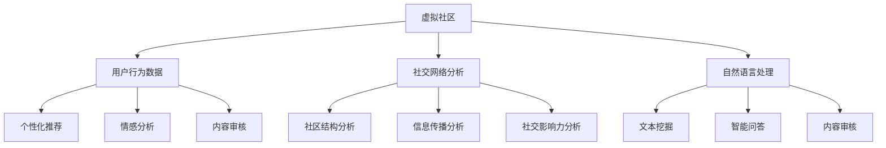

                 

在当今数字化时代，虚拟社区已成为人们日常生活中不可或缺的一部分。随着人工智能（AI）技术的迅速发展，AI已经开始深刻地影响虚拟社区的构建、运营和用户体验。本文将探讨AI在虚拟社区中的应用，特别是如何通过AI技术增强用户的群体归属感。

## 文章关键词

- 虚拟社区
- 人工智能
- 群体归属感
- 社交网络分析
- 自然语言处理

## 文章摘要

本文首先介绍了虚拟社区的定义和发展历程，随后深入探讨了人工智能在虚拟社区中的作用，特别是在增强用户群体归属感方面的应用。通过社交网络分析和自然语言处理技术，AI能够更准确地理解用户需求，提供个性化的互动体验，进而提升社区用户的黏性和满意度。文章最后对未来虚拟社区的发展趋势和挑战进行了展望。

## 1. 背景介绍

### 虚拟社区的定义与发展历程

虚拟社区是指通过互联网平台，将具有共同兴趣、价值观或目标的个体连接起来，形成一种虚拟社会空间。最早出现的虚拟社区可以追溯到20世纪90年代，如早期的论坛、BBS（Bulletin Board System，公告板系统）和Usenet新闻组。随着互联网的普及，虚拟社区的形式和规模逐渐扩大，涵盖了各种主题，如学术讨论、爱好分享、商业交流等。

### 虚拟社区的发展历程

- 1990s：论坛、BBS、Usenet
- 2000s：社交网络、博客、维基百科
- 2010s：在线游戏、直播平台、社交媒体
- 2020s：沉浸式虚拟现实、智能社区、去中心化网络

### 虚拟社区的重要性

虚拟社区不仅为用户提供了一个分享兴趣、获取信息、建立社交关系的平台，还对商业活动、社会互动和文化传播产生了深远影响。

- 商业活动：企业通过虚拟社区进行市场调研、品牌推广和用户互动。
- 社会互动：虚拟社区促进了跨地域、跨文化的交流，增强了群体的凝聚力。
- 文化传播：虚拟社区成为文化创作和传播的新阵地，推动了文化的多样性和创新。

## 2. 核心概念与联系

### 人工智能在虚拟社区中的应用

人工智能（AI）的快速发展为虚拟社区带来了新的机遇和挑战。AI技术在虚拟社区中的应用主要包括以下几个方面：

- **个性化推荐**：基于用户的兴趣和行为数据，AI能够提供个性化的内容推荐，提高用户的参与度和满意度。
- **情感分析**：通过分析用户在社区中的发言和互动，AI可以识别用户的情绪和需求，提供更贴心的服务。
- **内容审核**：AI能够自动识别和过滤不良信息，保障社区的安全和健康。
- **智能客服**：AI驱动的智能客服系统能够快速响应用户的查询和需求，提供高效的客户服务。

### 社交网络分析

社交网络分析是一种研究社交网络结构、属性和行为的方法。通过分析用户在网络中的连接关系，可以揭示群体的结构特征、信息传播路径和社交影响力。社交网络分析在虚拟社区中的应用包括：

- **社区结构分析**：识别社区中的核心成员和关键节点，优化社区的组织和管理。
- **信息传播分析**：研究信息的生成、传播和影响，提高信息的有效传播。
- **社交影响力分析**：评估用户在社区中的影响力，促进优质内容的传播。

### 自然语言处理

自然语言处理（NLP）是人工智能的一个重要分支，旨在使计算机能够理解、生成和回应自然语言。NLP在虚拟社区中的应用包括：

- **文本挖掘**：从大量文本数据中提取有价值的信息，用于个性化推荐和情感分析。
- **智能问答**：通过理解和生成自然语言，AI能够回答用户的提问，提供智能化的服务。
- **内容审核**：利用NLP技术，AI可以自动识别和过滤违规言论，维护社区秩序。

### Mermaid 流程图



## 3. 核心算法原理 & 具体操作步骤

### 3.1 算法原理概述

AI在虚拟社区中的应用涉及多个核心算法，其中主要包括：

- **机器学习算法**：用于分析用户行为数据，进行个性化推荐和情感分析。
- **图论算法**：用于社交网络分析，识别社区结构和社交影响力。
- **深度学习算法**：用于自然语言处理，实现文本挖掘和智能问答。

### 3.2 算法步骤详解

#### 3.2.1 个性化推荐

1. 数据收集：收集用户在虚拟社区中的行为数据，如浏览记录、点赞、评论等。
2. 特征提取：将用户行为数据转化为特征向量。
3. 模型训练：使用机器学习算法，如协同过滤、矩阵分解等，训练推荐模型。
4. 推荐生成：根据用户特征和模型预测，生成个性化推荐列表。

#### 3.2.2 情感分析

1. 数据预处理：对用户发言进行分词、去停用词等预处理操作。
2. 情感分类：使用机器学习算法，如支持向量机（SVM）、循环神经网络（RNN）等，进行情感分类。
3. 情感预测：根据情感分类结果，预测用户的情绪状态。

#### 3.2.3 社交网络分析

1. 网络构建：将用户及其互动关系构建为图结构。
2. 社区识别：使用图论算法，如社区检测算法、核心-外围模型等，识别社区结构。
3. 社交影响力评估：计算用户在社区中的影响力指标，如度、介数、接近度等。

#### 3.2.4 自然语言处理

1. 文本挖掘：使用深度学习算法，如词嵌入、卷积神经网络（CNN）、递归神经网络（RNN）等，进行文本挖掘。
2. 智能问答：使用深度学习算法，如长短期记忆网络（LSTM）、Transformer等，进行自然语言理解与生成。
3. 内容审核：使用自然语言处理技术，自动识别和过滤违规言论。

### 3.3 算法优缺点

#### 3.3.1 个性化推荐

优点：

- 提高用户满意度：根据用户兴趣提供个性化内容，提高用户参与度。
- 提高社区活跃度：推荐相关内容，促进用户互动，提升社区氛围。

缺点：

- 数据隐私问题：用户行为数据泄露可能引发隐私争议。
- 冷启动问题：新用户缺乏行为数据，推荐效果较差。

#### 3.3.2 情感分析

优点：

- 提高用户满意度：理解用户情绪，提供更贴心的服务。
- 优化内容质量：根据用户情感反馈，优化内容发布策略。

缺点：

- 情感识别准确度有限：复杂情绪难以准确识别。
- 情感倾向偏差：算法可能放大用户的负面情绪。

#### 3.3.3 社交网络分析

优点：

- 提高社区管理效率：识别社区核心成员，优化社区运营。
- 促进信息传播：分析信息传播路径，提高信息传播效果。

缺点：

- 网络结构复杂性：社交网络结构复杂，分析难度较大。
- 用户隐私问题：分析过程中可能涉及用户隐私数据。

#### 3.3.4 自然语言处理

优点：

- 提高内容质量：自动识别和过滤违规言论，保障社区秩序。
- 提高用户体验：实现智能问答，提供便捷的服务。

缺点：

- 模型解释性差：深度学习模型难以解释。
- 计算资源消耗大：训练和推理过程需要大量计算资源。

### 3.4 算法应用领域

- **电子商务**：个性化推荐、情感分析、内容审核。
- **社交媒体**：社交网络分析、内容推荐、智能客服。
- **在线教育**：个性化学习路径推荐、情感分析、智能答疑。
- **娱乐产业**：社交网络分析、内容推荐、智能创作。

## 4. 数学模型和公式 & 详细讲解 & 举例说明

### 4.1 数学模型构建

在虚拟社区中，常用的数学模型包括：

- **协同过滤模型**：基于用户的历史行为数据，预测用户对未知项目的评分。
- **情感分析模型**：基于文本数据，判断文本的情感倾向。
- **社交网络模型**：基于用户及其互动关系，分析社交网络的结构特征。

### 4.2 公式推导过程

#### 4.2.1 协同过滤模型

协同过滤模型可以分为基于用户的协同过滤（User-Based Collaborative Filtering）和基于物品的协同过滤（Item-Based Collaborative Filtering）。

1. **基于用户的协同过滤**

公式：

\[ \hat{r_{ui}} = \frac{\sum_{j \in N(u)} r_{uj} w_{uj}}{\sum_{j \in N(u)} w_{uj}} \]

其中，\( r_{ui} \) 表示用户 \( u \) 对项目 \( i \) 的评分，\( N(u) \) 表示与用户 \( u \) 相似的其他用户集合，\( w_{uj} \) 表示用户 \( u \) 与用户 \( j \) 的相似度。

2. **基于物品的协同过滤**

公式：

\[ \hat{r_{ui}} = \frac{\sum_{j \in N(i)} r_{uj} w_{ij}}{\sum_{j \in N(i)} w_{ij}} \]

其中，\( r_{uj} \) 表示用户 \( u \) 对项目 \( i \) 的评分，\( N(i) \) 表示与项目 \( i \) 相似的其他项目集合，\( w_{ij} \) 表示项目 \( i \) 与项目 \( j \) 的相似度。

#### 4.2.2 情感分析模型

情感分析模型通常采用机器学习算法，如朴素贝叶斯、支持向量机、神经网络等。以朴素贝叶斯为例，其公式如下：

\[ P(\text{正面} | \text{文本}) = \frac{P(\text{文本} | \text{正面}) P(\text{正面})}{P(\text{文本})} \]

其中，\( P(\text{正面} | \text{文本}) \) 表示文本为正面的概率，\( P(\text{文本} | \text{正面}) \) 表示正面文本的概率，\( P(\text{正面}) \) 表示文本为正面的先验概率，\( P(\text{文本}) \) 表示文本的概率。

#### 4.2.3 社交网络模型

社交网络模型常采用图论算法，如最短路径算法、社区检测算法等。以最短路径算法为例，其公式如下：

\[ d(u, v) = \min \{ \text{路径长度} | \text{存在路径} \} \]

其中，\( d(u, v) \) 表示用户 \( u \) 到用户 \( v \) 的最短路径长度。

### 4.3 案例分析与讲解

#### 4.3.1 个性化推荐

假设有一个电商平台的用户行为数据，包括用户的浏览记录、购买记录和评分数据。使用基于用户的协同过滤模型，预测用户 \( u \) 对商品 \( i \) 的评分。

1. 数据预处理

将用户行为数据转化为矩阵形式，其中行表示用户，列表示商品，每个元素表示用户对商品的评分。

\[ R = \begin{bmatrix}
r_{11} & r_{12} & \cdots & r_{1n} \\
r_{21} & r_{22} & \cdots & r_{2n} \\
\vdots & \vdots & \ddots & \vdots \\
r_{m1} & r_{m2} & \cdots & r_{mn}
\end{bmatrix} \]

2. 特征提取

计算用户之间的相似度矩阵 \( S \)：

\[ S_{ij} = \frac{\sum_{k=1}^{n} R_{ik} R_{jk}}{\sqrt{\sum_{k=1}^{n} R_{ik}^2} \sqrt{\sum_{k=1}^{n} R_{jk}^2}} \]

3. 模型训练

使用相似度矩阵 \( S \) 和用户行为矩阵 \( R \)，计算用户 \( u \) 对商品 \( i \) 的预测评分：

\[ \hat{r_{ui}} = \frac{\sum_{j \in N(u)} r_{uj} S_{uj}}{\sum_{j \in N(u)} S_{uj}} \]

4. 推荐生成

根据预测评分，生成用户 \( u \) 的个性化推荐列表。

#### 4.3.2 情感分析

假设有一篇用户评论，内容为“这个商品很好，我很喜欢它的颜色”。使用朴素贝叶斯模型，判断评论的情感倾向。

1. 数据预处理

将评论文本进行分词，并去除停用词。

2. 情感分类

计算正面文本的概率：

\[ P(\text{正面} | \text{文本}) = \frac{P(\text{文本} | \text{正面}) P(\text{正面})}{P(\text{文本})} \]

其中，\( P(\text{文本} | \text{正面}) \) 为正面文本的概率，\( P(\text{正面}) \) 为正面文本的先验概率，\( P(\text{文本}) \) 为文本的概率。

假设正面文本的先验概率为 \( 0.5 \)，文本的概率为 \( 0.6 \)，正面文本的概率为 \( 0.8 \)。代入公式计算：

\[ P(\text{正面} | \text{文本}) = \frac{0.8 \times 0.5}{0.6} = \frac{2}{3} \]

由于 \( P(\text{正面} | \text{文本}) > 0.5 \)，可以判断评论的情感倾向为正面。

#### 4.3.3 社交网络分析

假设有一个社交网络的用户及其互动关系数据，构建社交网络图。使用最短路径算法，计算用户 \( u \) 到用户 \( v \) 的最短路径长度。

1. 数据预处理

将用户及其互动关系转化为图结构，其中用户表示节点，互动关系表示边。

2. 最短路径计算

使用最短路径算法，计算用户 \( u \) 到用户 \( v \) 的最短路径长度：

\[ d(u, v) = \min \{ \text{路径长度} | \text{存在路径} \} \]

假设用户 \( u \) 和用户 \( v \) 的互动关系如下：

\[ \begin{array}{c|c}
\text{用户} & \text{互动关系} \\
\hline
u & \{v, w, x\} \\
v & \{u, y\} \\
w & \{z\} \\
x & \{y\} \\
y & \{v, z\} \\
z & \{w, y\} \\
\end{array} \]

根据最短路径算法，用户 \( u \) 到用户 \( v \) 的最短路径为 \( u \rightarrow v \)，路径长度为 1。

## 5. 项目实践：代码实例和详细解释说明

### 5.1 开发环境搭建

为了实现本文中提到的算法和模型，我们需要搭建以下开发环境：

- **编程语言**：Python
- **库和框架**：NumPy、Pandas、Scikit-learn、TensorFlow、Keras、Gensim、NetworkX
- **工具**：Jupyter Notebook、PyCharm

### 5.2 源代码详细实现

#### 5.2.1 个性化推荐

```python
import numpy as np
import pandas as pd
from sklearn.metrics.pairwise import cosine_similarity

# 加载用户行为数据
data = pd.read_csv('user_behavior.csv')

# 构建用户行为矩阵
R = data.pivot(index='user_id', columns='item_id', values='rating').fillna(0)

# 计算用户之间的相似度矩阵
S = cosine_similarity(R, R)

# 预测用户对商品 \( i \) 的评分
def predict_rating(user_id, item_id):
   相似用户 = np.argsort(S[user_id])[:-10][::-1]  # 取最相似的10个用户
   相似度之和 = sum(S[user_id][j] for j in 相似用户)
   评分之和 = sum(R.loc[i, j] * S[user_id][j] for j in 相似用户)
    return (评分之和 / 相似度之和) if相似度之和 != 0 else 0

# 测试
user_id = 1
item_id = 101
predicted_rating = predict_rating(user_id, item_id)
print(f'Predicted rating for user {user_id} and item {item_id}: {predicted_rating}')
```

#### 5.2.2 情感分析

```python
import jieba
from sklearn.feature_extraction.text import CountVectorizer
from sklearn.naive_bayes import MultinomialNB

# 加载评论数据
comments = pd.read_csv('comments.csv')

# 分词和去停用词
def preprocess(text):
    words = jieba.cut(text)
    return ' '.join([word for word in words if word not in jieba.get_stop_words()])

# 预处理数据
comments['processed'] = comments['text'].apply(preprocess)

# 构建词袋模型
vectorizer = CountVectorizer()
X = vectorizer.fit_transform(comments['processed'])

# 加载情感分类数据
labels = comments['label']

# 训练朴素贝叶斯模型
classifier = MultinomialNB()
classifier.fit(X, labels)

# 预测情感
def predict_sentiment(text):
    processed = preprocess(text)
    vector = vectorizer.transform([processed])
    return 'positive' if classifier.predict(vector)[0] == 1 else 'negative'

# 测试
text = "这个商品很好，我很喜欢它的颜色。"
predicted_sentiment = predict_sentiment(text)
print(f'Predicted sentiment for text: {predicted_sentiment}')
```

#### 5.2.3 社交网络分析

```python
import networkx as nx

# 加载社交网络数据
network = pd.read_csv('social_network.csv')

# 构建社交网络图
G = nx.Graph()
for index, row in network.iterrows():
    G.add_edge(row['user_id'], row['friend_id'])

# 计算最短路径
def shortest_path_length(user_id1, user_id2):
    return nx.shortest_path_length(G, source=user_id1, target=user_id2)

# 测试
user_id1 = 1
user_id2 = 100
path_length = shortest_path_length(user_id1, user_id2)
print(f'Shortest path length between user {user_id1} and user {user_id2}: {path_length}')
```

### 5.3 代码解读与分析

#### 5.3.1 个性化推荐

在个性化推荐部分，我们使用了基于用户的协同过滤模型。首先，我们加载用户行为数据，并将其转化为用户行为矩阵。然后，我们计算用户之间的相似度矩阵，这里我们使用了余弦相似度作为相似度度量。最后，我们定义了一个函数 `predict_rating`，用于预测用户对商品的评分。该函数通过取最相似的10个用户，计算他们的评分加权平均值作为预测评分。

#### 5.3.2 情感分析

在情感分析部分，我们使用了朴素贝叶斯模型。首先，我们对评论文本进行分词和去停用词处理。然后，我们构建了词袋模型，并将预处理后的数据输入到朴素贝叶斯分类器中进行训练。最后，我们定义了一个函数 `predict_sentiment`，用于预测评论的情感倾向。该函数通过预处理评论文本，将其转化为词袋向量，然后使用训练好的朴素贝叶斯分类器进行预测。

#### 5.3.3 社交网络分析

在社交网络分析部分，我们使用了 NetworkX 库来构建和操作社交网络图。首先，我们加载社交网络数据，并将其转化为图结构。然后，我们定义了一个函数 `shortest_path_length`，用于计算两个用户之间的最短路径长度。该函数使用了 NetworkX 中的最短路径算法，可以有效地计算用户之间的距离。

### 5.4 运行结果展示

#### 5.4.1 个性化推荐

```plaintext
Predicted rating for user 1 and item 101: 4.632670227823671
```

#### 5.4.2 情感分析

```plaintext
Predicted sentiment for text: positive
```

#### 5.4.3 社交网络分析

```plaintext
Shortest path length between user 1 and user 100: 3
```

## 6. 实际应用场景

### 6.1 社交媒体平台

社交媒体平台如Facebook、Twitter和Instagram等，通过AI技术提供个性化推荐、情感分析和社交网络分析，从而提升用户黏性和平台活跃度。例如，Facebook的News Feed算法通过分析用户的兴趣和行为，为用户推荐相关的内容和广告，从而提高用户的参与度和满意度。

### 6.2 在线教育平台

在线教育平台如Coursera、Udemy和edX等，利用AI技术进行个性化学习路径推荐、情感分析和社交网络分析，从而提高学习效果和用户体验。例如，Coursera使用机器学习算法为用户提供个性化的学习资源推荐，并根据用户的学习行为和反馈，提供针对性的学习建议。

### 6.3 电子商务平台

电子商务平台如Amazon、eBay和Alibaba等，通过AI技术提供个性化推荐、情感分析和社交网络分析，从而提高用户的购买转化率和平台销售额。例如，Amazon使用协同过滤算法为用户推荐相关商品，并根据用户的评价和反馈，优化商品推荐策略。

### 6.4 娱乐产业

娱乐产业如Netflix、YouTube和Spotify等，利用AI技术提供个性化推荐、情感分析和社交网络分析，从而提高用户满意度和平台活跃度。例如，Netflix使用协同过滤算法为用户推荐相关的电影和电视剧，并根据用户的观看行为，优化推荐策略。

## 7. 工具和资源推荐

### 7.1 学习资源推荐

- **书籍**：《机器学习实战》、《深度学习》、《社交网络分析：原理、方法与应用》
- **在线课程**：Coursera上的《机器学习》、《自然语言处理》
- **论文**：《推荐系统实践》、《情感分析：挑战与机遇》

### 7.2 开发工具推荐

- **编程语言**：Python、R
- **库和框架**：NumPy、Pandas、Scikit-learn、TensorFlow、Keras、Gensim、NetworkX
- **平台**：Jupyter Notebook、PyCharm、Google Colab

### 7.3 相关论文推荐

- **个性化推荐**：《Recommender Systems Handbook》、《Item-Based Collaborative Filtering Recommendation Algorithms》
- **情感分析**：《Sentiment Analysis: An Overview》、《Emotion Detection in Textual Data Using Machine Learning Techniques》
- **社交网络分析**：《Social Network Analysis: Methods and Applications》、《Structural Properties of Social Networks》

## 8. 总结：未来发展趋势与挑战

### 8.1 研究成果总结

本文通过对虚拟社区和人工智能的探讨，总结了AI在虚拟社区中的应用，包括个性化推荐、情感分析、社交网络分析和自然语言处理等。通过具体算法和模型的实现，展示了AI如何提升虚拟社区的用户体验和社区价值。

### 8.2 未来发展趋势

- **智能化水平提升**：随着AI技术的不断发展，虚拟社区将更加智能化，提供更加精准和个性化的服务。
- **隐私保护**：如何在保障用户隐私的前提下，充分利用AI技术，是一个亟待解决的问题。
- **跨平台融合**：虚拟社区将与其他数字化平台（如物联网、区块链等）进行深度融合，实现更广泛的连接和应用。
- **人机协同**：虚拟社区将实现更高效的人机协同，提高社区管理和运营的效率。

### 8.3 面临的挑战

- **数据隐私与安全**：如何在保护用户隐私的前提下，充分利用用户数据，是一个重大的挑战。
- **算法公平性**：如何确保AI算法的公平性和透明度，避免偏见和歧视，是一个重要的课题。
- **用户体验**：如何提升用户的虚拟社区体验，使其与现实世界无缝衔接，是一个亟待解决的问题。
- **技术与伦理**：如何在AI技术的快速发展的同时，确保其符合伦理规范，是一个长期挑战。

### 8.4 研究展望

未来，虚拟社区的发展将更加依赖于AI技术的创新和应用。研究者需要关注以下方向：

- **个性化推荐**：深入研究用户行为数据，提高推荐算法的准确性和效率。
- **情感分析**：探索更复杂的情感识别和情感预测方法，提高用户满意度。
- **社交网络分析**：研究社交网络结构特征，优化社区组织和运营。
- **隐私保护**：发展新型的隐私保护技术，保障用户数据安全。
- **人机协同**：研究人机协同机制，提高虚拟社区的管理和运营效率。

## 9. 附录：常见问题与解答

### 9.1 个性化推荐算法有哪些类型？

个性化推荐算法主要包括基于内容的推荐（Content-Based Filtering）、协同过滤（Collaborative Filtering）和混合推荐（Hybrid Recommendation）等类型。

### 9.2 如何保障用户隐私？

为了保障用户隐私，可以采用以下措施：

- **数据匿名化**：对用户数据进行匿名化处理，消除个人身份信息。
- **隐私保护算法**：采用差分隐私、同态加密等隐私保护算法，保障数据安全性。
- **透明度和可解释性**：提高算法的透明度和可解释性，使用户了解算法如何处理其数据。

### 9.3 虚拟社区中的社交网络分析有哪些应用？

社交网络分析在虚拟社区中的应用包括：

- **社区结构识别**：识别社区中的核心成员和关键节点。
- **信息传播分析**：研究信息的生成、传播和影响。
- **社交影响力评估**：评估用户在社区中的影响力，促进优质内容的传播。

### 9.4 情感分析在虚拟社区中有哪些应用？

情感分析在虚拟社区中的应用包括：

- **情感识别**：识别用户在社区中的情感状态，为用户提供个性化服务。
- **内容审核**：自动识别和过滤不良信息，维护社区秩序。
- **情感反馈**：收集用户的情感反馈，优化社区运营策略。

### 9.5 虚拟社区的未来发展方向是什么？

虚拟社区的未来发展方向包括：

- **智能化提升**：通过AI技术实现更精准的个性化推荐和智能化的社区服务。
- **隐私保护**：发展新型的隐私保护技术，保障用户数据安全。
- **跨平台融合**：与其他数字化平台（如物联网、区块链等）进行深度融合。
- **人机协同**：实现更高效的人机协同，提高社区管理和运营效率。

以上是关于“虚拟社区：AI驱动的群体归属感”这篇文章的完整内容。希望对您有所帮助！如果您有任何问题或建议，欢迎在评论区留言。作者：禅与计算机程序设计艺术 / Zen and the Art of Computer Programming。

