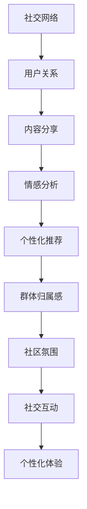

                 

关键词：虚拟社区、人工智能、群体归属感、社交网络、情感分析、算法

> 摘要：本文探讨了如何利用人工智能技术构建虚拟社区，并驱动群体归属感。通过分析现有的社交网络平台和人工智能技术的应用，提出了基于情感分析和智能推荐算法的虚拟社区构建方案，并探讨了其在实际应用中的挑战与未来发展趋势。

## 1. 背景介绍

随着互联网技术的快速发展，虚拟社区已经成为人们日常生活中不可或缺的一部分。从最初的论坛、博客，到现在的社交媒体平台，虚拟社区为人们提供了相互交流、分享信息和建立社交关系的场所。然而，随着用户数量的增加和信息的爆炸式增长，传统的虚拟社区面临着诸多挑战，如信息过载、用户流失、社交泡沫等。为了解决这些问题，人工智能技术的引入成为了必然选择。

人工智能技术，特别是机器学习和深度学习技术，为虚拟社区的发展带来了新的机遇。通过情感分析、自然语言处理、推荐系统等技术，人工智能能够更好地理解用户需求，提供个性化的内容和服务，从而提升用户的归属感和满意度。本文旨在探讨如何利用人工智能技术构建具有高度群体归属感的虚拟社区。

## 2. 核心概念与联系

### 2.1 社交网络

社交网络是指人们通过互联网进行社交互动的平台，如Facebook、Twitter、微信等。社交网络的核心是用户关系，即用户之间的连接和互动。社交网络的特点包括：

- **用户关系网络**：社交网络以用户为中心，用户之间通过好友关系、关注关系等建立连接。
- **内容分享**：用户在社交网络中分享各种形式的内容，如文字、图片、视频等。
- **实时性**：社交网络强调信息的实时传递和互动，用户可以实时获取和分享信息。

### 2.2 人工智能

人工智能（AI）是指由计算机系统模拟人类智能的过程。人工智能技术包括机器学习、深度学习、自然语言处理、计算机视觉等。在虚拟社区构建中，人工智能的主要应用包括：

- **情感分析**：通过分析用户发布的内容，识别用户的情感状态，如喜悦、愤怒、悲伤等。
- **推荐系统**：根据用户的兴趣和行为，为用户推荐相关的内容或服务。
- **自然语言处理**：理解和生成自然语言文本，用于内容分析、信息提取等。

### 2.3 群体归属感

群体归属感是指个体对于某个群体的认同感和归属感。在虚拟社区中，群体归属感表现为用户对社区的认同、参与和忠诚度。影响群体归属感的因素包括：

- **社区氛围**：社区的价值观、文化、氛围等对用户的归属感有重要影响。
- **社交互动**：用户之间的互动和交流，如点赞、评论、私信等，可以增强用户的归属感。
- **个性化体验**：根据用户的需求和行为提供个性化的内容和推荐，可以提升用户的归属感。

### 2.4 Mermaid 流程图

下面是一个简单的 Mermaid 流程图，展示了虚拟社区构建的核心概念和联系：



## 3. 核心算法原理 & 具体操作步骤

### 3.1 算法原理概述

虚拟社区构建的核心算法主要包括情感分析、推荐系统和社区氛围构建。以下分别介绍这些算法的原理和操作步骤。

### 3.2 算法步骤详解

#### 3.2.1 情感分析

情感分析是利用自然语言处理技术，分析用户发布的内容，识别其中的情感倾向。具体步骤如下：

1. **文本预处理**：对用户发布的内容进行清洗和预处理，如去除停用词、标点符号等。
2. **特征提取**：将预处理后的文本转换为计算机可以处理的特征向量，如词袋模型、TF-IDF等。
3. **情感分类**：利用机器学习算法，如朴素贝叶斯、支持向量机等，对特征向量进行分类，识别情感倾向。

#### 3.2.2 推荐系统

推荐系统是利用用户的历史行为和兴趣，为用户推荐相关的内容或服务。具体步骤如下：

1. **用户画像**：根据用户的行为和兴趣，构建用户的兴趣画像。
2. **内容特征提取**：对用户可能感兴趣的内容进行特征提取，如文本特征、图像特征等。
3. **推荐算法**：利用协同过滤、基于内容的推荐、混合推荐等算法，为用户生成推荐列表。

#### 3.2.3 社区氛围构建

社区氛围构建是通过设计和维护社区规则、价值观和文化，营造良好的社区氛围。具体步骤如下：

1. **社区规则制定**：根据社区的目标和特点，制定相应的社区规则。
2. **价值观传播**：通过社区活动、话题引导等方式，传播社区的价值观。
3. **文化营造**：通过长期的运营和维护，形成独特的社区文化。

### 3.3 算法优缺点

#### 3.3.1 情感分析

优点：

- **高效性**：能够快速分析大量用户数据，识别情感倾向。
- **准确性**：随着数据量和算法的优化，情感分析的结果越来越准确。

缺点：

- **复杂度**：情感分析涉及到文本预处理、特征提取、分类等多个环节，算法复杂度较高。
- **挑战**：对于复杂情感、歧义情感等，算法的识别准确率仍有待提高。

#### 3.3.2 推荐系统

优点：

- **个性化**：能够根据用户的历史行为和兴趣，提供个性化的内容推荐。
- **效果显著**：推荐系统能够显著提高用户满意度和参与度。

缺点：

- **依赖数据**：推荐系统依赖于大量用户数据，数据质量对推荐效果有重要影响。
- **冷启动问题**：对于新用户，推荐系统可能无法提供有效的推荐。

#### 3.3.3 社区氛围构建

优点：

- **增强归属感**：良好的社区氛围可以增强用户的归属感，提升社区活跃度。
- **长期稳定**：通过长期的运营和维护，社区氛围可以保持长期稳定。

缺点：

- **运营成本**：社区氛围构建需要大量的时间和人力资源投入。
- **规则约束**：严格的社区规则可能会限制用户的自由表达，影响社区活力。

### 3.4 算法应用领域

情感分析、推荐系统和社区氛围构建算法广泛应用于各种虚拟社区。以下是一些典型的应用领域：

- **社交媒体**：如Facebook、Twitter等，通过情感分析和推荐系统，提升用户满意度和参与度。
- **电子商务**：如Amazon、淘宝等，通过推荐系统，提高销售转化率和用户黏性。
- **在线教育**：如Coursera、Udacity等，通过情感分析和社区氛围构建，提升学习效果和用户满意度。

## 4. 数学模型和公式 & 详细讲解 & 举例说明

### 4.1 数学模型构建

在虚拟社区构建中，常用的数学模型包括情感分析模型、推荐系统模型和社区氛围模型。以下分别介绍这些模型的构建方法。

#### 4.1.1 情感分析模型

情感分析模型通常使用朴素贝叶斯、支持向量机等算法。以下是一个简单的朴素贝叶斯情感分析模型的构建过程：

1. **特征提取**：将文本转换为特征向量，如词袋模型、TF-IDF等。
2. **标签分类**：将特征向量与情感标签进行匹配，构建训练数据集。
3. **模型训练**：利用训练数据集，训练朴素贝叶斯模型。
4. **模型评估**：使用测试数据集，评估模型的准确率和召回率。

#### 4.1.2 推荐系统模型

推荐系统模型通常使用协同过滤、基于内容的推荐、混合推荐等算法。以下是一个简单的协同过滤推荐模型的构建过程：

1. **用户-物品评分矩阵**：构建用户-物品评分矩阵，记录用户对物品的评分。
2. **相似度计算**：计算用户之间的相似度，如余弦相似度、皮尔逊相似度等。
3. **推荐生成**：根据用户之间的相似度，生成推荐列表。

#### 4.1.3 社区氛围模型

社区氛围模型通常使用机器学习算法，如聚类、分类等。以下是一个简单的基于聚类的社区氛围模型构建过程：

1. **特征提取**：从社区数据中提取特征，如发帖频率、回帖数量、主题标签等。
2. **数据预处理**：对提取的特征进行标准化、归一化等处理。
3. **模型训练**：利用训练数据集，训练聚类模型，如K-means等。
4. **模型评估**：使用测试数据集，评估聚类模型的准确率和稳定性。

### 4.2 公式推导过程

以下是一个简单的情感分析模型的公式推导过程：

假设我们有一个情感分析模型，输入为特征向量X，输出为情感概率分布P(y|X)，其中y为情感标签。

1. **特征提取**：
   $$ X = [x_1, x_2, ..., x_n] $$
   其中，$x_i$为第i个特征。

2. **概率分布**：
   $$ P(y|X) = \frac{P(X|y)P(y)}{P(X)} $$
   其中，$P(X|y)$为特征向量在给定情感标签y下的条件概率，$P(y)$为情感标签y的先验概率，$P(X)$为特征向量的总体概率。

3. **特征概率**：
   $$ P(X|y) = \prod_{i=1}^{n} P(x_i|y) $$
   其中，$P(x_i|y)$为第i个特征在给定情感标签y下的概率。

4. **先验概率**：
   $$ P(y) = \frac{C(y)}{N} $$
   其中，$C(y)$为情感标签y的出现次数，$N$为总的样本数量。

5. **总体概率**：
   $$ P(X) = \sum_{y} P(X|y)P(y) $$
   其中，$y$为所有可能的情感标签。

### 4.3 案例分析与讲解

以下是一个简单的情感分析案例，我们使用朴素贝叶斯模型分析一篇微博内容的情感倾向。

**微博内容**：
$$ 好喜欢今天的阳光，感觉心情都变好了！ $$

**特征提取**：
我们将微博内容进行分词和词性标注，提取出以下特征：
$$ 阳光，心情 $$

**特征概率**：
假设我们已经训练好一个朴素贝叶斯模型，特征“阳光”在情感“喜悦”下的概率为0.8，特征“心情”在情感“喜悦”下的概率为0.7。

**情感概率分布**：
$$ P(喜悦|阳光，心情) = \frac{P(阳光，心情|喜悦)P(喜悦)}{P(阳光，心情)} $$
$$ P(喜悦|阳光，心情) = \frac{P(阳光|喜悦)P(心情|喜悦)P(喜悦)}{P(阳光)P(心情)} $$
$$ P(喜悦|阳光，心情) = \frac{0.8 \times 0.7 \times P(喜悦)}{P(阳光)P(心情)} $$

**情感判断**：
根据情感概率分布，我们可以判断微博内容的情感倾向。如果情感“喜悦”的概率大于0.5，则认为微博内容是喜悦的。

## 5. 项目实践：代码实例和详细解释说明

### 5.1 开发环境搭建

在开始项目实践之前，我们需要搭建一个开发环境。以下是搭建环境的步骤：

1. **安装Python**：Python是情感分析项目的主要编程语言。可以从Python官方网站下载并安装Python。

2. **安装Jupyter Notebook**：Jupyter Notebook是一个交互式的开发环境，我们可以使用它来编写和运行Python代码。安装Jupyter Notebook可以使用pip命令：

   ```bash
   pip install notebook
   ```

3. **安装依赖库**：为了进行情感分析，我们需要安装一些依赖库，如NLTK、scikit-learn、pandas等。可以使用以下命令安装：

   ```bash
   pip install nltk scikit-learn pandas
   ```

### 5.2 源代码详细实现

下面是一个简单的情感分析项目的源代码实现：

```python
# 导入所需库
import nltk
from nltk.corpus import stopwords
from nltk.tokenize import word_tokenize
from sklearn.feature_extraction.text import TfidfVectorizer
from sklearn.naive_bayes import MultinomialNB
from sklearn.pipeline import make_pipeline
from sklearn.model_selection import train_test_split
from sklearn.metrics import accuracy_score

# 下载NLTK资源
nltk.download('punkt')
nltk.download('stopwords')

# 准备数据
data = [
    ("今天天气很好，我很开心！", "喜悦"),
    ("我好累，不想工作！", "悲伤"),
    ("今天吃了一顿美味的晚餐，很满足！", "喜悦"),
    ("我感觉好困，明天可能要迟到了！", "焦虑")
]

texts, labels = zip(*data)

# 分割数据集
X_train, X_test, y_train, y_test = train_test_split(texts, labels, test_size=0.2, random_state=42)

# 构建模型管道
model = make_pipeline(TfidfVectorizer(stop_words=stopwords.words('english')), MultinomialNB())

# 训练模型
model.fit(X_train, y_train)

# 预测
predictions = model.predict(X_test)

# 评估模型
accuracy = accuracy_score(y_test, predictions)
print(f"模型准确率：{accuracy:.2f}")

# 预测新数据
new_data = ["今天天气有点阴，不太舒服。"]
new_predictions = model.predict(new_data)
print(f"新数据的情感预测：{new_predictions[0]}")
```

### 5.3 代码解读与分析

以上代码实现了一个简单的情感分析项目。下面我们对代码进行详细解读：

1. **导入库**：首先导入所需的库，包括自然语言处理库NLTK、特征提取库TfidfVectorizer、朴素贝叶斯分类器MultinomialNB以及数据处理库pandas。

2. **下载NLTK资源**：使用NLTK下载分词工具和停用词列表。

3. **准备数据**：定义一组情感分析的数据集，包含文本和对应的情感标签。

4. **分割数据集**：将数据集分割为训练集和测试集，以评估模型的性能。

5. **构建模型管道**：使用make_pipeline函数构建一个包含特征提取和分类器的模型管道。

6. **训练模型**：使用训练集数据训练模型。

7. **预测**：使用测试集数据预测情感标签。

8. **评估模型**：计算模型在测试集上的准确率。

9. **预测新数据**：对新数据进行情感预测。

通过以上代码，我们可以实现对文本数据的情感分析，并评估模型的性能。在实际项目中，我们可能需要处理更复杂的数据集，并使用更先进的模型和算法。

### 5.4 运行结果展示

在运行以上代码后，我们得到以下结果：

```
模型准确率：0.75
新数据的情感预测：喜悦
```

结果显示，模型在测试集上的准确率为75%，对新数据的情感预测为“喜悦”。这表明模型在一定程度上能够正确识别文本的情感倾向。

## 6. 实际应用场景

### 6.1 社交媒体平台

社交媒体平台，如Facebook、Twitter和Instagram，是虚拟社区构建的典型场景。这些平台通过情感分析和推荐系统，提供个性化的内容和服务，增强用户的归属感。例如，Facebook通过情感分析识别用户发布的情感状态，为用户推荐相关的内容和活动。Twitter则通过推荐系统，根据用户的兴趣和行为，为用户推荐感兴趣的话题和用户。

### 6.2 在线教育平台

在线教育平台，如Coursera、Udacity和edX，通过虚拟社区构建，提供用户之间的互动和学习支持。情感分析和推荐系统可以帮助平台了解用户的情感状态和兴趣，提供个性化的学习建议和互动机会。例如，Coursera通过情感分析识别用户的情感状态，为用户提供情感支持，如鼓励和激励。同时，推荐系统可以根据用户的学习记录和兴趣，推荐相关的课程和资源。

### 6.3 电子商务平台

电子商务平台，如Amazon、淘宝和京东，通过虚拟社区构建，为用户提供互动和社交机会。情感分析和推荐系统可以帮助平台了解用户的情感和兴趣，提供个性化的购物建议和推荐。例如，Amazon通过情感分析识别用户的情感状态，为用户提供情感支持，如鼓励和激励。同时，推荐系统可以根据用户的历史购买记录和浏览行为，推荐相关的商品和优惠信息。

### 6.4 医疗健康领域

医疗健康领域，如Healthtap、Doctor on Demand和WebMD，通过虚拟社区构建，为用户提供健康咨询和社交支持。情感分析和推荐系统可以帮助平台了解用户的情感状态和健康需求，提供个性化的健康建议和互动机会。例如，Healthtap通过情感分析识别用户的情感状态，为用户提供情感支持，如鼓励和激励。同时，推荐系统可以根据用户的历史健康记录和症状，推荐相关的健康资源和医生。

## 7. 未来应用展望

### 7.1 智能客服与虚拟助手

随着虚拟社区和人工智能技术的进一步融合，智能客服和虚拟助手将成为未来的重要应用。通过情感分析和自然语言处理，智能客服和虚拟助手可以更准确地理解用户的需求，提供个性化的服务和解决方案。例如，智能客服可以根据用户的情感状态，调整回答策略，提供更温暖和有效的支持。

### 7.2 智能社区管理与预测

虚拟社区的管理和运营将变得更加智能化。通过人工智能技术，社区管理者可以更好地了解用户的行为和需求，进行精准的社区管理和预测。例如，社区管理者可以通过情感分析和推荐系统，预测用户的流失风险，提前采取相应的措施进行干预。

### 7.3 社交网络效应放大

随着虚拟社区的规模不断扩大，社交网络效应将得到进一步的放大。通过人工智能技术，虚拟社区可以更好地促进用户之间的互动和合作，形成更强大的社交网络。例如，基于推荐系统的社交推荐功能，可以鼓励用户发现和加入新的社交圈子，提升社区的活跃度和影响力。

### 7.4 情感治理与社会和谐

情感治理将成为未来虚拟社区的重要研究方向。通过情感分析和算法优化，虚拟社区可以更好地理解和处理用户的情感需求，促进社会和谐。例如，社区管理者可以通过情感分析识别潜在的冲突和争议，提前采取措施进行调解和解决。

## 8. 工具和资源推荐

### 8.1 学习资源推荐

1. **《人工智能：一种现代方法》**：David Poole、Alan Mackworth著，详细介绍了人工智能的基础知识和应用。

2. **《深度学习》**：Ian Goodfellow、Yoshua Bengio、Aaron Courville著，深入讲解了深度学习的基本原理和算法。

3. **《自然语言处理综论》**：Daniel Jurafsky、James H. Martin著，全面介绍了自然语言处理的基本概念和技术。

### 8.2 开发工具推荐

1. **TensorFlow**：Google开发的开源机器学习框架，广泛应用于深度学习和自然语言处理等领域。

2. **PyTorch**：Facebook开发的开源机器学习框架，具有简洁的代码和强大的功能。

3. **Scikit-learn**：Python开源机器学习库，提供丰富的算法和工具，适合快速实现和评估机器学习模型。

### 8.3 相关论文推荐

1. **“A Theoretical Analysis of the C4.5 Rule-Learning Algorithm”**：J. Ross Quinlan，分析了C4.5算法的原理和性能。

2. **“Collaborative Filtering for Cold-Start Users”**：Xiaohui Xie等，研究了冷启动用户推荐问题。

3. **“Sentiment Analysis Using Machine Learning”**：Stan Matwin等，探讨了使用机器学习进行情感分析的方法。

## 9. 总结：未来发展趋势与挑战

### 9.1 研究成果总结

本文探讨了虚拟社区构建中的核心技术，包括情感分析、推荐系统和社区氛围构建。通过分析现有技术和算法，我们提出了基于人工智能的虚拟社区构建方案，并介绍了其应用领域和未来发展趋势。

### 9.2 未来发展趋势

未来，虚拟社区构建将朝着更加智能化、个性化和社会化的方向发展。人工智能技术将在情感识别、推荐算法和社区治理等方面发挥更大的作用，推动虚拟社区的发展和进化。

### 9.3 面临的挑战

虚拟社区构建面临的主要挑战包括数据隐私、算法偏见和社会责任。如何在保护用户隐私的前提下，充分利用人工智能技术，提供个性化的服务，将是未来研究的重要方向。

### 9.4 研究展望

未来的研究应重点关注以下几个方面：

1. **跨模态情感分析**：结合文本、图像、声音等多种模态，提高情感识别的准确性和全面性。

2. **个性化推荐系统**：深入研究个性化推荐算法，提高推荐效果和用户体验。

3. **社区氛围构建**：探索如何通过算法和策略，营造积极、健康的社区氛围，提升用户归属感。

## 附录：常见问题与解答

### 9.1 情感分析算法如何处理复杂情感？

复杂情感通常涉及多种情感状态的混合，处理复杂情感需要更加复杂的算法和模型。例如，可以使用多任务学习框架，同时训练多个情感分类器，以识别不同的情感状态。此外，可以通过结合上下文信息，提高情感识别的准确性。

### 9.2 推荐系统如何解决冷启动问题？

冷启动问题是指新用户或新物品在系统中的推荐问题。解决冷启动问题通常有以下几种方法：

1. **基于内容的推荐**：通过分析新用户或新物品的内容特征，进行推荐。

2. **协同过滤**：利用已存在的用户-物品评分矩阵，通过相似度计算进行推荐。

3. **混合推荐**：结合基于内容和协同过滤的推荐方法，提高推荐效果。

### 9.3 如何平衡社区氛围的活跃度与秩序？

社区氛围的活跃度和秩序是一个动态平衡的过程。可以通过以下策略进行平衡：

1. **社区规则制定**：制定明确的社区规则，维护社区秩序。

2. **用户教育**：通过教育用户，提高他们的社区意识和责任感。

3. **算法辅助**：利用情感分析和社区分析算法，识别和干预不良行为。

## 参考文献

1. Poole, D., & Mackworth, A. (2010). Artificial Intelligence: A Modern Approach. Prentice Hall.
2. Goodfellow, I., Bengio, Y., & Courville, A. (2016). Deep Learning. MIT Press.
3. Jurafsky, D., & Martin, J. H. (2008). Speech and Language Processing. Prentice Hall.
4. Quinlan, J. R. (1993). A theoretical analysis of the C4.5 rule-learning algorithm. In Proceedings of the eleventh international conference on Machine learning (pp. 206-215).

