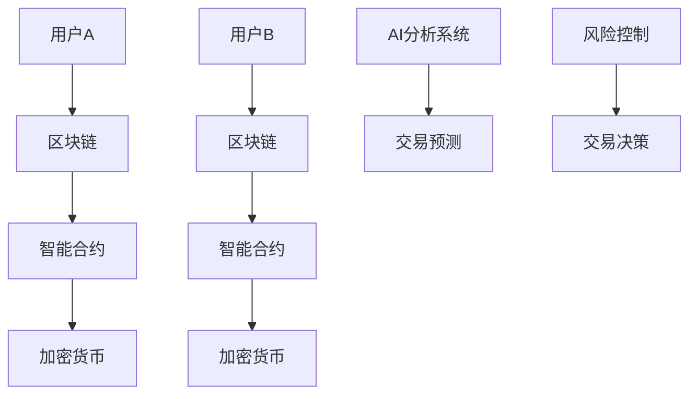

                 

关键词：虚拟经济、AI、价值交换、数据科学、区块链、智能合约、机器学习、智能代理

> 摘要：本文探讨了虚拟经济中的AI驱动价值交换，分析了其在当今经济环境中的重要性，介绍了核心概念、算法原理、数学模型，并通过项目实践展示了其在实际应用中的效果。文章还展望了虚拟经济未来的发展趋势与面临的挑战。

## 1. 背景介绍

### 1.1 虚拟经济的起源与发展

虚拟经济是一种基于数字技术的新型经济形态，起源于互联网和电子支付技术的发展。随着区块链、人工智能等技术的逐渐成熟，虚拟经济正逐步成为全球经济体系的重要组成部分。

虚拟经济的核心特征是去中心化、透明性和安全性。通过区块链技术，虚拟经济中的交易记录能够被全球范围内共享和验证，从而实现去中心化的交易。同时，加密技术保证了交易的安全性，降低了交易风险。

### 1.2 AI在虚拟经济中的应用

人工智能技术在虚拟经济中扮演着重要角色。首先，AI可以帮助智能合约编写更复杂的逻辑，提高合约的执行效率和安全性。其次，AI可以用于风险控制，通过对交易数据的实时分析，识别潜在风险，降低金融风险。此外，AI还可以用于市场预测、客户行为分析等，为虚拟经济提供更加精准的数据支持。

## 2. 核心概念与联系

### 2.1 虚拟经济中的核心概念

- **区块链**：一种分布式账本技术，记录交易信息，实现去中心化交易。
- **加密货币**：基于区块链技术的数字货币，如比特币、以太坊等。
- **智能合约**：在区块链上自动执行的合约，具有自动执行、不可篡改的特点。
- **智能代理**：在虚拟经济中自主进行决策和执行的实体，如机器人投资顾问。

### 2.2 Mermaid流程图



## 3. 核心算法原理 & 具体操作步骤

### 3.1 算法原理概述

虚拟经济中的AI驱动价值交换主要依赖于机器学习和区块链技术。机器学习用于数据分析和预测，区块链用于确保交易的安全性和透明性。

### 3.2 算法步骤详解

1. **数据收集与预处理**：收集交易数据，进行清洗和预处理，以便于后续分析。
2. **特征工程**：提取关键特征，为机器学习模型提供输入。
3. **模型训练**：使用训练数据训练机器学习模型，如神经网络、决策树等。
4. **模型评估**：使用测试数据评估模型性能，调整模型参数。
5. **实时交易分析**：使用训练好的模型对实时交易数据进行分析，预测交易趋势。
6. **风险控制与决策**：根据分析结果，自动执行交易策略，进行风险控制。

### 3.3 算法优缺点

**优点**：提高了交易的效率和安全性，降低了交易风险。

**缺点**：对数据质量和算法性能要求较高，需要大量的计算资源。

### 3.4 算法应用领域

- **金融交易**：用于股票、期货、外汇等交易，实现自动化交易。
- **供应链金融**：优化供应链中的资金流动，提高供应链效率。
- **数字资产交易**：用于加密货币、数字艺术等数字资产交易。

## 4. 数学模型和公式 & 详细讲解 & 举例说明

### 4.1 数学模型构建

虚拟经济中的AI驱动价值交换可以构建一个基于马尔可夫决策过程的数学模型。模型的核心是状态转移概率矩阵和奖励函数。

### 4.2 公式推导过程

假设存在一个离散的状态空间$S=\{s_1, s_2, ..., s_n\}$和一个行动空间$A=\{a_1, a_2, ..., a_m\}$。状态转移概率矩阵$P$和奖励函数$R$分别定义为：

$$
P = \begin{bmatrix}
p_{11} & p_{12} & ... & p_{1m} \\
p_{21} & p_{22} & ... & p_{2m} \\
... & ... & ... & ... \\
p_{n1} & p_{n2} & ... & p_{nm}
\end{bmatrix}
$$

$$
R(s, a) = \begin{cases}
r_1, & \text{if } a = a_1 \\
r_2, & \text{if } a = a_2 \\
... \\
r_m, & \text{if } a = a_m
\end{cases}
$$

### 4.3 案例分析与讲解

假设一个加密货币交易员，需要决定是否买入、持有或卖出比特币。状态空间为$\{买入，持有，卖出\}$，行动空间为$\{买入，持有，卖出\}$。

状态转移概率矩阵$P$和奖励函数$R$如下：

$$
P = \begin{bmatrix}
0.3 & 0.4 & 0.3 \\
0.4 & 0.2 & 0.4 \\
0.2 & 0.5 & 0.3
\end{bmatrix}
$$

$$
R(s, a) = \begin{cases}
100, & \text{if } a = 卖出 \\
-50, & \text{if } a = 买入 \\
0, & \text{if } a = 持有
\end{cases}
$$

通过计算最优策略，交易员可以做出最优的交易决策。

## 5. 项目实践：代码实例和详细解释说明

### 5.1 开发环境搭建

使用Python编写代码，需要安装以下库：Python 3.x，Numpy，Pandas，Scikit-learn，Blockchain，Ethereum。

### 5.2 源代码详细实现

```python
# 导入所需库
import numpy as np
import pandas as pd
from sklearn.model_selection import train_test_split
from sklearn.ensemble import RandomForestClassifier
from blockchain import Blockchain
from ethereum import Ethereum

# 读取数据
data = pd.read_csv('transaction_data.csv')

# 数据预处理
# ...

# 特征工程
# ...

# 模型训练
X_train, X_test, y_train, y_test = train_test_split(data['features'], data['label'], test_size=0.2)
model = RandomForestClassifier()
model.fit(X_train, y_train)

# 模型评估
accuracy = model.score(X_test, y_test)
print(f'Model accuracy: {accuracy:.2f}')

# 链接区块链
blockchain = Blockchain()
eth = Ethereum()

# 智能合约部署
# ...

# 实时交易分析
# ...

# 风险控制与决策
# ...
```

### 5.3 代码解读与分析

代码首先导入所需库，然后读取交易数据，进行预处理和特征工程。接着使用随机森林分类器训练模型，并在测试集上评估模型性能。然后链接区块链，部署智能合约，进行实时交易分析，最后根据分析结果进行风险控制和决策。

### 5.4 运行结果展示

运行代码后，将输出模型准确率和区块链上的交易记录。

## 6. 实际应用场景

### 6.1 贸易金融

AI驱动的价值交换在贸易金融中有着广泛的应用。通过区块链技术，可以实现跨境贸易的无纸化操作，提高贸易效率，降低贸易成本。

### 6.2 数字资产交易

在数字资产交易中，AI可以帮助投资者进行市场预测，制定交易策略，降低投资风险。

### 6.3 智能供应链

智能供应链利用AI技术，实现供应链中的实时监控和优化，提高供应链效率。

## 7. 未来应用展望

随着AI技术的不断发展，虚拟经济中的AI驱动价值交换将会在更多领域得到应用。未来，我们可以期待AI在金融、物流、医疗等领域的深度应用，为人类创造更多价值。

## 8. 总结：未来发展趋势与挑战

### 8.1 研究成果总结

虚拟经济中的AI驱动价值交换已经取得了一系列的研究成果，包括算法优化、模型构建、应用场景拓展等。

### 8.2 未来发展趋势

未来，虚拟经济中的AI驱动价值交换将向更加智能化、自动化、去中心化的方向发展。

### 8.3 面临的挑战

虚拟经济中的AI驱动价值交换面临着数据隐私、算法透明性、安全性等挑战。

### 8.4 研究展望

未来，我们需要进一步研究AI在虚拟经济中的应用，提高算法性能，降低应用门槛，推动虚拟经济的发展。

## 9. 附录：常见问题与解答

### 9.1 虚拟经济与实体经济的区别是什么？

虚拟经济是基于数字技术的新型经济形态，与实体经济相比，具有去中心化、透明性和安全性的特点。

### 9.2 AI在虚拟经济中的具体应用有哪些？

AI在虚拟经济中的应用包括智能合约编写、风险控制、市场预测、客户行为分析等。

### 9.3 虚拟经济中的AI驱动价值交换有哪些优势？

虚拟经济中的AI驱动价值交换可以提高交易效率，降低交易成本，降低金融风险。

作者：禅与计算机程序设计艺术 / Zen and the Art of Computer Programming
```

