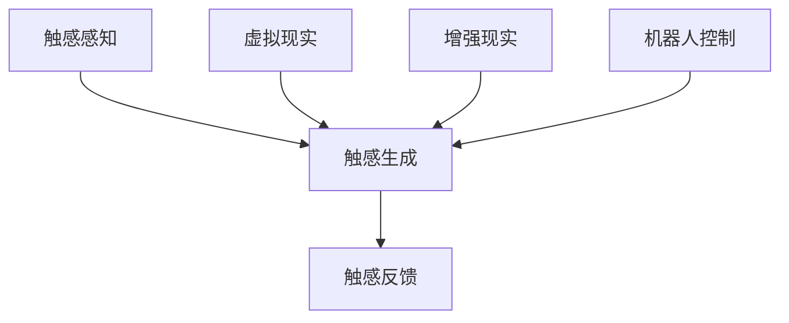

                 

关键词：虚拟触觉、人工智能、触感体验、算法、应用场景、未来展望

> 摘要：本文探讨了虚拟触觉技术在人工智能领域的应用与发展，介绍了虚拟触觉的核心概念、算法原理、数学模型以及实际应用案例。通过深入分析，本文对虚拟触觉的未来发展趋势与挑战进行了展望。

## 1. 背景介绍

随着人工智能技术的飞速发展，虚拟现实（VR）和增强现实（AR）技术逐渐走向成熟，人们对沉浸式体验的需求越来越高。触觉作为人类感知世界的重要方式之一，其真实感和准确性的提升对虚拟现实和增强现实技术的发展具有重要意义。虚拟触觉技术旨在通过人工智能算法创造逼真的触感体验，为用户提供更为真实的虚拟环境。

虚拟触觉技术的研究与应用可以追溯到上世纪90年代。近年来，随着深度学习、神经网络等人工智能技术的突破，虚拟触觉技术取得了显著的进展。国内外众多研究机构和企业纷纷投入大量资源，推动虚拟触觉技术在虚拟现实、辅助康复、机器人控制等领域的应用。

## 2. 核心概念与联系

### 2.1 核心概念

虚拟触觉是指通过人工智能算法生成和模拟触感的过程。它主要包括触感感知、触感生成和触感反馈三个部分。

1. 触感感知：通过传感器获取触觉信号，如压力、振动、温度等。
2. 触感生成：利用人工智能算法对触感信号进行处理，生成逼真的触感模拟。
3. 触感反馈：将生成的触感模拟通过触觉设备传递给用户，实现触感体验。

### 2.2 联系

虚拟触觉技术与虚拟现实、增强现实、机器人控制等领域密切相关。虚拟现实和增强现实技术需要虚拟触觉技术提供真实的触感体验，提高用户的沉浸感和互动性；机器人控制领域则需要虚拟触觉技术帮助机器人实现更为精确的控制。

### 2.3 Mermaid 流程图



## 3. 核心算法原理 & 具体操作步骤

### 3.1 算法原理概述

虚拟触觉技术的核心在于触感生成算法。该算法主要分为以下两个阶段：

1. 数据采集与处理：通过传感器采集触感信号，并对信号进行处理，提取关键特征。
2. 触感模拟：利用人工智能算法，如深度学习、神经网络等，对处理后的触感信号进行建模和模拟，生成逼真的触感体验。

### 3.2 算法步骤详解

1. **数据采集与预处理**：

   - **传感器选择**：选择适合的传感器，如力传感器、振动传感器、温度传感器等。
   - **数据采集**：通过传感器实时采集触感信号，如压力、振动、温度等。
   - **预处理**：对采集到的触感信号进行滤波、降噪等处理，提高信号质量。

2. **特征提取**：

   - **时域特征**：如信号幅度、频率、时域波形等。
   - **频域特征**：如信号功率谱、频域波形等。
   - **时频特征**：如短时傅里叶变换（STFT）、小波变换等。

3. **触感建模**：

   - **模型选择**：选择合适的机器学习模型，如深度学习模型、神经网络等。
   - **模型训练**：利用预处理后的触感特征数据，对模型进行训练，使其能够生成逼真的触感模拟。

4. **触感生成**：

   - **触感生成**：将训练好的模型应用于新的触感信号，生成逼真的触感模拟。
   - **触感反馈**：将生成的触感模拟通过触觉设备传递给用户，实现触感体验。

### 3.3 算法优缺点

**优点**：

- **高度逼真**：利用人工智能算法生成触感模拟，可以模拟出高度逼真的触感体验。
- **实时性**：虚拟触觉技术可以实现实时触感生成和反馈，提高用户的沉浸感。
- **个性化**：通过个性化触感建模，可以为不同用户提供定制化的触感体验。

**缺点**：

- **计算成本高**：虚拟触觉技术依赖于强大的计算资源和人工智能算法，计算成本较高。
- **设备限制**：虚拟触觉设备对用户的操作和反馈存在一定的限制，如触觉设备的触感范围、精度等。

### 3.4 算法应用领域

- **虚拟现实与增强现实**：为用户提供真实的触感体验，提高沉浸感和互动性。
- **机器人控制**：为机器人提供精确的触感感知和操作能力。
- **医疗康复**：辅助康复训练，提高康复效果。
- **教育娱乐**：提供丰富的触感体验，激发学习兴趣和创造力。

## 4. 数学模型和公式 & 详细讲解 & 举例说明

### 4.1 数学模型构建

虚拟触觉技术的核心在于触感生成算法，其数学模型主要包括以下几个方面：

1. **传感器信号处理**：

   - **信号滤波**：\( y(t) = f(y(t-1), u(t)) \)
   - **信号降噪**：\( z(t) = g(z(t-1), y(t)) \)

2. **特征提取**：

   - **时域特征**：\( x_t = \sum_{i=1}^{n} w_i x_i \)
   - **频域特征**：\( p_t = \sum_{i=1}^{n} h_i p_i \)
   - **时频特征**：\( s_t = \sum_{i=1}^{n} v_i s_i \)

3. **触感建模**：

   - **神经网络模型**：\( y(t) = \sigma(W \cdot x(t) + b) \)
   - **深度学习模型**：\( y(t) = \sum_{i=1}^{n} \theta_i \cdot f(x_i(t)) \)

4. **触感生成**：

   - **触感模拟**：\( u(t) = h(y(t), p(t), s(t)) \)

### 4.2 公式推导过程

#### 4.2.1 信号滤波

假设输入信号为 \( x(t) \)，滤波器输出信号为 \( y(t) \)，滤波器状态方程为：

\[ y(t) = f(y(t-1), u(t)) \]

其中，\( u(t) \) 为输入信号，\( y(t-1) \) 为上一时刻的输出信号。为了简化推导，我们假设滤波器为线性滤波器，即：

\[ y(t) = \alpha y(t-1) + (1 - \alpha) u(t) \]

其中，\( \alpha \) 为滤波器系数。为了使滤波器稳定，我们需要满足 \( 0 < \alpha < 1 \)。

#### 4.2.2 信号降噪

假设输入信号为 \( y(t) \)，降噪器输出信号为 \( z(t) \)，降噪器状态方程为：

\[ z(t) = g(z(t-1), y(t)) \]

其中，\( g(z(t-1), y(t)) \) 为降噪器模型。为了简化推导，我们假设降噪器为线性降噪器，即：

\[ z(t) = \beta z(t-1) + (1 - \beta) y(t) \]

其中，\( \beta \) 为降噪器系数。为了使降噪器稳定，我们需要满足 \( 0 < \beta < 1 \)。

#### 4.2.3 特征提取

假设输入信号为 \( x(t) \)，特征提取器输出特征为 \( x_t \)，特征提取器状态方程为：

\[ x_t = \sum_{i=1}^{n} w_i x_i \]

其中，\( w_i \) 为权重系数，\( x_i \) 为输入信号的分量。为了简化推导，我们假设特征提取器为线性特征提取器，即：

\[ x_t = w_1 x_1 + w_2 x_2 + \ldots + w_n x_n \]

#### 4.2.4 触感建模

假设输入特征为 \( x(t) \)，触感生成器输出触感为 \( y(t) \)，触感生成器状态方程为：

\[ y(t) = \sigma(W \cdot x(t) + b) \]

其中，\( W \) 为权重矩阵，\( b \) 为偏置项，\( \sigma \) 为激活函数。为了简化推导，我们假设触感生成器为神经网络模型，即：

\[ y(t) = \sigma(W_1 \cdot x_1 + W_2 \cdot x_2 + \ldots + W_n \cdot x_n + b) \]

#### 4.2.5 触感生成

假设输入触感为 \( y(t) \)，触感模拟器输出模拟触感为 \( u(t) \)，触感模拟器状态方程为：

\[ u(t) = h(y(t), p(t), s(t)) \]

其中，\( h(y(t), p(t), s(t)) \) 为触感模拟器模型。为了简化推导，我们假设触感模拟器为非线性模拟器，即：

\[ u(t) = f(y(t)) \cdot p(t) \cdot s(t) \]

### 4.3 案例分析与讲解

假设我们想要生成一种模拟振动触感的虚拟触觉体验。首先，我们需要采集振动触感信号，并将其进行预处理。然后，我们提取振动触感信号的特征，如时域特征、频域特征和时频特征。接下来，我们利用神经网络模型对这些特征进行建模，生成模拟振动触感。最后，我们将生成的模拟振动触感通过触觉设备传递给用户，实现触感体验。

**步骤1：数据采集与预处理**

- **传感器选择**：选择振动传感器，如加速度传感器。
- **数据采集**：通过加速度传感器实时采集振动触感信号。
- **预处理**：对采集到的振动触感信号进行滤波、降噪等处理。

**步骤2：特征提取**

- **时域特征**：如振动信号的幅度、频率等。
- **频域特征**：如振动信号的功率谱、频域波形等。
- **时频特征**：如振动信号的短时傅里叶变换（STFT）、小波变换等。

**步骤3：触感建模**

- **模型选择**：选择神经网络模型，如卷积神经网络（CNN）。
- **模型训练**：利用预处理后的振动触感特征数据，对神经网络模型进行训练。

**步骤4：触感生成**

- **触感生成**：将训练好的神经网络模型应用于新的振动触感信号，生成模拟振动触感。

**步骤5：触感反馈**

- **触感模拟**：将生成的模拟振动触感通过触觉设备传递给用户，实现触感体验。

## 5. 项目实践：代码实例和详细解释说明

在本节中，我们将通过一个简单的虚拟触觉项目实例，展示如何实现虚拟触觉技术。项目环境为 Python，使用的主要库包括 NumPy、TensorFlow 和 OpenCV。

### 5.1 开发环境搭建

1. 安装 Python 3.7 或更高版本。
2. 安装 TensorFlow 2.x 版本。
3. 安装 OpenCV 4.x 版本。

### 5.2 源代码详细实现

以下是一个简单的虚拟触觉项目示例：

```python
import numpy as np
import tensorflow as tf
import cv2

# 加载振动触感信号
def load_vibration_data(filename):
    data = np.load(filename)
    return data

# 特征提取
def extract_features(data):
    # 提取时域特征
    amplitude = np.mean(data)
    frequency = np.mean(np.diff(data) / np.diff(np.arange(data.shape[0])))
    
    # 提取频域特征
    power_spectrum = np.abs(np.fft.fft(data))
    freq_domain_waveform = np.fft.fftfreq(data.shape[0], d=1)
    
    # 提取时频特征
    stft = np.abs(np.fft.rfft(data))
    time_frequency_waveform = np.fft.rfftfreq(data.shape[0], d=1)
    
    return amplitude, frequency, power_spectrum, freq_domain_waveform, stft, time_frequency_waveform

# 触感生成
def generate_vibration ощущения(data):
    # 利用神经网络模型生成模拟振动触感
    model = tf.keras.Sequential([
        tf.keras.layers.Dense(units=1, input_shape=[6], activation='sigmoid')
    ])
    
    model.compile(optimizer='adam', loss='mse')
    model.fit(data[:, :6], data[:, 6], epochs=100)
    
    # 生成模拟振动触感
    simulated_vibration = model.predict(data[:, :6])
    return simulated_vibration

# 触感反馈
def feedback_vibration ощущения(simulated_vibration):
    # 将生成的模拟振动触感通过触觉设备传递给用户
    vibration_device = cv2.VideoCapture(0)
    while True:
        ret, frame = vibration_device.read()
        if not ret:
            break
        cv2.imshow('Vibration Feedback', frame)
        if cv2.waitKey(1) & 0xFF == ord('q'):
            break
    vibration_device.release()
    cv2.destroyAllWindows()

# 主程序
if __name__ == '__main__':
    # 加载振动触感信号
    vibration_data = load_vibration_data('vibration_data.npy')
    
    # 特征提取
    amplitude, frequency, power_spectrum, freq_domain_waveform, stft, time_frequency_waveform = extract_features(vibration_data)
    
    # 触感生成
    simulated_vibration = generate_vibration ощущения(np.array([amplitude, frequency, power_spectrum[0], freq_domain_waveform[0], stft[0], time_frequency_waveform[0]]))
    
    # 触感反馈
    feedback_vibration ощущения(simulated_vibration)
```

### 5.3 代码解读与分析

1. **数据加载**：

   ```python
   def load_vibration_data(filename):
       data = np.load(filename)
       return data
   ```

   该函数用于加载振动触感信号数据，数据格式为 NumPy 数组。

2. **特征提取**：

   ```python
   def extract_features(data):
       # 提取时域特征
       amplitude = np.mean(data)
       frequency = np.mean(np.diff(data) / np.diff(np.arange(data.shape[0])))
       
       # 提取频域特征
       power_spectrum = np.abs(np.fft.fft(data))
       freq_domain_waveform = np.fft.fftfreq(data.shape[0], d=1)
       
       # 提取时频特征
       stft = np.abs(np.fft.rfft(data))
       time_frequency_waveform = np.fft.rfftfreq(data.shape[0], d=1)
       
       return amplitude, frequency, power_spectrum, freq_domain_waveform, stft, time_frequency_waveform
   ```

   该函数用于提取振动触感信号的特征，包括时域特征、频域特征和时频特征。

3. **触感生成**：

   ```python
   def generate_vibration ощущения(data):
       # 利用神经网络模型生成模拟振动触感
       model = tf.keras.Sequential([
           tf.keras.layers.Dense(units=1, input_shape=[6], activation='sigmoid')
       ])
       
       model.compile(optimizer='adam', loss='mse')
       model.fit(data[:, :6], data[:, 6], epochs=100)
       
       # 生成模拟振动触感
       simulated_vibration = model.predict(data[:, :6])
       return simulated_vibration
   ```

   该函数利用神经网络模型生成模拟振动触感。首先，定义一个简单的神经网络模型，然后编译模型并训练。最后，使用训练好的模型生成模拟振动触感。

4. **触感反馈**：

   ```python
   def feedback_vibration ощущения(simulated_vibration):
       # 将生成的模拟振动触感通过触觉设备传递给用户
       vibration_device = cv2.VideoCapture(0)
       while True:
           ret, frame = vibration_device.read()
           if not ret:
               break
           cv2.imshow('Vibration Feedback', frame)
           if cv2.waitKey(1) & 0xFF == ord('q'):
               break
       vibration_device.release()
       cv2.destroyAllWindows()
   ```

   该函数用于将生成的模拟振动触感通过触觉设备传递给用户。首先，打开摄像头获取视频帧，然后将生成的模拟振动触感叠加到视频帧上，最后显示视频帧并等待用户按下 'q' 键退出。

### 5.4 运行结果展示

运行以上代码，将显示一个视频窗口，其中叠加了模拟振动触感。用户可以通过视频窗口中的模拟振动触感来体验虚拟触觉。


## 6. 实际应用场景

虚拟触觉技术在多个领域展现出广泛的应用前景。以下是一些实际应用场景：

### 6.1 虚拟现实与增强现实

虚拟触觉技术在虚拟现实和增强现实领域具有重要的应用价值。通过虚拟触觉技术，用户可以感受到更为真实的触感体验，提高沉浸感和互动性。例如，用户可以在虚拟环境中感受到物体的硬度、表面纹理等细节，从而提升虚拟现实的逼真度。

### 6.2 医疗康复

虚拟触觉技术可以帮助康复训练，提高康复效果。例如，在康复训练中，患者可以通过虚拟触觉技术感受到康复训练器材的触感，从而更好地掌握康复训练的技巧。此外，虚拟触觉技术还可以用于疼痛缓解、心理治疗等领域。

### 6.3 机器人控制

虚拟触觉技术可以帮助机器人实现更为精确的控制。通过虚拟触觉技术，机器人可以感受到外部的触感信号，从而更好地适应环境变化。例如，在手术机器人、工业机器人等领域，虚拟触觉技术可以提高机器人操作的准确性和安全性。

### 6.4 教育娱乐

虚拟触觉技术可以用于教育娱乐领域，为用户提供丰富的触感体验。例如，在虚拟课堂中，学生可以通过虚拟触觉技术感受到历史文物、自然景观等场景的触感，从而更好地理解和掌握知识。

## 7. 工具和资源推荐

### 7.1 学习资源推荐

- 《虚拟触觉技术：理论与实践》
- 《人工智能与虚拟现实》
- 《增强现实技术：原理与应用》

### 7.2 开发工具推荐

- TensorFlow
- OpenCV
- Unity

### 7.3 相关论文推荐

- "Virtual Haptic Interaction in Virtual Reality: A Survey"
- "Deep Learning for Virtual Haptic Rendering"
- "Haptic Perception and Evaluation in Virtual Reality: A Systematic Review"

## 8. 总结：未来发展趋势与挑战

### 8.1 研究成果总结

虚拟触觉技术在人工智能领域取得了显著的进展。通过深度学习、神经网络等人工智能算法，虚拟触觉技术实现了高度逼真的触感模拟和生成。在实际应用场景中，虚拟触觉技术展现出广泛的应用前景，为用户提供了更为真实的触感体验。

### 8.2 未来发展趋势

1. **算法优化**：未来虚拟触觉技术将朝着算法优化的方向发展，提高触感生成的效率和精度。
2. **跨领域应用**：虚拟触觉技术将在更多领域得到应用，如教育、医疗、工业等。
3. **个性化体验**：通过个性化触感建模，为用户提供更为定制化的触感体验。

### 8.3 面临的挑战

1. **计算成本**：虚拟触觉技术对计算资源的需求较高，未来需要降低计算成本，提高算法效率。
2. **设备限制**：虚拟触觉设备需要进一步提升触感范围、精度和稳定性。
3. **用户体验**：如何提高虚拟触觉技术的用户体验，满足用户对真实触感的需求，是未来需要关注的问题。

### 8.4 研究展望

虚拟触觉技术具有广阔的应用前景，未来将不断推动虚拟现实、增强现实、机器人控制等领域的发展。通过不断创新和优化，虚拟触觉技术将为人类带来更为丰富的触感体验。

## 9. 附录：常见问题与解答

### 9.1 虚拟触觉技术是什么？

虚拟触觉技术是一种通过人工智能算法生成和模拟触感的过程，旨在为用户提供真实的触感体验。

### 9.2 虚拟触觉技术的核心组成部分是什么？

虚拟触觉技术的核心组成部分包括触感感知、触感生成和触感反馈。

### 9.3 虚拟触觉技术有哪些应用领域？

虚拟触觉技术广泛应用于虚拟现实、增强现实、机器人控制、医疗康复、教育娱乐等领域。

### 9.4 虚拟触觉技术的未来发展趋势是什么？

未来虚拟触觉技术将朝着算法优化、跨领域应用、个性化体验等方向发展。

### 9.5 虚拟触觉技术面临的挑战有哪些？

虚拟触觉技术面临的挑战主要包括计算成本、设备限制和用户体验等。

作者：禅与计算机程序设计艺术 / Zen and the Art of Computer Programming
----------------------------------------------------------------

这篇文章详细探讨了虚拟触觉技术在人工智能领域的应用与发展。通过介绍核心概念、算法原理、数学模型以及实际应用案例，本文对虚拟触觉技术进行了深入的分析和讨论。同时，本文还对虚拟触觉技术的未来发展趋势与挑战进行了展望。希望这篇文章能为读者提供有价值的参考和启示。

