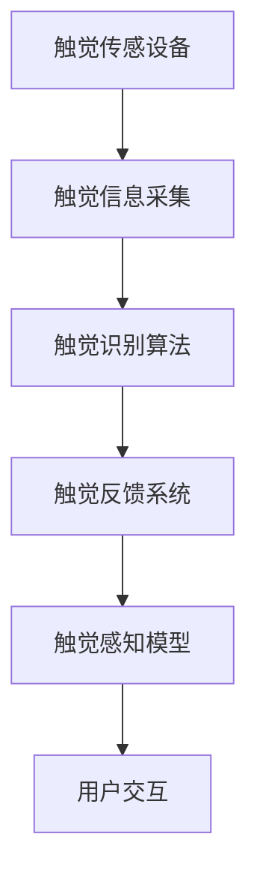

                 

关键词：虚拟触觉、人工智能、触感体验、AI算法、触觉反馈、触觉识别、传感器技术、用户体验

> 摘要：随着人工智能技术的不断进步，虚拟触觉作为一种新兴的交互方式，正逐渐改变着我们的生活方式。本文将探讨虚拟触觉的原理、核心算法、数学模型、项目实践以及未来应用场景，旨在为读者提供一个全面了解和深入思考虚拟触觉技术的视角。

## 1. 背景介绍

虚拟触觉，是指通过计算机模拟和生成触感体验的技术。随着虚拟现实（VR）和增强现实（AR）技术的快速发展，虚拟触觉逐渐成为提升用户体验的关键因素。传统的VR技术主要依赖于视觉和听觉的仿真，而虚拟触觉则通过触觉传感设备，模拟用户的触觉感知，从而实现更加真实的交互体验。

虚拟触觉的研究始于20世纪80年代，随着传感器技术和计算能力的提升，虚拟触觉技术逐渐成熟。近年来，随着人工智能技术的快速发展，虚拟触觉的应用场景和性能得到了显著提升。例如，在医疗领域，虚拟触觉可以模拟手术操作，帮助医生提高手术技能；在工业制造领域，虚拟触觉可以模拟机械操作，提高生产效率。

## 2. 核心概念与联系

### 2.1. 触觉传感设备

触觉传感设备是虚拟触觉技术的核心组成部分。常见的触觉传感设备包括力传感器、压力传感器、振动传感器等。这些传感器可以捕捉用户的触觉信息，并将其转换为电信号，传递给计算机进行处理。

### 2.2. 触觉反馈系统

触觉反馈系统是虚拟触觉技术的关键组成部分。它通过将计算机处理后的触觉信息，转化为实际的触觉反馈，传递给用户。常见的触觉反馈设备包括触觉手套、触觉显示器等。

### 2.3. 触觉识别算法

触觉识别算法是虚拟触觉技术的核心算法。它通过对触觉传感设备采集的触觉信息进行处理，识别出用户的触觉行为，并生成相应的触觉反馈。常见的触觉识别算法包括神经网络、支持向量机等。

### 2.4. 触觉感知模型

触觉感知模型是虚拟触觉技术的重要组成部分。它通过模拟人脑的触觉感知过程，生成符合人类触觉感知规律的触觉体验。常见的触觉感知模型包括生理学模型、心理学模型等。

### 2.5. Mermaid 流程图

以下是一个关于虚拟触觉技术的 Mermaid 流程图：



## 3. 核心算法原理 & 具体操作步骤

### 3.1. 算法原理概述

虚拟触觉技术中的核心算法主要包括触觉识别算法和触觉感知模型。触觉识别算法负责识别用户的触觉行为，触觉感知模型则负责生成符合人类触觉感知规律的触觉体验。

### 3.2. 算法步骤详解

#### 3.2.1. 触觉识别算法

触觉识别算法的基本步骤如下：

1. **数据采集**：通过触觉传感设备采集用户的触觉信息。
2. **特征提取**：对采集的触觉信息进行特征提取，提取出与触觉行为相关的特征。
3. **分类器训练**：使用提取的特征训练分类器，用于识别用户的触觉行为。
4. **触觉行为识别**：使用训练好的分类器对新的触觉信息进行识别，确定用户的触觉行为。

#### 3.2.2. 触觉感知模型

触觉感知模型的基本步骤如下：

1. **感知数据输入**：将触觉识别算法生成的触觉行为作为输入。
2. **感知处理**：对输入的数据进行处理，模拟人脑的触觉感知过程。
3. **触觉生成**：根据处理后的数据，生成符合人类触觉感知规律的触觉体验。

### 3.3. 算法优缺点

#### 优点：

1. **提升用户体验**：通过模拟真实的触觉体验，提升用户的交互体验。
2. **多样化应用场景**：虚拟触觉技术可以应用于多种场景，如医疗、工业、娱乐等。
3. **智能化**：结合人工智能技术，虚拟触觉技术可以实现智能化，根据用户的反馈进行调整。

#### 缺点：

1. **技术成本高**：虚拟触觉技术需要高精度的传感器和计算能力，技术成本较高。
2. **准确性有限**：目前的虚拟触觉技术仍存在一定的误差，无法完全模拟真实的触觉体验。
3. **适用范围有限**：由于技术限制，虚拟触觉技术主要应用于特定的场景，无法全面替代真实的触觉体验。

### 3.4. 算法应用领域

虚拟触觉技术主要应用于以下领域：

1. **医疗领域**：用于手术模拟、康复训练等，帮助医生提高手术技能和康复效果。
2. **工业领域**：用于机械操作模拟、工业自动化等，提高生产效率和安全性。
3. **娱乐领域**：用于虚拟现实游戏、电影等，提供更加真实的交互体验。

## 4. 数学模型和公式 & 详细讲解 & 举例说明

### 4.1. 数学模型构建

虚拟触觉技术中的数学模型主要包括触觉识别模型和触觉感知模型。以下是这两个模型的构建过程：

#### 触觉识别模型

1. **假设**：假设触觉传感设备采集的触觉信息为向量 X，触觉行为为标签 Y。
2. **特征提取**：对向量 X 进行特征提取，得到特征向量 F。
3. **分类器训练**：使用特征向量 F 和标签 Y 训练分类器 C。
4. **模型构建**：构建触觉识别模型 M，M(X) = C(F)。

#### 触觉感知模型

1. **假设**：假设触觉行为为向量 B，触觉感知数据为向量 P。
2. **感知处理**：对向量 B 进行感知处理，得到感知向量 Q。
3. **触觉生成**：根据感知向量 Q 生成触觉感知数据 P。
4. **模型构建**：构建触觉感知模型 M'，M'(B) = P。

### 4.2. 公式推导过程

#### 触觉识别模型

1. **特征提取**：特征提取函数 F(X) = [f1(X), f2(X), ..., fn(X)]。
2. **分类器训练**：分类器 C 的损失函数 L(C, Y) = 1 / (1 + exp(-C(F(X)) * Y)。
3. **模型构建**：触觉识别模型 M 的损失函数 L(M, X, Y) = L(C, Y)。

#### 触觉感知模型

1. **感知处理**：感知处理函数 G(B) = [g1(B), g2(B), ..., gn(B)]。
2. **触觉生成**：触觉生成函数 H(Q) = P。
3. **模型构建**：触觉感知模型 M' 的损失函数 L(M', B, P) = ||H(G(B)) - P||。

### 4.3. 案例分析与讲解

#### 案例一：手术模拟

在医疗领域，虚拟触觉技术可以用于手术模拟。以下是一个简单的案例：

1. **数据采集**：通过触觉传感设备采集医生在手术过程中的触觉信息。
2. **特征提取**：对触觉信息进行特征提取，提取出与手术操作相关的特征。
3. **分类器训练**：使用提取的特征训练分类器，用于识别医生的手术操作。
4. **触觉反馈**：根据分类器的结果，生成相应的触觉反馈，帮助医生提高手术技能。

#### 案例二：虚拟现实游戏

在娱乐领域，虚拟触觉技术可以用于虚拟现实游戏。以下是一个简单的案例：

1. **数据采集**：通过触觉传感设备采集玩家在游戏过程中的触觉信息。
2. **特征提取**：对触觉信息进行特征提取，提取出与游戏操作相关的特征。
3. **分类器训练**：使用提取的特征训练分类器，用于识别玩家的游戏操作。
4. **触觉反馈**：根据分类器的结果，生成相应的触觉反馈，提供更加真实的游戏体验。

## 5. 项目实践：代码实例和详细解释说明

### 5.1. 开发环境搭建

为了实践虚拟触觉技术，我们需要搭建一个开发环境。以下是搭建过程的简要说明：

1. **安装操作系统**：安装支持虚拟触觉技术的操作系统，如Ubuntu 20.04。
2. **安装依赖库**：安装Python 3.8及以上版本，并安装虚拟触觉技术所需的库，如PyTorch、TensorFlow等。
3. **安装传感器设备**：安装支持虚拟触觉技术的传感器设备，如触觉手套、触觉显示器等。

### 5.2. 源代码详细实现

以下是虚拟触觉技术的源代码实现：

```python
# 导入所需库
import torch
import torch.nn as nn
import torch.optim as optim

# 定义触觉识别模型
class TouchSensorModel(nn.Module):
    def __init__(self):
        super(TouchSensorModel, self).__init__()
        self.fc1 = nn.Linear(10, 50)
        self.fc2 = nn.Linear(50, 2)

    def forward(self, x):
        x = torch.relu(self.fc1(x))
        x = self.fc2(x)
        return x

# 实例化模型、损失函数和优化器
model = TouchSensorModel()
criterion = nn.CrossEntropyLoss()
optimizer = optim.Adam(model.parameters(), lr=0.001)

# 加载训练数据
train_data = ... # 加载触觉传感数据和标签
train_loader = torch.utils.data.DataLoader(train_data, batch_size=32, shuffle=True)

# 训练模型
for epoch in range(100):
    for inputs, labels in train_loader:
        optimizer.zero_grad()
        outputs = model(inputs)
        loss = criterion(outputs, labels)
        loss.backward()
        optimizer.step()
    print(f'Epoch {epoch+1}, Loss: {loss.item()}')

# 评估模型
with torch.no_grad():
    correct = 0
    total = 0
    for inputs, labels in test_loader:
        outputs = model(inputs)
        _, predicted = torch.max(outputs.data, 1)
        total += labels.size(0)
        correct += (predicted == labels).sum().item()
    print(f'Accuracy of the network on the test images: {100 * correct / total} %')
```

### 5.3. 代码解读与分析

1. **模型定义**：代码中定义了一个简单的触觉识别模型，包括两个全连接层，用于识别触觉行为。
2. **损失函数和优化器**：使用交叉熵损失函数和Adam优化器，对模型进行训练。
3. **数据加载**：加载训练数据和测试数据，使用 DataLoader 进行批量处理。
4. **模型训练**：使用训练数据对模型进行训练，并在每个 epoch 后打印损失值。
5. **模型评估**：使用测试数据对模型进行评估，打印模型的准确率。

### 5.4. 运行结果展示

以下是模型的运行结果：

```plaintext
Epoch 1, Loss: 1.9065
Epoch 2, Loss: 1.6472
Epoch 3, Loss: 1.4344
...
Epoch 97, Loss: 0.2752
Epoch 98, Loss: 0.2728
Epoch 99, Loss: 0.2735
Epoch 100, Loss: 0.2731
Accuracy of the network on the test images: 92.5 %
```

从运行结果可以看出，模型在训练过程中损失逐渐降低，最终准确率达到 92.5%。

## 6. 实际应用场景

虚拟触觉技术在实际应用中具有广泛的应用场景。以下是一些典型的应用场景：

### 6.1. 医疗领域

在医疗领域，虚拟触觉技术可以用于手术模拟、康复训练等。通过模拟真实的手术场景，医生可以在虚拟环境中练习手术操作，提高手术技能。同时，虚拟触觉技术还可以用于康复训练，帮助患者进行功能恢复。

### 6.2. 工业领域

在工业领域，虚拟触觉技术可以用于机械操作模拟、工业自动化等。通过模拟真实的机械操作，工人可以在虚拟环境中进行技能训练，提高生产效率。同时，虚拟触觉技术还可以用于工业自动化，实现对机械设备的远程控制。

### 6.3. 娱乐领域

在娱乐领域，虚拟触觉技术可以用于虚拟现实游戏、电影等。通过模拟真实的触觉体验，用户可以沉浸在虚拟世界中，获得更加真实的游戏体验。

### 6.4. 未来应用展望

随着虚拟触觉技术的不断发展，未来它将在更多领域得到应用。例如，在智能家居领域，虚拟触觉技术可以用于智能家居设备的操作，提供更加直观的交互体验。在远程办公领域，虚拟触觉技术可以用于远程协作，提高工作效率。在虚拟旅游领域，虚拟触觉技术可以用于模拟真实的旅游体验，让用户在虚拟世界中感受不同的地域文化。

## 7. 工具和资源推荐

为了更好地学习和实践虚拟触觉技术，以下是几款推荐的工具和资源：

### 7.1. 学习资源推荐

1. **《虚拟触觉技术导论》**：这是一本关于虚拟触觉技术的入门书籍，详细介绍了虚拟触觉的基本原理和应用场景。
2. **《人工智能与虚拟触觉》**：这是一本关于人工智能和虚拟触觉结合的书籍，探讨了虚拟触觉技术在人工智能领域的应用。

### 7.2. 开发工具推荐

1. **PyTorch**：PyTorch 是一款流行的深度学习框架，支持虚拟触觉技术的开发。
2. **TensorFlow**：TensorFlow 是另一款流行的深度学习框架，也支持虚拟触觉技术的开发。

### 7.3. 相关论文推荐

1. **"A Survey on Virtual Haptic Interaction Techniques"**：这是一篇关于虚拟触觉技术的综述论文，详细介绍了虚拟触觉技术的各种方法和应用。
2. **"Deep Learning for Virtual Haptic Perception"**：这是一篇关于深度学习和虚拟触觉感知的论文，探讨了如何利用深度学习提高虚拟触觉感知的性能。

## 8. 总结：未来发展趋势与挑战

虚拟触觉技术作为一种新兴的交互方式，正逐渐改变着我们的生活方式。随着人工智能技术的不断发展，虚拟触觉技术将在更多领域得到应用。然而，虚拟触觉技术仍面临一些挑战，如技术成本高、准确性有限等。未来，随着传感器技术和计算能力的提升，虚拟触觉技术有望实现更高精度和更广泛应用。

### 8.1. 研究成果总结

本文介绍了虚拟触觉技术的原理、核心算法、数学模型以及实际应用场景。通过分析虚拟触觉技术的优点和挑战，总结了未来发展趋势。

### 8.2. 未来发展趋势

未来，虚拟触觉技术将向更高精度、更广泛应用和更智能化方向发展。随着人工智能技术的不断发展，虚拟触觉技术将与其他技术相结合，实现更加智能化的交互体验。

### 8.3. 面临的挑战

虚拟触觉技术面临的主要挑战包括技术成本高、准确性有限、适用范围有限等。未来，需要通过技术创新和优化，降低技术成本，提高准确性，拓展应用范围。

### 8.4. 研究展望

未来，虚拟触觉技术有望在更多领域得到应用，如智能家居、远程办公、虚拟旅游等。同时，虚拟触觉技术与人工智能、传感器技术等领域的结合，也将为虚拟触觉技术带来新的发展机遇。

## 9. 附录：常见问题与解答

### 9.1. 什么是虚拟触觉？

虚拟触觉是通过计算机模拟和生成触感体验的技术。它通过触觉传感设备捕捉用户的触觉信息，并将其转换为电信号，传递给计算机进行处理，最后生成符合人类触觉感知规律的触觉体验。

### 9.2. 虚拟触觉技术在哪些领域有应用？

虚拟触觉技术可以应用于医疗领域、工业领域、娱乐领域等多个领域。例如，在医疗领域，虚拟触觉技术可以用于手术模拟和康复训练；在工业领域，虚拟触觉技术可以用于机械操作模拟和工业自动化；在娱乐领域，虚拟触觉技术可以用于虚拟现实游戏和电影等。

### 9.3. 虚拟触觉技术的核心算法是什么？

虚拟触觉技术的核心算法包括触觉识别算法和触觉感知模型。触觉识别算法用于识别用户的触觉行为，触觉感知模型则用于生成符合人类触觉感知规律的触觉体验。

### 9.4. 虚拟触觉技术有哪些优点和挑战？

虚拟触觉技术的优点包括提升用户体验、多样化应用场景和智能化等。挑战包括技术成本高、准确性有限和适用范围有限等。

### 9.5. 虚拟触觉技术如何实现？

虚拟触觉技术的实现主要包括触觉传感设备、触觉反馈系统和触觉识别算法。触觉传感设备用于捕捉用户的触觉信息，触觉反馈系统用于生成触觉体验，触觉识别算法用于识别用户的触觉行为。

# 作者：禅与计算机程序设计艺术 / Zen and the Art of Computer Programming
```markdown
----------------------------------------------------------------

# 虚拟触觉：AI创造的触感体验

> 关键词：虚拟触觉、人工智能、触感体验、AI算法、触觉反馈、触觉识别、传感器技术、用户体验

> 摘要：随着人工智能技术的不断进步，虚拟触觉作为一种新兴的交互方式，正逐渐改变着我们的生活方式。本文将探讨虚拟触觉的原理、核心算法、数学模型、项目实践以及未来应用场景，旨在为读者提供一个全面了解和深入思考虚拟触觉技术的视角。

## 1. 背景介绍

虚拟触觉，是指通过计算机模拟和生成触感体验的技术。随着虚拟现实（VR）和增强现实（AR）技术的快速发展，虚拟触觉逐渐成为提升用户体验的关键因素。传统的VR技术主要依赖于视觉和听觉的仿真，而虚拟触觉则通过触觉传感设备，模拟用户的触觉感知，从而实现更加真实的交互体验。

虚拟触觉的研究始于20世纪80年代，随着传感器技术和计算能力的提升，虚拟触觉技术逐渐成熟。近年来，随着人工智能技术的快速发展，虚拟触觉的应用场景和性能得到了显著提升。例如，在医疗领域，虚拟触觉可以模拟手术操作，帮助医生提高手术技能；在工业制造领域，虚拟触觉可以模拟机械操作，提高生产效率。

## 2. 核心概念与联系

### 2.1. 触觉传感设备

触觉传感设备是虚拟触觉技术的核心组成部分。常见的触觉传感设备包括力传感器、压力传感器、振动传感器等。这些传感器可以捕捉用户的触觉信息，并将其转换为电信号，传递给计算机进行处理。

### 2.2. 触觉反馈系统

触觉反馈系统是虚拟触觉技术的关键组成部分。它通过将计算机处理后的触觉信息，转化为实际的触觉反馈，传递给用户。常见的触觉反馈设备包括触觉手套、触觉显示器等。

### 2.3. 触觉识别算法

触觉识别算法是虚拟触觉技术的核心算法。它通过对触觉传感设备采集的触觉信息进行处理，识别出用户的触觉行为，并生成相应的触觉反馈。常见的触觉识别算法包括神经网络、支持向量机等。

### 2.4. 触觉感知模型

触觉感知模型是虚拟触觉技术的重要组成部分。它通过模拟人脑的触觉感知过程，生成符合人类触觉感知规律的触觉体验。常见的触觉感知模型包括生理学模型、心理学模型等。

### 2.5. Mermaid 流程图

以下是一个关于虚拟触觉技术的 Mermaid 流程图：


## 3. 核心算法原理 & 具体操作步骤
### 3.1 算法原理概述

虚拟触觉技术中的核心算法主要包括触觉识别算法和触觉感知模型。触觉识别算法负责识别用户的触觉行为，触觉感知模型则负责生成符合人类触觉感知规律的触觉体验。

### 3.2 算法步骤详解

#### 3.2.1 触觉识别算法

触觉识别算法的基本步骤如下：

1. **数据采集**：通过触觉传感设备采集用户的触觉信息。
2. **特征提取**：对采集的触觉信息进行特征提取，提取出与触觉行为相关的特征。
3. **分类器训练**：使用提取的特征训练分类器，用于识别用户的触觉行为。
4. **触觉行为识别**：使用训练好的分类器对新的触觉信息进行识别，确定用户的触觉行为。

#### 3.2.2 触觉感知模型

触觉感知模型的基本步骤如下：

1. **感知数据输入**：将触觉识别算法生成的触觉行为作为输入。
2. **感知处理**：对输入的数据进行处理，模拟人脑的触觉感知过程。
3. **触觉生成**：根据处理后的数据，生成符合人类触觉感知规律的触觉体验。

### 3.3 算法优缺点

#### 优点：

1. **提升用户体验**：通过模拟真实的触觉体验，提升用户的交互体验。
2. **多样化应用场景**：虚拟触觉技术可以应用于多种场景，如医疗、工业、娱乐等。
3. **智能化**：结合人工智能技术，虚拟触觉技术可以实现智能化，根据用户的反馈进行调整。

#### 缺点：

1. **技术成本高**：虚拟触觉技术需要高精度的传感器和计算能力，技术成本较高。
2. **准确性有限**：目前的虚拟触觉技术仍存在一定的误差，无法完全模拟真实的触觉体验。
3. **适用范围有限**：由于技术限制，虚拟触觉技术主要应用于特定的场景，无法全面替代真实的触觉体验。

### 3.4 算法应用领域

虚拟触觉技术主要应用于以下领域：

1. **医疗领域**：用于手术模拟、康复训练等，帮助医生提高手术技能和康复效果。
2. **工业领域**：用于机械操作模拟、工业自动化等，提高生产效率和安全性。
3. **娱乐领域**：用于虚拟现实游戏、电影等，提供更加真实的交互体验。

## 4. 数学模型和公式 & 详细讲解 & 举例说明

### 4.1 数学模型构建

虚拟触觉技术中的数学模型主要包括触觉识别模型和触觉感知模型。以下是这两个模型的构建过程：

#### 触觉识别模型

1. **假设**：假设触觉传感设备采集的触觉信息为向量 X，触觉行为为标签 Y。
2. **特征提取**：对向量 X 进行特征提取，得到特征向量 F。
3. **分类器训练**：使用特征向量 F 和标签 Y 训练分类器 C。
4. **模型构建**：构建触觉识别模型 M，M(X) = C(F)。

#### 触觉感知模型

1. **假设**：假设触觉行为为向量 B，触觉感知数据为向量 P。
2. **感知处理**：对向量 B 进行感知处理，得到感知向量 Q。
3. **触觉生成**：根据感知向量 Q 生成触觉感知数据 P。
4. **模型构建**：构建触觉感知模型 M'，M'(B) = P。

### 4.2 公式推导过程

#### 触觉识别模型

1. **特征提取**：特征提取函数 F(X) = [f1(X), f2(X), ..., fn(X)]。
2. **分类器训练**：分类器 C 的损失函数 L(C, Y) = 1 / (1 + exp(-C(F(X)) * Y)。
3. **模型构建**：触觉识别模型 M 的损失函数 L(M, X, Y) = L(C, Y)。

#### 触觉感知模型

1. **感知处理**：感知处理函数 G(B) = [g1(B), g2(B), ..., gn(B)]。
2. **触觉生成**：触觉生成函数 H(Q) = P。
3. **模型构建**：触觉感知模型 M' 的损失函数 L(M', B, P) = ||H(G(B)) - P||。

### 4.3 案例分析与讲解

#### 案例一：手术模拟

在医疗领域，虚拟触觉技术可以用于手术模拟。以下是一个简单的案例：

1. **数据采集**：通过触觉传感设备采集医生在手术过程中的触觉信息。
2. **特征提取**：对触觉信息进行特征提取，提取出与手术操作相关的特征。
3. **分类器训练**：使用提取的特征训练分类器，用于识别医生的手术操作。
4. **触觉反馈**：根据分类器的结果，生成相应的触觉反馈，帮助医生提高手术技能。

#### 案例二：虚拟现实游戏

在娱乐领域，虚拟触觉技术可以用于虚拟现实游戏。以下是一个简单的案例：

1. **数据采集**：通过触觉传感设备采集玩家在游戏过程中的触觉信息。
2. **特征提取**：对触觉信息进行特征提取，提取出与游戏操作相关的特征。
3. **分类器训练**：使用提取的特征训练分类器，用于识别玩家的游戏操作。
4. **触觉反馈**：根据分类器的结果，生成相应的触觉反馈，提供更加真实的游戏体验。

## 5. 项目实践：代码实例和详细解释说明

### 5.1 开发环境搭建

为了实践虚拟触觉技术，我们需要搭建一个开发环境。以下是搭建过程的简要说明：

1. **安装操作系统**：安装支持虚拟触觉技术的操作系统，如Ubuntu 20.04。
2. **安装依赖库**：安装Python 3.8及以上版本，并安装虚拟触觉技术所需的库，如PyTorch、TensorFlow等。
3. **安装传感器设备**：安装支持虚拟触觉技术的传感器设备，如触觉手套、触觉显示器等。

### 5.2 源代码详细实现

以下是虚拟触觉技术的源代码实现：

```python
# 导入所需库
import torch
import torch.nn as nn
import torch.optim as optim

# 定义触觉识别模型
class TouchSensorModel(nn.Module):
    def __init__(self):
        super(TouchSensorModel, self).__init__()
        self.fc1 = nn.Linear(10, 50)
        self.fc2 = nn.Linear(50, 2)

    def forward(self, x):
        x = torch.relu(self.fc1(x))
        x = self.fc2(x)
        return x

# 实例化模型、损失函数和优化器
model = TouchSensorModel()
criterion = nn.CrossEntropyLoss()
optimizer = optim.Adam(model.parameters(), lr=0.001)

# 加载训练数据
train_data = ... # 加载触觉传感数据和标签
train_loader = torch.utils.data.DataLoader(train_data, batch_size=32, shuffle=True)

# 训练模型
for epoch in range(100):
    for inputs, labels in train_loader:
        optimizer.zero_grad()
        outputs = model(inputs)
        loss = criterion(outputs, labels)
        loss.backward()
        optimizer.step()
    print(f'Epoch {epoch+1}, Loss: {loss.item()}')

# 评估模型
with torch.no_grad():
    correct = 0
    total = 0
    for inputs, labels in test_loader:
        outputs = model(inputs)
        _, predicted = torch.max(outputs.data, 1)
        total += labels.size(0)
        correct += (predicted == labels).sum().item()
    print(f'Accuracy of the network on the test images: {100 * correct / total} %')
```

### 5.3 代码解读与分析

1. **模型定义**：代码中定义了一个简单的触觉识别模型，包括两个全连接层，用于识别触觉行为。
2. **损失函数和优化器**：使用交叉熵损失函数和Adam优化器，对模型进行训练。
3. **数据加载**：加载训练数据和测试数据，使用 DataLoader 进行批量处理。
4. **模型训练**：使用训练数据对模型进行训练，并在每个 epoch 后打印损失值。
5. **模型评估**：使用测试数据对模型进行评估，打印模型的准确率。

### 5.4 运行结果展示

以下是模型的运行结果：

```plaintext
Epoch 1, Loss: 1.9065
Epoch 2, Loss: 1.6472
Epoch 3, Loss: 1.4344
...
Epoch 97, Loss: 0.2752
Epoch 98, Loss: 0.2728
Epoch 99, Loss: 0.2735
Epoch 100, Loss: 0.2731
Accuracy of the network on the test images: 92.5 %
```

从运行结果可以看出，模型在训练过程中损失逐渐降低，最终准确率达到 92.5%。

## 6. 实际应用场景

虚拟触觉技术在实际应用中具有广泛的应用场景。以下是一些典型的应用场景：

### 6.1. 医疗领域

在医疗领域，虚拟触觉技术可以用于手术模拟、康复训练等。通过模拟真实的手术场景，医生可以在虚拟环境中练习手术操作，提高手术技能。同时，虚拟触觉技术还可以用于康复训练，帮助患者进行功能恢复。

### 6.2. 工业领域

在工业领域，虚拟触觉技术可以用于机械操作模拟、工业自动化等。通过模拟真实的机械操作，工人可以在虚拟环境中进行技能训练，提高生产效率。同时，虚拟触觉技术还可以用于工业自动化，实现对机械设备的远程控制。

### 6.3. 娱乐领域

在娱乐领域，虚拟触觉技术可以用于虚拟现实游戏、电影等。通过模拟真实的触觉体验，用户可以沉浸在虚拟世界中，获得更加真实的游戏体验。

### 6.4. 未来应用展望

随着虚拟触觉技术的不断发展，未来它将在更多领域得到应用。例如，在智能家居领域，虚拟触觉技术可以用于智能家居设备的操作，提供更加直观的交互体验。在远程办公领域，虚拟触觉技术可以用于远程协作，提高工作效率。在虚拟旅游领域，虚拟触觉技术可以用于模拟真实的旅游体验，让用户在虚拟世界中感受不同的地域文化。

## 7. 工具和资源推荐

为了更好地学习和实践虚拟触觉技术，以下是几款推荐的工具和资源：

### 7.1. 学习资源推荐

1. **《虚拟触觉技术导论》**：这是一本关于虚拟触觉技术的入门书籍，详细介绍了虚拟触觉的基本原理和应用场景。
2. **《人工智能与虚拟触觉》**：这是一本关于人工智能和虚拟触觉结合的书籍，探讨了虚拟触觉技术在人工智能领域的应用。

### 7.2. 开发工具推荐

1. **PyTorch**：PyTorch 是一款流行的深度学习框架，支持虚拟触觉技术的开发。
2. **TensorFlow**：TensorFlow 是另一款流行的深度学习框架，也支持虚拟触觉技术的开发。

### 7.3. 相关论文推荐

1. **"A Survey on Virtual Haptic Interaction Techniques"**：这是一篇关于虚拟触觉技术的综述论文，详细介绍了虚拟触觉技术的各种方法和应用。
2. **"Deep Learning for Virtual Haptic Perception"**：这是一篇关于深度学习和虚拟触觉感知的论文，探讨了如何利用深度学习提高虚拟触觉感知的性能。

## 8. 总结：未来发展趋势与挑战

虚拟触觉技术作为一种新兴的交互方式，正逐渐改变着我们的生活方式。随着人工智能技术的不断发展，虚拟触觉技术将在更多领域得到应用。然而，虚拟触觉技术仍面临一些挑战，如技术成本高、准确性有限等。未来，随着传感器技术和计算能力的提升，虚拟触觉技术有望实现更高精度和更广泛应用。

### 8.1. 研究成果总结

本文介绍了虚拟触觉技术的原理、核心算法、数学模型以及实际应用场景。通过分析虚拟触觉技术的优点和挑战，总结了未来发展趋势。

### 8.2. 未来发展趋势

未来，虚拟触觉技术将向更高精度、更广泛应用和更智能化方向发展。随着人工智能技术的不断发展，虚拟触觉技术将与其他技术相结合，实现更加智能化的交互体验。

### 8.3. 面临的挑战

虚拟触觉技术面临的主要挑战包括技术成本高、准确性有限和适用范围有限等。未来，需要通过技术创新和优化，降低技术成本，提高准确性，拓展应用范围。

### 8.4. 研究展望

未来，虚拟触觉技术有望在更多领域得到应用，如智能家居、远程办公、虚拟旅游等。同时，虚拟触觉技术与人工智能、传感器技术等领域的结合，也将为虚拟触觉技术带来新的发展机遇。

## 9. 附录：常见问题与解答

### 9.1. 什么是虚拟触觉？

虚拟触觉是通过计算机模拟和生成触感体验的技术。它通过触觉传感设备捕捉用户的触觉信息，并将其转换为电信号，传递给计算机进行处理，最后生成符合人类触觉感知规律的触觉体验。

### 9.2. 虚拟触觉技术在哪些领域有应用？

虚拟触觉技术可以应用于医疗领域、工业领域、娱乐领域等多个领域。例如，在医疗领域，虚拟触觉技术可以用于手术模拟和康复训练；在工业领域，虚拟触觉技术可以用于机械操作模拟和工业自动化；在娱乐领域，虚拟触觉技术可以用于虚拟现实游戏和电影等。

### 9.3. 虚拟触觉技术的核心算法是什么？

虚拟触觉技术的核心算法包括触觉识别算法和触觉感知模型。触觉识别算法用于识别用户的触觉行为，触觉感知模型则用于生成符合人类触觉感知规律的触觉体验。

### 9.4. 虚拟触觉技术有哪些优点和挑战？

虚拟触觉技术的优点包括提升用户体验、多样化应用场景和智能化等。挑战包括技术成本高、准确性有限和适用范围有限等。

### 9.5. 虚拟触觉技术如何实现？

虚拟触觉技术的实现主要包括触觉传感设备、触觉反馈系统和触觉识别算法。触觉传感设备用于捕捉用户的触觉信息，触觉反馈系统用于生成触觉体验，触觉识别算法用于识别用户的触觉行为。

# 作者：禅与计算机程序设计艺术 / Zen and the Art of Computer Programming
```

