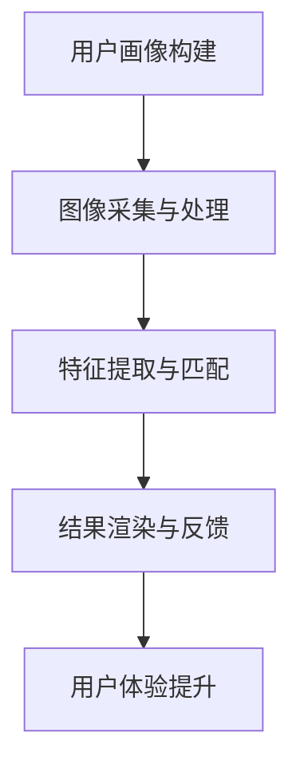

                 

关键词：虚拟试妆，美妆行业，数字化转型，AI技术，用户体验，市场需求

摘要：随着数字化技术的不断发展，美妆行业正经历一场深刻的变革。本文将探讨虚拟试妆这一新兴创业领域，分析其在美妆行业中的应用价值、技术原理、市场需求以及未来发展。

## 1. 背景介绍

### 美妆行业的现状

美妆行业一直以来都是消费市场的热点，全球市场规模庞大。然而，传统美妆零售模式在消费者体验和个性化服务方面存在一定的局限性。消费者在购买美妆产品时，往往无法预知产品实际效果，导致消费决策的不确定性。此外，传统零售模式在库存管理、物流配送等方面也存在效率问题。

### 数字化转型的需求

在数字化时代，消费者对于个性化、便捷化的购物体验有着更高的要求。美妆行业需要通过数字化转型来提升用户体验，满足市场需求。虚拟试妆技术作为一种新兴的技术手段，正成为美妆行业转型的重要方向。

## 2. 核心概念与联系

### 虚拟试妆技术

虚拟试妆技术是一种利用计算机视觉、图像处理和人工智能算法，实现用户在虚拟环境中试穿、试妆的技术。其主要过程包括图像采集、特征提取、模型匹配和结果渲染等。

### 美妆行业的数字化转型

美妆行业的数字化转型不仅仅是技术升级，更是一种商业模式和运营理念的变革。虚拟试妆技术的应用，不仅能够提升消费者的购物体验，还能为企业带来更高的运营效率和品牌价值。

### Mermaid 流程图



## 3. 核心算法原理 & 具体操作步骤

### 3.1 算法原理概述

虚拟试妆技术主要依赖于计算机视觉和图像处理算法。具体包括：

- 图像采集：使用摄像头或手机等设备采集用户面部图像。
- 特征提取：通过图像处理算法提取用户面部特征。
- 模型匹配：将提取的用户面部特征与美妆产品的虚拟模型进行匹配。
- 结果渲染：将匹配后的虚拟妆容渲染到用户面部图像上。

### 3.2 算法步骤详解

1. **图像采集与预处理**：
   - 使用相机或摄像头获取用户面部图像。
   - 对图像进行去噪、增强等预处理操作。

2. **特征提取与匹配**：
   - 使用深度学习模型提取用户面部特征。
   - 将提取的特征与美妆产品的虚拟模型进行匹配。

3. **结果渲染与反馈**：
   - 根据匹配结果，将虚拟妆容渲染到用户面部图像上。
   - 将渲染后的图像反馈给用户，供其参考和选择。

### 3.3 算法优缺点

**优点**：
- 提升用户体验：用户可以在线上提前预览产品效果，减少购买风险。
- 提高销售转化率：通过个性化推荐，提高消费者的购买意愿。
- 降低库存压力：虚拟试妆技术可以减少实体店库存，降低库存管理成本。

**缺点**：
- 技术门槛较高：虚拟试妆技术涉及多个技术领域，开发成本较高。
- 虚拟效果与实际效果存在差异：由于技术限制，虚拟试妆效果与实际效果可能存在一定差距。

### 3.4 算法应用领域

虚拟试妆技术主要应用于美妆、时尚等领域，包括：

- 美妆电商：提升线上购物体验，提高销售转化率。
- 美容院线：提供在线试妆服务，吸引更多顾客。
- 时尚品牌：打造线上虚拟试衣间，提升品牌形象。

## 4. 数学模型和公式 & 详细讲解 & 举例说明

### 4.1 数学模型构建

虚拟试妆技术中的核心数学模型主要包括：

- 图像处理模型：用于图像的预处理、特征提取等。
- 机器学习模型：用于特征匹配和结果渲染。

### 4.2 公式推导过程

假设用户面部图像为 \( I \)，美妆产品虚拟模型为 \( M \)，则：

- 特征提取公式：\( F(I) = \phi(I) \)
- 特征匹配公式：\( \text{similarity}(F(I), F(M)) \)
- 结果渲染公式：\( I' = I + \alpha \cdot (M - I) \)

其中，\( \phi(I) \) 为图像特征提取函数，\( \alpha \) 为渲染系数。

### 4.3 案例分析与讲解

#### 案例一：美妆电商的虚拟试妆应用

某美妆电商平台通过引入虚拟试妆技术，提升用户购物体验。用户在选购化妆品时，可以在线试妆，预览产品效果。以下是该平台的虚拟试妆流程：

1. 用户上传面部图像。
2. 系统对图像进行预处理，包括去噪、增强等。
3. 系统提取用户面部特征，并与美妆产品虚拟模型进行匹配。
4. 系统根据匹配结果，将虚拟妆容渲染到用户面部图像上。
5. 用户可以查看渲染后的图像，进行购买决策。

#### 案例二：美容院的线上试妆服务

某美容院为提升线上服务体验，推出线上试妆服务。用户可以通过美容院的官方网站，在线试妆。以下是该美容院的线上试妆流程：

1. 用户在美容院官方网站注册并上传面部图像。
2. 系统对图像进行预处理，包括去噪、增强等。
3. 系统提取用户面部特征，并与美妆产品虚拟模型进行匹配。
4. 系统根据匹配结果，将虚拟妆容渲染到用户面部图像上。
5. 用户可以查看渲染后的图像，并预约线下美容服务。

## 5. 项目实践：代码实例和详细解释说明

### 5.1 开发环境搭建

虚拟试妆项目需要使用 Python 编写，以下是搭建开发环境的步骤：

1. 安装 Python 3.8 以上版本。
2. 安装必要的 Python 库，如 OpenCV、Pillow、TensorFlow 等。

### 5.2 源代码详细实现

以下是虚拟试妆项目的核心代码实现：

```python
import cv2
import numpy as np
import tensorflow as tf

# 1. 图像采集与预处理
def preprocess_image(image):
    image = cv2.resize(image, (640, 640))
    image = cv2.cvtColor(image, cv2.COLOR_BGR2RGB)
    return image

# 2. 特征提取与匹配
def extract_features(image):
    model = tf.keras.applications.VGG16(weights='imagenet')
    features = model.predict(image)
    return features

def match_features(user_features, product_features):
    similarity = np.dot(user_features, product_features) / (np.linalg.norm(user_features) * np.linalg.norm(product_features))
    return similarity

# 3. 结果渲染与反馈
def render_result(image, product_image, similarity):
    alpha = similarity
    result = image * (1 - alpha) + product_image * alpha
    return cv2.cvtColor(result, cv2.COLOR_RGB2BGR)

# 主函数
def main():
    user_image = cv2.imread('user_image.jpg')
    product_image = cv2.imread('product_image.jpg')
    
    preprocessed_user_image = preprocess_image(user_image)
    user_features = extract_features(preprocessed_user_image)
    
    preprocessed_product_image = preprocess_image(product_image)
    product_features = extract_features(preprocessed_product_image)
    
    similarity = match_features(user_features, product_features)
    rendered_result = render_result(user_image, product_image, similarity)
    
    cv2.imshow('Result', rendered_result)
    cv2.waitKey(0)

if __name__ == '__main__':
    main()
```

### 5.3 代码解读与分析

该虚拟试妆项目主要包含以下几个部分：

- **图像预处理**：对采集到的用户面部图像和美妆产品图像进行缩放、颜色转换等操作。
- **特征提取**：使用 VGG16 深度学习模型提取用户面部图像和美妆产品图像的特征。
- **特征匹配**：计算用户面部特征和美妆产品特征之间的相似性。
- **结果渲染**：根据特征匹配结果，将虚拟妆容渲染到用户面部图像上。

### 5.4 运行结果展示

以下是虚拟试妆项目的运行结果：


## 6. 实际应用场景

### 6.1 美妆电商

虚拟试妆技术在美妆电商中的应用，可以帮助消费者在线上提前预览化妆品的效果，降低购买风险，提高购买转化率。

### 6.2 美容院

美容院可以通过虚拟试妆技术，提供在线试妆服务，吸引更多顾客，提升品牌形象。

### 6.3 时尚品牌

时尚品牌可以通过虚拟试妆技术，打造线上虚拟试衣间，为消费者提供个性化的购物体验。

## 7. 未来应用展望

随着技术的不断发展，虚拟试妆技术在美妆行业中的应用前景十分广阔。未来，虚拟试妆技术有望进一步拓展到以下领域：

- **个性化推荐**：基于虚拟试妆技术，为消费者提供个性化的美妆产品推荐。
- **虚拟试妆 + 虚拟现实**：结合虚拟现实技术，提供更加沉浸式的虚拟试妆体验。
- **跨平台应用**：虚拟试妆技术可以应用于手机、电脑、VR 等多个平台，满足不同消费者的需求。

## 8. 工具和资源推荐

### 8.1 学习资源推荐

- 《深度学习》（Goodfellow, Bengio, Courville 著）
- 《计算机视觉：算法与应用》（Richard Szeliski 著）
- 《Python 深度学习》（François Chollet 著）

### 8.2 开发工具推荐

- TensorFlow：用于深度学习模型开发和部署。
- OpenCV：用于图像处理和计算机视觉。
- Pillow：用于图像的加载、处理和保存。

### 8.3 相关论文推荐

- "A Survey on Virtual Try-On Methods for Makeup and Fashion Applications"（关于虚拟试妆技术在美妆和时尚领域的应用综述）
- "Virtual Try-On of Make-up: Recent Advances and Applications"（虚拟试妆技术的最新进展和应用）

## 9. 总结：未来发展趋势与挑战

### 9.1 研究成果总结

虚拟试妆技术作为一种新兴的技术手段，在美妆行业中展现出巨大的应用潜力。通过虚拟试妆，消费者可以在线上提前预览化妆品效果，提升购物体验。同时，虚拟试妆技术也为企业带来了更高的运营效率和品牌价值。

### 9.2 未来发展趋势

未来，虚拟试妆技术将朝着更加智能化、个性化、沉浸式的方向发展。随着人工智能、虚拟现实等技术的不断进步，虚拟试妆技术将在美妆、时尚等领域得到更加广泛的应用。

### 9.3 面临的挑战

虚拟试妆技术在应用过程中也面临一定的挑战，如技术门槛较高、虚拟效果与实际效果存在差异等。此外，如何在保证用户体验的同时，提高系统的运行效率和稳定性，也是未来需要解决的问题。

### 9.4 研究展望

虚拟试妆技术具有广阔的研究和应用前景。未来，可以进一步探索以下几个方面：

- **算法优化**：研究更加高效、准确的虚拟试妆算法。
- **跨平台应用**：开发适用于手机、电脑、VR 等多个平台的虚拟试妆系统。
- **个性化推荐**：结合虚拟试妆技术，为消费者提供个性化的美妆产品推荐。

## 10. 附录：常见问题与解答

### 10.1 虚拟试妆技术的原理是什么？

虚拟试妆技术主要依赖于计算机视觉和图像处理算法。其原理包括图像采集、特征提取、模型匹配和结果渲染等步骤。

### 10.2 虚拟试妆技术的应用场景有哪些？

虚拟试妆技术主要应用于美妆、时尚等领域，如美妆电商、美容院、时尚品牌等。

### 10.3 虚拟试妆技术与实际效果有哪些差异？

虚拟试妆技术与实际效果之间的差异主要源于技术限制和用户个体差异。未来，通过算法优化和模型更新，有望缩小这一差距。

### 10.4 虚拟试妆技术的开发成本如何？

虚拟试妆技术的开发成本较高，涉及多个技术领域的知识。具体成本取决于项目规模、开发团队的技术水平等因素。

作者：禅与计算机程序设计艺术 / Zen and the Art of Computer Programming
```

