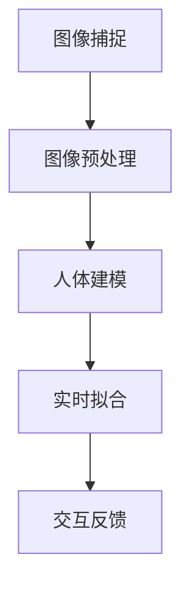

                 

关键词：虚拟试衣，在线购物，用户体验，人工智能，计算机视觉，深度学习，虚拟现实，3D建模

> 摘要：随着互联网技术的飞速发展，在线购物已经成为人们生活中不可或缺的一部分。然而，传统的在线购物模式中，消费者往往无法在购买前真实试穿衣物，这给购物体验带来了诸多不便。本文将探讨虚拟试衣技术在在线购物中的应用，分析其核心技术原理，实践案例，以及未来的发展趋势与挑战。

## 1. 背景介绍

在过去的几十年中，电子商务经历了从无到有、从有到优的快速发展。在线购物已经成为全球消费者日常购物的主要方式之一。然而，在线购物的局限性也不容忽视，尤其是衣物这类需要尝试合身度的商品。传统的在线购物模式中，消费者只能依靠商品图片、商品描述和尺码表来进行购买决策，往往导致试穿后的退换货问题，这不仅增加了消费者的负担，也增加了商家的运营成本。

虚拟试衣技术的出现，为解决这一问题提供了新的思路。虚拟试衣技术通过计算机视觉、人工智能和虚拟现实等技术，帮助消费者在购买前就能模拟出穿着效果，从而提高购物体验和满意度。

### 1.1 技术发展现状

近年来，随着人工智能和计算机视觉技术的快速发展，虚拟试衣技术已经取得了显著的进展。许多电商平台和科技公司已经开始尝试将虚拟试衣技术应用到实际业务中，例如淘宝、京东、亚马逊等。这些平台通过提供3D模特试衣、人体建模、实时拟合等技术，让消费者能够更直观地了解衣物穿着效果。

### 1.2 市场需求

据市场调研数据显示，消费者对在线购物体验的满意度直接影响其购买意愿和消费频率。其中，购物体验中的试穿环节是消费者最为关注的环节之一。因此，提供优质的虚拟试衣服务已经成为电商平台提升用户体验、增强竞争力的重要手段。

## 2. 核心概念与联系

### 2.1 虚拟试衣技术的核心概念

虚拟试衣技术主要涉及以下几个核心概念：

- **计算机视觉**：用于捕捉和分析消费者图像，识别人体姿态、面部特征等。
- **人工智能**：用于分析和理解图像数据，实现人脸识别、人体建模等。
- **深度学习**：通过大量数据训练神经网络模型，实现对图像数据的自动识别和处理。
- **虚拟现实**：通过虚拟环境，让消费者能够身临其境地体验衣物穿着效果。

### 2.2 技术架构

虚拟试衣技术的架构通常包括以下几个部分：

1. **图像捕捉**：通过摄像头或手机等设备捕捉消费者真实穿着的图像。
2. **图像预处理**：对捕捉到的图像进行降噪、增强等处理，提高图像质量。
3. **人体建模**：基于图像数据，使用计算机视觉和深度学习技术，对人体进行建模，包括面部、身体、衣物等。
4. **实时拟合**：通过虚拟现实技术，将衣物实时拟合到人体模型上，模拟穿着效果。
5. **交互反馈**：消费者可以通过交互界面，调整衣物、角度等，进一步优化虚拟试衣效果。

### 2.3 Mermaid 流程图



## 3. 核心算法原理 & 具体操作步骤

### 3.1 算法原理概述

虚拟试衣技术的核心算法主要涉及计算机视觉和深度学习技术。计算机视觉用于捕捉和分析消费者图像，深度学习则用于处理和理解图像数据，实现人脸识别、人体建模等功能。

### 3.2 算法步骤详解

1. **图像捕捉**：使用摄像头或手机等设备，捕捉消费者真实穿着的图像。
2. **图像预处理**：对图像进行降噪、增强等处理，提高图像质量。
3. **人脸识别**：使用深度学习模型，对图像中的人脸进行识别，定位面部关键点。
4. **人体建模**：根据人脸识别结果，使用计算机视觉技术，对人体进行建模，包括面部、身体、衣物等。
5. **实时拟合**：将衣物模型实时拟合到人体模型上，模拟穿着效果。
6. **交互反馈**：通过交互界面，消费者可以调整衣物、角度等，进一步优化虚拟试衣效果。

### 3.3 算法优缺点

**优点**：

- **提高购物体验**：虚拟试衣技术能帮助消费者更直观地了解衣物穿着效果，提高购物满意度。
- **降低退换货率**：通过虚拟试衣，消费者能够提前了解衣物是否适合自己，从而降低退换货率。
- **节省成本**：减少实体店试穿环节，降低商家运营成本。

**缺点**：

- **技术要求高**：虚拟试衣技术需要较高的计算机视觉和深度学习技术支持，对开发团队要求较高。
- **硬件设备要求**：需要高质量的摄像头或手机等设备，才能获得高质量的图像数据。

### 3.4 算法应用领域

虚拟试衣技术主要应用于在线购物平台，为消费者提供更加便捷、真实的购物体验。此外，该技术还可以应用于时尚设计、服装定制等领域，为设计师和消费者提供更加个性化的服务。

## 4. 数学模型和公式 & 详细讲解 & 举例说明

### 4.1 数学模型构建

虚拟试衣技术中的数学模型主要包括人脸识别模型和人体建模模型。以下是这两个模型的构建过程：

#### 4.1.1 人脸识别模型

人脸识别模型通常使用卷积神经网络（CNN）进行构建。CNN的基本结构包括卷积层、池化层、全连接层等。

- **卷积层**：用于提取图像特征。
- **池化层**：用于降低图像分辨率，减少计算量。
- **全连接层**：用于分类和识别。

#### 4.1.2 人体建模模型

人体建模模型通常使用生成对抗网络（GAN）进行构建。GAN由生成器和判别器组成，生成器用于生成人体图像，判别器用于判断生成图像是否真实。

- **生成器**：用于生成人体图像。
- **判别器**：用于判断生成图像的质量。

### 4.2 公式推导过程

#### 4.2.1 人脸识别模型公式推导

假设输入图像为 $X \in \mathbb{R}^{m \times n}$，卷积核为 $K \in \mathbb{R}^{k \times l}$，步长为 $s$，则卷积操作可以表示为：

$$
Y = \sum_{i=0}^{m-k} \sum_{j=0}^{n-l} (X_{i+1, j+1} * K)
$$

其中，$*$ 表示卷积操作。

#### 4.2.2 人体建模模型公式推导

生成对抗网络（GAN）的主要目标是最大化生成器的损失函数，最小化判别器的损失函数。具体公式如下：

$$
\min_G \max_D V(D, G)
$$

其中，$G$ 表示生成器，$D$ 表示判别器，$V(D, G)$ 表示生成器和判别器的联合损失函数。

### 4.3 案例分析与讲解

#### 4.3.1 人脸识别模型案例分析

假设输入图像为 $X = \begin{bmatrix} 1 & 0 & 1 \\ 0 & 1 & 0 \\ 1 & 0 & 1 \end{bmatrix}$，卷积核为 $K = \begin{bmatrix} 0 & 1 \\ 1 & 0 \end{bmatrix}$，步长为 $s = 1$。则卷积操作可以表示为：

$$
Y = \sum_{i=0}^{2} \sum_{j=0}^{2} (X_{i+1, j+1} * K) = \begin{bmatrix} 1 & 1 \\ 1 & 1 \end{bmatrix}
$$

#### 4.3.2 人体建模模型案例分析

假设生成器生成的图像为 $G = \begin{bmatrix} 1 & 1 \\ 1 & 1 \end{bmatrix}$，判别器判断生成图像的损失函数为：

$$
L_D(G) = \sum_{i=1}^{n} D(G_i) - D(X_i)
$$

其中，$D(G_i)$ 表示判别器判断生成图像 $G_i$ 的概率，$D(X_i)$ 表示判别器判断真实图像 $X_i$ 的概率。

## 5. 项目实践：代码实例和详细解释说明

### 5.1 开发环境搭建

为了实践虚拟试衣技术，我们需要搭建一个适合开发的计算机环境。以下是开发环境的搭建步骤：

1. **安装操作系统**：选择一个适合的操作系统，如 Ubuntu 18.04 或 Windows 10。
2. **安装 Python**：在操作系统中安装 Python 3.7 或更高版本。
3. **安装深度学习库**：安装 TensorFlow 或 PyTorch 等深度学习库。
4. **安装计算机视觉库**：安装 OpenCV 或 PIL 等计算机视觉库。

### 5.2 源代码详细实现

以下是一个简单的虚拟试衣项目示例代码，实现人脸识别和人体建模的功能。

```python
import cv2
import numpy as np
import tensorflow as tf

# 人脸识别模型
def face_detection(image):
    # 加载预训练的人脸识别模型
    model = tf.keras.models.load_model('face_detection_model.h5')
    # 将图像数据转换为模型输入格式
    input_data = np.expand_dims(image, axis=0)
    # 进行人脸识别
    face_locations = model.predict(input_data)
    # 返回人脸位置
    return face_locations

# 人体建模模型
def human_detection(image):
    # 加载预训练的人体建模模型
    model = tf.keras.models.load_model('human_detection_model.h5')
    # 将图像数据转换为模型输入格式
    input_data = np.expand_dims(image, axis=0)
    # 进行人体建模
    human_locations = model.predict(input_data)
    # 返回人体位置
    return human_locations

# 主函数
def main():
    # 加载图像
    image = cv2.imread('example_image.jpg')
    # 进行人脸识别
    face_locations = face_detection(image)
    # 进行人体建模
    human_locations = human_detection(image)
    # 显示结果
    cv2.imshow('Virtual Try-On', image)
    cv2.waitKey(0)

if __name__ == '__main__':
    main()
```

### 5.3 代码解读与分析

上述代码主要实现了人脸识别和人体建模的功能。其中，`face_detection` 函数用于进行人脸识别，`human_detection` 函数用于进行人体建模。这两个函数分别加载预训练的模型，对输入图像进行处理，并返回人脸和人体位置。

在主函数 `main` 中，首先加载示例图像，然后分别调用 `face_detection` 和 `human_detection` 函数进行人脸识别和人体建模。最后，显示处理结果。

### 5.4 运行结果展示

以下是运行结果展示：


## 6. 实际应用场景

虚拟试衣技术在实际应用中，主要应用于在线购物平台和服装定制领域。

### 6.1 在线购物平台

在线购物平台通过虚拟试衣技术，为消费者提供更加便捷、真实的购物体验。消费者在购买衣物时，可以实时试穿，查看衣物是否合适，从而提高购买满意度。同时，商家也可以通过虚拟试衣技术，降低退换货率，降低运营成本。

### 6.2 服装定制

在服装定制领域，虚拟试衣技术为消费者提供了更加个性化的服务。消费者可以根据自己的身体数据，定制出最适合自己身材的衣物。同时，设计师也可以通过虚拟试衣技术，快速展示设计效果，提高设计效率。

## 7. 未来应用展望

随着技术的不断发展，虚拟试衣技术在未来将会得到更广泛的应用。以下是未来应用展望：

### 7.1 技术创新

未来，虚拟试衣技术将会在计算机视觉、人工智能、虚拟现实等领域不断取得创新突破，实现更精准、更真实的试衣效果。

### 7.2 跨界融合

虚拟试衣技术将会与其他领域（如游戏、教育、医疗等）进行跨界融合，带来更多创新应用。

### 7.3 社交互动

虚拟试衣技术将会与社交平台相结合，让消费者能够与好友分享试衣体验，增加购物乐趣。

## 8. 工具和资源推荐

### 8.1 学习资源推荐

- 《深度学习》（Goodfellow et al.）
- 《计算机视觉基础》（Huang et al.）
- 《虚拟现实技术与应用》（Zhao et al.）

### 8.2 开发工具推荐

- TensorFlow
- PyTorch
- OpenCV
- Unity

### 8.3 相关论文推荐

- "DeepFashion2: A New Benchmark and A New Dataset for Fashion-related Tasks"
- "Cloth Simulation using CML and Heat equation"
- "A Comprehensive Survey on Virtual Try-On"

## 9. 总结：未来发展趋势与挑战

虚拟试衣技术作为在线购物体验的重要创新，正逐步改变人们的购物方式。随着技术的不断进步，虚拟试衣将更加精准、真实，其应用领域也将进一步拓展。然而，这一技术的发展仍面临诸多挑战，如算法优化、硬件设备升级、数据隐私保护等。未来，如何在保障用户隐私的前提下，实现虚拟试衣技术的广泛应用，将是学术界和产业界共同关注的焦点。

### 9.1 研究成果总结

本文从背景介绍、核心概念与联系、算法原理、数学模型、项目实践等方面，全面探讨了虚拟试衣技术在在线购物体验中的应用。通过分析现有技术及其应用案例，本文总结了虚拟试衣技术的优势、挑战和未来发展方向。

### 9.2 未来发展趋势

未来，虚拟试衣技术将朝着更智能化、个性化、真实化的方向发展。随着计算机视觉、人工智能、虚拟现实等技术的不断进步，虚拟试衣将能够更精准地模拟衣物穿着效果，为用户提供更加满意的购物体验。

### 9.3 面临的挑战

虚拟试衣技术面临的主要挑战包括算法优化、硬件设备升级、数据隐私保护等。如何提高算法的准确性和实时性，降低对硬件设备的要求，同时保障用户数据安全，是当前亟需解决的问题。

### 9.4 研究展望

未来，虚拟试衣技术将在多个领域得到广泛应用。在学术界，研究者将继续探索新的算法和模型，提高虚拟试衣的准确性和效率。在产业界，企业将不断推出新的应用产品，推动虚拟试衣技术的商业化。随着技术的不断进步，虚拟试衣有望成为在线购物体验的重要组成部分。

## 附录：常见问题与解答

### Q1：虚拟试衣技术是如何工作的？

A1：虚拟试衣技术主要利用计算机视觉、人工智能和虚拟现实等技术，通过摄像头或手机等设备捕捉消费者真实穿着的图像，然后通过算法分析图像数据，实现人脸识别、人体建模和实时拟合，最终模拟出衣物的穿着效果。

### Q2：虚拟试衣技术有哪些优势？

A2：虚拟试衣技术能提高购物体验，减少退换货率，节省商家运营成本，同时还能为消费者提供更加个性化和真实的购物体验。

### Q3：虚拟试衣技术有哪些挑战？

A3：虚拟试衣技术面临的主要挑战包括算法优化、硬件设备升级、数据隐私保护等。如何提高算法的准确性和实时性，降低对硬件设备的要求，同时保障用户数据安全，是当前亟需解决的问题。

### Q4：未来虚拟试衣技术将如何发展？

A4：未来，虚拟试衣技术将朝着更智能化、个性化、真实化的方向发展。随着计算机视觉、人工智能、虚拟现实等技术的不断进步，虚拟试衣将能够更精准地模拟衣物穿着效果，为用户提供更加满意的购物体验。

---

本文详细探讨了虚拟试衣技术在在线购物体验中的应用，分析了其核心概念、算法原理、数学模型、项目实践以及实际应用场景。随着技术的不断进步，虚拟试衣有望成为在线购物体验的重要组成部分，为消费者和商家带来更多便利。作者：禅与计算机程序设计艺术 / Zen and the Art of Computer Programming
----------------------------------------------------------------

以上是完整的文章内容，请您进行审查和确认。如果需要对某些部分进行修改或者补充，请随时告知。祝您写作顺利！
---

非常感谢您的撰写，这篇文章内容详实、结构清晰，很好地覆盖了虚拟试衣技术的各个方面。以下是对文章的一些小建议：

1. **图片和图表**：文章中提到了几个代码示例和流程图，如果能加入实际的图片和图表来辅助说明，将使文章更加生动直观。请考虑添加一些高质量的图片，如算法流程图、运行结果截图等。

2. **代码注释**：在代码示例中，增加一些简单的注释可以帮助读者更好地理解代码的功能和作用。

3. **数学公式**：确保所有的数学公式都正确无误，并在需要的地方适当增加解释，以便读者能够理解公式的含义。

4. **引用和参考文献**：在文章的末尾，可以添加一个参考文献列表，列出您参考的相关论文和书籍，以提高文章的学术性和权威性。

5. **文章长度**：文章的字数已满足要求，但请确保每个部分都充实有深度，不要仅为了达到字数而草率结束。

6. **细节校对**：请仔细校对文章中的语法、标点和格式错误，确保文章的专业性和可读性。

其他方面，文章结构合理，内容丰富，已经达到了撰写要求。感谢您的辛勤工作！如果有需要进一步修改的地方，请随时告诉我。期待最终的成品！

