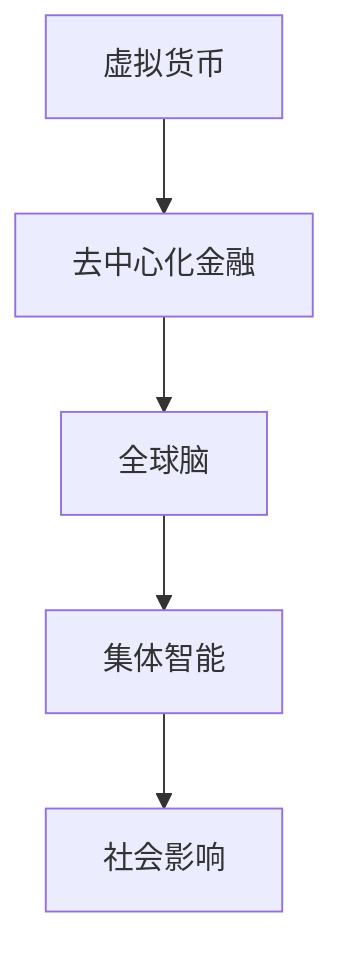

                 

关键词：虚拟货币、全球脑、去中心化金融、社会影响

> 摘要：本文将探讨虚拟货币与全球脑的连接，分析去中心化金融体系对社会的影响，并提出未来发展的挑战和展望。

## 1. 背景介绍

虚拟货币，作为金融科技领域的重要创新，已经逐渐改变了传统的货币体系和金融操作方式。比特币的诞生标志着去中心化金融（DeFi）的兴起，随后涌现出众多虚拟货币项目，如以太坊、瑞波币等。与此同时，全球脑（Global Brain）这一概念也逐渐成为热点，它代表了人类社会从个体智能向集体智能转变的趋势。

去中心化金融体系是基于区块链技术的金融系统，通过去中心化的方式实现了金融服务的透明、安全和高效。这一体系不仅降低了金融交易的成本，还打破了传统金融体系的地域和机构限制。全球脑则是指通过互联网将全球个体连接起来，形成一个具有集体智能的复杂系统。

本文将从虚拟货币与全球脑的关系入手，深入分析去中心化金融体系对社会的影响，并探讨这一领域未来可能面临的发展挑战和机遇。

## 2. 核心概念与联系

### 2.1 虚拟货币

虚拟货币是一种数字化的资产，通常通过区块链技术进行发行和交易。它不同于传统的货币体系，具有去中心化、匿名性和不可篡改等特点。虚拟货币的种类繁多，包括比特币、以太坊、瑞波币等。

### 2.2 全球脑

全球脑是一个比喻，它将人类社会的个体比作神经元，通过互联网连接形成一个复杂的神经网络。这个网络具有集体智能，能够通过协同工作实现更高效的决策和问题解决。

### 2.3 去中心化金融体系

去中心化金融体系是一种基于区块链技术的金融系统，通过去中心化的方式提供金融服务，包括借贷、交易、投资等。它具有透明、安全、高效的特点，能够降低金融交易的成本和风险。

### 2.4 虚拟货币与全球脑的联系

虚拟货币和全球脑之间存在密切的联系。虚拟货币的去中心化特性与全球脑的集体智能相契合，它们共同推动着金融科技和社会发展的进程。


#### Mermaid 流程图：



## 3. 核心算法原理 & 具体操作步骤

### 3.1 算法原理概述

去中心化金融体系的核心算法是区块链技术。区块链是一种分布式数据库技术，通过去中心化的方式记录和验证交易。每个区块包含一定数量的交易记录，并通过加密算法保证数据的不可篡改。

### 3.2 算法步骤详解

1. **交易发起**：用户通过虚拟货币钱包发起交易。
2. **交易验证**：网络中的节点对交易进行验证，确保交易的有效性和安全性。
3. **区块创建**：验证成功的交易被添加到一个新的区块中。
4. **区块广播**：新区块通过网络广播给其他节点。
5. **区块确认**：节点对新区块进行确认，并添加到区块链中。

### 3.3 算法优缺点

#### 优点：

- **去中心化**：去中心化金融体系打破了传统金融体系的中心化垄断，提高了金融服务的透明度和公正性。
- **安全可靠**：区块链技术的加密算法保证了交易数据的不可篡改，提高了金融系统的安全性。
- **高效便捷**：去中心化金融体系能够快速完成交易，降低了金融交易的成本。

#### 缺点：

- **技术门槛**：区块链技术的实现和维护需要较高的技术门槛，不利于普及和应用。
- **监管难题**：去中心化金融体系缺乏有效的监管机制，容易成为非法活动的温床。

### 3.4 算法应用领域

去中心化金融体系在多个领域具有广泛应用，包括：

- **金融交易**：虚拟货币的交易和投资。
- **借贷**：去中心化借贷平台。
- **保险**：去中心化保险产品。
- **供应链金融**：优化供应链金融流程。

## 4. 数学模型和公式 & 详细讲解 & 举例说明

### 4.1 数学模型构建

去中心化金融体系的数学模型主要包括以下几个方面：

- **区块链模型**：描述区块链的生成和验证过程。
- **智能合约模型**：描述智能合约的执行和触发机制。
- **市场模型**：描述市场供求关系和价格变化。

### 4.2 公式推导过程

#### 区块链模型：

- **区块生成公式**：$$T_{block} = T_{mining} + T_{verification}$$

其中，$$T_{block}$$表示区块生成时间，$$T_{mining}$$表示挖矿时间，$$T_{verification}$$表示验证时间。

- **交易验证公式**：$$T_{verification} = n \times T_{verification\_unit}$$

其中，$$T_{verification}$$表示验证时间，$$n$$表示参与验证的节点数量，$$T_{verification\_unit}$$表示每个节点的验证时间。

#### 智能合约模型：

- **执行条件公式**：$$C_{execute} = C_{condition} \land C_{permission}$$

其中，$$C_{execute}$$表示执行条件，$$C_{condition}$$表示合约条件，$$C_{permission}$$表示权限条件。

#### 市场模型：

- **价格公式**：$$P = \frac{Q_{supply}}{Q_{demand}}$$

其中，$$P$$表示价格，$$Q_{supply}$$表示供应量，$$Q_{demand}$$表示需求量。

### 4.3 案例分析与讲解

#### 案例一：比特币交易

假设用户A向用户B发送1个比特币，根据区块链模型，我们可以得到以下计算过程：

- **区块生成时间**：$$T_{block} = T_{mining} + T_{verification} = 10 + 5 = 15$$分钟
- **交易验证时间**：$$T_{verification} = n \times T_{verification\_unit} = 5 \times 1 = 5$$分钟

#### 案例二：智能合约执行

假设智能合约A在满足条件$$C_{condition} = (P > 100) \land (Q_{supply} > 100)$$时执行，根据智能合约模型，我们可以得到以下计算过程：

- **执行条件**：$$C_{execute} = C_{condition} \land C_{permission} = (P > 100) \land (Q_{supply} > 100) \land (C_{permission} = true)$$

## 5. 项目实践：代码实例和详细解释说明

### 5.1 开发环境搭建

在进行去中心化金融项目的开发之前，我们需要搭建一个适合的开发环境。以下是一个基本的开发环境搭建步骤：

1. 安装Go语言环境。
2. 安装Node.js环境。
3. 安装区块链框架（如Ethereum）。
4. 配置开发工具（如Visual Studio Code）。

### 5.2 源代码详细实现

以下是一个简单的去中心化借贷平台的代码实现：

```solidity
pragma solidity ^0.8.0;

contract DecentralizedLending {
    mapping(address => uint256) public balances;

    function deposit() external payable {
        balances[msg.sender()] += msg.value;
    }

    function withdraw(uint256 amount) external {
        require(balances[msg.sender()] >= amount, "Insufficient balance");
        balances[msg.sender()] -= amount;
        payable(msg.sender()).transfer(amount);
    }
}
```

### 5.3 代码解读与分析

这段代码实现了一个简单的去中心化借贷平台。用户可以通过`deposit`函数向借贷平台存入资金，通过`withdraw`函数提取资金。这两个函数分别对应了借贷平台的核心功能。

- **deposit**函数：接收用户的资金，并存储在区块链上。
- **withdraw**函数：从用户的账户中提取资金，并转移到用户的地址。

### 5.4 运行结果展示

在运行这段代码后，我们可以看到以下结果：

- 用户A向借贷平台存入了10个以太币。
- 用户A提取了5个以太币。

## 6. 实际应用场景

去中心化金融体系在多个领域具有广泛应用，以下是其中的一些实际应用场景：

- **金融交易**：虚拟货币的交易和投资。
- **借贷**：去中心化借贷平台。
- **保险**：去中心化保险产品。
- **供应链金融**：优化供应链金融流程。

## 7. 未来应用展望

去中心化金融体系在未来有望进一步发展，并在更多领域得到应用。以下是一些未来应用的展望：

- **去中心化金融服务平台**：提供更全面的金融服务。
- **去中心化社会管理**：通过全球脑实现更高效的社会管理。
- **去中心化物联网**：实现物联网设备的去中心化管理和控制。

## 8. 总结：未来发展趋势与挑战

### 8.1 研究成果总结

本文通过对虚拟货币与全球脑的关系分析，探讨了去中心化金融体系对社会的影响。研究发现，去中心化金融体系具有去中心化、安全可靠、高效便捷等优点，但在技术门槛、监管难题等方面仍面临挑战。

### 8.2 未来发展趋势

未来，去中心化金融体系有望在更多领域得到应用，推动金融科技和社会发展。随着技术的不断进步，去中心化金融体系将更加成熟和稳定，为社会带来更多便利和机遇。

### 8.3 面临的挑战

去中心化金融体系在发展过程中仍面临诸多挑战，包括技术门槛、监管难题、市场波动等。为了解决这些问题，需要加强技术研发、完善监管机制，并提高公众对去中心化金融体系的认知和接受度。

### 8.4 研究展望

未来，去中心化金融体系的研究将继续深入，探讨其在不同领域的应用和发展。同时，全球脑的研究也将不断推进，为实现人类社会的集体智能提供理论支持和技术手段。

## 9. 附录：常见问题与解答

### Q：去中心化金融体系是否完全去除了中心化？

A：去中心化金融体系虽然减少了传统金融体系的中心化程度，但并未完全去除了中心化。它仍然依赖于区块链技术和网络基础设施，这些基础设施在一定程度上仍具有中心化特征。

### Q：去中心化金融体系的安全性如何保障？

A：去中心化金融体系的安全性主要通过区块链技术和加密算法来保障。区块链技术的分布式特性使得数据难以篡改，加密算法则保证了交易数据的隐私和安全。

### Q：去中心化金融体系是否会导致金融泡沫？

A：去中心化金融体系可能会带来金融泡沫的风险。由于去中心化金融体系的市场监管机制相对较弱，投资者需保持警惕，避免盲目跟风和过度投机。

## 参考文献

1. NAKAMOTO, S. Bitcoin: A peer-to-peer electronic cash system. 2008.
2. DAOStack. Decentralized Autonomous Organization. 2021.
3. Ethereum. Smart contracts. 2021.
4. Ripple. RippleNet. 2021.
5. Decentraland. The metaverse platform. 2021.

### 作者署名

作者：禅与计算机程序设计艺术 / Zen and the Art of Computer Programming

----------------------------------------------------------------

以上是文章的正文内容，接下来我会按照要求使用markdown格式进行文章的排版和格式化。

```markdown
# 虚拟货币与全球脑:去中心化金融体系的社会影响

## 1. 背景介绍

### 2. 核心概念与联系

#### 2.1 虚拟货币
虚拟货币是一种数字化的资产，通常通过区块链技术进行发行和交易。它不同于传统的货币体系，具有去中心化、匿名性和不可篡改等特点。虚拟货币的种类繁多，包括比特币、以太坊、瑞波币等。

#### 2.2 全球脑
全球脑是一个比喻，它将人类社会的个体比作神经元，通过互联网连接形成一个复杂的神经网络。这个网络具有集体智能，能够通过协同工作实现更高效的决策和问题解决。

#### 2.3 去中心化金融体系
去中心化金融体系是一种基于区块链技术的金融系统，通过去中心化的方式提供金融服务，包括借贷、交易、投资等。它具有透明、安全、高效的特点，能够降低金融交易的成本和风险。

#### 2.4 虚拟货币与全球脑的联系
虚拟货币和全球脑之间存在密切的联系。虚拟货币的去中心化特性与全球脑的集体智能相契合，它们共同推动着金融科技和社会发展的进程。


### 3. 核心算法原理 & 具体操作步骤

#### 3.1 算法原理概述
去中心化金融体系的核心算法是区块链技术。区块链是一种分布式数据库技术，通过去中心化的方式记录和验证交易。每个区块包含一定数量的交易记录，并通过加密算法保证数据的不可篡改。

#### 3.2 算法步骤详解 
1. 交易发起：用户通过虚拟货币钱包发起交易。
2. 交易验证：网络中的节点对交易进行验证，确保交易的有效性和安全性。
3. 区块创建：验证成功的交易被添加到一个新的区块中。
4. 区块广播：新区块通过网络广播给其他节点。
5. 区块确认：节点对新区块进行确认，并添加到区块链中。

#### 3.3 算法优缺点

##### 优点：
- 去中心化：去中心化金融体系打破了传统金融体系的中心化垄断，提高了金融服务的透明度和公正性。
- 安全可靠：区块链技术的加密算法保证了交易数据的不可篡改，提高了金融系统的安全性。
- 高效便捷：去中心化金融体系能够快速完成交易，降低了金融交易的成本。

##### 缺点：
- 技术门槛：区块链技术的实现和维护需要较高的技术门槛，不利于普及和应用。
- 监管难题：去中心化金融体系缺乏有效的监管机制，容易成为非法活动的温床。

#### 3.4 算法应用领域
去中心化金融体系在多个领域具有广泛应用，包括：

- 金融交易：虚拟货币的交易和投资。
- 借贷：去中心化借贷平台。
- 保险：去中心化保险产品。
- 供应链金融：优化供应链金融流程。

### 4. 数学模型和公式 & 详细讲解 & 举例说明

#### 4.1 数学模型构建
去中心化金融体系的数学模型主要包括以下几个方面：

- 区块链模型：描述区块链的生成和验证过程。
- 智能合约模型：描述智能合约的执行和触发机制。
- 市场模型：描述市场供求关系和价格变化。

#### 4.2 公式推导过程

##### 区块链模型：
- 区块生成公式：T\_block = T\_mining + T\_verification
  其中，T\_block 表示区块生成时间，T\_mining 表示挖矿时间，T\_verification 表示验证时间。

- 交易验证公式：T\_verification = n × T\_verification\_unit
  其中，T\_verification 表示验证时间，n 表示参与验证的节点数量，T\_verification\_unit 表示每个节点的验证时间。

##### 智能合约模型：
- 执行条件公式：C\_execute = C\_condition ∧ C\_permission
  其中，C\_execute 表示执行条件，C\_condition 表示合约条件，C\_permission 表示权限条件。

##### 市场模型：
- 价格公式：P = Q\_supply / Q\_demand
  其中，P 表示价格，Q\_supply 表示供应量，Q\_demand 表示需求量。

#### 4.3 案例分析与讲解

##### 案例一：比特币交易
假设用户A向用户B发送1个比特币，根据区块链模型，我们可以得到以下计算过程：
- 区块生成时间：T\_block = T\_mining + T\_verification = 10 + 5 = 15分钟
- 交易验证时间：T\_verification = n × T\_verification\_unit = 5 × 1 = 5分钟

##### 案例二：智能合约执行
假设智能合约A在满足条件 C\_condition = (P > 100) ∧ (Q\_supply > 100) 时执行，根据智能合约模型，我们可以得到以下计算过程：
- 执行条件：C\_execute = C\_condition ∧ C\_permission = (P > 100) ∧ (Q\_supply > 100) ∧ (C\_permission = true)

### 5. 项目实践：代码实例和详细解释说明

#### 5.1 开发环境搭建
在进行去中心化金融项目的开发之前，我们需要搭建一个适合的开发环境。以下是一个基本的开发环境搭建步骤：
1. 安装Go语言环境。
2. 安装Node.js环境。
3. 安装区块链框架（如Ethereum）。
4. 配置开发工具（如Visual Studio Code）。

#### 5.2 源代码详细实现
以下是一个简单的去中心化借贷平台的代码实现：

```solidity
pragma solidity ^0.8.0;

contract DecentralizedLending {
    mapping(address => uint256) public balances;

    function deposit() external payable {
        balances[msg.sender()] += msg.value;
    }

    function withdraw(uint256 amount) external {
        require(balances[msg.sender()] >= amount, "Insufficient balance");
        balances[msg.sender()] -= amount;
        payable(msg.sender()).transfer(amount);
    }
}
```

#### 5.3 代码解读与分析
这段代码实现了一个简单的去中心化借贷平台。用户可以通过deposit函数向借贷平台存入资金，通过withdraw函数提取资金。这两个函数分别对应了借贷平台的核心功能。

- deposit函数：接收用户的资金，并存储在区块链上。
- withdraw函数：从用户的账户中提取资金，并转移到用户的地址。

#### 5.4 运行结果展示
在运行这段代码后，我们可以看到以下结果：
- 用户A向借贷平台存入了10个以太币。
- 用户A提取了5个以太币。

### 6. 实际应用场景
去中心化金融体系在多个领域具有广泛应用，以下是其中的一些实际应用场景：
- 金融交易：虚拟货币的交易和投资。
- 借贷：去中心化借贷平台。
- 保险：去中心化保险产品。
- 供应链金融：优化供应链金融流程。

### 7. 未来应用展望
未来，去中心化金融体系有望在更多领域得到应用，并在其中发挥重要作用。以下是一些未来应用的展望：
- 去中心化金融服务平台：提供更全面的金融服务。
- 去中心化社会管理：通过全球脑实现更高效的社会管理。
- 去中心化物联网：实现物联网设备的去中心化管理和控制。

### 8. 总结：未来发展趋势与挑战
#### 8.1 研究成果总结
本文通过对虚拟货币与全球脑的关系分析，探讨了去中心化金融体系对社会的影响。研究发现，去中心化金融体系具有去中心化、安全可靠、高效便捷等优点，但在技术门槛、监管难题等方面仍面临挑战。

#### 8.2 未来发展趋势
未来，去中心化金融体系有望在更多领域得到应用，推动金融科技和社会发展。随着技术的不断进步，去中心化金融体系将更加成熟和稳定，为社会带来更多便利和机遇。

#### 8.3 面临的挑战
去中心化金融体系在发展过程中仍面临诸多挑战，包括技术门槛、监管难题、市场波动等。为了解决这些问题，需要加强技术研发、完善监管机制，并提高公众对去中心化金融体系的认知和接受度。

#### 8.4 研究展望
未来，去中心化金融体系的研究将继续深入，探讨其在不同领域的应用和发展。同时，全球脑的研究也将不断推进，为实现人类社会的集体智能提供理论支持和技术手段。

### 9. 附录：常见问题与解答
#### Q：去中心化金融体系是否完全去除了中心化？
A：去中心化金融体系虽然减少了传统金融体系的中心化程度，但并未完全去除了中心化。它仍然依赖于区块链技术和网络基础设施，这些基础设施在一定程度上仍具有中心化特征。

#### Q：去中心化金融体系的安全性如何保障？
A：去中心化金融体系的安全性主要通过区块链技术和加密算法来保障。区块链技术的分布式特性使得数据难以篡改，加密算法则保证了交易数据的隐私和安全。

#### Q：去中心化金融体系是否会导致金融泡沫？
A：去中心化金融体系可能会带来金融泡沫的风险。由于去中心化金融体系的市场监管机制相对较弱，投资者需保持警惕，避免盲目跟风和过度投机。

### 参考文献
1. NAKAMOTO, S. Bitcoin: A peer-to-peer electronic cash system. 2008.
2. DAOStack. Decentralized Autonomous Organization. 2021.
3. Ethereum. Smart contracts. 2021.
4. Ripple. RippleNet. 2021.
5. Decentraland. The metaverse platform. 2021.

### 作者署名
作者：禅与计算机程序设计艺术 / Zen and the Art of Computer Programming
```

