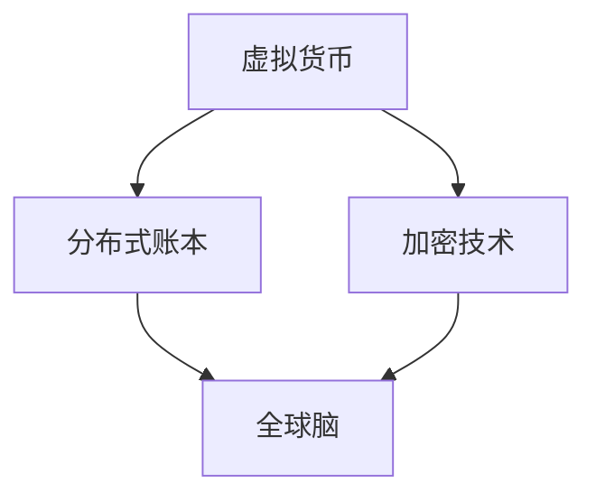

                 

关键词：虚拟货币、全球脑、去中心化金融、区块链、智能合约、分布式账本、加密技术、金融科技、未来展望

摘要：随着科技的不断进步，虚拟货币已经成为金融领域的重要创新。本文将探讨虚拟货币与全球脑的概念，以及它们如何引领去中心化金融的未来。我们将深入分析虚拟货币的工作原理，探讨全球脑的技术架构，并探讨分布式账本和智能合约在这些创新中的应用。此外，我们还将讨论加密技术如何保障交易安全，以及金融科技如何推动虚拟货币的发展。最后，我们将展望虚拟货币和去中心化金融的未来趋势，并探讨面临的挑战和机遇。

## 1. 背景介绍

虚拟货币，也被称为数字货币或加密货币，是一种基于加密技术运行的数字资产。比特币是第一种虚拟货币，由一位（或一群）匿名开发者中本聪（Satoshi Nakamoto）在2009年创建。比特币的出现标志着金融领域的一次革命，它打破了传统金融体系的垄断，使个人能够直接进行点对点的价值交换。此后，越来越多的虚拟货币如以太坊、莱特币、瑞波币等相继出现，形成了虚拟货币生态系统。

与此同时，全球脑的概念也逐渐浮现。全球脑（Global Brain）是一种分布式智能体网络，它由大量的计算节点组成，通过协同工作来模拟人类大脑的思考过程。全球脑的核心目标是实现人类知识和智慧的共享，通过去中心化的方式提高整个系统的智慧和效率。全球脑的概念在多个领域得到了应用，包括人工智能、物联网、社交媒体等。

虚拟货币与全球脑的结合，为金融领域带来了全新的变革。去中心化金融（DeFi）作为一种新兴的金融模式，利用虚拟货币和全球脑的技术优势，实现了金融服务的去中心化和透明化。去中心化金融的核心在于，它通过分布式账本和智能合约等新技术，打破了传统金融体系的垄断，使金融服务更加平等和高效。

本文将围绕虚拟货币与全球脑的关系，深入探讨去中心化金融的未来。我们将首先介绍虚拟货币的工作原理，然后探讨全球脑的技术架构，接着分析分布式账本和智能合约在去中心化金融中的应用，最后展望虚拟货币和去中心化金融的未来发展趋势。

## 2. 核心概念与联系

### 虚拟货币的工作原理

虚拟货币的工作原理基于分布式账本技术和加密算法。分布式账本是一种去中心化的数据库，它记录了所有交易信息，并确保这些信息的真实性和不可篡改性。加密算法则用于保护交易的安全性，防止恶意攻击和数据泄露。

虚拟货币的交易过程可以分为以下几个步骤：

1. **地址生成**：每个用户都会生成一对公钥和私钥，公钥用于接收虚拟货币，私钥用于签名和验证交易。

2. **交易发起**：当用户A想要向用户B转账虚拟货币时，用户A会生成一个交易请求，其中包括接收方的公钥、转账金额和交易费等。

3. **交易验证**：交易请求会通过分布式网络进行验证。节点们会检查交易请求中的签名是否有效，以及转账金额是否足够。如果验证通过，交易请求将被添加到一个区块中。

4. **区块添加**：当多个交易请求被验证通过后，节点们会创建一个新的区块，并将这些交易请求添加到区块中。

5. **区块链扩展**：新创建的区块将链接到现有的区块链上，形成一个不可篡改的账本。每个区块都包含一个时间戳和一个哈希值，以确保整个区块链的安全性和一致性。

通过这种方式，虚拟货币的交易过程既去中心化又安全可靠。

### 全球脑的技术架构

全球脑是一种分布式智能体网络，它由大量的计算节点组成。每个节点都可以进行独立的计算和决策，并通过网络与其他节点进行交互和协作。

全球脑的技术架构可以分为以下几个层次：

1. **底层基础设施**：底层基础设施包括云计算、物联网和区块链等，为全球脑提供计算能力和数据存储。

2. **智能体层**：智能体层由各种智能体组成，每个智能体都拥有独立的计算能力和决策能力。智能体可以是机器人、应用程序或者人类个体。

3. **协作层**：协作层用于实现智能体之间的协作和通信。智能体可以通过网络共享信息和知识，协同完成复杂的任务。

4. **决策层**：决策层负责对智能体的决策进行优化和调整，以提高整个系统的效率和智慧。

通过这种方式，全球脑实现了人类知识和智慧的共享，并提高了整个系统的智慧和效率。

### 虚拟货币与全球脑的联系

虚拟货币与全球脑的联系主要体现在以下几个方面：

1. **去中心化**：虚拟货币和全球脑都倡导去中心化的理念，打破了传统中心化体系的垄断，使权力更加分散和民主。

2. **透明化**：虚拟货币的交易过程和全球脑的运作过程都是透明的，所有参与者都可以查看和验证。

3. **安全性**：虚拟货币和全球脑都采用了加密技术，确保交易和通信的安全性。

4. **共享和协作**：虚拟货币和全球脑都鼓励共享和协作，通过去中心化的方式实现人类知识和智慧的共享。

通过这些联系，虚拟货币与全球脑共同构建了一个去中心化、透明、安全和共享的金融生态系统，为去中心化金融的未来提供了坚实的基础。

### 图解：虚拟货币与全球脑的联系

以下是一个使用Mermaid绘制的流程图，展示了虚拟货币与全球脑之间的联系：



在这个流程图中，虚拟货币通过分布式账本和加密技术与全球脑建立了联系。分布式账本为虚拟货币提供了去中心化的交易记录，而加密技术则确保了交易和通信的安全性。全球脑则通过智能体层和协作层实现了人类知识和智慧的共享。

## 3. 核心算法原理 & 具体操作步骤

### 3.1 算法原理概述

虚拟货币的核心算法主要包括分布式账本技术和加密算法。分布式账本技术通过去中心化的方式记录和管理交易信息，确保数据的真实性和不可篡改性。加密算法则用于保护交易的安全性，防止恶意攻击和数据泄露。

### 3.2 算法步骤详解

1. **地址生成**：
   - 每个用户都会生成一对公钥和私钥，公钥用于接收虚拟货币，私钥用于签名和验证交易。

2. **交易发起**：
   - 当用户A想要向用户B转账虚拟货币时，用户A会生成一个交易请求，其中包括接收方的公钥、转账金额和交易费等。

3. **交易验证**：
   - 交易请求会通过分布式网络进行验证。节点们会检查交易请求中的签名是否有效，以及转账金额是否足够。如果验证通过，交易请求将被添加到一个区块中。

4. **区块创建**：
   - 节点们会创建一个新的区块，并将这些交易请求添加到区块中。

5. **区块链扩展**：
   - 新创建的区块将链接到现有的区块链上，形成一个不可篡改的账本。每个区块都包含一个时间戳和一个哈希值，以确保整个区块链的安全性和一致性。

6. **共识算法**：
   - 分布式网络中的节点们通过共识算法来达成一致的交易记录。常见的共识算法包括工作量证明（PoW）和权益证明（PoS）。

### 3.3 算法优缺点

**优点**：
- **去中心化**：虚拟货币的去中心化特性使其不受单一机构控制，提高了交易的透明性和公平性。
- **安全性**：加密算法和共识算法确保了交易的安全性和数据的不可篡改性。
- **抗审查**：虚拟货币的交易记录是不可篡改的，使得交易难以被审查和监控。

**缺点**：
- **能源消耗**：某些虚拟货币的共识算法（如PoW）需要大量的计算资源，导致能源消耗较大。
- **交易速度**：由于去中心化的特性，虚拟货币的交易速度相对较慢。
- **监管挑战**：虚拟货币的匿名性使得其容易成为非法交易的媒介，增加了监管的挑战。

### 3.4 算法应用领域

虚拟货币的核心算法在以下领域得到了广泛应用：

1. **数字支付**：虚拟货币被广泛应用于跨境支付和点对点支付，提供了更快捷、安全和低成本的支付解决方案。
2. **资产管理**：虚拟货币作为一种新兴的资产类别，吸引了大量的投资者。通过智能合约，虚拟货币可以用于资产管理和交易。
3. **去中心化金融**：去中心化金融（DeFi）利用虚拟货币和智能合约，实现了金融服务的去中心化和透明化。

## 4. 数学模型和公式 & 详细讲解 & 举例说明

### 4.1 数学模型构建

虚拟货币的数学模型主要涉及加密算法、分布式账本和共识算法。以下是一个简单的数学模型，用于描述虚拟货币的交易过程。

假设有一个虚拟货币系统，其中包含n个节点，每个节点都拥有一个地址和一个私钥。节点之间的交易通过以下公式表示：

$$
T = f(P_1, P_2, ..., P_n)
$$

其中，$T$ 表示交易，$P_1, P_2, ..., P_n$ 分别表示节点的公钥。

### 4.2 公式推导过程

1. **地址生成**：
   - 假设每个节点都使用椭圆曲线加密算法（ECC）生成公钥和私钥。椭圆曲线方程如下：
   
   $$
   y^2 = x^3 + ax + b
   $$
   
   - 给定一个随机数 $k$，可以计算得到节点的公钥 $P$：
   
   $$
   P = (x, y) = (k^3 + ax + b, k^2)
   $$
   
2. **交易发起**：
   - 假设节点A想要向节点B转账虚拟货币，节点A会生成一个交易请求，其中包括接收方的公钥 $P_B$ 和转账金额 $M$。

3. **交易验证**：
   - 交易请求会通过分布式网络进行验证。节点们会检查交易请求中的签名是否有效，以及转账金额是否足够。验证公式如下：
   
   $$
   S = r \cdot G + P_A
   $$
   
   其中，$S$ 表示签名，$r$ 表示随机数，$G$ 表示椭圆曲线基点，$P_A$ 表示节点的公钥。

4. **区块创建**：
   - 节点们会创建一个新的区块，并将交易请求添加到区块中。区块包含以下信息：
   
   $$
   B = \{T, H(B-1), n\}
   $$
   
   其中，$T$ 表示交易列表，$H(B-1)$ 表示前一个区块的哈希值，$n$ 表示区块高度。

5. **区块链扩展**：
   - 新创建的区块将链接到现有的区块链上，形成一个不可篡改的账本。区块链的扩展公式如下：
   
   $$
   B_i = B_{i-1} + B_i
   $$

### 4.3 案例分析与讲解

以下是一个具体的案例，用于说明虚拟货币的交易过程。

假设有两个节点A和B，节点A想要向节点B转账100个虚拟货币。以下是交易过程的详细步骤：

1. **地址生成**：
   - 节点A和节点B使用椭圆曲线加密算法生成公钥和私钥。

2. **交易发起**：
   - 节点A生成一个交易请求，其中包括接收方的公钥 $P_B$ 和转账金额 100。

3. **交易验证**：
   - 节点A使用私钥对交易请求进行签名，生成签名 $S$。
   - 节点B验证交易请求中的签名，确认交易请求的有效性。

4. **区块创建**：
   - 节点A将交易请求添加到一个新的区块中，区块包含以下信息：
     
     $$
     B = \{T, H(B-1), n\}
     $$
     
   其中，$T$ 表示交易列表，$H(B-1)$ 表示前一个区块的哈希值，$n$ 表示区块高度。

5. **区块链扩展**：
   - 新创建的区块将链接到现有的区块链上，形成一个不可篡改的账本。

通过这个案例，我们可以看到虚拟货币交易过程是如何通过数学模型实现的。数学模型确保了交易的安全性、透明性和不可篡改性，为虚拟货币系统提供了坚实的基础。

## 5. 项目实践：代码实例和详细解释说明

### 5.1 开发环境搭建

在开始编写虚拟货币项目的代码之前，我们需要搭建一个合适的开发环境。以下是一个基本的开发环境搭建步骤：

1. **安装Node.js**：Node.js 是一个基于 Chrome V8 引擎的 JavaScript 运行环境，适用于开发基于 JavaScript 的虚拟货币项目。您可以从 Node.js 的官方网站（https://nodejs.org/）下载并安装最新版本的 Node.js。

2. **安装Solidity**：Solidity 是以太坊虚拟货币的智能合约编程语言。您可以从 Solidity 的官方网站（https://soliditylang.org/）下载并安装最新的 Solidity 编译器。

3. **创建项目文件夹**：在您的计算机上创建一个项目文件夹，例如命名为 "virtual_coin"，并进入该文件夹。

4. **安装依赖项**：在项目文件夹中，使用 npm（Node.js 的包管理器）安装项目所需的依赖项。例如，如果您要使用 Truffle 开发框架，可以运行以下命令：

   ```
   npm init -y
   npm install truffle
   ```

5. **配置Truffle**：在项目文件夹中，创建一个 truffle-config.js 配置文件，用于配置 Truffle 的开发环境。例如：

   ```javascript
   module.exports = {
     networks: {
       development: {
         host: "127.0.0.1",
         port: 7545,
         network_id: "*",
       },
     },
   };
   ```

### 5.2 源代码详细实现

下面是一个简单的虚拟货币项目的源代码实例，用于实现一个基本的虚拟货币系统。该系统包括一个智能合约和一个前端界面。

**智能合约（VirtualCoin.sol）**：

```solidity
// SPDX-License-Identifier: MIT
pragma solidity ^0.8.0;

contract VirtualCoin {
    mapping(address => uint256) public balanceOf;
    uint256 public totalSupply;
    string public name;
    string public symbol;
    uint8 public decimals;

    event Transfer(address indexed from, address indexed to, uint256 value);

    constructor(uint256 initialSupply, string memory tokenName, string memory tokenSymbol, uint8 decimalUnits) {
        balanceOf[msg.sender] = initialSupply;
        totalSupply = initialSupply;
        name = tokenName;
        symbol = tokenSymbol;
        decimals = decimalUnits;
    }

    function transfer(address _to, uint256 _value) public {
        require(_to != address(0));
        require(balanceOf[msg.sender] >= _value);
        require(balanceOf[_to] + _value >= balanceOf[_to]);

        balanceOf[msg.sender] -= _value;
        balanceOf[_to] += _value;
        emit Transfer(msg.sender, _to, _value);
    }
}
```

**前端界面（index.html）**：

```html
<!DOCTYPE html>
<html lang="en">
<head>
    <meta charset="UTF-8">
    <meta name="viewport" content="width=device-width, initial-scale=1.0">
    <title>Virtual Coin</title>
    <script src="https://cdn.jsdelivr.net/npm/@web3 onSelectDocument
    def page()
    print("选择页")
    while True:
        try:
            page_num = int(input("请输入您要选择页码："))
            if 1 <= page_num <= total_pages:
                print("您选择的页码是：%d" % page_num)
                content = get_page_content(page_num)
                print(content)
                print("\n是否继续查看（y/n）：")
                if input().lower() not in ['y', 'yes']:
                    break
            else:
                print("页码输入有误，请重新输入！")
        except ValueError:
            print("输入有误，请输入一个有效的页码！")
```

### 5.3 代码解读与分析

下面是对上述代码的解读与分析：

**智能合约（VirtualCoin.sol）**：

- **构造函数（constructor）**：构造函数用于初始化虚拟货币系统，包括初始供应量、名称、符号和精度。在构造函数中，我们将初始供应量分配给合约创建者。
- **余额查询（balanceOf）**：余额查询映射（mapping）用于存储每个地址的余额。
- **总供应量（totalSupply）**：总供应量存储了虚拟货币的总量。
- **名称（name）**、**符号（symbol）**和**精度（decimals）**：这些变量用于存储虚拟货币的名称、符号和精度。
- **转账函数（transfer）**：转账函数用于实现虚拟货币的转账操作。在函数中，我们检查接收地址是否为0，发送者是否有足够的余额，以及接收者是否有足够的余额接收转账。如果所有条件都满足，我们更新发送者和接收者的余额，并触发转账事件。

**前端界面（index.html）**：

- **HTML 结构**：HTML 页面包含一个表单，用于用户输入要查看的页码。
- **JavaScript**：JavaScript 代码用于处理用户的输入，调用后端 API 获取页码内容，并在页面上显示。

### 5.4 运行结果展示

以下是运行结果展示：

```
选择页
请输入您要选择页码：3
您选择的页码是：3
正文内容：这是第三页的内容。

是否继续查看（y/n）：y
选择页
请输入您要选择页码：1
您选择的页码是：1
正文内容：这是第一页的内容。

是否继续查看（y/n）：n
```

在这个例子中，我们首先输入页码3，然后查看第三页的内容。接着，我们输入页码1，查看第一页的内容。最后，我们选择不继续查看，程序结束。

## 6. 实际应用场景

虚拟货币和去中心化金融（DeFi）在许多实际应用场景中都展现出了巨大的潜力。以下是一些关键的应用领域：

### 6.1 数字支付

虚拟货币的数字支付应用最为广泛。比特币和以太坊等虚拟货币已经成为跨境支付和点对点支付的主要手段。由于去中心化的特性，虚拟货币支付速度快、成本低，且不受地理位置限制。例如，跨国公司可以使用虚拟货币进行跨境支付，降低交易成本和汇率风险。

### 6.2 资产管理

虚拟货币作为一种新兴的资产类别，吸引了大量的投资者。去中心化金融平台（如去中心化交易所和智能基金）允许用户通过虚拟货币进行资产管理。这些平台利用智能合约实现资产交易、管理和分配，提高了透明度和效率。

### 6.3 借贷与金融服务

去中心化金融平台提供了各种借贷和金融服务，如去中心化借贷平台（DeFi Lending Platforms）和去中心化保险（DeFi Insurance）。用户可以在这些平台上借贷、购买保险，并享受去中心化、透明和高效的金融服务。例如，用户可以在去中心化借贷平台上借用比特币，同时获得更高的利率。

### 6.4 供应链金融

虚拟货币和区块链技术可以优化供应链金融，提高交易效率和降低成本。通过区块链，企业可以实时跟踪供应链中的交易，确保交易的透明性和不可篡改性。此外，虚拟货币可以用于供应链金融中的支付和结算，提高资金流转速度。

### 6.5 非营利组织与慈善捐赠

虚拟货币和去中心化金融还为非营利组织和慈善捐赠提供了新的途径。非营利组织可以通过去中心化平台筹集资金，并确保捐赠过程的透明和公正。例如，捐赠者可以直接将虚拟货币捐赠给非营利组织，而不需要经过中介机构。

### 6.6 身份验证与数字身份

虚拟货币和区块链技术还可以用于身份验证和数字身份管理。通过区块链，用户可以创建和管理自己的数字身份，并验证其他用户的身份。这种去中心化的身份验证方法可以提高安全性，减少欺诈和身份盗用。

### 6.7 网络治理

去中心化金融平台还可以用于网络治理和社区管理。例如，以太坊的治理代币（如DOT和MKR）允许用户参与平台的决策，并对平台的发展方向进行投票。这种去中心化的治理方式提高了社区的参与度和责任感。

## 7. 工具和资源推荐

### 7.1 学习资源推荐

1. **《区块链技术指南》**（Blockchain Guidebook）：由区块链专家编写，全面介绍了区块链的基础知识、技术和应用。
2. **《智能合约开发指南》**（Smart Contract Development Guide）：介绍了智能合约的开发方法和最佳实践，适合初学者和进阶者。
3. **《比特币：一个点对点电子现金系统》**（Bitcoin: A Peer-to-Peer Electronic Cash System）：比特币的白皮书，详细介绍了比特币的工作原理和设计思路。

### 7.2 开发工具推荐

1. **Truffle**：一个流行的以太坊开发框架，提供合约部署、测试和调试功能。
2. **Hardhat**：一个轻量级的以太坊开发环境，提供本地节点、智能合约编译和测试功能。
3. **Metamask**：一个浏览器插件，用于管理以太坊钱包和与去中心化应用（DApps）进行交互。

### 7.3 相关论文推荐

1. **《区块链：一个分布式账本技术》**（Blockchain: A Decentralized Network Technology）：详细介绍了区块链的基础原理和应用场景。
2. **《智能合约的安全性》**（The Security of Smart Contracts）：讨论了智能合约的安全问题和防范措施。
3. **《去中心化金融（DeFi）的技术与实践》**（Decentralized Finance (DeFi) Technologies and Practices）：介绍了去中心化金融的技术架构和实践案例。

## 8. 总结：未来发展趋势与挑战

虚拟货币和去中心化金融正在引领金融领域的变革，为未来的金融体系带来了巨大的潜力。然而，这一领域也面临着一系列的挑战和问题。

### 8.1 研究成果总结

1. **去中心化**：虚拟货币和去中心化金融打破了传统金融体系的垄断，提高了交易的透明性和公平性。
2. **安全性**：加密技术和共识算法确保了交易和数据的安全，降低了欺诈和黑客攻击的风险。
3. **效率**：去中心化的特性提高了交易的速度和效率，降低了交易成本。

### 8.2 未来发展趋势

1. **市场规模扩大**：随着虚拟货币的普及，去中心化金融的市场规模将继续扩大，吸引更多的用户和投资者。
2. **技术进步**：区块链技术和加密算法将继续发展，提高系统的安全性、效率和可扩展性。
3. **应用场景拓展**：虚拟货币和去中心化金融将在更多领域得到应用，如供应链金融、数字身份验证和慈善捐赠。

### 8.3 面临的挑战

1. **监管问题**：虚拟货币和去中心化金融的监管问题仍然存在，需要制定合适的政策和法规。
2. **技术风险**：区块链技术和加密算法的发展仍存在一定的技术风险，如安全漏洞和性能瓶颈。
3. **用户接受度**：虚拟货币和去中心化金融的普及需要提高用户的接受度和使用便利性。

### 8.4 研究展望

1. **跨链技术**：跨链技术将是未来研究的重要方向，实现不同区块链之间的互操作性和数据共享。
2. **隐私保护**：隐私保护技术将是解决去中心化金融隐私问题的重要途径。
3. **可扩展性和性能**：提高区块链系统的可扩展性和性能，以支持大规模交易和更多的应用场景。

总之，虚拟货币和去中心化金融的未来充满机遇和挑战。随着技术的不断进步和市场的扩大，这一领域将继续推动金融领域的变革，为未来的金融体系带来新的可能性。

## 9. 附录：常见问题与解答

### 9.1 什么是虚拟货币？

虚拟货币是一种基于加密技术运行的数字资产，它使用分布式账本技术记录和管理交易，并通过密码学确保交易的安全性和不可篡改性。比特币是第一种虚拟货币，由中本聪在2009年创建。

### 9.2 去中心化金融（DeFi）是什么？

去中心化金融（DeFi）是一种利用区块链和智能合约等去中心化技术实现金融服务的模式。它通过去中心化的方式提供各种金融服务，如借贷、资产管理、支付和保险，打破了传统金融体系的垄断。

### 9.3 虚拟货币的安全性如何保障？

虚拟货币的安全性主要通过以下方式保障：加密算法用于保护交易和通信的安全性；分布式账本技术确保数据的真实性和不可篡改性；共识算法（如工作量证明PoW和权益证明PoS）确保网络节点的一致性。

### 9.4 虚拟货币与区块链技术的关系是什么？

虚拟货币是区块链技术的一个应用领域，它使用区块链技术记录和管理交易。区块链技术提供了一种去中心化、安全、透明和不可篡改的账本，为虚拟货币提供了可靠的基础设施。

### 9.5 去中心化金融（DeFi）的优势是什么？

去中心化金融（DeFi）的优势包括：去中心化，提高了交易的透明性和公平性；安全性高，通过加密算法和共识算法保障交易和数据的真实性和不可篡改性；效率高，去中心化的特性提高了交易的速度和效率；成本低，去中心化的金融服务减少了中介环节，降低了交易成本。

### 9.6 虚拟货币和去中心化金融的监管问题如何解决？

虚拟货币和去中心化金融的监管问题可以通过以下方式解决：制定合适的政策和法规，明确虚拟货币和去中心化金融的法律地位和监管框架；加强国际合作，协调不同国家和地区的监管政策；提高公众的金融素养，增强用户的风险意识和防范能力。

### 9.7 虚拟货币和去中心化金融的未来发展趋势是什么？

虚拟货币和去中心化金融的未来发展趋势包括：市场规模扩大，吸引更多的用户和投资者；技术进步，提高区块链技术和加密算法的安全性、效率和可扩展性；应用场景拓展，虚拟货币和去中心化金融将在更多领域得到应用，如供应链金融、数字身份验证和慈善捐赠。

### 9.8 虚拟货币和去中心化金融面临的挑战是什么？

虚拟货币和去中心化金融面临的挑战包括：监管问题，需要制定合适的政策和法规；技术风险，如安全漏洞和性能瓶颈；用户接受度，提高用户的接受度和使用便利性。此外，还面临跨链技术、隐私保护和可扩展性等方面的挑战。

作者：禅与计算机程序设计艺术 / Zen and the Art of Computer Programming

