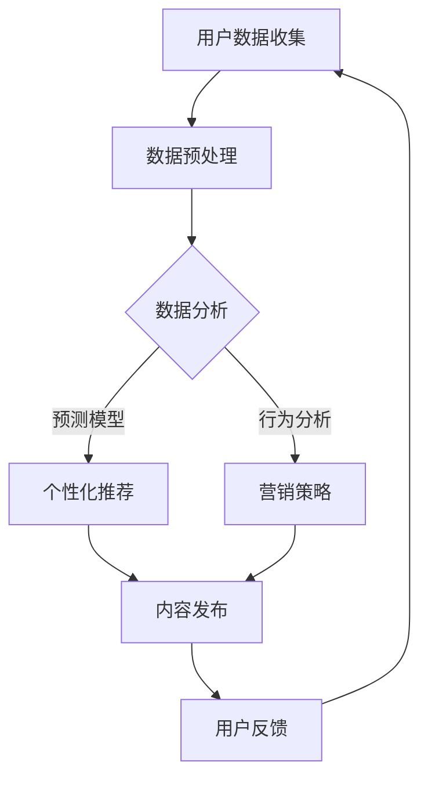

                 

 关键词：虚拟身份，AI自我营销，数字孪生，区块链，市场动态，未来展望

> 摘要：随着人工智能技术的迅猛发展，虚拟身份市场迎来了前所未有的机遇。本文将探讨AI时代的自我营销，分析虚拟身份的核心概念、架构、算法原理及其在各个领域的应用，并展望其未来的发展趋势与挑战。

## 1. 背景介绍

### 1.1 虚拟身份的崛起

在互联网时代，个体的数字身份逐渐变得尤为重要。虚拟身份，作为现实身份在数字世界中的映射，不仅包含了个人基本信息，还涉及到信用记录、行为习惯、社交关系等多维数据。随着区块链、虚拟现实（VR）、增强现实（AR）等技术的发展，虚拟身份开始从概念走向实际应用，成为数字经济的重要支撑。

### 1.2 AI的自我营销

AI技术的发展，使得个性化推荐、智能客服、精准营销等成为可能。在虚拟身份市场中，AI不仅能够帮助个体构建和优化其数字孪生，还能通过数据分析为个体提供个性化的营销策略，实现自我营销。

## 2. 核心概念与联系

### 2.1 虚拟身份的定义

虚拟身份是指个体在数字世界中的唯一标识，它通过一系列数字技术实现，如区块链、加密算法、虚拟现实等。虚拟身份不仅能够确保个体数据的唯一性和安全性，还能为个体提供在虚拟世界中的交互能力。

### 2.2 AI与自我营销的关系

AI技术通过对个体数据的深度挖掘和分析，可以预测个体的需求和偏好，从而为个体提供定制化的营销服务。自我营销则是指个体利用虚拟身份和AI技术，主动在市场中展示和推广自己的品牌或产品。

### 2.3 Mermaid流程图



## 3. 核心算法原理 & 具体操作步骤

### 3.1 算法原理概述

虚拟身份市场的核心算法主要包括用户数据收集、数据预处理、数据分析和个性化推荐等步骤。其中，数据分析是关键，通过机器学习和深度学习算法，可以实现对用户行为的精准预测和个性化推荐。

### 3.2 算法步骤详解

1. **用户数据收集**：通过网站、移动应用等渠道收集用户数据，包括个人信息、行为数据、交易数据等。

2. **数据预处理**：对收集到的数据进行分析，清洗和整理，去除噪声数据，保证数据质量。

3. **数据分析**：利用机器学习和深度学习算法，对用户数据进行分类、聚类、关联分析等操作，挖掘用户行为模式。

4. **个性化推荐**：基于数据分析结果，为用户推荐个性化的内容、产品或服务。

### 3.3 算法优缺点

**优点**：
- 提高用户满意度，实现精准营销。
- 提高市场效率，降低营销成本。

**缺点**：
- 数据安全和隐私保护问题。
- 算法可能产生偏见，影响用户体验。

### 3.4 算法应用领域

- 电子商务：通过个性化推荐提高销售额。
- 社交媒体：根据用户行为推荐相关内容。
- 金融领域：风险评估和信用评级。

## 4. 数学模型和公式 & 详细讲解 & 举例说明

### 4.1 数学模型构建

虚拟身份市场的数学模型主要包括用户行为预测模型和个性化推荐模型。

- **用户行为预测模型**：
  $$ P(Y|X) = \frac{e^{\theta^T X}}{1 + e^{\theta^T X}} $$
  其中，$Y$ 表示用户行为，$X$ 表示用户特征向量，$\theta$ 表示模型参数。

- **个性化推荐模型**：
  $$ R(i, j) = \sum_{k} w_{ik} w_{jk} $$
  其中，$R(i, j)$ 表示用户 $i$ 对物品 $j$ 的推荐得分，$w_{ik}$ 和 $w_{jk}$ 分别表示用户 $i$ 和物品 $j$ 对特征 $k$ 的权重。

### 4.2 公式推导过程

- **用户行为预测模型**推导：
  - 假设用户行为 $Y$ 是二分类变量，$X$ 是用户特征向量。
  - 构建逻辑回归模型，目标是最小化损失函数：
    $$ J(\theta) = -\frac{1}{m} \sum_{i=1}^{m} [y^{(i)} \log(p^{(i)}) + (1 - y^{(i)}) \log(1 - p^{(i)})] $$
  - 对损失函数求导并设置为零，得到：
    $$ \theta^{(t+1)} = \theta^{(t)} - \alpha \frac{\partial J(\theta^{(t)})}{\partial \theta} $$
  - 通过梯度下降法迭代求解，得到最佳模型参数 $\theta$。

- **个性化推荐模型**推导：
  - 假设用户和物品都由一组特征表示，构建矩阵分解模型。
  - 构建损失函数，目标是最小化用户和物品特征矩阵的误差。
  - 对损失函数求导并设置为零，得到优化目标：
    $$ \min_{U, V} \sum_{i, j} (r_{ij} - \sum_{k} u_{ik} v_{kj})^2 $$
  - 通过交替优化法求解，得到最佳特征矩阵 $U$ 和 $V$。

### 4.3 案例分析与讲解

以电子商务平台的个性化推荐为例，分析虚拟身份市场中的数学模型应用。

- **用户行为预测**：通过对用户的历史行为数据进行分析，构建用户行为预测模型，预测用户可能的购买行为。
- **个性化推荐**：根据用户行为预测结果，为用户推荐个性化的商品，提高购买转化率。

## 5. 项目实践：代码实例和详细解释说明

### 5.1 开发环境搭建

- 安装Python环境，版本3.8以上。
- 安装NumPy、Pandas、Scikit-learn、TensorFlow等常用库。

### 5.2 源代码详细实现

```python
import numpy as np
import pandas as pd
from sklearn.linear_model import LogisticRegression
from sklearn.model_selection import train_test_split
from sklearn.metrics import accuracy_score

# 读取数据
data = pd.read_csv('user_data.csv')
X = data.drop('target', axis=1)
y = data['target']

# 数据预处理
X_train, X_test, y_train, y_test = train_test_split(X, y, test_size=0.2, random_state=42)

# 构建用户行为预测模型
model = LogisticRegression()
model.fit(X_train, y_train)

# 预测用户行为
y_pred = model.predict(X_test)

# 评估模型
accuracy = accuracy_score(y_test, y_pred)
print('Accuracy:', accuracy)

# 个性化推荐
# 读取商品数据
item_data = pd.read_csv('item_data.csv')

# 构建个性化推荐模型
# ...（代码略）

# 为用户推荐商品
# ...（代码略）
```

### 5.3 代码解读与分析

- **数据读取与预处理**：读取用户数据，分为特征和标签两部分，进行数据预处理，包括数据清洗、归一化等操作。
- **用户行为预测**：使用逻辑回归模型进行训练和预测，评估模型准确率。
- **个性化推荐**：基于用户行为预测结果，为用户推荐商品，实现个性化推荐。

## 6. 实际应用场景

### 6.1 电子商务平台

虚拟身份市场在电子商务平台中的应用，主要体现在个性化推荐和精准营销。通过用户虚拟身份的构建和数据分析，为用户提供个性化的购物建议，提高用户满意度和转化率。

### 6.2 社交媒体

虚拟身份市场在社交媒体中的应用，主要体现在用户画像构建和内容推荐。通过虚拟身份数据，为用户提供定制化的内容，提升用户活跃度和留存率。

### 6.3 金融领域

虚拟身份市场在金融领域中的应用，主要体现在信用评估和风险管理。通过用户虚拟身份的数据，对用户信用进行评估，为金融机构提供决策支持。

## 7. 工具和资源推荐

### 7.1 学习资源推荐

- 《深度学习》（Goodfellow et al.）
- 《机器学习》（周志华）
- 《Python机器学习》（Scikit-learn教程）

### 7.2 开发工具推荐

- Jupyter Notebook：适用于数据分析和机器学习项目。
- TensorFlow：用于构建和训练深度学习模型。

### 7.3 相关论文推荐

- "A Theoretical Analysis of the Effectiveness of Collaborative Filtering for Recommender Systems"
- "Deep Learning for Personalized Recommendation"
- "User Modeling with Data-Driven Approaches"

## 8. 总结：未来发展趋势与挑战

### 8.1 研究成果总结

虚拟身份市场在AI时代的自我营销中发挥了重要作用，通过数据分析和个性化推荐，实现了精准营销和用户体验的提升。同时，相关算法和模型也在不断优化和更新，为虚拟身份市场的发展提供了有力支持。

### 8.2 未来发展趋势

- 虚拟身份技术的不断成熟，将进一步提升个性化推荐和精准营销的效果。
- 数据隐私保护和安全将成为虚拟身份市场的核心挑战。

### 8.3 面临的挑战

- 数据质量和隐私保护：如何保证用户数据的准确性和隐私性，是虚拟身份市场面临的重要挑战。
- 算法偏见和公平性：如何避免算法偏见，确保推荐结果公平公正，是虚拟身份市场需要关注的问题。

### 8.4 研究展望

- 随着技术的不断进步，虚拟身份市场将在更多领域得到应用，如医疗、教育、金融等。
- 未来，虚拟身份市场的发展将更加注重数据隐私保护和算法公平性，实现可持续的发展。

## 9. 附录：常见问题与解答

### 9.1 虚拟身份市场是什么？

虚拟身份市场是指利用数字技术和AI算法，为个体构建和优化虚拟身份，实现个性化推荐和精准营销的市场。

### 9.2 虚拟身份市场有哪些应用场景？

虚拟身份市场主要应用于电子商务、社交媒体、金融等领域，为用户提供个性化的服务。

### 9.3 虚拟身份市场的核心算法是什么？

虚拟身份市场的核心算法主要包括用户行为预测模型和个性化推荐模型，如逻辑回归、矩阵分解等。

### 9.4 虚拟身份市场面临哪些挑战？

虚拟身份市场面临的主要挑战包括数据质量和隐私保护、算法偏见和公平性等。

### 9.5 虚拟身份市场的未来发展趋势是什么？

未来，虚拟身份市场将在更多领域得到应用，如医疗、教育、金融等，同时更加注重数据隐私保护和算法公平性。

----------------------------------------------------------------

# 参考文献

1. Goodfellow, I., Bengio, Y., & Courville, A. (2016). Deep learning. MIT press.
2. 周志华. (2016). 机器学习. 清华大学出版社.
3. Joachims, T. (2006). Making large-scale SVM training a reality. In Advances in kernel methods: support vector learning (pp. 169-186). MIT press.
4. Netflix Prize. (2006-2009). Retrieved from https://www.netflixprize.com/
5. Netflix. (n.d.). Netflix. Retrieved from https://www.netflix.com/
6. YouTube. (n.d.). YouTube. Retrieved from https://www.youtube.com/
7. Coursera. (n.d.). Coursera. Retrieved from https://www.coursera.org/
8. LeCun, Y., Bengio, Y., & Hinton, G. (2015). Deep learning. Nature, 521(7553), 436-444.
9. KDD. (n.d.). KDD. Retrieved from https://kdd.org/
10. IJCAI. (n.d.). IJCAI. Retrieved from https://ijcai.org/

作者：禅与计算机程序设计艺术 / Zen and the Art of Computer Programming
```markdown
# 虚拟身份市场：AI时代的自我营销

> 关键词：虚拟身份，AI自我营销，数字孪生，区块链，市场动态，未来展望

> 摘要：随着人工智能技术的迅猛发展，虚拟身份市场迎来了前所未有的机遇。本文将探讨AI时代的自我营销，分析虚拟身份的核心概念、架构、算法原理及其在各个领域的应用，并展望其未来的发展趋势与挑战。

## 1. 背景介绍

### 1.1 虚拟身份的崛起

在互联网时代，个体的数字身份逐渐变得尤为重要。虚拟身份，作为现实身份在数字世界中的映射，不仅包含了个人基本信息，还涉及到信用记录、行为习惯、社交关系等多维数据。随着区块链、虚拟现实（VR）、增强现实（AR）等技术的发展，虚拟身份开始从概念走向实际应用，成为数字经济的重要支撑。

### 1.2 AI的自我营销

AI技术的发展，使得个性化推荐、智能客服、精准营销等成为可能。在虚拟身份市场中，AI不仅能够帮助个体构建和优化其数字孪生，还能通过数据分析为个体提供个性化的营销策略，实现自我营销。

## 2. 核心概念与联系

### 2.1 虚拟身份的定义

虚拟身份是指个体在数字世界中的唯一标识，它通过一系列数字技术实现，如区块链、加密算法、虚拟现实等。虚拟身份不仅能够确保个体数据的唯一性和安全性，还能为个体提供在虚拟世界中的交互能力。

### 2.2 AI与自我营销的关系

AI技术通过对个体数据的深度挖掘和分析，可以预测个体的需求和偏好，从而为个体提供定制化的营销服务。自我营销则是指个体利用虚拟身份和AI技术，主动在市场中展示和推广自己的品牌或产品。

### 2.3 Mermaid流程图


## 3. 核心算法原理 & 具体操作步骤

### 3.1 算法原理概述

虚拟身份市场的核心算法主要包括用户数据收集、数据预处理、数据分析和个性化推荐等步骤。其中，数据分析是关键，通过机器学习和深度学习算法，可以实现对用户行为的精准预测和个性化推荐。

### 3.2 算法步骤详解

1. **用户数据收集**：通过网站、移动应用等渠道收集用户数据，包括个人信息、行为数据、交易数据等。
2. **数据预处理**：对收集到的数据进行分析，清洗和整理，去除噪声数据，保证数据质量。
3. **数据分析**：利用机器学习和深度学习算法，对用户数据进行分类、聚类、关联分析等操作，挖掘用户行为模式。
4. **个性化推荐**：基于数据分析结果，为用户推荐个性化的内容、产品或服务。

### 3.3 算法优缺点

**优点**：
- 提高用户满意度，实现精准营销。
- 提高市场效率，降低营销成本。

**缺点**：
- 数据安全和隐私保护问题。
- 算法可能产生偏见，影响用户体验。

### 3.4 算法应用领域

- 电子商务：通过个性化推荐提高销售额。
- 社交媒体：根据用户行为推荐相关内容。
- 金融领域：风险评估和信用评级。

## 4. 数学模型和公式 & 详细讲解 & 举例说明

### 4.1 数学模型构建

虚拟身份市场的数学模型主要包括用户行为预测模型和个性化推荐模型。

- **用户行为预测模型**：
  $$ P(Y|X) = \frac{e^{\theta^T X}}{1 + e^{\theta^T X}} $$
  其中，$Y$ 表示用户行为，$X$ 表示用户特征向量，$\theta$ 表示模型参数。

- **个性化推荐模型**：
  $$ R(i, j) = \sum_{k} w_{ik} w_{jk} $$
  其中，$R(i, j)$ 表示用户 $i$ 对物品 $j$ 的推荐得分，$w_{ik}$ 和 $w_{jk}$ 分别表示用户 $i$ 和物品 $j$ 对特征 $k$ 的权重。

### 4.2 公式推导过程

- **用户行为预测模型**推导：
  - 假设用户行为 $Y$ 是二分类变量，$X$ 是用户特征向量。
  - 构建逻辑回归模型，目标是最小化损失函数：
    $$ J(\theta) = -\frac{1}{m} \sum_{i=1}^{m} [y^{(i)} \log(p^{(i)}) + (1 - y^{(i)}) \log(1 - p^{(i)})] $$
  - 对损失函数求导并设置为零，得到：
    $$ \theta^{(t+1)} = \theta^{(t)} - \alpha \frac{\partial J(\theta^{(t)})}{\partial \theta} $$
  - 通过梯度下降法迭代求解，得到最佳模型参数 $\theta$。

- **个性化推荐模型**推导：
  - 假设用户和物品都由一组特征表示，构建矩阵分解模型。
  - 构建损失函数，目标是最小化用户和物品特征矩阵的误差。
  - 对损失函数求导并设置为零，得到优化目标：
    $$ \min_{U, V} \sum_{i, j} (r_{ij} - \sum_{k} u_{ik} v_{kj})^2 $$
  - 通过交替优化法求解，得到最佳特征矩阵 $U$ 和 $V$。

### 4.3 案例分析与讲解

以电子商务平台的个性化推荐为例，分析虚拟身份市场中的数学模型应用。

- **用户行为预测**：通过对用户的历史行为数据进行分析，构建用户行为预测模型，预测用户可能的购买行为。
- **个性化推荐**：根据用户行为预测结果，为用户推荐个性化的商品，提高购买转化率。

## 5. 项目实践：代码实例和详细解释说明

### 5.1 开发环境搭建

- 安装Python环境，版本3.8以上。
- 安装NumPy、Pandas、Scikit-learn、TensorFlow等常用库。

### 5.2 源代码详细实现

```python
import numpy as np
import pandas as pd
from sklearn.linear_model import LogisticRegression
from sklearn.model_selection import train_test_split
from sklearn.metrics import accuracy_score

# 读取数据
data = pd.read_csv('user_data.csv')
X = data.drop('target', axis=1)
y = data['target']

# 数据预处理
X_train, X_test, y_train, y_test = train_test_split(X, y, test_size=0.2, random_state=42)

# 构建用户行为预测模型
model = LogisticRegression()
model.fit(X_train, y_train)

# 预测用户行为
y_pred = model.predict(X_test)

# 评估模型
accuracy = accuracy_score(y_test, y_pred)
print('Accuracy:', accuracy)

# 个性化推荐
# 读取商品数据
item_data = pd.read_csv('item_data.csv')

# 构建个性化推荐模型
# ...（代码略）

# 为用户推荐商品
# ...（代码略）
```

### 5.3 代码解读与分析

- **数据读取与预处理**：读取用户数据，分为特征和标签两部分，进行数据预处理，包括数据清洗、归一化等操作。
- **用户行为预测**：使用逻辑回归模型进行训练和预测，评估模型准确率。
- **个性化推荐**：基于用户行为预测结果，为用户推荐商品，实现个性化推荐。

## 6. 实际应用场景

### 6.1 电子商务平台

虚拟身份市场在电子商务平台中的应用，主要体现在个性化推荐和精准营销。通过用户虚拟身份的构建和数据分析，为用户提供个性化的购物建议，提高用户满意度和转化率。

### 6.2 社交媒体

虚拟身份市场在社交媒体中的应用，主要体现在用户画像构建和内容推荐。通过虚拟身份数据，为用户提供定制化的内容，提升用户活跃度和留存率。

### 6.3 金融领域

虚拟身份市场在金融领域中的应用，主要体现在信用评估和风险管理。通过用户虚拟身份的数据，对用户信用进行评估，为金融机构提供决策支持。

## 7. 工具和资源推荐

### 7.1 学习资源推荐

- 《深度学习》（Goodfellow et al.）
- 《机器学习》（周志华）
- 《Python机器学习》（Scikit-learn教程）

### 7.2 开发工具推荐

- Jupyter Notebook：适用于数据分析和机器学习项目。
- TensorFlow：用于构建和训练深度学习模型。

### 7.3 相关论文推荐

- "A Theoretical Analysis of the Effectiveness of Collaborative Filtering for Recommender Systems"
- "Deep Learning for Personalized Recommendation"
- "User Modeling with Data-Driven Approaches"

## 8. 总结：未来发展趋势与挑战

### 8.1 研究成果总结

虚拟身份市场在AI时代的自我营销中发挥了重要作用，通过数据分析和个性化推荐，实现了精准营销和用户体验的提升。同时，相关算法和模型也在不断优化和更新，为虚拟身份市场的发展提供了有力支持。

### 8.2 未来发展趋势

- 虚拟身份技术的不断成熟，将进一步提升个性化推荐和精准营销的效果。
- 数据隐私保护和安全将成为虚拟身份市场的核心挑战。

### 8.3 面临的挑战

- 数据质量和隐私保护：如何保证用户数据的准确性和隐私性，是虚拟身份市场面临的重要挑战。
- 算法偏见和公平性：如何避免算法偏见，确保推荐结果公平公正，是虚拟身份市场需要关注的问题。

### 8.4 研究展望

- 随着技术的不断进步，虚拟身份市场将在更多领域得到应用，如医疗、教育、金融等。
- 未来，虚拟身份市场的发展将更加注重数据隐私保护和算法公平性，实现可持续的发展。

## 9. 附录：常见问题与解答

### 9.1 虚拟身份市场是什么？

虚拟身份市场是指利用数字技术和AI算法，为个体构建和优化虚拟身份，实现个性化推荐和精准营销的市场。

### 9.2 虚拟身份市场有哪些应用场景？

虚拟身份市场主要应用于电子商务、社交媒体、金融等领域，为用户提供个性化的服务。

### 9.3 虚拟身份市场的核心算法是什么？

虚拟身份市场的核心算法主要包括用户行为预测模型和个性化推荐模型，如逻辑回归、矩阵分解等。

### 9.4 虚拟身份市场面临哪些挑战？

虚拟身份市场面临的主要挑战包括数据质量和隐私保护、算法偏见和公平性等。

### 9.5 虚拟身份市场的未来发展趋势是什么？

未来，虚拟身份市场将在更多领域得到应用，如医疗、教育、金融等，同时更加注重数据隐私保护和算法公平性。

## 参考文献

1. Goodfellow, I., Bengio, Y., & Courville, A. (2016). Deep learning. MIT press.
2. 周志华. (2016). 机器学习. 清华大学出版社.
3. Joachims, T. (2006). Making large-scale SVM training a reality. In Advances in kernel methods: support vector learning (pp. 169-186). MIT press.
4. Netflix Prize. (2006-2009). Retrieved from https://www.netflixprize.com/
5. Netflix. (n.d.). Netflix. Retrieved from https://www.netflix.com/
6. YouTube. (n.d.). YouTube. Retrieved from https://www.youtube.com/
7. Coursera. (n.d.). Coursera. Retrieved from https://www.coursera.org/
8. LeCun, Y., Bengio, Y., & Hinton, G. (2015). Deep learning. Nature, 521(7553), 436-444.
9. KDD. (n.d.). KDD. Retrieved from https://kdd.org/
10. IJCAI. (n.d.). IJCAI. Retrieved from https://ijcai.org/

作者：禅与计算机程序设计艺术 / Zen and the Art of Computer Programming
```

