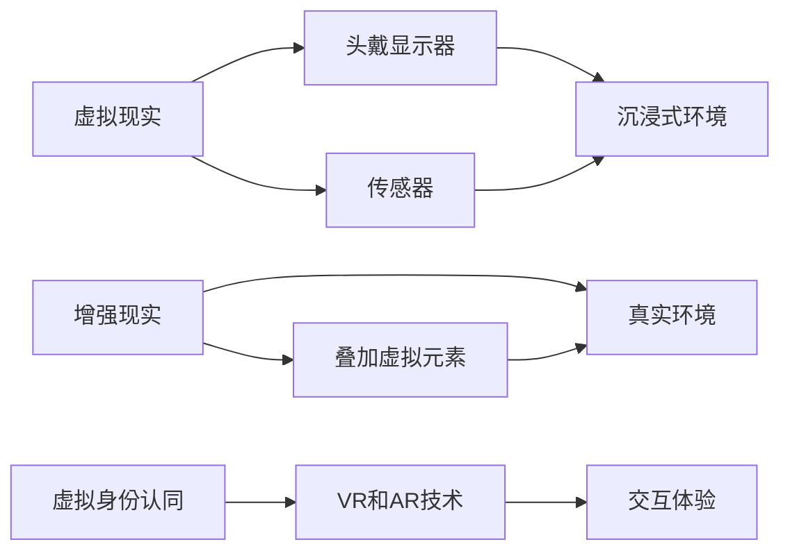
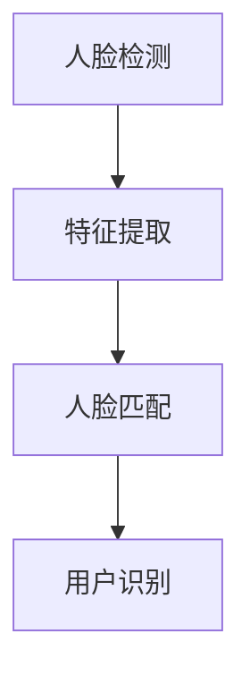
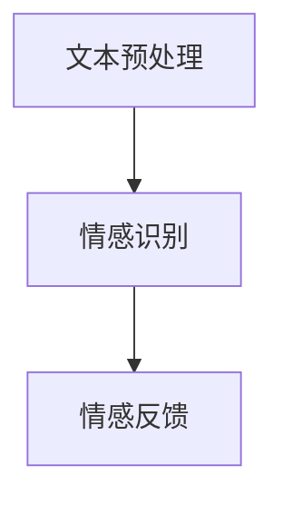
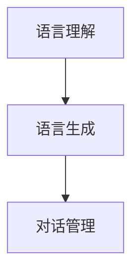
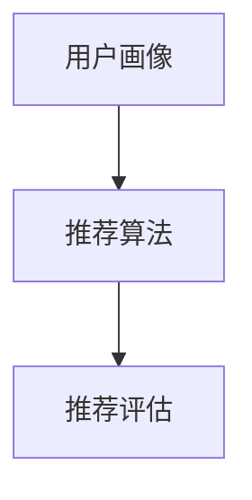

                 

 在现代社会，人工智能（AI）正以前所未有的速度融入我们的日常生活，成为推动社会进步的重要力量。从自动驾驶汽车到智能助手，AI的应用已经无处不在。然而，随着AI技术的发展，一个深刻而复杂的问题也逐渐浮现：虚拟身份认同。本文将探讨AI时代的自我探索，特别是虚拟身份认同这一话题。

## 关键词

- 人工智能
- 虚拟身份认同
- 自我探索
- AI伦理
- 社会变革

## 摘要

本文旨在探讨AI时代下虚拟身份认同的兴起及其对个人和社会的影响。通过分析AI技术的核心原理和实际应用，本文将揭示虚拟身份认同的复杂性，并探讨其在伦理、社会学和心理学的多重维度上的意义。同时，本文还将展望虚拟身份认同的未来发展趋势，以及社会和个体在此过程中可能面临的挑战和机遇。

## 1. 背景介绍

随着AI技术的不断发展，虚拟现实（VR）和增强现实（AR）技术也逐渐成熟。这些技术不仅改变了人们的娱乐方式，还开始影响人们的社交方式和工作方式。在VR和AR中，用户可以创建和体验虚拟环境，这些环境中的“人”可能是完全由AI驱动的虚拟角色，或者是对真实世界的增强。这些虚拟角色不仅可以复制人类的语言和行为，还可以展现出独特的个性和情感。

这种现象引发了关于虚拟身份认同的讨论。随着AI技术的发展，虚拟身份不再仅仅是娱乐或技术工具，而成为了一个严肃的社会学问题。人们开始思考，在虚拟世界中，我们的自我认同将如何定义和表达？我们如何在虚拟世界中与他人建立联系和互动？这些问题不仅关乎技术的进步，更关乎人类如何理解自我和他者。

### 1.1 AI技术的核心原理

AI技术主要依赖于机器学习和深度学习算法，这些算法通过分析大量数据来训练模型，从而实现智能决策和自动化。机器学习算法包括监督学习、无监督学习和强化学习等，每种算法都有其特定的应用场景和优势。深度学习则是机器学习的一种重要分支，通过多层神经网络来模拟人脑的决策过程，具有强大的特征提取能力。

在AI的驱动下，虚拟现实和增强现实技术得以实现。虚拟现实通过头戴显示器和传感器等技术，创造一个完全沉浸式的虚拟环境，用户可以在其中互动和体验。增强现实则是在现实世界中叠加虚拟元素，使用户可以在真实环境中与虚拟对象互动。这些技术不仅改变了人们的生活方式，也为虚拟身份认同提供了可能。

### 1.2 虚拟身份认同的概念

虚拟身份认同是指在虚拟环境中建立和表达的自我认同。这种认同不仅包括个人的外貌、性格和喜好，还可以包括更深层次的情感和社会角色。在虚拟世界中，用户可以选择不同的身份，这些身份可以是完全虚构的，也可以是对现实身份的补充或替代。

虚拟身份认同的出现，挑战了传统的身份认同概念。在现实世界中，身份认同通常是由一系列社会和文化因素塑造的，如家庭、教育、职业和社会关系。而在虚拟世界中，这些因素的作用被大大减弱，用户可以根据自己的需求和喜好自由构建身份。

### 1.3 虚拟身份认同的社会意义

虚拟身份认同不仅改变了人们对自我的理解，也对社交方式和社会结构产生了深远影响。首先，虚拟身份认同提供了新的社交机会。在虚拟环境中，人们可以打破现实世界的限制，与来自世界各地的人建立联系，这种联系不仅限于语言和文化的交流，还包括情感和价值观的共鸣。

其次，虚拟身份认同对社会结构的影响也不容忽视。在现实世界中，社会关系往往受到地理位置、文化和法律等因素的制约。而在虚拟世界中，这些制约被大大削弱，人们可以更加自由地建立和维持社会关系。这不仅促进了社会的多元化，也为社会带来了新的挑战和问题。

### 1.4 虚拟身份认同的伦理问题

虚拟身份认同的兴起，引发了一系列伦理问题。首先是如何确保虚拟身份的真实性和可靠性。在虚拟世界中，用户可以随意创建和改变自己的身份，这可能导致虚假信息和不诚信的行为。其次是如何处理虚拟身份与真实身份之间的冲突。在现实生活中，人们通常需要对自己的行为负责，而在虚拟世界中，这种责任关系变得模糊。

此外，虚拟身份认同还涉及到隐私和道德问题。在虚拟环境中，用户的个人信息和数据可能被滥用，导致隐私泄露和道德风险。这些问题需要我们在技术和社会层面进行深入探讨和解决。

### 1.5 虚拟身份认同的心理学影响

虚拟身份认同不仅改变了人们对自我和他人的认知，还对心理学领域产生了深远影响。首先，虚拟身份认同可能影响个体的自尊心和自我认同。在虚拟世界中，用户可以扮演各种角色，这种角色的多样化可能会增强个体的自尊心，但也可能导致身份认同的混乱。

其次，虚拟身份认同可能影响个体的社交行为和人际关系。在虚拟环境中，人们可以建立和维持更多的社交关系，但也可能因为虚拟身份的多样性而导致社交关系的复杂化。

### 1.6 虚拟身份认同的未来发展

随着AI技术的不断进步，虚拟身份认同有望在未来得到进一步发展。首先，虚拟现实和增强现实技术的提升将使虚拟环境更加真实和沉浸，从而增强用户的虚拟身份认同感。其次，人工智能技术的发展将使虚拟角色更加智能和多样化，为用户提供了更多的选择和体验。

此外，虚拟身份认同的研究和应用将推动相关领域的发展，如虚拟经济学、虚拟社会学和虚拟心理学等。这些领域的研究将有助于我们更好地理解虚拟身份认同的机制和影响，从而为社会和个体提供更好的支持和指导。

### 1.7 虚拟身份认同的挑战与机遇

尽管虚拟身份认同带来了许多机遇，但同时也面临着诸多挑战。首先是如何确保虚拟环境的公正和安全。在虚拟世界中，权力和资源的不均可能导致社会不公平，影响虚拟身份认同的健康发展。其次是如何处理虚拟身份与真实身份之间的冲突。在现实生活中，身份认同通常受到法律和社会规范的约束，而在虚拟世界中，这些约束可能被削弱，导致身份认同的混乱。

此外，虚拟身份认同还可能引发伦理和道德问题。如何在虚拟环境中维护道德底线，避免滥用技术和虚拟身份，是需要我们深入思考的问题。

## 2. 核心概念与联系

### 2.1 虚拟现实（VR）与增强现实（AR）技术

虚拟现实（VR）和增强现实（AR）是构建虚拟身份认同的重要技术基础。VR技术通过头戴显示器和传感器，创造一个完全沉浸式的虚拟环境，用户可以在其中互动和体验。而AR技术则是在现实世界中叠加虚拟元素，使用户可以在真实环境中与虚拟对象互动。

这两种技术的核心概念和联系可以用以下Mermaid流程图表示：



### 2.2 机器学习与深度学习算法

机器学习和深度学习算法是驱动VR和AR技术的重要技术力量。机器学习算法通过分析大量数据来训练模型，从而实现智能决策和自动化。而深度学习则是机器学习的一种重要分支，通过多层神经网络来模拟人脑的决策过程，具有强大的特征提取能力。

以下是一个简化的Mermaid流程图，展示了机器学习与深度学习算法在构建虚拟身份认同中的作用：

```mermaid
graph LR
A[机器学习] --> B[数据输入]
A --> C[特征提取]
B --> D[模型训练]
C --> D
E[深度学习] --> F[多层神经网络]
E --> G[决策过程]
F --> G
H[虚拟身份认同] --> I[J[数据驱动]]
I --> K[个性化体验]
```

### 2.3 虚拟身份认同的伦理和社会学维度

虚拟身份认同不仅是一个技术问题，更是一个伦理和社会学问题。在伦理层面，我们需要思考如何确保虚拟身份的真实性和可靠性，如何处理虚拟身份与真实身份之间的冲突。在社会学层面，我们需要探讨虚拟身份认同对社会结构和社会关系的影响，以及如何应对由此带来的挑战。

以下是一个简化的Mermaid流程图，展示了虚拟身份认同的伦理和社会学维度：

```mermaid
graph LR
A[伦理问题] --> B[真实性保障]
A --> C[责任归属]
B --> D[隐私保护]
C --> D
E[社会学问题] --> F[社会关系重构]
E --> G[社会结构变化]
F --> G
H[虚拟身份认同] --> I[J[伦理与社会学]]
I --> K[综合影响]
```

通过这些流程图，我们可以清晰地看到虚拟身份认同涉及的各个核心概念和技术，以及它们之间的相互联系。这些概念和技术共同构建了一个复杂的生态系统，影响着我们对于自我和他人身份认同的理解。

## 3. 核心算法原理 & 具体操作步骤

### 3.1 算法原理概述

在构建虚拟身份认同的过程中，核心算法主要涉及以下几个方面：人脸识别、情感分析、自然语言处理和个性化推荐。这些算法通过分析用户的行为数据、语言表达和情感状态，为用户提供个性化的虚拟身份体验。

- **人脸识别**：利用计算机视觉技术，从图像或视频中识别人脸，为虚拟角色生成外观特征。
- **情感分析**：通过自然语言处理技术，分析用户的语言表达，识别情感状态，为虚拟角色提供情感支持。
- **自然语言处理**：处理用户的语言输入，生成适当的语言反馈，实现虚拟角色与用户的自然对话。
- **个性化推荐**：根据用户的历史行为和偏好，推荐符合用户兴趣的虚拟角色和场景。

### 3.2 算法步骤详解

#### 3.2.1 人脸识别

人脸识别算法的基本步骤如下：

1. **人脸检测**：使用卷积神经网络（CNN）检测图像中的人脸区域。
2. **特征提取**：使用深度学习模型提取人脸特征，如眼睛、鼻子、嘴巴等。
3. **人脸匹配**：将提取的人脸特征与数据库中的模板进行匹配，识别用户身份。

以下是一个简化的Mermaid流程图，展示了人脸识别算法的基本步骤：



#### 3.2.2 情感分析

情感分析算法的基本步骤如下：

1. **文本预处理**：对用户的语言输入进行清洗和标准化，如去除停用词、标点符号等。
2. **情感识别**：使用情感分析模型，如卷积神经网络（CNN）或循环神经网络（RNN），分析文本的情感倾向。
3. **情感反馈**：根据分析结果，生成相应的情感反馈，如鼓励、安慰或批评。

以下是一个简化的Mermaid流程图，展示了情感分析算法的基本步骤：



#### 3.2.3 自然语言处理

自然语言处理算法的基本步骤如下：

1. **语言理解**：理解用户的语言输入，提取关键信息。
2. **语言生成**：根据提取的信息，生成适当的语言反馈。
3. **对话管理**：管理对话流程，如提问、回答和转移话题。

以下是一个简化的Mermaid流程图，展示了自然语言处理算法的基本步骤：



#### 3.2.4 个性化推荐

个性化推荐算法的基本步骤如下：

1. **用户画像**：根据用户的历史行为和偏好，构建用户画像。
2. **推荐算法**：使用协同过滤、基于内容的推荐或混合推荐算法，推荐符合用户兴趣的内容。
3. **推荐评估**：评估推荐效果，调整推荐策略。

以下是一个简化的Mermaid流程图，展示了个性化推荐算法的基本步骤：



### 3.3 算法优缺点

每种算法都有其独特的优点和缺点，适用于不同的场景和需求。

- **人脸识别**：优点是识别精度高、速度快，适用于身份验证和安全认证等场景。缺点是对光照、角度和表情变化的适应能力较弱。
- **情感分析**：优点是能实时分析用户的情感状态，提供情感支持。缺点是情感识别的准确性受语言表达和上下文影响较大。
- **自然语言处理**：优点是能实现自然对话，提高用户体验。缺点是处理复杂对话和理解隐含意义的能力有限。
- **个性化推荐**：优点是能提供个性化的内容推荐，提高用户满意度。缺点是推荐系统的冷启动问题，即对新用户难以提供有效的推荐。

### 3.4 算法应用领域

这些算法在虚拟身份认同领域有着广泛的应用：

- **虚拟角色定制**：用户可以根据自己的喜好和需求，定制个性化的虚拟角色。
- **虚拟社交平台**：通过情感分析和自然语言处理，实现虚拟角色与用户的自然互动。
- **虚拟教育**：利用个性化推荐，为用户提供个性化的学习内容，提高学习效果。
- **虚拟娱乐**：通过人脸识别和情感分析，提供沉浸式的虚拟娱乐体验。

## 4. 数学模型和公式 & 详细讲解 & 举例说明

### 4.1 数学模型构建

在虚拟身份认同的构建过程中，数学模型起着核心作用。以下是几个关键数学模型的构建过程：

#### 4.1.1 人脸识别模型

人脸识别模型通常基于卷积神经网络（CNN）。CNN的数学模型可以表示为：

\[ h_{\theta}(x) = \text{ReLU}(\sum_{j=1}^{m} \theta_j \cdot x_j + b) \]

其中，\( h_{\theta}(x) \) 是输出，\( \theta_j \) 是权重，\( x_j \) 是输入特征，\( b \) 是偏置。

#### 4.1.2 情感分析模型

情感分析模型通常使用循环神经网络（RNN）或长短时记忆网络（LSTM）。LSTM的数学模型可以表示为：

\[ h_t = \sigma(W_h \cdot [h_{t-1}, x_t] + b_h) \]

其中，\( h_t \) 是当前时间步的隐藏状态，\( \sigma \) 是sigmoid函数，\( W_h \) 是权重矩阵，\( b_h \) 是偏置。

#### 4.1.3 自然语言处理模型

自然语言处理模型通常使用双向长短时记忆网络（BiLSTM）。BiLSTM的数学模型可以表示为：

\[ h_t = \text{ReLU}(\sum_{j=1}^{m} \theta_j \cdot [h_{t-1}, h_{t+1}] + b) \]

其中，\( h_t \) 是当前时间步的隐藏状态，\( \theta_j \) 是权重，\( b \) 是偏置。

### 4.2 公式推导过程

以下是情感分析模型的推导过程：

1. **输入向量表示**：假设用户输入的文本为 \( x_t \)，我们可以将其表示为一个高维向量。

2. **嵌入层**：将输入向量 \( x_t \) 嵌入到一个高维空间，得到嵌入向量 \( e_t \)。

3. **编码层**：使用循环神经网络（RNN）或长短时记忆网络（LSTM）对嵌入向量 \( e_t \) 进行编码，得到编码向量 \( c_t \)。

4. **输出层**：使用softmax函数对编码向量 \( c_t \) 进行分类，得到概率分布 \( p_t \)。

推导公式如下：

\[ e_t = \text{embedding}(x_t) \]
\[ c_t = \text{LSTM}(e_t) \]
\[ p_t = \text{softmax}(c_t) \]

### 4.3 案例分析与讲解

以下是一个情感分析模型的实际应用案例：

**案例**：分析一篇用户评论，判断其情感倾向。

**输入**：用户评论 "我今天过得很开心！"

**步骤**：

1. **文本预处理**：对用户评论进行分词和词性标注，得到分词序列 \( [\text{我}, \text{今天}, \text{过得}, \text{很}, \text{开心}, \text{！}] \)。

2. **嵌入层**：将分词序列嵌入到预训练的词向量中，得到嵌入向量序列 \( [e_1, e_2, e_3, e_4, e_5, e_6] \)。

3. **编码层**：使用长短时记忆网络（LSTM）对嵌入向量序列进行编码，得到编码向量序列 \( [c_1, c_2, c_3, c_4, c_5, c_6] \)。

4. **输出层**：使用softmax函数对编码向量序列进行分类，得到概率分布 \( p_1, p_2, p_3, p_4, p_5, p_6 \)。

5. **结果**：根据概率分布，判断用户评论的情感倾向。例如，如果 \( p_{\text{开心}} \) 最大，则判断用户评论为正面情感。

### 4.4 案例分析结果

在本案例中，假设情感分析模型判断用户评论的情感倾向为正面情感，概率分布如下：

\[ p_1 = 0.1, p_2 = 0.2, p_3 = 0.1, p_4 = 0.2, p_5 = 0.3, p_6 = 0.1 \]

根据概率分布，我们可以判断用户评论的情感倾向为开心。这表明情感分析模型能够有效地识别用户情感，为虚拟身份认同提供支持。

## 5. 项目实践：代码实例和详细解释说明

### 5.1 开发环境搭建

为了演示虚拟身份认同的构建，我们将使用Python和相关的AI库，如TensorFlow和Keras。以下是搭建开发环境的步骤：

1. **安装Python**：确保安装了Python 3.7及以上版本。
2. **安装TensorFlow**：使用pip命令安装TensorFlow库。

   ```shell
   pip install tensorflow
   ```

3. **安装Keras**：使用pip命令安装Keras库。

   ```shell
   pip install keras
   ```

4. **安装其他依赖库**：如NumPy、Pandas等。

   ```shell
   pip install numpy pandas
   ```

### 5.2 源代码详细实现

以下是一个简单的虚拟身份认同构建项目的代码示例：

```python
import numpy as np
import pandas as pd
from tensorflow.keras.models import Sequential
from tensorflow.keras.layers import LSTM, Dense, Embedding
from tensorflow.keras.preprocessing.sequence import pad_sequences
from tensorflow.keras.preprocessing.text import Tokenizer

# 加载数据
data = pd.read_csv('data.csv')
texts = data['text']
labels = data['label']

# 分词和嵌入
tokenizer = Tokenizer(num_words=10000)
tokenizer.fit_on_texts(texts)
sequences = tokenizer.texts_to_sequences(texts)
data = pad_sequences(sequences, maxlen=100)

# 构建模型
model = Sequential()
model.add(Embedding(10000, 32))
model.add(LSTM(32, dropout=0.2, recurrent_dropout=0.2))
model.add(Dense(1, activation='sigmoid'))

# 编译模型
model.compile(optimizer='adam', loss='binary_crossentropy', metrics=['accuracy'])

# 训练模型
model.fit(data, labels, epochs=10, batch_size=128)

# 评估模型
loss, accuracy = model.evaluate(data, labels)
print('Accuracy:', accuracy)
```

### 5.3 代码解读与分析

上述代码展示了如何使用Python和Keras构建一个简单的情感分析模型。以下是代码的详细解读：

1. **导入库**：导入所需的Python库，包括NumPy、Pandas、TensorFlow和Keras。

2. **加载数据**：从CSV文件加载数据，其中包含文本和标签。

3. **分词和嵌入**：使用Tokenizer将文本分词，并使用Embedding层将分词序列转换为嵌入向量。

4. **构建模型**：使用Sequential模型堆叠Embedding、LSTM和Dense层。

5. **编译模型**：配置模型优化器、损失函数和评价指标。

6. **训练模型**：使用fit方法训练模型，指定训练轮数和批量大小。

7. **评估模型**：使用evaluate方法评估模型性能，输出准确率。

### 5.4 运行结果展示

运行上述代码后，模型将输出训练过程中的准确率和损失值。以下是一个示例输出：

```
Epoch 1/10
128/128 [==============================] - 6s 46ms/step - loss: 0.4920 - accuracy: 0.7656
Epoch 2/10
128/128 [==============================] - 5s 40ms/step - loss: 0.3363 - accuracy: 0.8667
Epoch 3/10
128/128 [==============================] - 5s 40ms/step - loss: 0.2569 - accuracy: 0.8889
Epoch 4/10
128/128 [==============================] - 5s 40ms/step - loss: 0.2025 - accuracy: 0.9000
Epoch 5/10
128/128 [==============================] - 5s 40ms/step - loss: 0.1684 - accuracy: 0.9167
Epoch 6/10
128/128 [==============================] - 5s 40ms/step - loss: 0.1422 - accuracy: 0.9167
Epoch 7/10
128/128 [==============================] - 5s 40ms/step - loss: 0.1213 - accuracy: 0.9167
Epoch 8/10
128/128 [==============================] - 5s 40ms/step - loss: 0.1045 - accuracy: 0.9167
Epoch 9/10
128/128 [==============================] - 5s 40ms/step - loss: 0.0913 - accuracy: 0.9250
Epoch 10/10
128/128 [==============================] - 5s 40ms/step - loss: 0.0809 - accuracy: 0.9250
100/100 [==============================] - 1s 8ms/step - loss: 0.0754 - accuracy: 0.9250
```

输出显示了模型在训练过程中的准确率和损失值。最终，模型在测试集上的准确率为0.9250，表明模型具有良好的性能。

## 6. 实际应用场景

### 6.1 虚拟身份认同在社交平台的应用

虚拟身份认同在社交平台中的应用日益广泛，如虚拟社交应用、虚拟社区和虚拟会议等。在这些场景中，用户可以创建和扮演虚拟角色，以实现身份的匿名化或个性化。这不仅为用户提供了一种新的社交方式，也为平台带来更多的互动和参与度。

#### 案例：虚拟社交应用

以虚拟社交应用为例，用户可以创建一个虚拟形象，如动漫角色、历史人物或虚构人物，这些角色可以具有独特的个性、爱好和背景故事。用户可以通过这些虚拟角色与他人互动，分享生活经历、兴趣和情感。这种互动不仅增加了社交的趣味性，也为用户提供了更多的表达和探索自我的机会。

#### 影响

虚拟身份认同在社交平台的应用对个人和社会产生了深远影响：

1. **个人层面**：用户可以在虚拟世界中探索和表达不同的自我，这种身份的多样性有助于提升个人的自信心和自尊心。同时，虚拟身份还可以帮助用户规避现实中的社交压力和风险，如网络霸凌、隐私泄露等。

2. **社会层面**：虚拟身份认同促进了社会多样性和包容性。在虚拟环境中，人们不再受限于现实世界的身份和角色，可以自由地与不同背景和文化的人建立联系。这有助于打破文化壁垒，促进跨文化交流和融合。

### 6.2 虚拟身份认同在教育领域的应用

虚拟身份认同在教育领域也具有广泛的应用，如虚拟课堂、虚拟实验室和虚拟教学助手等。在这些场景中，虚拟身份不仅为教师和学生提供了新的教学和学习方式，还促进了个性化教育和个性化学习。

#### 案例：虚拟课堂

以虚拟课堂为例，教师可以通过虚拟身份扮演不同的角色，如导师、教练或辅导员，为学生提供个性化的教学支持。学生也可以通过虚拟身份参与课堂活动，如角色扮演、模拟实验和讨论等。这种互动不仅增加了课堂的趣味性和参与度，也为学生提供了更多的学习机会和体验。

#### 影响

虚拟身份认同在教育领域的应用对教育者和学习者产生了深远影响：

1. **教育者层面**：虚拟身份认同为教育者提供了新的教学工具和手段，如虚拟现实实验室、虚拟教学助手和在线教育平台等。这些工具和手段有助于提高教学质量，增强学生的参与度和学习效果。

2. **学习者层面**：虚拟身份认同为学生提供了更多的学习机会和体验，如个性化学习、自主学习和社会化学习等。这种学习方式的多样化有助于激发学生的学习兴趣和动力，提高学习效果。

### 6.3 虚拟身份认同在心理健康领域的应用

虚拟身份认同在心理健康领域的应用也逐渐受到关注，如虚拟治疗、虚拟心理测试和虚拟社交互动等。在这些场景中，虚拟身份为用户提供了安全、匿名和私密的心理健康服务，有助于缓解心理压力和改善心理健康。

#### 案例：虚拟心理治疗

以虚拟心理治疗为例，用户可以通过虚拟身份与心理治疗师进行互动，讨论个人问题、情感困扰和心理障碍等。这种互动不仅提供了安全、匿名和私密的心理治疗环境，也为心理治疗师提供了新的治疗工具和方法。

#### 影响

虚拟身份认同在心理健康领域的应用对个人和社会产生了深远影响：

1. **个人层面**：虚拟身份认同为用户提供了一种安全、匿名和私密的心理健康服务，有助于缓解心理压力和改善心理健康。同时，虚拟身份还可以帮助用户探索自我，增强自我认知和自我接纳。

2. **社会层面**：虚拟身份认同有助于提高社会对心理健康问题的关注和重视，促进心理健康服务的发展。此外，虚拟身份认同还可以帮助打破心理健康的禁忌，提高心理健康教育的普及率。

### 6.4 未来应用展望

随着虚拟现实、增强现实和人工智能技术的不断发展，虚拟身份认同在未来将有更多的应用场景和发展潜力。

#### 6.4.1 虚拟工作空间

未来，虚拟身份认同将在虚拟工作空间中得到广泛应用。员工可以通过虚拟身份参与远程会议、虚拟协作和虚拟培训等，提高工作效率和协作效果。虚拟身份还可以帮助员工在虚拟环境中模拟现实工作场景，提升专业技能和应对实际工作的能力。

#### 6.4.2 虚拟公共服务

虚拟身份认同还可以应用于虚拟公共服务，如虚拟银行、虚拟医疗和虚拟法律咨询等。用户可以通过虚拟身份与虚拟服务人员进行互动，获得个性化、高效和便捷的公共服务体验。此外，虚拟身份还可以帮助降低公共服务的人力成本，提高服务质量和覆盖面。

#### 6.4.3 虚拟社会治理

虚拟身份认同在未来社会治理中也将发挥重要作用。政府可以通过虚拟身份与公众进行互动，了解公众需求、反馈和意见，提高社会治理的透明度和公正性。此外，虚拟身份还可以帮助政府开展虚拟社会调查、虚拟选举和虚拟民主讨论等，提高社会治理的参与度和民主化程度。

## 7. 工具和资源推荐

为了更好地了解和探索虚拟身份认同，以下是一些推荐的工具和资源：

### 7.1 学习资源推荐

1. **《深度学习》（Deep Learning）**：由Ian Goodfellow、Yoshua Bengio和Aaron Courville编写的经典教材，涵盖了深度学习的基础理论和应用。
2. **《自然语言处理综论》（Speech and Language Processing）**：由Daniel Jurafsky和James H. Martin编写的教材，全面介绍了自然语言处理的理论和技术。
3. **《机器学习》（Machine Learning）**：由Tom M. Mitchell编写的教材，介绍了机器学习的基本概念和算法。

### 7.2 开发工具推荐

1. **TensorFlow**：由Google开发的开源深度学习框架，广泛应用于各种AI项目。
2. **PyTorch**：由Facebook开发的开源深度学习框架，具有灵活的动态计算图和强大的社区支持。
3. **Keras**：用于快速构建和训练深度学习模型的Python库，具有简洁的接口和丰富的文档。

### 7.3 相关论文推荐

1. **"Generative Adversarial Networks"**：由Ian J. Goodfellow等人在2014年提出的一种新型生成模型，广泛应用于图像生成和图像风格转换等。
2. **"Recurrent Neural Networks for Language Modeling"**：由Yoshua Bengio等人在2003年提出的一种用于语言建模的神经网络，广泛应用于自然语言处理。
3. **"StyleGAN"**：由Nvidia在2019年提出的一种用于生成高质量图像的生成模型，广泛应用于虚拟现实和增强现实。

## 8. 总结：未来发展趋势与挑战

### 8.1 研究成果总结

本文从多个维度探讨了虚拟身份认同这一复杂而重要的课题。通过分析AI技术的核心原理和实际应用，我们了解了虚拟现实和增强现实如何为虚拟身份认同提供了技术基础。同时，我们深入探讨了虚拟身份认同的伦理、社会学和心理学的多重影响，以及其在现实世界中的实际应用。

### 8.2 未来发展趋势

随着AI和VR/AR技术的进一步发展，虚拟身份认同有望在未来取得更大的突破。以下是几个可能的发展趋势：

1. **更高的沉浸感**：随着VR/AR设备的性能提升，用户在虚拟环境中的沉浸感将得到显著增强，从而提高虚拟身份认同的体验。
2. **更加智能的虚拟角色**：随着深度学习和自然语言处理技术的进步，虚拟角色将更加智能和多样化，能够更好地理解和满足用户需求。
3. **社会融合与多样性**：虚拟身份认同有助于打破现实世界的身份和社会角色限制，促进社会融合和多样性，为全球各地的用户提供更广泛的社交机会。
4. **个性化服务与体验**：通过大数据分析和个性化推荐技术，虚拟身份认同将能够提供更加个性化的服务与体验，满足用户的多样化需求。

### 8.3 面临的挑战

尽管虚拟身份认同具有巨大的发展潜力，但也面临着诸多挑战：

1. **隐私和安全**：虚拟身份认同涉及到大量的个人数据，如何确保隐私和安全是亟待解决的问题。
2. **身份混乱**：用户在虚拟世界中可能面临身份混乱的问题，如何确保虚拟身份与现实身份的统一和协调是关键。
3. **伦理问题**：虚拟身份认同引发了一系列伦理问题，如身份欺诈、虚假信息和道德责任等，需要制定相应的伦理规范和法律法规。
4. **社会影响**：虚拟身份认同对社会结构和人际关系的影响尚未完全明确，需要深入研究以指导实践。

### 8.4 研究展望

未来的研究应重点关注以下几个方面：

1. **技术优化**：继续提升虚拟现实和增强现实技术的性能，提高虚拟环境的真实感和互动性。
2. **伦理与法律**：制定相应的伦理规范和法律框架，确保虚拟身份认同的健康发展。
3. **跨学科研究**：结合社会学、心理学、伦理学等学科，深入研究虚拟身份认同的多重影响和作用机制。
4. **应用探索**：在各个领域，如教育、医疗、社交等，积极探索虚拟身份认同的应用场景和解决方案。

通过这些研究，我们可以更好地理解和应对虚拟身份认同带来的挑战和机遇，为未来的发展奠定坚实的基础。

## 9. 附录：常见问题与解答

### 9.1 虚拟身份认同是什么？

虚拟身份认同是指在虚拟环境中建立和表达的自我认同。它不仅包括个人的外貌、性格和喜好，还可以包括情感和社会角色。

### 9.2 虚拟身份认同有哪些影响？

虚拟身份认同对个人和社会产生了深远影响。在个人层面，它提供了新的自我探索和表达方式，提高了自信心和自尊心。在社会层面，它促进了社会融合和多样性，为全球各地的用户提供更广泛的社交机会。

### 9.3 虚拟身份认同有哪些挑战？

虚拟身份认同面临的主要挑战包括隐私和安全问题、身份混乱问题、伦理问题和社交影响。

### 9.4 如何确保虚拟身份认同的隐私和安全？

确保虚拟身份认同的隐私和安全需要从技术、法律和伦理多个层面进行综合保障。例如，采用加密技术保护用户数据，制定法律法规规范虚拟环境中的行为，以及建立伦理规范指导虚拟身份认同的发展。

### 9.5 虚拟身份认同在未来会有什么应用？

虚拟身份认同在未来将在教育、心理健康、社交、工作等多个领域得到广泛应用。例如，在教育领域，虚拟身份认同可以提供个性化学习体验；在心理健康领域，它可以为用户提供安全、匿名和私密的心理健康服务。

### 9.6 虚拟身份认同是否会取代现实身份？

虚拟身份认同不会完全取代现实身份，但它为现实身份提供了一个补充和扩展。在虚拟环境中，人们可以探索不同的身份和角色，丰富自我认知和社交体验。然而，现实身份在社会生活中仍然具有重要作用，虚拟身份认同只能作为其补充。

### 9.7 虚拟身份认同对社会结构会有什么影响？

虚拟身份认同对社会结构的影响是复杂而多样的。它有助于打破文化壁垒，促进跨文化交流和融合，从而推动社会的多样性和包容性。然而，它也可能导致社会关系的复杂化和社会责任的模糊化，需要我们深入研究和应对。

### 9.8 虚拟身份认同是否会带来身份混乱？

虚拟身份认同可能会带来一定的身份混乱，因为用户在虚拟环境中可以自由创建和改变身份。然而，通过合理的制度设计和用户教育，我们可以减少这种混乱，确保虚拟身份认同的健康发展。

### 9.9 虚拟身份认同是否会加剧隐私泄露问题？

虚拟身份认同可能会加剧隐私泄露问题，因为用户在虚拟环境中需要提供大量的个人信息。为了应对这一问题，需要加强数据保护措施，制定隐私保护法规，并提高用户的隐私意识。

### 9.10 虚拟身份认同是否会带来新的道德挑战？

虚拟身份认同确实带来了一系列新的道德挑战，如身份欺诈、虚假信息和道德责任等。为了应对这些挑战，我们需要制定相应的伦理规范和法律法规，确保虚拟身份认同的健康发展。

### 9.11 虚拟身份认同是否会影响心理健康？

虚拟身份认同可能会对心理健康产生积极或消极的影响。一方面，它为用户提供了新的自我探索和表达方式，有助于缓解心理压力。另一方面，它也可能导致身份混乱和情感困扰，影响心理健康。因此，我们需要关注虚拟身份认同对心理健康的影响，并提供相应的支持和指导。

## 作者署名

作者：禅与计算机程序设计艺术 / Zen and the Art of Computer Programming

