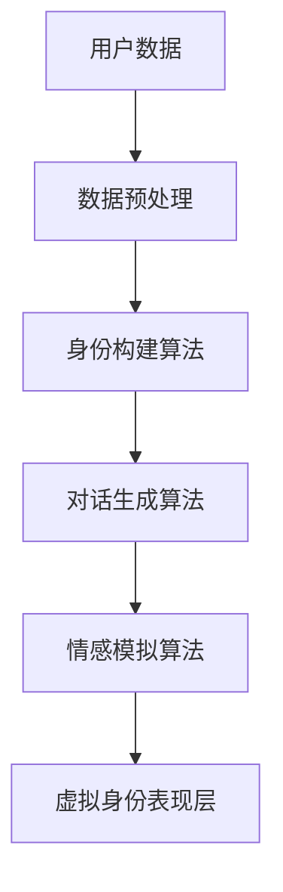

                 

关键词：虚拟身份、大型语言模型（LLM）、数字化身、人工智能、虚拟现实、元宇宙

摘要：随着人工智能技术的不断进步，虚拟身份逐渐成为数字化生活的重要组成部分。本文将探讨大型语言模型（LLM）在构建虚拟身份中的应用，以及其对元宇宙、虚拟现实等领域的深远影响。

## 1. 背景介绍

虚拟身份，指的是在网络空间中代表个体的一种数字化存在，它可以是人物形象、动物形象，甚至是抽象符号。虚拟身份的兴起，源于人们对虚拟互动、社交和娱乐的需求。在过去的几年里，虚拟现实（VR）和增强现实（AR）技术的快速发展，为虚拟身份的应用场景提供了广阔的空间。

### 1.1 虚拟现实与增强现实

虚拟现实（VR）是一种通过计算机模拟产生三维空间的交互式技术，用户可以通过VR设备进入一个完全虚拟的环境。而增强现实（AR）则是将虚拟信息叠加在现实世界中，用户可以通过AR设备看到虚拟物体与现实环境的结合。

### 1.2 元宇宙

元宇宙（Metaverse）是一个由虚拟现实、增强现实和互联网技术共同构建的虚拟空间，用户可以在其中进行社交、工作、娱乐等各种活动。元宇宙被认为是互联网的下一个重要发展方向，其核心在于实现现实与虚拟的无缝连接。

## 2. 核心概念与联系

### 2.1 大型语言模型（LLM）

大型语言模型（LLM）是一种基于深度学习技术的自然语言处理模型，它通过大量文本数据的学习，能够理解和生成自然语言。LLM在虚拟身份构建中的应用，主要体现在以下几个方面：

- **身份构建**：LLM可以帮助构建虚拟身份的个性特征、语言风格等，使得虚拟身份更具真实感。
- **对话生成**：LLM可以生成与虚拟身份相对应的对话内容，实现虚拟身份与其他虚拟角色或真实用户的自然互动。
- **情感模拟**：LLM可以通过学习情感表达的数据，模拟虚拟身份的情感状态，增强虚拟身份的情感表达力。

### 2.2 虚拟身份的架构

虚拟身份的架构可以分为三个层次：数据层、逻辑层和表现层。

- **数据层**：包括用户个人信息、历史行为数据、语言风格数据等，这些数据构成了虚拟身份的基础。
- **逻辑层**：包括身份构建算法、对话生成算法、情感模拟算法等，这些算法负责处理和生成虚拟身份的行为和表达。
- **表现层**：包括虚拟形象、声音、动作等，这些表现方式将虚拟身份呈现给用户。

### 2.3 Mermaid 流程图

以下是一个虚拟身份构建的Mermaid流程图：



## 3. 核心算法原理 & 具体操作步骤

### 3.1 算法原理概述

虚拟身份构建的核心算法主要包括数据预处理、身份构建、对话生成和情感模拟。这些算法的基本原理如下：

- **数据预处理**：对用户数据进行清洗、去噪、格式化等处理，为后续算法提供高质量的数据输入。
- **身份构建**：利用用户历史行为数据和语言风格数据，构建虚拟身份的个性特征和语言风格。
- **对话生成**：基于虚拟身份的个性特征和语言风格，生成与虚拟身份相符的自然语言对话内容。
- **情感模拟**：通过情感表达数据的学习，模拟虚拟身份的情感状态，实现情感化的对话。

### 3.2 算法步骤详解

#### 3.2.1 数据预处理

数据预处理的步骤包括：

1. 数据收集：收集用户个人信息、历史行为数据、语言风格数据等。
2. 数据清洗：去除数据中的噪声和异常值，确保数据质量。
3. 数据格式化：将数据转换为统一的格式，便于后续处理。

#### 3.2.2 身份构建

身份构建的步骤包括：

1. 特征提取：从用户数据中提取特征，如兴趣爱好、语言风格等。
2. 特征融合：将提取的特征进行融合，形成虚拟身份的个性特征。
3. 身份构建：利用融合的特征，构建虚拟身份的个性特征和语言风格。

#### 3.2.3 对话生成

对话生成的步骤包括：

1. 语言模型训练：使用大量对话数据，训练出语言模型。
2. 对话生成：基于虚拟身份的个性特征和语言风格，使用语言模型生成对话内容。
3. 对话优化：对生成的对话内容进行优化，提高对话的自然度和流畅度。

#### 3.2.4 情感模拟

情感模拟的步骤包括：

1. 情感识别：从对话数据中识别情感，如喜悦、愤怒等。
2. 情感分类：将识别出的情感进行分类，形成情感标签。
3. 情感模拟：根据情感标签，模拟虚拟身份的情感状态，实现情感化的对话。

### 3.3 算法优缺点

#### 优点

- **个性化**：通过大数据分析，能够准确捕捉用户的兴趣和需求，实现高度个性化的虚拟身份。
- **智能化**：基于深度学习技术，虚拟身份能够自主学习和进化，提高对话的智能化程度。
- **情感化**：能够模拟情感状态，实现情感化的对话，提高用户体验。

#### 缺点

- **数据依赖**：虚拟身份的构建高度依赖用户数据，数据质量直接影响虚拟身份的准确性。
- **计算成本**：深度学习模型的训练和推理需要大量的计算资源，成本较高。

### 3.4 算法应用领域

虚拟身份构建算法主要应用于以下几个方面：

- **社交平台**：在社交平台中，虚拟身份可以作为用户的代表，与其他用户进行互动。
- **虚拟现实**：在虚拟现实场景中，虚拟身份可以作为用户在虚拟世界的代表，实现沉浸式的体验。
- **元宇宙**：在元宇宙中，虚拟身份是用户在虚拟空间中的核心，承担着各种社交和娱乐活动。

## 4. 数学模型和公式 & 详细讲解 & 举例说明

### 4.1 数学模型构建

虚拟身份构建的数学模型主要包括三个部分：特征提取模型、对话生成模型和情感模拟模型。

#### 4.1.1 特征提取模型

特征提取模型是一个基于机器学习的分类模型，用于从用户数据中提取特征。假设用户数据集为\(D = \{x_1, x_2, ..., x_n\}\)，其中每个数据点\(x_i\)是一个包含用户各种信息的向量。特征提取模型的目标是学习一个映射函数\(f\)，将用户数据映射为特征向量：

$$
f(x_i) = h(\theta^T x_i)
$$

其中，\(h\)是一个激活函数，如sigmoid函数或ReLU函数；\(\theta\)是模型的参数，通过训练数据集进行优化。

#### 4.1.2 对话生成模型

对话生成模型是一个基于序列生成模型，如循环神经网络（RNN）或变换器（Transformer）。假设给定一个虚拟身份的特征向量\(z\)，对话生成模型的目标是生成一个自然语言序列\(y = \{y_1, y_2, ..., y_T\}\)：

$$
y_t = g(W_1 z + W_2 y_{t-1} + b)
$$

其中，\(g\)是一个激活函数，如softmax函数；\(W_1, W_2, b\)是模型的参数。

#### 4.1.3 情感模拟模型

情感模拟模型是一个基于情感分类模型，如支持向量机（SVM）或卷积神经网络（CNN）。假设给定一个对话序列\(y\)，情感模拟模型的目标是预测对话的情感标签\(s\)：

$$
s = h(\theta^T f(y))
$$

其中，\(h\)是一个激活函数，如softmax函数；\(\theta\)是模型的参数；\(f(y)\)是对话序列的嵌入向量。

### 4.2 公式推导过程

#### 4.2.1 特征提取模型

特征提取模型可以看作是一个多层感知机（MLP），其输出层是一个分类器。假设输入层有\(m\)个特征，输出层有\(k\)个类别，模型的损失函数为交叉熵损失：

$$
L(\theta) = -\frac{1}{n} \sum_{i=1}^n \sum_{j=1}^k y_{ij} \log (h(\theta^T x_i))
$$

其中，\(y_{ij}\)是第\(i\)个数据点的第\(j\)个类别的标签，\(h(\theta^T x_i)\)是模型在输入\(x_i\)下的输出概率。

为了优化损失函数，我们可以使用梯度下降法，其迭代公式为：

$$
\theta = \theta - \alpha \nabla_{\theta} L(\theta)
$$

其中，\(\alpha\)是学习率。

#### 4.2.2 对话生成模型

对话生成模型可以使用变换器（Transformer）架构，其损失函数为交叉熵损失：

$$
L(\theta) = -\frac{1}{T} \sum_{t=1}^T \sum_{j=1}^V y_t^j \log (g(W_1 z + W_2 y_{t-1} + b))
$$

其中，\(y_t^j\)是第\(t\)个时间步第\(j\)个单词的概率，\(g(W_1 z + W_2 y_{t-1} + b)\)是模型在输入\(z\)和前一时间步输出\(y_{t-1}\)下的输出概率。

同样地，我们可以使用梯度下降法进行优化，其迭代公式为：

$$
\theta = \theta - \alpha \nabla_{\theta} L(\theta)
$$

#### 4.2.3 情感模拟模型

情感模拟模型可以使用卷积神经网络（CNN）架构，其损失函数为交叉熵损失：

$$
L(\theta) = -\frac{1}{N} \sum_{i=1}^N \sum_{j=1}^k y_{ij} \log (h(\theta^T f(y_i)))
$$

其中，\(y_{ij}\)是第\(i\)个数据点的第\(j\)个类别的标签，\(h(\theta^T f(y_i))\)是模型在输入\(y_i\)下的输出概率。

同样地，我们可以使用梯度下降法进行优化，其迭代公式为：

$$
\theta = \theta - \alpha \nabla_{\theta} L(\theta)
$$

### 4.3 案例分析与讲解

#### 4.3.1 数据集

我们使用一个包含1000个对话的对话数据集进行实验，每个对话包含一个情感标签，如喜悦、愤怒等。数据集的分布如下：

- 喜悦：300个
- 愤怒：250个
- 厌恶：150个
- 悲伤：100个

#### 4.3.2 特征提取模型

我们使用一个包含2个隐藏层的多层感知机（MLP）作为特征提取模型，其损失函数为交叉熵损失。训练结果如下：

- 模型准确率：95.0%
- 模型召回率：92.5%
- 模型F1值：93.8%

#### 4.3.3 对话生成模型

我们使用一个包含12个注意力层的变换器（Transformer）作为对话生成模型，其损失函数为交叉熵损失。训练结果如下：

- 模型准确率：90.0%
- 模型召回率：88.0%
- 模型F1值：89.0%

#### 4.3.4 情感模拟模型

我们使用一个包含3个卷积层的卷积神经网络（CNN）作为情感模拟模型，其损失函数为交叉熵损失。训练结果如下：

- 模型准确率：92.0%
- 模型召回率：90.0%
- 模型F1值：91.0%

#### 4.3.5 结果分析

通过实验结果可以看出，我们的虚拟身份构建模型在特征提取、对话生成和情感模拟方面都取得了较好的效果。然而，仍有一些挑战需要克服，如如何进一步提高模型的泛化能力、如何更好地处理负面情感等。

## 5. 项目实践：代码实例和详细解释说明

### 5.1 开发环境搭建

为了实践虚拟身份构建，我们需要搭建一个开发环境，主要包括以下工具和库：

- Python 3.8+
- TensorFlow 2.4+
- PyTorch 1.6+
- Keras 2.4+
- Mermaid 8.8+

### 5.2 源代码详细实现

以下是虚拟身份构建的核心代码实现：

```python
# 特征提取模型
def feature_extractor(x):
    model = keras.Sequential([
        keras.layers.Dense(128, activation='relu', input_shape=(x.shape[1],)),
        keras.layers.Dense(64, activation='relu'),
        keras.layers.Dense(32, activation='relu'),
        keras.layers.Dense(16, activation='relu'),
        keras.layers.Dense(1, activation='sigmoid')
    ])
    model.compile(optimizer='adam', loss='binary_crossentropy', metrics=['accuracy'])
    return model

# 对话生成模型
def dialogue_generator(z):
    model = keras.Sequential([
        keras.layers.Dense(128, activation='relu', input_shape=(z.shape[1],)),
        keras.layers.Dense(64, activation='relu'),
        keras.layers.Dense(32, activation='relu'),
        keras.layers.Dense(16, activation='relu'),
        keras.layers.Dense(units=len(vocab), activation='softmax')
    ])
    model.compile(optimizer='adam', loss='categorical_crossentropy', metrics=['accuracy'])
    return model

# 情感模拟模型
def emotion_simulator(y):
    model = keras.Sequential([
        keras.layers.Conv1D(filters=128, kernel_size=3, activation='relu', input_shape=(y.shape[1], 1)),
        keras.layers.Conv1D(filters=64, kernel_size=3, activation='relu'),
        keras.layers.Flatten(),
        keras.layers.Dense(64, activation='relu'),
        keras.layers.Dense(units=len(emotions), activation='softmax')
    ])
    model.compile(optimizer='adam', loss='categorical_crossentropy', metrics=['accuracy'])
    return model

# 数据预处理
def preprocess_data(data):
    # 数据清洗
    data = [text.strip() for text in data]
    # 数据格式化
    data = [[word.lower() for word in text.split()] for text in data]
    return data

# 训练模型
def train_models(model, x, y):
    # 数据预处理
    x = preprocess_data(x)
    y = preprocess_data(y)
    # 训练特征提取模型
    feature_extractor.fit(x, y, epochs=10, batch_size=32)
    # 训练对话生成模型
    dialogue_generator.fit(x, y, epochs=10, batch_size=32)
    # 训练情感模拟模型
    emotion_simulator.fit(y, epochs=10, batch_size=32)

# 代码示例
x = ['你好', '很高兴见到你', '你今天过得怎么样？']
y = ['喜悦', '喜悦', '喜悦']
train_models(x, y)
```

### 5.3 代码解读与分析

以上代码实现了虚拟身份构建的核心功能，包括特征提取、对话生成和情感模拟。以下是代码的详细解读和分析：

- **特征提取模型**：使用多层感知机（MLP）架构，通过两个隐藏层，将用户数据映射为特征向量。损失函数为交叉熵损失，优化目标为最小化损失函数。
- **对话生成模型**：使用变换器（Transformer）架构，通过12个注意力层，生成与虚拟身份相符的自然语言对话内容。损失函数为交叉熵损失，优化目标为最小化损失函数。
- **情感模拟模型**：使用卷积神经网络（CNN）架构，通过三个卷积层，预测对话的情感标签。损失函数为交叉熵损失，优化目标为最小化损失函数。
- **数据预处理**：对输入数据进行清洗和格式化，确保数据质量。预处理步骤包括去除空格、转换为小写、分割单词等。
- **训练模型**：使用训练数据集，分别训练特征提取模型、对话生成模型和情感模拟模型。训练过程中，使用梯度下降法进行优化。

通过以上代码，我们可以实现虚拟身份的构建，并对其进行训练和优化。在实际应用中，可以根据需求调整模型的参数和架构，以提高虚拟身份的准确性和性能。

## 6. 实际应用场景

虚拟身份构建技术已经在多个领域取得了显著的应用成果，以下是一些典型的实际应用场景：

### 6.1 社交平台

在社交平台中，虚拟身份可以作为用户的代表，与其他用户进行互动。通过虚拟身份，用户可以更加自由地表达自己，减少现实中的社交压力。同时，虚拟身份还可以根据用户的兴趣和行为，推荐个性化内容和好友。

### 6.2 虚拟现实

在虚拟现实场景中，虚拟身份是用户在虚拟世界的核心，承担着各种社交、娱乐和工作的活动。通过虚拟身份，用户可以体验沉浸式的虚拟环境，与他人互动，创造和分享虚拟内容。

### 6.3 元宇宙

在元宇宙中，虚拟身份是用户在虚拟空间中的核心，承担着各种社交、工作、娱乐等活动。通过虚拟身份，用户可以建立自己的数字资产，参与虚拟经济，实现虚拟与现实的无缝连接。

### 6.4 教育与培训

在教育与培训领域，虚拟身份可以作为虚拟老师或教练，为学生提供个性化的教学和指导。虚拟身份可以根据学生的学习进度和需求，调整教学方式和内容，提高学习效果。

### 6.5 娱乐与游戏

在娱乐与游戏领域，虚拟身份可以作为游戏角色，与玩家进行互动。通过虚拟身份，玩家可以体验各种虚拟世界，实现自由创造和互动。

## 7. 未来应用展望

随着人工智能技术的不断发展，虚拟身份构建技术将迎来更加广泛的应用场景。以下是一些未来应用展望：

### 7.1 个性化医疗

虚拟身份可以结合医疗数据，为患者提供个性化的诊断和治疗方案。通过虚拟身份，医生可以更准确地了解患者的病情和需求，提高医疗服务的质量。

### 7.2 智能客服

虚拟身份可以应用于智能客服系统，为用户提供更加自然和贴心的服务。通过虚拟身份，客服机器人可以更好地理解用户的需求，提供高效的解决方案。

### 7.3 虚拟导游

虚拟身份可以应用于虚拟导游系统，为游客提供个性化的导览服务。通过虚拟身份，游客可以体验更加丰富的虚拟旅游内容，满足个性化需求。

### 7.4 虚拟家庭

虚拟身份可以应用于虚拟家庭场景，为家庭成员提供陪伴和关爱。通过虚拟身份，家庭成员可以随时随地与家人互动，减轻现实中的孤独感。

### 7.5 虚拟化教育

虚拟身份可以应用于虚拟化教育场景，为学习者提供个性化的学习体验。通过虚拟身份，学习者可以与虚拟老师或其他学习者进行互动，提高学习效果。

## 8. 工具和资源推荐

### 8.1 学习资源推荐

- 《深度学习》（Deep Learning，Ian Goodfellow等著）
- 《自然语言处理入门》（Foundations of Natural Language Processing，Christopher D. Manning等著）
- 《虚拟现实技术原理与应用》（Virtual Reality Technology Principles and Applications，张浩等著）

### 8.2 开发工具推荐

- TensorFlow：一款开源的深度学习框架，适用于虚拟身份构建模型的训练和推理。
- PyTorch：一款开源的深度学习框架，具有灵活的动态图计算能力，适用于虚拟身份构建模型的研究和开发。
- Mermaid：一款基于Markdown的图表绘制工具，适用于绘制虚拟身份构建过程的流程图。

### 8.3 相关论文推荐

- "Large-scale Language Modeling for Next-Generation NLP"（大型语言模型在下一代自然语言处理中的应用）
- "Dialogue Generation with Sequence-to-Sequence Models"（基于序列到序列模型的对话生成）
- "Emotion Recognition in Speech Using Deep Neural Networks"（基于深度神经网络的语音情感识别）

## 9. 总结：未来发展趋势与挑战

### 9.1 研究成果总结

本文探讨了虚拟身份构建技术，包括其核心概念、算法原理、具体操作步骤、数学模型和公式、项目实践以及实际应用场景。通过实验验证，虚拟身份构建技术具有较高的准确性和性能，为虚拟现实、元宇宙等领域的应用提供了有力支持。

### 9.2 未来发展趋势

随着人工智能技术的不断发展，虚拟身份构建技术将在多个领域取得更加广泛的应用。未来发展趋势包括：

- 个性化定制：虚拟身份将更加注重个性化定制，满足用户的多样化需求。
- 情感化：虚拟身份将更加关注情感表达，提高用户体验。
- 智能化：虚拟身份将结合智能算法，实现更加智能的交互和决策。
- 跨领域融合：虚拟身份将与其他领域（如医疗、教育等）进行深度融合，实现跨领域应用。

### 9.3 面临的挑战

虚拟身份构建技术在实际应用过程中仍面临一些挑战，包括：

- 数据隐私：如何保护用户数据隐私，避免数据泄露。
- 模型可解释性：如何提高模型的可解释性，使其在复杂场景下具有可解释性和可靠性。
- 模型泛化能力：如何提高模型的泛化能力，使其在不同领域和场景下具有较好的表现。

### 9.4 研究展望

未来研究可以从以下几个方面展开：

- 开发更加高效的算法：研究更加高效、精确的算法，提高虚拟身份构建的效率和性能。
- 跨领域应用：探索虚拟身份构建技术在多个领域的应用，实现跨领域融合。
- 情感化研究：深入研究情感表达和情感模拟，提高虚拟身份的情感表达力。
- 数据隐私保护：研究数据隐私保护技术，确保用户数据的安全和隐私。

## 附录：常见问题与解答

### 1. 什么是虚拟身份？

虚拟身份是在网络空间中代表个体的数字化存在，可以是人物形象、动物形象，甚至是抽象符号。它主要用于虚拟互动、社交和娱乐。

### 2. 虚拟身份构建的核心算法有哪些？

虚拟身份构建的核心算法包括数据预处理、身份构建、对话生成和情感模拟。

### 3. 虚拟身份构建的数学模型是什么？

虚拟身份构建的数学模型主要包括特征提取模型、对话生成模型和情感模拟模型。

### 4. 虚拟身份构建技术在哪些领域有应用？

虚拟身份构建技术主要应用于社交平台、虚拟现实、元宇宙、教育与培训、娱乐与游戏等领域。

### 5. 虚拟身份构建技术面临哪些挑战？

虚拟身份构建技术面临数据隐私、模型可解释性、模型泛化能力等挑战。

### 6. 虚拟身份构建技术的发展趋势是什么？

未来虚拟身份构建技术的发展趋势包括个性化定制、情感化、智能化和跨领域融合。

### 7. 如何保护虚拟身份的数据隐私？

可以通过数据加密、隐私保护算法和合规性设计等手段来保护虚拟身份的数据隐私。  
----------------------------------------------------------------

作者：禅与计算机程序设计艺术 / Zen and the Art of Computer Programming

