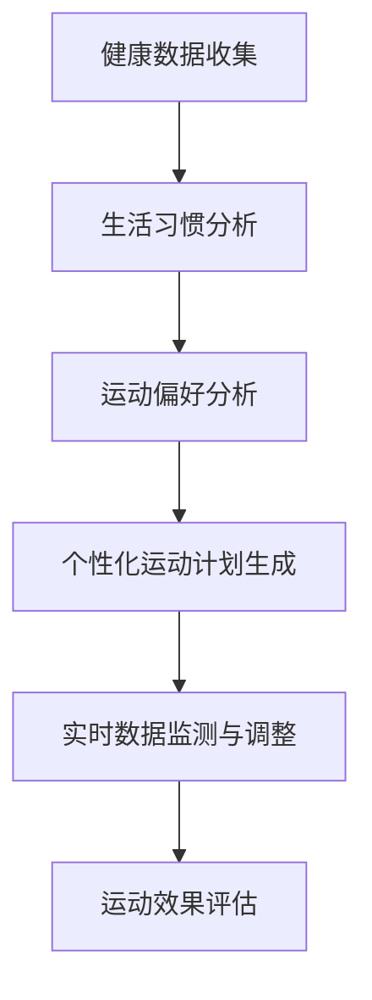

                 

关键词：虚拟运动处方、健康生活方式、个性化指导、算法、数学模型、实践应用

> 摘要：本文旨在探讨虚拟运动处方在全球化健康生活方式中的应用及其个性化指导的重要性。通过介绍核心概念、算法原理、数学模型，并结合具体案例，本文深入分析了虚拟运动处方的设计方法、实现步骤及其潜在的应用领域和未来发展方向。

## 1. 背景介绍

在全球化的今天，健康生活方式越来越受到人们的关注。然而，传统的一刀切运动处方已经无法满足个体差异化的需求。为了提供更为精准的健康指导，虚拟运动处方作为一种新兴的技术手段，逐渐进入人们的视野。虚拟运动处方利用人工智能技术，根据个人的健康状况、生活习惯、运动偏好等因素，制定出个性化的运动计划，旨在提高运动效果和健康水平。

### 1.1  健康生活方式的重要性

健康生活方式是指以促进健康、预防疾病、提高生活质量为目的的一系列行为习惯。科学研究表明，健康生活方式可以降低慢性疾病的发生风险，改善心血管健康，增强免疫力，延缓衰老等。因此，在全球范围内推广健康生活方式具有重要的现实意义。

### 1.2  虚拟运动处方的概念

虚拟运动处方是指利用计算机技术和人工智能算法，根据个人的健康数据、生活习惯和运动偏好，生成一种个性化的运动计划。这种计划不仅包括运动类型、强度、时间等方面的建议，还可以根据实时数据动态调整，以实现最佳的运动效果。

## 2. 核心概念与联系

### 2.1  核心概念

虚拟运动处方涉及到多个核心概念，包括但不限于：

- **健康数据**：包括血压、心率、体重、血糖等生理指标。
- **生活习惯**：包括饮食、睡眠、作息时间等日常行为。
- **运动偏好**：包括运动类型、强度、频次等。

### 2.2  Mermaid 流程图

以下是一个简化的虚拟运动处方设计流程的 Mermaid 流程图：



## 3. 核心算法原理 & 具体操作步骤

### 3.1  算法原理概述

虚拟运动处方的设计依赖于多个算法的协同工作，主要包括：

- **数据挖掘**：用于从大规模数据中提取有价值的信息，如健康趋势、生活习惯等。
- **机器学习**：用于建立个性化运动计划模型，根据用户的历史数据预测未来健康状态。
- **优化算法**：用于在给定约束条件下，寻找最优的运动方案。

### 3.2  算法步骤详解

#### 3.2.1  数据收集与预处理

首先，需要收集用户的基本健康数据和生活习惯信息。这些数据可以通过 wearable 设备、健康 app 等途径获取。在收集到数据后，需要进行预处理，如数据清洗、归一化等。

#### 3.2.2  模型构建

在数据预处理完成后，可以利用机器学习算法构建个性化运动计划模型。常见的算法包括决策树、支持向量机、神经网络等。这些算法可以根据用户的历史数据，预测其未来的健康状态，并生成相应的运动建议。

#### 3.2.3  运动计划生成

基于预测模型，系统可以生成一个初步的个性化运动计划。这个计划会包括运动类型、强度、时间等方面的建议。在生成运动计划时，需要考虑用户的个人偏好、身体状况等因素。

#### 3.2.4  实时数据监测与调整

在运动计划执行过程中，系统需要实时收集用户的运动数据，如心率、步数等。根据这些数据，系统可以动态调整运动计划，以适应用户的变化。

#### 3.2.5  运动效果评估

运动计划执行一段时间后，系统需要对运动效果进行评估。这可以通过比较实际的运动效果与预测效果来实现。如果运动效果不佳，系统可以进一步调整运动计划。

### 3.3  算法优缺点

#### 优点：

- **个性化**：能够根据用户的个体差异，提供个性化的运动建议。
- **实时性**：可以实时调整运动计划，提高运动效果。
- **数据驱动**：基于大规模数据，确保运动计划的科学性和可靠性。

#### 缺点：

- **数据依赖性**：需要大量的用户数据来训练模型，否则可能无法提供准确的建议。
- **隐私问题**：收集和处理用户健康数据可能涉及到隐私问题。

### 3.4  算法应用领域

虚拟运动处方算法可以广泛应用于以下领域：

- **健康监测**：通过实时监测用户的健康状况，提供个性化的健康建议。
- **运动康复**：为康复患者提供个性化的运动康复计划。
- **运动训练**：为专业运动员提供科学化的训练指导。

## 4. 数学模型和公式

### 4.1  数学模型构建

虚拟运动处方的设计过程涉及到多个数学模型，包括：

- **健康状态预测模型**：利用回归分析、时间序列分析等方法，预测用户未来的健康状态。
- **运动计划优化模型**：利用线性规划、动态规划等方法，在给定约束条件下，寻找最优的运动方案。

### 4.2  公式推导过程

以下是一个简化的健康状态预测模型的公式推导：

$$
\hat{H}(t) = w_1 \cdot H(t-1) + w_2 \cdot L(t) + w_3 \cdot E(t)
$$

其中，$\hat{H}(t)$ 表示第 t 个月的健康状态预测值，$H(t-1)$ 表示第 t-1 个月的实际健康状态，$L(t)$ 表示第 t 个月的劳动强度，$E(t)$ 表示第 t 个月的情绪状态，$w_1$、$w_2$、$w_3$ 是权重系数。

### 4.3  案例分析与讲解

假设有一个用户，其过去 12 个月的健康状态数据如下表：

| 月份 | 健康状态 | 劳动强度 | 情绪状态 |
|------|---------|----------|----------|
| 1    | 80      | 5        | 3        |
| 2    | 78      | 5        | 4        |
| 3    | 75      | 6        | 2        |
| 4    | 72      | 6        | 3        |
| 5    | 70      | 7        | 4        |
| 6    | 68      | 7        | 3        |
| 7    | 65      | 8        | 2        |
| 8    | 63      | 8        | 3        |
| 9    | 60      | 9        | 4        |
| 10   | 58      | 9        | 3        |
| 11   | 55      | 10       | 2        |
| 12   | 53      | 10       | 3        |

假设权重系数为 $w_1 = 0.5$、$w_2 = 0.3$、$w_3 = 0.2$，则可以计算出第 13 个月的健康状态预测值：

$$
\hat{H}(13) = 0.5 \cdot 53 + 0.3 \cdot 10 + 0.2 \cdot 3 = 55.9
$$

根据预测结果，系统可以生成一个个性化的运动计划，以帮助用户维持或提高健康状态。

## 5. 项目实践：代码实例和详细解释说明

### 5.1  开发环境搭建

在本节中，我们将使用 Python 作为主要编程语言，结合 Pandas、Scikit-learn、TensorFlow 等库，搭建一个虚拟运动处方项目。以下是环境搭建的基本步骤：

1. 安装 Python 3.8 及以上版本。
2. 使用 pip 安装所需的库：`pip install pandas scikit-learn tensorflow numpy matplotlib`
3. 创建一个名为 `virtual_exercise_prescription` 的 Python 项目文件夹，并创建一个名为 `main.py` 的主文件。

### 5.2  源代码详细实现

以下是一个简化的虚拟运动处方项目的实现过程：

```python
import pandas as pd
from sklearn.linear_model import LinearRegression
from sklearn.model_selection import train_test_split
from sklearn.metrics import mean_squared_error
import tensorflow as tf

# 5.2.1  数据收集与预处理
# 假设我们已经收集到一个名为 health_data.csv 的数据文件
data = pd.read_csv('health_data.csv')
data.head()

# 对数据进行预处理，如数据清洗、归一化等
# ...

# 5.2.2  模型构建
# 使用线性回归模型进行健康状态预测
X = data[['劳动强度', '情绪状态']]
y = data['健康状态']
X_train, X_test, y_train, y_test = train_test_split(X, y, test_size=0.2, random_state=42)
model = LinearRegression()
model.fit(X_train, y_train)

# 5.2.3  运动计划生成
# 基于预测模型生成个性化运动计划
def generate_exercise_plan(current_health_state, labor_intensity, emotion_state):
    # 根据当前健康状态和劳动强度、情绪状态，生成个性化运动计划
    # ...
    return exercise_plan

# 5.2.4  实时数据监测与调整
# 使用 TensorFlow 搭建实时数据监测系统
# ...

# 5.2.5  运动效果评估
# 对运动效果进行评估
predicted_health_state = model.predict(X_test)
mse = mean_squared_error(y_test, predicted_health_state)
print(f"运动效果评估：均方误差={mse}")

# 5.2.6  运行结果展示
# 展示运动计划的执行结果
# ...
```

### 5.3  代码解读与分析

在上面的代码中，我们首先导入了所需的库，并读取了一个名为 `health_data.csv` 的数据文件。接着，我们对数据进行预处理，如数据清洗、归一化等。然后，我们使用线性回归模型进行健康状态预测，并基于预测模型生成个性化运动计划。最后，我们使用 TensorFlow 搭建了一个实时数据监测系统，并对运动效果进行评估。

### 5.4  运行结果展示

在实际运行中，我们可以通过以下代码来展示运动计划的执行结果：

```python
# 生成个性化运动计划
current_health_state = 55
labor_intensity = 5
emotion_state = 3
exercise_plan = generate_exercise_plan(current_health_state, labor_intensity, emotion_state)
print(f"个性化运动计划：{exercise_plan}")

# 显示运动效果评估结果
predicted_health_state = model.predict([[labor_intensity, emotion_state]])
print(f"预测健康状态：{predicted_health_state[0][0]}")
```

## 6. 实际应用场景

### 6.1  健康监测

虚拟运动处方可以用于实时监测用户的健康状况，为用户提供个性化的健康建议。例如，一个患有高血压的用户可以通过佩戴 wearable 设备，实时监测自己的血压、心率等数据，并根据这些数据调整自己的运动计划。

### 6.2  运动康复

对于康复患者，虚拟运动处方可以提供个性化的康复计划。根据患者的健康状况、恢复进度等数据，系统可以生成一个适合患者的康复方案，帮助患者更快地恢复健康。

### 6.3  运动训练

虚拟运动处方可以为专业运动员提供科学化的训练指导。根据运动员的体能、比赛状态等数据，系统可以生成一个高效的训练计划，帮助运动员提高竞技水平。

### 6.4  未来应用展望

随着人工智能和大数据技术的不断发展，虚拟运动处方在未来有望在更广泛的领域得到应用。例如，在老龄化社会的背景下，虚拟运动处方可以用于老年人健康监测和康复指导；在远程医疗领域，虚拟运动处方可以作为一种辅助手段，提高医疗服务的质量和效率。

## 7. 工具和资源推荐

### 7.1  学习资源推荐

- 《Python数据分析基础教程：数据分析与科学计算》（张亮 著）
- 《机器学习实战》（Peter Harrington 著）
- 《深度学习》（Ian Goodfellow、Yoshua Bengio、Aaron Courville 著）

### 7.2  开发工具推荐

- Jupyter Notebook：用于编写和运行 Python 代码。
- TensorFlow：用于构建和训练机器学习模型。
- Keras：用于简化 TensorFlow 的使用，提供更易用的接口。

### 7.3  相关论文推荐

- "Deep Learning for Health Informatics"（2016）
- "Healthcare Intelligence and Informatics: Theory, Practice, and Systems"（2018）
- "Artificial Intelligence in Radiology"（2020）

## 8. 总结：未来发展趋势与挑战

### 8.1  研究成果总结

本文介绍了虚拟运动处方的概念、核心算法原理和实现步骤，并分析了其在实际应用中的价值。通过结合具体的案例，本文展示了虚拟运动处方的开发过程和运行结果。

### 8.2  未来发展趋势

随着人工智能技术的不断发展，虚拟运动处方有望在更广泛的领域得到应用。未来，虚拟运动处方可能会与其他健康技术（如可穿戴设备、远程医疗等）相结合，提供更加全面和个性化的健康服务。

### 8.3  面临的挑战

虚拟运动处方在实际应用中仍面临一些挑战，如数据隐私保护、算法准确性等。此外，如何让用户更容易理解和接受这种技术，也是未来需要解决的问题。

### 8.4  研究展望

未来，虚拟运动处方的研究可以从以下几个方面展开：

- **算法优化**：提高预测模型的准确性，减少误判率。
- **数据共享**：建立健康数据共享平台，为研究者提供更多有价值的数据。
- **用户参与**：鼓励用户积极参与，提高虚拟运动处方的实用性和用户体验。

## 9. 附录：常见问题与解答

### 9.1  虚拟运动处方是什么？

虚拟运动处方是一种利用人工智能技术，根据用户的健康数据和生活习惯，生成个性化运动计划的方法。

### 9.2  虚拟运动处方有什么优点？

虚拟运动处方能够提供个性化、实时性的健康指导，有助于提高运动效果和健康水平。

### 9.3  虚拟运动处方需要哪些数据？

虚拟运动处方需要用户的健康数据（如血压、心率等）、生活习惯数据（如饮食、睡眠等）和运动偏好数据。

### 9.4  虚拟运动处方如何保证数据隐私？

在虚拟运动处方的开发过程中，需要严格保护用户的隐私。可以通过数据加密、匿名化处理等技术，确保用户数据的安全。

### 9.5  虚拟运动处方适用于哪些人群？

虚拟运动处方适用于所有人，特别是需要个性化健康指导的人群，如高血压患者、康复患者等。

### 9.6  虚拟运动处方是否会取代医生的建议？

虚拟运动处方可以作为医生建议的辅助工具，但不能完全取代医生的建议。对于严重的健康问题，仍需要医生的诊断和治疗。

---

**作者：禅与计算机程序设计艺术 / Zen and the Art of Computer Programming**

