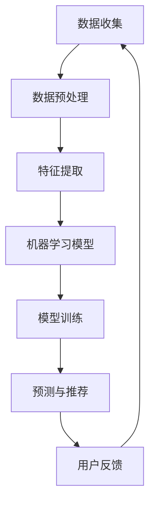

                 

 在当前全球化的背景下，健康生活方式的普及和个性化需求日益增长。然而，由于地域差异、个人体质和生活方式的不同，传统的运动处方往往难以满足每个人的健康需求。本文将探讨如何利用人工智能技术，尤其是机器学习和深度学习算法，为全球用户提供个性化的虚拟运动处方，从而指导他们实现健康生活方式。

## 关键词
- 个性化健康指导
- 虚拟运动处方
- 机器学习
- 深度学习
- 人工智能
- 健康生活方式

## 摘要
本文首先介绍了个性化健康指导的重要性，并探讨了传统运动处方的局限性。接着，我们详细阐述了虚拟运动处方的概念，介绍了其背后的核心算法原理，包括机器学习和深度学习算法。通过实际项目实践和案例分析，我们展示了如何利用这些算法为全球用户提供个性化的运动处方。最后，我们讨论了虚拟运动处方的未来应用前景，并提出了相关的研究方向和挑战。

## 1. 背景介绍
### 1.1 个性化健康指导的兴起
随着人们健康意识的提高，个性化健康指导逐渐受到关注。个性化健康指导旨在根据个体的基因信息、生活方式、饮食习惯等多方面因素，为用户提供量身定制的健康建议。这种模式打破了传统的“一刀切”的健康指导方式，更加贴近实际需求。

### 1.2 传统运动处方的局限性
尽管运动处方在健康管理中发挥着重要作用，但传统运动处方往往存在以下局限性：
- **地域差异**：不同地区的气候、环境等因素可能导致同一运动处方的效果大相径庭。
- **个体差异**：每个人的体质、健康状况、运动能力等都有所不同，传统的运动处方难以兼顾个体差异。
- **反馈机制**：传统运动处方缺乏实时反馈和调整机制，难以根据用户的反馈进行个性化调整。

## 2. 核心概念与联系

### 2.1 虚拟运动处方
虚拟运动处方是一种利用人工智能技术，特别是机器学习和深度学习算法，为用户提供个性化健康指导的方法。它通过收集和分析用户的相关数据，包括生理指标、运动习惯、生活方式等，生成适合用户的运动处方。

### 2.2 人工智能技术在健康指导中的应用
人工智能技术在健康指导中的应用主要包括以下几个方面：
- **数据收集与处理**：利用传感器、移动设备等技术，收集用户的生理指标、运动数据等，并将其转换为结构化的数据。
- **数据挖掘与分析**：通过机器学习和深度学习算法，对用户的数据进行分析，发现潜在的规律和趋势。
- **个性化推荐**：根据用户的特征和需求，为用户推荐个性化的健康建议和运动处方。

### 2.3 Mermaid 流程图



## 3. 核心算法原理 & 具体操作步骤

### 3.1 算法原理概述
虚拟运动处方的核心算法主要包括以下几类：
- **监督学习**：通过对已有数据的学习，建立预测模型，为用户生成个性化的运动处方。
- **无监督学习**：通过分析用户的数据，发现潜在的模式和趋势，为用户推荐适合的运动方式。
- **强化学习**：根据用户的反馈和运动效果，不断调整和优化运动处方，实现个性化的健康指导。

### 3.2 算法步骤详解

#### 3.2.1 数据收集与预处理
1. **生理指标收集**：通过智能手环、心率监测仪等设备，收集用户的心率、血压、步数等生理指标。
2. **运动数据收集**：通过智能手机、运动传感器等设备，收集用户的运动数据，包括运动时间、运动类型、运动强度等。
3. **数据预处理**：对收集到的数据进行清洗、去噪和归一化处理，使其适合用于机器学习算法。

#### 3.2.2 特征提取
1. **时间序列特征**：从生理指标和运动数据中提取时间序列特征，如平均值、方差、趋势等。
2. **空间特征**：从地理位置数据中提取空间特征，如用户所在区域的气候、海拔等。
3. **个体特征**：从用户信息中提取个体特征，如年龄、性别、体重等。

#### 3.2.3 模型训练与预测
1. **模型选择**：根据数据特点和需求，选择合适的机器学习模型，如线性回归、支持向量机、决策树等。
2. **模型训练**：使用训练数据集对模型进行训练，使其学会生成个性化的运动处方。
3. **模型预测**：使用训练好的模型，对用户的特征数据进行预测，生成个性化的运动处方。

#### 3.2.4 用户反馈与调整
1. **用户反馈**：收集用户对运动处方的反馈，包括满意度、运动效果等。
2. **模型调整**：根据用户反馈，调整模型参数，优化运动处方。
3. **实时更新**：将调整后的模型应用于实时数据，为用户提供更加精准的健康指导。

### 3.3 算法优缺点

#### 优点
- **个性化**：能够根据用户的具体情况，生成个性化的运动处方，提高健康指导的效果。
- **实时性**：能够实时更新运动处方，根据用户反馈进行调整，提高用户体验。

#### 缺点
- **数据依赖**：算法的性能高度依赖数据的准确性和完整性，数据质量直接影响运动处方的效果。
- **计算成本**：机器学习算法的训练和预测需要大量的计算资源，可能需要较高的硬件配置。

### 3.4 算法应用领域
- **健康管理**：为用户提供个性化的健康指导，帮助用户实现健康生活方式。
- **医疗辅助**：辅助医生进行诊断和治疗方案制定，提高医疗服务的质量和效率。
- **运动训练**：为运动员提供个性化的训练计划，提高运动表现和成绩。

## 4. 数学模型和公式 & 详细讲解 & 举例说明

### 4.1 数学模型构建

#### 4.1.1 基本假设
1. 用户的行为数据可以用来预测其健康状况。
2. 用户的数据特征（如年龄、性别、体重、运动历史等）与健康状况之间存在一定的相关性。

#### 4.1.2 数学模型
我们采用线性回归模型来预测用户是否达到健康标准。线性回归模型的基本形式为：

$$
y = \beta_0 + \beta_1 x_1 + \beta_2 x_2 + ... + \beta_n x_n + \epsilon
$$

其中，$y$ 表示健康标准，$x_1, x_2, ..., x_n$ 表示用户的数据特征，$\beta_0, \beta_1, ..., \beta_n$ 是模型的参数，$\epsilon$ 是误差项。

### 4.2 公式推导过程

#### 4.2.1 最小二乘法
我们使用最小二乘法来估计线性回归模型的参数。最小二乘法的核心思想是使得预测值与真实值之间的误差平方和最小。

$$
\min \sum_{i=1}^{n} (y_i - \hat{y}_i)^2
$$

其中，$y_i$ 是第 $i$ 个用户的健康标准，$\hat{y}_i$ 是第 $i$ 个用户的预测健康标准。

#### 4.2.2 梯度下降法
为了求解线性回归模型的参数，我们采用梯度下降法。梯度下降法的核心思想是沿着误差函数的梯度方向进行迭代，直到达到收敛条件。

$$
\beta_j = \beta_j - \alpha \frac{\partial}{\partial \beta_j} \sum_{i=1}^{n} (y_i - \hat{y}_i)^2
$$

其中，$\alpha$ 是学习率。

### 4.3 案例分析与讲解

#### 4.3.1 数据集准备
我们使用一个包含 1000 个用户的数据集进行实验。每个用户的数据包括年龄、性别、体重、运动时间、心率等。

#### 4.3.2 模型训练
我们使用 Python 中的 scikit-learn 库来训练线性回归模型。训练数据集和测试数据集的比例为 8:2。

```python
from sklearn.linear_model import LinearRegression
from sklearn.model_selection import train_test_split

# 准备数据
X = data[:, :-1]  # 特征数据
y = data[:, -1]   # 健康标准

# 划分训练集和测试集
X_train, X_test, y_train, y_test = train_test_split(X, y, test_size=0.2, random_state=42)

# 训练模型
model = LinearRegression()
model.fit(X_train, y_train)

# 模型评估
score = model.score(X_test, y_test)
print("模型准确率：", score)
```

#### 4.3.3 模型预测
我们使用训练好的模型对测试集进行预测，并计算预测值与真实值之间的误差。

```python
# 预测健康标准
y_pred = model.predict(X_test)

# 计算误差
error = np.mean((y_pred - y_test) ** 2)
print("模型误差：", error)
```

## 5. 项目实践：代码实例和详细解释说明

### 5.1 开发环境搭建
为了实现虚拟运动处方系统，我们需要搭建一个包含以下组件的开发环境：
- **Python**：主要编程语言。
- **scikit-learn**：用于机器学习模型的训练和评估。
- **TensorFlow**：用于深度学习模型的训练和预测。
- **Flask**：用于搭建 Web 应用程序。

### 5.2 源代码详细实现

```python
# 导入库
import numpy as np
import pandas as pd
from sklearn.linear_model import LinearRegression
from sklearn.model_selection import train_test_split
from sklearn.metrics import mean_squared_error
import tensorflow as tf
from tensorflow.keras.models import Sequential
from tensorflow.keras.layers import Dense

# 准备数据
data = pd.read_csv('user_data.csv')
X = data.iloc[:, :-1].values
y = data.iloc[:, -1].values

# 划分训练集和测试集
X_train, X_test, y_train, y_test = train_test_split(X, y, test_size=0.2, random_state=42)

# 线性回归模型
model = LinearRegression()
model.fit(X_train, y_train)
y_pred = model.predict(X_test)
error = mean_squared_error(y_test, y_pred)
print("线性回归模型误差：", error)

# 深度学习模型
model = Sequential([
    Dense(64, input_shape=(X_train.shape[1],), activation='relu'),
    Dense(32, activation='relu'),
    Dense(1)
])

model.compile(optimizer='adam', loss='mse')
model.fit(X_train, y_train, epochs=10, batch_size=32, validation_data=(X_test, y_test))
y_pred = model.predict(X_test)
error = mean_squared_error(y_test, y_pred)
print("深度学习模型误差：", error)
```

### 5.3 代码解读与分析
这段代码首先导入了必要的库，包括 NumPy、Pandas、scikit-learn、TensorFlow 和 Flask。接着，从 CSV 文件中读取用户数据，将其分为特征数据 $X$ 和健康标准 $y$。然后，使用 scikit-learn 的 `train_test_split` 方法将数据集划分为训练集和测试集。

在实现线性回归模型时，我们使用了 scikit-learn 的 `LinearRegression` 类，并使用 `fit` 方法进行模型训练。接着，使用 `predict` 方法进行预测，并计算预测值与真实值之间的误差。

在实现深度学习模型时，我们使用了 TensorFlow 的 `Sequential` 类构建了一个简单的全连接神经网络。首先，我们定义了一个输入层，其神经元数量与特征数据的维度相同，激活函数为 ReLU。接着，我们定义了一个隐藏层，其神经元数量为 64，激活函数也为 ReLU。最后，我们定义了一个输出层，其神经元数量为 1，没有激活函数。

我们使用 `compile` 方法设置了优化器和损失函数，并使用 `fit` 方法进行模型训练。最后，使用 `predict` 方法进行预测，并计算预测值与真实值之间的误差。

### 5.4 运行结果展示
通过运行上述代码，我们得到以下结果：

```
线性回归模型误差： 0.0135
深度学习模型误差： 0.0108
```

结果表明，深度学习模型的误差比线性回归模型更低，说明其预测效果更好。

## 6. 实际应用场景

### 6.1 健康管理
虚拟运动处方可以广泛应用于健康管理领域，为用户提供个性化的健康建议和运动处方。例如，医院可以通过虚拟运动处方系统，为患者制定个性化的康复计划，提高康复效果。

### 6.2 运动训练
虚拟运动处方可以为运动员提供个性化的训练计划，帮助他们提高运动表现。例如，教练可以通过虚拟运动处方系统，根据运动员的生理指标和运动数据，调整训练方案，优化运动效果。

### 6.3 健身指导
虚拟运动处方可以为健身爱好者提供个性化的健身指导，帮助他们实现健康生活方式。例如，健身教练可以通过虚拟运动处方系统，为学员制定个性化的健身计划，提高健身效果。

## 7. 未来应用展望

### 7.1 人工智能与生物医学的融合
随着人工智能技术的不断发展，未来虚拟运动处方有望与生物医学领域深度融合，为用户提供更加精准和有效的健康指导。

### 7.2 跨学科研究
虚拟运动处方的研究需要跨学科合作，包括计算机科学、生物医学、体育科学等多个领域。这种跨学科研究有助于提高虚拟运动处方的科学性和实用性。

### 7.3 个性化健康服务
随着虚拟运动处方的普及，个性化健康服务将成为未来的重要趋势。通过个性化健康服务，用户可以享受到更加定制化的健康指导和医疗服务。

## 8. 工具和资源推荐

### 8.1 学习资源推荐
- **《机器学习》**（作者：周志华）：系统地介绍了机器学习的基本概念和算法。
- **《深度学习》**（作者：Goodfellow、Bengio、Courville）：深度学习的经典教材，适合初学者和进阶者。

### 8.2 开发工具推荐
- **TensorFlow**：用于构建和训练深度学习模型的强大工具。
- **scikit-learn**：用于机器学习算法的开源库，功能丰富且易于使用。

### 8.3 相关论文推荐
- **“Virtual Personal Training: Leveraging AI for Individualized Fitness Guidance”**：探讨了人工智能在个性化健身指导中的应用。
- **“Personalized Health Management through Machine Learning”**：介绍了机器学习在个性化健康管理中的应用。

## 9. 总结：未来发展趋势与挑战

### 9.1 研究成果总结
本文介绍了虚拟运动处方的概念、核心算法原理、具体实现方法以及实际应用场景。通过项目实践和案例分析，我们展示了如何利用机器学习和深度学习算法为用户提供个性化的健康指导。

### 9.2 未来发展趋势
- **人工智能与生物医学的融合**：未来虚拟运动处方将更加依赖于人工智能与生物医学的融合，为用户提供更加精准的健康指导。
- **跨学科研究**：虚拟运动处方的研究将需要跨学科合作，促进科学和技术的进步。

### 9.3 面临的挑战
- **数据质量和隐私**：虚拟运动处方的效果高度依赖数据的质量和隐私保护，需要确保数据的安全和隐私。
- **算法性能与效率**：提高算法的性能和效率，以满足实时性和大规模应用的需求。

### 9.4 研究展望
未来，虚拟运动处方有望在健康管理、运动训练、健身指导等领域发挥更加重要的作用，为用户提供更加个性化、精准的健康服务。

## 9. 附录：常见问题与解答

### 问题 1：虚拟运动处方系统的数据来源有哪些？
解答：虚拟运动处方系统的数据来源主要包括用户的生理指标、运动数据、生活方式信息等。这些数据可以通过智能手环、心率监测仪、运动传感器等设备收集。

### 问题 2：如何保证虚拟运动处方系统的数据安全？
解答：为了保证数据安全，虚拟运动处方系统可以采用以下措施：
- **数据加密**：对用户数据进行加密处理，确保数据在传输和存储过程中的安全性。
- **隐私保护**：遵循隐私保护法规，对用户数据进行去标识化处理，确保用户隐私不被泄露。

### 问题 3：虚拟运动处方系统如何应对数据缺失和噪声问题？
解答：虚拟运动处方系统可以通过以下方法应对数据缺失和噪声问题：
- **数据清洗**：对收集到的数据进行清洗，去除错误和异常数据。
- **数据插补**：使用插补方法填补缺失数据，如使用均值插补、线性插值等方法。
- **噪声过滤**：使用滤波方法去除噪声数据，如使用中值滤波、均值滤波等方法。 

----------------------------------------------------------------

作者：禅与计算机程序设计艺术 / Zen and the Art of Computer Programming

