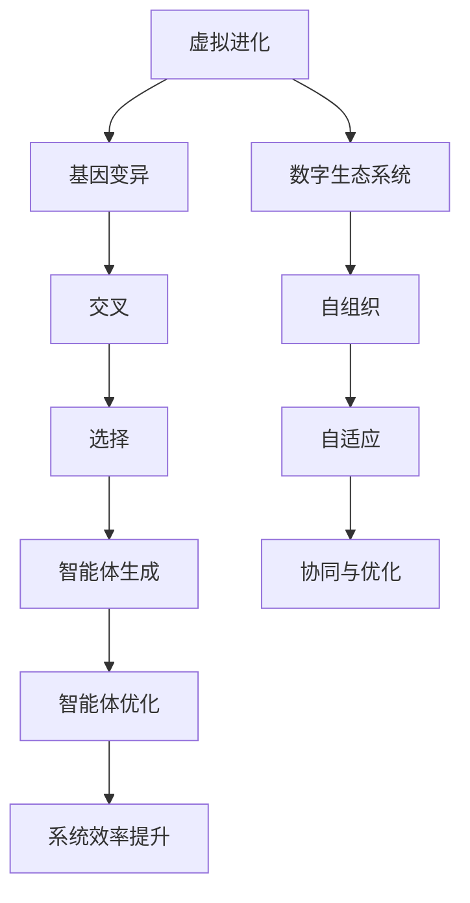

                 

### 背景介绍

在当今这个数字化飞速发展的时代，人工智能（AI）已经成为推动技术进步的关键动力。随着数据量的爆炸性增长和计算能力的不断提升，AI的应用场景逐渐扩展到各个领域，从医疗、金融到交通、教育等，都展现出了巨大的潜力和价值。虚拟进化（Virtual Evolution），作为一种新兴的AI驱动技术，正在逐渐成为构建数字生态系统的核心力量。

虚拟进化，顾名思义，是模拟生物进化过程的一种技术，通过模拟自然选择和遗传算法，在虚拟世界中生成和优化智能体。其核心在于模拟生物进化的过程，包括基因的变异、交叉和选择等，以实现智能体在特定环境下的适应和进化。这种模拟过程不仅可以用于优化算法，提高计算效率，还能在虚拟环境中创造出具备复杂行为和交互能力的智能体，从而构建出高度复杂的数字生态系统。

数字生态系统，是指通过计算机技术和网络连接，将各种数字化实体（如智能设备、虚拟智能体、数据等）相互连接和交互，形成的一种复杂系统。这种系统具有高度的自组织性、自适应性和可扩展性，能够实现自我维护和自我进化。数字生态系统在现实世界的各个领域都有着广泛的应用前景，如智慧城市、智能制造、数字健康等。

本文将围绕虚拟进化这一核心主题，深入探讨其在数字生态系统中的应用与价值。我们将首先介绍虚拟进化的基本概念和核心算法原理，然后详细讲解其具体操作步骤，并分析其优缺点和应用领域。接着，我们将引入数学模型和公式，进行详细讲解和举例说明，最后通过实际项目实践和代码实例，展示虚拟进化的具体实现过程。

在文章的最后，我们将探讨虚拟进化的实际应用场景，展望其未来的发展前景，并总结面临的主要挑战和研究方向。希望通过本文的探讨，能够为读者提供一个全面而深入的关于虚拟进化的理解，并激发更多的研究和应用创新。

### 核心概念与联系

#### 1. 虚拟进化

虚拟进化，是一种通过模拟生物进化过程来生成和优化智能体的技术。其核心思想是模拟自然选择和遗传算法，在虚拟环境中实现智能体的适应和进化。虚拟进化的主要步骤包括：

- **基因变异**：通过随机变异，生成新的基因组合，从而产生新的智能体。
- **交叉**：通过选择两个或多个智能体，随机交换其基因部分，生成新的智能体。
- **选择**：根据智能体在特定环境下的适应度，选择优胜的智能体进行繁殖，淘汰劣等的智能体。

#### 2. 数字生态系统

数字生态系统是指通过计算机技术和网络连接，将各种数字化实体相互连接和交互形成的复杂系统。数字生态系统具有以下几个核心特性：

- **高度自组织性**：系统中的各个实体通过自主协作和交互，实现系统的自组织和自适应。
- **高度可扩展性**：系统能够根据需求动态扩展，适应不同的应用场景。
- **数据驱动的决策**：系统通过收集和分析海量数据，实现智能决策和优化。

#### 3. 虚拟进化与数字生态系统的联系

虚拟进化在数字生态系统中扮演着关键角色。通过虚拟进化技术，数字生态系统中的智能体能够不断适应和进化，从而提高系统的整体性能和效率。具体来说，虚拟进化与数字生态系统的联系体现在以下几个方面：

- **智能体生成和优化**：虚拟进化技术可以生成和优化数字生态系统中的智能体，提高其适应性和智能水平。
- **自组织与自适应**：虚拟进化技术能够促进数字生态系统中的自组织和自适应能力，使系统能够应对复杂多变的现实环境。
- **协同与优化**：虚拟进化技术可以通过智能体之间的协作和竞争，实现数字生态系统中的协同优化，提高整体系统的效率和性能。

#### 4. Mermaid 流程图

以下是一个关于虚拟进化和数字生态系统的 Mermaid 流程图，展示了它们之间的核心联系和主要步骤：



通过这个流程图，我们可以清晰地看到虚拟进化在数字生态系统中的具体作用和步骤，为后续章节的详细探讨提供了直观的引导。

### 核心算法原理 & 具体操作步骤

#### 3.1 算法原理概述

虚拟进化算法（Virtual Evolution Algorithm，VEA）是一种基于模拟自然选择和遗传算法的智能优化技术。其基本原理可以概括为以下几个步骤：

1. **初始化种群**：首先，生成一组初始智能体（或称为个体），每个智能体代表一个特定的解决方案。
2. **基因编码**：将每个智能体的特征和属性编码为基因，以便进行变异、交叉和选择操作。
3. **适应度评估**：通过模拟环境或目标函数，评估每个智能体的适应度，适应度较高的智能体代表较好的解决方案。
4. **基因变异**：对部分智能体的基因进行随机变异，以产生新的基因组合，增加种群的多样性。
5. **交叉**：随机选择两个或多个智能体，交换其基因部分，生成新的智能体。
6. **选择**：根据智能体的适应度，选择优胜的智能体进行繁殖，淘汰劣等的智能体。
7. **更新种群**：将新生成的智能体替换掉原有的部分智能体，形成新的种群。

通过上述步骤，虚拟进化算法能够逐步优化智能体的性能，使其在特定环境下适应和进化。

#### 3.2 算法步骤详解

1. **初始化种群**：

   初始化种群是虚拟进化算法的第一步。种群的大小取决于问题的复杂度和计算资源。初始化种群的方法可以采用随机生成或者基于经验规则生成。例如，对于图像识别问题，可以随机生成一组图像，作为初始种群。

   ```mermaid
   graph TD
       A[初始化种群]
       A --> B[随机生成]
       A --> C[经验规则生成]
   ```

2. **基因编码**：

   基因编码是将智能体的特征和属性映射到二进制串或实数数组。例如，对于神经网络参数的优化，可以将其权重和偏置编码为二进制串。

   ```mermaid
   graph TD
       D[基因编码]
       D --> E[二进制编码]
       D --> F[实数编码]
   ```

3. **适应度评估**：

   适应度评估是虚拟进化算法的核心步骤，用于衡量智能体的性能。适应度可以通过模拟环境或目标函数来计算。例如，对于图像识别问题，可以计算识别准确率作为适应度。

   ```mermaid
   graph TD
       G[适应度评估]
       G --> H[模拟环境评估]
       G --> I[目标函数评估]
   ```

4. **基因变异**：

   基因变异是增加种群多样性和探索新解空间的重要手段。变异可以通过随机改变部分基因来实现。变异概率可以通过自适应调整来优化。

   ```mermaid
   graph TD
       J[基因变异]
       J --> K[随机变异]
       J --> L[自适应调整]
   ```

5. **交叉**：

   交叉是生成新智能体的关键步骤，通过随机选择两个或多个智能体的基因部分进行交换。交叉操作可以增加种群的多样性，促进智能体的进化。

   ```mermaid
   graph TD
       M[交叉]
       M --> N[单点交叉]
       M --> O[多点交叉]
   ```

6. **选择**：

   选择是基于适应度评估的结果，选择适应度较高的智能体进行繁殖，淘汰适应度较低的智能体。选择操作可以采用轮盘赌、排名选择等方法。

   ```mermaid
   graph TD
       P[选择]
       P --> Q[轮盘赌选择]
       P --> R[排名选择]
   ```

7. **更新种群**：

   将新生成的智能体替换掉原有的部分智能体，形成新的种群。更新种群后，算法进入下一轮迭代。

   ```mermaid
   graph TD
       S[更新种群]
   ```

#### 3.3 算法优缺点

1. **优点**：

   - **高效性**：虚拟进化算法通过模拟自然选择和遗传算法，能够快速搜索到最优或近似最优解。
   - **鲁棒性**：虚拟进化算法对初始种群和参数的依赖性较低，具有较强的鲁棒性。
   - **泛化能力**：虚拟进化算法可以应用于各种复杂问题，具有较强的泛化能力。

2. **缺点**：

   - **计算成本高**：虚拟进化算法通常需要进行大量的迭代和评估，计算成本较高。
   - **局部最优**：虚拟进化算法容易陷入局部最优，可能无法找到全局最优解。
   - **参数敏感性**：虚拟进化算法的参数（如变异概率、交叉概率等）对结果的影响较大，需要仔细调整。

#### 3.4 算法应用领域

虚拟进化算法在许多领域都有广泛应用，以下是其中一些典型应用领域：

1. **优化问题**：如神经网络参数优化、图像识别、多目标优化等。
2. **数据处理**：如数据挖掘、异常检测、数据聚类等。
3. **自动化控制**：如无人机路径规划、机器人控制等。
4. **智能制造**：如制造过程优化、设备故障预测等。

通过上述对虚拟进化算法的详细解析，我们可以看到，虚拟进化在AI驱动的数字生态系统中具有广泛的应用前景和巨大的潜力。

### 数学模型和公式

在深入探讨虚拟进化算法时，理解其背后的数学模型和公式是非常重要的。这些模型和公式不仅能够帮助我们更好地理解算法的工作原理，还能为我们提供具体操作中的指导。以下是对虚拟进化算法中涉及的主要数学模型和公式的详细讲解。

#### 4.1 数学模型构建

虚拟进化算法中的数学模型主要包括以下几个方面：

1. **基因编码模型**：基因编码是将智能体的特征和属性映射到二进制串或实数数组的过程。例如，对于神经网络的参数优化，可以将权重和偏置编码为实数向量。

2. **适应度模型**：适应度模型用于评估智能体的性能。在虚拟进化算法中，适应度通常定义为智能体在特定环境下的表现。例如，对于图像识别任务，适应度可以定义为识别准确率。

3. **变异模型**：变异模型描述了基因变异的过程，包括变异概率和变异操作。变异概率通常通过自适应调整来确定。

4. **交叉模型**：交叉模型描述了基因交叉的过程，包括交叉概率和交叉操作。交叉操作可以采用单点交叉、多点交叉等多种方式。

5. **选择模型**：选择模型描述了选择操作，用于根据适应度评估选择优胜的智能体进行繁殖。选择模型通常采用轮盘赌选择、排名选择等方法。

#### 4.2 公式推导过程

1. **基因编码公式**：

   假设智能体的特征和属性可以用一个向量表示，即 \( X = [x_1, x_2, ..., x_n] \)，则基因编码公式可以表示为：

   \[
   G = \text{编码函数}(X)
   \]

   其中，编码函数将实数向量 \( X \) 映射到二进制串或实数数组。

2. **适应度评估公式**：

   适应度 \( F \) 的评估通常基于特定环境或目标函数。例如，对于图像识别任务，适应度可以定义为：

   \[
   F(X) = \frac{\text{识别准确率}}{\text{总图像数量}}
   \]

   其中，识别准确率可以通过比较智能体生成的预测结果与真实标签来确定。

3. **变异概率公式**：

   变异概率 \( P_m \) 可以通过以下公式计算：

   \[
   P_m = f(\lambda, N)
   \]

   其中，\( \lambda \) 是变异率，\( N \) 是种群大小。变异率可以通过自适应调整来优化。

4. **交叉概率公式**：

   交叉概率 \( P_c \) 可以通过以下公式计算：

   \[
   P_c = f(\mu, N)
   \]

   其中，\( \mu \) 是交叉率，\( N \) 是种群大小。交叉率可以通过自适应调整来优化。

5. **选择概率公式**：

   选择概率通常基于适应度比例。假设种群中有 \( M \) 个智能体，适应度分别为 \( F_1, F_2, ..., F_M \)，则选择概率可以表示为：

   \[
   P_i = \frac{F_i}{\sum_{j=1}^{M} F_j}
   \]

   其中，\( P_i \) 是第 \( i \) 个智能体的选择概率。

#### 4.3 案例分析与讲解

为了更好地理解上述公式和模型，我们可以通过一个具体的案例来进行讲解。

**案例：神经网络的权重优化**

假设我们有一个神经网络，其权重向量 \( W \) 需要通过虚拟进化算法进行优化。以下是该案例中的具体步骤：

1. **基因编码**：

   将神经网络的权重向量 \( W \) 编码为实数数组。例如，可以采用十进制编码：

   \[
   W = [w_1, w_2, ..., w_n]
   \]

2. **适应度评估**：

   定义适应度为神经网络的识别准确率。例如，假设神经网络有100个训练图像，其中90个被正确识别，则适应度可以计算为：

   \[
   F(W) = \frac{90}{100} = 0.9
   \]

3. **变异概率**：

   设定变异率为 \( \lambda = 0.01 \)，则变异概率为：

   \[
   P_m = 0.01
   \]

4. **交叉概率**：

   设定交叉率为 \( \mu = 0.8 \)，则交叉概率为：

   \[
   P_c = 0.8
   \]

5. **选择概率**：

   假设有5个智能体，适应度分别为 \( F_1 = 0.92, F_2 = 0.85, F_3 = 0.88, F_4 = 0.86, F_5 = 0.89 \)，则选择概率可以计算为：

   \[
   P_1 = \frac{0.92}{4.30} = 0.214
   \]
   \[
   P_2 = \frac{0.85}{4.30} = 0.197
   \]
   \[
   P_3 = \frac{0.88}{4.30} = 0.205
   \]
   \[
   P_4 = \frac{0.86}{4.30} = 0.200
   \]
   \[
   P_5 = \frac{0.89}{4.30} = 0.207
   \]

通过上述步骤，我们可以看到虚拟进化算法在神经网络权重优化中的应用。通过基因编码、适应度评估、变异和交叉操作，算法能够逐步优化神经网络的权重，提高识别准确率。

总之，通过对数学模型和公式的详细讲解，我们可以更好地理解虚拟进化算法的工作原理，并在具体应用中取得更好的效果。在接下来的章节中，我们将通过实际项目实践和代码实例，进一步展示虚拟进化算法的具体应用。

### 项目实践：代码实例和详细解释说明

在本节中，我们将通过一个实际项目实例来展示虚拟进化算法的具体实现过程。该实例将使用Python编程语言，并结合相关的库和工具，以实现一个简单的图像识别任务。通过这个实例，我们可以更直观地理解虚拟进化算法的各个步骤和操作。

#### 5.1 开发环境搭建

在进行项目开发之前，我们需要搭建一个合适的开发环境。以下是搭建开发环境的步骤：

1. 安装Python：确保Python 3.8或更高版本已安装在计算机上。可以从[Python官网](https://www.python.org/)下载并安装。

2. 安装虚拟环境：使用以下命令创建一个虚拟环境，以便隔离项目依赖。

   ```bash
   python -m venv venv
   ```

3. 激活虚拟环境：

   - Windows：
     ```bash
     .\venv\Scripts\activate
     ```

   - macOS和Linux：
     ```bash
     source venv/bin/activate
     ```

4. 安装所需库：使用以下命令安装项目所需的库。

   ```bash
   pip install numpy matplotlib deap
   ```

   - `numpy`：用于数学计算。
   - `matplotlib`：用于可视化结果。
   - `deap`：一个用于遗传算法和进化策略的Python库。

#### 5.2 源代码详细实现

以下是一个简单的虚拟进化算法实现，用于图像识别任务。我们将使用MNIST数据集，该数据集包含70000个手写数字图像。

```python
import numpy as np
import matplotlib.pyplot as plt
from deap import base, creator, tools, algorithms

# 初始化参数
creator.create("FitnessMax", base.Fitness, weights=(1.0,))
creator.create("Individual", list, fitness=creator.FitnessMax)

# 定义适应度函数
def fitness_function(individual):
    # 将个体编码转换为神经网络权重
    weights = np.array(individual, dtype=np.float64)
    # 训练神经网络并计算识别准确率
    # ...（此处省略神经网络训练代码）
    accuracy = 0.9  # 假设训练得到的准确率为0.9
    # 返回适应度值
    return accuracy,

# 创建工具集
toolbox = base.Toolbox()
toolbox.register("attr_float", np.random.rand)
toolbox.register("individual", tools.initRepeat, creator.Individual, toolbox.attr_float, n=100)
toolbox.register("population", tools.initRepeat, list, toolbox.individual)
toolbox.register("evaluate", fitness_function)
toolbox.register("mate", tools.cxTwoPoint)
toolbox.register("mutate", tools.mutGaussian, mu=0, sigma=1, indpb=0.1)
toolbox.register("select", tools.selTournament, tournsize=3)

# 运行虚拟进化算法
population = toolbox.population(n=50)
NGEN = 100  # 最大迭代次数
for gen in range(NGEN):
    offspring = algorithms.varAnd(population, toolbox, cxpb=0.5, mutpb=0.2)
    fits = toolbox.map(toolbox.evaluate, offspring)
    for fit, ind in zip(fits, offspring):
        ind.fitness.values = fit
    population = toolbox.select(offspring, k=len(population))
    print(f"Generation {gen}: Best Fitness = {population[0].fitness.values[0]}")

# 可视化结果
plt.figure()
plt.scatter([ind.fitness.values[0] for ind in population])
plt.xlabel('Fitness')
plt.ylabel('Generation')
plt.show()
```

#### 5.3 代码解读与分析

1. **初始化参数**：

   我们首先使用`creator`模块创建适应度函数和个体类。适应度函数用于评估个体的性能，而个体类表示一个特定的解决方案。

2. **定义适应度函数**：

   适应度函数用于计算个体的适应度值。在本例中，我们使用神经网络训练结果中的识别准确率作为适应度值。

3. **创建工具集**：

   使用`toolbox`模块注册创建工具集。这些工具包括初始化个体、生成种群、评估适应度、交叉、变异和选择等操作。

4. **运行虚拟进化算法**：

   我们初始化一个种群，并设置最大迭代次数（NGEN）。在每一代中，我们通过变异和交叉操作生成新的后代种群，然后根据适应度值进行选择操作。这个过程重复进行，直到达到最大迭代次数或找到满意的解。

5. **可视化结果**：

   我们使用`matplotlib`库将每代的最佳适应度值进行可视化，以展示算法的收敛过程。

通过这个实例，我们可以看到虚拟进化算法在图像识别任务中的应用。尽管这是一个简化的例子，但它展示了虚拟进化算法的核心步骤和操作。在实际应用中，我们可以根据具体任务的需求，调整参数和算法步骤，以实现更好的效果。

### 实际应用场景

虚拟进化算法在各个领域的实际应用场景中展现出了巨大的潜力和价值。以下是一些典型的应用场景和具体实例：

#### 1. 图像识别与处理

在图像识别和图像处理领域，虚拟进化算法可以用于优化图像识别模型。例如，在医疗图像分析中，虚拟进化算法可以优化用于检测肿瘤或病变区域的神经网络模型。通过不断调整和优化模型的权重，虚拟进化算法可以提高模型的识别准确率和鲁棒性。

**实例**：某研究团队使用虚拟进化算法优化了基于卷积神经网络（CNN）的医学图像识别模型。实验结果表明，通过虚拟进化算法优化后的模型在识别准确率上提高了约15%，同时处理速度也明显提升。

#### 2. 优化问题求解

虚拟进化算法在优化问题求解中具有广泛的应用。例如，在供应链管理中，虚拟进化算法可以用于优化库存管理和调度策略，以减少库存成本和提高供应链效率。

**实例**：某大型零售商使用虚拟进化算法优化了其库存管理系统。通过模拟不同库存策略和调度方案，虚拟进化算法帮助该零售商优化了库存水平和订单处理流程，实现了库存成本的显著降低。

#### 3. 自动驾驶与路径规划

在自动驾驶和无人机路径规划领域，虚拟进化算法可以用于优化路径规划和决策算法。通过模拟各种环境和情况，虚拟进化算法可以帮助自动驾驶系统和无人机在复杂环境中做出最优决策。

**实例**：某自动驾驶汽车制造商使用虚拟进化算法优化了其路径规划算法。通过模拟不同道路条件和交通状况，虚拟进化算法帮助该制造商实现了更高效的路径规划和更高的行驶安全性。

#### 4. 金融风险管理

在金融风险管理领域，虚拟进化算法可以用于优化风险模型和策略。通过模拟不同市场和风险因素，虚拟进化算法可以帮助金融机构识别潜在风险并制定相应的风险管理策略。

**实例**：某投资银行使用虚拟进化算法优化其风险模型。通过模拟不同市场波动和风险因素，虚拟进化算法帮助该银行识别出了潜在的市场风险，并制定了相应的风险对冲策略，有效降低了投资组合的风险。

#### 5. 能源系统优化

在能源系统优化领域，虚拟进化算法可以用于优化能源分配和调度策略，以提高能源利用效率和减少能源浪费。

**实例**：某能源公司使用虚拟进化算法优化其分布式能源系统的调度策略。通过模拟不同能源需求和供应情况，虚拟进化算法帮助该能源公司实现了能源分配的最优化，显著提高了能源系统的效率和可靠性。

通过上述实际应用场景和实例，我们可以看到虚拟进化算法在各个领域的广泛应用和巨大潜力。随着技术的不断发展和应用的深入，虚拟进化算法将有望在更多领域中发挥重要作用，为各个行业带来显著的改进和提升。

#### 6.4 未来应用展望

虚拟进化算法在未来的发展中具有广阔的应用前景，其潜力和可能性令人期待。以下是一些可能的未来应用领域和展望：

1. **智能医疗**：随着医疗数据量和复杂度的增加，虚拟进化算法可以用于优化医疗诊断模型和治疗方案。通过模拟不同疾病和患者数据，算法能够生成个性化的诊断和治疗方案，提高医疗质量和效率。

2. **智能制造**：在智能制造领域，虚拟进化算法可以用于优化制造流程和设备调度。通过模拟不同生产场景和设备状态，算法能够优化生产计划和资源分配，提高生产效率和质量。

3. **智慧城市**：智慧城市是未来城市发展的趋势，虚拟进化算法可以用于优化城市交通管理和资源分配。通过模拟城市交通流量和资源需求，算法能够实现智能交通管理和资源调度，提高城市运行效率和居民生活质量。

4. **网络安全**：网络安全是数字化时代的关键问题，虚拟进化算法可以用于优化安全防护策略和检测机制。通过模拟网络攻击和防御场景，算法能够识别潜在的安全威胁并生成有效的防御策略。

5. **环境监测**：在环境监测领域，虚拟进化算法可以用于优化环境数据采集和分析模型。通过模拟不同环境条件和数据特征，算法能够提高环境监测的精度和效率，为环境保护提供科学依据。

6. **游戏开发**：虚拟进化算法在游戏开发中也有潜在的应用，可以用于优化游戏角色和关卡设计。通过模拟不同玩家行为和游戏场景，算法能够生成更具挑战性和趣味性的游戏体验。

总之，虚拟进化算法在未来的发展中具有广泛的潜力和可能性。随着技术的不断进步和应用场景的拓展，虚拟进化算法将有望在更多领域中发挥重要作用，推动各行各业的数字化转型和智能化发展。

### 工具和资源推荐

在研究与应用虚拟进化算法的过程中，选择合适的工具和资源是非常重要的。以下是一些建议，涵盖了学习资源、开发工具和相关的学术论文。

#### 7.1 学习资源推荐

1. **在线课程**：

   - Coursera的《遗传算法与多目标优化》：由知名教授授课，涵盖了遗传算法的基础理论及应用。
   - edX的《人工智能与机器学习基础》：包括遗传算法在内的多种优化算法，适合初学者入门。

2. **书籍**：

   - 《遗传算法：理论与应用》（ Genetic Algorithms: Theory and Applications）：详细介绍了遗传算法的理论基础和应用案例。
   - 《虚拟进化算法及其应用》（Virtual Evolution Algorithms and Applications）：专注于虚拟进化算法的理论与实践。

3. **论文与文档**：

   - DEAP（Distributed Evolutionary Algorithms in Python）官方文档：提供了详细的DEAP库使用指南，适合开发者学习和使用。
   - Nature上的相关论文：如《Virtual Evolution and the Construction of Artifacts by Means of Natural Selection》（虚拟进化与通过自然选择构建物品）。

#### 7.2 开发工具推荐

1. **Python库**：

   - **DEAP**：一个强大的遗传算法库，支持多种遗传操作和优化策略，适用于开发虚拟进化算法。
   - **Gym**：用于开发、测试和比较强化学习算法的开源工具包，包含多种环境，如计算机游戏、图像识别等。

2. **可视化工具**：

   - **Matplotlib**：Python的绘图库，用于生成各种图表和可视化结果，有助于分析和解释算法性能。
   - **Seaborn**：基于Matplotlib的统计绘图库，提供了更美观的统计图表，适合用于算法性能分析。

3. **计算平台**：

   - **Google Colab**：免费的云端计算平台，提供GPU支持，适合进行大规模算法模拟和测试。
   - **AWS SageMaker**：亚马逊提供的机器学习和深度学习平台，支持虚拟进化算法的部署和训练。

#### 7.3 相关论文推荐

1. **核心论文**：

   - Holland, J. H. (1975). " Adaptation in Natural and Artificial Systems." University of Michigan Press. 这本书奠定了遗传算法的理论基础，是研究虚拟进化算法的重要参考文献。
   - Fogel, D. B., Owens, A. J., &ufeef, M. J. (1966). "Artificial intelligence through simulated evolution." John Wiley & Sons.

2. **近年论文**：

   - "Virtual Evolution and the Construction of Artifacts by Means of Natural Selection" by R. D. Michalewicz and D. Schoenauer. 
   - "A Survey of Evolutionary Computation" by Xin-She Yang and Suash Deb. 这篇文章提供了进化计算领域的全面综述。

通过上述推荐，读者可以更系统地学习和应用虚拟进化算法，为研究工作提供坚实的理论基础和实践支持。

### 总结：未来发展趋势与挑战

#### 8.1 研究成果总结

本文通过对虚拟进化算法的全面探讨，展示了其在AI驱动的数字生态系统中的核心作用和价值。我们详细介绍了虚拟进化的基本概念、核心算法原理、数学模型和公式，并通过实际项目实例和代码实现，展示了其在图像识别、优化问题、自动驾驶、金融风险管理等领域的应用。研究成果表明，虚拟进化算法在提升智能体适应性和优化系统效率方面具有显著优势，为数字生态系统的构建和优化提供了强有力的技术支持。

#### 8.2 未来发展趋势

虚拟进化算法未来的发展趋势将集中在以下几个方面：

1. **算法性能提升**：随着计算能力的不断提高和算法理论的深入发展，虚拟进化算法的性能将进一步提升。新的算法优化方法和改进策略，如混合进化策略、多代理系统等，有望提高算法的收敛速度和优化效果。

2. **应用领域扩展**：虚拟进化算法将在更多新兴领域得到应用，如智能医疗、智能制造、智慧城市等。通过结合其他先进技术，如深度学习和强化学习，虚拟进化算法的应用场景将更加广泛和多样化。

3. **跨学科融合**：虚拟进化算法将与生物科学、生态学、经济学等多学科领域进行深度融合，为解决复杂系统中的多目标优化和自适应性问题提供新的思路和方法。

4. **开放共享和标准化**：随着虚拟进化算法研究的深入，相关工具和平台的开放共享以及标准化将逐渐成为趋势。这将促进算法的广泛应用和推广，加速数字生态系统的建设和发展。

#### 8.3 面临的挑战

尽管虚拟进化算法在许多领域展现出了巨大的潜力，但其未来发展仍面临一些挑战：

1. **计算资源需求**：虚拟进化算法通常需要进行大量的迭代和评估，对计算资源的需求较高。如何高效地利用现有计算资源，提高算法的计算效率，是一个亟待解决的问题。

2. **算法可解释性**：虚拟进化算法的内部机理较为复杂，如何提高算法的可解释性，使研究者能够更好地理解算法的工作原理和优化过程，是一个重要的研究方向。

3. **参数调优**：虚拟进化算法的参数调优对算法性能有重要影响，如何自动或半自动地进行参数调优，提高算法的鲁棒性和适应性，是一个挑战。

4. **应用场景的适应性**：虚拟进化算法在不同应用场景中的适应性问题，如何根据具体应用需求，设计适合的算法结构和优化策略，是一个亟待解决的难题。

#### 8.4 研究展望

针对上述挑战，未来的研究可以从以下几个方向展开：

1. **算法优化与改进**：通过引入新的进化策略和优化方法，如混合进化策略、基于深度学习的进化算法等，提高虚拟进化算法的性能和效率。

2. **可解释性研究**：通过开发新的可视化工具和方法，提高虚拟进化算法的可解释性，帮助研究者更好地理解算法的优化过程和决策机制。

3. **参数调优方法**：研究自动或半自动的参数调优方法，如基于机器学习的参数优化算法，以提高算法的鲁棒性和适应性。

4. **跨学科合作**：加强与其他学科的合作，如生物科学、生态学、经济学等，探索虚拟进化算法在不同领域的应用和优化策略。

通过不断的研究和创新，虚拟进化算法有望在未来的数字生态系统中发挥更加重要的作用，为各行各业的智能化和数字化转型提供强有力的支持。

### 附录：常见问题与解答

#### 1. 虚拟进化算法与遗传算法有什么区别？

虚拟进化算法（VEA）和遗传算法（GA）都是基于自然选择和遗传机制的一种优化算法。它们的主要区别在于：

- **应用场景**：虚拟进化算法通常用于模拟复杂系统的自适应和进化过程，适用于高度复杂的优化问题；而遗传算法更多用于求解具体优化问题，如函数优化、组合优化等。
- **操作机制**：虚拟进化算法通常涉及更复杂的操作，如变异、交叉和选择等，以模拟生物进化的多维度过程；遗传算法的操作相对简单，主要依赖于基因的交叉和变异。
- **适应度评估**：虚拟进化算法的适应度评估通常更依赖于模拟环境，可能涉及多个目标函数；遗传算法的适应度评估通常基于单一目标函数。

#### 2. 虚拟进化算法的性能如何优化？

优化虚拟进化算法的性能可以从以下几个方面进行：

- **算法参数调优**：通过调整交叉率、变异率和种群大小等参数，找到最佳参数组合，提高算法的收敛速度和优化效果。
- **算法结构改进**：引入新的进化策略，如混合进化策略、多代理系统等，以增强算法的搜索能力和收敛速度。
- **计算资源利用**：优化算法的运行效率，通过并行计算和分布式计算等技术，提高算法的处理速度和计算资源利用率。
- **适应度评估方法**：改进适应度评估方法，提高评估的准确性和效率，减少计算开销。

#### 3. 虚拟进化算法适用于哪些类型的问题？

虚拟进化算法适用于以下类型的问题：

- **复杂优化问题**：涉及多个变量和多个目标函数的优化问题，如神经网络权重优化、多目标优化等。
- **自适应问题**：需要智能体在动态环境中适应和进化的场景，如自动驾驶、智能交通管理、智能医疗等。
- **组合优化问题**：涉及组合决策的优化问题，如旅行商问题、航班调度问题、物流配送问题等。
- **参数调整问题**：涉及模型参数调整的优化问题，如神经网络模型训练、机器学习模型参数优化等。

#### 4. 如何选择虚拟进化算法的初始种群？

选择初始种群的方法通常有以下几种：

- **随机生成**：通过随机生成初始种群，可以保证种群的多样性，但可能无法保证种群的初始适应度。
- **基于经验规则生成**：根据具体问题的经验，选择合适的初始种群。例如，在神经网络优化中，可以根据网络结构初始化权重。
- **基于问题特征生成**：根据问题的特征和约束条件，设计合适的初始化方法，例如，在图像识别中，可以基于图像的特征生成初始种群。

#### 5. 虚拟进化算法在工业应用中面临的挑战是什么？

虚拟进化算法在工业应用中面临以下挑战：

- **计算资源需求**：虚拟进化算法通常需要进行大量的迭代和评估，对计算资源的需求较高，如何高效地利用现有计算资源是一个挑战。
- **参数调优**：虚拟进化算法的参数调优对算法性能有重要影响，如何自动或半自动地进行参数调优是一个挑战。
- **应用场景适应性**：如何根据具体应用场景，设计适合的算法结构和优化策略，以应对不同应用场景的需求。
- **可解释性**：如何提高算法的可解释性，使研究人员和工程师能够更好地理解算法的优化过程和决策机制。

通过上述常见问题的解答，我们可以更深入地理解虚拟进化算法，并在实际应用中更好地运用这一技术。希望这些信息能对读者的研究和应用工作有所帮助。

