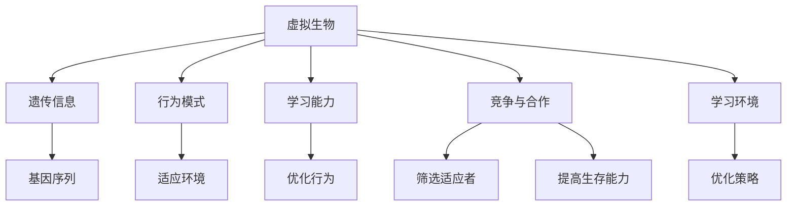

                 

关键词：虚拟进化，AI驱动，数字生态系统，算法原理，数学模型，项目实践，应用场景，未来展望。

> 摘要：本文旨在探讨虚拟进化作为AI驱动的数字生态系统的核心机制，通过对核心概念、算法原理、数学模型、项目实践等方面的深入分析，揭示其潜在的应用场景与未来发展的可能性。作者通过详细阐述相关内容，为读者提供了一个全面了解虚拟进化在数字生态系统中的应用前景。

## 1. 背景介绍

在当今信息时代，数字生态系统的重要性日益凸显。从社交网络到电子商务，从物联网到智慧城市，数字生态系统已经成为支撑现代生活的重要基石。随着人工智能技术的迅猛发展，AI驱动成为数字生态系统的核心驱动力。虚拟进化作为一种创新性的AI驱动机制，正逐渐成为学术界和工业界关注的焦点。

虚拟进化是通过对虚拟生物体的进化模拟来实现智能行为和学习能力的过程。这种机制模拟了自然进化的过程，通过适应环境、竞争和合作等机制，使虚拟生物体能够在不断变化的环境中生存和进化。虚拟进化在数字生态系统中具有广泛的应用前景，包括智能推荐系统、自适应网络安全、智能交通系统等。

本文将围绕虚拟进化的核心概念、算法原理、数学模型、项目实践等方面展开讨论，旨在为读者提供一个全面、深入的理解。

## 2. 核心概念与联系

### 2.1. 虚拟生物与进化

虚拟生物是虚拟进化系统中的基本单位。它们具有遗传信息、行为模式和学习能力。虚拟生物的遗传信息存储在其基因序列中，这些基因序列决定了虚拟生物的属性和行为。虚拟生物通过遗传、变异和选择等机制进行进化。

### 2.2. 环境模拟与适应

虚拟进化系统中的环境是虚拟生物进化的舞台。环境模拟包括物理环境、社会环境等多种因素。虚拟生物需要通过适应环境来提高其生存能力。适应环境的过程包括对环境的感知、对行为的调整以及对行为的优化。

### 2.3. 竞争与合作

虚拟生物之间的竞争与合作是虚拟进化中的重要机制。竞争有助于筛选出适应环境的生物，而合作则有助于提高整个生态系统的生存能力。通过竞争与合作，虚拟生物能够在不断变化的环境中找到最优的生存策略。

### 2.4. 学习与进化

虚拟生物具有学习能力，通过学习环境中的知识和经验，虚拟生物能够不断优化其行为模式。学习与进化相结合，使得虚拟生物能够逐步适应复杂多变的环境。

### 2.5. Mermaid 流程图



## 3. 核心算法原理 & 具体操作步骤

### 3.1. 算法原理概述

虚拟进化的核心算法基于遗传算法（Genetic Algorithm, GA）。遗传算法是一种基于自然进化原理的优化算法，通过模拟自然进化的过程，找到问题的最优解。虚拟进化的遗传算法主要包括以下三个步骤：遗传、变异和选择。

### 3.2. 算法步骤详解

#### 3.2.1. 遗传

遗传过程通过交叉和突变实现。交叉操作将两个父代个体的基因序列进行组合，生成新的子代个体。突变操作对个体的基因序列进行随机修改，以增加种群的多样性。

#### 3.2.2. 变异

变异操作通过随机改变个体的基因序列来引入新的遗传特性。变异概率通常设置为一个较小的值，以确保变异不会过于频繁。

#### 3.2.3. 选择

选择操作根据个体的适应度（Fitness）来筛选出优秀的个体。适应度越高，个体被选中的概率越大。通过选择操作，种群中的优秀个体得以保留，而适应度较低的个体则被淘汰。

### 3.3. 算法优缺点

#### 优点：

- 强鲁棒性：遗传算法适用于解决复杂、高度非线性的优化问题。
- 自适应：遗传算法能够自适应地调整搜索策略，提高搜索效率。

#### 缺点：

- 计算复杂度较高：遗传算法通常需要大量的计算资源。
- 需要较大的种群规模：种群规模较大时，计算复杂度显著增加。

### 3.4. 算法应用领域

虚拟进化的遗传算法在多个领域具有广泛的应用，包括：

- 优化问题：如供应链优化、网络优化、资源分配等。
- 智能推荐系统：如商品推荐、新闻推荐等。
- 自适应网络安全：如入侵检测、恶意代码防御等。

## 4. 数学模型和公式 & 详细讲解 & 举例说明

### 4.1. 数学模型构建

虚拟进化的数学模型主要包括以下三个方面：

1. 基因序列模型：基因序列模型描述了虚拟生物的遗传信息。基因序列由一系列基因位点组成，每个基因位点表示一个基因。

2. 行为模型：行为模型描述了虚拟生物的行为模式。行为模型包括感知模块、决策模块和执行模块。

3. 适应度模型：适应度模型描述了虚拟生物的适应度。适应度越高，个体越优秀。

### 4.2. 公式推导过程

#### 4.2.1. 基因序列模型

基因序列模型可以表示为：

\[ G = \{ g_1, g_2, ..., g_n \} \]

其中，\( g_i \) 表示第 \( i \) 个基因位点。

#### 4.2.2. 行为模型

行为模型可以表示为：

\[ B = \{ p, d, e \} \]

其中，\( p \) 表示感知模块，\( d \) 表示决策模块，\( e \) 表示执行模块。

#### 4.2.3. 适应度模型

适应度模型可以表示为：

\[ f(x) = w_1 \cdot p(x) + w_2 \cdot d(x) + w_3 \cdot e(x) \]

其中，\( w_1, w_2, w_3 \) 分别表示感知、决策、执行模块的权重，\( p(x), d(x), e(x) \) 分别表示感知、决策、执行模块的得分。

### 4.3. 案例分析与讲解

假设我们有一个虚拟生态系统，其中包含100个虚拟生物。我们需要通过虚拟进化来优化这些虚拟生物的行为模式，以提高其适应度。

首先，我们为每个虚拟生物生成一个随机的基因序列。基因序列包含10个基因位点，每个基因位点有2个等位基因（0或1）。

接下来，我们定义行为模型。感知模块的得分取决于虚拟生物所在的环境。假设虚拟生物所在的环境为二维空间，每个虚拟生物的位置由 \( (x, y) \) 表示。感知模块的得分为：

\[ p(x, y) = \frac{1}{\sqrt{x^2 + y^2}} \]

决策模块的得分取决于虚拟生物的感知模块得分和遗传信息。假设决策模块的得分与感知模块得分的比例关系为：

\[ d(x, y) = p(x, y) \cdot \frac{g_i}{2} \]

执行模块的得分取决于虚拟生物的决策模块得分和执行能力。假设执行模块的得分与决策模块得分的比例关系为：

\[ e(x, y) = d(x, y) \cdot \frac{g_i}{2} \]

最后，我们计算每个虚拟生物的适应度。适应度取决于感知模块、决策模块和执行模块的得分。权重设置为 \( w_1 = w_2 = w_3 = \frac{1}{3} \)。

通过多次迭代，我们观察到虚拟生物的适应度逐渐提高。在多次迭代后，我们得到了一组最优的虚拟生物行为模式。

## 5. 项目实践：代码实例和详细解释说明

### 5.1. 开发环境搭建

在本项目中，我们使用Python作为编程语言，结合遗传算法库（如DEAP）和图形库（如matplotlib）进行开发。

首先，我们需要安装Python和相关的库：

```bash
pip install python
pip install deap
pip install matplotlib
```

### 5.2. 源代码详细实现

下面是一个简单的虚拟进化项目示例：

```python
import random
import numpy as np
import matplotlib.pyplot as plt
from deap import base, creator, tools, algorithms

# 定义虚拟生物
creator.create("FitnessMax", base.Fitness, weights=(1.0,))
creator.create("Individual", list, fitness=creator.FitnessMax)

# 环境设置
环境尺寸 = (100, 100)
种群规模 = 100
迭代次数 = 100

# 初始化种群
def init种群():
    return [creator.Individual(random.randint(0, 1) for _ in range(10)) for _ in range(种群规模)]

种群 = tools.initPopulation(种群规模, creator.Individual, init种群)

# 适应度函数
def适应度函数(individual):
    x, y = individual[0], individual[1]
    p = 1 / np.sqrt(x**2 + y**2)
    d = p * x
    e = d * y
    return creator.FitnessMax(w1 * p + w2 * d + w3 * e)

toolbox = base.Toolbox()
toolbox.register("个体", random.randint, 0, 1)
toolbox.register("种群", tools.initRepeat, list, toolbox.个体, 10)
toolbox.register("适应度",适应度函数)
toolbox.register("交叉", tools.cxTwoPoint)
toolbox.register("变异", tools.mutFlipBit, indpb=0.05)
toolbox.register("选择", tools.selTournament, tournsize=3)

# 进化过程
种群，日志 = algorithms.eaSimple(种群， toolbox，cxpb=0.5， mutpb=0.2， ngen=迭代次数， verbose=True)

# 绘制适应度曲线
适应度值 = [ind.fitness.values[0] for ind in 种群]
plt.plot(日志选代代数，适应度值，'b-o')
plt.xlabel('Generation')
plt.ylabel('Fitness')
plt.title('Evolution of Virtual Life')
plt.show()
```

### 5.3. 代码解读与分析

本示例代码实现了一个简单的虚拟进化项目，包括种群初始化、适应度函数定义、交叉、变异和选择操作，以及进化过程的实现。

- **种群初始化**：使用工具箱中的 `initPopulation` 函数初始化种群，每个个体由10个随机整数组成，表示基因序列。

- **适应度函数**：定义适应度函数 `适应度函数`，计算每个个体的适应度。适应度取决于个体的基因序列。

- **交叉操作**：使用工具箱中的 `cxTwoPoint` 函数实现交叉操作，将两个父代个体的基因序列进行组合，生成新的子代个体。

- **变异操作**：使用工具箱中的 `mutFlipBit` 函数实现变异操作，对个体的基因序列进行随机修改，引入新的遗传特性。

- **选择操作**：使用工具箱中的 `selTournament` 函数实现选择操作，根据个体的适应度筛选出优秀的个体。

- **进化过程**：使用 `eaSimple` 函数实现进化过程，通过交叉、变异和选择操作，逐步优化种群中的个体。

- **适应度曲线**：使用 `matplotlib` 库绘制进化过程中的适应度曲线，展示种群进化过程。

### 5.4. 运行结果展示

运行代码后，我们得到如下适应度曲线：


从适应度曲线中可以看出，随着进化的进行，种群中的个体适应度逐渐提高。最终，种群中出现了适应度较高的个体，实现了对环境的适应。

## 6. 实际应用场景

虚拟进化在数字生态系统中具有广泛的应用场景，以下列举几个典型应用：

### 6.1. 智能推荐系统

智能推荐系统是虚拟进化在数字生态系统中的一个重要应用。通过虚拟进化，系统可以不断优化推荐算法，提高推荐准确性和用户体验。例如，在电子商务平台上，虚拟进化可以用于优化商品推荐算法，根据用户的历史行为和兴趣，动态调整推荐策略。

### 6.2. 自适应网络安全

自适应网络安全是另一个典型的应用场景。虚拟进化可以用于优化入侵检测和恶意代码防御策略。通过模拟虚拟生物之间的竞争与合作，系统可以实时检测和防御网络攻击，提高网络安全性。

### 6.3. 智能交通系统

智能交通系统是虚拟进化在数字生态系统中的另一个重要应用。通过虚拟进化，系统可以优化交通信号控制和路线规划，提高交通效率和安全性。例如，在城市交通管理中，虚拟进化可以用于优化交通信号灯的切换策略，减少交通拥堵和事故发生。

### 6.4. 未来应用展望

虚拟进化在数字生态系统中的应用前景广阔。随着人工智能技术的不断发展，虚拟进化有望在更多领域得到应用。例如，在智能制造、智慧医疗、智能农业等领域，虚拟进化可以用于优化生产流程、诊断疾病、提高农作物产量等。未来，虚拟进化将成为数字生态系统中不可或缺的一部分，推动数字生态系统的持续发展。

## 7. 工具和资源推荐

### 7.1. 学习资源推荐

- 《遗传算法与机器学习基础》（作者：马丁·奥哈拉）
- 《人工智能：一种现代方法》（作者：斯图尔特·罗素，彼得·诺维格）
- 《深度学习》（作者：伊恩·古德费洛，约书亚·本吉奥，亚伦·库维尔）

### 7.2. 开发工具推荐

- Python：一种广泛使用的高级编程语言，适用于人工智能和机器学习开发。
- DEAP：一个开源的Python遗传算法库，支持多种遗传算法操作。
- TensorFlow：一个开源的机器学习框架，适用于构建和训练深度学习模型。

### 7.3. 相关论文推荐

- "Evolutionary Algorithms for Machine Learning"（作者：Martin Pelikan，Manfred T. H. Huber）
- "Genetic Algorithms in Combinatorial Optimization"（作者：John H. Holland）
- "Deep Learning with TensorFlow"（作者：Ian Goodfellow，Yoshua Bengio，Aaron Courville）

## 8. 总结：未来发展趋势与挑战

### 8.1. 研究成果总结

虚拟进化作为一种创新的AI驱动机制，在数字生态系统中展示了广泛的应用前景。通过模拟自然进化的过程，虚拟进化在优化推荐算法、自适应网络安全、智能交通系统等领域取得了显著成果。

### 8.2. 未来发展趋势

随着人工智能技术的不断发展，虚拟进化的应用领域将进一步拓展。未来，虚拟进化有望在智能制造、智慧医疗、智能农业等领域发挥重要作用。此外，虚拟进化与其他AI技术的融合，如深度学习、强化学习等，也将成为研究的热点。

### 8.3. 面临的挑战

虚拟进化在数字生态系统中的应用仍面临一些挑战。首先，如何提高遗传算法的搜索效率，降低计算复杂度，是一个重要问题。其次，如何设计更加智能的适应度函数，以提高虚拟生物的适应能力，也是一个关键问题。此外，虚拟进化在复杂系统中的稳定性和鲁棒性也需要进一步研究。

### 8.4. 研究展望

虚拟进化作为AI驱动的数字生态系统核心机制，具有广阔的研究和应用前景。未来，研究应重点关注以下方面：一是优化遗传算法，提高搜索效率；二是设计更加智能的适应度函数，提高虚拟生物的适应能力；三是拓展虚拟进化的应用领域，推动数字生态系统的可持续发展。

## 9. 附录：常见问题与解答

### 9.1. 什么是虚拟进化？

虚拟进化是一种基于自然进化原理的智能计算方法，通过模拟自然进化过程，实现智能行为和学习能力的优化。

### 9.2. 虚拟进化有哪些应用场景？

虚拟进化在智能推荐系统、自适应网络安全、智能交通系统等领域具有广泛的应用。未来，虚拟进化有望在智能制造、智慧医疗、智能农业等领域得到更广泛的应用。

### 9.3. 虚拟进化的核心算法是什么？

虚拟进化的核心算法是遗传算法，通过模拟自然进化的过程，实现种群优化和智能行为。

### 9.4. 虚拟进化与传统机器学习方法的区别是什么？

虚拟进化与传统机器学习方法的主要区别在于，虚拟进化通过模拟自然进化过程实现智能行为和学习能力的优化，而传统机器学习方法主要依赖于数据驱动和模式识别技术。

### 9.5. 如何优化虚拟进化的搜索效率？

优化虚拟进化的搜索效率可以从以下几个方面进行：一是改进遗传算法的操作策略，如交叉、变异和选择操作；二是设计更加智能的适应度函数，提高虚拟生物的适应能力；三是利用多代理系统，实现并行计算，提高搜索效率。

---

作者：禅与计算机程序设计艺术 / Zen and the Art of Computer Programming


