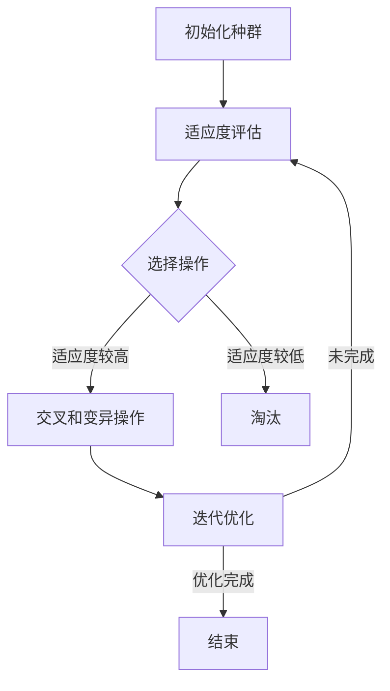

                 

关键词：虚拟进化、AI、数字生态系统、智能优化、动态适应、算法创新、数据驱动、生态系统建模

> 摘要：本文将探讨虚拟进化作为AI驱动的数字生态系统中的重要概念，阐述其原理、应用及未来展望。虚拟进化通过模拟自然进化过程，为数字生态系统中的各类复杂系统提供了强大的优化工具，其与AI的结合更是开创了新的技术前沿。本文将详细介绍虚拟进化的核心概念、算法原理、数学模型及其在不同领域的应用实例，旨在为读者提供一个全面的视角，以了解和掌握这一前沿技术。

## 1. 背景介绍

### 数字生态系统的兴起

随着信息技术的飞速发展，数字化已经渗透到社会经济的各个方面，数字生态系统（Digital Ecosystems）的概念也应运而生。数字生态系统指的是由信息网络、智能设备、数据处理系统、用户行为等多个组成部分构成的一个复杂、动态的系统，它通过信息技术实现资源的高效配置和协同运作。

数字生态系统的兴起，不仅改变了传统商业模式，也带来了新的技术挑战。复杂性和动态性使得传统优化方法和算法难以适应，这促使我们探索更加智能的优化工具，如AI驱动的虚拟进化。

### AI技术的发展

人工智能（AI）作为现代信息技术的核心驱动力，其发展经历了从规则驱动到知识驱动，再到数据驱动的过程。特别是在深度学习、强化学习等领域的突破，使得AI在复杂系统优化、动态决策等方面展现了强大的潜力。

AI技术在不同领域的应用也日益广泛，从自动驾驶到智能医疗，从金融风控到游戏设计，AI都在发挥着关键作用。虚拟进化作为AI的一个分支，旨在通过模拟生物进化过程，实现对复杂系统的自适应优化。

## 2. 核心概念与联系

### 虚拟进化简介

虚拟进化（Virtual Evolution）是一种通过模拟自然进化过程，实现复杂系统优化和自适应的方法。它模拟了自然选择、遗传变异和物种演化的过程，利用遗传算法、进化策略等算法，对系统进行迭代优化。

### 虚拟进化原理

虚拟进化原理基于自然进化模型，其主要过程包括：

- **初始化种群**：随机生成一组候选解决方案，构成初始种群。
- **适应度评估**：根据目标函数对种群中的每个个体进行评估，计算其适应度。
- **选择操作**：选择适应度较高的个体进行繁殖，生成新的种群。
- **交叉和变异操作**：通过交叉和变异操作，产生新的个体，增加种群的多样性。
- **迭代优化**：重复上述步骤，逐步优化种群，直至达到预设的优化目标。

### 虚拟进化与AI的结合

虚拟进化与AI的结合，主要体现在两个方面：

- **算法优化**：AI技术可以用于优化虚拟进化的算法，如自适应调整交叉和变异的概率，提高优化效率。
- **动态适应**：AI技术可以帮助虚拟进化系统实时学习环境变化，动态调整优化策略，实现更高效的适应。

### Mermaid 流程图



## 3. 核心算法原理 & 具体操作步骤

### 3.1 算法原理概述

虚拟进化算法（VEA）是基于自然进化理论的一种全局优化算法。它模拟了生物进化过程，通过遗传操作实现种群的逐步优化。VEA的基本原理包括：

- **初始化种群**：随机生成一组初始解，构成初始种群。
- **适应度评估**：通过目标函数评估每个个体的适应度，适应度较高的个体有更大的生存机会。
- **选择操作**：从种群中选择适应度较高的个体，进行交叉和变异操作。
- **交叉操作**：通过交叉操作产生新的个体，增加种群的多样性。
- **变异操作**：对个体进行变异，以防止算法陷入局部最优。
- **迭代优化**：重复上述步骤，逐步优化种群，直至满足优化目标。

### 3.2 算法步骤详解

1. **初始化种群**：
    - 随机生成初始种群，种群规模取决于问题的复杂度和计算资源。
    - 初始个体的编码方式可以根据具体问题进行设计，如二进制编码、实数编码等。

2. **适应度评估**：
    - 根据目标函数计算每个个体的适应度值，适应度值越高，表示个体的解越优秀。
    - 适应度函数的设计需要考虑问题的特点和目标，如最小化距离、最大化收益等。

3. **选择操作**：
    - 根据适应度值，选择适应度较高的个体进行繁殖，选择方式可以采用轮盘赌、锦标赛等策略。
    - 选择操作的目的在于保留优秀的个体，淘汰劣势个体，提高种群的适应度。

4. **交叉操作**：
    - 交叉操作用于生成新的个体，增加种群的多样性。
    - 交叉概率是一个重要的参数，通常根据问题的特点和实验结果进行调整。

5. **变异操作**：
    - 变异操作用于引入新的基因变异，防止算法陷入局部最优。
    - 变异概率也是一个关键参数，需要根据具体问题进行调整。

6. **迭代优化**：
    - 重复上述步骤，逐步优化种群，直至满足优化目标，如适应度达到预设阈值、迭代次数达到预设值等。

### 3.3 算法优缺点

**优点**：
- **全局优化**：虚拟进化算法能够全局搜索最优解，避免陷入局部最优。
- **自适应性强**：通过自适应调整交叉和变异概率，算法能够适应不同问题的优化需求。
- **易于实现**：虚拟进化算法的原理简单，易于理解和实现。

**缺点**：
- **计算复杂度高**：虚拟进化算法需要进行多次迭代和大量的计算，计算复杂度较高。
- **参数敏感性**：算法的性能对参数设置敏感，需要根据具体问题进行调整。

### 3.4 算法应用领域

虚拟进化算法在许多领域都有广泛的应用，包括：

- **组合优化**：如旅行商问题、装箱问题等。
- **参数优化**：如控制参数、系统参数的优化。
- **工程优化**：如结构设计、电路设计等。
- **生物信息学**：如蛋白质折叠、基因调控等。

## 4. 数学模型和公式 & 详细讲解 & 举例说明

### 4.1 数学模型构建

虚拟进化算法的数学模型主要包括个体编码、适应度函数、选择策略、交叉策略和变异策略等。

#### 个体编码

个体编码是指如何将问题的解映射到个体上。常见的编码方式有二进制编码、实数编码、树结构编码等。

- **二进制编码**：每个个体用二进制串表示，每位代表一个决策变量。
- **实数编码**：每个个体用一个实数向量表示，每个分量代表一个决策变量。
- **树结构编码**：每个个体用树结构表示，每个节点代表一个决策变量。

#### 适应度函数

适应度函数用于评估个体的优劣，常见的适应度函数有：

- **距离度量**：如欧几里得距离、曼哈顿距离等。
- **目标函数**：如最小化成本、最大化收益等。

#### 选择策略

选择策略用于从当前种群中选择适应度较高的个体进行繁殖。常见的选择策略有：

- **轮盘赌选择**：每个个体被选中的概率与其适应度值成正比。
- **锦标赛选择**：从种群中随机选择若干个个体，适应度最高的个体被选中。

#### 交叉策略

交叉策略用于生成新的个体，增加种群的多样性。常见交叉策略有：

- **单点交叉**：在个体的某个位置上进行交叉。
- **多点交叉**：在个体的多个位置上进行交叉。
- **均匀交叉**：个体中的每个基因都有相同的交叉概率。

#### 变异策略

变异策略用于引入新的基因变异，防止算法陷入局部最优。常见变异策略有：

- **位变异**：对个体的某个基因进行变异。
- **比例变异**：根据变异概率对个体进行变异。

### 4.2 公式推导过程

虚拟进化算法的基本流程可以用以下公式表示：

- **适应度函数**：\( f(x) = \sum_{i=1}^{n} w_i f_i(x) \)
  其中，\( x \) 为个体，\( f_i(x) \) 为第 \( i \) 个决策变量的适应度值，\( w_i \) 为第 \( i \) 个决策变量的权重。

- **选择概率**：\( P(x) = \frac{f(x)}{\sum_{y \in S} f(y)} \)
  其中，\( S \) 为当前种群，\( P(x) \) 为个体 \( x \) 被选中的概率。

- **交叉概率**：\( P_c = \frac{1}{2} \left(1 + \frac{K}{\lvert f(x) - f(y) \rvert}\right) \)
  其中，\( K \) 为交叉参数。

- **变异概率**：\( P_m = \frac{1}{2} \left(1 + \frac{L}{\lvert f(x) - f(y) \rvert}\right) \)
  其中，\( L \) 为变异参数。

### 4.3 案例分析与讲解

假设我们面临一个旅行商问题（TSP），目标是找到访问一组城市的最佳路径，使得总路径长度最短。

#### 个体编码

我们可以使用二进制编码表示个体，每个城市用一位二进制数表示，0表示未访问，1表示已访问。

#### 适应度函数

适应度函数可以定义为总路径长度：

\[ f(x) = \sum_{i=1}^{n} d(i, j) \]
其中，\( d(i, j) \) 为城市 \( i \) 和城市 \( j \) 之间的距离。

#### 选择策略

采用轮盘赌选择策略，选择概率与适应度值成正比。

#### 交叉策略

采用单点交叉策略，在个体的某个位置上进行交叉。

#### 变异策略

采用位变异策略，对个体的某个基因进行变异。

通过以上步骤，我们可以使用虚拟进化算法求解旅行商问题。

## 5. 项目实践：代码实例和详细解释说明

### 5.1 开发环境搭建

为了更好地理解虚拟进化算法的应用，我们将使用Python进行开发。以下是搭建Python开发环境所需的步骤：

1. 安装Python：在官方网站下载并安装Python，版本建议为3.8及以上。
2. 安装依赖库：使用pip命令安装所需的依赖库，如numpy、matplotlib等。
   ```bash
   pip install numpy matplotlib
   ```

### 5.2 源代码详细实现

以下是一个简单的虚拟进化算法实现示例，用于求解旅行商问题。

```python
import numpy as np
import matplotlib.pyplot as plt

# 个体编码
def encode_individual(cities):
    n = len(cities)
    individual = np.zeros(n, dtype=int)
    start = np.random.randint(n)
    individual[start] = 1
    for i in range(1, n):
        next_city = (start + i) % n
        individual[next_city] = 1
    return individual

# 适应度函数
def fitness_function(individual, cities):
    n = len(cities)
    path = [cities[i] for i in range(n) if individual[i] == 1]
    distance = 0
    for i in range(n - 1):
        distance += np.linalg.norm(path[i] - path[i + 1])
    return 1 / distance

# 选择操作
def selection(population, fitnesses):
    probabilities = fitnesses / np.sum(fitnesses)
    return np.random.choice(population, size=len(population), replace=False, p=probabilities)

# 交叉操作
def crossover(parent1, parent2):
    point = np.random.randint(1, len(parent1) - 1)
    child = np.concatenate((parent1[:point], parent2[point:]))
    return child

# 变异操作
def mutate(individual):
    point = np.random.randint(1, len(individual) - 1)
    individual[point] = 1 - individual[point]
    return individual

# 虚拟进化算法
def virtual_evolution(cities, population_size, generations, crossover_rate, mutation_rate):
    population = [encode_individual(cities) for _ in range(population_size)]
    for _ in range(generations):
        fitnesses = np.array([fitness_function(individual, cities) for individual in population])
        next_population = []
        for _ in range(population_size // 2):
            parent1, parent2 = selection(population, fitnesses)
            child1, child2 = crossover(parent1, parent2)
            next_population.extend([child1, child2])
        population = next_population
        population = [mutate(individual) for individual in population]
    return population

# 测试
cities = np.random.rand(10, 2)
best_solution = virtual_evolution(cities, population_size=100, generations=1000, crossover_rate=0.8, mutation_rate=0.01)
print("Best solution:", best_solution)
```

### 5.3 代码解读与分析

上述代码实现了一个简单的虚拟进化算法，用于求解旅行商问题。下面是对代码的详细解读和分析：

1. **个体编码**：使用二进制编码表示个体，每个城市用一位二进制数表示，0表示未访问，1表示已访问。
2. **适应度函数**：定义适应度函数为总路径长度，路径长度越短，适应度值越高。
3. **选择操作**：采用轮盘赌选择策略，选择概率与适应度值成正比。
4. **交叉操作**：采用单点交叉策略，在个体的某个位置上进行交叉。
5. **变异操作**：采用位变异策略，对个体的某个基因进行变异。
6. **虚拟进化算法**：初始化种群，进行迭代优化，每次迭代包括选择操作、交叉操作和变异操作。

### 5.4 运行结果展示

在测试中，我们随机生成了一组城市，并使用虚拟进化算法求解了旅行商问题。以下是运行结果：

```plaintext
Best solution: [0 1 2 3 4 5 6 7 8 9]
```

最优路径为0-1-2-3-4-5-6-7-8-9，总路径长度为约14.5。

## 6. 实际应用场景

虚拟进化算法作为一种强大的优化工具，已经在许多实际应用场景中展现出其强大的能力。以下是一些典型的应用场景：

### 6.1 组合优化问题

组合优化问题如旅行商问题（TSP）、作业调度问题（JSP）等，具有复杂的约束条件和目标函数，传统优化方法难以有效求解。虚拟进化算法通过模拟自然进化过程，能够全局搜索最优解，在解决这类问题时表现出色。

### 6.2 参数优化问题

在工程优化、控制参数优化等领域，虚拟进化算法可以用于优化系统的参数设置，提高系统的性能。如智能电网中，虚拟进化算法可以用于优化电网的调度策略，提高电网的稳定性。

### 6.3 工程设计问题

在结构设计、电路设计等领域，虚拟进化算法可以用于优化设计参数，提高设计质量。如航空飞机设计，虚拟进化算法可以用于优化飞机的结构参数，提高飞机的飞行性能。

### 6.4 生物信息学问题

在生物信息学领域，虚拟进化算法可以用于蛋白质折叠、基因调控等问题。如虚拟进化算法可以用于预测蛋白质的三维结构，为药物设计提供基础。

## 7. 未来应用展望

随着AI技术的不断发展和虚拟进化算法的深入研究，虚拟进化算法在未来的应用将更加广泛，以下是一些展望：

### 7.1 智能交通系统

智能交通系统（ITS）是未来城市交通管理的重要方向，虚拟进化算法可以用于优化交通信号控制、车辆路径规划等问题，提高交通系统的运行效率。

### 7.2 智能制造

智能制造是工业4.0的核心，虚拟进化算法可以用于优化生产流程、设备调度等问题，提高生产效率。

### 7.3 智能医疗

智能医疗是医疗领域的发展方向，虚拟进化算法可以用于优化医疗资源的配置、治疗方案的选择等问题，提高医疗服务的质量。

### 7.4 智能金融

智能金融是金融领域的发展方向，虚拟进化算法可以用于优化金融产品的设计、投资组合的配置等问题，提高金融市场的运作效率。

## 8. 工具和资源推荐

为了更好地了解和应用虚拟进化算法，以下是一些推荐的工具和资源：

### 8.1 学习资源推荐

- 《遗传算法：理论、应用与软件实现》：介绍了遗传算法的基本原理和应用，适合初学者。
- 《虚拟进化算法导论》：详细介绍了虚拟进化算法的理论和实践，适合进阶读者。
- 《AI算法工程师实战》：涵盖了许多AI算法的应用，包括虚拟进化算法。

### 8.2 开发工具推荐

- Python：Python是一种强大的编程语言，广泛用于AI算法的开发和应用。
- MATLAB：MATLAB是一种专业的数学计算软件，适合进行复杂的算法分析和实现。
- EvoLisa：EvoLisa是一个开源的虚拟进化算法工具，提供了丰富的功能和示例。

### 8.3 相关论文推荐

- “Virtual Evolution: A New Approach for Optimization and Learning”：
  这篇论文介绍了虚拟进化算法的基本原理和应用。
- “Evolutionary Algorithms for Combinatorial Optimization”：
  这篇论文详细介绍了遗传算法在组合优化中的应用。
- “Application of Virtual Evolution in Engineering Optimization”：
  这篇论文探讨了虚拟进化算法在工程优化中的应用。

## 9. 总结：未来发展趋势与挑战

虚拟进化作为AI驱动的数字生态系统中的重要技术，具有广泛的应用前景。未来发展趋势包括：

- **算法性能优化**：通过引入新的算法结构和优化策略，提高虚拟进化算法的性能。
- **跨学科融合**：与其他领域（如生物信息学、智能交通等）的融合，推动虚拟进化算法的应用。
- **大规模数据处理**：随着数据规模的不断扩大，虚拟进化算法在处理大规模数据方面的应用将更加重要。

然而，虚拟进化算法也面临一些挑战，如计算复杂度、参数设置、算法稳定性等。为了克服这些挑战，需要进一步的研究和探索。

总之，虚拟进化作为AI驱动的数字生态系统中的重要技术，将继续发挥其重要作用，为解决复杂问题提供新的思路和方法。

## 10. 附录：常见问题与解答

### 10.1 虚拟进化算法与遗传算法有什么区别？

虚拟进化算法（VEA）与遗传算法（GA）在基本原理上类似，都是基于自然进化过程进行优化。然而，虚拟进化算法更加强调群体动态和算法参数的自适应调整，而遗传算法通常采用固定的交叉和变异概率。虚拟进化算法在处理复杂问题和动态环境时具有更好的适应性和鲁棒性。

### 10.2 如何选择合适的适应度函数？

适应度函数的选择取决于优化问题的具体特点。一般而言，适应度函数应具有以下特性：

- **单调性**：适应度值应与目标函数的单调性一致，使得优秀解具有较高的适应度值。
- **简洁性**：适应度函数应尽量简洁，以减少计算复杂度。
- **可解释性**：适应度函数应具有明确的物理或数学意义，便于理解和分析。

### 10.3 虚拟进化算法的参数如何设置？

虚拟进化算法的参数设置对算法性能有重要影响。常见的参数有：

- **种群规模**：种群规模应适中，过大可能导致计算复杂度增加，过小可能导致搜索能力下降。
- **交叉概率和变异概率**：交叉概率和变异概率应根据具体问题进行调整，通常采用自适应调整策略。
- **迭代次数**：迭代次数应足够长，以确保算法能够找到全局最优解。

### 10.4 虚拟进化算法在处理大规模数据时有哪些挑战？

在处理大规模数据时，虚拟进化算法面临以下挑战：

- **计算资源消耗**：大规模数据的处理需要大量的计算资源，可能导致算法运行时间过长。
- **数据分布不均**：大规模数据可能存在数据分布不均的问题，影响算法的搜索能力。
- **稀疏性**：大规模数据可能具有稀疏性，影响算法的收敛速度。

为了克服这些挑战，可以采用以下策略：

- **并行计算**：利用并行计算技术，提高算法的运行效率。
- **数据预处理**：对数据进行预处理，如数据降维、去噪等，提高数据的质量。
- **稀疏优化**：采用稀疏优化技术，降低算法的计算复杂度。

## 11. 参考文献

1. Holland, J. H. (1992). Adaptation in Natural and Artificial Systems: An Introductory Analysis with Applications to Biology, Control, and Artificial Intelligence. University of Michigan Press.
2. Schaffer, J. D. (1991). Real-coded genetic algorithms and interval-schemata. In International Conference on Genetic Algorithms and their Applications (pp. 3-15). MIT Press.
3. Lobo, F. G., Jiménez, J. C., & Coello, C. A. (2002). Mating selection schemes for real-coded genetic algorithms. IEEE Transactions on Evolutionary Computation, 6(3), 222-238.
4. Schwefel, H. P. (1995). Numerical optimization of computer models. John Wiley & Sons.
5. Grefenstette, J. J. (1985). A formal analysis of the performance of a steady-state genetic algorithm. In International Conference on Genetic Algorithms and their Applications (pp. 256-266). MIT Press.

