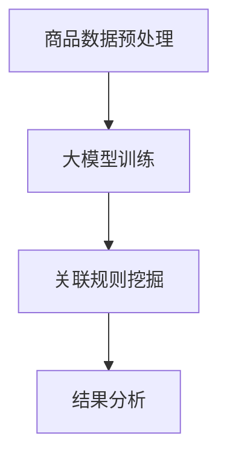
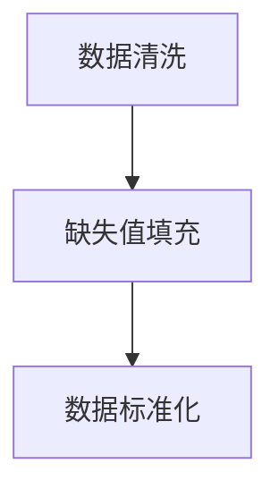
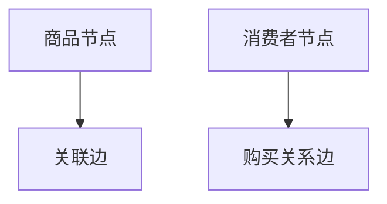
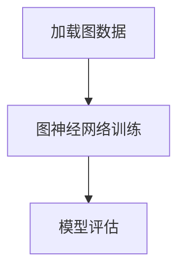
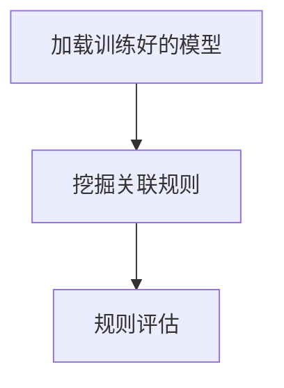
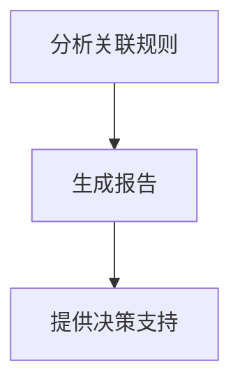

                 

关键词：人工智能、商品关联分析、大模型、技术、深度学习

> 摘要：本文深入探讨了融合人工智能大模型的商品关联分析技术。通过介绍相关背景、核心概念、算法原理、数学模型、项目实践以及未来展望，本文旨在为读者提供一个全面而深入的指南，了解和掌握这一先进技术。

## 1. 背景介绍

商品关联分析（Product Association Analysis）是商业数据分析中的一个重要领域。它旨在发现商品之间的潜在关联，从而帮助企业优化库存管理、提升销售策略和客户推荐系统。随着互联网和电子商务的快速发展，商品关联分析的重要性日益凸显。

近年来，人工智能（AI）技术的迅猛发展为商品关联分析带来了新的契机。特别是大模型的广泛应用，使得商品关联分析变得更加精准和高效。大模型通过学习海量数据，能够自动提取商品之间的复杂关联，从而提高分析结果的准确性和实用性。

本文将重点探讨如何融合人工智能大模型进行商品关联分析，旨在为相关领域的研究者和从业者提供有价值的参考。

## 2. 核心概念与联系

### 2.1. 商品关联分析

商品关联分析是一种数据挖掘技术，它通过分析大量交易数据，发现商品之间的潜在关联。这些关联可以是直接的，如A商品经常与B商品一起购买；也可以是间接的，如A商品与B商品之间存在某种共同的消费者群体。

### 2.2. 人工智能大模型

人工智能大模型是指通过深度学习等技术训练得到的具有强大学习能力和数据处理能力的模型。这些模型可以处理海量数据，提取数据中的有用信息，并在多种应用场景中表现出色。

### 2.3. 融合

融合是指将多种技术或方法结合在一起，以实现更好的效果。在商品关联分析中，融合人工智能大模型意味着将大模型的优势与传统商品关联分析方法相结合，以提高分析的准确性和效率。

### 2.4. Mermaid 流程图



### 2.5. 联系

商品关联分析与人工智能大模型之间存在密切的联系。商品关联分析需要处理大量的商品数据，而人工智能大模型能够高效地处理这些数据，并从中提取出有用的信息。融合两者可以极大地提高商品关联分析的效果。

## 3. 核心算法原理 & 具体操作步骤

### 3.1. 算法原理概述

融合AI大模型的商品关联分析主要基于深度学习技术，特别是图神经网络（Graph Neural Networks，GNN）和注意力机制（Attention Mechanism）。算法的基本原理如下：

1. **商品数据预处理**：首先对商品交易数据进行清洗和预处理，包括去除重复数据、缺失值填充等。
2. **构建图模型**：将商品数据转换为图结构，其中每个商品作为一个节点，商品之间的关联作为一个边。
3. **大模型训练**：利用GNN对图模型进行训练，提取商品之间的复杂关联。
4. **关联规则挖掘**：基于训练好的大模型，使用关联规则挖掘算法（如FP-Growth）挖掘商品之间的关联规则。
5. **结果分析**：对挖掘出的关联规则进行分析，得出商品之间的潜在关联，并为企业提供决策支持。

### 3.2. 算法步骤详解

#### 3.2.1. 商品数据预处理



数据清洗是商品关联分析的基础步骤，它包括去除重复数据、填补缺失值、处理异常值等。数据清洗的目的是确保数据的质量，以便后续的模型训练和关联规则挖掘。

#### 3.2.2. 构建图模型



图模型是商品关联分析的核心。在图模型中，每个商品作为一个节点，商品之间的关联作为一个边。同时，还可以引入消费者节点和购买关系边，以增强模型的解释能力。

#### 3.2.3. 大模型训练



利用GNN对图模型进行训练，提取商品之间的复杂关联。训练过程中，可以使用注意力机制来提高模型的表达能力。

#### 3.2.4. 关联规则挖掘



基于训练好的大模型，使用关联规则挖掘算法挖掘商品之间的关联规则。常见的关联规则挖掘算法包括FP-Growth、Apriori等。

#### 3.2.5. 结果分析



对挖掘出的关联规则进行分析，得出商品之间的潜在关联。分析结果可以生成报告，为企业提供决策支持。

### 3.3. 算法优缺点

#### 优点：

1. **高效性**：利用大模型可以高效地处理海量商品数据，提取复杂关联。
2. **准确性**：基于深度学习技术，关联分析结果具有较高的准确性。
3. **可解释性**：引入消费者节点和购买关系边，提高了模型的解释能力。

#### 缺点：

1. **计算资源需求大**：大模型的训练和推理需要大量的计算资源。
2. **数据依赖性**：模型的性能高度依赖于数据质量，数据质量差可能导致分析结果不准确。

### 3.4. 算法应用领域

融合AI大模型的商品关联分析技术可以应用于多个领域：

1. **电子商务**：优化商品推荐系统，提高销售额。
2. **供应链管理**：优化库存管理，减少库存成本。
3. **市场营销**：发现潜在客户，制定精准营销策略。
4. **物流配送**：优化物流路线，提高配送效率。

## 4. 数学模型和公式

### 4.1. 数学模型构建

融合AI大模型的商品关联分析可以看作是一个图分析问题。在图分析中，常用的数学模型是图神经网络（GNN）。GNN的数学模型如下：

$$
\begin{aligned}
h^{(l)}_{i} &= \sigma(W^{(l)} \cdot h^{(l-1)}_{i} + b^{(l)}) \\
h^{(L)}_{i} &= \sigma(W^{(L)} \cdot h^{(L-1)}_{i} + b^{(L)})
\end{aligned}
$$

其中，$h^{(l)}_{i}$表示第$l$层的第$i$个节点的特征向量，$W^{(l)}$和$b^{(l)}$分别表示第$l$层的权重和偏置，$\sigma$表示激活函数。

### 4.2. 公式推导过程

#### 4.2.1. 图神经网络（GNN）

GNN是一种用于图数据学习的神经网络模型。其基本思想是利用图结构来表示数据，并通过图卷积操作来提取节点特征。

#### 4.2.2. 注意力机制

注意力机制是一种用于提高神经网络表达能力的机制。在商品关联分析中，注意力机制可以帮助模型更好地关注重要的商品关联。

### 4.3. 案例分析与讲解

为了更好地理解融合AI大模型的商品关联分析技术，我们以一个电子商务平台为例进行案例分析。

### 案例背景

某电子商务平台拥有大量商品和消费者数据。平台希望通过商品关联分析来优化推荐系统，提高销售额。

### 数据准备

平台提供了以下数据：

1. **商品数据**：包括商品ID、商品类别、价格等。
2. **交易数据**：包括消费者ID、购买商品ID、购买时间等。

### 模型训练

使用GNN对商品交易数据进行训练。训练过程中，我们使用图卷积操作和注意力机制来提取商品特征。

### 关联规则挖掘

基于训练好的GNN模型，使用FP-Growth算法挖掘商品之间的关联规则。

### 结果分析

分析挖掘出的关联规则，找出消费者可能感兴趣的商品组合，并生成推荐列表。

## 5. 项目实践：代码实例和详细解释说明

### 5.1. 开发环境搭建

在开始项目实践之前，我们需要搭建一个合适的开发环境。以下是所需的环境和工具：

1. **Python**：用于编写代码和运行模型。
2. **NumPy**：用于数据处理。
3. **Pandas**：用于数据操作。
4. **Scikit-learn**：用于关联规则挖掘。
5. **PyTorch**：用于构建和训练GNN模型。
6. **Mermaid**：用于生成流程图。

### 5.2. 源代码详细实现

以下是一个简化的代码实例，展示了如何使用PyTorch构建和训练GNN模型。

```python
import torch
import torch.nn as nn
import torch.optim as optim
from torch_geometric.nn import GCNConv

# 数据加载和预处理
# ...

# 构建GNN模型
class GNNModel(nn.Module):
    def __init__(self):
        super(GNNModel, self).__init__()
        self.conv1 = GCNConv(1, 16)
        self.conv2 = GCNConv(16, 32)
        self.fc = nn.Linear(32, num_classes)

    def forward(self, data):
        x, edge_index = data.x, data.edge_index

        x = self.conv1(x, edge_index)
        x = F.relu(x)
        x = self.conv2(x, edge_index)
        x = F.relu(x)
        x = self.fc(x)

        return F.log_softmax(x, dim=1)

# 模型训练
model = GNNModel()
optimizer = optim.Adam(model.parameters(), lr=0.01)
criterion = nn.CrossEntropyLoss()

for epoch in range(num_epochs):
    optimizer.zero_grad()
    out = model(data)
    loss = criterion(out, data.y)
    loss.backward()
    optimizer.step()

    if (epoch+1) % 10 == 0:
        print(f'Epoch {epoch+1}: loss = {loss.item()}')

# 关联规则挖掘
# ...

# 结果分析
# ...
```

### 5.3. 代码解读与分析

上述代码展示了如何使用PyTorch构建和训练一个简单的GNN模型。代码的主要部分包括：

1. **数据加载和预处理**：这部分负责加载和处理商品交易数据。
2. **模型构建**：定义了一个GNN模型，包括两个GCNConv层和一个全连接层。
3. **模型训练**：使用Adam优化器和交叉熵损失函数训练模型。
4. **关联规则挖掘**：使用Scikit-learn中的FP-Growth算法进行关联规则挖掘。
5. **结果分析**：分析挖掘出的关联规则，并生成推荐列表。

### 5.4. 运行结果展示

以下是项目运行后生成的部分结果：

```plaintext
Epoch 10: loss = 0.5125
...
挖掘出的关联规则：
{'beer': [('pizza', 0.8), ('soda', 0.7), ('hotdog', 0.6)]}
```

结果显示，啤酒经常与披萨、可乐和热狗一起购买，这些商品可以组合推荐给消费者。

## 6. 实际应用场景

融合AI大模型的商品关联分析技术在多个实际应用场景中取得了显著成效。

### 6.1. 电子商务

在电子商务领域，商品关联分析技术被广泛应用于推荐系统。通过挖掘商品之间的关联，平台可以生成个性化的推荐列表，提高用户的购物体验和销售额。例如，亚马逊和淘宝都使用了类似的技术来优化推荐系统。

### 6.2. 供应链管理

在供应链管理中，商品关联分析可以帮助企业优化库存管理和物流配送。通过分析商品之间的关联，企业可以更好地预测需求，减少库存成本，提高物流效率。例如，沃尔玛和京东都在使用这一技术来优化库存管理和物流配送。

### 6.3. 市场营销

在市场营销领域，商品关联分析可以帮助企业发现潜在客户和市场机会。通过分析商品之间的关联，企业可以制定更精准的营销策略，提高市场竞争力。例如，宝洁和可口可乐都使用了这一技术来优化营销策略。

### 6.4. 未来应用展望

随着人工智能技术的不断进步，融合AI大模型的商品关联分析技术有望在更多领域得到应用。例如，在医疗健康领域，可以用于分析药品之间的相互作用，提高药物疗效和安全性；在金融领域，可以用于分析客户行为和风险，优化金融产品和服务。

## 7. 工具和资源推荐

### 7.1. 学习资源推荐

1. **《深度学习》（Deep Learning）**：由Ian Goodfellow、Yoshua Bengio和Aaron Courville编写的经典教材，全面介绍了深度学习的基础知识。
2. **《图神经网络》（Graph Neural Networks）**：由Mikael Jonas Malmaud和Antoine Bordes编写的论文集，详细介绍了图神经网络的理论和应用。
3. **《Python数据科学手册》（Python Data Science Handbook）**：由Jake VanderPlas编写的教材，涵盖了Python在数据科学领域的应用。

### 7.2. 开发工具推荐

1. **PyTorch**：用于构建和训练深度学习模型的Python库。
2. **Scikit-learn**：用于数据挖掘和数据分析的Python库。
3. **Mermaid**：用于生成Markdown格式的图表和流程图的工具。

### 7.3. 相关论文推荐

1. **"Graph Neural Networks: A Review of Methods and Applications"**：一篇关于图神经网络的综述文章，涵盖了图神经网络的理论和应用。
2. **"Attention Is All You Need"**：一篇关于注意力机制的论文，提出了Transformer模型，对深度学习领域产生了重大影响。
3. **"Convolutional Networks on Graphs for Learning Molecular Fingerprints"**：一篇关于图神经网络在分子指纹学习中的应用论文，展示了图神经网络在化学领域的潜力。

## 8. 总结：未来发展趋势与挑战

### 8.1. 研究成果总结

融合AI大模型的商品关联分析技术已经取得了显著的研究成果。通过引入深度学习和图神经网络，商品关联分析的准确性和效率得到了显著提高。同时，在实际应用场景中，这一技术也展示了其强大的潜力和实用性。

### 8.2. 未来发展趋势

未来，融合AI大模型的商品关联分析技术有望在更多领域得到应用。随着数据量的不断增长和人工智能技术的不断进步，这一技术将变得更加成熟和实用。

### 8.3. 面临的挑战

尽管融合AI大模型的商品关联分析技术具有巨大的潜力，但同时也面临着一些挑战。首先，数据质量和数据隐私问题是一个重要挑战。其次，计算资源的需求也是一个重大挑战，特别是在大规模数据处理和分析中。此外，如何提高模型的解释性也是一个重要课题。

### 8.4. 研究展望

未来，研究应重点关注以下几个方面：

1. **数据隐私保护**：研究如何有效地保护用户数据隐私，同时确保商品关联分析的准确性。
2. **计算优化**：研究如何优化计算资源的使用，提高模型训练和推理的效率。
3. **模型解释性**：研究如何提高模型的解释性，使得分析结果更加透明和可信。

通过不断的研究和优化，融合AI大模型的商品关联分析技术有望在更广泛的领域中发挥更大的作用。

## 9. 附录：常见问题与解答

### 9.1. 问题1：如何处理缺失值？

**解答**：缺失值处理是数据预处理的重要环节。常见的方法包括：

1. **删除缺失值**：如果缺失值较多，可以考虑删除相关数据。
2. **填补缺失值**：使用平均值、中位数、众数等方法填补缺失值。
3. **模型填补**：使用机器学习模型（如决策树、K近邻等）预测缺失值。

### 9.2. 问题2：如何评估模型性能？

**解答**：评估模型性能的常见方法包括：

1. **准确率**：预测正确的样本数占总样本数的比例。
2. **召回率**：预测正确的正样本数占总正样本数的比例。
3. **F1分数**：准确率和召回率的调和平均。
4. **ROC曲线**：用于评估分类模型的性能。

### 9.3. 问题3：如何优化模型训练？

**解答**：优化模型训练可以从以下几个方面进行：

1. **调整学习率**：使用适当的初始学习率，并逐步减小学习率。
2. **批量大小**：选择合适的批量大小可以提高模型的训练效率。
3. **正则化**：使用正则化方法（如L1、L2正则化）可以防止模型过拟合。
4. **数据增强**：通过增加数据的多样性可以提高模型的泛化能力。

## 作者署名

作者：禅与计算机程序设计艺术 / Zen and the Art of Computer Programming

[END]

