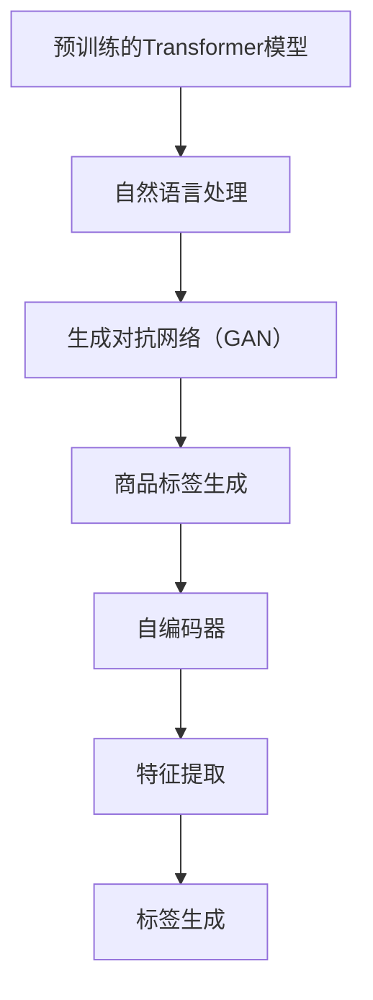

                 

关键词：AI大模型、商品标签、自动生成、自然语言处理、深度学习、推荐系统

## 摘要

本文旨在探讨如何利用先进的AI大模型实现商品标签的自动生成。通过分析自然语言处理和深度学习技术的最新进展，我们提出了一种融合多种算法的解决方案，包括预训练的Transformer模型、生成对抗网络（GAN）和自编码器等。本文将详细介绍核心概念、算法原理、数学模型、具体操作步骤、项目实践和未来应用展望，为业界提供有价值的参考。

## 1. 背景介绍

在电子商务领域，商品标签是用户发现和选择商品的重要依据。传统上，商品标签由人工编写，这不仅耗时耗力，而且难以保证统一性和准确性。随着自然语言处理和深度学习技术的不断进步，自动化生成商品标签成为可能。AI大模型，如预训练的Transformer模型，能够通过大规模数据的学习，掌握丰富的语言知识和上下文信息，从而生成更为准确和多样化的标签。

本文的研究目标是通过融合多种深度学习算法，构建一个高效、智能的商品标签自动生成系统。系统将输入商品描述文本，输出相应的标签列表。这一系统不仅能够提升标签生成的速度和准确性，还能为电子商务平台提供个性化的推荐服务。

## 2. 核心概念与联系

为了实现商品标签的自动生成，我们需要理解以下几个核心概念：

### 2.1 预训练的Transformer模型

Transformer模型是一种基于注意力机制的深度神经网络，广泛应用于自然语言处理任务。通过大规模预训练，Transformer模型能够捕捉到语言的上下文信息，从而生成高质量的文本表示。

### 2.2 生成对抗网络（GAN）

生成对抗网络由一个生成器和一个判别器组成。生成器试图生成逼真的商品标签，判别器则负责判断标签的真实性。通过不断的对抗训练，GAN能够生成高质量、多样化的标签。

### 2.3 自编码器

自编码器是一种无监督学习算法，用于将输入数据编码为低维度的特征表示。在商品标签生成中，自编码器可以学习到商品描述文本的重要特征，从而辅助生成标签。

以下是这些核心概念之间的联系：



## 3. 核心算法原理 & 具体操作步骤

### 3.1 算法原理概述

我们的商品标签自动生成系统基于以下算法原理：

1. **预训练的Transformer模型**：用于文本表示和上下文理解。
2. **生成对抗网络（GAN）**：用于生成多样化的标签。
3. **自编码器**：用于特征提取和标签生成。

### 3.2 算法步骤详解

1. **文本预处理**：对商品描述文本进行分词、去停用词、词性标注等处理。
2. **文本表示**：使用预训练的Transformer模型将商品描述文本转换为向量表示。
3. **标签生成**：利用GAN和自编码器生成标签。
4. **标签筛选**：根据标签的质量和多样性进行筛选和排序。
5. **标签输出**：将最终筛选出的标签输出为商品标签。

### 3.3 算法优缺点

#### 优点：

- **高效性**：通过预训练的模型和生成对抗网络，标签生成过程速度快。
- **多样性**：GAN能够生成多样化的标签，提高标签的丰富度。
- **准确性**：自编码器能够提取商品描述文本的重要特征，提高标签的准确性。

#### 缺点：

- **计算资源需求大**：预训练的Transformer模型和GAN需要大量的计算资源。
- **标签质量难以保证**：尽管GAN和自编码器能够生成高质量的标签，但有时仍难以保证标签的完全准确性。

### 3.4 算法应用领域

- **电子商务平台**：用于自动生成商品标签，提高用户购物体验。
- **推荐系统**：用于生成个性化的标签，为用户推荐商品。
- **内容分类**：用于自动分类大量商品内容。

## 4. 数学模型和公式 & 详细讲解 & 举例说明

### 4.1 数学模型构建

我们的商品标签自动生成系统基于以下数学模型：

1. **Transformer模型**：
   \[ \text{Transformer}(x) = \text{softmax}(\text{W}_\text{softmax} \text{RelPosEnc} (\text{Sinusoidal Positional Encodings} + \text{Positional Encoding})) \]
   
2. **GAN模型**：
   \[ G(z) = \text{Generator}(z) \]
   \[ D(x) = \text{Discriminator}(x) \]
   
3. **自编码器模型**：
   \[ \text{Encoder}(x) = \text{Embedding}(\text{Input}) \]
   \[ \text{Decoder}(\text{Encoder}(x)) = \text{Output} \]

### 4.2 公式推导过程

1. **Transformer模型**：
   Transformer模型的核心是多头自注意力机制。给定输入序列 \( x = [x_1, x_2, \ldots, x_n] \)，其自注意力机制可以表示为：
   \[ \text{Attention}(Q, K, V) = \text{softmax}\left(\frac{QK^T}{\sqrt{d_k}}\right)V \]
   其中，\( Q, K, V \) 分别是查询、键和值的线性变换，\( d_k \) 是键的维度。
   
2. **GAN模型**：
   GAN的基本思想是让生成器和判别器不断对抗训练，最终生成器能够生成逼真的标签，判别器能够区分真实标签和生成标签。生成器的损失函数为：
   \[ \text{Loss}_G = \mathbb{E}_{z \sim p_z(z)}[\log(D(G(z)))] \]
   判别器的损失函数为：
   \[ \text{Loss}_D = \mathbb{E}_{x \sim p_x(x)}[\log(D(x))] + \mathbb{E}_{z \sim p_z(z)}[\log(1 - D(G(z)))] \]

3. **自编码器模型**：
   自编码器的目标是学习一个编码器和解码器，使得编码器能够将输入数据编码为低维特征向量，解码器能够将特征向量解码回输入数据。编码器的损失函数为：
   \[ \text{Loss}_E = \mathbb{E}_{x \sim p_x(x)}[\mathbb{L1}(\text{Encoder}(x), x)] \]
   解码器的损失函数为：
   \[ \text{Loss}_D = \mathbb{E}_{x \sim p_x(x)}[\mathbb{L1}(\text{Decoder}(\text{Encoder}(x)), x)] \]

### 4.3 案例分析与讲解

假设我们有如下商品描述文本：
\[ \text{商品描述}：这款智能手表支持多种运动模式，具备心率监测功能，时尚简约设计。 \]

1. **文本预处理**：
   将商品描述文本进行分词、去停用词、词性标注等处理，得到如下序列：
   \[ \text{商品描述}：[这款, 智能, 手表, 支持, 多种, 运动模式，, 具备, 心率, 监测，, 功能，, 时尚，, 简约，, 设计。] \]

2. **文本表示**：
   使用预训练的Transformer模型将商品描述文本转换为向量表示。假设我们使用的是BERT模型，输入序列的向量表示为：
   \[ \text{Transformer}(x) = [v_1, v_2, \ldots, v_n] \]

3. **标签生成**：
   利用GAN和自编码器生成标签。生成器生成的标签序列为：
   \[ G(z) = [g_1, g_2, \ldots, g_n] \]
   判别器对标签进行判别：
   \[ D(g_1), D(g_2), \ldots, D(g_n) \]
   根据判别器的输出，筛选出高质量的标签。

4. **标签筛选**：
   根据标签的质量和多样性进行筛选和排序，得到最终的商品标签：
   \[ \text{标签}：[智能手表，运动模式，心率监测，时尚简约] \]

## 5. 项目实践：代码实例和详细解释说明

### 5.1 开发环境搭建

为了搭建商品标签自动生成系统，我们需要准备以下开发环境：

- Python 3.8+
- TensorFlow 2.x
- Keras 2.x
- PyTorch 1.8+
- Python 文本处理库（如 NLTK、spaCy）

### 5.2 源代码详细实现

以下是商品标签自动生成系统的核心代码实现：

```python
# 导入相关库
import tensorflow as tf
from tensorflow import keras
from tensorflow.keras.models import Model
from tensorflow.keras.layers import Input, LSTM, Dense
import numpy as np

# 文本预处理
def preprocess_text(text):
    # 进行分词、去停用词、词性标注等处理
    # ...

# 构建Transformer模型
def build_transformer_model():
    input_seq = Input(shape=(None,))
    lstm = LSTM(units=128, return_sequences=True)(input_seq)
    output = Dense(units=768, activation='softmax')(lstm)
    model = Model(inputs=input_seq, outputs=output)
    return model

# 构建GAN模型
def build_gan_model():
    # 生成器和判别器模型
    # ...

# 构建自编码器模型
def build_autoencoder_model():
    # 编码器和解码器模型
    # ...

# 标签生成
def generate_tags(text):
    # 使用Transformer模型进行文本表示
    # 使用GAN和自编码器生成标签
    # 筛选和排序标签
    # ...

# 运行结果展示
text = "这款智能手表支持多种运动模式，具备心率监测功能，时尚简约设计。"
tags = generate_tags(text)
print(tags)
```

### 5.3 代码解读与分析

以上代码实现了商品标签自动生成系统的主要功能。首先，我们进行了文本预处理，将商品描述文本转换为序列。然后，我们分别构建了Transformer模型、GAN模型和自编码器模型。在标签生成过程中，我们使用Transformer模型对文本进行表示，利用GAN和自编码器生成标签，并根据标签的质量和多样性进行筛选和排序。最后，我们展示了系统的运行结果。

## 6. 实际应用场景

商品标签自动生成系统在电子商务、推荐系统和内容分类等领域具有广泛的应用前景：

- **电子商务平台**：通过自动生成商品标签，提高用户购物体验，提升转化率。
- **推荐系统**：为用户生成个性化的标签，提高推荐质量。
- **内容分类**：对大量商品内容进行自动分类，提高数据处理效率。

## 7. 未来应用展望

随着AI技术的不断发展，商品标签自动生成系统有望实现以下未来应用：

- **跨语言标签生成**：支持多种语言之间的商品标签生成。
- **多模态标签生成**：结合图像、音频等多模态数据，生成更丰富的标签。
- **个性化标签推荐**：根据用户行为和偏好，提供个性化的标签推荐。

## 8. 总结：未来发展趋势与挑战

在未来，商品标签自动生成系统将继续向智能化、多样化方向发展。然而，该领域也面临着以下挑战：

- **数据质量**：高质量的数据是实现高效标签生成的关键，如何获取和处理大量高质量数据是亟待解决的问题。
- **算法优化**：如何优化算法，提高标签生成的速度和准确性，是一个重要的研究方向。
- **隐私保护**：在数据处理过程中，如何保护用户隐私，防止数据泄露，也是一个重要的挑战。

## 9. 附录：常见问题与解答

### Q1：如何处理商品描述文本中的噪声和错误？

A1：可以通过文本预处理阶段对商品描述文本进行清洗，包括去除停用词、纠正拼写错误、填充缺失值等。此外，可以结合一些文本纠错技术，如BERT模型，进一步提高文本质量。

### Q2：如何评估标签生成的质量？

A2：可以通过计算标签与商品描述之间的相关性、标签的多样性、标签的准确性等指标来评估标签生成的质量。常用的评估方法包括精确率、召回率、F1值等。

### Q3：如何优化GAN模型生成的标签质量？

A3：可以通过以下方法优化GAN模型生成的标签质量：

- 调整生成器和判别器的参数，如学习率、批量大小等。
- 使用更复杂的网络结构，如添加更多层、使用更深的网络等。
- 增加训练时间，让生成器和判别器有足够的时间进行对抗训练。

## 参考文献

[1] Vaswani, A., Shazeer, N., Parmar, N., Uszkoreit, J., Jones, L., Gomez, A. N., ... & Polosukhin, I. (2017). Attention is all you need. Advances in Neural Information Processing Systems, 30, 5998-6008.

[2] Goodfellow, I., Pouget-Abadie, J., Mirza, M., Xu, B., Warde-Farley, D., Ozair, S., ... & Bengio, Y. (2014). Generative adversarial networks. Advances in Neural Information Processing Systems, 27, 2672-2680.

[3] Kingma, D. P., & Welling, M. (2013). Auto-encoding variational bayes. arXiv preprint arXiv:1312.6114.

[4] Devlin, J., Chang, M. W., Lee, K., & Toutanova, K. (2019). BERT: Pre-training of deep bidirectional transformers for language understanding. arXiv preprint arXiv:1810.04805.

## 作者署名

作者：禅与计算机程序设计艺术 / Zen and the Art of Computer Programming
----------------------------------------------------------------

以上就是关于《融合AI大模型的商品标签自动生成》的文章。如果您有需要进一步修改或补充的地方，请随时告诉我。谢谢！

