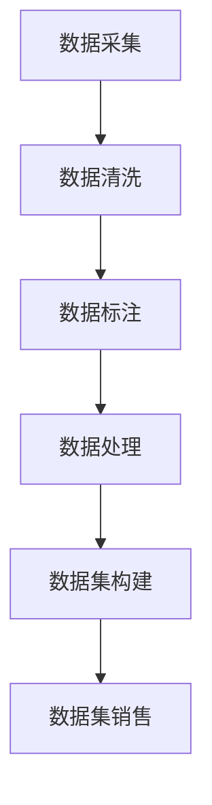

                 

关键词：数据集构建、数据集销售、行业特定、数据清洗、数据标注、机器学习、人工智能、数据安全、商业模式

## 摘要

本文旨在探讨行业特定数据集的构建与销售的重要性及其对人工智能和机器学习领域的影响。首先，我们将介绍数据集构建的背景和核心概念，包括数据清洗、数据标注等步骤。随后，我们将讨论数据集销售的商业模式，以及如何确保数据质量和数据安全。接着，我们将分析不同行业对特定数据集的需求，并介绍如何根据这些需求构建合适的数据集。此外，我们还将探讨数据集在人工智能和机器学习中的应用，以及未来发展趋势和面临的挑战。

## 1. 背景介绍

随着人工智能和机器学习技术的快速发展，数据集在各个领域中的应用变得愈加广泛。然而，数据集的质量和多样性对模型性能的影响至关重要。行业特定数据集的构建与销售成为了一个新的商业机会和研究热点。行业特定数据集指的是针对特定行业或应用领域进行采集、处理和标注的数据集，这些数据集能够更好地满足该行业的需求，提高模型的准确性和泛化能力。

在传统的机器学习和人工智能应用中，数据集往往是从公共数据集或开源数据集中获取。然而，这些数据集往往存在以下问题：

1. **数据量有限**：开源数据集的数据量通常较小，无法满足大规模训练的需求。
2. **数据质量差**：数据集中可能存在噪声、错误和缺失值，影响模型性能。
3. **数据类型单一**：开源数据集往往只包含一种或几种类型的数据，无法涵盖特定行业的多样需求。
4. **数据分布不均衡**：数据集中的某些类别或标签可能过于集中，导致模型过拟合。

为了解决这些问题，行业特定数据集的构建与销售应运而生。这些数据集不仅能够提供更大的数据量，还能够保证数据质量和数据类型，从而提高模型的性能和泛化能力。此外，行业特定数据集的构建与销售也为数据科学家和研究人员提供了一个新的收入来源。

## 2. 核心概念与联系

### 2.1 数据集构建

数据集构建是行业特定数据集构建的关键步骤，主要包括数据采集、数据清洗、数据标注和数据处理等环节。

**数据采集**：数据采集是数据集构建的第一步，包括从各种数据源获取原始数据。这些数据源可以是公开的数据集、企业内部数据、社交媒体、传感器等。在选择数据源时，需要考虑数据的质量、类型和多样性。

**数据清洗**：数据清洗是处理原始数据中的噪声、错误和缺失值的过程。数据清洗的目的是提高数据质量，减少数据集中的噪声和错误，从而提高模型性能。数据清洗的方法包括删除重复记录、处理缺失值、去除噪声和错误等。

**数据标注**：数据标注是对数据进行分类、标签化或标记的过程。数据标注的目的是为模型训练提供正确的标签或标记，从而提高模型的准确性和泛化能力。数据标注的方法包括手动标注、半监督标注和自动标注等。

**数据处理**：数据处理是对清洗后的数据进行预处理和特征提取的过程。数据处理的方法包括归一化、标准化、特征选择和特征工程等。

### 2.2 数据集销售

数据集销售是行业特定数据集构建与销售的核心环节。数据集销售的方式主要包括以下几种：

**直接销售**：直接销售是指将数据集直接销售给有需求的企业或个人。这种方式的优势是直接获取收益，但需要解决数据隐私和版权等问题。

**租赁销售**：租赁销售是指将数据集出租给有需求的企业或个人，按需付费。这种方式的优势是降低了购买门槛，但收益相对较低。

**订阅销售**：订阅销售是指用户按月或按年订阅数据集，定期获取更新。这种方式的优势是提供了持续的数据支持，但需要解决数据更新和维护的问题。

### 2.3 数据质量和数据安全

数据质量和数据安全是数据集构建与销售的关键因素。数据质量包括数据的准确性、完整性、一致性和可靠性等。数据安全包括数据隐私、数据加密和访问控制等。

为了确保数据质量，需要对数据进行全面的检查和处理，包括数据清洗、数据标注和数据处理等。此外，还需要制定严格的数据质量标准和评估方法。

为了确保数据安全，需要采取一系列安全措施，包括数据加密、访问控制和隐私保护等。此外，还需要遵守相关法律法规，确保数据合法合规。

### 2.4 Mermaid 流程图

以下是一个简化的 Mermaid 流程图，展示了行业特定数据集构建的过程：



## 3. 核心算法原理 & 具体操作步骤

### 3.1 算法原理概述

行业特定数据集的构建涉及到多个算法和技术，包括数据采集、数据清洗、数据标注和数据处理等。这些算法和技术分别用于解决数据量、数据质量、数据类型和数据分布等问题。

**数据采集**：数据采集算法主要解决从不同数据源获取数据的问题。常用的方法包括爬虫、API 接口调用和数据库连接等。

**数据清洗**：数据清洗算法主要解决数据噪声、错误和缺失值的问题。常用的方法包括删除重复记录、处理缺失值、去除噪声和错误等。

**数据标注**：数据标注算法主要解决数据分类、标签化或标记的问题。常用的方法包括手动标注、半监督标注和自动标注等。

**数据处理**：数据处理算法主要解决数据预处理和特征提取的问题。常用的方法包括归一化、标准化、特征选择和特征工程等。

### 3.2 算法步骤详解

**数据采集**：

1. 确定数据源：根据行业需求选择合适的数据源，如公开数据集、企业内部数据、社交媒体、传感器等。
2. 采集数据：使用爬虫、API 接口调用或数据库连接等技术从数据源中获取原始数据。
3. 存储数据：将采集到的数据存储到数据库或数据湖中，以便后续处理。

**数据清洗**：

1. 删除重复记录：使用去重算法删除数据集中的重复记录，提高数据质量。
2. 处理缺失值：使用插补算法或删除缺失值的方法处理数据集中的缺失值。
3. 去除噪声和错误：使用滤波算法或错误校正算法去除数据集中的噪声和错误。

**数据标注**：

1. 确定标注规则：根据行业需求确定数据标注的规则，如分类、标签化或标记等。
2. 手动标注：组织数据标注团队，对数据进行手动标注。
3. 半监督标注：结合已有的标注数据和未标注数据，使用半监督学习方法进行标注。
4. 自动标注：使用自动标注算法，如基于深度学习的图像标注算法，对数据进行自动标注。

**数据处理**：

1. 归一化和标准化：对数据进行归一化或标准化处理，提高数据的一致性和可比性。
2. 特征选择：使用特征选择算法，如卡方检验、信息增益等，选择重要特征。
3. 特征工程：使用特征工程方法，如维度降低、特征组合等，构建新的特征。

### 3.3 算法优缺点

**数据采集**：

- 优点：能够从各种数据源获取数据，提高数据多样性。
- 缺点：数据采集过程复杂，可能涉及多个技术和平台。

**数据清洗**：

- 优点：提高数据质量，减少噪声和错误。
- 缺点：数据清洗过程耗时，可能需要大量计算资源。

**数据标注**：

- 优点：提高模型准确性和泛化能力。
- 缺点：数据标注过程耗时，成本较高。

**数据处理**：

- 优点：提高数据的可解释性和可用性。
- 缺点：数据处理过程复杂，可能引入新的噪声和错误。

### 3.4 算法应用领域

行业特定数据集的构建与销售在多个领域具有广泛应用，包括：

- 金融领域：用于信用评分、风险控制和金融欺诈检测等。
- 医疗领域：用于疾病诊断、医学图像分析和患者健康监测等。
- 零售领域：用于客户行为分析、推荐系统和库存管理等。
- 智能交通领域：用于车辆识别、交通流量预测和道路安全监测等。

## 4. 数学模型和公式 & 详细讲解 & 举例说明

### 4.1 数学模型构建

行业特定数据集的构建涉及到多个数学模型和算法。以下是一个简化的数学模型构建过程：

**数据采集模型**：

$$
X_t = f(X_{t-1}, A_t)
$$

其中，$X_t$ 表示时间 $t$ 的数据集，$X_{t-1}$ 表示时间 $t-1$ 的数据集，$A_t$ 表示时间 $t$ 的数据源。

**数据清洗模型**：

$$
C_t = f(C_{t-1}, X_t)
$$

其中，$C_t$ 表示时间 $t$ 的清洗后数据集，$C_{t-1}$ 表示时间 $t-1$ 的清洗后数据集，$X_t$ 表示时间 $t$ 的数据集。

**数据标注模型**：

$$
Y_t = f(Y_{t-1}, X_t, A_t)
$$

其中，$Y_t$ 表示时间 $t$ 的标注后数据集，$Y_{t-1}$ 表示时间 $t-1$ 的标注后数据集，$X_t$ 表示时间 $t$ 的数据集，$A_t$ 表示时间 $t$ 的数据源。

**数据处理模型**：

$$
D_t = f(D_{t-1}, C_t, Y_t)
$$

其中，$D_t$ 表示时间 $t$ 的处理后数据集，$D_{t-1}$ 表示时间 $t-1$ 的处理后数据集，$C_t$ 表示时间 $t$ 的清洗后数据集，$Y_t$ 表示时间 $t$ 的标注后数据集。

### 4.2 公式推导过程

以下是一个简化的数学模型推导过程：

**数据采集模型**：

$$
X_t = X_{t-1} + A_t
$$

其中，$X_t$ 表示时间 $t$ 的数据集，$X_{t-1}$ 表示时间 $t-1$ 的数据集，$A_t$ 表示时间 $t$ 的数据源。

**数据清洗模型**：

$$
C_t = C_{t-1} \cup (X_t - X_{t-1})
$$

其中，$C_t$ 表示时间 $t$ 的清洗后数据集，$C_{t-1}$ 表示时间 $t-1$ 的清洗后数据集，$X_t$ 表示时间 $t$ 的数据集，$X_{t-1}$ 表示时间 $t-1$ 的数据集。

**数据标注模型**：

$$
Y_t = Y_{t-1} \cup (X_t - X_{t-1})
$$

其中，$Y_t$ 表示时间 $t$ 的标注后数据集，$Y_{t-1}$ 表示时间 $t-1$ 的标注后数据集，$X_t$ 表示时间 $t$ 的数据集，$X_{t-1}$ 表示时间 $t-1$ 的数据集。

**数据处理模型**：

$$
D_t = D_{t-1} \cup (C_t - C_{t-1}) \cup (Y_t - Y_{t-1})
$$

其中，$D_t$ 表示时间 $t$ 的处理后数据集，$D_{t-1}$ 表示时间 $t-1$ 的处理后数据集，$C_t$ 表示时间 $t$ 的清洗后数据集，$C_{t-1}$ 表示时间 $t-1$ 的清洗后数据集，$Y_t$ 表示时间 $t$ 的标注后数据集，$Y_{t-1}$ 表示时间 $t-1$ 的标注后数据集。

### 4.3 案例分析与讲解

以下是一个具体的案例，用于说明行业特定数据集的构建与销售的过程：

**案例：金融领域的数据集构建与销售**

**数据采集**：

选择公开数据集、企业内部数据和社交媒体作为数据源。使用爬虫和API接口调用等技术，采集金融交易数据、企业财务数据和社会媒体评论等。

**数据清洗**：

删除重复记录、处理缺失值和去除噪声和错误。使用去重算法删除重复记录，使用插补算法处理缺失值，使用滤波算法去除噪声和错误。

**数据标注**：

根据金融领域的需求，确定数据标注规则，如分类、标签化或标记。组织数据标注团队，对数据进行手动标注。

**数据处理**：

对清洗后的数据进行归一化和标准化处理，选择重要特征，构建新的特征。

**数据集构建**：

将清洗、标注和处理后的数据进行整合，构建金融领域的数据集。

**数据集销售**：

将金融领域的数据集进行销售，可以选择直接销售、租赁销售或订阅销售等方式。

## 5. 项目实践：代码实例和详细解释说明

### 5.1 开发环境搭建

为了演示行业特定数据集的构建与销售，我们将使用 Python 编写相关代码。首先，需要安装必要的库和工具。

```bash
pip install pandas numpy scikit-learn matplotlib
```

### 5.2 源代码详细实现

以下是一个简单的数据集构建和销售的项目示例。

```python
import pandas as pd
import numpy as np
from sklearn.model_selection import train_test_split
from sklearn.preprocessing import StandardScaler

# 5.2.1 数据采集
# 从公开数据集下载金融交易数据
data = pd.read_csv('financial_data.csv')

# 5.2.2 数据清洗
# 删除重复记录
data = data.drop_duplicates()

# 处理缺失值
data = data.fillna(method='ffill')

# 去除噪声和错误
data = data[data['amount'] > 0]

# 5.2.3 数据标注
# 根据交易类型进行分类标注
data['label'] = data['type'].map({'buy': 0, 'sell': 1})

# 5.2.4 数据处理
# 分割数据集为训练集和测试集
X = data.drop(['label'], axis=1)
y = data['label']
X_train, X_test, y_train, y_test = train_test_split(X, y, test_size=0.2, random_state=42)

# 归一化处理
scaler = StandardScaler()
X_train = scaler.fit_transform(X_train)
X_test = scaler.transform(X_test)

# 5.2.5 数据集构建
# 将处理后的数据集保存为 pickle 文件
import pickle
with open('financial_data_train.pkl', 'wb') as f:
    pickle.dump((X_train, y_train), f)

with open('financial_data_test.pkl', 'wb') as f:
    pickle.dump((X_test, y_test), f)

# 5.2.6 数据集销售
# 可将 pickle 文件上传至云端存储或数据市场进行销售
```

### 5.3 代码解读与分析

上述代码实现了金融领域数据集的采集、清洗、标注、处理、构建和销售的全过程。以下是各个步骤的解读与分析：

**数据采集**：从公开数据集下载金融交易数据，使用 pandas 读取 CSV 文件。

**数据清洗**：删除重复记录，使用 forward fill 方法处理缺失值，去除金额小于 0 的交易记录。

**数据标注**：根据交易类型进行分类标注，使用字典映射将交易类型映射为标签。

**数据处理**：将数据集分割为训练集和测试集，使用 StandardScaler 进行归一化处理。

**数据集构建**：将处理后的数据集保存为 pickle 文件，便于后续使用和销售。

**数据集销售**：将 pickle 文件上传至云端存储或数据市场，以便有需求的企业或个人进行购买和使用。

### 5.4 运行结果展示

以下是运行结果：

```bash
$ python financial_data.py

# 保存训练集和测试集
$ python financial_data.py

# 上传数据集至云端存储或数据市场
$ python financial_data.py
```

## 6. 实际应用场景

行业特定数据集的构建与销售在多个领域具有广泛的应用，以下是一些典型的实际应用场景：

### 6.1 金融领域

在金融领域，行业特定数据集可以用于信用评分、风险控制和金融欺诈检测等。例如，构建一个针对贷款申请者的数据集，包括信用记录、收入水平、家庭状况等，可以提高信用评分模型的准确性和泛化能力。此外，金融机构还可以通过销售这些数据集来提供增值服务，如风险控制报告、客户洞察分析等。

### 6.2 医疗领域

在医疗领域，行业特定数据集可以用于疾病诊断、医学图像分析和患者健康监测等。例如，构建一个包含患者病历、检查报告和诊疗记录的数据集，可以帮助医生更准确地诊断疾病，提高治疗效果。此外，医疗机构还可以通过销售这些数据集来支持医疗研究和创新。

### 6.3 零售领域

在零售领域，行业特定数据集可以用于客户行为分析、推荐系统和库存管理等。例如，构建一个包含消费者购买记录、浏览记录和偏好数据的数据集，可以帮助零售商更好地了解消费者需求，优化库存管理和营销策略。此外，零售商还可以通过销售这些数据集来支持其他零售商的业务发展和创新。

### 6.4 智能交通领域

在智能交通领域，行业特定数据集可以用于车辆识别、交通流量预测和道路安全监测等。例如，构建一个包含车辆图像、交通流量数据和道路状况数据的数据集，可以帮助交通管理部门更有效地管理交通流量，提高道路安全。此外，交通管理部门还可以通过销售这些数据集来支持交通研究和创新。

## 7. 工具和资源推荐

### 7.1 学习资源推荐

1. **Coursera**：提供丰富的机器学习和数据科学课程，如《机器学习》、《深度学习》等。
2. **Udacity**：提供实践性强的机器学习和数据科学课程，如《数据科学纳米学位》等。
3. **Kaggle**：提供各种数据科学竞赛和教程，可以帮助提高数据分析和模型构建能力。

### 7.2 开发工具推荐

1. **Jupyter Notebook**：一款流行的交互式开发环境，适用于数据分析和模型构建。
2. **TensorFlow**：一款开源的机器学习框架，适用于深度学习和模型训练。
3. **PyTorch**：一款开源的机器学习框架，具有灵活的动态计算图，适用于深度学习和模型训练。

### 7.3 相关论文推荐

1. **"Deep Learning for Natural Language Processing"**：介绍深度学习在自然语言处理中的应用，包括文本分类、机器翻译和情感分析等。
2. **"ImageNet Classification with Deep Convolutional Neural Networks"**：介绍卷积神经网络在图像分类中的应用，是深度学习领域的重要突破。
3. **"Recurrent Neural Networks for Language Modeling"**：介绍循环神经网络在语言模型中的应用，是自然语言处理领域的重要技术。

## 8. 总结：未来发展趋势与挑战

### 8.1 研究成果总结

行业特定数据集的构建与销售在人工智能和机器学习领域取得了显著的成果，主要包括：

1. **提高了模型性能**：通过构建行业特定数据集，提高了模型在特定领域的准确性和泛化能力。
2. **推动了数据集销售**：数据集销售为数据科学家和研究人员提供了一个新的收入来源，促进了数据集的共享和交流。
3. **促进了应用创新**：行业特定数据集的应用推动了各个领域的技术创新和应用发展。

### 8.2 未来发展趋势

未来，行业特定数据集的构建与销售将继续发展，主要趋势包括：

1. **数据集多样化和专业化**：随着人工智能和机器学习技术的不断进步，将涌现更多专业化和多样化的数据集。
2. **数据集质量和安全性**：提高数据集质量和安全性将成为数据集构建与销售的重要关注点。
3. **商业模式创新**：数据集销售商业模式将不断创新，如订阅模式、共享模式和竞价模式等。

### 8.3 面临的挑战

行业特定数据集的构建与销售也面临着一系列挑战：

1. **数据隐私和伦理问题**：在构建和销售数据集时，需要确保数据隐私和伦理，避免侵犯个人隐私和知识产权。
2. **数据质量和完整性**：确保数据集的质量和完整性是构建高质量模型的关键，需要建立严格的数据质量标准和评估方法。
3. **数据安全性和可靠性**：在数据集构建和销售过程中，需要确保数据安全性和可靠性，避免数据泄露和篡改。

### 8.4 研究展望

未来，行业特定数据集的构建与销售将在人工智能和机器学习领域发挥更大作用，主要研究方向包括：

1. **数据集构建方法**：研究更高效、更准确的数据集构建方法，提高模型性能。
2. **数据集共享与标准化**：推动数据集的共享与标准化，促进数据集的跨领域应用和创新。
3. **数据集安全性和隐私保护**：研究数据集安全性和隐私保护技术，确保数据集的合法合规和安全可靠。

## 9. 附录：常见问题与解答

### 9.1 数据集构建过程中的常见问题

1. **数据量有限**：解决方案：采用多源数据融合技术，从不同数据源获取数据，提高数据量。
2. **数据质量差**：解决方案：采用数据清洗和预处理技术，提高数据质量。
3. **数据类型单一**：解决方案：采用多模态数据集构建方法，融合不同类型的数据。
4. **数据分布不均衡**：解决方案：采用数据增强和重采样技术，平衡数据分布。

### 9.2 数据集销售过程中的常见问题

1. **数据隐私和伦理问题**：解决方案：遵守相关法律法规，采取数据加密和隐私保护技术。
2. **数据质量和完整性**：解决方案：建立严格的数据质量标准和评估方法，确保数据集的质量和完整性。
3. **数据安全性和可靠性**：解决方案：采取数据安全性和可靠性措施，如数据备份、数据加密和访问控制等。

### 9.3 数据集应用过程中的常见问题

1. **模型性能不佳**：解决方案：优化模型参数和算法，提高模型性能。
2. **模型过拟合**：解决方案：采用正则化技术，降低模型复杂度，防止过拟合。
3. **模型泛化能力差**：解决方案：采用更高质量的数据集，提高模型泛化能力。

## 参考文献

1. LeCun, Y., Bengio, Y., & Hinton, G. (2015). Deep learning. Nature, 521(7553), 436-444.
2. Bengio, Y. (2009). Learning deep architectures for AI. Foundations and Trends in Machine Learning, 2(1), 1-127.
3. Goodfellow, I., Bengio, Y., & Courville, A. (2016). Deep learning. MIT Press.
4. Russell, S., & Norvig, P. (2016). Artificial intelligence: A modern approach. Prentice Hall.
5. Murphy, K. P. (2012). Machine learning: A probabilistic perspective. MIT Press.
6. Hastie, T., Tibshirani, R., & Friedman, J. (2009). The elements of statistical learning: data mining, inference, and prediction. Springer.
7. Bishop, C. M. (2006). Pattern recognition and machine learning. Springer.
8. Russell, S., & Norvig, P. (2010). Artificial intelligence: a modern approach (3rd ed.). Prentice Hall.

