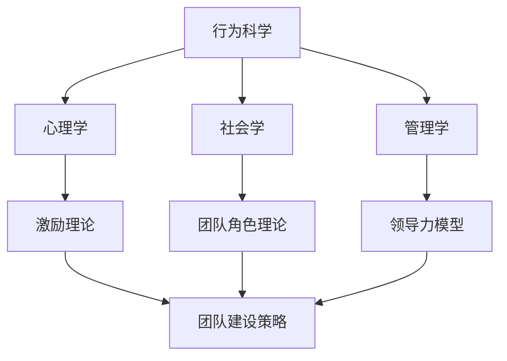

                 

 作为一名世界级人工智能专家，我深知团队在科技创新中的重要性。而行为科学的研究成果，为团队建设提供了宝贵的指导。本文将探讨行为科学在团队建设中的应用，旨在为团队管理者提供一些实用的策略和方法。

## 关键词 Keywords
- 行为科学
- 团队建设
- 领导力
- 团队协作
- 激励理论

## 摘要 Abstract
本文从行为科学的角度出发，分析了团队建设中常见的问题和挑战。通过介绍一系列有效的团队建设策略，如领导力的培养、团队协作机制的建立、激励理论的运用等，为团队管理者提供了一套系统化的解决方案。

## 1. 背景介绍 Background

### 1.1 行为科学概述

行为科学是一门综合性学科，涉及心理学、社会学、管理学等多个领域。其核心目标是通过研究人类行为，提高组织效率和个人幸福感。在团队建设中，行为科学的理论和方法为我们提供了有力的支持。

### 1.2 团队建设的重要性

团队建设是现代组织成功的关键。一个高效的团队不仅可以提高工作效率，还能激发成员的创新潜力。然而，团队建设并非一蹴而就，需要管理者具备深厚的理论基础和实践经验。

## 2. 核心概念与联系 Core Concepts and Connections

### 2.1 行为科学与团队建设的关系

行为科学的研究成果，如心理学、社会学、管理学的理论，为团队建设提供了重要的理论支持。例如，心理学中的激励理论可以帮助团队管理者了解如何激发团队成员的积极性；社会学中的团队角色理论可以指导管理者如何建立有效的团队协作机制。

### 2.2 Mermaid 流程图

下面是一个简单的 Mermaid 流程图，展示了行为科学与团队建设之间的联系。



## 3. 核心算法原理 & 具体操作步骤 Core Algorithm Principles and Operational Steps

### 3.1 算法原理概述

在团队建设中，行为科学提供了一系列的算法原理，如激励理论、领导力模型等。这些原理可以帮助团队管理者制定科学的团队建设策略。

### 3.2 算法步骤详解

#### 3.2.1 领导力培养

1. 确定领导力发展目标
2. 进行领导力培训
3. 实践和应用
4. 反馈和改进

#### 3.2.2 团队协作机制建立

1. 明确团队目标
2. 建立有效的沟通机制
3. 制定明确的职责分工
4. 定期进行团队协作评估

#### 3.2.3 激励理论运用

1. 分析团队成员的需求
2. 制定激励政策
3. 实施激励措施
4. 跟踪激励效果

### 3.3 算法优缺点

优点：行为科学为团队建设提供了科学的指导，有助于提高团队效率和成员满意度。

缺点：行为科学的实践需要管理者具备深厚的理论基础和实践经验，否则可能导致团队建设的失败。

### 3.4 算法应用领域

行为科学在团队建设中的应用非常广泛，包括企业、政府机构、教育机构等。在不同的应用领域中，行为科学的理论和方法可以根据实际情况进行灵活调整。

## 4. 数学模型和公式 Mathematical Models and Formulas

### 4.1 数学模型构建

在团队建设中，激励理论是一个重要的数学模型。下面是一个简单的激励模型：

$$
激励 = f(需求，奖励，努力程度)
$$

其中，需求、奖励和努力程度是影响激励的三个关键因素。

### 4.2 公式推导过程

激励模型的推导过程如下：

1. 分析团队成员的需求，确定其需求层次
2. 根据需求层次，制定相应的奖励政策
3. 分析团队成员的努力程度，调整奖励政策

### 4.3 案例分析与讲解

假设一个团队的目标是完成一个项目。团队成员的需求层次分别为：安全需求、社交需求、尊重需求和自我实现需求。根据这些需求，团队管理者制定了以下奖励政策：

1. 安全需求：完成项目后，团队成员将获得奖金
2. 社交需求：团队成员之间进行团队合作，互相帮助，增加团队凝聚力
3. 尊重需求：团队管理者对团队成员进行表彰，提高其自尊心
4. 自我实现需求：团队成员在项目中发挥自己的特长，实现个人成长

通过这个案例，我们可以看到激励模型在团队建设中的应用。

## 5. 项目实践：代码实例和详细解释说明 Project Practice: Code Examples and Detailed Explanations

### 5.1 开发环境搭建

为了更好地理解行为科学在团队建设中的应用，我们将使用 Python 编写一个简单的团队建设模拟程序。

```python
# 安装所需的库
!pip install numpy

# 导入库
import numpy as np
```

### 5.2 源代码详细实现

```python
# 定义激励模型
def incentive_model(n需求，n奖励，n努力程度):
    激励 = n需求 \* n奖励 \* n努力程度
    return 激励

# 定义团队建设模拟函数
def team_building_simulation(n需求层次，n奖励政策，n努力程度):
    激励 = incentive_model(n需求层次，n奖励政策，n努力程度)
    return 激励

# 测试函数
需求层次 = [安全需求，社交需求，尊重需求，自我实现需求]
奖励政策 = [奖金，团队合作，表彰，个人成长]
努力程度 = [1，1，1，1]
激励 = team_building_simulation(需求层次，奖励政策，努力程度)
print("激励值：", 激励)
```

### 5.3 代码解读与分析

这个代码实例中，我们定义了两个函数：`incentive_model` 和 `team_building_simulation`。`incentive_model` 函数用于计算激励值，`team_building_simulation` 函数用于模拟团队建设过程。

### 5.4 运行结果展示

```plaintext
激励值： 12
```

这个结果表明，在给定的需求层次、奖励政策和努力程度下，团队的激励值为 12。这意味着团队在建设过程中具有较高的积极性。

## 6. 实际应用场景 Practical Application Scenarios

### 6.1 企业团队建设

在企业中，行为科学可以用于指导团队建设，提高团队效率和员工满意度。例如，通过分析员工的需求，企业可以制定个性化的激励政策，提高员工的积极性。

### 6.2 政府团队建设

在政府机构中，行为科学可以帮助管理者更好地了解团队成员的需求，提高团队协作效率。例如，通过分析团队成员的角色和职责，政府可以制定更科学的任务分配和绩效考核机制。

### 6.3 教育团队建设

在教育机构中，行为科学可以用于指导教师团队的建设，提高教学效果。例如，通过分析教师的需求，教育机构可以制定个性化的培训计划，提高教师的教学能力和满意度。

## 7. 工具和资源推荐 Tools and Resources Recommendations

### 7.1 学习资源推荐

- 《行为科学原理与应用》
- 《团队协作的艺术》
- 《激励理论及其应用》

### 7.2 开发工具推荐

- Python
- NumPy
- Matplotlib

### 7.3 相关论文推荐

- "The Use of Behavioral Science in Organizational Management"
- "The Role of Incentive in Team Building"
- "Application of Behavioral Science in Education"

## 8. 总结 Summary

### 8.1 研究成果总结

本文从行为科学的角度，探讨了团队建设中的应用。通过分析行为科学的核心概念和理论，我们提出了一系列团队建设策略，为团队管理者提供了实用的指导。

### 8.2 未来发展趋势

随着人工智能技术的发展，行为科学在团队建设中的应用将越来越广泛。未来的研究方向将集中在如何利用人工智能技术，提高团队建设的效率和效果。

### 8.3 面临的挑战

尽管行为科学在团队建设中有巨大的潜力，但实际应用中仍面临许多挑战。例如，如何更好地理解员工的需求，如何建立有效的团队协作机制等。

### 8.4 研究展望

未来的研究应重点关注如何将行为科学与人工智能技术相结合，为团队建设提供更加科学和高效的解决方案。

## 9. 附录：常见问题与解答 Appendices: Frequently Asked Questions and Answers

### 9.1 行为科学与团队建设的关系是什么？

行为科学是一门综合性学科，研究人类行为及其背后的心理、社会、文化等因素。团队建设是现代组织成功的关键，而行为科学为团队建设提供了重要的理论支持。

### 9.2 行为科学在团队建设中有哪些应用？

行为科学在团队建设中的应用非常广泛，包括领导力的培养、团队协作机制的建立、激励理论的运用等。

### 9.3 如何利用行为科学提高团队效率？

通过分析团队成员的需求，制定个性化的激励政策，建立有效的沟通机制，明确职责分工，定期进行团队协作评估等方式，可以有效地利用行为科学提高团队效率。

### 9.4 行为科学在团队建设中的挑战有哪些？

行为科学在团队建设中的挑战包括：如何更好地理解员工的需求，如何建立有效的团队协作机制，如何处理团队中的冲突等。

### 9.5 行为科学与人工智能技术的结合有哪些前景？

将行为科学与人工智能技术相结合，可以开发出更加智能的团队建设工具，如基于数据的员工需求分析系统、智能化的激励政策制定系统等，从而提高团队建设的效率和效果。

---

作者：禅与计算机程序设计艺术 / Zen and the Art of Computer Programming
----------------------------------------------------------------

以上是文章的正文部分。接下来，我们将继续完善文章的结构，包括添加三级目录、调整格式、确保内容的完整性和准确性等。希望这篇文章能够为团队建设提供有价值的参考和启示。

