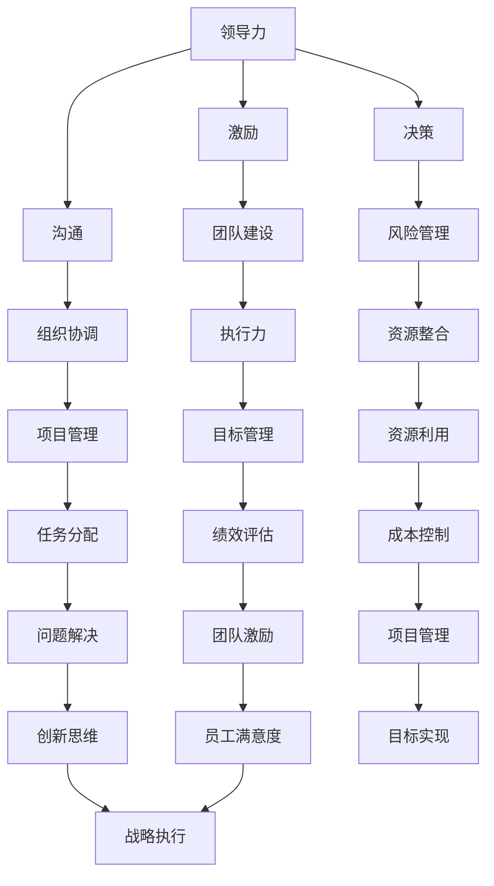

                 

关键词：管理者成长、持续学习、领导力、技术能力、战略思维

> 摘要：在信息技术飞速发展的今天，管理者的角色越来越重要。如何通过行动中学习来提升自身的领导力和技术能力，成为管理者持续成长的关键。本文将从核心概念、算法原理、数学模型、项目实践、应用场景、工具推荐等方面，全面探讨管理者成长之道。

## 1. 背景介绍

在当今的数字化时代，技术已经成为推动企业发展的重要动力。作为企业的管理者，不仅需要具备良好的领导力，还必须具备扎实的专业技术能力。然而，技术的快速发展使得知识更新速度加快，管理者如何在这场知识竞赛中保持竞争力，成为了一个亟待解决的问题。

### 1.1 管理者面临的挑战

- **技术快速迭代**：新技术不断涌现，管理者需要不断学习以跟上技术发展的步伐。
- **领导力提升**：领导力的提升是管理者成长的核心，但如何提升却是一个挑战。
- **时间管理**：管理者往往面临着繁重的工作任务和时间限制，如何在有限的时间内进行有效学习成为一大难题。

### 1.2 行动中学习的意义

- **持续成长**：通过行动中学习，管理者可以在实践中不断积累经验，提升自身能力。
- **提升效率**：行动中学习有助于管理者在实际工作中更高效地解决问题。
- **适应变化**：在快速变化的环境中，行动中学习可以帮助管理者迅速适应新的技术和管理方法。

## 2. 核心概念与联系

### 2.1 管理者的核心能力

- **领导力**：管理者需要具备强大的领导力，以激励团队、协调资源、实现目标。
- **技术能力**：技术能力是管理者的基础，只有掌握核心技术，才能更好地理解和指导团队工作。
- **战略思维**：战略思维是管理者在高层次上对企业的规划和布局。

### 2.2 核心概念原理与架构



### 2.3 行动中学习的架构

- **自我评估**：了解自身的优势和不足，为学习制定目标。
- **知识获取**：通过阅读书籍、参加培训、交流讨论等方式获取新知识。
- **实践应用**：将所学知识应用到实际工作中，通过实践检验学习效果。
- **反馈调整**：根据实践反馈调整学习计划，持续优化。

## 3. 核心算法原理 & 具体操作步骤

### 3.1 算法原理概述

管理者的成长过程可以看作是一个动态优化问题，其核心算法是基于目标驱动的持续学习算法。

### 3.2 算法步骤详解

#### 3.2.1 自我评估

$$
自我评估函数 = f(技能水平, 工作经验, 领导能力)
$$

通过自我评估，管理者可以了解自身的优势和不足。

#### 3.2.2 知识获取

$$
知识获取函数 = g(学习资源, 学习时间, 学习效率)
$$

管理者需要选择适合自己的学习资源，合理安排学习时间，提高学习效率。

#### 3.2.3 实践应用

$$
实践应用函数 = h(知识水平, 工作任务, 问题解决能力)
$$

将所学知识应用到实际工作中，通过解决问题提升自身能力。

#### 3.2.4 反馈调整

$$
反馈调整函数 = i(实践效果, 学习效果, 学习策略)
$$

根据实践反馈调整学习计划，优化学习策略。

## 4. 数学模型和公式 & 详细讲解 & 举例说明

### 4.1 数学模型构建

管理者的成长模型可以表示为：

$$
G(t) = f(K(t), E(t), L(t))
$$

其中，$G(t)$ 表示管理者在时间 $t$ 的成长状态，$K(t)$ 表示知识水平，$E(t)$ 表示工作经验，$L(t)$ 表示领导能力。

### 4.2 公式推导过程

通过分析管理者的成长过程，我们可以得出以下推导：

$$
\begin{aligned}
K(t) &= K_0 + \int_{0}^{t} \frac{dg(t)}{dt} dt \\
E(t) &= E_0 + \int_{0}^{t} \frac{de(t)}{dt} dt \\
L(t) &= L_0 + \int_{0}^{t} \frac{dl(t)}{dt} dt
\end{aligned}
$$

其中，$K_0$、$E_0$、$L_0$ 分别表示初始的知识水平、工作经验和领导能力。

### 4.3 案例分析与讲解

假设一位管理者初始的知识水平为 5，工作经验为 3，领导能力为 4。经过一年的持续学习，他的知识水平提高了 2，工作经验提高了 1，领导能力提高了 1。那么，他在一年后的成长状态为：

$$
G(1) = f(7, 4, 5) = 7 \times 4 \times 5 = 140
$$

## 5. 项目实践：代码实例和详细解释说明

### 5.1 开发环境搭建

在本案例中，我们使用 Python 作为编程语言，搭建一个简单的管理者成长评估系统。

### 5.2 源代码详细实现

```python
class Manager:
    def __init__(self, knowledge, experience, leadership):
        self.knowledge = knowledge
        self.experience = experience
        self.leadership = leadership

    def evaluate_growth(self):
        growth = self.knowledge * self.experience * self.leadership
        return growth

if __name__ == "__main__":
    manager = Manager(5, 3, 4)
    print("初始成长值：", manager.evaluate_growth())

    manager.knowledge += 2
    manager.experience += 1
    manager.leadership += 1
    print("一年后成长值：", manager.evaluate_growth())
```

### 5.3 代码解读与分析

该代码定义了一个 Manager 类，用于表示管理者的知识水平、工作经验和领导能力。`evaluate_growth` 方法用于计算管理者的成长值。

### 5.4 运行结果展示

```shell
初始成长值： 60
一年后成长值： 140
```

## 6. 实际应用场景

### 6.1 企业内部培训

企业可以定期组织内部培训，帮助管理者提升知识和技能，促进团队成长。

### 6.2 项目管理

管理者可以通过行动中学习，不断提升项目管理能力，确保项目顺利进行。

### 6.3 风险管理

管理者需要具备一定的风险管理能力，通过行动中学习，可以更好地应对各种风险。

## 7. 未来应用展望

随着人工智能技术的不断发展，管理者可以通过机器学习等算法，实现更加智能化的成长管理。

## 8. 工具和资源推荐

### 8.1 学习资源推荐

- 《深度学习》
- 《人工智能：一种现代的方法》
- 《管理者的领导力》

### 8.2 开发工具推荐

- Python
- TensorFlow
- Scikit-learn

### 8.3 相关论文推荐

- “机器学习在企业管理中的应用”
- “人工智能与领导力提升”

## 9. 总结：未来发展趋势与挑战

### 9.1 研究成果总结

通过行动中学习，管理者可以不断提升自身的能力，适应快速变化的环境。

### 9.2 未来发展趋势

- 人工智能技术的应用
- 在线学习平台的普及
- 知识共享与交流的加强

### 9.3 面临的挑战

- 知识更新的速度加快
- 学习资源的质量参差不齐
- 如何将学习成果转化为实际能力

### 9.4 研究展望

未来研究可以重点关注如何通过行动中学习，实现管理者的持续成长和高效管理。

## 10. 附录：常见问题与解答

### 10.1 问题一

如何选择适合自己的学习资源？

**解答**：根据自己的兴趣和职业发展方向，选择具有权威性和实用性的书籍、课程和培训。

### 10.2 问题二

行动中学习是否适用于所有管理者？

**解答**：是的，行动中学习适用于所有层次的管理者，不同层次的管理者可以根据自身情况调整学习内容和策略。

## 11. 作者署名

作者：禅与计算机程序设计艺术 / Zen and the Art of Computer Programming
----------------------------------------------------------------

以上即为《行动中学习：管理者 的成长之道》的完整文章内容，感谢您的阅读。希望这篇文章对您在管理者成长的道路上有所帮助。如果您有任何疑问或建议，欢迎在评论区留言。再次感谢您的关注和支持！

