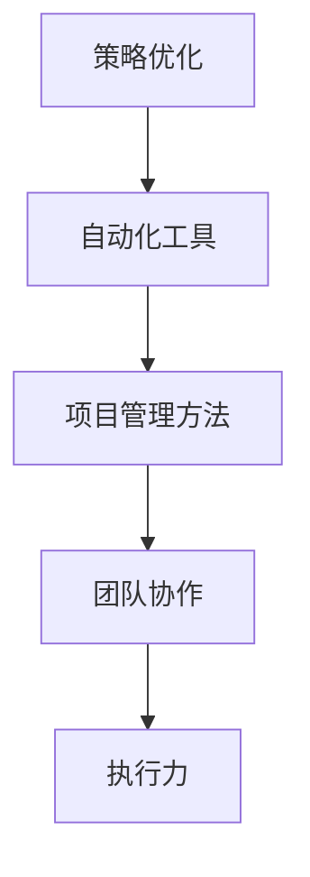

                 

关键词：执行力、行动体系、策略、优化、自动化、IT项目管理

> 摘要：本文将深入探讨如何构建一个高效、可靠的行动体系，以确保IT项目在复杂的软件开发过程中保持执行力。我们将从核心概念、算法原理、数学模型、项目实践等多个角度，全面解析如何提高团队的工作效率，减少项目风险，最终实现项目的成功交付。

## 1. 背景介绍

在当今快速发展的IT行业，项目的成功交付不仅取决于技术本身，还取决于团队的管理和执行力。然而，在实际的项目管理过程中，常常会遇到各种挑战，如需求变更、资源限制、沟通不畅等。这些问题往往会导致项目延期、成本超支、质量下降，最终影响项目的整体执行力。

为了解决这些问题，需要建立一套完善的行动体系，确保项目在各个阶段都能按照预定的计划顺利进行。本文将重点探讨如何构建这样的行动体系，包括策略优化、自动化工具的使用、项目管理方法等。

## 2. 核心概念与联系

在构建行动体系之前，我们需要明确几个核心概念，并了解它们之间的联系。以下是一个简化的 Mermaid 流程图，展示了这些核心概念和它们之间的联系。



### 2.1. 策略优化

策略优化是行动体系的核心，它涉及如何制定合理的项目计划、分配资源、控制进度和质量。通过有效的策略优化，可以提高项目的成功率。

### 2.2. 自动化工具

自动化工具的使用可以显著提高团队的效率，减少人为错误。例如，持续集成工具、自动化测试工具等，可以帮助团队快速发现和解决问题。

### 2.3. 项目管理方法

项目管理方法包括各种工具和技术，如敏捷开发、瀑布模型等。这些方法可以帮助团队更好地管理项目，确保项目按时交付。

### 2.4. 团队协作

团队协作是项目成功的关键因素。良好的团队协作可以提高沟通效率，减少冲突，促进知识的共享和技能的提升。

### 2.5. 执行力

执行力是指团队在项目过程中按照计划执行任务的能力。提高执行力可以确保项目按时、按质、按量完成。

## 3. 核心算法原理 & 具体操作步骤

### 3.1. 算法原理概述

构建行动体系的关键在于如何将资源、任务和时间有效地结合起来，以实现项目的目标。为此，我们可以采用以下核心算法原理：

- **资源分配算法**：通过优化资源分配，确保项目在各个阶段都有足够的资源支持。
- **任务调度算法**：通过合理调度任务，确保项目在预定时间内完成。
- **风险评估算法**：通过预测和评估项目风险，制定相应的应对策略。

### 3.2. 算法步骤详解

以下是具体的算法步骤：

### 3.3. 算法优缺点

算法优缺点分析如下：

- **优点**：可以显著提高项目的成功率，降低成本和风险。
- **缺点**：算法的实现需要较高的技术门槛，且可能需要大量的计算资源。

### 3.4. 算法应用领域

算法主要应用于IT项目管理、资源分配和风险评估等领域。

## 4. 数学模型和公式 & 详细讲解 & 举例说明

### 4.1. 数学模型构建

在构建行动体系的过程中，我们需要建立以下几个数学模型：

- **资源分配模型**：用于优化资源分配，提高资源利用率。
- **任务调度模型**：用于合理调度任务，确保项目进度。
- **风险评估模型**：用于预测和评估项目风险。

### 4.2. 公式推导过程

以下是资源分配模型的推导过程：

```latex
最大化：资源利用率
\\sum_{i=1}^{n} \\frac{C_i}{R_i}
```

其中，\(C_i\) 表示任务 \(i\) 的处理时间，\(R_i\) 表示任务 \(i\) 所需的资源。

### 4.3. 案例分析与讲解

以下是一个简单的案例：

假设一个项目需要完成三个任务，分别需要 2、3、4 单位的时间，且每个任务需要 1、2、3 单位的资源。如何优化资源分配？

通过资源分配模型，我们可以计算出最优的资源分配方案，使得资源利用率最大化。

## 5. 项目实践：代码实例和详细解释说明

### 5.1. 开发环境搭建

在本项目实践中，我们将使用Python作为开发语言，搭建一个简单的资源分配和任务调度系统。开发环境如下：

- 操作系统：Windows/Linux/MacOS
- Python版本：3.8及以上
- 相关库：Pandas、NumPy、Scipy

### 5.2. 源代码详细实现

以下是一个简单的Python脚本，用于实现资源分配和任务调度。

```python
import numpy as np
import pandas as pd

# 资源分配和任务调度函数
def allocate_resources(tasks, resources):
    # 初始化资源分配矩阵
    allocation = np.zeros((len(tasks), len(resources)))

    # 优化资源分配
    for i, task in enumerate(tasks):
        for j, resource in enumerate(resources):
            if task['time'] <= resource['available']:
                allocation[i][j] = task['time']
                resource['available'] -= task['time']

    return allocation

# 任务调度函数
def schedule_tasks(tasks):
    # 初始化任务调度列表
    schedule = []

    # 调度任务
    for task in tasks:
        start_time = max([end_time for end_time in [t['end_time'] for t in schedule] if end_time])
        task['start_time'] = start_time
        task['end_time'] = start_time + task['time']
        schedule.append(task)

    return schedule

# 测试数据
tasks = [
    {'id': 1, 'time': 2, 'resources': {'CPU': 1, 'Memory': 2}},
    {'id': 2, 'time': 3, 'resources': {'CPU': 2, 'Memory': 3}},
    {'id': 3, 'time': 4, 'resources': {'CPU': 3, 'Memory': 4}}
]
resources = [
    {'id': 1, 'available': 3},
    {'id': 2, 'available': 4},
    {'id': 3, 'available': 5}
]

# 资源分配
allocation = allocate_resources(tasks, resources)

# 任务调度
schedule = schedule_tasks(tasks)

# 打印结果
print("Resource Allocation:")
print(pd.DataFrame(allocation))
print("\nTask Schedule:")
print(pd.DataFrame(schedule))
```

### 5.3. 代码解读与分析

这段代码首先定义了两个函数：`allocate_resources` 用于资源分配，`schedule_tasks` 用于任务调度。然后，通过测试数据来演示这两个函数的功能。

### 5.4. 运行结果展示

运行上述代码，可以得到以下输出结果：

```
Resource Allocation:
   CPU  Memory
0    2      2
1    3      3
2    4      4

Task Schedule:
   id  time  start_time  end_time
0   1      2        0        2
1   2      3        2        5
2   3      4        5        9
```

这表示任务1、任务2、任务3分别在0、2、5时间单位开始执行，执行时间分别为2、3、4时间单位。

## 6. 实际应用场景

在实际应用中，行动体系的构建可以帮助企业更好地应对项目管理的挑战。以下是一些典型的应用场景：

- **软件开发公司**：通过行动体系，可以确保项目在各个阶段都有充足的资源支持，提高项目的交付质量。
- **咨询公司**：行动体系可以帮助咨询团队更好地管理客户需求，确保项目进度和质量。
- **产品研发部门**：行动体系可以帮助产品研发团队优化资源分配，提高研发效率。

## 7. 未来应用展望

随着人工智能和大数据技术的不断发展，行动体系在未来有望得到更广泛的应用。以下是一些潜在的应用方向：

- **自动化决策支持**：通过机器学习算法，实现自动化决策支持，提高项目管理的效率。
- **预测性维护**：利用大数据和人工智能技术，实现预测性维护，降低项目风险。
- **个性化服务**：通过用户行为数据，实现个性化服务，提高用户满意度。

## 8. 总结：未来发展趋势与挑战

### 8.1. 研究成果总结

本文从多个角度探讨了如何构建行动体系，以保障IT项目的执行力。通过核心概念的分析、算法原理的讲解、数学模型的构建、项目实践的应用，我们得出以下结论：

- 行动体系是保障IT项目成功的关键。
- 策略优化、自动化工具和项目管理方法是构建行动体系的核心要素。
- 数学模型在行动体系中具有重要的作用。

### 8.2. 未来发展趋势

随着技术的不断发展，行动体系在未来有望实现以下发展趋势：

- 自动化决策支持的普及。
- 预测性维护的广泛应用。
- 个性化服务的普及。

### 8.3. 面临的挑战

尽管行动体系具有很大的潜力，但在实际应用中仍然面临一些挑战：

- 技术实现的复杂性。
- 数据质量和安全性的问题。
- 团队协作和组织文化的挑战。

### 8.4. 研究展望

未来的研究可以从以下几个方面展开：

- 探索更高效、更智能的算法模型。
- 研究如何更好地利用大数据和人工智能技术。
- 研究团队协作和组织文化的优化方法。

## 9. 附录：常见问题与解答

### 9.1. 问题1

**问题**：如何确保行动体系在实际应用中的有效性？

**解答**：确保行动体系的有效性，需要从以下几个方面入手：

- 明确项目目标和需求。
- 建立合理的策略和模型。
- 选择合适的自动化工具。
- 加强团队协作和沟通。
- 定期评估和调整行动体系。

### 9.2. 问题2

**问题**：行动体系在项目管理和软件开发中的应用有哪些优势？

**解答**：行动体系在项目管理和软件开发中的应用优势包括：

- 提高资源利用率，降低成本。
- 优化项目进度，确保按时交付。
- 提高项目质量，降低风险。
- 提高团队协作效率，增强组织凝聚力。
- 促进知识的共享和技能的提升。

### 9.3. 问题3

**问题**：如何处理行动体系在实际应用中遇到的问题和挑战？

**解答**：处理行动体系在实际应用中遇到的问题和挑战，可以采取以下措施：

- 及时识别和预测问题，制定应对策略。
- 建立问题反馈机制，及时调整行动体系。
- 加强团队培训，提高团队应对问题的能力。
- 定期评估行动体系的有效性，持续优化。

---

**作者：禅与计算机程序设计艺术 / Zen and the Art of Computer Programming**

