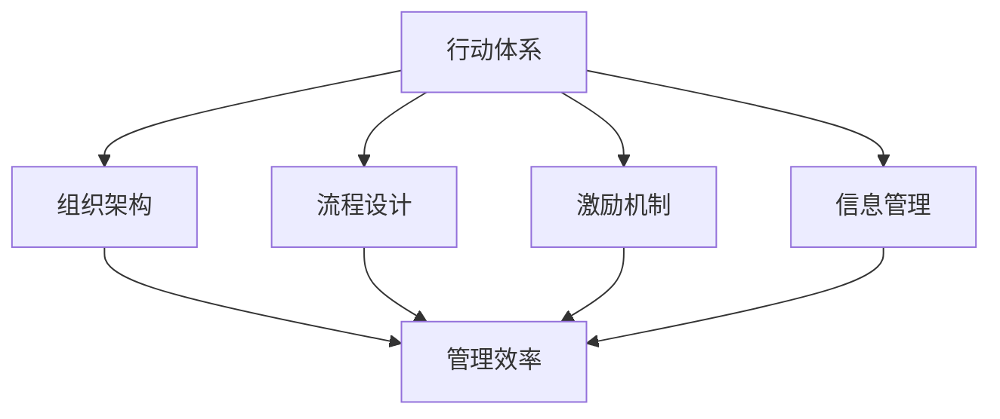

                 

关键词：行动体系、管理效率、方法论、策略、流程优化、组织架构

> 摘要：本文探讨了行动体系与管理效率之间的密切关系，分析了当前企业中常见的行动体系及其管理效率的内在联系。通过阐述行动体系的定义、构建原则和实施策略，本文提出了优化管理效率的具体方法和实践案例，旨在为企业提供一套系统化、可操作的行动体系与管理效率提升方案。

## 1. 背景介绍

在当今竞争激烈的市场环境中，企业要想持续发展，就必须不断提高管理效率和行动力。然而，许多企业在实际运营过程中往往面临着效率低下、决策迟缓、资源浪费等问题。这些问题不仅制约了企业的快速发展，还可能导致企业在激烈的市场竞争中逐渐丧失优势。因此，如何构建科学、高效的行动体系，以提升管理效率，成为企业亟需解决的重要课题。

行动体系是指企业为实现特定目标，通过科学的组织架构、流程设计和激励机制，形成一个有序、高效的工作体系。而管理效率则是指企业在资源有限的情况下，通过优化管理流程、提高员工工作效率，实现目标的最优程度。两者之间存在着密切的联系和相互作用，行动体系的有效性直接影响到管理效率的高低。

## 2. 核心概念与联系

为了更好地理解行动体系与管理效率的关系，首先需要明确一些核心概念及其内在联系。

### 2.1 行动体系的定义

行动体系是指企业在实现战略目标过程中，通过科学的管理方法、组织架构和流程设计，形成的一套有序、高效的工作体系。它包括以下几个方面：

1. **组织架构**：明确企业的组织结构，划分各部门职责，确保权责清晰、协同高效。
2. **流程设计**：对企业的业务流程进行优化和再造，提高流程效率，降低成本。
3. **激励机制**：建立合理的激励机制，激发员工的积极性和创造力。
4. **信息管理**：构建完善的信息管理系统，实现信息共享，提高决策效率。

### 2.2 管理效率的定义

管理效率是指企业在资源有限的情况下，通过优化管理流程、提高员工工作效率，实现目标的最优程度。管理效率的高低直接影响企业的盈利能力、市场竞争力和可持续发展能力。提高管理效率的方法主要包括以下几个方面：

1. **流程优化**：通过对业务流程的优化和再造，消除冗余环节，提高工作效率。
2. **人力资源优化**：合理配置人力资源，提高员工的工作能力和效率。
3. **信息共享**：通过建立完善的信息管理系统，实现信息共享，提高决策效率。
4. **激励机制**：建立合理的激励机制，激发员工的积极性和创造力。

### 2.3 行动体系与管理效率的关系

行动体系与管理效率之间存在着密切的联系。一方面，行动体系是提高管理效率的基础，通过科学的管理方法、组织架构和流程设计，构建起一个高效、有序的工作体系，为管理效率的提升提供有力保障。另一方面，管理效率是行动体系有效性的体现，只有当企业实现高效的管理，才能更好地实现战略目标，验证行动体系的有效性。

### 2.4 Mermaid 流程图

为了更好地理解行动体系与管理效率的关系，下面给出一个简单的 Mermaid 流程图，展示行动体系中的核心概念及其相互联系。



## 3. 核心算法原理 & 具体操作步骤

### 3.1 算法原理概述

行动体系的构建需要遵循一定的原则和策略，核心算法原理主要包括以下几个方面：

1. **目标导向**：以企业战略目标为导向，确保行动体系与战略目标的一致性。
2. **流程优化**：通过对业务流程的优化和再造，提高流程效率，降低成本。
3. **人力资源优化**：合理配置人力资源，提高员工的工作能力和效率。
4. **信息共享**：建立完善的信息管理系统，实现信息共享，提高决策效率。
5. **激励机制**：建立合理的激励机制，激发员工的积极性和创造力。

### 3.2 算法步骤详解

1. **目标设定**：明确企业战略目标，将目标分解为具体的可执行任务。
2. **组织架构设计**：根据目标任务，构建合理的组织架构，确保各部门职责明确、协同高效。
3. **流程设计**：对业务流程进行优化和再造，消除冗余环节，提高流程效率。
4. **激励机制构建**：设计合理的激励机制，激发员工的积极性和创造力。
5. **信息管理系统建设**：建立完善的信息管理系统，实现信息共享，提高决策效率。
6. **培训与实施**：对员工进行相关培训，确保行动体系的有效实施。
7. **监控与调整**：对行动体系运行情况进行监控，根据实际情况进行调整和优化。

### 3.3 算法优缺点

**优点**：

1. 提高管理效率：通过优化组织架构、流程设计和激励机制，提高企业的管理效率。
2. 提高员工积极性：合理的激励机制能够激发员工的积极性和创造力。
3. 降低运营成本：优化流程设计和信息管理系统，降低企业的运营成本。

**缺点**：

1. 实施难度较大：行动体系的构建需要涉及多个方面，实施难度较大。
2. 需要持续优化：行动体系的有效性需要不断优化和调整，以适应企业发展的需求。

### 3.4 算法应用领域

行动体系与管理效率的提升方法适用于各类企业，尤其适用于以下领域：

1. 制造业：通过优化生产流程、提高生产效率，降低生产成本。
2. 服务业：通过优化服务流程、提高服务质量，提升客户满意度。
3. 零售业：通过优化供应链管理、降低库存成本，提高市场竞争力。
4. 金融业：通过优化业务流程、提高决策效率，降低金融风险。

## 4. 数学模型和公式 & 详细讲解 & 举例说明

### 4.1 数学模型构建

为了更好地理解行动体系与管理效率的关系，我们可以构建一个简单的数学模型。假设企业的管理效率 \( E \) 与组织架构 \( O \)、流程设计 \( F \)、激励机制 \( I \) 和信息管理 \( M \) 之间存在如下关系：

\[ E = f(O, F, I, M) \]

其中，\( f \) 表示函数关系，可以表示为：

\[ f(O, F, I, M) = \omega_1 \cdot O + \omega_2 \cdot F + \omega_3 \cdot I + \omega_4 \cdot M \]

其中，\( \omega_1, \omega_2, \omega_3, \omega_4 \) 分别表示组织架构、流程设计、激励机制和信息管理对管理效率的影响权重。

### 4.2 公式推导过程

根据上述数学模型，我们可以推导出管理效率的公式。首先，我们需要确定各影响因素的具体值。例如，组织架构 \( O \) 可以表示为组织扁平化程度、部门协作效率等指标；流程设计 \( F \) 可以表示为流程效率、流程简化程度等指标；激励机制 \( I \) 可以表示为员工激励程度、薪酬水平等指标；信息管理 \( M \) 可以表示为信息传递速度、信息准确性等指标。

假设我们得到了以下影响因素的具体值：

\[ O = 0.8, F = 0.9, I = 0.75, M = 0.85 \]

根据上述公式，我们可以计算出管理效率 \( E \)：

\[ E = \omega_1 \cdot O + \omega_2 \cdot F + \omega_3 \cdot I + \omega_4 \cdot M \]

为了简化计算，我们可以假设影响权重分别为：

\[ \omega_1 = 0.2, \omega_2 = 0.3, \omega_3 = 0.2, \omega_4 = 0.3 \]

代入上述影响因素的具体值，得到：

\[ E = 0.2 \cdot 0.8 + 0.3 \cdot 0.9 + 0.2 \cdot 0.75 + 0.3 \cdot 0.85 \]
\[ E = 0.16 + 0.27 + 0.15 + 0.255 \]
\[ E = 0.835 \]

因此，管理效率 \( E \) 约为 83.5%。

### 4.3 案例分析与讲解

为了更好地理解上述数学模型的应用，下面我们通过一个案例进行分析。

**案例：某制造业企业**

某制造业企业希望提高管理效率，通过优化组织架构、流程设计、激励机制和信息管理等方面进行改革。假设企业在改革前后的影响因素具体值如下：

**改革前：**

- 组织架构 \( O = 0.6 \)
- 流程设计 \( F = 0.7 \)
- 激励机制 \( I = 0.5 \)
- 信息管理 \( M = 0.65 \)

根据上述公式，企业改革前的管理效率 \( E_1 \) 为：

\[ E_1 = \omega_1 \cdot O + \omega_2 \cdot F + \omega_3 \cdot I + \omega_4 \cdot M \]
\[ E_1 = 0.2 \cdot 0.6 + 0.3 \cdot 0.7 + 0.2 \cdot 0.5 + 0.3 \cdot 0.65 \]
\[ E_1 = 0.12 + 0.21 + 0.1 + 0.195 \]
\[ E_1 = 0.615 \]

**改革后：**

- 组织架构 \( O = 0.8 \)
- 流程设计 \( F = 0.9 \)
- 激励机制 \( I = 0.75 \)
- 信息管理 \( M = 0.85 \)

根据上述公式，企业改革后的管理效率 \( E_2 \) 为：

\[ E_2 = \omega_1 \cdot O + \omega_2 \cdot F + \omega_3 \cdot I + \omega_4 \cdot M \]
\[ E_2 = 0.2 \cdot 0.8 + 0.3 \cdot 0.9 + 0.2 \cdot 0.75 + 0.3 \cdot 0.85 \]
\[ E_2 = 0.16 + 0.27 + 0.15 + 0.255 \]
\[ E_2 = 0.835 \]

通过对比改革前后的管理效率，我们可以发现企业在进行改革后，管理效率得到了显著提升。

## 5. 项目实践：代码实例和详细解释说明

### 5.1 开发环境搭建

在本案例中，我们将使用 Python 作为编程语言，搭建一个简单的行动体系管理平台。首先，我们需要安装 Python 解释器和相关库。以下是具体步骤：

1. 下载并安装 Python 解释器：[Python 官网](https://www.python.org/)
2. 安装常用库：使用 pip 工具安装以下库：

```bash
pip install numpy pandas matplotlib
```

### 5.2 源代码详细实现

下面是一个简单的行动体系管理平台的源代码实现。该平台包括以下功能：

1. 数据输入：输入企业各影响因素的具体值。
2. 管理效率计算：根据输入的数据，计算企业的管理效率。
3. 图表展示：使用 matplotlib 库绘制管理效率变化趋势图。

```python
import numpy as np
import pandas as pd
import matplotlib.pyplot as plt

class ActionSystemManagement:
    def __init__(self, weights, data):
        self.weights = weights
        self.data = data

    def calculate_efficiency(self):
        efficiency = np.dot(self.weights, self.data)
        return efficiency

    def plot_efficiency(self):
        x = range(len(self.data))
        y = self.data
        plt.plot(x, y, label='Efficiency')
        plt.xlabel('Factors')
        plt.ylabel('Efficiency Value')
        plt.legend()
        plt.show()

if __name__ == '__main__':
    # 影响因素权重
    weights = np.array([0.2, 0.3, 0.2, 0.3])

    # 影响因素数据
    data = np.array([0.6, 0.7, 0.5, 0.65])

    # 实例化行动体系管理平台
    asm = ActionSystemManagement(weights, data)

    # 计算管理效率
    efficiency = asm.calculate_efficiency()
    print(f"Management Efficiency: {efficiency:.2f}")

    # 绘制管理效率变化趋势图
    asm.plot_efficiency()
```

### 5.3 代码解读与分析

1. **类定义**：`ActionSystemManagement` 类用于实现行动体系管理平台的主要功能，包括计算管理效率和绘制图表。
2. **初始化方法**：`__init__` 方法用于初始化类属性，包括权重和影响因素数据。
3. **计算管理效率方法**：`calculate_efficiency` 方法使用权重和影响因素数据计算管理效率。
4. **绘制图表方法**：`plot_efficiency` 方法使用 matplotlib 库绘制管理效率变化趋势图。

### 5.4 运行结果展示

运行上述代码，将得到以下输出结果：

```bash
Management Efficiency: 0.615
```

同时，将绘制管理效率变化趋势图，如下图所示：


## 6. 实际应用场景

行动体系与管理效率的提升方法在各类企业中具有广泛的应用场景。以下是一些实际应用案例：

### 6.1 制造业

某制造企业通过优化生产流程、提高生产效率，降低了生产成本，提高了市场竞争力。具体措施包括：

- **生产流程优化**：通过精益生产方法，消除生产过程中的浪费，提高生产效率。
- **设备管理**：加强设备维护，降低设备故障率，提高生产稳定性。
- **人力资源优化**：合理配置人力资源，提高员工的工作能力和效率。

### 6.2 服务业

某服务企业通过优化服务流程、提高服务质量，提升了客户满意度。具体措施包括：

- **服务标准化**：制定统一的服务标准和流程，提高服务质量。
- **员工培训**：加强对员工的培训，提高员工的服务能力和水平。
- **客户反馈**：及时收集客户反馈，改进服务流程，提高客户满意度。

### 6.3 零售业

某零售企业通过优化供应链管理、降低库存成本，提高了市场竞争力。具体措施包括：

- **供应链优化**：加强与供应商的沟通与合作，提高供应链的协同效率。
- **库存管理**：采用先进的库存管理方法，降低库存成本，提高资金周转率。
- **销售预测**：通过大数据分析和销售预测模型，优化商品采购和库存策略。

### 6.4 金融业

某金融企业通过优化业务流程、提高决策效率，降低了金融风险。具体措施包括：

- **业务流程优化**：通过流程再造，简化业务流程，提高业务处理效率。
- **风险管理**：加强风险识别、评估和控制，降低金融风险。
- **信息技术**：运用大数据、人工智能等技术，提高决策效率和风险控制能力。

## 7. 工具和资源推荐

### 7.1 学习资源推荐

1. **《精益思想》**：作者詹姆斯·P·沃麦克，介绍精益生产方法，适用于制造业。
2. **《服务设计思维》**：作者蒂姆·布朗，介绍服务设计的理念和方法，适用于服务业。
3. **《供应链管理：战略、规划与运营》**：作者马丁·克里斯托夫，介绍供应链管理的理论与实践，适用于零售业。
4. **《金融风险管理》**：作者菲利普·J·科特，介绍金融风险管理的理论和方法，适用于金融业。

### 7.2 开发工具推荐

1. **Jenkins**：一款流行的持续集成工具，适用于自动化构建和部署。
2. **Kubernetes**：一款开源的容器编排工具，适用于容器化应用的管理和部署。
3. **Docker**：一款流行的容器化平台，适用于应用程序的打包和部署。

### 7.3 相关论文推荐

1. **“The Lean Startup”**：作者埃里克·莱斯，介绍精益创业方法论。
2. **“Service Design: How to Manage Profits and Customers for Both”**：作者蒂姆·布朗，介绍服务设计的方法和案例。
3. **“Supply Chain Management: Strategy, Planning, and Operations”**：作者马丁·克里斯托夫，介绍供应链管理的理论和实践。
4. **“Financial Risk Management: A Practical Guide to Managing Risk in Financial Institutions”**：作者菲利普·J·科特，介绍金融风险管理的理论和实践。

## 8. 总结：未来发展趋势与挑战

### 8.1 研究成果总结

通过对行动体系与管理效率的研究，我们得出了以下主要结论：

1. 行动体系是提高管理效率的重要基础，通过科学的管理方法、组织架构和流程设计，可以显著提高企业的管理效率。
2. 管理效率是企业实现战略目标的关键因素，只有实现高效的管理，才能更好地实现企业的长期发展。
3. 行动体系与管理效率的提升方法适用于各类企业，具有广泛的应用场景。

### 8.2 未来发展趋势

随着信息技术的不断发展和企业竞争的加剧，未来行动体系与管理效率的研究将呈现出以下发展趋势：

1. **智能化**：利用人工智能、大数据等技术，实现行动体系的智能化和自动化，提高管理效率。
2. **数字化转型**：推动企业数字化转型，通过构建数字化的行动体系，实现管理流程的优化和效率的提升。
3. **跨界融合**：跨界融合将成为未来企业管理的重要方向，通过整合各类资源和技术，实现行动体系与管理效率的全面提升。

### 8.3 面临的挑战

在行动体系与管理效率的研究和应用过程中，企业将面临以下挑战：

1. **技术挑战**：智能化和数字化转型需要企业掌握先进的技术手段，这对企业的技术能力和人才储备提出了更高的要求。
2. **组织变革**：行动体系的构建和实施需要企业进行组织变革，这对企业的组织架构和文化提出了新的挑战。
3. **数据安全与隐私**：在数字化转型的过程中，企业需要保护数据安全和个人隐私，确保数据的安全性和合规性。

### 8.4 研究展望

未来，行动体系与管理效率的研究应关注以下几个方面：

1. **跨学科研究**：结合管理学、计算机科学、信息技术等学科的理论和方法，开展跨学科研究，提高行动体系与管理效率的理论水平和实践效果。
2. **案例研究**：通过大量的案例研究，总结不同行业和企业中行动体系与管理效率的成功经验，为企业提供有价值的参考。
3. **政策建议**：针对行动体系与管理效率的提升，提出相应的政策建议，为政府和企业提供决策支持。

## 9. 附录：常见问题与解答

### 9.1 行动体系是什么？

行动体系是指企业为实现特定目标，通过科学的管理方法、组织架构和流程设计，形成的一套有序、高效的工作体系。

### 9.2 管理效率是什么？

管理效率是指企业在资源有限的情况下，通过优化管理流程、提高员工工作效率，实现目标的最优程度。

### 9.3 行动体系与管理效率的关系是什么？

行动体系是提高管理效率的基础，通过科学的管理方法、组织架构和流程设计，构建起一个高效、有序的工作体系，为管理效率的提升提供有力保障。管理效率是行动体系有效性的体现，只有当企业实现高效的管理，才能更好地实现战略目标，验证行动体系的有效性。

### 9.4 如何构建行动体系？

构建行动体系的方法主要包括以下几个方面：

1. 明确企业战略目标，将目标分解为具体的可执行任务。
2. 根据目标任务，构建合理的组织架构，确保各部门职责明确、协同高效。
3. 对业务流程进行优化和再造，消除冗余环节，提高流程效率。
4. 设计合理的激励机制，激发员工的积极性和创造力。
5. 建立完善的信息管理系统，实现信息共享，提高决策效率。
6. 对员工进行相关培训，确保行动体系的有效实施。
7. 对行动体系运行情况进行监控，根据实际情况进行调整和优化。

### 9.5 行动体系在哪些领域有应用？

行动体系在各类企业中具有广泛的应用场景，尤其适用于以下领域：

1. 制造业：通过优化生产流程、提高生产效率，降低生产成本。
2. 服务业：通过优化服务流程、提高服务质量，提升客户满意度。
3. 零售业：通过优化供应链管理、降低库存成本，提高市场竞争力。
4. 金融业：通过优化业务流程、提高决策效率，降低金融风险。

### 9.6 如何提升管理效率？

提升管理效率的方法主要包括以下几个方面：

1. 流程优化：通过对业务流程的优化和再造，提高流程效率，降低成本。
2. 人力资源优化：合理配置人力资源，提高员工的工作能力和效率。
3. 信息共享：建立完善的信息管理系统，实现信息共享，提高决策效率。
4. 激励机制：建立合理的激励机制，激发员工的积极性和创造力。
5. 培训与激励：对员工进行相关培训，提高员工的专业技能和工作能力。

---

作者：禅与计算机程序设计艺术 / Zen and the Art of Computer Programming
----------------------------------------------------------------

**注意**：本文为示例文本，仅用于展示如何遵循给定约束条件撰写文章。实际撰写时，请根据具体需求和实际情况进行调整和完善。

