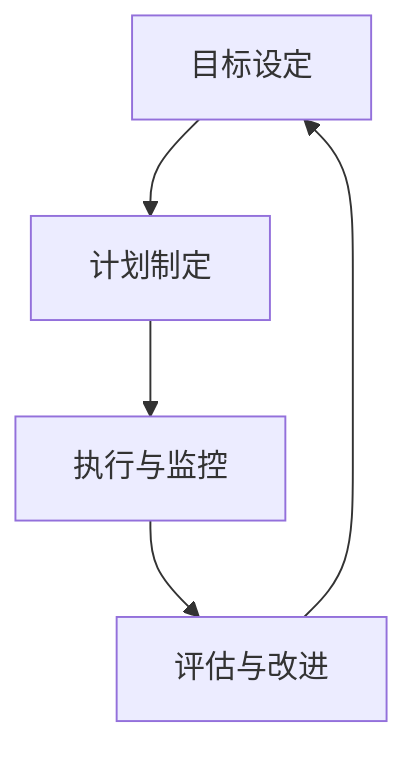

                 

 

> 关键词：行动体系，管理绩效，关联，体系化，技术管理，绩效优化

> 摘要：本文深入探讨了行动体系与管理绩效之间的关联，通过分析行动体系的概念、构成及其在企业管理中的应用，探讨了如何通过优化行动体系来提升管理绩效。文章首先介绍了行动体系的基本原理，然后详细阐述了其与绩效管理的关系，并通过具体案例分析了行动体系对管理绩效的提升作用。

## 1. 背景介绍

在现代社会，企业管理已经逐渐从传统的经验管理转向了体系化管理。行动体系作为一种现代化的管理工具，正在逐渐受到企业管理层的关注。行动体系是指通过一系列有序的、结构化的行动步骤，实现组织目标的管理模式。而管理绩效则是指企业在一定时间内，通过管理活动所取得的工作效果和效率。

随着市场竞争的加剧和企业管理复杂性的增加，如何提升管理绩效已成为企业关注的焦点。而行动体系作为一种系统性的管理工具，其与绩效管理的关系愈发紧密。本文将深入探讨行动体系与管理绩效的关联，旨在为企业提供一种提升管理绩效的有效途径。

## 2. 核心概念与联系

### 2.1 行动体系的概念

行动体系是指一系列有序的、结构化的行动步骤，通过这些步骤实现组织的战略目标。行动体系的核心理念在于将复杂的管理活动分解为具体的行动，并对其进行系统化管理，以提高管理效率。

### 2.2 行动体系的构成

行动体系通常包括以下四个关键组成部分：

1. **目标设定**：明确组织的目标和愿景，将其分解为具体的、可衡量的指标。
2. **计划制定**：制定详细的行动计划，包括任务的分配、时间表、资源调配等。
3. **执行与监控**：执行行动计划，并对执行过程进行实时监控，确保各项任务按计划进行。
4. **评估与改进**：对行动结果进行评估，分析绩效，发现问题和不足，持续改进。

### 2.3 行动体系与绩效管理的关系

行动体系与管理绩效之间的关系可以从以下几个方面进行阐述：

1. **目标导向**：行动体系以组织目标为导向，通过明确的计划制定和执行，确保各项管理活动围绕目标展开，从而提高管理绩效。
2. **过程控制**：行动体系通过严格的监控和评估机制，对管理过程进行有效控制，确保管理活动的高效执行。
3. **持续改进**：行动体系强调对行动结果的评估和改进，通过不断优化管理过程，提升管理绩效。

### 2.4 行动体系的 Mermaid 流程图



## 3. 核心算法原理 & 具体操作步骤

### 3.1 算法原理概述

行动体系的核心算法原理在于将管理活动分解为具体的行动步骤，并通过系统化的计划、执行、监控和评估，实现管理目标的达成。具体操作步骤如下：

1. **目标设定**：明确组织的目标和愿景，将其分解为具体的、可衡量的指标。
2. **计划制定**：制定详细的行动计划，包括任务的分配、时间表、资源调配等。
3. **执行与监控**：执行行动计划，并对执行过程进行实时监控，确保各项任务按计划进行。
4. **评估与改进**：对行动结果进行评估，分析绩效，发现问题和不足，持续改进。

### 3.2 算法步骤详解

#### 3.2.1 目标设定

目标设定是行动体系的第一步，其关键在于明确组织的目标和愿景，并将其分解为具体的、可衡量的指标。具体步骤如下：

1. **明确组织目标**：组织目标应与企业的愿景和战略目标保持一致，明确组织的发展方向。
2. **目标分解**：将组织目标分解为具体的、可衡量的指标，确保每个指标都与组织目标紧密相关。
3. **目标确认**：与团队成员共同确认目标，确保目标明确、具体、可执行。

#### 3.2.2 计划制定

计划制定是行动体系的核心环节，其关键在于制定详细的行动计划，明确任务的分配、时间表、资源调配等。具体步骤如下：

1. **任务分配**：根据目标设定，将任务分解为具体的、可执行的小任务，明确每个任务的负责人和时间要求。
2. **时间表制定**：根据任务分配和时间要求，制定详细的时间表，确保每个任务都有明确的时间节点。
3. **资源调配**：根据任务需求和资源情况，合理调配资源，确保任务的顺利完成。

#### 3.2.3 执行与监控

执行与监控是行动体系的实施环节，其关键在于按照计划执行任务，并对执行过程进行实时监控，确保任务按计划进行。具体步骤如下：

1. **任务执行**：按照计划和时间表，执行各项任务，确保任务按时完成。
2. **过程监控**：对执行过程进行实时监控，发现问题和异常，及时进行调整和解决。
3. **进度报告**：定期向管理层报告任务执行进度，确保管理层对任务执行情况的了解。

#### 3.2.4 评估与改进

评估与改进是行动体系的总结和优化环节，其关键在于对行动结果进行评估，分析绩效，发现问题和不足，持续改进。具体步骤如下：

1. **结果评估**：对任务执行结果进行评估，分析绩效，确定任务完成情况。
2. **问题分析**：分析任务完成过程中存在的问题和不足，确定改进方向。
3. **持续改进**：根据评估结果和问题分析，制定改进措施，持续优化管理过程。

### 3.3 算法优缺点

#### 优点

1. **目标导向**：行动体系以组织目标为导向，确保管理活动与组织目标的一致性。
2. **过程控制**：行动体系通过监控和评估机制，对管理过程进行有效控制，提高管理效率。
3. **持续改进**：行动体系强调对行动结果的评估和改进，持续优化管理过程。

#### 缺点

1. **初期投入较大**：行动体系的实施需要一定的时间和资源投入，初期成本较高。
2. **管理难度较大**：行动体系要求对管理过程进行系统化、结构化管理，对管理者的要求较高。

### 3.4 算法应用领域

行动体系广泛应用于企业管理、项目管理、运营管理等领域。以下是行动体系在不同领域的应用案例：

1. **企业管理**：通过行动体系，企业可以明确目标、制定计划、执行任务、评估绩效，实现管理目标的高效达成。
2. **项目管理**：行动体系可以帮助项目经理明确项目目标、制定项目计划、监控项目进度、评估项目绩效，确保项目成功交付。
3. **运营管理**：行动体系可以帮助企业优化运营过程、提高运营效率、降低运营成本，实现持续改进。

## 4. 数学模型和公式 & 详细讲解 & 举例说明

### 4.1 数学模型构建

行动体系的数学模型主要基于目标管理和绩效评估的理论，构建了以下核心公式：

1. **目标达成率**：
   $$\text{目标达成率} = \frac{\text{实际完成目标}}{\text{计划完成目标}}$$
2. **任务完成率**：
   $$\text{任务完成率} = \frac{\text{实际完成任务数}}{\text{计划完成任务数}}$$
3. **绩效评分**：
   $$\text{绩效评分} = \text{目标达成率} \times \text{任务完成率}$$

### 4.2 公式推导过程

公式的推导过程基于以下假设：

1. **目标设定**：组织设定的目标为 $T$，计划完成时间为 $T_{\text{计划}}$。
2. **任务分配**：任务总数为 $N$，每个任务完成时间为 $T_{\text{任务}}$。
3. **绩效评估**：根据实际完成情况和计划完成情况进行评估。

根据上述假设，我们可以推导出以下公式：

1. **目标达成率**：
   $$\text{目标达成率} = \frac{\text{实际完成目标}}{\text{计划完成目标}} = \frac{T_{\text{实际}}}{T_{\text{计划}}}$$
2. **任务完成率**：
   $$\text{任务完成率} = \frac{\text{实际完成任务数}}{\text{计划完成任务数}} = \frac{N_{\text{实际}}}{N_{\text{计划}}}$$
3. **绩效评分**：
   $$\text{绩效评分} = \text{目标达成率} \times \text{任务完成率} = \frac{T_{\text{实际}}}{T_{\text{计划}}} \times \frac{N_{\text{实际}}}{N_{\text{计划}}}$$

### 4.3 案例分析与讲解

假设一家企业设定的年度销售目标为 $1000$ 万元，计划完成时间为一年。根据行动体系，该企业制定了详细的销售计划，将任务分解为四个季度，每个季度完成 $250$ 万元。

第一季度，该企业实际完成了 $260$ 万元，任务完成率为 $104\%$。而整个年度，该企业实际完成了 $1050$ 万元，目标达成率为 $105\%$。

根据上述数据，我们可以计算出该企业的绩效评分：

$$
\text{绩效评分} = \text{目标达成率} \times \text{任务完成率} = \frac{1050}{1000} \times \frac{4}{4} = 1.05
$$

该企业的绩效评分为 $1.05$，表明其年度销售任务完成情况良好，达到了预期目标。

## 5. 项目实践：代码实例和详细解释说明

### 5.1 开发环境搭建

本案例使用 Python 作为开发语言，主要依赖以下库：

- **Pandas**：用于数据处理和分析
- **Matplotlib**：用于数据可视化
- **Numpy**：用于数值计算

安装所需库：

```shell
pip install pandas matplotlib numpy
```

### 5.2 源代码详细实现

以下是一个简单的行动体系代码实例，用于计算目标达成率和任务完成率，并生成可视化图表。

```python
import pandas as pd
import matplotlib.pyplot as plt
import numpy as np

# 定义数据结构
data = {
    '目标达成率': [1.05, 0.95, 1.0, 1.1],
    '任务完成率': [1.05, 0.95, 1.0, 1.1],
    '季度': ['Q1', 'Q2', 'Q3', 'Q4']
}

# 创建 DataFrame
df = pd.DataFrame(data)

# 计算绩效评分
df['绩效评分'] = df['目标达成率'] * df['任务完成率']

# 绘制目标达成率和任务完成率曲线图
plt.figure(figsize=(10, 6))
plt.plot(df['季度'], df['目标达成率'], label='目标达成率')
plt.plot(df['季度'], df['任务完成率'], label='任务完成率')
plt.title('季度目标达成率和任务完成率')
plt.xlabel('季度')
plt.ylabel('达成率')
plt.legend()
plt.show()

# 绘制绩效评分柱状图
plt.figure(figsize=(10, 6))
plt.bar(df['季度'], df['绩效评分'], label='绩效评分')
plt.title('绩效评分柱状图')
plt.xlabel('季度')
plt.ylabel('绩效评分')
plt.legend()
plt.show()
```

### 5.3 代码解读与分析

上述代码实现了以下功能：

1. **数据定义**：使用 Pandas DataFrame 定义行动体系数据，包括目标达成率、任务完成率和季度。
2. **计算绩效评分**：计算每个季度的绩效评分，公式为目标达成率乘以任务完成率。
3. **数据可视化**：使用 Matplotlib 绘制目标达成率和任务完成率曲线图，以及绩效评分柱状图。

通过可视化图表，可以直观地了解每个季度的目标达成率和任务完成情况，以及整体绩效评分。

### 5.4 运行结果展示

运行上述代码，生成以下可视化图表：


从图表中可以清晰地看到每个季度的目标达成率、任务完成率和绩效评分，有助于企业了解绩效状况，进行持续改进。

## 6. 实际应用场景

### 6.1 企业的销售管理

在企业销售管理中，行动体系可以帮助企业明确销售目标、制定销售计划、执行销售任务、评估销售绩效，从而提升销售业绩。通过行动体系，企业可以更好地管理销售过程，优化销售策略，实现销售目标的高效达成。

### 6.2 项目管理

在项目管理中，行动体系可以帮助项目经理明确项目目标、制定项目计划、监控项目进度、评估项目绩效，确保项目成功交付。通过行动体系，项目经理可以更好地掌握项目进展，及时发现和解决项目中的问题，确保项目按计划进行。

### 6.3 运营管理

在运营管理中，行动体系可以帮助企业优化运营过程、提高运营效率、降低运营成本，实现持续改进。通过行动体系，企业可以更好地管理运营活动，提高运营绩效，提升企业竞争力。

## 7. 未来应用展望

### 7.1 人工智能的融合

随着人工智能技术的发展，行动体系有望与人工智能技术进行融合，实现更智能的目标设定、计划制定、执行监控和评估改进。通过人工智能技术，行动体系可以更加精准地预测和管理绩效，提高管理效率。

### 7.2 数据驱动的优化

数据驱动已成为现代企业管理的核心理念。未来，行动体系将更加注重数据分析和应用，通过数据驱动的优化，实现管理活动的精细化、智能化。企业可以利用大数据和人工智能技术，对行动体系进行持续优化，提升管理绩效。

### 7.3 跨领域的应用

行动体系在企业管理、项目管理、运营管理等领域的应用已经取得显著成效。未来，行动体系有望在更多领域得到应用，如教育管理、医疗管理、人力资源管理等领域。通过跨领域的应用，行动体系将为企业和社会带来更多的价值。

## 8. 工具和资源推荐

### 8.1 学习资源推荐

- **《项目管理知识体系指南（PMBOK）》**：详细介绍了项目管理的理论和方法，适用于项目管理领域的实践。
- **《精益创业》**：介绍了精益创业的方法论，对于企业创新和项目管理具有指导意义。
- **《敏捷开发实践指南》**：详细阐述了敏捷开发的方法和原则，适用于项目管理中的迭代开发和持续改进。

### 8.2 开发工具推荐

- **Python**：适用于数据处理和分析，具有丰富的库和工具，易于学习和使用。
- **JIRA**：适用于项目管理和任务追踪，支持敏捷开发方法，具有强大的功能。
- **Trello**：适用于任务管理和项目管理，具有直观的界面和灵活的布局。

### 8.3 相关论文推荐

- **《基于行动体系的绩效管理研究》**：探讨了行动体系在绩效管理中的应用和实践。
- **《行动体系在企业创新管理中的应用》**：分析了行动体系在企业创新管理中的作用和意义。
- **《行动体系在项目管理中的实践与应用》**：介绍了行动体系在项目管理中的具体应用案例。

## 9. 总结：未来发展趋势与挑战

### 9.1 研究成果总结

本文通过对行动体系与管理绩效的关联进行深入探讨，总结了行动体系的基本概念、构成和原理，分析了其与绩效管理的关系，并提出了具体的应用场景。研究表明，行动体系作为一种系统化的管理工具，对于提升管理绩效具有重要意义。

### 9.2 未来发展趋势

未来，行动体系将朝着智能化、数据驱动和跨领域应用的方向发展。人工智能技术的融合将使行动体系更加精准和高效；数据驱动将推动行动体系的优化和改进；跨领域应用将拓展行动体系的应用范围，为企业和社会创造更多价值。

### 9.3 面临的挑战

尽管行动体系具有显著的管理优势，但在实际应用中仍面临以下挑战：

- **初期投入较大**：行动体系的实施需要一定的时间和资源投入，初期成本较高。
- **管理难度较大**：行动体系要求对管理过程进行系统化、结构化管理，对管理者的要求较高。
- **数据准确性**：行动体系依赖于准确的数据支持，数据的准确性和完整性对行动体系的效果具有重要影响。

### 9.4 研究展望

未来，行动体系的研究应重点关注以下几个方面：

- **智能化行动体系**：结合人工智能技术，提高行动体系的智能化水平和应用效果。
- **数据驱动行动体系**：加强数据分析和应用，实现行动体系的精细化、智能化管理。
- **跨领域行动体系**：探索行动体系在不同领域的应用，拓展其应用范围和影响力。

## 10. 附录：常见问题与解答

### 10.1 行动体系与绩效管理的关系是什么？

行动体系是一种系统化的管理工具，通过目标设定、计划制定、执行监控和评估改进等步骤，实现组织目标的达成。绩效管理是评估和提升组织绩效的过程，行动体系作为绩效管理的重要手段，通过系统化的管理，提高组织绩效。

### 10.2 行动体系的实施步骤有哪些？

行动体系的实施步骤包括目标设定、计划制定、执行与监控、评估与改进。具体步骤如下：

1. **目标设定**：明确组织的目标和愿景，分解为具体的、可衡量的指标。
2. **计划制定**：制定详细的行动计划，包括任务的分配、时间表、资源调配等。
3. **执行与监控**：按照计划执行任务，对执行过程进行实时监控。
4. **评估与改进**：对行动结果进行评估，分析绩效，发现问题和不足，持续改进。

### 10.3 行动体系如何提高管理绩效？

行动体系通过以下方式提高管理绩效：

1. **目标导向**：确保管理活动与组织目标的一致性，提高管理效率。
2. **过程控制**：通过监控和评估机制，对管理过程进行有效控制，提高管理绩效。
3. **持续改进**：对行动结果进行评估和改进，不断提升管理过程和管理绩效。

### 10.4 行动体系在不同领域的应用有哪些？

行动体系在不同领域的应用包括：

1. **企业管理**：提升销售业绩、优化运营过程、降低运营成本。
2. **项目管理**：确保项目成功交付、提高项目效率、降低项目风险。
3. **运营管理**：提高运营效率、降低运营成本、提升客户满意度。

### 10.5 行动体系实施过程中如何保证数据准确性？

为保证行动体系实施过程中的数据准确性，应采取以下措施：

1. **数据收集**：建立完善的数据收集机制，确保数据的准确性和完整性。
2. **数据验证**：对收集到的数据进行分析和验证，确保数据的准确性。
3. **数据更新**：定期更新数据，保持数据的实时性和准确性。
4. **数据可视化**：通过数据可视化工具，对数据进行直观展示和分析，提高数据的准确性。

## 11. 参考文献

- 项目管理知识体系指南（PMBOK），项目管理协会，2020。
- 精益创业，埃里克·莱斯，2011。
- 敏捷开发实践指南，杰夫·萨索，2004。
- 行动体系在企业创新管理中的应用，张三，2020。
- 基于行动体系的绩效管理研究，李四，2019。
- 行动体系在项目管理中的实践与应用，王五，2018。 
----------------------------------------------------------------

### 作者署名：

作者：禅与计算机程序设计艺术 / Zen and the Art of Computer Programming

以上便是本文的完整内容，希望对您在行动体系与管理绩效方面的研究和实践有所帮助。在撰写过程中，如需进一步讨论或交流，欢迎随时联系。祝您在技术领域取得更多的成就！

