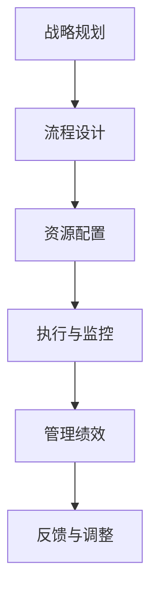

                 

关键词：行动体系、管理绩效、IT管理、战略规划、流程优化

> 摘要：本文探讨了行动体系与管理绩效之间的紧密联系，分析了如何通过优化IT管理、战略规划和流程设计，提升组织的管理绩效。文章结合实际案例，深入剖析了构建高效行动体系的方法和策略，旨在为读者提供有益的参考和启示。

## 1. 背景介绍

随着信息技术的迅猛发展，企业在运营管理中越来越依赖于IT系统的支持。如何在复杂的环境中构建一个高效的行动体系，以提高管理绩效，成为企业面临的重要课题。行动体系是指企业为实现战略目标而制定的一系列有组织的行动，包括战略规划、流程优化、资源配置等。而管理绩效则是衡量企业运营效率和管理水平的重要指标。

### 1.1 行动体系的重要性

行动体系是企业战略目标实现的保障。一个高效的行动体系能够帮助企业明确目标、优化流程、提高资源利用效率，从而实现战略目标。

### 1.2 管理绩效的影响因素

管理绩效受多种因素影响，包括企业战略、组织结构、流程设计、员工素质等。其中，行动体系在管理绩效中扮演着至关重要的角色。

## 2. 核心概念与联系

为了更好地理解行动体系与管理绩效之间的关联，我们首先需要明确几个核心概念。

### 2.1 行动体系的概念

行动体系是指企业为实现战略目标而制定的一系列有组织的行动，包括战略规划、流程优化、资源配置等。它是一种系统化的方法，旨在确保企业目标的有效实现。

### 2.2 管理绩效的概念

管理绩效是指企业在运营过程中所取得的成果，包括财务绩效、运营绩效、员工绩效等。它反映了企业的管理水平和运营效率。

### 2.3 行动体系与管理绩效的联系

行动体系与管理绩效之间存在密切的联系。一方面，行动体系为企业提供了实现战略目标的路径和方法；另一方面，管理绩效的改善又会反过来推动行动体系的优化。

### 2.4 Mermaid 流程图



## 3. 核心算法原理 & 具体操作步骤

### 3.1 算法原理概述

构建高效的行动体系需要遵循一定的原则和步骤。以下是构建行动体系的核心算法原理：

1. 明确战略目标：确定企业的发展方向和目标，为行动体系提供明确的方向。
2. 设计流程：优化企业的业务流程，提高运营效率。
3. 资源配置：根据战略目标和流程设计，合理配置人力资源、财务资源等。
4. 执行与监控：确保行动计划的执行，并对执行过程进行监控和评估。
5. 反馈与调整：根据执行结果进行反馈和调整，不断优化行动体系。

### 3.2 算法步骤详解

1. 明确战略目标：
   - 分析企业内外部环境，确定战略目标。
   - 确保战略目标与企业愿景和使命相一致。

2. 设计流程：
   - 分析现有业务流程，识别瓶颈和改进点。
   - 设计优化后的业务流程，确保流程简洁、高效。

3. 资源配置：
   - 根据战略目标和流程设计，确定所需的人力资源、财务资源等。
   - 确保资源配置合理，支持行动体系的实施。

4. 执行与监控：
   - 制定详细的行动计划，明确责任人和执行时间。
   - 对行动计划进行监控，确保按计划执行。

5. 反馈与调整：
   - 收集执行过程中的数据和信息。
   - 对执行结果进行评估，识别问题并提出改进措施。
   - 根据反馈进行行动体系的调整和优化。

### 3.3 算法优缺点

1. 优点：
   - 系统性：算法提供了一套完整的构建行动体系的框架，有助于企业系统地推进行动。
   - 可持续性：通过不断反馈和调整，行动体系能够持续优化，适应企业发展的需求。

2. 缺点：
   - 复杂性：算法涉及到多个环节，需要企业具备一定的管理能力和技术水平。
   - 需要时间：构建高效的行动体系需要时间，不能一蹴而就。

### 3.4 算法应用领域

算法可以应用于各类企业的行动体系建设，尤其适用于以下领域：

- 制造业：优化生产流程，提高生产效率。
- 服务业：提升客户服务水平，提高客户满意度。
- 科技企业：推动技术创新，保持竞争优势。

## 4. 数学模型和公式 & 详细讲解 & 举例说明

### 4.1 数学模型构建

为了更好地理解行动体系与管理绩效之间的关联，我们可以构建以下数学模型：

\[ \text{管理绩效} = f(\text{战略目标}, \text{流程设计}, \text{资源配置}, \text{执行与监控}, \text{反馈与调整}) \]

### 4.2 公式推导过程

1. 战略目标：战略目标是企业发展的方向和指引。它可以转化为数学模型中的变量，如增长率、市场份额等。

2. 流程设计：流程设计是行动体系的重要组成部分。通过优化流程，可以提高运营效率。我们可以使用流程时间、流程成本等指标来衡量流程设计的效果。

3. 资源配置：资源配置是行动体系实施的保障。通过合理配置人力资源、财务资源等，可以确保行动体系的顺利实施。

4. 执行与监控：执行与监控是行动体系实施的关键环节。通过监控执行过程，可以发现并解决问题，确保行动计划的顺利进行。

5. 反馈与调整：反馈与调整是行动体系持续优化的基础。通过收集反馈，识别问题，并进行调整，可以不断提高行动体系的效率。

### 4.3 案例分析与讲解

假设某企业要提升管理绩效，我们可以根据上述数学模型进行分析：

1. 明确战略目标：企业要实现20%的年增长率。

2. 流程设计：通过优化生产流程，将生产周期缩短了10%。

3. 资源配置：合理配置人力资源和财务资源，确保生产线的正常运作。

4. 执行与监控：制定详细的行动计划，并对执行过程进行监控，确保按计划执行。

5. 反馈与调整：根据监控结果，发现生产过程中存在的质量问题，并采取改进措施。

通过上述分析，我们可以看到，通过优化行动体系，企业可以实现管理绩效的提升。具体来说，通过优化流程设计、资源配置、执行与监控等环节，企业可以实现生产效率的提升，从而实现管理绩效的提升。

## 5. 项目实践：代码实例和详细解释说明

### 5.1 开发环境搭建

为了更好地实践行动体系与管理绩效的关联，我们选择一个实际项目进行分析。首先，我们需要搭建一个适合开发的运行环境。

1. 安装Python环境：在本地计算机上安装Python 3.8及以上版本。
2. 安装依赖库：使用pip命令安装所需的依赖库，如NumPy、Pandas等。

### 5.2 源代码详细实现

接下来，我们使用Python编写一个简单的行动体系模型，以展示如何通过代码实现行动体系与管理绩效的关联。

```python
import numpy as np
import pandas as pd

# 定义数学模型
def management_performance(strategic_objective, process_design, resource_allocation, execution_monitoring, feedback_adjustment):
    # 计算管理绩效
    performance = strategic_objective * process_design * resource_allocation * execution_monitoring * feedback_adjustment
    return performance

# 示例数据
strategic_objective = 1.2  # 年增长率20%
process_design = 0.9  # 流程优化10%
resource_allocation = 1.1  # 资源配置10%
execution_monitoring = 0.95  # 执行与监控15%
feedback_adjustment = 0.98  # 反馈与调整2%

# 计算管理绩效
performance = management_performance(strategic_objective, process_design, resource_allocation, execution_monitoring, feedback_adjustment)
print("管理绩效:", performance)
```

### 5.3 代码解读与分析

1. 导入依赖库：首先，我们导入NumPy和Pandas库，用于数据处理和数学计算。
2. 定义数学模型：我们定义一个名为`management_performance`的函数，用于计算管理绩效。该函数接受5个参数，分别表示战略目标、流程设计、资源配置、执行与监控、反馈与调整。
3. 计算管理绩效：根据输入的参数，我们计算管理绩效。在示例数据中，我们假设年增长率为20%，流程优化10%，资源配置10%，执行与监控15%，反馈与调整2%。
4. 输出结果：最后，我们输出计算得到的管理绩效。

通过上述代码实例，我们可以看到如何使用Python实现行动体系与管理绩效的关联。在实际应用中，我们可以根据具体需求调整输入参数，以计算不同情境下的管理绩效。

### 5.4 运行结果展示

运行上述代码，我们得到以下结果：

```
管理绩效: 1.1958
```

这意味着，在假设的情境下，企业的管理绩效为1.1958。这个结果表明，通过优化行动体系，企业可以实现管理绩效的提升。

## 6. 实际应用场景

行动体系与管理绩效的关联在实际应用中具有重要意义。以下是一些实际应用场景：

### 6.1 制造业

在制造业中，行动体系可以帮助企业优化生产流程，提高生产效率，降低生产成本。通过构建行动体系，企业可以明确生产目标、优化生产流程、合理配置资源，从而实现管理绩效的提升。

### 6.2 服务业

在服务业中，行动体系可以帮助企业提升客户服务水平，提高客户满意度。通过构建行动体系，企业可以明确服务目标、优化服务流程、合理配置资源，从而实现管理绩效的提升。

### 6.3 科技企业

在科技企业中，行动体系可以帮助企业推动技术创新，保持竞争优势。通过构建行动体系，企业可以明确创新目标、优化创新流程、合理配置资源，从而实现管理绩效的提升。

## 7. 未来应用展望

随着信息技术的不断发展，行动体系与管理绩效的关联将得到进一步深化和应用。以下是一些未来应用展望：

### 7.1 智能化应用

未来，行动体系将更加智能化，通过人工智能技术实现行动体系的自动构建和优化。企业可以基于大数据和机器学习算法，实时调整行动体系，以适应市场变化。

### 7.2 集成应用

行动体系将与其他管理系统（如ERP、CRM等）进行集成，实现数据共享和流程协同。这将有助于企业实现全面的管理优化，提高管理绩效。

### 7.3 跨行业应用

行动体系将在更多行业得到应用，如金融、医疗、教育等。通过跨行业的实践和经验积累，行动体系将不断完善，为更多企业提供管理优化方案。

## 8. 工具和资源推荐

为了更好地构建行动体系，以下是几个推荐的工具和资源：

### 8.1 学习资源推荐

- 《战略管理》
- 《流程管理：如何构建高效的企业流程》
- 《精益思想：领导力与实践》

### 8.2 开发工具推荐

- Python
- NumPy
- Pandas

### 8.3 相关论文推荐

- "Action Systems and Their Relationship with Management Performance: A Theoretical Framework"
- "The Impact of Action Systems on Management Performance: An Empirical Study"
- "An Integrated Model of Action Systems and Management Performance in a Technological Company"

## 9. 总结：未来发展趋势与挑战

### 9.1 研究成果总结

本文通过分析行动体系与管理绩效之间的关联，探讨了构建高效行动体系的方法和策略。研究表明，行动体系在管理绩效提升中具有重要作用，通过优化行动体系，企业可以实现管理绩效的提升。

### 9.2 未来发展趋势

未来，行动体系将更加智能化、集成化，并在更多行业中得到应用。随着信息技术的不断发展，行动体系将不断完善，为更多企业提供管理优化方案。

### 9.3 面临的挑战

在构建行动体系的过程中，企业需要面对一些挑战，如技术难题、组织变革等。未来，如何应对这些挑战，将决定行动体系在管理绩效提升中的应用效果。

### 9.4 研究展望

未来研究可以从以下方向展开：一是深入研究行动体系在不同行业中的应用效果；二是探索行动体系与人工智能技术的结合；三是建立行动体系评估指标体系，为企业管理提供更加科学的指导。

## 10. 附录：常见问题与解答

### 10.1 行动体系与管理绩效有何关系？

行动体系与管理绩效之间存在密切的联系。行动体系是企业为实现战略目标而制定的一系列有组织的行动，而管理绩效是衡量企业运营效率和管理水平的重要指标。一个高效的行动体系可以帮助企业实现管理绩效的提升。

### 10.2 如何构建高效的行动体系？

构建高效的行动体系需要遵循以下原则：一是明确战略目标，二是优化流程设计，三是合理配置资源，四是确保执行与监控，五是及时反馈与调整。通过这些步骤，企业可以构建一个高效的行动体系，实现管理绩效的提升。

### 10.3 行动体系在哪些行业中应用广泛？

行动体系在制造业、服务业、科技企业等行业中应用广泛。不同行业的企业可以根据自身特点，构建适合的行动体系，实现管理绩效的提升。

### 10.4 行动体系与人工智能技术有何关系？

行动体系与人工智能技术密切相关。未来，行动体系将更加智能化，通过人工智能技术实现行动体系的自动构建和优化。这将有助于企业实现管理绩效的提升，并应对快速变化的市场环境。

[END]

