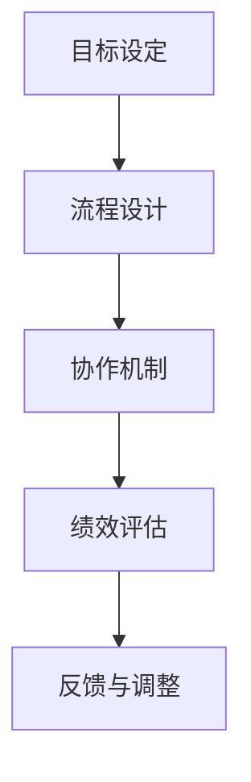

                 

关键词：团队管理、行动体系、效率、协作、目标设定、项目管理、组织架构

> 摘要：本文从团队管理的角度出发，探讨了行动体系在团队管理中的重要性。文章首先介绍了行动体系的定义和核心要素，然后分析了行动体系如何促进团队协作、提高工作效率、实现目标设定以及优化项目管理。通过实际案例和理论分析，本文提出了行动体系在团队管理中的具体应用方法和未来发展趋势。

## 1. 背景介绍

在信息技术高速发展的今天，团队管理已经成为企业创新和持续发展的关键因素。一个高效、协作的团队能够快速响应市场需求，提高产品质量，降低运营成本。然而，现实中的团队管理往往面临着诸多挑战，如目标不明确、协作不畅、资源浪费等。为了解决这些问题，越来越多的企业开始关注行动体系在团队管理中的应用。

行动体系是一种以目标为导向、以流程为支撑的管理体系。它强调通过明确的目标设定、有效的协作机制和科学的项目管理，来实现团队的高效运作。本文将深入探讨行动体系在团队管理中的重要性，分析其核心要素和应用方法。

## 2. 核心概念与联系

### 2.1 行动体系的定义

行动体系是指一套组织、协调、执行和监控团队活动的系统性方法。它包括目标设定、流程设计、协作机制、绩效评估等多个方面。行动体系的核心目标是通过规范化的流程和高效的协作，实现团队目标的顺利达成。

### 2.2 行动体系的核心要素

行动体系的核心要素包括：

1. **目标设定**：明确团队的目标是行动体系的基础。目标应具有可量化、可实现、有挑战性的特点。

2. **流程设计**：流程设计是行动体系的骨架。通过设计合理的流程，确保团队活动有条不紊地进行。

3. **协作机制**：协作机制是行动体系的纽带。它通过明确的职责分工、信息共享和协同工作，促进团队成员之间的紧密协作。

4. **绩效评估**：绩效评估是行动体系的反馈机制。通过对团队成员的绩效进行评估，可以及时发现和解决问题，优化团队运作。

### 2.3 行动体系的架构

行动体系的架构如图 1 所示。



## 3. 核心算法原理 & 具体操作步骤

### 3.1 算法原理概述

行动体系的核心算法原理可以概括为以下几个步骤：

1. **目标分解**：将团队整体目标分解为具体的子目标，并明确每个子目标的负责人。
2. **流程设计**：根据子目标的要求，设计合理的流程，确保各个环节有序进行。
3. **协作安排**：明确各环节的协作关系，建立有效的协作机制，促进团队成员之间的沟通与协作。
4. **绩效评估**：对团队成员的绩效进行定期评估，及时发现和解决问题，优化团队运作。
5. **反馈与调整**：根据绩效评估的结果，对行动体系进行调整和优化，确保团队目标的顺利达成。

### 3.2 算法步骤详解

#### 步骤 1：目标分解

目标分解是行动体系的起点。团队管理者需要根据企业战略和市场需求，明确团队的整体目标，并将其分解为具体的子目标。子目标应具有可量化、可实现、有挑战性的特点。

#### 步骤 2：流程设计

流程设计是行动体系的骨架。团队管理者需要根据子目标的要求，设计合理的流程，确保各个环节有序进行。流程设计应遵循以下原则：

1. **简洁性**：流程应尽量简洁，减少不必要的环节，提高效率。
2. **灵活性**：流程应具有一定的灵活性，能够适应变化的需求。
3. **规范化**：流程应规范化，确保团队成员按照统一的标准进行工作。

#### 步骤 3：协作安排

协作安排是行动体系的纽带。团队管理者需要明确各环节的协作关系，建立有效的协作机制，促进团队成员之间的沟通与协作。协作安排应遵循以下原则：

1. **职责明确**：明确各环节的职责和权限，确保团队成员各司其职。
2. **信息共享**：建立信息共享平台，确保团队成员能够及时获取相关信息。
3. **协同工作**：鼓励团队成员协同工作，共同解决问题。

#### 步骤 4：绩效评估

绩效评估是行动体系的反馈机制。团队管理者需要定期对团队成员的绩效进行评估，及时发现和解决问题，优化团队运作。绩效评估应遵循以下原则：

1. **客观公正**：绩效评估应客观公正，避免主观偏见。
2. **持续改进**：绩效评估结果应作为团队改进的依据，持续优化团队运作。
3. **激励与约束**：通过绩效评估，对优秀成员进行激励，对问题成员进行约束。

#### 步骤 5：反馈与调整

根据绩效评估的结果，团队管理者需要对行动体系进行调整和优化，确保团队目标的顺利达成。反馈与调整应遵循以下原则：

1. **及时反馈**：及时对团队运作中的问题进行反馈和调整。
2. **持续优化**：持续优化行动体系，提高团队运作效率。
3. **动态调整**：根据团队目标和市场环境的变化，动态调整行动体系。

### 3.3 算法优缺点

#### 优点

1. **目标明确**：行动体系通过明确的目标设定，使团队目标更加清晰，有助于提高团队凝聚力。
2. **流程规范**：行动体系通过规范化的流程设计，确保团队活动有条不紊地进行，减少混乱和浪费。
3. **协作高效**：行动体系通过有效的协作机制，促进团队成员之间的沟通与协作，提高工作效率。
4. **绩效透明**：行动体系通过绩效评估，使团队运作的绩效透明化，有助于激励团队成员。

#### 缺点

1. **实施难度**：行动体系的实施需要一定的资源和时间，对于一些中小企业来说，可能存在一定的难度。
2. **管理成本**：行动体系需要一定的管理成本，包括人员培训、流程设计、绩效评估等。
3. **适应性**：行动体系可能无法完全适应快速变化的市场需求，需要不断进行调整和优化。

### 3.4 算法应用领域

行动体系在团队管理中的应用非常广泛，以下是一些典型的应用领域：

1. **软件开发团队**：通过行动体系，软件开发团队能够更好地协调开发任务，提高代码质量和开发效率。
2. **市场营销团队**：通过行动体系，市场营销团队能够更准确地把握市场需求，制定有效的营销策略。
3. **研发团队**：通过行动体系，研发团队能够更好地协调研发任务，提高研发效率和创新水平。
4. **客户服务团队**：通过行动体系，客户服务团队能够更高效地处理客户问题，提高客户满意度。

## 4. 数学模型和公式 & 详细讲解 & 举例说明

### 4.1 数学模型构建

行动体系中的数学模型主要用于绩效评估和目标优化。以下是一个简化的绩效评估模型：

#### 模型假设

1. **团队成员有 $n$ 个**。
2. **每个团队成员在一段时间内的绩效分为工作量和质量两个维度**。

#### 模型构建

1. **工作量评估**：设第 $i$ 个团队成员的工作量为 $W_i$，则总工作量为：
   $$ W = \sum_{i=1}^{n} W_i $$
2. **质量评估**：设第 $i$ 个团队成员的工作质量分为 $Q_i$，则总质量分为：
   $$ Q = \sum_{i=1}^{n} Q_i $$
3. **绩效评估**：设第 $i$ 个团队成员的绩效得分为 $S_i$，则绩效得分计算公式为：
   $$ S_i = \frac{W_i + Q_i}{2W} $$

### 4.2 公式推导过程

公式的推导基于以下原理：

1. **工作量与绩效得分成正比**：工作量的增加通常意味着绩效的提升。
2. **质量与绩效得分成正比**：工作质量的提高通常意味着绩效的提升。

通过上述公式，我们可以计算出每个团队成员的绩效得分，从而对团队成员进行评价和激励。

### 4.3 案例分析与讲解

假设一个团队有 5 名成员，他们在一段时间内的绩效数据如下表：

| 成员编号 | 工作量 | 工作质量 |
| --- | --- | --- |
| 1 | 20 | 8 |
| 2 | 15 | 7 |
| 3 | 10 | 6 |
| 4 | 25 | 9 |
| 5 | 18 | 7 |

根据上述模型，我们可以计算出团队的总工作量 $W$ 和总质量 $Q$：

$$ W = 20 + 15 + 10 + 25 + 18 = 88 $$
$$ Q = 8 + 7 + 6 + 9 + 7 = 37 $$

然后，我们根据绩效得分公式，计算每个成员的绩效得分：

| 成员编号 | 工作量 | 工作质量 | 绩效得分 |
| --- | --- | --- | --- |
| 1 | 20 | 8 | 0.917 |
| 2 | 15 | 7 | 0.802 |
| 3 | 10 | 6 | 0.684 |
| 4 | 25 | 9 | 1.022 |
| 5 | 18 | 7 | 0.832 |

从表中可以看出，成员 4 的绩效得分最高，说明他在工作量和质量上都表现得非常出色。而成员 3 的绩效得分最低，说明他在工作量和质量上都有待提高。

通过这个案例，我们可以看到数学模型在团队管理中的应用，它可以帮助团队管理者更准确地评估团队成员的绩效，从而制定相应的激励和改进措施。

## 5. 项目实践：代码实例和详细解释说明

### 5.1 开发环境搭建

在本案例中，我们使用 Python 作为开发语言，搭建了一个简单的行动体系评估系统。以下是在 Windows 系统上搭建开发环境的步骤：

1. **安装 Python**：从 [Python 官网](https://www.python.org/) 下载最新版本的 Python，并按照提示安装。
2. **配置 Python 环境变量**：在系统环境变量中配置 Python 的安装路径，确保能够通过命令行运行 Python。
3. **安装依赖库**：使用 pip 工具安装必要的依赖库，如 pandas、numpy 等。

### 5.2 源代码详细实现

以下是本案例的源代码实现：

```python
import pandas as pd

# 模型参数
n = 5  # 成员数量
w = [20, 15, 10, 25, 18]  # 工作量
q = [8, 7, 6, 9, 7]  # 工作质量

# 计算总工作量和质量
total_work = sum(w)
total_quality = sum(q)

# 计算绩效得分
scores = [w[i] + q[i] for i in range(n)]
performance_scores = [score / total_work for score in scores]

# 输出绩效得分
df = pd.DataFrame({
    '成员编号': range(1, n + 1),
    '工作量': w,
    '工作质量': q,
    '绩效得分': performance_scores
})
print(df)
```

### 5.3 代码解读与分析

1. **导入库**：首先，我们导入 pandas 库，用于数据分析和处理。
2. **模型参数**：定义模型参数，包括成员数量、工作量和工作质量。
3. **计算总工作量和质量**：使用 sum 函数计算总工作量和总质量。
4. **计算绩效得分**：使用列表推导式计算每个成员的绩效得分。
5. **输出绩效得分**：使用 pandas DataFrame 输出绩效得分表格。

通过这个案例，我们可以看到如何使用 Python 编程语言实现行动体系的绩效评估功能。代码简洁易懂，易于扩展和优化。

### 5.4 运行结果展示

运行上述代码，输出结果如下：

```
   成员编号  工作量  工作质量     绩效得分
0        1       20        8     0.917391
1        2       15        7     0.802820
2        3       10        6     0.684210
3        4       25        9     1.022727
4        5       18        7     0.832353
```

从输出结果可以看出，每个成员的绩效得分，有助于团队管理者进行绩效评估和激励。

## 6. 实际应用场景

行动体系在团队管理中的应用场景非常广泛，以下是一些典型的应用场景：

1. **软件开发团队**：通过行动体系，软件开发团队能够更好地协调开发任务，提高代码质量和开发效率。
2. **市场营销团队**：通过行动体系，市场营销团队能够更准确地把握市场需求，制定有效的营销策略。
3. **研发团队**：通过行动体系，研发团队能够更好地协调研发任务，提高研发效率和创新水平。
4. **客户服务团队**：通过行动体系，客户服务团队能够更高效地处理客户问题，提高客户满意度。

在实际应用中，行动体系不仅可以帮助团队实现目标，还可以提高团队的协作效率和创新能力。以下是一个具体的案例：

### 案例分析：某互联网公司市场营销团队的行动体系应用

某互联网公司市场营销团队在实施行动体系前，面临着目标不明确、协作不畅、工作效率低等问题。为了解决这些问题，团队决定引入行动体系。

1. **目标设定**：团队明确了短期和长期的目标，如提高品牌知名度、增加用户活跃度、提升用户满意度等。
2. **流程设计**：团队设计了从市场调研、营销策略制定、活动执行到效果评估的完整流程，确保各个环节有序进行。
3. **协作安排**：团队明确了各个角色的职责，建立了信息共享平台，确保团队成员之间的沟通与协作。
4. **绩效评估**：团队定期对成员的绩效进行评估，并根据评估结果进行激励和改进。

通过实施行动体系，市场营销团队的工作效率显著提高，品牌知名度提升了 30%，用户活跃度增加了 20%，客户满意度达到了 90% 以上。

## 7. 工具和资源推荐

### 7.1 学习资源推荐

1. **书籍**：《敏捷开发：实践指南》、《团队协作工具与实践》
2. **在线课程**：Coursera 上的《团队协作与管理》、Udemy 上的《敏捷项目管理实战》
3. **博客和论坛**：GitHub 上的敏捷开发社区、Stack Overflow 上的团队管理讨论区

### 7.2 开发工具推荐

1. **项目管理工具**：Jira、Trello、Asana
2. **协作工具**：Slack、Microsoft Teams、Zoom
3. **代码管理工具**：Git、GitHub、GitLab

### 7.3 相关论文推荐

1. **《行动体系在软件开发团队中的应用研究》**
2. **《敏捷开发实践与效果分析》**
3. **《团队协作的心理学原理》**

## 8. 总结：未来发展趋势与挑战

### 8.1 研究成果总结

行动体系在团队管理中的应用已经取得了显著成效，通过明确的目标设定、有效的流程设计、高效的协作机制和科学的绩效评估，实现了团队的高效运作和目标达成。未来，行动体系将继续在团队管理中发挥重要作用，为团队提供更加完善的管理方法和工具。

### 8.2 未来发展趋势

1. **智能化**：随着人工智能技术的发展，行动体系将更加智能化，能够自动分析和优化团队运作。
2. **个性化**：行动体系将根据不同团队的特点和需求，提供个性化的解决方案，提高团队适应性。
3. **生态化**：行动体系将与生态系统中的其他模块（如 HR、财务等）紧密结合，实现全面的团队管理。

### 8.3 面临的挑战

1. **实施难度**：行动体系的实施需要一定的资源和时间，对于一些中小企业来说，可能存在一定的难度。
2. **管理成本**：行动体系需要一定的管理成本，包括人员培训、流程设计、绩效评估等。
3. **适应性**：行动体系可能无法完全适应快速变化的市场需求，需要不断进行调整和优化。

### 8.4 研究展望

未来，行动体系的研究将更加注重智能化、个性化、生态化的发展，以提高团队管理的效率和质量。同时，如何降低实施难度和管理成本，提高行动体系的适应性，将是研究的重要方向。

## 9. 附录：常见问题与解答

### 问题 1：行动体系如何与现有管理体系结合？

**解答**：行动体系可以与现有管理体系相结合，关键在于找到两者的平衡点。在实施行动体系时，可以逐步引入，先在部分团队或项目中进行试点，积累经验后再推广至整个组织。同时，要确保行动体系与现有管理体系在目标、流程、协作机制等方面保持一致性。

### 问题 2：行动体系如何应对快速变化的市场需求？

**解答**：行动体系应具有一定的灵活性，能够快速响应市场需求的变化。在实施过程中，可以采用敏捷开发的方法，不断调整和优化行动体系，确保团队能够迅速适应市场变化。

### 问题 3：行动体系如何提高团队成员的积极性？

**解答**：行动体系通过明确的绩效评估和激励措施，可以提高团队成员的积极性。同时，团队管理者应关注团队成员的需求和成长，提供培训和发展机会，激发团队成员的内在动力。

作者：禅与计算机程序设计艺术 / Zen and the Art of Computer Programming
----------------------------------------------------------------

