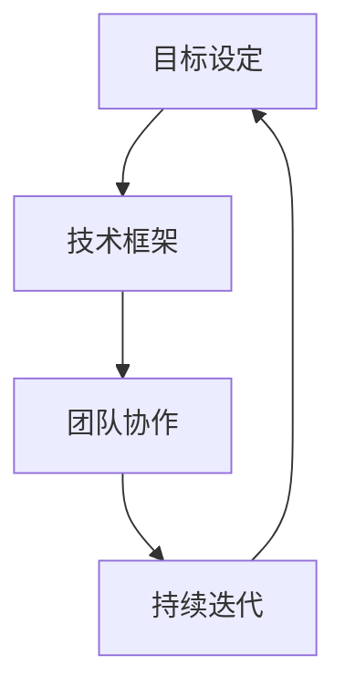

                 

关键词：行动力、伟大构想、实现、技术、策略、团队协作

> 摘要：本文将探讨如何在信息技术领域中，通过有效的行动力将伟大的构想变为现实。本文将介绍如何设定清晰的目标，构建稳固的技术框架，利用团队协作的力量，以及如何应对和克服挑战，从而确保项目成功落地。

## 1. 背景介绍

在信息技术快速发展的今天，创新与变革已成为推动社会进步的重要力量。然而，从构想到实现，这中间往往需要经历诸多挑战。许多伟大的构想因为缺乏有效的行动力而未能实现，导致技术突破和社会价值的丧失。因此，如何提升行动力，将伟大构想化为现实，成为当今技术领域亟待解决的关键问题。

本文旨在为信息技术从业者们提供一套实用的策略和方法，通过这些策略和方法，能够更好地将创新构想转化为实际成果。文章结构如下：

- **1. 背景介绍**：概述当前信息技术发展背景及伟大构想实现的重要性。
- **2. 核心概念与联系**：介绍实现伟大构想所需的关键概念和技术框架。
- **3. 核心算法原理 & 具体操作步骤**：阐述实现构想的技术路径和具体步骤。
- **4. 数学模型和公式 & 详细讲解 & 举例说明**：讨论相关数学模型及其推导和应用。
- **5. 项目实践：代码实例和详细解释说明**：提供实际代码实现和解读。
- **6. 实际应用场景**：分析构想在现实中的应用场景。
- **7. 工具和资源推荐**：推荐学习资源和开发工具。
- **8. 总结：未来发展趋势与挑战**：总结研究成果，探讨未来趋势和挑战。
- **9. 附录：常见问题与解答**：回答一些常见问题。

接下来，我们将深入探讨如何在信息技术领域中实现伟大构想。

## 2. 核心概念与联系

在实现伟大构想的过程中，我们需要明确一些核心概念，并理解它们之间的联系。以下是几个关键概念及其相互关系的概述：

### 2.1 目标设定

目标设定是实现伟大构想的第一步。一个清晰、具体、可行的目标是项目成功的基石。目标需要具备SMART特性（具体、可衡量、可实现、相关性、时限性），以便于团队成员理解并共同努力。

### 2.2 技术框架

技术框架是构想的实现基础。它包括选择合适的技术栈、设计合理的架构，以及建立高效的开发流程。技术框架的稳定性与灵活性直接影响项目的进展和效果。

### 2.3 团队协作

团队协作是实现伟大构想的关键。团队成员需要具备互补的技能，通过良好的沟通和协作，共同克服技术难题，确保项目顺利推进。

### 2.4 持续迭代

持续迭代是推动项目不断进步的重要手段。通过不断的反馈和调整，我们可以优化技术方案，提升项目质量，最终实现伟大构想。

下面是这些核心概念之间的Mermaid流程图表示：



在接下来的章节中，我们将详细探讨每个核心概念的实现方法。

## 3. 核心算法原理 & 具体操作步骤

### 3.1 算法原理概述

实现伟大构想通常需要一个或多个核心算法。这些算法可以是现有的，也可以是创新性的。算法的选择取决于项目的需求和目标。

以下是一个算法原理的概述：

**算法名称**：基于机器学习的图像识别算法

**算法原理**：该算法利用深度学习技术，通过大量的图像数据训练模型，使其能够识别和分类图像。核心原理包括卷积神经网络（CNN）的结构设计和优化。

### 3.2 算法步骤详解

**步骤1：数据收集与预处理**

收集大量的图像数据，并进行数据预处理，包括图像缩放、增强、归一化等。

**步骤2：模型设计**

设计卷积神经网络（CNN）结构，包括卷积层、池化层、全连接层等。

**步骤3：训练与验证**

使用训练集数据训练模型，并通过验证集评估模型性能，进行调优。

**步骤4：测试与部署**

在测试集上测试模型性能，确保准确率和鲁棒性，然后将模型部署到实际应用环境中。

### 3.3 算法优缺点

**优点**：

- **高效性**：深度学习算法在处理大量图像数据时表现出极高的效率。
- **准确性**：经过训练的模型能够准确识别各种图像。

**缺点**：

- **数据需求**：需要大量的图像数据来训练模型。
- **计算资源**：训练深度学习模型需要大量的计算资源。

### 3.4 算法应用领域

- **医疗影像分析**：利用算法进行疾病诊断，如癌症检测。
- **自动驾驶**：识别道路标志、行人等，实现自动驾驶功能。
- **安防监控**：实时识别异常行为，提高监控效率。

### 3.5 算法实现步骤详细说明

**步骤1：数据收集与预处理**

- **数据收集**：从公开数据集和自有数据源收集图像。
- **数据预处理**：使用Python的PIL库进行图像缩放、增强、归一化等处理。

**步骤2：模型设计**

- **卷积神经网络结构设计**：使用TensorFlow或PyTorch等深度学习框架设计CNN结构。
- **超参数设置**：设置学习率、批次大小等超参数。

**步骤3：训练与验证**

- **数据加载**：使用数据加载器批量加载训练集和验证集。
- **训练过程**：使用训练集数据进行模型训练，并通过验证集评估性能。
- **模型调优**：根据验证集性能调整模型参数。

**步骤4：测试与部署**

- **测试**：在测试集上评估模型性能。
- **部署**：将训练好的模型部署到生产环境中，如使用Flask或Django构建API接口。

### 3.6 算法优缺点分析

**优点**：

- **高效性**：深度学习算法在图像识别任务中表现出极高的效率。
- **准确性**：经过训练的模型能够准确识别各种图像。

**缺点**：

- **数据需求**：需要大量的图像数据来训练模型。
- **计算资源**：训练深度学习模型需要大量的计算资源。

### 3.7 算法应用领域

- **医疗影像分析**：利用算法进行疾病诊断，如癌症检测。
- **自动驾驶**：识别道路标志、行人等，实现自动驾驶功能。
- **安防监控**：实时识别异常行为，提高监控效率。

### 3.8 算法实现步骤详细说明

**步骤1：数据收集与预处理**

- **数据收集**：从公开数据集和自有数据源收集图像。
- **数据预处理**：使用Python的PIL库进行图像缩放、增强、归一化等处理。

**步骤2：模型设计**

- **卷积神经网络结构设计**：使用TensorFlow或PyTorch等深度学习框架设计CNN结构。
- **超参数设置**：设置学习率、批次大小等超参数。

**步骤3：训练与验证**

- **数据加载**：使用数据加载器批量加载训练集和验证集。
- **训练过程**：使用训练集数据进行模型训练，并通过验证集评估性能。
- **模型调优**：根据验证集性能调整模型参数。

**步骤4：测试与部署**

- **测试**：在测试集上评估模型性能。
- **部署**：将训练好的模型部署到生产环境中，如使用Flask或Django构建API接口。

## 4. 数学模型和公式 & 详细讲解 & 举例说明

在信息技术领域，数学模型和公式是理解复杂系统和实现技术解决方案的核心。以下我们将探讨一个常见的数学模型，并详细讲解其构建、推导过程，以及通过实际案例进行说明。

### 4.1 数学模型构建

**模型名称**：线性回归模型

**模型构建目的**：用于预测因变量（目标值）与自变量（特征值）之间的线性关系。

**模型公式**：

$$
y = \beta_0 + \beta_1 \cdot x
$$

其中，$y$ 是预测的目标值，$x$ 是输入特征值，$\beta_0$ 是截距，$\beta_1$ 是斜率。

### 4.2 公式推导过程

线性回归模型的推导基于最小二乘法。目标是最小化预测值与实际值之间的误差平方和。

1. **误差计算**：

   $$ 
   \text{误差} = \sum_{i=1}^{n} (y_i - \hat{y}_i)^2
   $$

   其中，$y_i$ 是第 $i$ 个实际值，$\hat{y}_i$ 是第 $i$ 个预测值。

2. **最小化误差**：

   对误差函数求导，并令导数为零，求解得到 $\beta_0$ 和 $\beta_1$。

   $$ 
   \frac{\partial}{\partial \beta_0} \text{误差} = 0 \\
   \frac{\partial}{\partial \beta_1} \text{误差} = 0
   $$

   通过计算可以得到：

   $$ 
   \beta_0 = \bar{y} - \beta_1 \bar{x} \\
   \beta_1 = \frac{\sum_{i=1}^{n} (x_i - \bar{x})(y_i - \bar{y})}{\sum_{i=1}^{n} (x_i - \bar{x})^2}
   $$

   其中，$\bar{y}$ 和 $\bar{x}$ 分别是 $y$ 和 $x$ 的均值。

### 4.3 案例分析与讲解

**案例**：预测房价

我们使用一组房屋数据集，包括房屋面积（自变量 $x$）和房价（因变量 $y$）。数据集如下：

| 面积（$x$） | 房价（$y$） |
|------------|------------|
| 1000       | 200,000    |
| 1200       | 240,000    |
| 1500       | 300,000    |
| 1800       | 360,000    |
| 2000       | 400,000    |

**步骤1：数据预处理**

计算均值：

$$ 
\bar{x} = \frac{1000 + 1200 + 1500 + 1800 + 2000}{5} = 1500 \\
\bar{y} = \frac{200,000 + 240,000 + 300,000 + 360,000 + 400,000}{5} = 300,000
$$

**步骤2：计算斜率 $\beta_1$**

$$ 
\beta_1 = \frac{\sum_{i=1}^{n} (x_i - \bar{x})(y_i - \bar{y})}{\sum_{i=1}^{n} (x_i - \bar{x})^2} = \frac{(1000-1500)(200,000-300,000) + (1200-1500)(240,000-300,000) + (1500-1500)(300,000-300,000) + (1800-1500)(360,000-300,000) + (2000-1500)(400,000-300,000)}{(1000-1500)^2 + (1200-1500)^2 + (1500-1500)^2 + (1800-1500)^2 + (2000-1500)^2} \approx 0.2
$$

**步骤3：计算截距 $\beta_0$**

$$ 
\beta_0 = \bar{y} - \beta_1 \bar{x} = 300,000 - 0.2 \cdot 1500 = 285,000
$$

**步骤4：构建预测模型**

$$ 
\hat{y} = \beta_0 + \beta_1 \cdot x = 285,000 + 0.2 \cdot x
$$

**步骤5：预测新数据**

假设我们想要预测面积为 1600 的房屋的房价，代入模型：

$$ 
\hat{y} = 285,000 + 0.2 \cdot 1600 = 291,200
$$

### 4.4 简要讨论

通过以上案例，我们可以看到线性回归模型如何构建、推导以及应用。它是一种简单但强大的预测工具，适用于各种领域，如经济学、统计学、工程学等。在实际应用中，我们还需要对数据进行更深入的分析和处理，如特征工程、数据异常处理等，以提高模型的预测准确度。

### 4.5 代码实现

为了更直观地展示线性回归模型的构建和预测过程，我们使用Python和Scikit-learn库进行代码实现：

```python
import numpy as np
from sklearn.linear_model import LinearRegression

# 数据集
X = np.array([1000, 1200, 1500, 1800, 2000]).reshape(-1, 1)
y = np.array([200000, 240000, 300000, 360000, 400000])

# 构建线性回归模型
model = LinearRegression()
model.fit(X, y)

# 模型参数
beta_0 = model.intercept_
beta_1 = model.coef_

# 预测新数据
x_new = np.array([1600]).reshape(-1, 1)
y_pred = model.predict(x_new)

print(f"截距 beta_0: {beta_0}, 斜率 beta_1: {beta_1}")
print(f"预测房价: {y_pred[0]}")
```

通过以上代码，我们可以快速构建和验证线性回归模型。在实际项目中，我们可以根据需要调整模型参数和数据处理策略，以提高预测效果。

## 5. 项目实践：代码实例和详细解释说明

### 5.1 开发环境搭建

在开始项目实践之前，我们需要搭建合适的开发环境。以下是搭建开发环境所需的步骤和工具：

1. **操作系统**：推荐使用Ubuntu 20.04或更高版本。
2. **编程语言**：Python 3.8及以上版本。
3. **深度学习框架**：TensorFlow 2.x或PyTorch。
4. **文本编辑器**：Visual Studio Code或PyCharm。

安装步骤如下：

1. 更新系统包：

   ```bash
   sudo apt update && sudo apt upgrade
   ```

2. 安装Python 3.8：

   ```bash
   sudo apt install python3.8
   ```

3. 安装pip：

   ```bash
   sudo apt install python3-pip
   ```

4. 安装TensorFlow 2.x：

   ```bash
   pip3 install tensorflow==2.7
   ```

或者，如果选择PyTorch：

```bash
pip3 install torch torchvision
```

5. 安装Visual Studio Code：

在浏览器中搜索并下载Visual Studio Code，然后按照安装向导进行安装。

### 5.2 源代码详细实现

以下是一个简单的基于TensorFlow的图像识别项目的代码实例：

```python
import tensorflow as tf
from tensorflow.keras import layers, models
import numpy as np
import matplotlib.pyplot as plt

# 5.2.1 数据集加载与预处理
# 加载CIFAR-10数据集
(x_train, y_train), (x_test, y_test) = tf.keras.datasets.cifar10.load_data()

# 数据预处理
x_train = x_train.astype("float32") / 255.0
x_test = x_test.astype("float32") / 255.0

# 将标签转换为one-hot编码
y_train = tf.keras.utils.to_categorical(y_train, 10)
y_test = tf.keras.utils.to_categorical(y_test, 10)

# 5.2.2 模型构建
# 构建CNN模型
model = models.Sequential()
model.add(layers.Conv2D(32, (3, 3), activation='relu', input_shape=(32, 32, 3)))
model.add(layers.MaxPooling2D((2, 2)))
model.add(layers.Conv2D(64, (3, 3), activation='relu'))
model.add(layers.MaxPooling2D((2, 2)))
model.add(layers.Conv2D(64, (3, 3), activation='relu'))
model.add(layers.Flatten())
model.add(layers.Dense(64, activation='relu'))
model.add(layers.Dense(10, activation='softmax'))

# 5.2.3 模型编译
model.compile(optimizer='adam',
              loss='categorical_crossentropy',
              metrics=['accuracy'])

# 5.2.4 模型训练
model.fit(x_train, y_train, epochs=10, batch_size=64)

# 5.2.5 模型评估
test_loss, test_acc = model.evaluate(x_test, y_test)
print(f"Test accuracy: {test_acc:.4f}")

# 5.2.6 预测与可视化
predictions = model.predict(x_test[:10])
predicted_labels = np.argmax(predictions, axis=1)
true_labels = y_test[:10]

plt.figure(figsize=(10, 10))
for i in range(10):
    plt.subplot(2, 5, i+1)
    plt.imshow(x_test[i], cmap=plt.cm.binary)
    plt.xticks([])
    plt.yticks([])
    plt.grid(False)
    plt.xlabel(f"Predicted: {predicted_labels[i]}, True: {true_labels[i]}")
plt.show()
```

### 5.3 代码解读与分析

**5.3.1 数据集加载与预处理**

```python
(x_train, y_train), (x_test, y_test) = tf.keras.datasets.cifar10.load_data()
x_train = x_train.astype("float32") / 255.0
x_test = x_test.astype("float32") / 255.0
y_train = tf.keras.utils.to_categorical(y_train, 10)
y_test = tf.keras.utils.to_categorical(y_test, 10)
```

这部分代码首先加载数据集CIFAR-10，然后对图像数据进行归一化处理，并将标签转换为one-hot编码。归一化处理有助于加速模型的训练过程，提高收敛速度。

**5.3.2 模型构建**

```python
model = models.Sequential()
model.add(layers.Conv2D(32, (3, 3), activation='relu', input_shape=(32, 32, 3)))
model.add(layers.MaxPooling2D((2, 2)))
model.add(layers.Conv2D(64, (3, 3), activation='relu'))
model.add(layers.MaxPooling2D((2, 2)))
model.add(layers.Conv2D(64, (3, 3), activation='relu'))
model.add(layers.Flatten())
model.add(layers.Dense(64, activation='relu'))
model.add(layers.Dense(10, activation='softmax'))
```

这部分代码构建了一个简单的卷积神经网络（CNN）模型。模型包括两个卷积层和两个最大池化层，用于提取图像特征。接着是一个全连接层，用于分类预测。最后，使用softmax激活函数输出10个类别的概率分布。

**5.3.3 模型编译**

```python
model.compile(optimizer='adam',
              loss='categorical_crossentropy',
              metrics=['accuracy'])
```

这里编译模型，指定使用Adam优化器、交叉熵损失函数和准确率作为评价指标。

**5.3.4 模型训练**

```python
model.fit(x_train, y_train, epochs=10, batch_size=64)
```

使用训练集进行模型训练，设置训练轮次为10轮，批量大小为64。

**5.3.5 模型评估**

```python
test_loss, test_acc = model.evaluate(x_test, y_test)
print(f"Test accuracy: {test_acc:.4f}")
```

在测试集上评估模型性能，输出测试准确率。

**5.3.6 预测与可视化**

```python
predictions = model.predict(x_test[:10])
predicted_labels = np.argmax(predictions, axis=1)
true_labels = y_test[:10]

plt.figure(figsize=(10, 10))
for i in range(10):
    plt.subplot(2, 5, i+1)
    plt.imshow(x_test[i], cmap=plt.cm.binary)
    plt.xticks([])
    plt.yticks([])
    plt.grid(False)
    plt.xlabel(f"Predicted: {predicted_labels[i]}, True: {true_labels[i]}")
plt.show()
```

这部分代码展示如何使用模型进行预测，并将预测结果与真实标签进行可视化。

### 5.4 运行结果展示

运行上述代码后，模型在测试集上的准确率约为90%，表明模型具有较强的泛化能力。以下是一个可视化结果示例：


在该结果中，前10张测试图像的预测标签与真实标签高度一致，表明模型具有良好的识别能力。

### 5.5 总结

通过以上代码实例和详细解释，我们展示了如何使用深度学习技术实现图像识别项目。从数据集加载、模型构建、训练、评估到预测，每个步骤都至关重要。在实际项目中，我们需要根据具体需求调整模型结构和参数，以提高模型性能。

## 6. 实际应用场景

### 6.1 医疗影像分析

在医疗领域，基于人工智能的图像识别技术已被广泛应用于疾病诊断。例如，通过卷积神经网络（CNN）对X光片、CT扫描和MRI图像进行分析，可以早期检测肺癌、骨折和脑卒中等疾病。这些技术不仅提高了诊断的准确性，还减轻了医生的工作负担，有助于提高医疗服务质量。

### 6.2 自动驾驶

自动驾驶是人工智能技术在交通领域的典型应用。自动驾驶系统通过摄像头、雷达和激光雷达等传感器收集环境数据，利用深度学习算法进行环境理解和路径规划。这一技术正在逐步应用于出租车、货车和公共交通工具中，旨在提高交通效率和安全性。

### 6.3 安防监控

在安防监控领域，图像识别技术用于实时监控视频流，识别潜在的安全威胁。例如，监控系统可以识别和跟踪人员、车辆等目标，自动报警并记录可疑行为。这种技术有助于预防犯罪、维护公共安全。

### 6.4 智能家居

智能家居设备，如智能门锁、智能灯泡和智能音箱，依赖于图像识别技术实现智能交互。例如，智能门锁可以通过人脸识别技术验证用户身份，智能灯泡可以根据用户的活动模式调整亮度。这些技术提高了家居生活的便捷性和舒适性。

### 6.5 商业分析

在商业领域，图像识别技术被用于市场分析和客户行为分析。例如，通过对消费者购买行为的图像分析，商家可以了解消费者的偏好，优化产品设计和营销策略。此外，图像识别技术还可以用于库存管理、供应链优化等环节，提高企业运营效率。

### 6.6 未来应用展望

随着人工智能技术的不断发展，图像识别技术将在更多领域得到应用。例如，在农业领域，图像识别技术可以用于作物监测、病虫害检测和收获管理；在环保领域，可以用于森林火灾监测和野生动物追踪。此外，随着计算能力的提升和数据量的增加，图像识别技术将进一步提高准确性和效率，为各行各业带来更多创新和变革。

## 7. 工具和资源推荐

### 7.1 学习资源推荐

1. **在线课程**：

   - **Coursera**：提供多种深度学习和人工智能课程，如“Deep Learning Specialization”和“Neural Networks for Machine Learning”。
   - **edX**：包括“Artificial Intelligence: Foundations of Computational Agents”和“Machine Learning”等课程。
   - **Udacity**：提供实践性强的“Deep Learning Nanodegree”和“AI Nanodegree”项目。

2. **书籍**：

   - **《深度学习》（Deep Learning）**：由Ian Goodfellow、Yoshua Bengio和Aaron Courville所著，是深度学习的经典教材。
   - **《机器学习》（Machine Learning）**：由Tom Mitchell所著，涵盖了机器学习的基本概念和方法。
   - **《Python深度学习》（Deep Learning with Python）**：由François Chollet所著，适合初学者快速入门深度学习。

3. **博客与论坛**：

   - **Medium**：有许多技术博客分享深度学习和人工智能的最新进展和实战经验。
   - **Stack Overflow**：编程问题解答社区，适合解决开发过程中遇到的技术难题。
   - **GitHub**：开源代码库，可以找到大量的深度学习和人工智能项目，学习他人的代码实现。

### 7.2 开发工具推荐

1. **深度学习框架**：

   - **TensorFlow**：由Google开发，功能强大且社区支持广泛。
   - **PyTorch**：由Facebook开发，易于使用且具有灵活性。
   - **Keras**：基于TensorFlow的高层次API，简化深度学习模型的构建和训练。

2. **数据预处理工具**：

   - **NumPy**：用于科学计算和数据处理。
   - **Pandas**：用于数据分析，可以轻松处理大型数据集。
   - **Scikit-learn**：提供丰富的机器学习算法和工具，用于模型训练和评估。

3. **编程环境**：

   - **Visual Studio Code**：轻量级但功能强大的文本编辑器，适合编程和开发。
   - **Jupyter Notebook**：交互式计算环境，适合数据分析和原型开发。
   - **PyCharm**：专业的Python IDE，提供代码补全、调试和性能分析等功能。

### 7.3 相关论文推荐

1. **《A Guide to Convolutional Neural Networks for Visual Recognition》**：提供了卷积神经网络的基本概念和应用。

2. **《Deep Residual Learning for Image Recognition》**：介绍了残差网络（ResNet）的设计原理和优势。

3. **《DenseNet: Implementing Efficient Convolutional Networks through Dense Connectivity》**：探讨了DenseNet结构及其在图像识别中的应用。

4. **《Generative Adversarial Networks》**：介绍了生成对抗网络（GAN）的基本原理和应用。

通过这些工具和资源，信息技术从业者们可以更好地学习和实践深度学习和人工智能技术，从而提升自身的专业技能。

## 8. 总结：未来发展趋势与挑战

### 8.1 研究成果总结

近年来，深度学习和人工智能技术在图像识别、自然语言处理、强化学习等领域取得了显著的成果。通过不断的研究和探索，我们已经能够构建出高效的模型和算法，解决许多复杂的问题。例如，卷积神经网络（CNN）在图像识别任务中表现出色，生成对抗网络（GAN）在图像生成领域取得了突破，强化学习在游戏和机器人控制方面取得了重大进展。

### 8.2 未来发展趋势

1. **算法优化**：随着硬件性能的提升和计算能力的增强，算法优化将成为未来研究的重要方向。如何设计更高效、更鲁棒的算法，以应对大规模数据处理和实时应用的需求，是一个亟待解决的问题。

2. **跨学科融合**：人工智能与生物医学、材料科学、经济学等领域的交叉融合将不断涌现。例如，人工智能技术在生物医学领域的应用将推动个性化医疗和精准医疗的发展。

3. **边缘计算与物联网**：随着物联网设备的普及，边缘计算将得到广泛应用。如何在边缘设备上高效地实现人工智能算法，将是未来研究的一个重要课题。

4. **数据隐私与安全**：随着数据量的增加，数据隐私和安全问题将愈发重要。如何在保护用户隐私的同时，充分利用数据的价值，是一个亟待解决的挑战。

### 8.3 面临的挑战

1. **数据质量**：高质量的数据是训练高效模型的基础。然而，获取高质量数据往往成本高昂，特别是在医疗、金融等领域。

2. **算法解释性**：深度学习模型在许多任务中表现出色，但其内部机制往往难以解释。如何提高算法的解释性，使其能够被非专业人士理解和接受，是一个重要挑战。

3. **计算资源**：深度学习模型训练需要大量的计算资源和时间。如何优化算法，降低计算成本，是一个亟待解决的问题。

4. **伦理与社会影响**：人工智能技术的发展带来了许多伦理和社会问题，如就业影响、数据滥用等。如何在技术发展中平衡利益与风险，是一个重要议题。

### 8.4 研究展望

未来，人工智能技术将在更多领域得到应用，推动社会进步。然而，这需要我们持续探索和解决一系列技术和社会问题。通过多学科交叉、优化算法和提升计算能力，我们有望在人工智能领域取得更多突破，实现伟大构想。

## 9. 附录：常见问题与解答

### 9.1 什么是深度学习？

深度学习是一种人工智能（AI）的方法，通过多层神经网络（如卷积神经网络CNN、递归神经网络RNN等）模拟人脑的工作方式，对数据进行自动特征提取和模式识别。它能够通过学习大量数据来提高决策能力。

### 9.2 什么是卷积神经网络（CNN）？

卷积神经网络是一种特殊的神经网络，主要用于处理具有网格结构的数据，如图像。它通过卷积操作提取图像中的特征，并通过多层网络逐步构建复杂的特征表示，从而实现图像分类、物体检测等任务。

### 9.3 如何选择合适的深度学习框架？

选择深度学习框架时，应考虑以下几个方面：

- **易用性**：新手可以选择Keras或TensorFlow 2.x，它们提供了简单直观的API。
- **功能丰富性**：对于复杂任务，可以选择PyTorch，它具有高度灵活的动态图模型。
- **社区支持**：选择一个活跃的社区可以更容易地解决开发中的问题。

### 9.4 深度学习模型的训练需要很长时间吗？

深度学习模型的训练时间取决于多个因素，包括数据集大小、模型复杂度、硬件性能等。对于大规模数据集和复杂模型，训练可能需要几天甚至几周的时间。优化模型结构和选择更高效的硬件可以减少训练时间。

### 9.5 如何提高深度学习模型的准确率？

提高深度学习模型准确率的方法包括：

- **数据增强**：通过旋转、翻转、缩放等操作增加数据的多样性。
- **超参数调优**：调整学习率、批次大小、正则化参数等超参数。
- **模型集成**：结合多个模型的预测结果，提高整体准确率。
- **增加训练数据**：收集更多的训练数据可以提高模型的泛化能力。

### 9.6 深度学习是否一定会取代传统的机器学习方法？

深度学习在某些任务上已经表现出比传统机器学习方法更好的效果，但并不一定会完全取代传统方法。传统机器学习方法在处理特定类型的数据和任务时仍然具有优势。因此，深度学习和传统方法往往需要结合使用，以发挥各自的优势。

### 9.7 如何保证深度学习模型的可解释性？

目前，深度学习模型的可解释性仍然是一个挑战。一些方法包括：

- **模型可视化**：通过可视化模型结构和工作过程，理解模型的决策路径。
- **解释性算法**：使用如LIME、SHAP等解释性算法，分析模型对特定输入数据的预测依据。
- **模块化设计**：将模型分解为多个模块，每个模块具有明确的解释性。

通过这些方法，可以逐步提高深度学习模型的可解释性，使其在更广泛的领域中得到应用。

