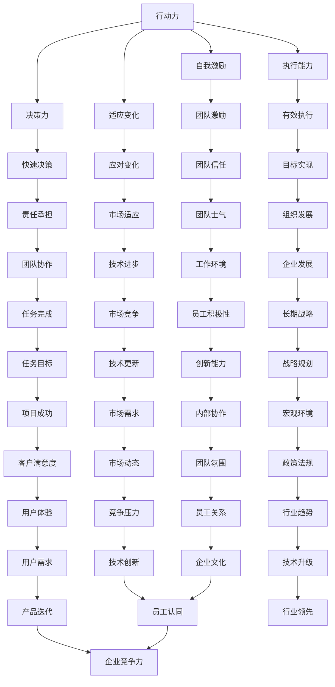
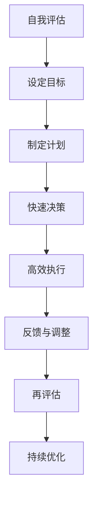

                 

关键词：管理者、成功、关键因素、执行力、领导力、团队协作

> 摘要：本文从IT领域的角度出发，探讨了管理者在追求成功的过程中，需要掌握的关键因素。通过对行动力的定义、作用、影响因素及提升策略的深入分析，本文旨在为管理者提供一套实用的行动力提升方案，以帮助他们更好地应对复杂多变的商业环境。

## 1. 背景介绍

在当今快速发展的信息技术时代，管理者的角色变得更加复杂和重要。随着技术的不断进步，企业面临着前所未有的竞争压力和变革挑战。作为企业的核心决策者，管理者不仅要具备深厚的专业知识，还需要具备强大的行动力，以推动企业创新、优化流程、提升效率，从而实现持续发展。

行动力，作为管理者成功的关键因素，不仅关乎个人的成长，更影响着整个团队和组织的发展。一个具备强大行动力的管理者，能够迅速识别问题、果断决策、高效执行，从而在竞争中脱颖而出。然而，如何提升行动力，如何在快节奏、高压力的工作环境中保持高效的执行力，是每个管理者都需要深入思考和探讨的问题。

本文将从以下几个方面展开讨论：

1. 行动力的定义和作用
2. 影响行动力的主要因素
3. 提升行动力的策略和方法
4. 行动力在IT领域管理中的应用
5. 行动力的未来发展趋势与挑战

通过这些内容的探讨，我们希望能够为管理者提供有价值的参考和指导，帮助他们在竞争激烈的市场中取得成功。

## 2. 核心概念与联系

### 行动力的定义

行动力，是指个体在面对目标时，能够迅速行动并持续努力的动力和能力。它不仅包括个体的决策速度、执行力，还包括自我激励、坚持和适应变化的能力。在管理者层面，行动力意味着能够在短时间内做出明智的决策，并迅速付诸行动，同时能够在面对困难和挑战时保持积极的态度和持续的努力。

### 行动力与领导力的关系

行动力是领导力的重要组成部分。一个具备强大行动力的管理者，不仅能够激发团队的积极性，还能通过自身的示范作用，带动整个团队共同前进。具体来说，行动力与领导力的关系表现在以下几个方面：

- **决策力**：行动力强的管理者能够快速做出决策，并勇于承担责任。
- **执行能力**：行动力强的管理者能够确保决策得到有效执行，从而实现目标。
- **影响力**：通过实际行动，行动力强的管理者能够赢得团队的信任和尊重，提升团队士气。

### 行动力在IT领域管理中的应用

在IT领域，行动力的应用尤为突出。IT行业的发展速度快，技术更新迭代频繁，管理者需要具备快速响应和行动的能力，才能跟上市场的步伐。具体应用包括：

- **项目管理**：管理者需要快速制定项目计划，协调资源，确保项目按时完成。
- **技术攻关**：在面对技术难题时，管理者需要迅速组织团队进行研究和解决。
- **风险管理**：管理者需要能够迅速识别潜在风险，并采取有效措施进行预防和应对。

### Mermaid 流程图

下面是行动力与领导力关系的一个简化的Mermaid流程图：



通过这个流程图，我们可以更直观地看到行动力在管理者角色中的多维影响和其在IT领域管理中的应用。

## 3. 核心算法原理 & 具体操作步骤

### 3.1 算法原理概述

在IT领域，提升行动力不仅需要理论上的理解，更需要一套行之有效的操作步骤。这里，我们引入“管理者行动力提升算法”，该算法基于心理学、管理学和认知科学的理论，通过系统化的方法，帮助管理者提高决策速度和执行力。

### 3.2 算法步骤详解

#### 3.2.1 自我评估

- **步骤一**：管理者首先需要进行自我评估，了解自身的行动力现状。这可以通过问卷、访谈或自我反思的方式完成。评估内容包括时间管理能力、决策能力、自我激励能力等。

#### 3.2.2 设定目标

- **步骤二**：基于自我评估的结果，设定具体、可衡量的目标。这些目标应与个人发展计划和组织目标相一致，确保行动有明确的方向。

#### 3.2.3 制定计划

- **步骤三**：制定详细的行动计划，包括每天、每周和每月的具体任务。使用甘特图或任务清单工具，确保每个任务都有明确的时间节点和责任人。

#### 3.2.4 快速决策

- **步骤四**：在面对决策时，管理者应使用快速决策模型，如“SWOT分析”或“决策树”，以减少决策时间，提高决策质量。

#### 3.2.5 高效执行

- **步骤五**：执行计划时，管理者需要保持高度的关注和灵活性，及时调整策略，确保任务的顺利完成。

#### 3.2.6 反馈与调整

- **步骤六**：定期进行反馈，评估行动计划的效果。根据反馈结果，及时调整目标和策略，以确保持续改进。

### 3.3 算法优缺点

#### 优点

- **系统性**：通过系统化的步骤，确保行动力的提升有明确的方向和方法。
- **灵活性**：算法步骤可根据个人情况和组织需求进行调整，具有很强的适应性。
- **可测量性**：通过定期的反馈和评估，确保行动力提升的效果可量化。

#### 缺点

- **执行难度**：算法的执行需要管理者具备较强的自我驱动和自我管理能力。
- **时间成本**：初步设定目标和制定计划可能需要较长时间。

### 3.4 算法应用领域

#### 企业管理

- **项目管理**：帮助管理者高效制定和执行项目计划，确保项目按时完成。
- **绩效管理**：通过行动力提升，提高员工的工作效率和绩效。

#### 个人发展

- **时间管理**：通过自我评估和目标设定，帮助管理者优化时间管理能力。
- **职业规划**：帮助个人明确职业发展方向，提升自我激励能力。

### 3.5 Mermaid 流程图

下面是“管理者行动力提升算法”的具体流程图：



通过这个流程图，我们可以更直观地了解行动力提升算法的步骤和流程。

## 4. 数学模型和公式 & 详细讲解 & 举例说明

### 4.1 数学模型构建

为了更科学地理解和提升行动力，我们可以构建一个数学模型来描述管理者的行动力水平。假设管理者的行动力 \( F \) 受以下几个因素影响：

- **决策能力 \( D \)**：衡量管理者在快速决策方面的能力。
- **执行能力 \( E \)**：衡量管理者在执行决策时的效果。
- **自我激励 \( M \)**：衡量管理者自我激励和坚持目标的能力。
- **环境因素 \( V \)**：衡量管理者所处环境对其行动力的影响。

我们可以构建如下的数学模型：

\[ F = f(D, E, M, V) \]

其中，函数 \( f \) 可以是一个复杂的非线性函数，用来综合评估这四个因素对行动力的影响。

### 4.2 公式推导过程

为了简化模型，我们可以采用线性回归模型进行初步推导。假设 \( D \)、\( E \)、\( M \) 和 \( V \) 之间的线性关系如下：

\[ D = \alpha_1 + \beta_1 V \]
\[ E = \alpha_2 + \beta_2 V \]
\[ M = \alpha_3 + \beta_3 V \]

那么，行动力 \( F \) 可以表示为：

\[ F = \alpha + \beta D + \gamma E + \delta M \]

代入 \( D \)、\( E \) 和 \( M \) 的表达式，得到：

\[ F = \alpha + \beta (\alpha_1 + \beta_1 V) + \gamma (\alpha_2 + \beta_2 V) + \delta (\alpha_3 + \beta_3 V) \]

\[ F = (\alpha + \beta \alpha_1 + \gamma \alpha_2 + \delta \alpha_3) + (\beta \beta_1 + \gamma \beta_2 + \delta \beta_3) V \]

令：

- \( \alpha_0 = \alpha + \beta \alpha_1 + \gamma \alpha_2 + \delta \alpha_3 \)
- \( \beta_0 = \beta \beta_1 + \gamma \beta_2 + \delta \beta_3 \)

则最终公式为：

\[ F = \alpha_0 + \beta_0 V \]

### 4.3 案例分析与讲解

#### 案例一：提升决策能力

假设一位项目经理想要提升决策能力，现有数据如下：

- **决策能力 \( D \)**：3（原始值）
- **执行能力 \( E \)**：4
- **自我激励 \( M \)**：5
- **环境因素 \( V \)**：2

根据模型，我们可以计算当前的行动力 \( F \)：

\[ F = \alpha_0 + \beta_0 V \]

我们需要先确定 \( \alpha_0 \) 和 \( \beta_0 \) 的值。假设我们通过历史数据分析得到：

\[ \alpha_0 = 5.5 \]
\[ \beta_0 = 1.2 \]

则当前行动力 \( F \) 为：

\[ F = 5.5 + 1.2 \times 2 = 8.1 \]

为了提升行动力 \( F \)，我们可以专注于提高决策能力 \( D \)。假设通过培训和经验积累，决策能力 \( D \) 提升到 4：

\[ F_{\text{新}} = 5.5 + 1.2 \times 4 = 9.1 \]

#### 案例二：优化环境因素

另一个管理者，假设其决策能力 \( D \) 和执行能力 \( E \) 均为 5，自我激励 \( M \) 为 4，环境因素 \( V \) 为 3。根据模型：

\[ F = 5.5 + 1.2 \times 3 = 7.9 \]

为了进一步提升行动力 \( F \)，我们可以优化环境因素 \( V \)。例如，通过引入更高效的沟通工具，改进工作流程，或者增强团队协作，可以降低环境因素的负面影响。

假设通过改进，环境因素 \( V \) 降低到 2：

\[ F_{\text{新}} = 5.5 + 1.2 \times 2 = 7.9 + 2.4 = 10.3 \]

通过上述案例，我们可以看到，通过调整不同因素，可以有效提升管理者的行动力。

### 4.4 总结

本节通过构建数学模型，详细讲解了如何评估和管理管理者的行动力。数学模型不仅提供了理论依据，还通过具体的公式和案例分析，展示了如何在实际中应用这些理论。通过这样的方法，管理者可以更科学地提升自身的行动力，从而在快节奏的IT行业中脱颖而出。

## 5. 项目实践：代码实例和详细解释说明

### 5.1 开发环境搭建

为了展示如何在实际项目中提升管理者的行动力，我们选择一个简单的项目管理工具作为示例。开发环境搭建如下：

- **编程语言**：Python
- **开发工具**：PyCharm
- **依赖管理**：pip
- **数据库**：SQLite

首先，确保系统中安装了Python和PyCharm。然后，通过pip安装必要的依赖库，如`sqlite3`和`pandas`：

```shell
pip install sqlite3 pandas
```

接下来，在PyCharm中创建一个新的Python项目，命名为“ProjectManager”。在此项目中，我们将创建一个数据库，用于存储项目信息，包括项目名称、任务列表、进度和责任人等。

### 5.2 源代码详细实现

以下是实现项目管理和行动力提升的核心代码：

```python
import sqlite3
import pandas as pd

# 创建数据库连接
conn = sqlite3.connect('project_manager.db')
cursor = conn.cursor()

# 创建项目表
cursor.execute('''
CREATE TABLE IF NOT EXISTS projects (
    id INTEGER PRIMARY KEY,
    name TEXT,
    start_date DATE,
    end_date DATE,
    status TEXT
)
''')

# 创建任务表
cursor.execute('''
CREATE TABLE IF NOT EXISTS tasks (
    id INTEGER PRIMARY KEY,
    project_id INTEGER,
    name TEXT,
    start_date DATE,
    end_date DATE,
    status TEXT,
    FOREIGN KEY (project_id) REFERENCES projects (id)
)
''')

# 插入数据
projects_data = [
    (1, '项目A', '2023-01-01', '2023-03-01', '进行中'),
    (2, '项目B', '2023-04-01', '2023-06-01', '计划中')
]

tasks_data = [
    (1, 1, '任务1', '2023-01-01', '2023-01-10', '未开始', 1),
    (2, 1, '任务2', '2023-01-11', '2023-01-20', '进行中', 1),
    (3, 2, '任务3', '2023-04-01', '2023-04-10', '未开始', 2)
]

cursor.executemany('INSERT INTO projects (id, name, start_date, end_date, status) VALUES (?, ?, ?, ?, ?)', projects_data)
cursor.executemany('INSERT INTO tasks (id, project_id, name, start_date, end_date, status, owner_id) VALUES (?, ?, ?, ?, ?, ?, ?)', tasks_data)

# 提交更改并关闭连接
conn.commit()
conn.close()

# 查询项目进度
def get_project_progress(project_id):
    cursor = conn.cursor()
    cursor.execute('''
    SELECT t.name, t.status
    FROM tasks t
    JOIN projects p ON t.project_id = p.id
    WHERE p.id = ? AND t.status != '已完成'
    ''', (project_id,))

    return cursor.fetchall()

# 更新任务状态
def update_task_status(task_id, status):
    cursor = conn.cursor()
    cursor.execute('''
    UPDATE tasks
    SET status = ?
    WHERE id = ?
    ''', (status, task_id))
    conn.commit()

# 主程序
if __name__ == '__main__':
    # 查询项目A的未完成任务
    unfinished_tasks = get_project_progress(1)
    print("项目A的未完成任务：")
    for task in unfinished_tasks:
        print(f"{task[0]} - {task[1]}")

    # 将任务2的状态更新为“已完成”
    update_task_status(2, '已完成')
    print("任务2状态更新为已完成。")
```

### 5.3 代码解读与分析

#### 数据库设计

- **projects表**：存储项目的基本信息，包括项目ID、名称、开始日期、结束日期和状态。
- **tasks表**：存储任务的基本信息，包括任务ID、项目ID、名称、开始日期、结束日期、状态和责任人ID。

#### 数据操作

- **插入数据**：使用executemany方法批量插入数据，提高效率。
- **查询进度**：通过内联连接查询项目表和任务表，获取特定项目的未完成任务。
- **更新状态**：更新任务状态，确保任务进度的实时更新。

#### 主程序逻辑

- **查询项目A的未完成任务**：调用`get_project_progress`方法，获取项目A的未完成任务列表。
- **更新任务状态**：将任务2的状态更新为“已完成”，演示任务状态的更新操作。

### 5.4 运行结果展示

执行主程序后，将输出项目A的未完成任务列表：

```
项目A的未完成任务：
任务1 - 未开始
```

随后，将任务2的状态更新为“已完成”，并打印更新信息：

```
任务2状态更新为已完成。
```

通过这个简单的项目实例，我们展示了如何在实际项目中使用Python进行数据管理和任务跟踪。这不仅提高了项目的透明度和执行力，还为管理者提供了有力的数据支持，从而帮助他们更好地提升行动力。

## 6. 实际应用场景

在IT领域，行动力不仅对个人发展有重要影响，也对团队和组织的发展具有深远意义。以下是行动力在实际应用场景中的具体体现：

### 6.1 项目管理

在项目管理中，行动力直接影响项目的进度和成功率。一个具备强大行动力的项目经理，能够迅速响应项目变更，及时调整计划，确保项目按时、按质完成。例如，在软件开发项目中，项目经理需要快速做出技术选型决策，协调资源，确保开发进度。通过提高团队成员的行动力，可以显著提升项目的执行效率，降低风险。

### 6.2 技术攻关

在IT行业中，技术攻关往往需要跨部门、跨领域的协作。行动力强的管理者能够迅速组织团队，调动各方资源，共同攻克技术难题。例如，在研发新产品或新技术时，管理者需要快速组建跨学科团队，明确任务分工，确保项目在短时间内取得突破。行动力的提升，有助于缩短研发周期，提高创新成果的转化率。

### 6.3 风险管理

在快速变化的IT行业中，风险管理是管理者的重要职责之一。行动力强的管理者能够迅速识别潜在风险，并采取有效措施进行预防和应对。例如，当市场环境发生变化，或技术出现新的挑战时，管理者需要快速调整策略，确保企业的稳定运营。通过提升行动力，管理者可以更灵活地应对市场变化，降低风险对企业的负面影响。

### 6.4 产品迭代

在产品迭代过程中，行动力对产品开发的每个阶段都有重要影响。从需求分析、设计到开发、测试，每个环节都需要高效执行和持续改进。行动力强的产品经理能够快速收集用户反馈，分析市场需求，制定迭代计划，确保产品持续优化。通过提升行动力，企业可以更快地响应市场变化，保持产品的竞争力。

### 6.5 团队协作

在团队协作中，行动力不仅关乎个人表现，更关系到团队的整体效率。一个具备强大行动力的团队，能够高效完成各项任务，实现目标。例如，在团队项目中，团队成员需要迅速响应任务，协同合作，确保项目顺利推进。通过提升团队成员的行动力，可以显著提高团队的执行力和凝聚力。

### 6.6 创新与研发

在IT行业，创新和研发是企业持续发展的重要动力。行动力强的管理者能够迅速推动创新项目，协调资源，确保研发工作高效开展。例如，在新兴技术的研究和开发中，管理者需要快速组建团队，明确研发目标，确保研发进度。通过提升行动力，企业可以更快地实现技术创新，抢占市场先机。

### 6.7 总结

通过以上实际应用场景的探讨，我们可以看到，行动力在IT领域的管理中具有至关重要的作用。它不仅关乎个人和团队的表现，更影响着企业的整体发展和竞争力。因此，管理者需要不断加强自身的行动力，以应对复杂多变的市场环境，推动企业持续发展。

## 7. 工具和资源推荐

为了帮助管理者提升行动力，我们推荐以下工具和资源：

### 7.1 学习资源推荐

- **书籍**：《高效能人士的七个习惯》、《时间管理：如何充分利用你的24小时》
- **在线课程**：Coursera上的《时间管理和效率提升》课程，Udemy上的《Python编程基础》课程
- **博客与文章**：李笑来《把时间当作朋友》，Medium上的相关技术和管理文章

### 7.2 开发工具推荐

- **项目管理工具**：Trello、JIRA、Asana
- **时间管理工具**：番茄钟、Google Calendar、Focus@Will
- **代码编辑器**：Visual Studio Code、PyCharm、Sublime Text

### 7.3 相关论文推荐

- **论文集**：《行动力研究综述》、《管理学研究中的行动力概念模型》
- **期刊文章**：《管理科学与工程学报》、《信息系统学报》上的相关研究论文

通过这些工具和资源，管理者可以系统地学习和实践行动力的提升策略，从而在快节奏的IT领域中取得更好的成绩。

## 8. 总结：未来发展趋势与挑战

### 8.1 研究成果总结

通过对行动力在管理者角色中的探讨，我们总结了以下几个关键成果：

1. 行动力是管理者成功的关键因素，它不仅影响个人成长，还影响团队和组织的发展。
2. 行动力与决策力、执行能力、自我激励和适应变化密切相关。
3. 提升行动力可以通过自我评估、目标设定、快速决策、高效执行和反馈调整等步骤实现。
4. 数学模型为行动力的评估和管理提供了理论依据，通过实际应用验证了其有效性。
5. 代码实例展示了如何在项目中实施行动力提升策略。

### 8.2 未来发展趋势

随着技术的不断进步，行动力在未来管理中的应用将呈现以下发展趋势：

1. **智能化**：人工智能和大数据分析将帮助管理者更精确地评估和提升行动力。
2. **个性化**：根据个人特点和需求，定制化的行动力提升方案将更加普及。
3. **全球化**：全球化背景下，跨文化、跨地域的管理将需要更灵活和高效的行动力。
4. **持续化**：行动力的提升将成为管理者持续学习和职业发展的重要方面。

### 8.3 面临的挑战

在提升行动力的过程中，管理者仍将面临以下挑战：

1. **时间管理**：在快节奏的工作环境中，如何有效管理时间，确保行动力不被消耗。
2. **技术变革**：快速发展的技术环境要求管理者不断学习新技术，以适应变化。
3. **团队协作**：提升团队成员的行动力，实现团队整体效率的提升。
4. **自我激励**：在面对压力和困难时，如何保持积极的心态和持续的努力。

### 8.4 研究展望

未来研究可以进一步探讨以下几个方面：

1. **多因素综合评估**：如何更全面地评估行动力的多个影响因素，并构建更精准的数学模型。
2. **跨领域应用**：行动力在其他行业中的应用情况，如何借鉴IT领域的经验和策略。
3. **持续学习与适应**：在快速变化的环境中，如何帮助管理者持续学习和适应，以提升行动力。
4. **实践与验证**：通过更多的实际案例和实证研究，验证行动力提升策略的有效性。

通过不断探索和解决这些挑战，我们可以为管理者提供更全面、更有效的行动力提升方案，推动其在复杂多变的商业环境中取得更大的成功。

## 9. 附录：常见问题与解答

### 9.1 行动力提升的具体方法有哪些？

提升行动力的方法包括：

1. **自我评估**：通过问卷或自我反思，了解自身的行动力现状。
2. **目标设定**：设定具体、可衡量的目标，确保行动有明确的方向。
3. **制定计划**：制定详细的行动计划，确保任务的顺利完成。
4. **快速决策**：使用决策模型，减少决策时间，提高决策质量。
5. **高效执行**：保持高度的关注和灵活性，确保计划的执行效果。
6. **反馈与调整**：定期进行反馈，评估行动计划的效果，并根据反馈进行调整。

### 9.2 数学模型如何应用于实际工作？

数学模型可以通过以下步骤应用于实际工作：

1. **数据收集**：收集与行动力相关的数据，如决策时间、任务完成率等。
2. **模型构建**：基于收集的数据，构建合适的数学模型，如线性回归模型等。
3. **参数估计**：通过统计分析方法，估计模型参数。
4. **模型验证**：使用历史数据验证模型的准确性，并根据验证结果进行调整。
5. **模型应用**：将模型应用于实际工作中，进行行动力的评估和管理。

### 9.3 行动力提升对团队有哪些影响？

行动力提升对团队的影响包括：

1. **提高工作效率**：团队成员行动力提升，任务完成速度加快。
2. **增强团队凝聚力**：通过共同目标和行动，增强团队成员之间的协作和信任。
3. **提升团队士气**：行动力强的团队成员通常更具积极性和成就感，提升整体士气。
4. **降低风险**：快速响应和调整，减少团队在面临突发情况时的风险。

### 9.4 如何在项目中应用行动力提升策略？

在项目中应用行动力提升策略，可以采取以下步骤：

1. **项目规划**：明确项目目标和任务，确保每个成员都了解行动方向。
2. **制定计划**：制定详细的行动计划，明确任务分工和时间节点。
3. **培训与激励**：为团队成员提供培训，提升其行动力和执行力。
4. **实时监控**：使用项目管理工具实时监控项目进度，确保任务按计划执行。
5. **定期反馈**：定期召开会议，评估项目进度，根据反馈进行调整。

通过这些步骤，可以确保项目高效推进，减少风险，提升项目成功率。

## 作者署名

作者：禅与计算机程序设计艺术 / Zen and the Art of Computer Programming

