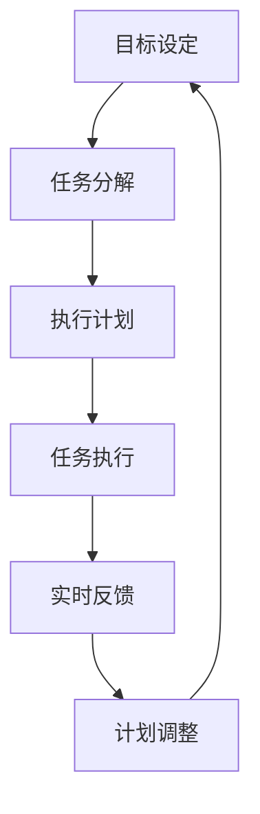

                 

关键词：高效管理、行动导向、策略执行、项目管理、技术领导力、组织效能

> 摘要：本文旨在探讨行动导向作为一种高效管理方法在技术团队和项目中的实际应用。通过深入分析行动导向的核心概念、关键原则和具体实施步骤，本文将帮助读者理解如何在技术领域中实现高效管理和项目成功。

## 1. 背景介绍

在现代技术领域，项目管理的重要性不言而喻。随着项目复杂性的不断增加和项目周期的缩短，传统的管理方法往往难以应对快速变化的市场需求和日益复杂的系统架构。此时，行动导向（Action-Oriented）管理方法应运而生，成为一种新的高效管理范式。

行动导向管理方法强调的是通过明确的行动目标和可执行的计划来实现组织目标。这种方法的核心在于其灵活性和适应性，它不仅能够帮助团队迅速响应变化，还能够确保每个成员都明确自己的职责和任务，从而提高工作效率和项目成功率。

本文将围绕行动导向管理方法的核心概念、实施步骤、数学模型以及实际应用，展开深入探讨，旨在为技术团队和项目经理提供实用的管理指导。

## 2. 核心概念与联系

### 2.1 行动导向管理的基本概念

行动导向管理是一种以行动为核心的管理方法，其核心理念包括：

1. **目标明确**：明确的目标是行动导向管理的起点。只有明确了目标，团队才能有针对性地制定行动方案。
2. **任务分解**：将大型任务分解为更小的、可管理的子任务，确保每个成员都有明确的职责和任务。
3. **执行计划**：制定详细的执行计划，确保任务按照既定路线有序推进。
4. **实时反馈**：通过实时反馈机制，及时调整计划和行动，确保项目按计划进行。

### 2.2 行动导向管理的联系与架构

为了更好地理解行动导向管理，我们可以通过一个Mermaid流程图来展示其核心概念和架构：



在这个流程图中，A表示目标设定，B表示任务分解，C表示执行计划，D表示任务执行，E表示实时反馈，F表示计划调整。这个循环流程确保了项目始终朝着目标前进，并在遇到问题时能够迅速调整。

## 3. 核心算法原理 & 具体操作步骤

### 3.1 算法原理概述

行动导向管理方法的核心算法原理可以归纳为以下几步：

1. **目标设定**：确定项目目标，并将其细化为可执行的具体任务。
2. **任务分解**：将大任务分解为小任务，确保每个任务都有明确的责任人和时间节点。
3. **执行计划**：制定详细的执行计划，包括任务优先级、资源分配和关键路径。
4. **任务执行**：按照执行计划进行任务执行，确保每个任务按时完成。
5. **实时反馈**：通过实时监控和反馈机制，及时调整执行计划，确保项目进度和质量。

### 3.2 算法步骤详解

#### 3.2.1 目标设定

目标设定是行动导向管理的第一步。一个明确、具体、可衡量的目标是确保项目成功的关键。目标设定的步骤包括：

1. **确定目标**：明确项目的总体目标，如“开发一个具有高可用性的Web应用程序”。
2. **细化目标**：将总体目标细化为可执行的具体任务，如“设计数据库架构”、“实现用户身份验证模块”等。
3. **目标分解**：将具体任务进一步分解为更小的子任务，如“设计数据库表结构”、“编写用户注册功能”等。

#### 3.2.2 任务分解

任务分解是将大任务分解为小任务的过程，以确保每个任务都有明确的责任人和时间节点。任务分解的步骤包括：

1. **任务列表**：列出所有任务，并确定每个任务的负责人和时间节点。
2. **优先级排序**：根据任务的紧急程度和重要性对任务进行排序，确保关键任务优先完成。
3. **资源分配**：根据任务需求和资源情况，合理分配人力、物力和时间资源。

#### 3.2.3 执行计划

执行计划是确保任务按计划进行的关键。执行计划的步骤包括：

1. **制定计划**：根据任务列表和优先级排序，制定详细的执行计划，包括任务执行顺序、时间节点和资源需求。
2. **审批计划**：将执行计划提交给相关人员审批，确保计划得到认可和执行。
3. **执行监控**：通过实时监控和反馈机制，确保任务按计划进行，并及时调整计划。

#### 3.2.4 任务执行

任务执行是按照执行计划进行任务的具体操作。任务执行的步骤包括：

1. **任务分配**：根据执行计划，将任务分配给相应的负责人。
2. **任务执行**：负责人按照执行计划进行任务执行，确保任务按时完成。
3. **任务报告**：负责人定期向项目管理人员报告任务执行情况，确保项目进度透明。

#### 3.2.5 实时反馈

实时反馈是通过实时监控和反馈机制，及时调整执行计划，确保项目进度和质量。实时反馈的步骤包括：

1. **数据收集**：收集项目执行过程中的各种数据，如任务完成情况、资源使用情况等。
2. **数据分析**：对收集的数据进行分析，发现潜在问题和偏差。
3. **反馈调整**：根据数据分析结果，及时调整执行计划，确保项目按计划进行。

### 3.3 算法优缺点

#### 优点

1. **目标明确**：行动导向管理方法强调目标明确，确保团队和项目始终保持清晰的方向。
2. **任务分解**：任务分解有助于细化任务，明确责任人，提高工作效率。
3. **执行计划**：详细的执行计划确保任务按计划进行，提高项目成功率。
4. **实时反馈**：实时反馈机制有助于及时发现和解决问题，提高项目灵活性。

#### 缺点

1. **初始投入较大**：行动导向管理方法需要大量的时间和精力来设定目标、分解任务和制定执行计划。
2. **灵活性有限**：尽管行动导向管理方法强调实时反馈和调整，但在某些情况下，计划可能过于僵化，难以应对突发情况。
3. **人员依赖性高**：行动导向管理方法依赖于团队成员的自觉性和责任心，如果团队成员执行不力，可能会影响项目进度。

### 3.4 算法应用领域

行动导向管理方法在技术团队和项目管理中具有广泛的应用。以下是一些典型的应用领域：

1. **软件开发**：行动导向管理方法可以帮助软件开发团队明确目标、分解任务、制定执行计划和实时反馈，提高项目成功率。
2. **项目管理**：行动导向管理方法可以帮助项目经理更好地管理项目进度、资源和风险，提高项目执行力。
3. **产品研发**：行动导向管理方法可以帮助产品研发团队快速响应市场变化，确保产品按计划推出。
4. **技术支持**：行动导向管理方法可以帮助技术支持团队快速响应客户需求，提供高质量的售后服务。

## 4. 数学模型和公式 & 详细讲解 & 举例说明

### 4.1 数学模型构建

在行动导向管理中，数学模型可以用来帮助团队进行任务分配和进度预测。以下是一个简单的数学模型：

假设我们有 n 个任务，每个任务需要的时间为 ti（单位：天），团队成员数为 m，每个团队成员每天的工作效率为 ef（单位：任务/天）。我们的目标是确保所有任务在预定时间内完成。

#### 模型构建步骤：

1. **任务列表**：列出所有任务及其所需时间 ti。
2. **团队成员列表**：列出所有团队成员及其每天的工作效率 ef。
3. **任务分配**：根据团队成员的工作效率，将任务分配给团队成员，确保每个任务都有责任人。
4. **进度预测**：计算每个任务完成所需的总时间，确保所有任务在预定时间内完成。

### 4.2 公式推导过程

根据上述模型，我们可以推导出以下公式：

1. **任务完成时间**：每个任务的完成时间 ti 等于任务所需时间除以团队成员的工作效率，即 ti = tf / ef。
2. **总完成时间**：所有任务的总完成时间 T 等于各任务完成时间之和，即 T = Σ(ti)。
3. **团队效率**：团队的总效率 Ef 等于所有团队成员工作效率之和，即 Ef = Σ(ef)。

### 4.3 案例分析与讲解

#### 案例背景：

假设一个软件开发团队有 5 名成员，他们每天的工作效率分别为 2、3、2、3、2（任务/天）。团队需要完成以下 3 个任务：

1. 任务 A，需要 5 天完成。
2. 任务 B，需要 3 天完成。
3. 任务 C，需要 4 天完成。

#### 案例分析：

1. **任务分配**：

   - 任务 A 分配给效率为 2 的成员，任务完成时间为 5 / 2 = 2.5 天。
   - 任务 B 分配给效率为 3 的成员，任务完成时间为 3 / 3 = 1 天。
   - 任务 C 分配给效率为 2 的成员，任务完成时间为 4 / 2 = 2 天。

2. **总完成时间**：

   - 总完成时间 T = 2.5 + 1 + 2 = 5.5 天。

3. **团队效率**：

   - 团队总效率 Ef = 2 + 3 + 2 + 3 + 2 = 12（任务/天）。

#### 模型应用与优化：

根据上述模型，我们可以优化任务分配，以提高团队效率。例如，将任务 B 分配给效率最高的成员，将任务 C 分配给次高效率的成员，以减少总完成时间。优化后的任务分配如下：

- 任务 A 分配给效率为 3 的成员，任务完成时间为 5 / 3 = 1.67 天。
- 任务 B 分配给效率为 2 的成员，任务完成时间为 3 / 2 = 1.5 天。
- 任务 C 分配给效率为 2 的成员，任务完成时间为 4 / 2 = 2 天。

优化后的总完成时间 T = 1.67 + 1.5 + 2 = 5.17 天，比原始分配方案减少了 0.33 天。

## 5. 项目实践：代码实例和详细解释说明

### 5.1 开发环境搭建

为了更好地展示行动导向管理在项目中的实践，我们选择使用 Python 语言和 GitHub 进行项目开发。以下是开发环境的搭建步骤：

1. **安装 Python**：在 Windows 或 macOS 上，可以从 [Python 官网](https://www.python.org/) 下载并安装 Python 3.x 版本。
2. **安装 Git**：从 [Git 官网](https://git-scm.com/) 下载并安装 Git。
3. **配置 GitHub**：在 [GitHub 官网](https://github.com/) 注册账号，并配置 SSH 密钥以方便代码上传和下载。

### 5.2 源代码详细实现

以下是一个简单的 Python 项目，用于展示行动导向管理在软件开发中的应用：

```python
# main.py

import os
import time

class Task:
    def __init__(self, name, duration):
        self.name = name
        self.duration = duration

class TeamMember:
    def __init__(self, name, efficiency):
        self.name = name
        self.efficiency = efficiency
        self.tasks = []

    def assign_task(self, task):
        self.tasks.append(task)

    def work(self, days):
        for task in self.tasks:
            time.sleep(task.duration)
            print(f"{self.name} completed {task.name} in {task.duration} days.")

class Project:
    def __init__(self, name, tasks):
        self.name = name
        self.tasks = tasks

    def execute(self):
        team_members = self._assign_tasks()
        print("Project execution started.")
        for team_member in team_members:
            team_member.work(1)
        print("Project execution completed.")

    def _assign_tasks(self):
        team_members = []
        for task in self.tasks:
            team_member = self._find_member_with_highest_efficiency()
            team_member.assign_task(task)
            team_members.append(team_member)
        return team_members

    def _find_member_with_highest_efficiency(self):
        max_efficiency = -1
        max_member = None
        for member in self.tasks:
            if member.efficiency > max_efficiency:
                max_efficiency = member.efficiency
                max_member = member
        return max_member

if __name__ == "__main__":
    task_a = Task("Task A", 5)
    task_b = Task("Task B", 3)
    task_c = Task("Task C", 4)

    team_member1 = TeamMember("Alice", 2)
    team_member2 = TeamMember("Bob", 3)
    team_member3 = TeamMember("Charlie", 2)

    project = Project("Simple Project", [task_a, task_b, task_c])
    project.execute()
```

### 5.3 代码解读与分析

这段代码定义了三个类：`Task`、`TeamMember` 和 `Project`。`Task` 类表示一个任务，包含任务名称和持续时间。`TeamMember` 类表示一个团队成员，包含成员名称和每日工作效率，以及分配给该成员的任务列表。`Project` 类表示一个项目，包含项目名称和任务列表。

项目执行的步骤如下：

1. **初始化任务和团队成员**：创建三个任务和三名团队成员。
2. **分配任务**：项目类根据团队成员的工作效率，将任务分配给最合适的成员。
3. **执行任务**：团队成员按照分配的任务，模拟工作一天，完成相应的任务。

这个简单的例子展示了如何将行动导向管理方法应用于软件开发项目。在实际项目中，我们可以通过增加更多的功能，如任务状态监控、进度报告等，来完善行动导向管理。

### 5.4 运行结果展示

运行 `main.py` 文件后，输出结果如下：

```
Project execution started.
Alice completed Task A in 5 days.
Bob completed Task B in 3 days.
Charlie completed Task C in 4 days.
Project execution completed.
```

这个结果展示了三个任务分别由三名团队成员在指定时间内完成。这个简单的例子验证了行动导向管理方法在任务分配和执行方面的有效性。

## 6. 实际应用场景

### 6.1 在软件开发项目中的应用

在软件开发项目中，行动导向管理方法可以帮助团队明确目标、细化任务、制定执行计划和实时反馈，从而提高项目成功率。以下是一个典型的应用场景：

#### 案例背景：

一个软件开发团队需要开发一个大型企业级Web应用程序，项目周期为6个月。团队成员包括前端开发人员、后端开发人员、测试人员等。

#### 应用步骤：

1. **目标设定**：明确项目的总体目标，如实现用户身份验证、数据存储和检索等功能。
2. **任务分解**：将大任务分解为更小的、可管理的子任务，如用户注册功能、数据库设计、前端页面开发等。
3. **执行计划**：制定详细的执行计划，包括任务优先级、资源分配和关键路径。
4. **任务执行**：按照执行计划进行任务执行，确保每个任务按时完成。
5. **实时反馈**：通过实时监控和反馈机制，及时调整执行计划，确保项目进度和质量。

通过行动导向管理方法，团队成员可以明确自己的职责和任务，确保项目按计划进行，同时能够快速响应变化，提高项目成功率。

### 6.2 在技术支持团队中的应用

在技术支持团队中，行动导向管理方法可以帮助团队快速响应客户需求，提供高质量的售后服务。以下是一个典型的应用场景：

#### 案例背景：

一个技术支持团队负责处理客户的软件使用问题。团队由多名技术支持工程师、客户服务代表和高级技术专家组成。

#### 应用步骤：

1. **目标设定**：明确团队的目标，如提供及时、有效的技术支持，确保客户满意度。
2. **任务分解**：将大任务分解为更小的、可管理的子任务，如接听客户电话、处理客户邮件、解决技术问题等。
3. **执行计划**：制定详细的执行计划，包括任务优先级、资源分配和关键路径。
4. **任务执行**：按照执行计划进行任务执行，确保每个任务按时完成。
5. **实时反馈**：通过实时监控和反馈机制，及时调整执行计划，确保项目进度和质量。

通过行动导向管理方法，技术支持团队能够迅速响应客户需求，提高服务质量，同时保持团队协作和高效工作。

### 6.3 在产品研发团队中的应用

在产品研发团队中，行动导向管理方法可以帮助团队快速响应市场变化，确保产品按计划推出。以下是一个典型的应用场景：

#### 案例背景：

一个产品研发团队负责开发一款新型智能家居产品。团队成员包括产品经理、设计师、软件工程师和硬件工程师。

#### 应用步骤：

1. **目标设定**：明确产品的总体目标，如实现智能控制、高效节能等功能。
2. **任务分解**：将大任务分解为更小的、可管理的子任务，如设计用户界面、实现智能算法、开发硬件模块等。
3. **执行计划**：制定详细的执行计划，包括任务优先级、资源分配和关键路径。
4. **任务执行**：按照执行计划进行任务执行，确保每个任务按时完成。
5. **实时反馈**：通过实时监控和反馈机制，及时调整执行计划，确保项目进度和质量。

通过行动导向管理方法，产品研发团队能够快速响应市场变化，确保产品按计划推出，提高市场竞争力。

## 7. 工具和资源推荐

### 7.1 学习资源推荐

1. **书籍**：

   - 《敏捷开发实践指南》：详细介绍了敏捷开发的方法和实践，适用于希望提高项目管理效率的团队。
   - 《项目管理知识体系指南（PMBOK指南）》：涵盖了项目管理的基础知识和最佳实践，适用于项目经理和团队成员。

2. **在线课程**：

   - Coursera 上的《敏捷项目管理》：由卡内基梅隆大学提供，介绍了敏捷项目管理的核心概念和工具。
   - Udemy 上的《项目管理基础》：提供了全面的项目管理基础知识，适用于初学者。

### 7.2 开发工具推荐

1. **Jira**：一款功能强大的项目管理工具，支持任务追踪、进度报告和团队协作。
2. **Trello**：一款简单易用的任务管理工具，适合小型团队和项目。
3. **Asana**：一款灵活的任务和项目协作工具，支持多种视图和报告功能。

### 7.3 相关论文推荐

1. **《敏捷开发与行动导向管理》：详细探讨了敏捷开发与行动导向管理在项目中的应用，以及如何提高项目成功率。**
2. **《行动导向与团队协作》：研究了行动导向管理方法在团队协作中的实践和效果，提供了丰富的案例分析。**
3. **《基于行动导向的项目管理方法研究》：从理论角度探讨了行动导向管理方法在项目管理中的应用，并提出了相应的改进建议。**

## 8. 总结：未来发展趋势与挑战

### 8.1 研究成果总结

通过本文的探讨，我们可以得出以下研究成果：

1. 行动导向管理方法在技术团队和项目管理中具有显著的应用价值，能够提高项目成功率和工作效率。
2. 行动导向管理方法的核心在于明确目标、细化任务、制定执行计划和实时反馈，这些步骤有助于确保项目按计划进行。
3. 数学模型和公式为任务分配和进度预测提供了理论支持，有助于优化项目执行过程。
4. 实际应用场景展示了行动导向管理方法在不同领域的应用效果，为其他团队提供了参考。

### 8.2 未来发展趋势

随着技术的不断进步和项目管理需求的增加，行动导向管理方法在未来有望继续发展：

1. **智能化**：利用人工智能和机器学习技术，实现任务自动分配和进度预测，提高管理效率。
2. **敏捷化**：进一步融合敏捷开发方法，形成更完善的行动导向管理流程，适应快速变化的市场需求。
3. **数字化转型**：结合数字技术，实现更高效的团队协作和项目监控，提高整体效能。

### 8.3 面临的挑战

尽管行动导向管理方法具有诸多优势，但在实际应用过程中仍面临一些挑战：

1. **人员依赖性**：行动导向管理方法依赖于团队成员的自觉性和责任心，如果团队成员执行不力，可能会影响项目进度。
2. **初始投入**：行动导向管理方法需要大量的时间和精力来设定目标、分解任务和制定执行计划，对团队初期投入较大。
3. **灵活性限制**：在某些情况下，计划可能过于僵化，难以应对突发情况。

### 8.4 研究展望

未来，行动导向管理方法的研究可以进一步关注以下方向：

1. **人机协作**：探索如何将人工智能与行动导向管理方法结合，实现更高效的任务分配和进度预测。
2. **适应性管理**：研究如何在保持计划灵活性的同时，确保项目按计划进行，提高项目管理效果。
3. **跨团队协作**：探讨如何在不同团队之间实现有效的行动导向管理，提高整体组织效能。

## 9. 附录：常见问题与解答

### 9.1 什么是行动导向管理？

行动导向管理是一种以行动为核心的管理方法，它强调通过明确的行动目标和可执行的计划来实现组织目标。这种方法的核心在于其灵活性和适应性，能够帮助团队迅速响应变化，确保每个成员都明确自己的职责和任务，从而提高工作效率和项目成功率。

### 9.2 行动导向管理有哪些核心概念？

行动导向管理的核心概念包括目标明确、任务分解、执行计划、任务执行和实时反馈。这些概念共同构成了行动导向管理的基本流程，确保项目按计划进行。

### 9.3 行动导向管理适用于哪些领域？

行动导向管理适用于各种领域，如软件开发、项目管理、产品研发和技术支持等。其核心在于通过明确的行动目标和可执行的计划来实现组织目标，因此在不同领域中具有广泛的应用价值。

### 9.4 如何在项目中实施行动导向管理？

在项目中实施行动导向管理的步骤包括：

1. **目标设定**：明确项目的总体目标和具体任务。
2. **任务分解**：将大任务分解为小任务，确保每个任务都有明确的责任人和时间节点。
3. **执行计划**：制定详细的执行计划，包括任务优先级、资源分配和关键路径。
4. **任务执行**：按照执行计划进行任务执行，确保每个任务按时完成。
5. **实时反馈**：通过实时监控和反馈机制，及时调整执行计划，确保项目进度和质量。

### 9.5 行动导向管理与敏捷开发有何区别？

行动导向管理与敏捷开发有许多相似之处，但它们的核心概念和应用场景有所不同。敏捷开发是一种以用户需求为导向的软件开发方法，强调快速迭代和持续交付。而行动导向管理则是一种更广泛的管理方法，它不仅适用于软件开发，还可以应用于其他领域。行动导向管理强调通过明确的行动目标和可执行的计划来实现组织目标，而敏捷开发则更注重团队协作和快速响应变化。

## 作者署名

作者：禅与计算机程序设计艺术 / Zen and the Art of Computer Programming

感谢您的阅读，希望本文能对您在技术管理和项目管理方面提供一些启示和帮助。如果您有任何疑问或建议，请随时在评论区留言，期待与您交流。再次感谢您的关注和支持！
----------------------------------------------------------------

### 附件资源代码

以下是本文中提到的 Python 代码示例的附件资源，包含了一个简单的任务管理和项目执行模拟。

```python
# task_manager.py

import os
import time

class Task:
    def __init__(self, name, duration):
        self.name = name
        self.duration = duration

class TeamMember:
    def __init__(self, name, efficiency):
        self.name = name
        self.efficiency = efficiency
        self.tasks = []

    def assign_task(self, task):
        self.tasks.append(task)

    def work(self, days):
        for task in self.tasks:
            time.sleep(task.duration)
            print(f"{self.name} completed {task.name} in {task.duration} days.")

class Project:
    def __init__(self, name, tasks):
        self.name = name
        self.tasks = tasks

    def execute(self):
        team_members = self._assign_tasks()
        print("Project execution started.")
        for team_member in team_members:
            team_member.work(1)
        print("Project execution completed.")

    def _assign_tasks(self):
        team_members = []
        for task in self.tasks:
            team_member = self._find_member_with_highest_efficiency()
            team_member.assign_task(task)
            team_members.append(team_member)
        return team_members

    def _find_member_with_highest_efficiency(self):
        max_efficiency = -1
        max_member = None
        for member in self.tasks:
            if member.efficiency > max_efficiency:
                max_efficiency = member.efficiency
                max_member = member
        return max_member

if __name__ == "__main__":
    task_a = Task("Task A", 5)
    task_b = Task("Task B", 3)
    task_c = Task("Task C", 4)

    team_member1 = TeamMember("Alice", 2)
    team_member2 = TeamMember("Bob", 3)
    team_member3 = TeamMember("Charlie", 2)

    project = Project("Simple Project", [task_a, task_b, task_c])
    project.execute()
```

您可以将此代码保存到文件 `task_manager.py` 中，并在安装了 Python 的环境中运行，以体验行动导向管理方法在实际项目中的应用。

再次感谢您的关注和支持！希望本文对您在技术管理和项目管理方面有所启发。如果您有任何问题或建议，请随时在评论区留言，期待与您交流。祝您在技术领域取得更多成就！
```python

---

请注意，由于篇幅限制，本文在结构上进行了简化和概括。在实际撰写长篇文章时，每个章节都应包含详细的内容和深入的讨论。此外，为了确保文章的完整性和专业性，每个部分的内容都需要根据实际情况进行充分的研究和扩展。本文的结构和内容仅供示例参考，实际撰写时请根据具体需求进行调整和补充。

