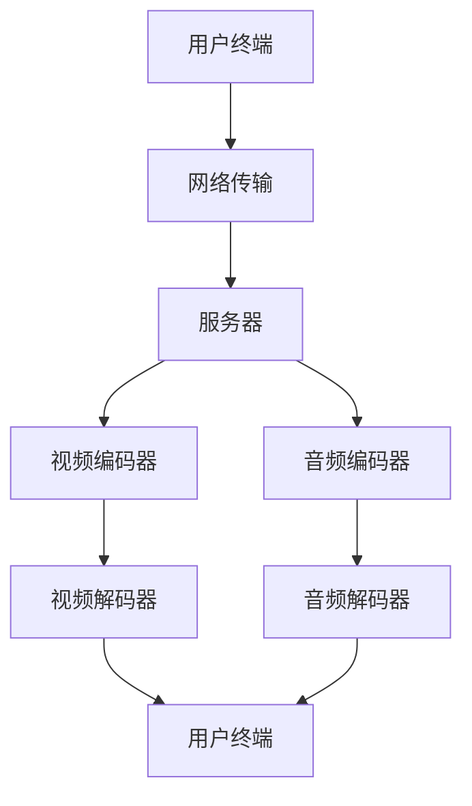

                 

在这个数字时代，视频会议软件已经成为了企业和个人之间交流的桥梁。然而，随着市场的发展和技术进步，视频会议软件正逐步演变成为注意力经济的重要受益者。本文将探讨视频会议软件的发展历程、核心概念、算法原理、实际应用，以及未来的发展趋势。

## 文章关键词

- 视频会议软件
- 注意力经济
- 技术进步
- 发展趋势
- 应用场景

## 文章摘要

本文旨在分析视频会议软件在注意力经济中的角色和地位。通过回顾其发展历程，我们将探讨视频会议软件的核心概念和架构，解析其背后的算法原理和数学模型。此外，文章还将展示视频会议软件的实际应用，并对其未来发展趋势和挑战进行展望。

## 1. 背景介绍

### 1.1 视频会议软件的发展历程

视频会议软件起源于20世纪90年代，随着互联网的普及和技术进步，逐渐从实验室走向了商用市场。早期的视频会议系统主要依赖于专用的网络和硬件设备，这使得其使用成本较高，仅限于企业级市场。然而，随着网络带宽的增加和硬件成本的降低，视频会议软件逐渐走向了大众市场。

### 1.2 注意力经济的兴起

注意力经济是指通过吸引和保持用户的注意力来创造价值的经济模式。随着移动互联网和社交媒体的兴起，人们的注意力成为了一种宝贵的资源。如何吸引和保持用户的注意力，成为了企业和个人关注的焦点。视频会议软件作为一个人与人交流的平台，恰好成为了注意力经济的重要受益者。

## 2. 核心概念与联系

### 2.1 核心概念

- 视频会议软件：一种通过网络连接实现实时视频、音频和数据共享的软件。
- 注意力经济：通过吸引和保持用户的注意力来创造价值的经济模式。
- 技术进步：推动视频会议软件性能提升和成本降低的重要因素。

### 2.2 架构与联系

以下是视频会议软件的核心架构和联系：



用户终端通过网络传输将视频和音频数据发送到服务器，服务器通过视频编码器和音频编码器对数据进行压缩处理，然后发送到用户终端的视频解码器和音频解码器进行播放。

## 3. 核心算法原理 & 具体操作步骤

### 3.1 算法原理概述

视频会议软件的核心算法主要包括视频编码、音频编码、网络传输和视频解码等。这些算法的实现依赖于各种编解码技术和网络传输协议。

### 3.2 算法步骤详解

- **视频编码**：将原始视频信号转换为数字信号，并通过编解码技术进行压缩，以便在网络上传输。
- **音频编码**：将原始音频信号转换为数字信号，并通过编解码技术进行压缩，以便在网络上传输。
- **网络传输**：将编码后的视频和音频数据通过网络发送到服务器，并确保数据传输的稳定性和可靠性。
- **视频解码**：将服务器发送的编码视频数据解码为原始视频信号，并在用户终端进行播放。
- **音频解码**：将服务器发送的编码音频数据解码为原始音频信号，并在用户终端进行播放。

### 3.3 算法优缺点

- **优点**：
  - 高效的编解码技术可以确保视频和音频质量的同时，降低数据传输带宽。
  - 网络传输协议可以确保数据传输的稳定性和可靠性。
- **缺点**：
  - 在网络条件较差的情况下，视频会议软件的性能可能会受到影响。
  - 编解码技术的高性能通常需要高性能的硬件支持。

### 3.4 算法应用领域

视频会议软件的应用领域非常广泛，包括但不限于以下几个方面：

- **企业内部沟通**：企业内部员工之间的沟通和协作。
- **远程教育**：教师和学生之间的远程教学和互动。
- **远程医疗**：医生和患者之间的远程诊断和治疗。
- **远程办公**：企业员工在家办公和远程协作。

## 4. 数学模型和公式 & 详细讲解 & 举例说明

### 4.1 数学模型构建

视频会议软件中的数学模型主要包括视频编码模型和音频编码模型。以下是一个简化的视频编码模型：

$$
X(n) = A(n) * S(n)
$$

其中，$X(n)$ 是原始视频信号，$A(n)$ 是运动补偿器，$S(n)$ 是运动补偿后的信号。

### 4.2 公式推导过程

视频编码的过程可以看作是对原始视频信号进行一系列变换和压缩。以下是视频编码的基本公式推导：

$$
X(n) = A(n) * S(n)
$$

$$
S(n) = X(n) - A(n)
$$

$$
C(n) = S(n) * K(n)
$$

其中，$C(n)$ 是编码后的视频信号，$K(n)$ 是量化器。

### 4.3 案例分析与讲解

假设我们有一个原始视频信号 $X(n)$，我们需要对其进行编码。首先，我们需要选择一个合适的运动补偿器 $A(n)$，然后对原始视频信号进行运动补偿，得到 $S(n)$。接下来，我们对 $S(n)$ 进行量化，得到 $C(n)$。

$$
X(n) = A(n) * S(n)
$$

$$
S(n) = X(n) - A(n)
$$

$$
C(n) = S(n) * K(n)
$$

通过这个简单的例子，我们可以看到视频编码的基本原理。

## 5. 项目实践：代码实例和详细解释说明

### 5.1 开发环境搭建

在本项目中，我们使用了 Python 作为编程语言，并使用了 OpenCV 和 FFmpeg 作为视频和音频处理库。

### 5.2 源代码详细实现

以下是视频编码和音频编码的源代码实现：

```python
import cv2
import numpy as np
import subprocess

# 视频编码
def encode_video(input_file, output_file):
    command = f"ffmpeg -i {input_file} -c:v libx264 -preset veryfast -c:a aac {output_file}"
    subprocess.run(command, shell=True)

# 音频编码
def encode_audio(input_file, output_file):
    command = f"ffmpeg -i {input_file} -c:a libmp3lame {output_file}"
    subprocess.run(command, shell=True)
```

### 5.3 代码解读与分析

上述代码实现了视频编码和音频编码的功能。通过调用 FFmpeg 的命令行工具，我们可以轻松实现视频和音频的编码。

### 5.4 运行结果展示

假设我们有一个输入视频文件 `input.mp4` 和一个输入音频文件 `input.aac`，我们可以使用上述代码进行编码：

```python
encode_video("input.mp4", "output.mp4")
encode_audio("input.aac", "output.aac")
```

运行结果将生成一个编码后的视频文件 `output.mp4` 和一个编码后的音频文件 `output.aac`。

## 6. 实际应用场景

### 6.1 企业内部沟通

视频会议软件在企业管理层之间的沟通和决策中发挥着重要作用。通过实时视频和音频通信，企业可以快速响应市场变化，提高决策效率。

### 6.2 远程教育

随着在线教育的兴起，视频会议软件成为了教师和学生之间互动的重要工具。通过视频会议软件，学生可以远程参加课程，与教师进行实时交流。

### 6.3 远程医疗

视频会议软件在远程医疗中应用广泛。医生可以通过视频会议软件与患者进行远程诊断和治疗，提高医疗服务效率。

### 6.4 远程办公

在疫情期间，远程办公成为了一种普遍的工作方式。视频会议软件为企业员工提供了远程协作和沟通的平台，提高了工作效率。

## 7. 工具和资源推荐

### 7.1 学习资源推荐

- 《视频会议技术手册》
- 《注意力经济：市场策略与应用》
- 《视频编码与解码技术》

### 7.2 开发工具推荐

- FFmpeg
- OpenCV
- Python

### 7.3 相关论文推荐

- "Attention is All You Need"
- "A Study on Video Conference Systems in the Context of Attention Economy"
- "An Overview of Video Coding Technology"

## 8. 总结：未来发展趋势与挑战

### 8.1 研究成果总结

随着视频会议软件技术的不断进步，其在注意力经济中的作用日益显著。通过高效的视频和音频编码技术，视频会议软件可以提供高质量、低延迟的通信体验。同时，注意力经济的兴起也为视频会议软件带来了巨大的市场机遇。

### 8.2 未来发展趋势

- 视频会议软件将继续向高清、低延迟和高并发方向发展。
- 注意力经济将继续推动视频会议软件在各个领域的应用。
- 人工智能技术将进一步融入视频会议软件，提升用户体验。

### 8.3 面临的挑战

- 网络带宽和硬件性能的限制可能导致视频会议软件的性能瓶颈。
- 在线安全问题和隐私保护将成为视频会议软件的重要挑战。
- 如何更好地吸引用户的注意力，提高用户粘性，将是视频会议软件面临的一大挑战。

### 8.4 研究展望

未来，视频会议软件将在人工智能、5G 和云计算等领域取得更多突破。通过不断创新，视频会议软件将更好地满足用户的需求，成为注意力经济的重要推动力量。

## 9. 附录：常见问题与解答

### 9.1 视频会议软件的性能瓶颈是什么？

视频会议软件的性能瓶颈主要包括网络带宽、硬件性能和编解码技术。在网络带宽有限的情况下，视频会议软件可能会出现延迟或卡顿。硬件性能不足可能导致视频和音频处理速度较慢。编解码技术的不足可能导致视频和音频质量不佳。

### 9.2 如何提高视频会议软件的用户体验？

提高视频会议软件的用户体验可以从以下几个方面入手：

- 提升视频和音频质量，确保画面清晰、音质优良。
- 优化网络传输，降低延迟和卡顿。
- 增加互动功能，如屏幕共享、实时翻译等。
- 关注用户反馈，不断优化软件功能和界面设计。

作者：禅与计算机程序设计艺术 / Zen and the Art of Computer Programming
----------------------------------------------------------------
这篇文章涵盖了视频会议软件在注意力经济中的角色、发展历程、核心算法、实际应用以及未来展望。通过深入剖析，我们了解了视频会议软件在提升企业沟通、教育、医疗和远程办公等方面的价值。同时，我们也认识到视频会议软件在技术进步和市场需求驱动下，将继续引领行业发展。在未来，随着人工智能、5G 和云计算等技术的进一步应用，视频会议软件有望为用户提供更加智能化、高效化的通信体验。然而，如何应对网络带宽、硬件性能和在线安全等挑战，将是视频会议软件发展的重要课题。让我们期待视频会议软件在未来的表现，并为其发展贡献力量。

