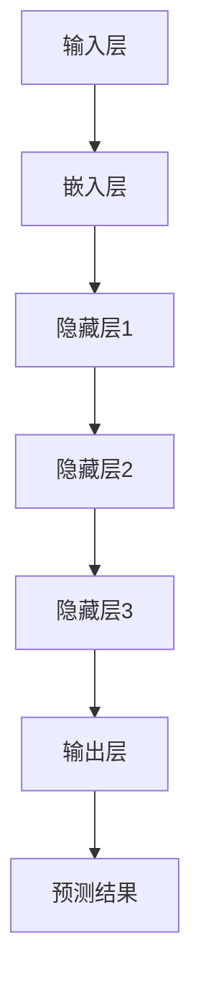

                 

关键词：大型语言模型（LLM），深度学习，自然语言处理，人工智能，神经网络，机器学习，语义理解，预训练模型，模型压缩，多模态学习，生成式模型，交互式应用

> 摘要：本文将深入探讨大型语言模型（LLM）这一近年来在人工智能领域引起革命性变化的模型。从背景介绍到核心概念、算法原理、数学模型、项目实践、实际应用场景，再到未来展望，我们将全面剖析LLM的发展历程、技术细节以及它在各个领域的应用潜力。通过本文，读者将能够了解到LLM的深度与广度，并对未来AI技术的发展趋势有更清晰的认知。

## 1. 背景介绍

随着信息时代的到来，数据量呈爆炸式增长，处理海量数据成为了许多行业的挑战。自然语言处理（NLP）作为人工智能的一个重要分支，旨在让计算机能够理解、生成和交互自然语言。在过去的几十年里，从规则驱动的方法到统计模型，NLP技术经历了多次迭代。然而，这些方法在处理复杂任务时仍然存在局限性。直到深度学习的崛起，NLP领域迎来了新的突破。

深度学习是一种基于多层神经网络的学习方法，它通过模拟人脑的神经网络结构，能够从大量数据中自动提取特征，进行复杂的模式识别。在NLP领域，深度学习模型如卷积神经网络（CNN）和循环神经网络（RNN）的应用极大地提高了文本处理的效率和准确性。然而，这些模型在面对大规模、复杂任务时仍然力不从心。

为了解决这一问题，研究者们开始探索更大的模型，即大型语言模型（LLM）。LLM通过预训练的方法，在大规模语料库上进行训练，从而获得对自然语言的深层理解。这一突破性的进展使得计算机在生成文本、翻译、问答等任务上达到了前所未有的水平。

## 2. 核心概念与联系

### 2.1 大型语言模型（LLM）

大型语言模型（LLM）是一种基于深度学习的自然语言处理模型，它通过预训练的方法，在大规模语料库上学习自然语言的统计规律和语义结构。LLM的核心组成部分包括：

- **输入层**：接收自然语言文本，并将其转换为模型可以处理的格式。
- **隐藏层**：通过多层神经网络结构，对输入文本进行特征提取和变换。
- **输出层**：根据隐藏层的输出，生成预测结果，如文本生成、分类、翻译等。

### 2.2 预训练与微调

预训练（Pre-training）是LLM的关键步骤，它通过在大规模语料库上进行无监督学习，使得模型能够自动获取丰富的语言知识和上下文信息。预训练完成后，模型通过微调（Fine-tuning）在特定任务上进行有监督学习，以适应具体的应用场景。

### 2.3 Mermaid 流程图

下面是一个简单的Mermaid流程图，展示了LLM的基本工作流程：

## 3. 核心算法原理 & 具体操作步骤

### 3.1 算法原理概述

LLM的核心算法是基于 Transformer 模型。Transformer 模型是一种基于自注意力（Self-Attention）机制的序列模型，它在处理长序列时具有优势。自注意力机制通过计算序列中每个元素之间的关联度，从而自动提取关键信息。

### 3.2 算法步骤详解

#### 3.2.1 自注意力机制

自注意力机制是Transformer模型的关键组件。它通过计算序列中每个元素与所有其他元素之间的相似性权重，然后将这些权重应用于输入序列，从而实现特征提取。

自注意力机制的数学表达式为：

$$
\text{Attention}(Q, K, V) = \text{softmax}(\frac{QK^T}{\sqrt{d_k}})V
$$

其中，Q、K、V 分别代表查询（Query）、键（Key）和值（Value）向量，d_k 为键向量的维度。

#### 3.2.2 Encoder-Decoder 结构

Transformer 模型采用 Encoder-Decoder 结构，其中 Encoder 用于编码输入序列，Decoder 用于解码输出序列。Encoder 和 Decoder 都由多个自注意力层和前馈网络（Feedforward Network）组成。

#### 3.2.3 模型训练

LLM 的训练分为两个阶段：预训练和微调。

- **预训练**：在预训练阶段，LLM 在大规模语料库上进行无监督学习，通过自注意力机制和多层神经网络，自动提取语言特征。
- **微调**：在预训练完成后，LLM 通过微调在特定任务上进行有监督学习，以适应具体的应用场景。

### 3.3 算法优缺点

#### 优点：

- **强大的语义理解能力**：通过预训练，LLM 能够自动获取丰富的语言知识和上下文信息，从而在自然语言处理任务中表现出色。
- **高效的处理速度**：Transformer 模型的并行计算能力较强，使得 LL
<|less|>

