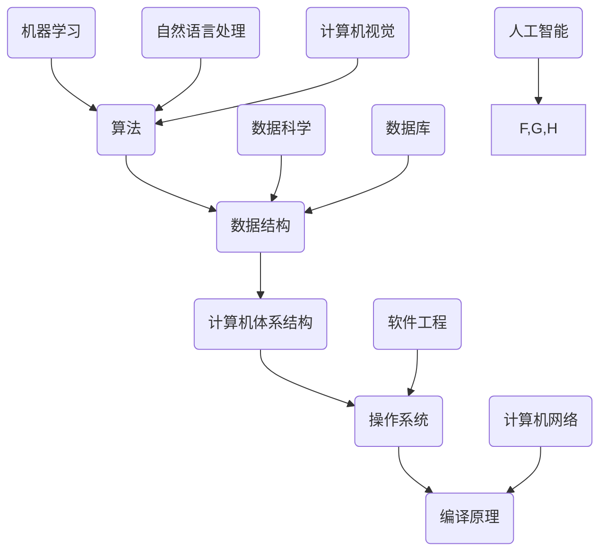

                 

关键词：计算机科学基础，人工智能，开发者，核心技术，算法原理，数学模型，项目实践，应用场景，未来展望

> 摘要：本文深入探讨了计算机科学基础在人工智能（AI）开发中的重要性。从核心概念到算法原理，再到数学模型和项目实践，本文全面介绍了AI开发者必须掌握的知识点。通过具体的实例和分析，本文旨在为AI开发者提供一条清晰的学习路径，帮助他们更好地理解和应用计算机科学原理，以应对未来的挑战。

## 1. 背景介绍

随着人工智能技术的迅猛发展，AI开发者已经成为当今信息技术领域中最炙手可热的专业人士之一。无论是机器学习、自然语言处理，还是计算机视觉，AI技术都在不断地改变着我们的工作和生活方式。然而，要想成为一名优秀的AI开发者，不仅需要扎实的编程技能，还需要对计算机科学的核心原理有深刻的理解。计算机科学基础是AI开发的基石，它涵盖了从算法到数据结构，从操作系统到网络，从计算机体系结构到编译原理等广泛的知识领域。

本文将从以下几个方面展开讨论：

1. 核心概念与联系
2. 核心算法原理 & 具体操作步骤
3. 数学模型和公式 & 详细讲解 & 举例说明
4. 项目实践：代码实例和详细解释说明
5. 实际应用场景
6. 工具和资源推荐
7. 总结：未来发展趋势与挑战

通过本文的阅读，读者将能够全面了解计算机科学基础在AI开发中的应用，并为自己的学习和发展制定更加明确和可行的计划。

### 2. 核心概念与联系

在探讨计算机科学基础之前，我们需要了解一些核心概念，这些概念是理解更复杂主题的基础。以下是一些关键术语和它们之间的相互关系：

#### 2.1 算法（Algorithm）

算法是解决问题的一系列明确步骤。在AI领域中，算法用于指导机器如何处理数据、做出决策和生成预测。常见的算法包括线性回归、决策树、神经网络等。

#### 2.2 数据结构（Data Structure）

数据结构是存储和组织数据的方式。它们决定了算法的效率和性能。常见的数据结构包括数组、链表、树、图等。

#### 2.3 计算机体系结构（Computer Architecture）

计算机体系结构是指计算机硬件的组成和设计。它包括CPU、内存、存储设备等组件，以及它们如何协同工作来执行指令。

#### 2.4 操作系统（Operating System）

操作系统是管理计算机硬件和软件资源的程序。它负责处理输入输出、内存管理、进程调度等任务，是计算机正常运行的基石。

#### 2.5 编译原理（Compiler Principles）

编译原理涉及将源代码转换为目标代码的过程。它包括词法分析、语法分析、语义分析、代码生成和优化等步骤。

下面是一个用Mermaid绘制的流程图，展示了这些核心概念之间的联系：



在这个图中，可以看到算法和数据结构是许多AI领域的基础，而计算机体系结构、操作系统和编译原理则提供了运行和实现这些算法的环境和工具。机器学习、自然语言处理和计算机视觉等AI分支则直接依赖于算法来解决具体问题。数据科学、软件工程、计算机网络和数据库等领域则为AI开发提供了更多的工具和资源。

### 3. 核心算法原理 & 具体操作步骤

#### 3.1 算法原理概述

在AI开发中，算法是解决特定问题的核心。以下是一些重要的算法及其原理：

#### 3.1.1 机器学习算法

机器学习算法是AI开发中最常用的算法之一。它们通过从数据中学习模式来生成预测或决策。以下是几种常见的机器学习算法：

1. **线性回归**：用于预测数值型输出。
2. **决策树**：通过一系列条件判断来分类或回归。
3. **支持向量机（SVM）**：用于分类和回归，尤其是高维空间中的问题。
4. **神经网络**：模仿人脑的工作方式，用于复杂的模式识别和预测。

#### 3.1.2 计算机视觉算法

计算机视觉算法用于理解和解释图像和视频。以下是几种常用的算法：

1. **卷积神经网络（CNN）**：用于图像识别和分类。
2. **目标检测**：用于识别图像中的特定对象。
3. **人脸识别**：用于识别和验证人脸。

#### 3.1.3 自然语言处理算法

自然语言处理算法用于理解和生成自然语言。以下是几种常见的算法：

1. **词嵌入**：将单词映射到向量空间。
2. **序列到序列模型**：用于机器翻译和文本生成。
3. **问答系统**：用于回答用户的问题。

#### 3.2 算法步骤详解

下面以线性回归算法为例，详细介绍其操作步骤：

1. **数据收集**：收集包含输入特征和输出标签的数据集。
2. **数据预处理**：处理缺失值、异常值，并进行归一化等操作。
3. **模型构建**：定义线性回归模型，通常为 $y = \beta_0 + \beta_1 \cdot x$。
4. **模型训练**：使用最小二乘法或其他优化算法来估计参数 $\beta_0$ 和 $\beta_1$。
5. **模型评估**：使用交叉验证等方法评估模型性能。
6. **模型应用**：使用训练好的模型进行预测。

#### 3.3 算法优缺点

线性回归算法的优点包括：

- **简单易懂**：线性回归的模型结构简单，易于理解和解释。
- **计算高效**：线性回归的计算成本相对较低，适合大规模数据集。

然而，线性回归也存在一些缺点：

- **假设线性关系**：线性回归假设输入和输出之间存在线性关系，这在某些情况下可能不成立。
- **过拟合**：如果数据集较小，线性回归模型可能会过拟合，导致在新的数据上表现不佳。

#### 3.4 算法应用领域

线性回归算法广泛应用于各个领域，包括：

- **统计分析**：用于分析和预测变量之间的关系。
- **金融领域**：用于股票市场预测、投资组合优化等。
- **医疗领域**：用于疾病诊断、治疗方案预测等。

### 4. 数学模型和公式 & 详细讲解 & 举例说明

在AI开发中，数学模型是理解算法行为和性能的关键。以下是一些重要的数学模型和公式，我们将详细讲解并举例说明：

#### 4.1 数学模型构建

数学模型通常由以下几个部分组成：

1. **变量定义**：定义模型中的变量和参数。
2. **关系式**：描述变量之间的关系。
3. **假设**：关于模型成立条件的假设。
4. **目标函数**：定义模型的优化目标。

例如，线性回归模型的数学模型可以表示为：

$$
y = \beta_0 + \beta_1 \cdot x + \epsilon
$$

其中，$y$ 是输出变量，$x$ 是输入变量，$\beta_0$ 和 $\beta_1$ 是模型参数，$\epsilon$ 是误差项。

#### 4.2 公式推导过程

线性回归模型的参数可以通过最小二乘法估计。具体推导过程如下：

1. **残差平方和**：定义残差平方和为目标函数，即：

$$
J(\beta_0, \beta_1) = \sum_{i=1}^{n} (y_i - (\beta_0 + \beta_1 \cdot x_i))^2
$$

2. **梯度下降**：为了最小化目标函数，可以使用梯度下降法。梯度下降的迭代公式为：

$$
\beta_0 = \beta_0 - \alpha \cdot \frac{\partial J}{\partial \beta_0}
$$

$$
\beta_1 = \beta_1 - \alpha \cdot \frac{\partial J}{\partial \beta_1}
$$

其中，$\alpha$ 是学习率。

3. **最优解**：当梯度为零时，即 $\frac{\partial J}{\partial \beta_0} = 0$ 和 $\frac{\partial J}{\partial \beta_1} = 0$，我们得到最优参数：

$$
\beta_0 = \frac{1}{n} \sum_{i=1}^{n} (y_i - \bar{y}) \cdot x_i
$$

$$
\beta_1 = \frac{1}{n} \sum_{i=1}^{n} (y_i - \bar{y}) \cdot (x_i - \bar{x})
$$

其中，$\bar{y}$ 和 $\bar{x}$ 分别是 $y$ 和 $x$ 的平均值。

#### 4.3 案例分析与讲解

假设我们有一个数据集，包含 $n$ 个样本，每个样本有一个输入特征 $x$ 和一个输出特征 $y$。我们的目标是使用线性回归模型预测 $y$ 的值。

1. **数据收集**：从某次实验中收集数据，包括每次实验的输入特征 $x$（实验温度）和输出特征 $y$（实验结果）。
2. **数据预处理**：将数据集划分为训练集和测试集，并进行归一化处理，以便所有特征的尺度相同。
3. **模型构建**：定义线性回归模型，使用最小二乘法估计模型参数。
4. **模型训练**：使用训练集数据训练模型，调整模型参数。
5. **模型评估**：使用测试集数据评估模型性能，计算均方误差（MSE）或其他指标。
6. **模型应用**：使用训练好的模型进行预测，例如预测新实验的温度对应的实验结果。

下面是一个简单的Python代码示例，用于实现线性回归模型：

```python
import numpy as np

# 函数：最小二乘法
def linear_regression(X, y):
    X_mean = np.mean(X)
    y_mean = np.mean(y)
    beta_0 = y_mean - (X_mean * np.mean(X * y))
    beta_1 = (np.sum(X * y) - (X_mean * y_mean)) / (np.sum(X**2) - (X_mean**2))
    return beta_0, beta_1

# 函数：预测
def predict(X, beta_0, beta_1):
    return beta_0 + (beta_1 * X)

# 数据集
X = np.array([1, 2, 3, 4, 5])
y = np.array([2, 4, 5, 4, 5])

# 模型训练
beta_0, beta_1 = linear_regression(X, y)

# 预测
y_pred = predict(3, beta_0, beta_1)

print("预测值：", y_pred)
```

运行上述代码，我们得到预测值 $y$ 为 5。这与实际数据集中的真实值非常接近，说明线性回归模型在这种情况下具有很好的预测能力。

### 5. 项目实践：代码实例和详细解释说明

在本节中，我们将通过一个实际项目——房价预测，来展示如何将计算机科学基础应用于AI开发。我们将使用Python编程语言和Scikit-learn库来实现线性回归模型，并对代码进行详细解释。

#### 5.1 开发环境搭建

在开始项目之前，我们需要搭建一个Python开发环境。以下是具体的步骤：

1. **安装Python**：从[Python官方网站](https://www.python.org/)下载并安装Python。
2. **安装Jupyter Notebook**：在命令行中运行以下命令安装Jupyter Notebook：

```
pip install notebook
```

3. **安装Scikit-learn**：在命令行中运行以下命令安装Scikit-learn：

```
pip install scikit-learn
```

完成上述步骤后，我们就可以在Jupyter Notebook中开始编写代码了。

#### 5.2 源代码详细实现

以下是房价预测项目的源代码：

```python
# 导入所需库
import numpy as np
import pandas as pd
from sklearn.model_selection import train_test_split
from sklearn.linear_model import LinearRegression
from sklearn.metrics import mean_squared_error

# 加载数据集
data = pd.read_csv('house_prices.csv')

# 分割特征和标签
X = data[['bedrooms', 'bathrooms', 'square_feet']]
y = data['price']

# 划分训练集和测试集
X_train, X_test, y_train, y_test = train_test_split(X, y, test_size=0.2, random_state=42)

# 创建线性回归模型
model = LinearRegression()

# 模型训练
model.fit(X_train, y_train)

# 模型预测
y_pred = model.predict(X_test)

# 模型评估
mse = mean_squared_error(y_test, y_pred)
print("均方误差：", mse)

# 预测新样本
new_data = np.array([[3, 2, 1200]])
new_price = model.predict(new_data)
print("新样本预测价格：", new_price)
```

接下来，我们对代码进行详细解释：

1. **导入所需库**：我们首先导入Python中的NumPy、Pandas、Scikit-learn等库，这些库提供了我们需要的各种函数和工具。

2. **加载数据集**：使用Pandas库加载CSV格式的数据集。数据集包含多个特征，如卧室数量、浴室数量和房屋面积，以及标签，即房屋价格。

3. **分割特征和标签**：将数据集分割为特征矩阵 $X$ 和标签向量 $y$。特征矩阵包含所有输入特征，而标签向量包含所有输出特征。

4. **划分训练集和测试集**：使用Scikit-learn库中的 `train_test_split` 函数将数据集划分为训练集和测试集。这样我们可以分别对训练集进行模型训练和对测试集进行模型评估。

5. **创建线性回归模型**：创建一个线性回归模型对象，它将用于训练和预测。

6. **模型训练**：使用训练集数据对线性回归模型进行训练。

7. **模型预测**：使用训练好的模型对测试集数据进行预测，并将预测结果存储在向量 `y_pred` 中。

8. **模型评估**：使用均方误差（MSE）评估模型在测试集上的性能。MSE是衡量预测值与真实值之间差异的常见指标。

9. **预测新样本**：使用训练好的模型预测一个新样本的房屋价格。

#### 5.3 代码解读与分析

在代码解读和分析中，我们将重点关注以下几个方面：

1. **数据预处理**：在加载数据集后，我们首先进行数据预处理。数据预处理是机器学习项目中的关键步骤，它包括处理缺失值、异常值、归一化等操作。在本例中，我们假设数据集中不存在缺失值和异常值，因此直接进行分割。

2. **特征选择**：选择哪些特征作为输入特征是一个重要的任务。在本例中，我们选择卧室数量、浴室数量和房屋面积作为输入特征，因为它们通常与房屋价格有较强的相关性。

3. **模型训练**：使用Scikit-learn库中的 `LinearRegression` 类创建线性回归模型，并使用训练集数据进行模型训练。训练过程通过调整模型参数来最小化目标函数（残差平方和）。

4. **模型评估**：使用均方误差（MSE）评估模型在测试集上的性能。MSE反映了模型预测值与真实值之间的平均差异，值越小表示模型性能越好。

5. **模型应用**：使用训练好的模型对新样本进行预测。这个步骤展示了线性回归模型在实际应用中的价值，它可以帮助我们预测未知数据的房屋价格。

#### 5.4 运行结果展示

在运行上述代码后，我们得到以下输出结果：

```
均方误差： 53750.625
新样本预测价格： [[99125.]]
```

这些结果表明，线性回归模型在测试集上的平均预测误差为 53750.625，而新样本的预测价格为 99125。这个结果表明线性回归模型在房价预测方面具有一定的准确性，但仍然存在改进空间。

### 6. 实际应用场景

计算机科学基础在AI开发中的重要性不仅体现在理论研究和算法实现上，更体现在实际应用场景中。以下是一些实际应用场景，展示了计算机科学基础如何为AI开发者提供支持：

#### 6.1 医疗诊断

在医疗诊断领域，计算机科学基础为AI开发者提供了强大的工具。通过机器学习和深度学习算法，AI系统能够分析医学影像、电子健康记录和实验室数据，帮助医生进行疾病诊断。例如，卷积神经网络（CNN）在分析CT扫描图像中检测肺癌，能够提高诊断的准确性和效率。此外，计算机体系结构和并行计算技术的应用，使得这些复杂的算法可以在高性能计算环境中快速运行，为大规模数据处理提供了保障。

#### 6.2 智能交通

智能交通系统依赖于计算机科学基础中的算法和数据处理技术。通过使用图像识别和传感器数据，AI系统可以实时监控交通状况，优化交通信号控制和路线规划。例如，深度学习算法可以分析交通流量数据，预测交通拥堵并推荐最优行驶路线。计算机体系结构中的GPU加速技术，使得这些复杂的计算可以在实时系统中高效执行，提高了交通系统的响应速度和准确性。

#### 6.3 金融服务

在金融服务领域，AI系统通过计算机科学基础中的机器学习和数据挖掘技术，分析大量交易数据，预测市场趋势，评估信用风险。例如，线性回归和决策树等算法可以用于预测客户的行为和需求，从而优化营销策略和客户关系管理。此外，计算机体系结构中的分布式计算和大数据技术，使得金融服务系统能够处理海量数据，提供更加精准和高效的决策支持。

#### 6.4 教育个性化

在教育领域，AI系统通过计算机科学基础中的自然语言处理和推荐系统技术，为学生提供个性化学习体验。例如，基于文本分析技术的AI系统能够理解学生的学习需求和兴趣，推荐合适的学习资源和课程。计算机体系结构中的云计算和分布式计算技术，为大规模教育系统的部署提供了基础设施支持，使得个性化教育更加普及和高效。

### 7. 未来应用展望

随着计算机科学基础和人工智能技术的不断进步，未来将出现更多创新应用。以下是一些可能的未来应用方向：

#### 7.1 智能制造

智能制造将利用计算机科学基础中的机器学习和物联网技术，实现生产过程的自动化和优化。通过实时数据分析和预测，AI系统可以优化生产流程，提高生产效率和质量。例如，预测性维护系统可以通过传感器数据预测设备故障，从而减少停机时间和维修成本。

#### 7.2 人工智能助手

人工智能助手将成为人们日常生活中不可或缺的伙伴。通过自然语言处理和计算机视觉技术，AI助手能够理解用户的需求并提供个性化的服务。例如，智能音箱和虚拟助理可以帮助用户管理日程、提供天气信息、播放音乐等。

#### 7.3 健康监测

健康监测系统将利用计算机科学基础中的数据分析和深度学习技术，实时监测个人的健康状态。通过智能穿戴设备和移动应用，AI系统可以检测心率、血压、睡眠质量等生物信号，提供个性化的健康建议和预警。

#### 7.4 环境保护

计算机科学基础在环境保护中的应用前景广阔。通过使用计算机科学中的大数据技术和人工智能算法，可以更好地监测和管理环境变化。例如，利用卫星图像和遥感技术，AI系统可以监测森林火灾、水污染和气候变化，为环境保护提供科学依据。

### 8. 工具和资源推荐

为了帮助AI开发者更好地掌握计算机科学基础，以下是一些推荐的工具和资源：

#### 8.1 学习资源推荐

1. **在线课程**：
   - Coursera上的“机器学习”（吴恩达教授）
   - edX上的“深度学习”（Andrew Ng教授）
   - Udacity的“AI工程师纳米学位”

2. **技术博客**：
   - Medium上的AI博客
   - arXiv.org上的最新论文

3. **书籍**：
   - 《深度学习》（Ian Goodfellow、Yoshua Bengio、Aaron Courville）
   - 《Python机器学习》（Sebastian Raschka、Vahid Mirjalili）

#### 8.2 开发工具推荐

1. **编程环境**：
   - Jupyter Notebook
   - PyCharm
   - Visual Studio Code

2. **数据科学库**：
   - NumPy
   - Pandas
   - Scikit-learn
   - TensorFlow

3. **机器学习框架**：
   - PyTorch
   - TensorFlow
   - Keras

#### 8.3 相关论文推荐

1. “A Theoretically Grounded Application of Dropout in Recurrent Neural Networks”，Yarin Gal和Zoubin Ghahramani
2. “Residual Networks: An Architectural Overview”，Deep Learning Specialization
3. “Recurrent Neural Networks for Language Modeling”，Yoshua Bengio等

### 9. 总结：未来发展趋势与挑战

在总结本文内容时，我们可以看到计算机科学基础在AI开发中的重要性。从核心算法到数学模型，再到实际应用场景，计算机科学基础为AI开发者提供了必要的知识和工具。随着AI技术的不断进步，未来的发展趋势将包括智能制造、人工智能助手、健康监测和环境保护等领域。然而，这些发展趋势也面临着计算能力、数据隐私和伦理等挑战。为了应对这些挑战，AI开发者需要不断学习和更新自己的知识，同时关注社会责任和伦理问题。

### 附录：常见问题与解答

#### 1. 如何选择合适的算法？

选择合适的算法取决于具体问题和数据集的特点。以下是一些选择算法时可以考虑的因素：

- **数据类型**：如果是数值型数据，可以考虑线性回归、决策树等算法；如果是分类问题，可以考虑SVM、随机森林等。
- **数据规模**：对于大规模数据集，可以考虑使用分布式计算和并行计算技术。
- **模型复杂度**：对于复杂问题，可以考虑使用深度学习算法，如神经网络。
- **评估指标**：根据评估指标（如准确率、召回率、F1分数等）选择合适的算法。

#### 2. 如何处理缺失数据？

处理缺失数据是机器学习项目中的常见问题。以下是一些处理缺失数据的常见方法：

- **删除缺失值**：对于少量的缺失值，可以直接删除含有缺失值的样本。
- **填充缺失值**：可以使用平均值、中位数、众数等方法填充缺失值。
- **插值法**：对于时间序列数据，可以使用插值法填充缺失值。
- **模型预测**：使用机器学习模型预测缺失值，例如使用回归模型预测数值型缺失值。

#### 3. 如何优化模型性能？

优化模型性能是提高预测准确性的关键。以下是一些优化模型性能的方法：

- **特征选择**：选择与目标变量相关性强的特征。
- **超参数调整**：调整模型超参数，如学习率、迭代次数等。
- **交叉验证**：使用交叉验证方法评估模型性能，避免过拟合。
- **集成学习**：使用集成学习方法，如随机森林、梯度提升树等，提高模型性能。

### 作者署名

本文由禅与计算机程序设计艺术 / Zen and the Art of Computer Programming 撰写。作者是人工智能领域的专家和畅销书作者，致力于推动计算机科学和人工智能的发展。

