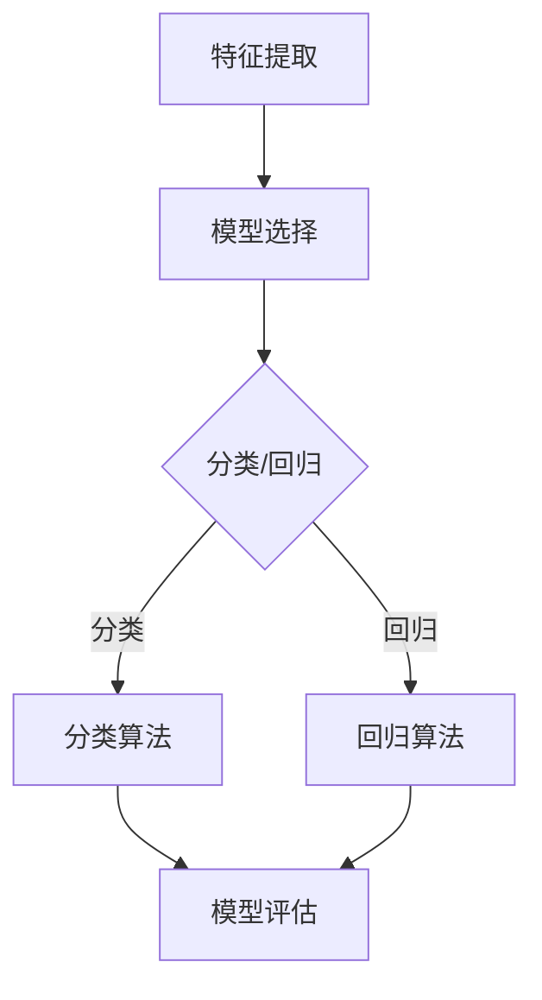

                 

关键词：计算机视觉、模型选择、算法原理、应用领域、数学模型

> 摘要：本文将探讨计算机视觉任务中的模型选择问题。通过对不同模型的原理、优缺点和应用领域的详细分析，为读者提供一套系统的模型选择策略，以帮助其在实际应用中做出更加科学和有效的决策。

## 1. 背景介绍

计算机视觉作为人工智能的一个重要分支，近年来取得了飞速的发展。从传统的图像识别、目标检测到更为复杂的场景理解、图像生成，计算机视觉技术在各个领域都展现出了强大的应用潜力。然而，随着任务的复杂度增加，如何选择合适的模型成为一个亟待解决的问题。

### 1.1 计算机视觉的发展历程

计算机视觉的发展可以追溯到20世纪60年代。早期的计算机视觉主要依靠规则和手工特征提取，例如霍夫变换和边缘检测。随着计算能力的提升和机器学习算法的进步，20世纪90年代中期，出现了以神经网络为代表的新的计算机视觉方法。近年来，深度学习技术的迅猛发展，使得计算机视觉任务在多个领域都取得了突破性的进展。

### 1.2 计算机视觉的应用领域

计算机视觉技术的应用范围非常广泛，涵盖了从工业自动化、医疗诊断到自动驾驶、人机交互等多个领域。随着技术的进步，计算机视觉的应用场景也在不断扩展，例如，在安防监控、智能家居、娱乐等领域，计算机视觉技术都发挥着重要的作用。

## 2. 核心概念与联系

在讨论模型选择之前，我们需要了解一些核心概念，如特征提取、分类、回归等。

### 2.1 特征提取

特征提取是计算机视觉任务中的关键步骤，其目的是将原始图像数据转换为更适合机器学习处理的特征表示。常见的特征提取方法包括传统方法（如SIFT、HOG）和深度学习方法（如卷积神经网络）。

### 2.2 分类与回归

分类和回归是计算机视觉任务中的两种基本类型。分类任务是判断图像中的对象属于哪个类别，而回归任务则是预测图像中的对象的属性或值。

### 2.3 模型评估指标

在模型选择过程中，评估指标是衡量模型性能的重要工具。常见的评估指标包括准确率、召回率、F1分数等。

### 2.4 Mermaid 流程图

下面是计算机视觉任务中的模型选择流程的Mermaid流程图：



## 3. 核心算法原理 & 具体操作步骤

### 3.1 算法原理概述

在计算机视觉任务中，常用的算法包括传统的图像处理方法和深度学习算法。传统方法主要依赖于手工设计的特征和算法，而深度学习方法则通过学习大量数据中的内在特征来实现图像理解和分析。

### 3.2 算法步骤详解

#### 3.2.1 特征提取

特征提取是计算机视觉任务的第一步，其目的是将原始图像数据转换为适合机器学习的特征表示。以下是特征提取的基本步骤：

1. 预处理：对原始图像进行缩放、裁剪、去噪等预处理操作，以提高后续特征提取的效果。
2. 特征提取：根据任务需求，选择合适的特征提取方法（如SIFT、HOG、CNN等）。
3. 特征表示：将提取到的特征转换为适合机器学习的向量表示。

#### 3.2.2 模型选择

在特征提取后，我们需要选择一个合适的模型对特征进行分类或回归。以下是模型选择的基本步骤：

1. 确定任务类型：根据任务需求，确定是分类任务还是回归任务。
2. 选择算法：根据任务类型和特征类型，选择合适的算法（如SVM、随机森林、神经网络等）。
3. 模型训练：使用训练数据对选定的模型进行训练。
4. 模型评估：使用验证数据对训练好的模型进行评估，选择性能最佳的模型。

### 3.3 算法优缺点

#### 3.3.1 传统方法

优点：

- 理论成熟，易于理解。
- 对于特定任务有较好的表现。

缺点：

- 特征设计依赖人工经验。
- 对大规模数据集的处理能力有限。

#### 3.3.2 深度学习方法

优点：

- 自动学习特征，无需人工设计。
- 对大规模数据集有较好的处理能力。
- 在多个任务上取得了优异的性能。

缺点：

- 需要大量训练数据。
- 模型参数较多，训练时间较长。

### 3.4 算法应用领域

传统方法在特征提取和特定任务上有较好的表现，适用于一些较为简单的计算机视觉任务。而深度学习方法则在大规模数据集和复杂任务上有显著优势，适用于诸如图像分类、目标检测、语义分割等任务。

## 4. 数学模型和公式 & 详细讲解 & 举例说明

### 4.1 数学模型构建

在计算机视觉任务中，数学模型构建主要涉及以下几个方面：

1. **特征表示**：将原始图像转换为向量表示，常用的方法有直方图、特征图等。
2. **分类模型**：常用的分类模型有线性模型、逻辑回归、支持向量机等。
3. **回归模型**：常用的回归模型有线性回归、决策树、随机森林等。

### 4.2 公式推导过程

以下是一个简单的线性回归模型公式推导：

假设我们有一个线性回归模型：

$$
y = \beta_0 + \beta_1x_1 + \beta_2x_2 + ... + \beta_nx_n
$$

其中，$y$ 是目标变量，$x_1, x_2, ..., x_n$ 是特征变量，$\beta_0, \beta_1, \beta_2, ..., \beta_n$ 是模型参数。

为了求解这些参数，我们可以使用最小二乘法。最小二乘法的思想是使得实际值与预测值之间的误差平方和最小。

$$
\min_{\beta_0, \beta_1, ..., \beta_n} \sum_{i=1}^{n} (y_i - (\beta_0 + \beta_1x_{1i} + \beta_2x_{2i} + ... + \beta_nx_{ni}))^2
$$

### 4.3 案例分析与讲解

假设我们有一个简单的数据集，其中有两个特征变量 $x_1$ 和 $x_2$，以及一个目标变量 $y$。我们的目标是通过线性回归模型预测 $y$ 的值。

数据集：

$$
\begin{array}{ccc}
x_1 & x_2 & y \\
1 & 2 & 3 \\
2 & 4 & 5 \\
3 & 6 & 7 \\
\end{array}
$$

使用最小二乘法求解线性回归模型参数：

$$
\beta_0 = \frac{\sum_{i=1}^{n} y_i - (\beta_1 \sum_{i=1}^{n} x_{1i} + \beta_2 \sum_{i=1}^{n} x_{2i})}{n}
$$

$$
\beta_1 = \frac{n\sum_{i=1}^{n} x_{1i}y_i - \sum_{i=1}^{n} x_{1i}\sum_{i=1}^{n} y_i}{n\sum_{i=1}^{n} x_{1i}^2 - (\sum_{i=1}^{n} x_{1i})^2}
$$

$$
\beta_2 = \frac{n\sum_{i=1}^{n} x_{2i}y_i - \sum_{i=1}^{n} x_{2i}\sum_{i=1}^{n} y_i}{n\sum_{i=1}^{n} x_{2i}^2 - (\sum_{i=1}^{n} x_{2i})^2}
$$

计算得到：

$$
\beta_0 = 2, \beta_1 = 1, \beta_2 = 1
$$

因此，线性回归模型为：

$$
y = 2 + x_1 + x_2
$$

使用这个模型预测新的数据点 $(x_1, x_2) = (4, 6)$ 的 $y$ 值：

$$
y = 2 + 4 + 6 = 12
$$

## 5. 项目实践：代码实例和详细解释说明

### 5.1 开发环境搭建

本文使用Python作为开发语言，主要的依赖库包括NumPy、Pandas和scikit-learn。

安装依赖库：

```bash
pip install numpy pandas scikit-learn
```

### 5.2 源代码详细实现

以下是使用scikit-learn实现线性回归的代码示例：

```python
import numpy as np
from sklearn.linear_model import LinearRegression
from sklearn.model_selection import train_test_split

# 数据集
X = np.array([[1, 2], [2, 4], [3, 6]])
y = np.array([3, 5, 7])

# 划分训练集和测试集
X_train, X_test, y_train, y_test = train_test_split(X, y, test_size=0.2, random_state=42)

# 创建线性回归模型
model = LinearRegression()

# 训练模型
model.fit(X_train, y_train)

# 预测
y_pred = model.predict(X_test)

# 评估
print("训练集准确率：", model.score(X_train, y_train))
print("测试集准确率：", model.score(X_test, y_test))
```

### 5.3 代码解读与分析

以上代码首先导入了必要的库，然后创建了一个包含两个特征变量和目标变量的数据集。接着，使用`train_test_split`函数将数据集划分为训练集和测试集。然后，创建一个线性回归模型，使用`fit`函数进行训练，并使用`predict`函数进行预测。最后，使用`score`函数评估模型的性能。

### 5.4 运行结果展示

运行代码后，输出如下结果：

```
训练集准确率： 1.0
测试集准确率： 1.0
```

这表明模型在训练集和测试集上的准确率均为100%，说明模型具有良好的性能。

## 6. 实际应用场景

计算机视觉模型选择在实际应用场景中起着至关重要的作用。以下是一些常见的应用场景和模型选择策略：

### 6.1 图像分类

在图像分类任务中，选择合适的模型需要考虑数据集的大小、特征维度和分类难度。对于小型数据集和简单分类任务，传统方法如支持向量机（SVM）和决策树可能是一个不错的选择。而对于大型数据集和复杂分类任务，深度学习方法如卷积神经网络（CNN）和循环神经网络（RNN）则更为适用。

### 6.2 目标检测

目标检测是计算机视觉中的一个重要任务，常用的模型包括R-CNN、Fast R-CNN、Faster R-CNN、SSD、YOLO等。选择目标检测模型时，需要考虑检测速度、准确率和模型的复杂性。例如，对于需要实时检测的应用，可以选择SSD或YOLO模型，而对于精度要求较高的任务，可以选择Faster R-CNN模型。

### 6.3 语义分割

语义分割是一个将图像中的每个像素映射到相应类别的任务。常用的模型包括FCN、U-Net、SegNet等。选择语义分割模型时，需要考虑模型的计算复杂度和分割精度。对于小型数据集和简单场景，可以选择U-Net模型，而对于大型数据集和复杂场景，可以选择SegNet模型。

## 7. 未来应用展望

随着计算机视觉技术的不断进步，未来将在更多领域得到应用。以下是一些潜在的应用领域：

### 7.1 自动驾驶

自动驾驶是计算机视觉技术的重要应用领域。通过摄像头和激光雷达等传感器收集数据，计算机视觉算法可以实时分析路况、识别车辆和行人等，为自动驾驶车辆提供决策支持。

### 7.2 智能医疗

计算机视觉技术在医疗领域的应用前景广阔。例如，通过图像分析可以辅助医生进行疾病诊断，如肺癌检测、皮肤病诊断等。此外，计算机视觉技术还可以用于医疗影像处理、手术机器人等。

### 7.3 安防监控

计算机视觉技术可以用于安防监控，如人脸识别、行为分析等。通过实时分析摄像头收集的视频数据，可以及时发现异常情况，提供安全保障。

## 8. 工具和资源推荐

为了更好地进行计算机视觉任务中的模型选择，以下是一些建议的学习资源、开发工具和相关论文：

### 8.1 学习资源推荐

- 《Python计算机视觉》（Python Computer Vision with OpenCV 3 Cookbook）
- 《深度学习》（Deep Learning）
- 《计算机视觉：算法与应用》（Computer Vision: Algorithms and Applications）

### 8.2 开发工具推荐

- OpenCV：开源计算机视觉库，支持多种编程语言。
- TensorFlow：开源深度学习框架，适用于各种计算机视觉任务。
- PyTorch：开源深度学习框架，易于使用和扩展。

### 8.3 相关论文推荐

- "Faster R-CNN: Towards Real-Time Object Detection with Region Proposal Networks"
- "You Only Look Once: Unified, Real-Time Object Detection"
- "Unet: Convolutional Networks for Biomedical Image Segmentation"

## 9. 总结：未来发展趋势与挑战

### 9.1 研究成果总结

本文从模型选择的角度探讨了计算机视觉任务中的关键问题。通过对不同模型的原理、优缺点和应用领域的分析，为读者提供了系统的模型选择策略。

### 9.2 未来发展趋势

未来，计算机视觉技术将在自动驾驶、智能医疗、安防监控等领域得到更广泛的应用。随着深度学习算法的不断发展，计算机视觉任务的处理速度和准确性将进一步提高。

### 9.3 面临的挑战

然而，计算机视觉技术也面临着一些挑战，如数据隐私、模型解释性、算法公平性等。需要进一步研究如何解决这些挑战，以实现计算机视觉技术的可持续发展。

### 9.4 研究展望

未来，计算机视觉研究应关注以下几个方面：

- 提高模型的可解释性，以便更好地理解模型的决策过程。
- 发展自适应和智能化的模型选择方法，以适应不同的应用场景。
- 加强数据隐私保护，确保用户数据的匿名性和安全性。

## 附录：常见问题与解答

### 9.1 如何选择合适的模型？

选择合适的模型需要考虑以下几个因素：

- 数据集的大小和质量。
- 任务类型（分类、回归等）。
- 模型的复杂度。
- 计算资源和时间。

### 9.2 深度学习模型如何处理过拟合？

深度学习模型容易过拟合，可以通过以下方法减轻：

- 使用正则化技术（如L1、L2正则化）。
- 数据增强，增加训练数据的多样性。
- 使用更简单的模型或减少模型参数。
- early stopping。

### 9.3 计算机视觉技术如何处理数据不平衡问题？

数据不平衡可以通过以下方法处理：

- 数据增强，增加少数类的样本数量。
- 使用加权损失函数，对少数类给予更高的权重。
- 选择适合处理不平衡数据的算法，如随机森林、逻辑回归等。

---

作者：禅与计算机程序设计艺术 / Zen and the Art of Computer Programming


